# Interactive Widgets

<cite>
**Referenced Files in This Document**
- [AudioSynthesizer.tsx](file://frontend/src/components/AudioSynthesizer.tsx)
- [VoiceCloning.tsx](file://frontend/src/components/VoiceCloning.tsx)
- [VoiceProfileSelector.tsx](file://frontend/src/components/VoiceProfileSelector.tsx)
- [PayGOWallet.tsx](file://frontend/src/components/PayGOWallet.tsx)
- [PayGOSessionManager.tsx](file://frontend/src/components/PayGOSessionManager.tsx)
- [UsageTracker.tsx](file://frontend/src/components/UsageTracker.tsx)
- [BookAccessGate.tsx](file://frontend/src/components/BookAccessGate.tsx)
- [ChapterEditor.tsx](file://frontend/src/components/ChapterEditor.tsx)
- [CueTimelineEditor.tsx](file://frontend/src/components/CueTimelineEditor.tsx)
- [usePayGO.ts](file://frontend/src/hooks/usePayGO.ts)
- [ttsService.ts](file://frontend/src/services/ttsService.ts)
- [usageTrackingService.ts](file://frontend/src/services/usageTrackingService.ts)
- [voiceCloningService.ts](file://frontend/src/services/voiceCloningService.ts)
- [types.ts](file://frontend/src/types/types.ts)
- [types-extended.ts](file://frontend/src/types/types-extended.ts)
- [payments.ts](file://frontend/src/types/payments.ts)
</cite>

## Table of Contents
1. [Introduction](#introduction)
2. [Project Structure](#project-structure)
3. [Core Components](#core-components)
4. [Architecture Overview](#architecture-overview)
5. [Detailed Component Analysis](#detailed-component-analysis)
6. [Dependency Analysis](#dependency-analysis)
7. [Performance Considerations](#performance-considerations)
8. [Troubleshooting Guide](#troubleshooting-guide)
9. [Conclusion](#conclusion)
10. [Appendices](#appendices)

## Introduction
This document provides comprehensive documentation for interactive widgets and specialized components used in content creation, narration, and usage-based payment workflows. It covers:
- AudioSynthesizer for text-to-speech generation with word-level timing and browser fallback
- VoiceCloning interface for creating custom narrator profiles
- VoiceProfileSelector for narrator customization
- PayGOWallet and PayGOSessionManager for usage-based payment systems
- UsageTracker for resource consumption monitoring
- BookAccessGate for content protection and access control
- ChapterEditor and CueTimelineEditor for content creation tools

It also includes examples of widget integration, state management, real-time updates, extension guidelines, and integration tips with creator tools.

## Project Structure
The interactive widgets reside in the frontend under src/components and are supported by services, hooks, and shared types.

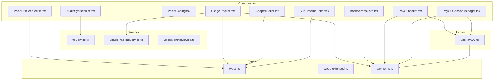

**Diagram sources**
- [AudioSynthesizer.tsx:1-495](file://frontend/src/components/AudioSynthesizer.tsx#L1-L495)
- [VoiceCloning.tsx:1-381](file://frontend/src/components/VoiceCloning.tsx#L1-L381)
- [VoiceProfileSelector.tsx:1-265](file://frontend/src/components/VoiceProfileSelector.tsx#L1-L265)
- [PayGOWallet.tsx:1-299](file://frontend/src/components/PayGOWallet.tsx#L1-L299)
- [PayGOSessionManager.tsx:1-294](file://frontend/src/components/PayGOSessionManager.tsx#L1-L294)
- [UsageTracker.tsx:1-126](file://frontend/src/components/UsageTracker.tsx#L1-L126)
- [BookAccessGate.tsx:1-119](file://frontend/src/components/BookAccessGate.tsx#L1-L119)
- [ChapterEditor.tsx:1-210](file://frontend/src/components/ChapterEditor.tsx#L1-L210)
- [CueTimelineEditor.tsx:1-152](file://frontend/src/components/CueTimelineEditor.tsx#L1-L152)
- [usePayGO.ts:1-315](file://frontend/src/hooks/usePayGO.ts#L1-L315)
- [ttsService.ts:1-381](file://frontend/src/services/ttsService.ts#L1-L381)
- [usageTrackingService.ts:1-174](file://frontend/src/services/usageTrackingService.ts#L1-L174)
- [voiceCloningService.ts:1-260](file://frontend/src/services/voiceCloningService.ts#L1-L260)
- [types.ts:1-110](file://frontend/src/types/types.ts#L1-L110)
- [types-extended.ts:1-292](file://frontend/src/types/types-extended.ts#L1-L292)
- [payments.ts:1-195](file://frontend/src/types/payments.ts#L1-L195)

**Section sources**
- [AudioSynthesizer.tsx:1-495](file://frontend/src/components/AudioSynthesizer.tsx#L1-L495)
- [VoiceCloning.tsx:1-381](file://frontend/src/components/VoiceCloning.tsx#L1-L381)
- [VoiceProfileSelector.tsx:1-265](file://frontend/src/components/VoiceProfileSelector.tsx#L1-L265)
- [PayGOWallet.tsx:1-299](file://frontend/src/components/PayGOWallet.tsx#L1-L299)
- [PayGOSessionManager.tsx:1-294](file://frontend/src/components/PayGOSessionManager.tsx#L1-L294)
- [UsageTracker.tsx:1-126](file://frontend/src/components/UsageTracker.tsx#L1-L126)
- [BookAccessGate.tsx:1-119](file://frontend/src/components/BookAccessGate.tsx#L1-L119)
- [ChapterEditor.tsx:1-210](file://frontend/src/components/ChapterEditor.tsx#L1-L210)
- [CueTimelineEditor.tsx:1-152](file://frontend/src/components/CueTimelineEditor.tsx#L1-L152)
- [usePayGO.ts:1-315](file://frontend/src/hooks/usePayGO.ts#L1-L315)
- [ttsService.ts:1-381](file://frontend/src/services/ttsService.ts#L1-L381)
- [usageTrackingService.ts:1-174](file://frontend/src/services/usageTrackingService.ts#L1-L174)
- [voiceCloningService.ts:1-260](file://frontend/src/services/voiceCloningService.ts#L1-L260)
- [types.ts:1-110](file://frontend/src/types/types.ts#L1-L110)
- [types-extended.ts:1-292](file://frontend/src/types/types-extended.ts#L1-L292)
- [payments.ts:1-195](file://frontend/src/types/payments.ts#L1-L195)

## Core Components
- AudioSynthesizer: Converts chapter text to audio with voice selection, speed/pitch control, word-level timestamps, and browser fallback.
- VoiceCloning: Records or uploads audio samples, submits them for AI training, previews results, and manages voice clones.
- VoiceProfileSelector: Filters and selects narrator voices with search, gender/style filters, and sample playback.
- PayGOWallet: Displays balances, supports deposits, and shows transaction stats.
- PayGOSessionManager: Starts/ends PayGO sessions, tracks time and charges, and handles wallet checks.
- UsageTracker: Tracks reading/listening sessions, calculates costs, and persists sessions.
- BookAccessGate: Enforces access policies for books (purchase vs pay-per-use) and estimates reading time.
- ChapterEditor: Rich-text editor for chapters with ordering, deletion, and word count estimation.
- CueTimelineEditor: Creates timed cues (formula, visual, steps) aligned to audio duration.

**Section sources**
- [AudioSynthesizer.tsx:1-495](file://frontend/src/components/AudioSynthesizer.tsx#L1-L495)
- [VoiceCloning.tsx:1-381](file://frontend/src/components/VoiceCloning.tsx#L1-L381)
- [VoiceProfileSelector.tsx:1-265](file://frontend/src/components/VoiceProfileSelector.tsx#L1-L265)
- [PayGOWallet.tsx:1-299](file://frontend/src/components/PayGOWallet.tsx#L1-L299)
- [PayGOSessionManager.tsx:1-294](file://frontend/src/components/PayGOSessionManager.tsx#L1-L294)
- [UsageTracker.tsx:1-126](file://frontend/src/components/UsageTracker.tsx#L1-L126)
- [BookAccessGate.tsx:1-119](file://frontend/src/components/BookAccessGate.tsx#L1-L119)
- [ChapterEditor.tsx:1-210](file://frontend/src/components/ChapterEditor.tsx#L1-L210)
- [CueTimelineEditor.tsx:1-152](file://frontend/src/components/CueTimelineEditor.tsx#L1-L152)

## Architecture Overview
The widgets integrate with services and hooks to manage state, perform network calls, and synchronize real-time updates.

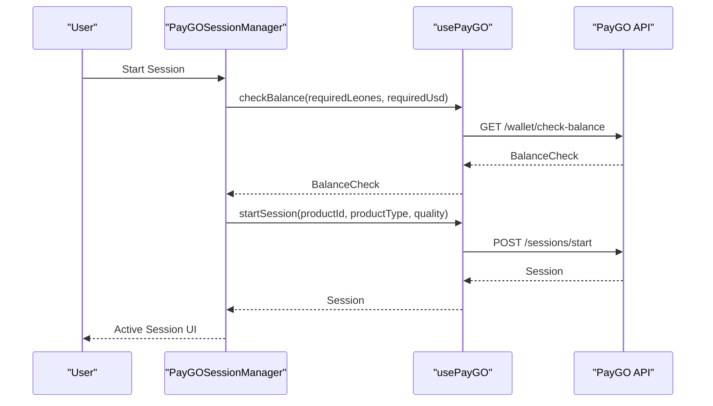

**Diagram sources**
- [PayGOSessionManager.tsx:83-108](file://frontend/src/components/PayGOSessionManager.tsx#L83-L108)
- [usePayGO.ts:164-202](file://frontend/src/hooks/usePayGO.ts#L164-L202)

**Section sources**
- [PayGOSessionManager.tsx:1-294](file://frontend/src/components/PayGOSessionManager.tsx#L1-L294)
- [usePayGO.ts:1-315](file://frontend/src/hooks/usePayGO.ts#L1-L315)

## Detailed Component Analysis

### AudioSynthesizer
- Purpose: Turn chapter text into audio with customizable voice, speed, and pitch; provide word-level timestamps for synchronized highlighting.
- Key behaviors:
  - Loads available voices and persists user preferences in localStorage.
  - Supports batch synthesis with progress and cancellation.
  - Integrates Media Session API for OS-wide media controls.
  - Provides keyboard shortcuts for playback control.
  - Estimates cost and character count for unsynthesized chapters.
- State management:
  - Local state for voices, preferences, synthesis progress, and word timestamps.
  - Refs for audio elements and AbortController for cancellation.
- Integration examples:
  - Pass chapters array and an onChaptersChange handler to persist audio URLs and durations.
  - Use wordTimestamps and highlightedWordIndex to drive synchronized UI highlights.

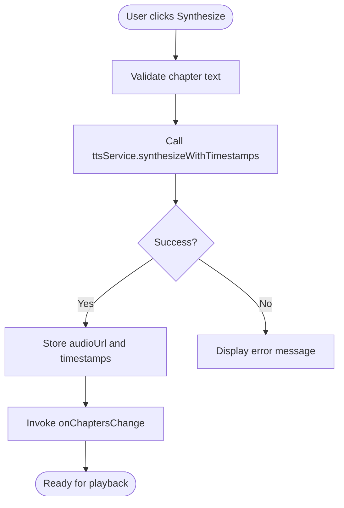

**Diagram sources**
- [AudioSynthesizer.tsx:166-200](file://frontend/src/components/AudioSynthesizer.tsx#L166-L200)
- [ttsService.ts:181-207](file://frontend/src/services/ttsService.ts#L181-L207)

**Section sources**
- [AudioSynthesizer.tsx:1-495](file://frontend/src/components/AudioSynthesizer.tsx#L1-L495)
- [ttsService.ts:1-381](file://frontend/src/services/ttsService.ts#L1-L381)

### VoiceCloning
- Purpose: Capture or upload voice samples, submit them for AI training, and manage created voice clones.
- Key behaviors:
  - Microphone recording with MediaRecorder and file upload handling.
  - Preview playback and discard/reset.
  - Upload to backend via ttsService with FormData.
  - Shows status indicators and training progress.
- State management:
  - Tracks recording state, audio chunks, preview playback, and submission status.
- Integration examples:
  - Use onVoiceCreated callback to refresh voice lists after successful upload.

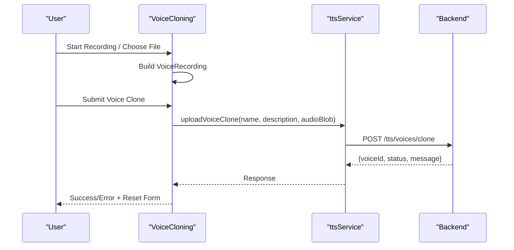

**Diagram sources**
- [VoiceCloning.tsx:109-153](file://frontend/src/components/VoiceCloning.tsx#L109-L153)
- [ttsService.ts:250-284](file://frontend/src/services/ttsService.ts#L250-L284)

**Section sources**
- [VoiceCloning.tsx:1-381](file://frontend/src/components/VoiceCloning.tsx#L1-L381)
- [ttsService.ts:248-284](file://frontend/src/services/ttsService.ts#L248-L284)

### VoiceProfileSelector
- Purpose: Browse, filter, and select narrator voices with search, gender/style tags, and sample playback.
- Key behaviors:
  - Memoized filtering by search term, style, and gender.
  - Single-playback control to avoid overlapping audio.
  - Compact mode renders a simple select dropdown.
- Integration examples:
  - Pass onVoiceSelect to receive the chosen VoiceProfile and update book/narration settings.

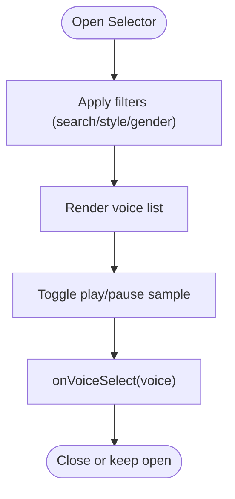

**Diagram sources**
- [VoiceProfileSelector.tsx:24-78](file://frontend/src/components/VoiceProfileSelector.tsx#L24-L78)
- [types-extended.ts:162-291](file://frontend/src/types/types-extended.ts#L162-L291)

**Section sources**
- [VoiceProfileSelector.tsx:1-265](file://frontend/src/components/VoiceProfileSelector.tsx#L1-L265)
- [types-extended.ts:162-291](file://frontend/src/types/types-extended.ts#L162-L291)

### PayGOWallet
- Purpose: Display wallet balances, initiate deposits, and show transaction statistics.
- Key behaviors:
  - Uses usePayGO hook for wallet, transactions, and actions.
  - Supports multiple currencies and payment methods.
  - Modal-driven deposit flow with validation and submission.
- Integration examples:
  - Wrap in layouts/pages to display balances and trigger deposits during PayGO sessions.

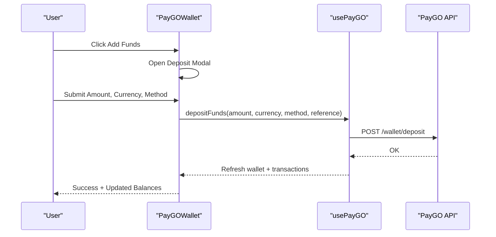

**Diagram sources**
- [PayGOWallet.tsx:37-66](file://frontend/src/components/PayGOWallet.tsx#L37-L66)
- [usePayGO.ts:139-162](file://frontend/src/hooks/usePayGO.ts#L139-L162)

**Section sources**
- [PayGOWallet.tsx:1-299](file://frontend/src/components/PayGOWallet.tsx#L1-L299)
- [usePayGO.ts:1-315](file://frontend/src/hooks/usePayGO.ts#L1-L315)
- [payments.ts:1-195](file://frontend/src/types/payments.ts#L1-L195)

### PayGOSessionManager
- Purpose: Manage PayGO sessions for products (video, audiobook, ebook, live stream), track time, compute charges, and enforce wallet checks.
- Key behaviors:
  - Auto-refreshes active sessions and heartbeats periodically.
  - Calculates current charge based on elapsed time and rate per minute.
  - Prevents starting sessions when wallet is suspended or insufficient funds.
- Integration examples:
  - Pass productId, productType, and productTitle to bind the manager to a specific product.

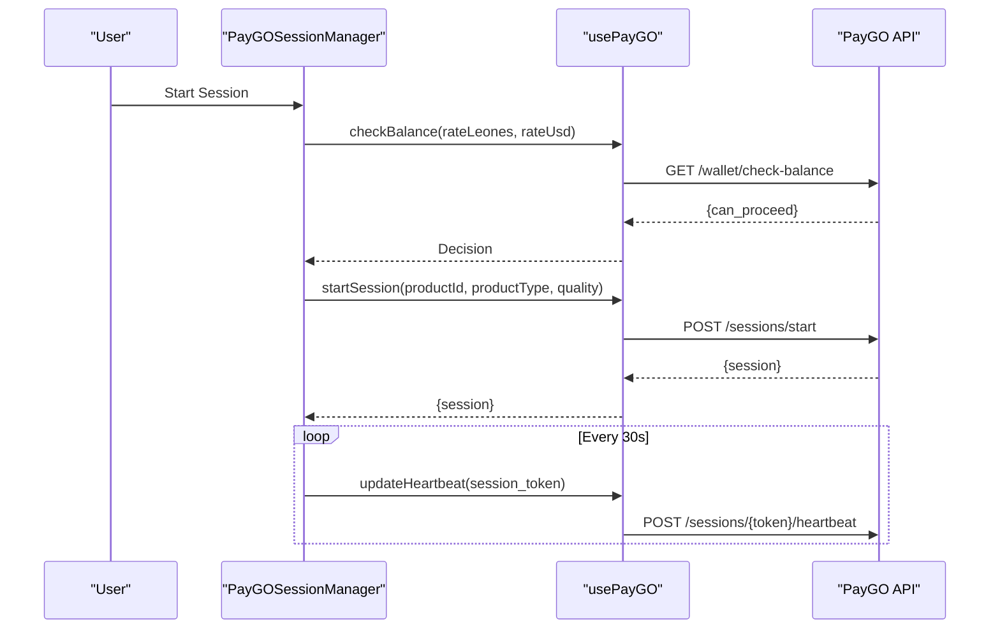

**Diagram sources**
- [PayGOSessionManager.tsx:83-108](file://frontend/src/components/PayGOSessionManager.tsx#L83-L108)
- [usePayGO.ts:182-229](file://frontend/src/hooks/usePayGO.ts#L182-L229)

**Section sources**
- [PayGOSessionManager.tsx:1-294](file://frontend/src/components/PayGOSessionManager.tsx#L1-L294)
- [usePayGO.ts:1-315](file://frontend/src/hooks/usePayGO.ts#L1-L315)

### UsageTracker
- Purpose: Track listening/reading sessions, compute costs for non-subscribers, and persist sessions to backend.
- Key behaviors:
  - Starts/stops tracking on play/pause events.
  - Computes cost using pricing constants and sends session data on end.
  - Formats time and exposes displayCost.
- Integration examples:
  - Invoke startTracking on play, stopTracking on pause, endSession on finish; pass onSessionEnd to handle persistence.

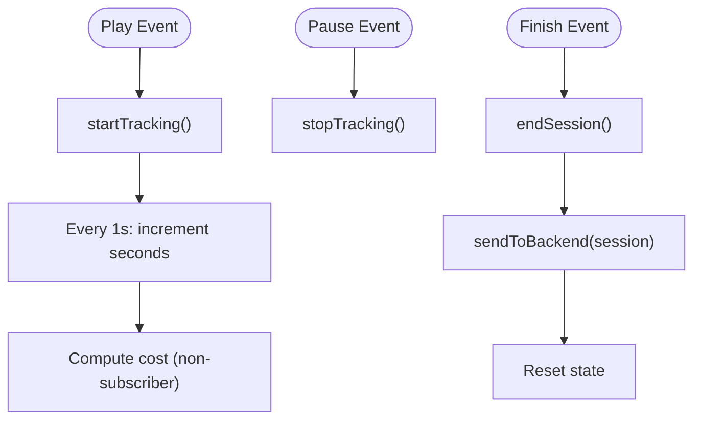

**Diagram sources**
- [UsageTracker.tsx:21-90](file://frontend/src/components/UsageTracker.tsx#L21-L90)
- [types-extended.ts:54-92](file://frontend/src/types/types-extended.ts#L54-L92)

**Section sources**
- [UsageTracker.tsx:1-126](file://frontend/src/components/UsageTracker.tsx#L1-L126)
- [types-extended.ts:54-92](file://frontend/src/types/types-extended.ts#L54-L92)

### BookAccessGate
- Purpose: Gate access to books based on ownership or pay-per-use eligibility; present buy vs pay-per-use options.
- Key behaviors:
  - Estimates reading time based on user balance and book level.
  - Enforces minimum balance thresholds for pay-per-use.
  - Triggers purchase or pay-per-use callbacks.
- Integration examples:
  - Provide book metadata, user balance, and callbacks to integrate with wallet and reader flows.

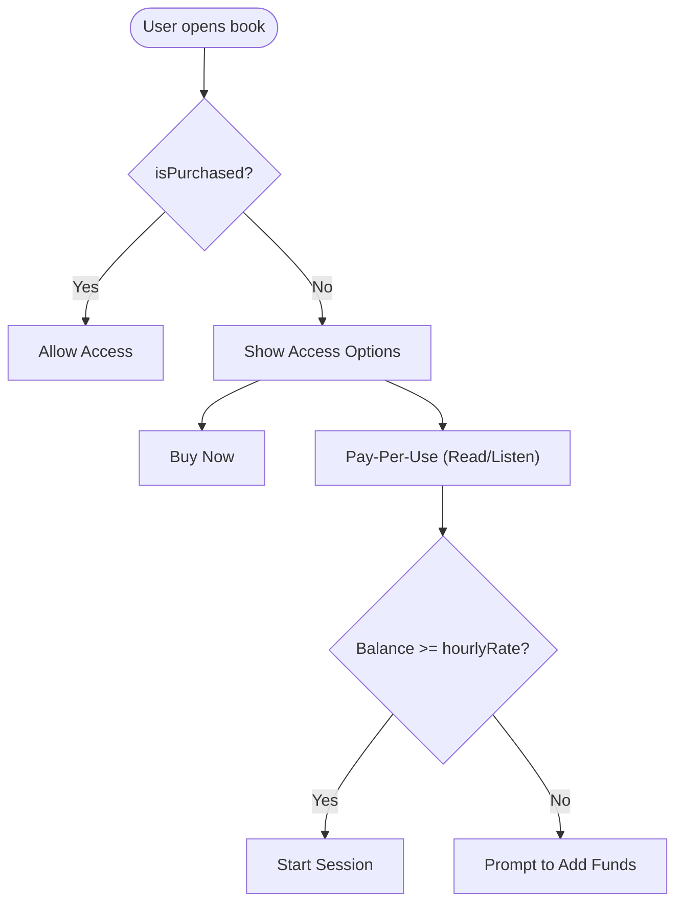

**Diagram sources**
- [BookAccessGate.tsx:20-36](file://frontend/src/components/BookAccessGate.tsx#L20-L36)

**Section sources**
- [BookAccessGate.tsx:1-119](file://frontend/src/components/BookAccessGate.tsx#L1-L119)
- [payments.ts:1-195](file://frontend/src/types/payments.ts#L1-L195)

### ChapterEditor
- Purpose: Create and edit chapters with rich text, manage order, and estimate reading time.
- Key behaviors:
  - Add/delete chapters and reorder via drag-like up/down buttons.
  - Real-time word count and reading time estimation.
  - Uses ReactQuill for rich editing with a curated toolbar.
- Integration examples:
  - Bind chapters prop and onChaptersChange to maintain chapter state in parent components.

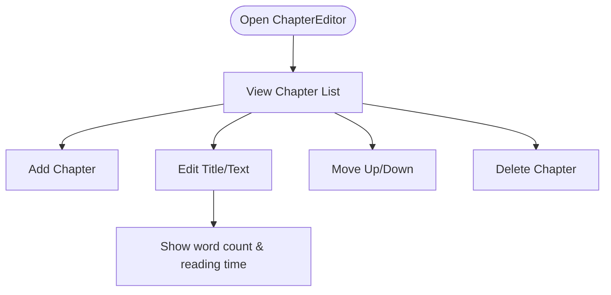

**Diagram sources**
- [ChapterEditor.tsx:22-74](file://frontend/src/components/ChapterEditor.tsx#L22-L74)

**Section sources**
- [ChapterEditor.tsx:1-210](file://frontend/src/components/ChapterEditor.tsx#L1-L210)
- [types.ts:55-63](file://frontend/src/types/types.ts#L55-L63)

### CueTimelineEditor
- Purpose: Author timed cues (formula, visual, steps) aligned to audio duration for synchronized playback.
- Key behaviors:
  - Add/remove cues with type-specific payloads.
  - Timeline visualization with draggable markers.
  - Save cue map to parent via onSave callback.
- Integration examples:
  - Provide audioDuration and onSave to persist cues for MediaSyncPlayer or similar.

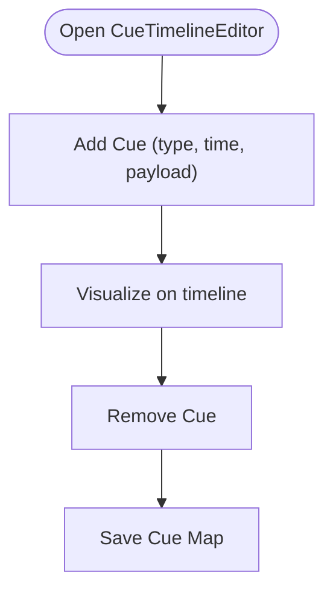

**Diagram sources**
- [CueTimelineEditor.tsx:18-30](file://frontend/src/components/CueTimelineEditor.tsx#L18-L30)

**Section sources**
- [CueTimelineEditor.tsx:1-152](file://frontend/src/components/CueTimelineEditor.tsx#L1-L152)
- [types-extended.ts:48-52](file://frontend/src/types/types-extended.ts#L48-L52)

## Dependency Analysis
- Component-to-service relationships:
  - AudioSynthesizer depends on ttsService for synthesis and word timestamps.
  - VoiceCloning depends on ttsService for upload and voice cloning endpoints.
  - VoiceProfileSelector depends on FREE_VOICE_PROFILES and sample audio URLs.
  - PayGOWallet and PayGOSessionManager depend on usePayGO hook for wallet/session APIs.
  - UsageTracker depends on pricing constants and backend usage endpoints.
  - BookAccessGate depends on pricing and reading time estimation helpers.
  - ChapterEditor and CueTimelineEditor are UI-only with minimal dependencies.
- Shared types:
  - Chapter, Book, VoiceProfile, VoiceClone, Cue, and pricing constants unify data contracts across components.

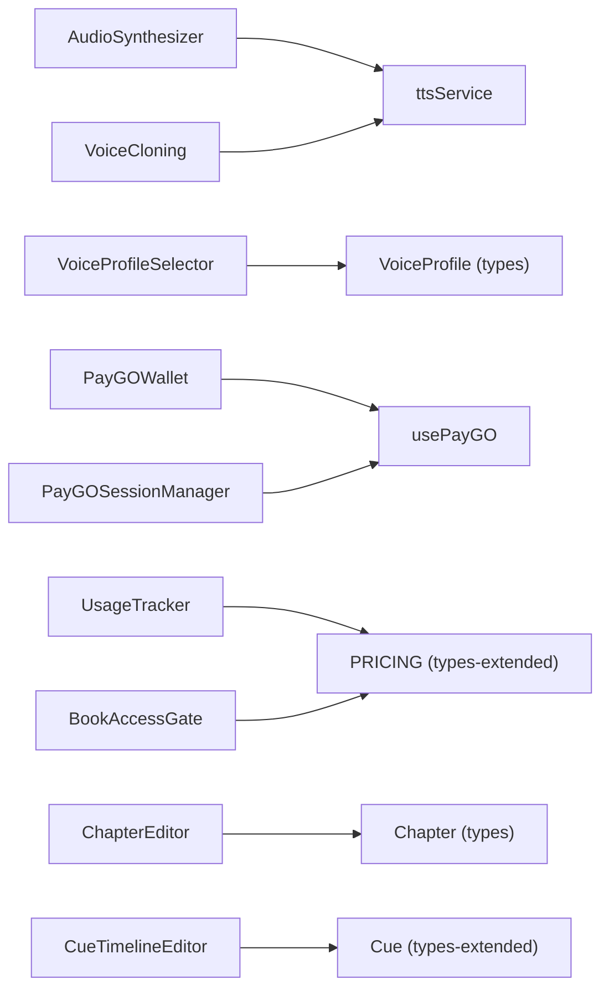

**Diagram sources**
- [AudioSynthesizer.tsx:1-495](file://frontend/src/components/AudioSynthesizer.tsx#L1-L495)
- [VoiceCloning.tsx:1-381](file://frontend/src/components/VoiceCloning.tsx#L1-L381)
- [VoiceProfileSelector.tsx:1-265](file://frontend/src/components/VoiceProfileSelector.tsx#L1-L265)
- [PayGOWallet.tsx:1-299](file://frontend/src/components/PayGOWallet.tsx#L1-L299)
- [PayGOSessionManager.tsx:1-294](file://frontend/src/components/PayGOSessionManager.tsx#L1-L294)
- [UsageTracker.tsx:1-126](file://frontend/src/components/UsageTracker.tsx#L1-L126)
- [BookAccessGate.tsx:1-119](file://frontend/src/components/BookAccessGate.tsx#L1-L119)
- [ChapterEditor.tsx:1-210](file://frontend/src/components/ChapterEditor.tsx#L1-L210)
- [CueTimelineEditor.tsx:1-152](file://frontend/src/components/CueTimelineEditor.tsx#L1-L152)
- [usePayGO.ts:1-315](file://frontend/src/hooks/usePayGO.ts#L1-L315)
- [ttsService.ts:1-381](file://frontend/src/services/ttsService.ts#L1-L381)
- [types.ts:55-84](file://frontend/src/types/types.ts#L55-L84)
- [types-extended.ts:48-92](file://frontend/src/types/types-extended.ts#L48-L92)

**Section sources**
- [types.ts:1-110](file://frontend/src/types/types.ts#L1-L110)
- [types-extended.ts:1-292](file://frontend/src/types/types-extended.ts#L1-L292)
- [payments.ts:1-195](file://frontend/src/types/payments.ts#L1-L195)

## Performance Considerations
- AudioSynthesizer
  - Use batch synthesis with concurrency control and progress reporting for large chapter sets.
  - Cancel ongoing synthesis to prevent redundant work.
  - Prefer word-level timestamps only when needed to reduce backend overhead.
- VoiceCloning
  - Validate file size and type before upload to avoid large payloads.
  - Use preview playback sparingly to avoid excessive audio loads.
- PayGO
  - Debounce wallet refresh and heartbeat intervals to minimize API calls.
  - Cache session tokens and rates to reduce repeated lookups.
- UsageTracker
  - Throttle session updates to reduce backend load (already 30s intervals).
  - Avoid frequent re-renders by memoizing derived values (time, cost).
- ChapterEditor and CueTimelineEditor
  - Debounce rich text change handlers to improve responsiveness.
  - Virtualize long lists if chapter counts grow very large.

[No sources needed since this section provides general guidance]

## Troubleshooting Guide
- AudioSynthesizer
  - If synthesis fails, check browser support and network connectivity; fallback to browser TTS when available.
  - Dismiss persistent errors and retry synthesis; ensure text length is within limits.
- VoiceCloning
  - Microphone permission errors require user action to enable device access.
  - Large file uploads may fail; enforce size limits and compress audio when possible.
- PayGO
  - Insufficient balance prevents session start; prompt users to add funds.
  - Wallet suspension blocks new sessions; surface suspension reason to users.
- UsageTracker
  - If sessions do not persist, verify backend endpoint availability and error logs.
  - Ensure cleanup on unmount to avoid lingering intervals.
- BookAccessGate
  - If pay-per-use is disabled due to insufficient balance, guide users to top up.
  - Verify book level and hourly rate calculations align with pricing configuration.

**Section sources**
- [AudioSynthesizer.tsx:193-196](file://frontend/src/components/AudioSynthesizer.tsx#L193-L196)
- [VoiceCloning.tsx:68-71](file://frontend/src/components/VoiceCloning.tsx#L68-L71)
- [PayGOSessionManager.tsx:94-97](file://frontend/src/components/PayGOSessionManager.tsx#L94-L97)
- [UsageTracker.tsx:87-89](file://frontend/src/components/UsageTracker.tsx#L87-L89)
- [BookAccessGate.tsx:30-36](file://frontend/src/components/BookAccessGate.tsx#L30-L36)

## Conclusion
These interactive widgets form a cohesive toolkit for content creation, narration, and usage-based monetization. They emphasize robust state management, real-time updates, accessibility, and extensibility. By leveraging shared services, hooks, and types, developers can integrate these components seamlessly into creator workflows and reader experiences.

[No sources needed since this section summarizes without analyzing specific files]

## Appendices

### Widget Integration Examples
- AudioSynthesizer
  - Integrate chapters array and onChaptersChange to persist audio metadata.
  - Use wordTimestamps to highlight words during playback.
- VoiceCloning
  - After upload, call onVoiceCreated to refresh voice lists and select the new clone.
- VoiceProfileSelector
  - Use onVoiceSelect to update book/narration settings and persist selections.
- PayGOWallet
  - Display balances and trigger deposits before starting PayGO sessions.
- PayGOSessionManager
  - Bind productId, productType, and productTitle; handle start/end lifecycle.
- UsageTracker
  - Wire start/stop/end to player controls; pass onSessionEnd to persist sessions.
- BookAccessGate
  - Provide book metadata and user balance; handle purchase and pay-per-use callbacks.
- ChapterEditor
  - Maintain chapters state in parent; use word count to estimate reading time.
- CueTimelineEditor
  - Save cue maps to backend or local storage for synchronized playback.

[No sources needed since this section provides general guidance]

### Extension Guidelines
- Keep state local when UI-only; delegate cross-component state to shared hooks/services.
- Encapsulate network calls in services to simplify testing and reuse.
- Use memoization for expensive computations (e.g., cost estimation, word counts).
- Provide clear callbacks for parent components to react to user actions.
- Respect accessibility: ARIA labels, keyboard navigation, and screen-reader friendly messages.
- Gracefully handle errors with user-facing messages and retry mechanisms.

[No sources needed since this section provides general guidance]