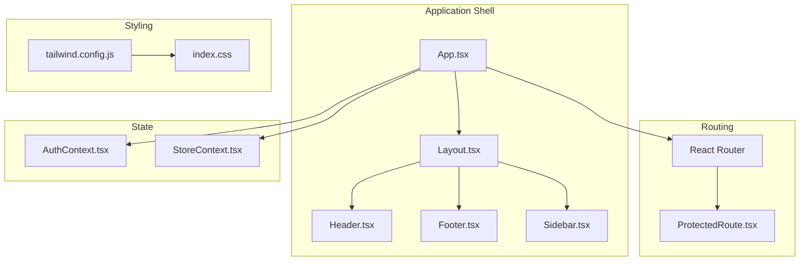
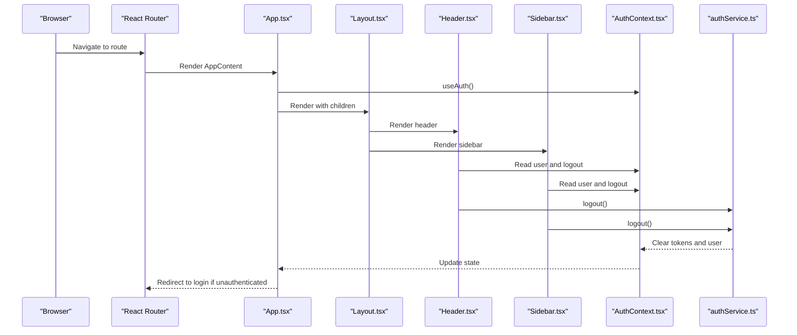
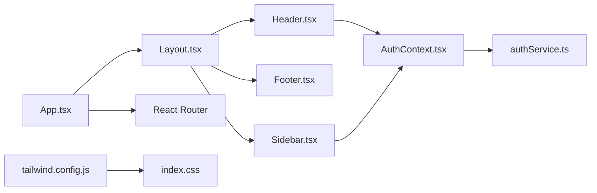

# Layout Components

<cite>
**Referenced Files in This Document**
- [Layout.tsx](file://frontend/src/components/layout/Layout.tsx)
- [Header.tsx](file://frontend/src/components/layout/Header.tsx)
- [Footer.tsx](file://frontend/src/components/layout/Footer.tsx)
- [Sidebar.tsx](file://frontend/src/components/layout/Sidebar.tsx)
- [App.tsx](file://frontend/src/App.tsx)
- [AuthContext.tsx](file://frontend/src/contexts/AuthContext.tsx)
- [StoreContext.tsx](file://frontend/src/contexts/StoreContext.tsx)
- [authService.ts](file://frontend/src/api/services/authService.ts)
- [ProtectedRoute.tsx](file://frontend/src/components/ProtectedRoute.tsx)
- [index.css](file://frontend/src/index.css)
- [tailwind.config.js](file://frontend/tailwind.config.js)
- [constants.ts](file://frontend/src/constants.ts)
- [api.ts](file://frontend/src/utils/api.ts)
- [Home.tsx](file://frontend/src/pages/Home.tsx)
</cite>

## Table of Contents
1. [Introduction](#introduction)
2. [Project Structure](#project-structure)
3. [Core Components](#core-components)
4. [Architecture Overview](#architecture-overview)
5. [Detailed Component Analysis](#detailed-component-analysis)
6. [Dependency Analysis](#dependency-analysis)
7. [Performance Considerations](#performance-considerations)
8. [Troubleshooting Guide](#troubleshooting-guide)
9. [Conclusion](#conclusion)
10. [Appendices](#appendices)

## Introduction
This document explains the layout system used across the frontend application. It covers the Layout container, Header navigation, Footer, and Sidebar components, along with the responsive grid system, breakpoints, and mobile-first design approach. It also documents component props for customization, integration with routing and authentication, and provides guidelines for extending layouts and creating custom page templates.

## Project Structure
The layout system is primarily implemented in the layout folder and integrated into the main application shell. Authentication and store state are provided via dedicated contexts. Routing is handled by React Router with protected routes.

**Diagram sources**
- [App.tsx:71-143](file://frontend/src/App.tsx#L71-L143)
- [Layout.tsx:13-51](file://frontend/src/components/layout/Layout.tsx#L13-L51)
- [Header.tsx:7-87](file://frontend/src/components/layout/Header.tsx#L7-L87)
- [Footer.tsx:3-19](file://frontend/src/components/layout/Footer.tsx#L3-L19)
- [Sidebar.tsx:10-99](file://frontend/src/components/layout/Sidebar.tsx#L10-L99)
- [ProtectedRoute.tsx:9-19](file://frontend/src/components/ProtectedRoute.tsx#L9-L19)
- [AuthContext.tsx:16-81](file://frontend/src/contexts/AuthContext.tsx#L16-L81)
- [StoreContext.tsx:17-55](file://frontend/src/contexts/StoreContext.tsx#L17-L55)
- [tailwind.config.js:1-12](file://frontend/tailwind.config.js#L1-L12)
- [index.css:1-88](file://frontend/src/index.css#L1-L88)

**Section sources**
- [App.tsx:71-143](file://frontend/src/App.tsx#L71-L143)
- [Layout.tsx:13-51](file://frontend/src/components/layout/Layout.tsx#L13-L51)
- [Header.tsx:7-87](file://frontend/src/components/layout/Header.tsx#L7-L87)
- [Footer.tsx:3-19](file://frontend/src/components/layout/Footer.tsx#L3-L19)
- [Sidebar.tsx:10-99](file://frontend/src/components/layout/Sidebar.tsx#L10-L99)
- [ProtectedRoute.tsx:9-19](file://frontend/src/components/ProtectedRoute.tsx#L9-L19)
- [AuthContext.tsx:16-81](file://frontend/src/contexts/AuthContext.tsx#L16-L81)
- [StoreContext.tsx:17-55](file://frontend/src/contexts/StoreContext.tsx#L17-L55)
- [tailwind.config.js:1-12](file://frontend/tailwind.config.js#L1-L12)
- [index.css:1-88](file://frontend/src/index.css#L1-L88)

## Core Components
- Layout: A container that composes the sidebar, main content area, and header/footer regions. It exposes an onLogout prop and reads authentication state to render contextual UI.
- Header: A responsive top navigation bar with branding, navigation links, and authentication actions. Integrates with AuthContext to adapt behavior based on user role.
- Footer: A branded footer with links and copyright information.
- Sidebar: A collapsible navigation drawer that adapts from narrow icons-only on small screens to expanded with labels on larger screens. Role-based visibility for seller/admin sections.

Key props and behaviors:
- Layout props:
  - children: React.ReactNode
  - onLogout?: () => void
- Header:
  - Uses AuthContext for user state and logout action.
  - Navigation items are computed based on user role.
- Sidebar:
  - Uses AuthContext for user role to conditionally show seller/admin sections.
  - Provides role-aware navigation items via NavItem subcomponent.
- Footer:
  - Stateless functional component rendering static content.

Responsive behavior:
- Mobile-first design with Tailwind utilities:
  - Hidden on small screens and shown on medium and above for desktop layout.
  - Sidebar collapses to icons-only on small screens and expands with labels on larger screens.
  - Mobile header appears fixed at the top for small screens.

**Section sources**
- [Layout.tsx:8-11](file://frontend/src/components/layout/Layout.tsx#L8-L11)
- [Layout.tsx:13-51](file://frontend/src/components/layout/Layout.tsx#L13-L51)
- [Header.tsx:7-87](file://frontend/src/components/layout/Header.tsx#L7-L87)
- [Footer.tsx:3-19](file://frontend/src/components/layout/Footer.tsx#L3-L19)
- [Sidebar.tsx:10-99](file://frontend/src/components/layout/Sidebar.tsx#L10-L99)

## Architecture Overview
The layout system integrates tightly with routing and authentication. Protected routes wrap pages to enforce authentication and role-based access. The main application shell renders the sidebar and routes pages inside a layout container. Authentication state drives dynamic navigation and role-specific sections.

**Diagram sources**
- [App.tsx:71-143](file://frontend/src/App.tsx#L71-L143)
- [Layout.tsx:13-51](file://frontend/src/components/layout/Layout.tsx#L13-L51)
- [Header.tsx:7-87](file://frontend/src/components/layout/Header.tsx#L7-L87)
- [Sidebar.tsx:10-99](file://frontend/src/components/layout/Sidebar.tsx#L10-L99)
- [AuthContext.tsx:16-81](file://frontend/src/contexts/AuthContext.tsx#L16-L81)
- [authService.ts:32-35](file://frontend/src/api/services/authService.ts#L32-L35)

## Detailed Component Analysis

### Layout Container
Responsibilities:
- Hosts the sidebar and main content area.
- Renders a sticky header with branding and user-related controls.
- Provides a scrollable content region for page children.
- Exposes an onLogout callback for sign-out actions.

Props:
- children: React.ReactNode
- onLogout?: () => void

Behavior highlights:
- Uses a flex column layout with a main content area that grows to fill available height.
- Header displays wallet balance from user state and a logout button.
- Responsive adjustments:
  - On large screens, the main content area has a left margin matching the sidebar width.
  - Mobile header is rendered for small screens.

**Section sources**
- [Layout.tsx:13-51](file://frontend/src/components/layout/Layout.tsx#L13-L51)

### Header Navigation
Responsibilities:
- Branding and navigation for logged-in and anonymous users.
- Dynamic navigation items based on user role.
- Authentication actions (login/logout).

Key behaviors:
- Computes dashboard path based on user role.
- Highlights active navigation item based on current location.
- Uses Lucide icons for visual cues.

Role-based navigation:
- Admin: navigates to admin dashboard.
- Seller: navigates to seller portal.
- Default learner: navigates to reading analytics.

**Section sources**
- [Header.tsx:7-87](file://frontend/src/components/layout/Header.tsx#L7-L87)

### Footer
Responsibilities:
- Provides legal and informational links.
- Displays copyright information.

Customization:
- Links and text are static; can be externalized to props or a configuration module if needed.

**Section sources**
- [Footer.tsx:3-19](file://frontend/src/components/layout/Footer.tsx#L3-L19)

### Sidebar Implementation
Responsibilities:
- Collapsible navigation drawer with role-aware sections.
- User profile and logout affordance.
- Active state styling for current route.

Structure:
- Top branding section.
- Shared navigation items (Home, Library, Analytics, Wallet, Referrals).
- Tools section (Maps Agent, Vision Agent).
- Conditional sections:
  - Seller: Audiobook Studio, Seller Portal, Onboarding, Registration.
  - Admin: Admin Dashboard.
- User profile row with avatar/name/role and logout button.

Responsive behavior:
- Hidden on small screens.
- On medium screens and above, becomes visible and expands to show labels.
- Fixed positioning at the top of the viewport.

**Section sources**
- [Sidebar.tsx:10-99](file://frontend/src/components/layout/Sidebar.tsx#L10-L99)

### Responsive Layout Grid and Breakpoints
Design approach:
- Mobile-first with Tailwind’s responsive prefixes (sm, md, lg).
- Sidebar is hidden on small screens and visible on medium and above.
- Main content area adjusts margins based on sidebar visibility.
- Mobile header overlays the content on small screens.

Breakpoints and utilities:
- md: minimum width threshold for showing desktop layout and expanding sidebar.
- lg: triggers sidebar expansion to include labels and increases sidebar width.

**Section sources**
- [App.tsx:79-87](file://frontend/src/App.tsx#L79-L87)
- [App.tsx:90-91](file://frontend/src/App.tsx#L90-L91)
- [Sidebar.tsx:14](file://frontend/src/components/layout/Sidebar.tsx#L14)

### Integration with Routing, Authentication, and Theme Switching
Routing:
- ProtectedRoute enforces authentication and optional role checks.
- AppContent defines routes and wraps protected pages accordingly.

Authentication:
- AuthContext manages user state, login/register/logout, and loading state.
- authService persists tokens and user data in local storage and exposes helpers to check authentication and retrieve current user.

Theme and styling:
- Tailwind CSS configured for content scanning and theme extension.
- index.css defines global animations, glass effects, and smooth transitions.

**Section sources**
- [ProtectedRoute.tsx:9-19](file://frontend/src/components/ProtectedRoute.tsx#L9-L19)
- [App.tsx:52-69](file://frontend/src/App.tsx#L52-L69)
- [AuthContext.tsx:16-81](file://frontend/src/contexts/AuthContext.tsx#L16-L81)
- [authService.ts:8-48](file://frontend/src/api/services/authService.ts#L8-L48)
- [tailwind.config.js:1-12](file://frontend/tailwind.config.js#L1-L12)
- [index.css:1-88](file://frontend/src/index.css#L1-L88)

### Examples of Different Layout Combinations and Responsive Behavior
- Learner dashboard:
  - Sidebar shows shared items and analytics.
  - Mobile header provides quick access to library, maps, wallet, and logout.
- Seller dashboard:
  - Sidebar includes seller-specific sections (Studio, Portal, Onboarding, Registration).
- Admin dashboard:
  - Sidebar includes admin-specific sections (Admin Dashboard).
- Public pages:
  - No sidebar; header remains present for navigation and authentication.

Responsive behavior:
- Small screens: mobile header overlay, collapsed sidebar, main content scrolls beneath.
- Medium and above: full sidebar with labels, main content area indented to avoid overlap.

**Section sources**
- [App.tsx:98-137](file://frontend/src/App.tsx#L98-L137)
- [Sidebar.tsx:35-54](file://frontend/src/components/layout/Sidebar.tsx#L35-L54)
- [App.tsx:79-87](file://frontend/src/App.tsx#L79-L87)

### Guidelines for Extending Layouts and Creating Custom Page Templates
- Extend Layout:
  - Pass onLogout to handle sign-out in parent containers.
  - Use children to render page-specific content.
- Customize Header:
  - Adjust navItems computation to add/remove items based on role or feature flags.
  - Swap branding assets and styles while keeping responsive behavior.
- Customize Sidebar:
  - Add new NavItem entries with appropriate icons and routes.
  - Use role checks to conditionally include sections.
- Create custom page templates:
  - Wrap page components with Layout and pass onLogout if needed.
  - Use Tailwind utilities to apply consistent spacing and typography.
- Maintain responsive behavior:
  - Keep md thresholds for desktop layout.
  - Ensure mobile header remains accessible for small screens.

**Section sources**
- [Layout.tsx:13-51](file://frontend/src/components/layout/Layout.tsx#L13-L51)
- [Header.tsx:21-28](file://frontend/src/components/layout/Header.tsx#L21-L28)
- [Sidebar.tsx:22-54](file://frontend/src/components/layout/Sidebar.tsx#L22-L54)
- [App.tsx:79-87](file://frontend/src/App.tsx#L79-L87)

## Dependency Analysis
The layout components depend on:
- React Router for navigation and protected routing.
- AuthContext for user state and logout.
- Tailwind CSS for responsive styling and utilities.
- Lucide icons for visual affordances.

**Diagram sources**
- [Layout.tsx:13-51](file://frontend/src/components/layout/Layout.tsx#L13-L51)
- [Header.tsx:7-87](file://frontend/src/components/layout/Header.tsx#L7-L87)
- [Footer.tsx:3-19](file://frontend/src/components/layout/Footer.tsx#L3-L19)
- [Sidebar.tsx:10-99](file://frontend/src/components/layout/Sidebar.tsx#L10-L99)
- [App.tsx:71-143](file://frontend/src/App.tsx#L71-L143)
- [AuthContext.tsx:16-81](file://frontend/src/contexts/AuthContext.tsx#L16-L81)
- [authService.ts:8-48](file://frontend/src/api/services/authService.ts#L8-L48)
- [tailwind.config.js:1-12](file://frontend/tailwind.config.js#L1-L12)
- [index.css:1-88](file://frontend/src/index.css#L1-L88)

**Section sources**
- [Layout.tsx:13-51](file://frontend/src/components/layout/Layout.tsx#L13-L51)
- [Header.tsx:7-87](file://frontend/src/components/layout/Header.tsx#L7-L87)
- [Sidebar.tsx:10-99](file://frontend/src/components/layout/Sidebar.tsx#L10-L99)
- [App.tsx:71-143](file://frontend/src/App.tsx#L71-L143)
- [AuthContext.tsx:16-81](file://frontend/src/contexts/AuthContext.tsx#L16-L81)
- [authService.ts:8-48](file://frontend/src/api/services/authService.ts#L8-L48)
- [tailwind.config.js:1-12](file://frontend/tailwind.config.js#L1-L12)
- [index.css:1-88](file://frontend/src/index.css#L1-L88)

## Performance Considerations
- Prefer lazy loading for heavy pages to minimize initial bundle size.
- Use sticky positioning judiciously; ensure it does not cause layout thrashing on scroll.
- Keep icon imports minimal and reuse Lucide icons consistently.
- Avoid unnecessary re-renders by memoizing computed navigation items when possible.

## Troubleshooting Guide
Common issues and resolutions:
- Authentication redirects:
  - Ensure ProtectedRoute is wrapping protected pages and that AuthContext is initialized at the root.
- Logout not working:
  - Verify authService.logout clears tokens and user from storage and that AuthContext updates state.
- Sidebar not visible on small screens:
  - Confirm Tailwind responsive classes are applied and that the mobile header overlay is present.
- Active navigation highlighting:
  - Ensure location-based active state logic matches route paths.

**Section sources**
- [ProtectedRoute.tsx:9-19](file://frontend/src/components/ProtectedRoute.tsx#L9-L19)
- [App.tsx:52-69](file://frontend/src/App.tsx#L52-L69)
- [AuthContext.tsx:54-57](file://frontend/src/contexts/AuthContext.tsx#L54-L57)
- [authService.ts:32-35](file://frontend/src/api/services/authService.ts#L32-L35)
- [App.tsx:79-87](file://frontend/src/App.tsx#L79-L87)

## Conclusion
The layout system provides a cohesive, mobile-first foundation for the application. It integrates authentication, routing, and responsive design to deliver a consistent user experience across roles and devices. The modular structure allows easy customization and extension for new pages and features.

## Appendices

### Component Props Reference
- Layout
  - children: React.ReactNode
  - onLogout?: () => void
- Header
  - None (uses AuthContext internally)
- Sidebar
  - None (uses AuthContext internally)
- Footer
  - None (static content)

**Section sources**
- [Layout.tsx:8-11](file://frontend/src/components/layout/Layout.tsx#L8-L11)
- [Header.tsx:7-87](file://frontend/src/components/layout/Header.tsx#L7-L87)
- [Sidebar.tsx:10-99](file://frontend/src/components/layout/Sidebar.tsx#L10-L99)
- [Footer.tsx:3-19](file://frontend/src/components/layout/Footer.tsx#L3-L19)

### Example Page Template Using Layout
- Wrap page content with Layout and pass onLogout if needed.
- Use Tailwind utilities for consistent spacing and responsive grids.
- Leverage constants and services for data fetching and user state.

**Section sources**
- [Home.tsx:38-327](file://frontend/src/pages/Home.tsx#L38-L327)
- [constants.ts:4-13](file://frontend/src/constants.ts#L4-L13)
- [api.ts](file://frontend/src/utils/api.ts)