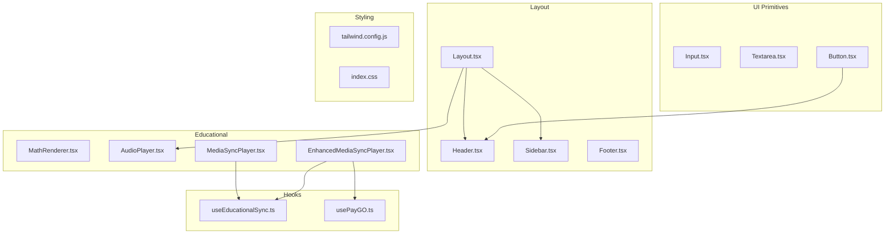
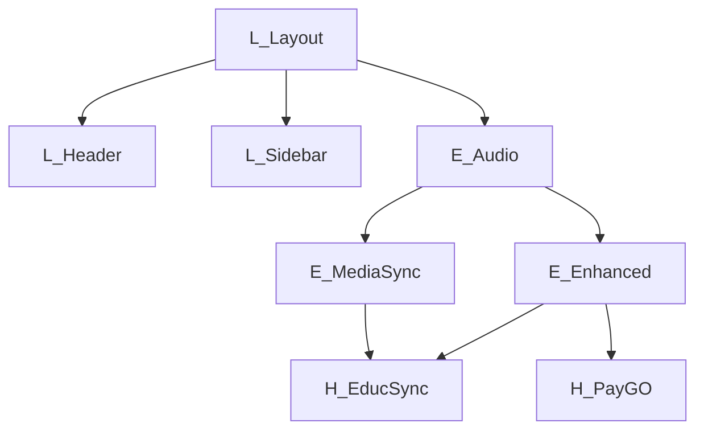
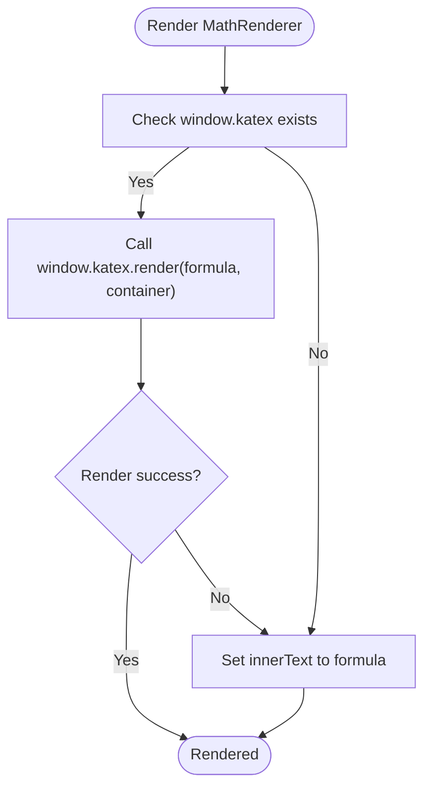
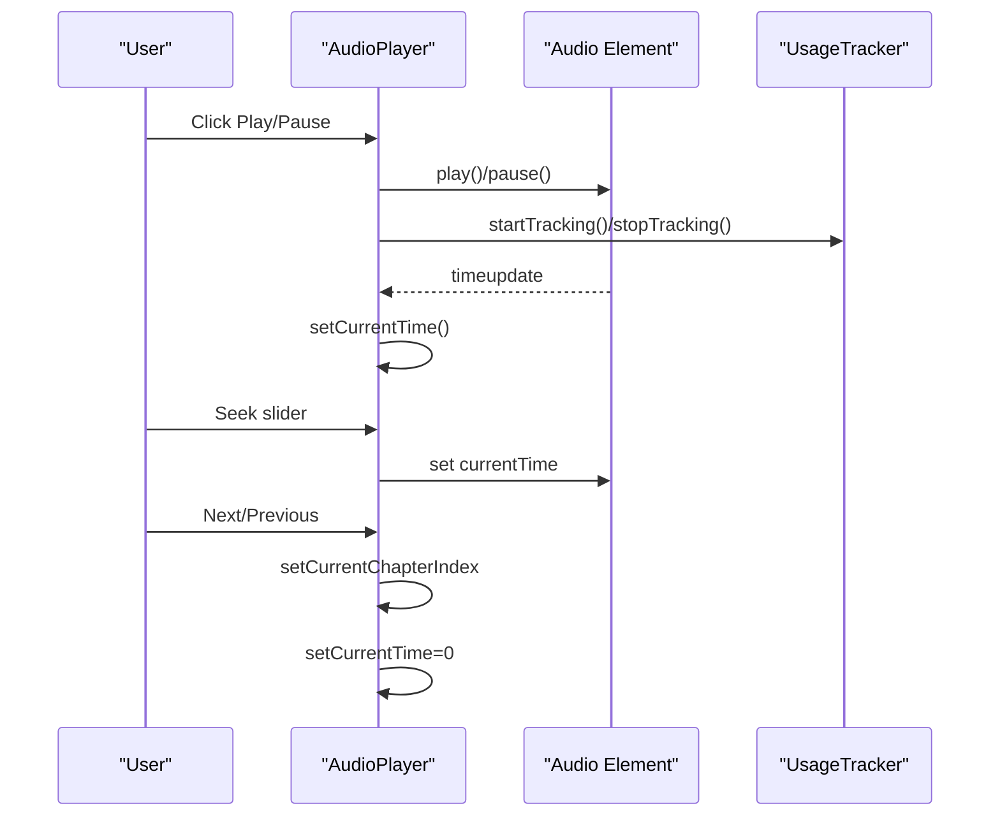
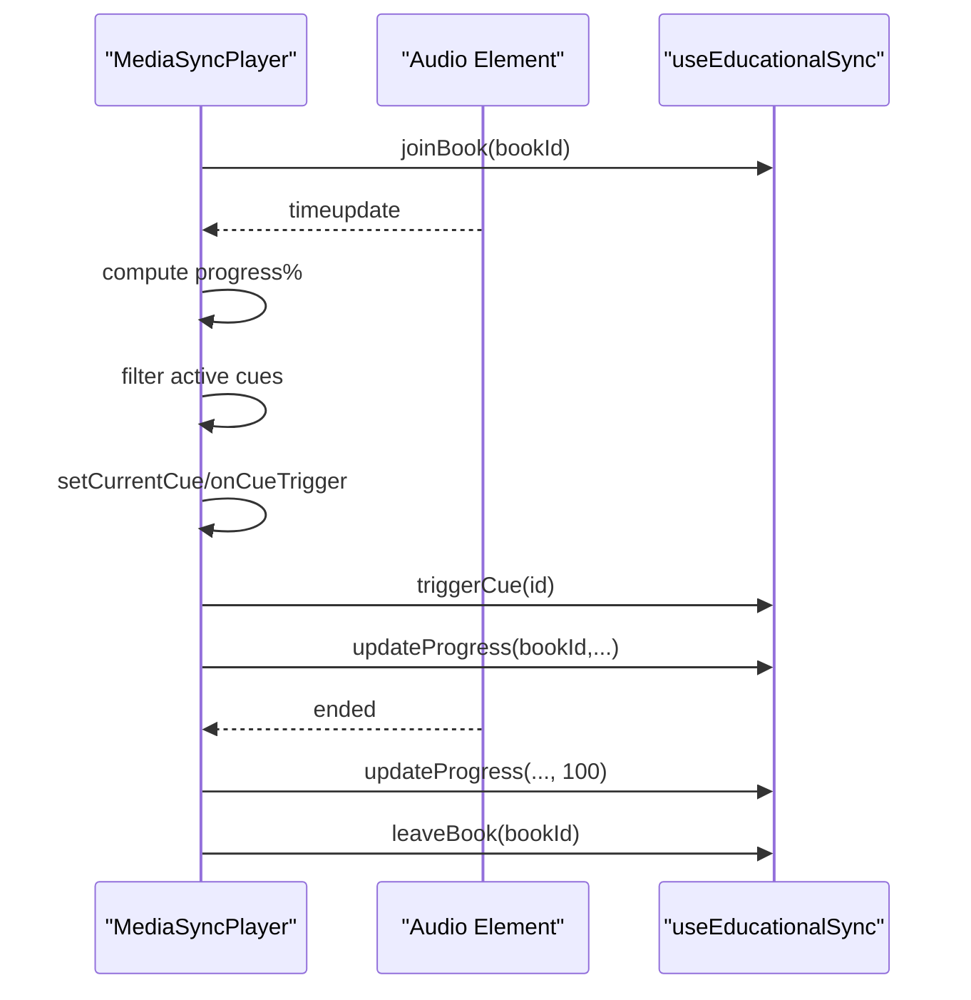
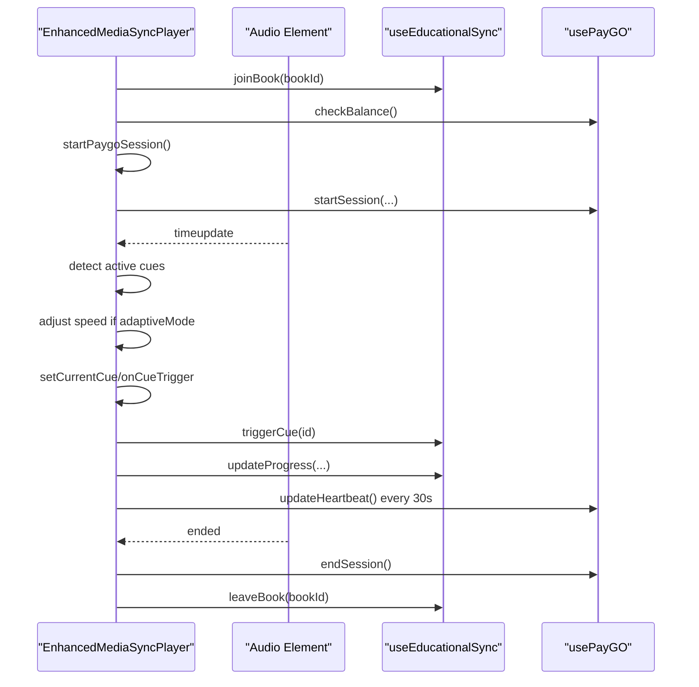
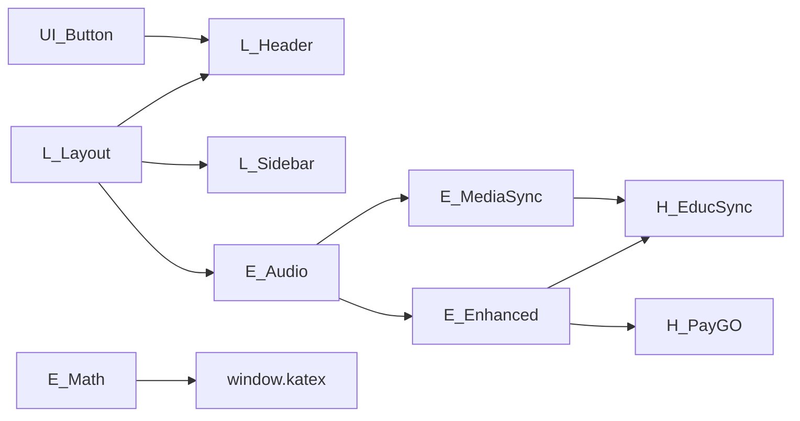

# UI Components

<cite>
**Referenced Files in This Document**
- [Input.tsx](file://frontend/src/components/ui/Input.tsx)
- [Textarea.tsx](file://frontend/src/components/ui/Textarea.tsx)
- [Button.tsx](file://frontend/src/components/ui/Button.tsx)
- [Layout.tsx](file://frontend/src/components/layout/Layout.tsx)
- [Header.tsx](file://frontend/src/components/layout/Header.tsx)
- [Sidebar.tsx](file://frontend/src/components/layout/Sidebar.tsx)
- [Footer.tsx](file://frontend/src/components/layout/Footer.tsx)
- [MathRenderer.tsx](file://frontend/src/components/MathRenderer.tsx)
- [AudioPlayer.tsx](file://frontend/src/components/AudioPlayer.tsx)
- [MediaSyncPlayer.tsx](file://frontend/src/components/MediaSyncPlayer.tsx)
- [EnhancedMediaSyncPlayer.tsx](file://frontend/src/components/EnhancedMediaSyncPlayer.tsx)
- [useEducationalSync.ts](file://frontend/src/hooks/useEducationalSync.ts)
- [usePayGO.ts](file://frontend/src/hooks/usePayGO.ts)
- [tailwind.config.js](file://frontend/tailwind.config.js)
- [index.css](file://frontend/src/index.css)
</cite>

## Table of Contents
1. [Introduction](#introduction)
2. [Project Structure](#project-structure)
3. [Core Components](#core-components)
4. [Architecture Overview](#architecture-overview)
5. [Detailed Component Analysis](#detailed-component-analysis)
6. [Dependency Analysis](#dependency-analysis)
7. [Performance Considerations](#performance-considerations)
8. [Troubleshooting Guide](#troubleshooting-guide)
9. [Conclusion](#conclusion)
10. [Appendices](#appendices)

## Introduction
This document describes the reusable UI component library used across the QuantumMint Bookstore frontend. It covers form components (Input, Textarea, Button), layout components (Layout, Header, Sidebar, Footer), and specialized educational components (MathRenderer, AudioPlayer, MediaSyncPlayer, EnhancedMediaSyncPlayer). For each component, we explain props, styling patterns, customization options, composition examples, accessibility features, responsive design patterns, and integration with Tailwind CSS. We also document the inheritance hierarchy and present best practices for reusability.

## Project Structure
The UI components are organized by domain:
- Form/UI primitives: frontend/src/components/ui
- Layout scaffolding: frontend/src/components/layout
- Educational players and math rendering: frontend/src/components
- Supporting hooks for educational synchronization and PayGO sessions: frontend/src/hooks
- Styling framework: Tailwind CSS configuration and global CSS

**Diagram sources**
- [Input.tsx:1-17](file://frontend/src/components/ui/Input.tsx#L1-L17)
- [Textarea.tsx:1-17](file://frontend/src/components/ui/Textarea.tsx#L1-L17)
- [Button.tsx:1-54](file://frontend/src/components/ui/Button.tsx#L1-L54)
- [Layout.tsx:1-55](file://frontend/src/components/layout/Layout.tsx#L1-L55)
- [Header.tsx:1-88](file://frontend/src/components/layout/Header.tsx#L1-L88)
- [Sidebar.tsx:1-101](file://frontend/src/components/layout/Sidebar.tsx#L1-L101)
- [Footer.tsx:1-20](file://frontend/src/components/layout/Footer.tsx#L1-L20)
- [MathRenderer.tsx:1-33](file://frontend/src/components/MathRenderer.tsx#L1-L33)
- [AudioPlayer.tsx:1-288](file://frontend/src/components/AudioPlayer.tsx#L1-L288)
- [MediaSyncPlayer.tsx:1-310](file://frontend/src/components/MediaSyncPlayer.tsx#L1-L310)
- [EnhancedMediaSyncPlayer.tsx:1-577](file://frontend/src/components/EnhancedMediaSyncPlayer.tsx#L1-L577)
- [useEducationalSync.ts](file://frontend/src/hooks/useEducationalSync.ts)
- [usePayGO.ts](file://frontend/src/hooks/usePayGO.ts)
- [tailwind.config.js](file://frontend/tailwind.config.js)
- [index.css](file://frontend/src/index.css)

**Section sources**
- [Input.tsx:1-17](file://frontend/src/components/ui/Input.tsx#L1-L17)
- [Textarea.tsx:1-17](file://frontend/src/components/ui/Textarea.tsx#L1-L17)
- [Button.tsx:1-54](file://frontend/src/components/ui/Button.tsx#L1-L54)
- [Layout.tsx:1-55](file://frontend/src/components/layout/Layout.tsx#L1-L55)
- [Header.tsx:1-88](file://frontend/src/components/layout/Header.tsx#L1-L88)
- [Sidebar.tsx:1-101](file://frontend/src/components/layout/Sidebar.tsx#L1-L101)
- [Footer.tsx:1-20](file://frontend/src/components/layout/Footer.tsx#L1-L20)
- [MathRenderer.tsx:1-33](file://frontend/src/components/MathRenderer.tsx#L1-L33)
- [AudioPlayer.tsx:1-288](file://frontend/src/components/AudioPlayer.tsx#L1-L288)
- [MediaSyncPlayer.tsx:1-310](file://frontend/src/components/MediaSyncPlayer.tsx#L1-L310)
- [EnhancedMediaSyncPlayer.tsx:1-577](file://frontend/src/components/EnhancedMediaSyncPlayer.tsx#L1-L577)
- [useEducationalSync.ts](file://frontend/src/hooks/useEducationalSync.ts)
- [usePayGO.ts](file://frontend/src/hooks/usePayGO.ts)
- [tailwind.config.js](file://frontend/tailwind.config.js)
- [index.css](file://frontend/src/index.css)

## Core Components
This section documents the three foundational UI primitives used across the application.

- Input
  - Purpose: Styled text input with consistent focus states and disabled behavior.
  - Props: Inherits all HTML input attributes via React.InputHTMLAttributes<HTMLInputElement>.
  - Styling: Uses Tailwind utility classes for borders, padding, focus ring, and disabled opacity.
  - Accessibility: Inherits native semantics; ensure labels and aria-* attributes are applied externally.
  - Customization: Accepts a className prop to extend styles.

- Textarea
  - Purpose: Styled multiline text area with consistent focus states and disabled behavior.
  - Props: Inherits all HTML textarea attributes via React.TextareaHTMLAttributes<HTMLTextAreaElement>.
  - Styling: Similar to Input but with a minimum height and placeholder styling.
  - Accessibility: Same considerations as Input; pair with a visible label.

- Button
  - Purpose: Reusable button primitive with variants, sizes, and loading state.
  - Props:
    - variant: primary | secondary | outline | ghost
    - size: sm | md | lg
    - isLoading: boolean
    - Additional button attributes (disabled, etc.)
  - Styling: Base transitions and focus ring; variant and size maps define color and spacing.
  - Accessibility: Supports disabled state; provide accessible names for icons-only buttons.
  - Customization: className merges with computed styles; isLoading renders a spinner.

Best practices:
- Prefer Button for all actions to maintain consistent UX and theme.
- Use Input and Textarea for forms; pair with external validation and labels.
- Keep variant and size choices aligned with the component’s semantic role.

**Section sources**
- [Input.tsx:1-17](file://frontend/src/components/ui/Input.tsx#L1-L17)
- [Textarea.tsx:1-17](file://frontend/src/components/ui/Textarea.tsx#L1-L17)
- [Button.tsx:1-54](file://frontend/src/components/ui/Button.tsx#L1-L54)

## Architecture Overview
The layout components provide a responsive shell around pages and educational players. The Layout composes Header and Sidebar, and exposes a main content area. Educational players integrate with hooks for synchronization and PayGO sessions.

**Diagram sources**
- [Layout.tsx:1-55](file://frontend/src/components/layout/Layout.tsx#L1-L55)
- [Header.tsx:1-88](file://frontend/src/components/layout/Header.tsx#L1-L88)
- [Sidebar.tsx:1-101](file://frontend/src/components/layout/Sidebar.tsx#L1-L101)
- [AudioPlayer.tsx:1-288](file://frontend/src/components/AudioPlayer.tsx#L1-L288)
- [MediaSyncPlayer.tsx:1-310](file://frontend/src/components/MediaSyncPlayer.tsx#L1-L310)
- [EnhancedMediaSyncPlayer.tsx:1-577](file://frontend/src/components/EnhancedMediaSyncPlayer.tsx#L1-L577)
- [useEducationalSync.ts](file://frontend/src/hooks/useEducationalSync.ts)
- [usePayGO.ts](file://frontend/src/hooks/usePayGO.ts)

## Detailed Component Analysis

### Layout Components
- Layout
  - Purpose: Full-page scaffold with sidebar and header; manages main content area and logout callback.
  - Props: children (ReactNode), onLogout (optional).
  - Behavior: Renders Sidebar and Header; main content scrolls independently.
  - Styling: Flexbox layout with fixed header and scrollable content area.
  - Composition: Intended to wrap page-level components.

- Header
  - Purpose: Top navigation bar with branding, navigation links, and auth controls.
  - Props: None.
  - Behavior: Computes dashboard route based on user role; highlights active nav item; renders sign-in/sign-out.
  - Styling: Gradient background, centered layout, responsive spacing.

- Sidebar
  - Purpose: Left navigation drawer with collapsible labels and role-aware sections.
  - Props: None.
  - Behavior: Provides navigation items for home, library, analytics, wallet, tools, creator/admin sections.
  - Styling: Sticky positioning, collapsible labels on small screens, active state highlighting.

- Footer
  - Purpose: Persistent footer with links and copyright.
  - Props: None.
  - Styling: Dark-themed with centered content.

Accessibility and responsiveness:
- Header and Sidebar adapt to screen size; on small screens, labels collapse and icons dominate.
- Layout ensures focus management and keyboard navigation compatibility through standard elements.

**Section sources**
- [Layout.tsx:1-55](file://frontend/src/components/layout/Layout.tsx#L1-L55)
- [Header.tsx:1-88](file://frontend/src/components/layout/Header.tsx#L1-L88)
- [Sidebar.tsx:1-101](file://frontend/src/components/layout/Sidebar.tsx#L1-L101)
- [Footer.tsx:1-20](file://frontend/src/components/layout/Footer.tsx#L1-L20)

### Educational Components

#### MathRenderer
- Purpose: Render mathematical formulas using KaTeX with graceful fallback.
- Props: formula (string).
- Behavior: On mount and formula change, attempts to render with KaTeX; falls back to plain text on error.
- Styling: Font-serif typography, sizing, and padding for readability.
- Integration: Expects KaTeX to be globally available; ensure script inclusion in the application shell.

**Diagram sources**
- [MathRenderer.tsx:1-33](file://frontend/src/components/MathRenderer.tsx#L1-L33)

**Section sources**
- [MathRenderer.tsx:1-33](file://frontend/src/components/MathRenderer.tsx#L1-L33)

#### AudioPlayer
- Purpose: Audiobook player with chapter navigation, progress tracking, and usage cost display.
- Props: book (Book), isSubscribed (boolean).
- Behavior:
  - Manages current chapter, play/pause, seek, speed, and volume.
  - Integrates with UsageTracker for session metrics.
  - Updates progress while playing and resets on chapter change.
- Styling: Dark-themed card with gradient header, chapter list, and control layout.
- Accessibility: Uses native audio element; ensure labels for controls.

**Diagram sources**
- [AudioPlayer.tsx:1-288](file://frontend/src/components/AudioPlayer.tsx#L1-L288)

**Section sources**
- [AudioPlayer.tsx:1-288](file://frontend/src/components/AudioPlayer.tsx#L1-L288)

#### MediaSyncPlayer
- Purpose: Media player synchronized with educational cues and real-time progress updates.
- Props: bookId (string), audioUrl (string), token (string), onProgress (optional), onCueTrigger (optional).
- Behavior:
  - Maintains audio state and calculates progress percentage.
  - Detects active cues near current timestamp and triggers callbacks.
  - Joins/leaves a book room via useEducationalSync; auto-updates progress every 5 seconds.
- Styling: Clean white card with connection status, cue display, and control layout.
- Accessibility: Standard controls with labels; ensure screen reader-friendly descriptions.

**Diagram sources**
- [MediaSyncPlayer.tsx:1-310](file://frontend/src/components/MediaSyncPlayer.tsx#L1-L310)
- [useEducationalSync.ts](file://frontend/src/hooks/useEducationalSync.ts)

**Section sources**
- [MediaSyncPlayer.tsx:1-310](file://frontend/src/components/MediaSyncPlayer.tsx#L1-L310)
- [useEducationalSync.ts](file://frontend/src/hooks/useEducationalSync.ts)

#### EnhancedMediaSyncPlayer
- Purpose: Advanced media player with adaptive pacing, PayGO session management, and complexity-aware speed adjustments.
- Props: bookId, audioUrl, token, productTitle, onProgress, onCueTrigger, className.
- Behavior:
  - Integrates useEducationalSync for cues and progress.
  - Integrates usePayGO for wallet checks, session start/end, heartbeat, and cost calculation.
  - Adaptive mode adjusts playback speed based on cue complexity; offers suggestions to slow down after frequent pauses.
  - Displays current charge, session time, and wallet balance.
- Styling: Extends MediaSyncPlayer with PayGO info banners, adaptive suggestion prompts, and enhanced control layout.
- Accessibility: Includes visual indicators for voice roles and cue types; ensure sufficient contrast and readable sizes.

**Diagram sources**
- [EnhancedMediaSyncPlayer.tsx:1-577](file://frontend/src/components/EnhancedMediaSyncPlayer.tsx#L1-L577)
- [useEducationalSync.ts](file://frontend/src/hooks/useEducationalSync.ts)
- [usePayGO.ts](file://frontend/src/hooks/usePayGO.ts)

**Section sources**
- [EnhancedMediaSyncPlayer.tsx:1-577](file://frontend/src/components/EnhancedMediaSyncPlayer.tsx#L1-L577)
- [useEducationalSync.ts](file://frontend/src/hooks/useEducationalSync.ts)
- [usePayGO.ts](file://frontend/src/hooks/usePayGO.ts)

## Dependency Analysis
- Component coupling:
  - Layout depends on Header and Sidebar; Header uses Button; Layout composes AudioPlayer.
  - Educational players depend on useEducationalSync; EnhancedMediaSyncPlayer additionally depends on usePayGO.
- Cohesion:
  - UI primitives are cohesive and reusable across pages.
  - Layout components encapsulate shell concerns.
  - Educational components encapsulate media and synchronization logic.
- External dependencies:
  - KaTeX for MathRenderer.
  - Lucide icons for UI elements.
  - Tailwind CSS for styling.

**Diagram sources**
- [Button.tsx:1-54](file://frontend/src/components/ui/Button.tsx#L1-L54)
- [Header.tsx:1-88](file://frontend/src/components/layout/Header.tsx#L1-L88)
- [Layout.tsx:1-55](file://frontend/src/components/layout/Layout.tsx#L1-L55)
- [Sidebar.tsx:1-101](file://frontend/src/components/layout/Sidebar.tsx#L1-L101)
- [AudioPlayer.tsx:1-288](file://frontend/src/components/AudioPlayer.tsx#L1-L288)
- [MediaSyncPlayer.tsx:1-310](file://frontend/src/components/MediaSyncPlayer.tsx#L1-L310)
- [EnhancedMediaSyncPlayer.tsx:1-577](file://frontend/src/components/EnhancedMediaSyncPlayer.tsx#L1-L577)
- [useEducationalSync.ts](file://frontend/src/hooks/useEducationalSync.ts)
- [usePayGO.ts](file://frontend/src/hooks/usePayGO.ts)
- [MathRenderer.tsx:1-33](file://frontend/src/components/MathRenderer.tsx#L1-L33)

**Section sources**
- [Button.tsx:1-54](file://frontend/src/components/ui/Button.tsx#L1-L54)
- [Header.tsx:1-88](file://frontend/src/components/layout/Header.tsx#L1-L88)
- [Layout.tsx:1-55](file://frontend/src/components/layout/Layout.tsx#L1-L55)
- [Sidebar.tsx:1-101](file://frontend/src/components/layout/Sidebar.tsx#L1-L101)
- [AudioPlayer.tsx:1-288](file://frontend/src/components/AudioPlayer.tsx#L1-L288)
- [MediaSyncPlayer.tsx:1-310](file://frontend/src/components/MediaSyncPlayer.tsx#L1-L310)
- [EnhancedMediaSyncPlayer.tsx:1-577](file://frontend/src/components/EnhancedMediaSyncPlayer.tsx#L1-L577)
- [useEducationalSync.ts](file://frontend/src/hooks/useEducationalSync.ts)
- [usePayGO.ts](file://frontend/src/hooks/usePayGO.ts)
- [MathRenderer.tsx:1-33](file://frontend/src/components/MathRenderer.tsx#L1-L33)

## Performance Considerations
- Rendering costs:
  - MediaSyncPlayer and EnhancedMediaSyncPlayer attach event listeners to the audio element; ensure cleanup on unmount to avoid leaks.
  - EnhancedMediaSyncPlayer sets intervals for heartbeat and session timing; cancel intervals on unmount.
- DOM updates:
  - Progress bars and cue lists update frequently; keep derived computations minimal.
- Network and assets:
  - Preload metadata for audio to reduce latency.
- Styling:
  - Prefer Tailwind utilities for atomic styling to minimize CSS payload.

[No sources needed since this section provides general guidance]

## Troubleshooting Guide
- KaTeX rendering fails:
  - Ensure KaTeX is loaded globally before rendering formulas.
  - MathRenderer falls back to plain text; verify formula content and error logs.
- Audio controls not working:
  - Confirm audioRef is attached and audio element is present.
  - Check browser autoplay policies and user gesture requirements.
- PayGO session issues:
  - Verify wallet state and balance before starting a session.
  - Ensure token is valid and network connectivity is available for session APIs.
- Layout overflow:
  - Ensure Layout wraps content appropriately; avoid fixed heights inside scrollable areas.

**Section sources**
- [MathRenderer.tsx:1-33](file://frontend/src/components/MathRenderer.tsx#L1-L33)
- [AudioPlayer.tsx:1-288](file://frontend/src/components/AudioPlayer.tsx#L1-L288)
- [EnhancedMediaSyncPlayer.tsx:1-577](file://frontend/src/components/EnhancedMediaSyncPlayer.tsx#L1-L577)

## Conclusion
The component library provides a consistent, accessible, and responsive foundation for the QuantumMint Bookstore frontend. UI primitives ensure uniform styling and behavior, layout components deliver a flexible shell, and educational components enable immersive, synchronized learning experiences. By leveraging Tailwind utilities and hooks, components remain highly customizable and maintainable.

[No sources needed since this section summarizes without analyzing specific files]

## Appendices

### Styling Patterns and Tailwind Integration
- Utility-first approach:
  - Components apply Tailwind classes directly for borders, colors, spacing, and responsive breakpoints.
- Theme tokens:
  - Color classes reference semantic names (e.g., quantum-*, emerald-*) configured in Tailwind.
- Global styles:
  - index.css defines global resets and base styles; ensure fonts and base elements are normalized.

**Section sources**
- [tailwind.config.js](file://frontend/tailwind.config.js)
- [index.css](file://frontend/src/index.css)

### Accessibility Checklist
- Buttons and controls:
  - Provide accessible names; ensure focus outlines are visible.
- Forms:
  - Pair Input and Textarea with labels; support keyboard navigation.
- Media players:
  - Announce current cue content; provide skip controls and speed adjustment.
- Layout:
  - Ensure Sidebar and Header are navigable via keyboard and screen readers.

[No sources needed since this section provides general guidance]