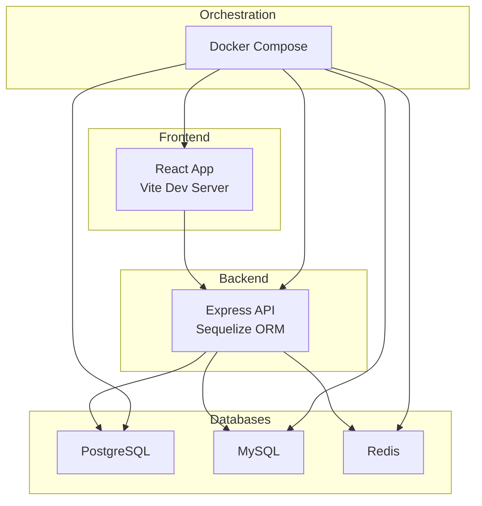
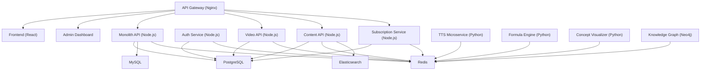
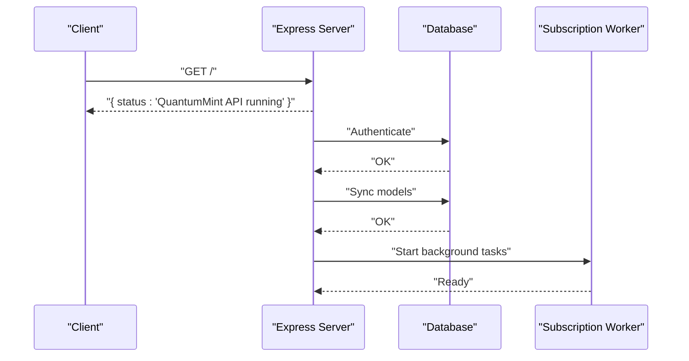
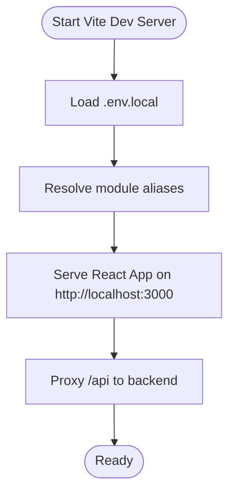
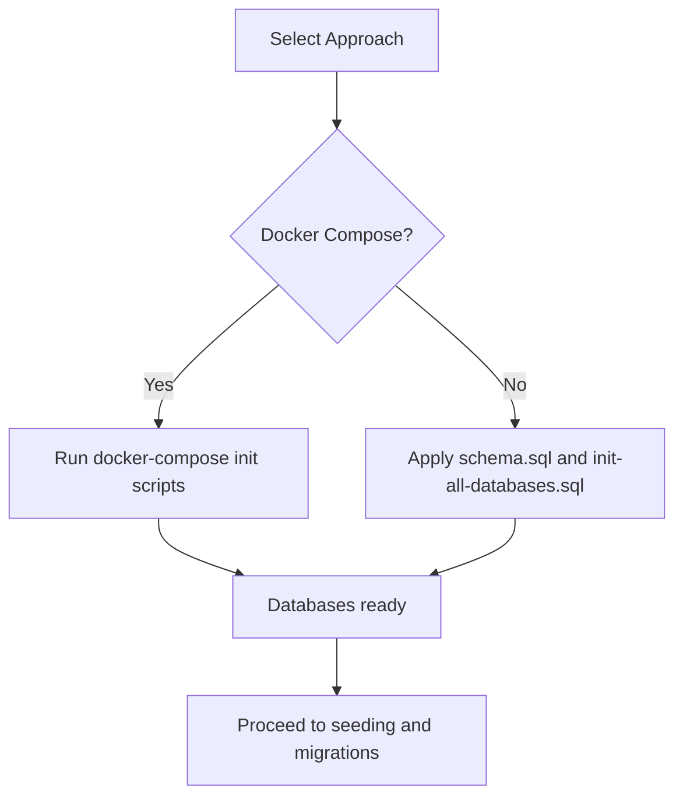

# Getting Started

<cite>
**Referenced Files in This Document**
- [backend/package.json](file://backend/package.json)
- [frontend/package.json](file://frontend/package.json)
- [admin/package.json](file://admin/package.json)
- [infrastructure/docker-compose.yml](file://infrastructure/docker-compose.yml)
- [docs/DEPLOYMENT.md](file://docs/DEPLOYMENT.md)
- [docs/SETUP_GUIDE.md](file://docs/SETUP_GUIDE.md)
- [backend/server.js](file://backend/server.js)
- [backend/schema.sql](file://backend/schema.sql)
- [database/init-all-databases.sql](file://database/init-all-databases.sql)
- [frontend/vite.config.ts](file://frontend/vite.config.ts)
- [frontend/Dockerfile](file://frontend/Dockerfile)
- [backend/Dockerfile](file://backend/Dockerfile)
- [start-backend.bat](file://start-backend.bat)
</cite>

## Table of Contents
1. [Introduction](#introduction)
2. [Project Structure](#project-structure)
3. [Prerequisites](#prerequisites)
4. [Environment Setup](#environment-setup)
5. [Local Development Configuration](#local-development-configuration)
6. [Initial Deployment Steps](#initial-deployment-steps)
7. [Core Components](#core-components)
8. [Architecture Overview](#architecture-overview)
9. [Detailed Component Analysis](#detailed-component-analysis)
10. [Dependency Analysis](#dependency-analysis)
11. [Performance Considerations](#performance-considerations)
12. [Troubleshooting Guide](#troubleshooting-guide)
13. [Verification and Next Steps](#verification-and-next-steps)
14. [Conclusion](#conclusion)

## Introduction
This guide walks you through setting up QuantumMint Bookstore from cloning the repository to your first successful run. It covers prerequisites, environment configuration, local development, and initial deployment for both local and production scenarios. You will configure environment variables, initialize databases, start services, verify the setup, and learn next steps for development and operations.

## Project Structure
QuantumMint Bookstore is a multi-service platform with:
- A Node.js backend API with Express and Sequelize ORM
- A React-based frontend built with Vite
- An admin dashboard
- A Docker Compose-based orchestration for services including PostgreSQL, Redis, Elasticsearch, Neo4j, and others
- Supporting services such as TTS, video processing, analytics, and more

**Diagram sources**
- [infrastructure/docker-compose.yml:1-373](file://infrastructure/docker-compose.yml#L1-L373)
- [backend/server.js:1-155](file://backend/server.js#L1-L155)
- [frontend/vite.config.ts:1-20](file://frontend/vite.config.ts#L1-L20)

**Section sources**
- [infrastructure/docker-compose.yml:1-373](file://infrastructure/docker-compose.yml#L1-L373)
- [docs/DEPLOYMENT.md:17-86](file://docs/DEPLOYMENT.md#L17-L86)

## Prerequisites
Install the following tools and services before proceeding:
- Node.js 18+ and npm 9+
- Git
- Docker and Docker Compose (optional but recommended for local development)
- PostgreSQL (for standalone development)
- Python (for certain microservices)
- A code editor (VS Code recommended)

Notes:
- The backend supports multiple database dialects (MySQL, PostgreSQL, SQLite). For local development without external dependencies, SQLite is used as a fallback.
- The frontend uses Vite and runs on port 3000 by default.

**Section sources**
- [docs/DEPLOYMENT.md:19-31](file://docs/DEPLOYMENT.md#L19-L31)
- [backend/server.js:58-84](file://backend/server.js#L58-L84)
- [frontend/vite.config.ts:7-10](file://frontend/vite.config.ts#L7-L10)

## Environment Setup
Create and configure environment files for the backend and frontend.

Backend environment variables:
- Define database connection details (DB_DIALECT, DB_HOST, DB_NAME, DB_USER, DB_PASS, DB_PORT)
- Define JWT_SECRET for authentication
- Optional: FRONTEND_URL, BACKEND_URL, STRIPE_CLIENT_ID

Frontend environment variables (.env.local):
- VITE_APP_URL
- VITE_API_BASE_URL
- VITE_TTS_SERVICE_URL
- VITE_MEDIA_SYNC_URL
- Payment gateway keys (test mode)
- Feature flags (e.g., VITE_ENABLE_PAYMENTS, VITE_ENABLE_ANALYTICS)

Example locations:
- Backend: backend/.env
- Frontend: frontend/.env.local

Verification:
- Confirm environment variables are loaded by the backend server and frontend dev server.

**Section sources**
- [backend/server.js:11-16](file://backend/server.js#L11-L16)
- [docs/DEPLOYMENT.md:49-69](file://docs/DEPLOYMENT.md#L49-L69)

## Local Development Configuration
Follow these steps to run the platform locally:

1. Clone the repository and navigate to the project root.
2. Install dependencies for backend, frontend, and admin:
   - Backend: cd backend && npm install
   - Frontend: cd frontend && npm install
   - Admin: cd admin && npm install
3. Start the backend API:
   - Option A: Use Docker Compose (recommended)
     - docker-compose -f infrastructure/docker-compose.yml up -d
   - Option B: Start backend locally
     - cd backend && npm run dev
4. Start the frontend:
   - cd frontend && npm run dev
   - The frontend runs on http://localhost:3000 by default
5. Verify connectivity:
   - Backend health endpoint: http://localhost:8000/
   - Frontend: http://localhost:3000

Database initialization:
- For Docker Compose, databases are initialized automatically using init scripts.
- For standalone PostgreSQL, apply schema and seed data using the provided SQL files.

**Section sources**
- [docs/DEPLOYMENT.md:32-86](file://docs/DEPLOYMENT.md#L32-L86)
- [infrastructure/docker-compose.yml:1-373](file://infrastructure/docker-compose.yml#L1-L373)
- [backend/schema.sql:1-132](file://backend/schema.sql#L1-L132)
- [database/init-all-databases.sql:1-470](file://database/init-all-databases.sql#L1-L470)

## Initial Deployment Steps
Choose a deployment scenario and follow the steps below.

Local Development (Docker Compose):
- Bring up all services:
  - docker-compose -f infrastructure/docker-compose.yml up -d
- Access:
  - Frontend: http://localhost:3000
  - Admin: http://localhost:3001
  - API Gateway: http://localhost
  - Monitoring: http://localhost:3002

Staging Deployment:
- Use Vercel or Netlify for the frontend.
- Configure environment variables for staging (API base URL, Stripe keys).
- Deploy using the platform’s CLI or dashboard.

Production Deployment:
- Recommended: Vercel for frontend with a custom backend API (e.g., Railway, Heroku, or VPS).
- Backend deployment options include serverless functions or PM2 on a VPS.
- Secure with SSL/TLS, configure monitoring, and set up CI/CD.

**Section sources**
- [docs/DEPLOYMENT.md:89-144](file://docs/DEPLOYMENT.md#L89-L144)
- [docs/DEPLOYMENT.md:147-398](file://docs/DEPLOYMENT.md#L147-L398)
- [infrastructure/docker-compose.yml:1-373](file://infrastructure/docker-compose.yml#L1-L373)

## Core Components
Key components and their roles:
- Backend API (Node.js + Express + Sequelize): Provides REST endpoints for authentication, payments, purchases, subscriptions, and more.
- Frontend (React + Vite): Learner and creator portal UI.
- Admin Dashboard: Administrative interface for managing content and users.
- Databases:
  - PostgreSQL (main and specialized databases)
  - MySQL (monolithic API)
  - Redis (caching and sessions)
- Microservices: TTS, video processing, analytics, knowledge graph, and more.

**Section sources**
- [backend/server.js:110-142](file://backend/server.js#L110-L142)
- [backend/package.json:16-50](file://backend/package.json#L16-L50)
- [frontend/package.json:12-45](file://frontend/package.json#L12-L45)
- [admin/package.json:9-13](file://admin/package.json#L9-L13)
- [infrastructure/docker-compose.yml:257-303](file://infrastructure/docker-compose.yml#L257-L303)

## Architecture Overview
The platform uses a containerized architecture orchestrated by Docker Compose. Services communicate over internal networks, share volumes for persistent data, and expose selected ports externally.

**Diagram sources**
- [infrastructure/docker-compose.yml:1-373](file://infrastructure/docker-compose.yml#L1-L373)

**Section sources**
- [infrastructure/docker-compose.yml:1-373](file://infrastructure/docker-compose.yml#L1-L373)

## Detailed Component Analysis

### Backend API
The backend initializes Express, applies security middleware, configures CORS, rate limiting, and logging. It connects to a database based on environment variables, loads models, synchronizes tables, and registers routes.

**Diagram sources**
- [backend/server.js:94-108](file://backend/server.js#L94-L108)
- [backend/server.js:144-147](file://backend/server.js#L144-L147)

Key behaviors:
- Environment validation for critical variables
- Dynamic database selection (MySQL/PostgreSQL/SQLite)
- Route registration for auth, payments, purchases, subscriptions, and more
- Health check endpoint

**Section sources**
- [backend/server.js:11-16](file://backend/server.js#L11-L16)
- [backend/server.js:58-84](file://backend/server.js#L58-L84)
- [backend/server.js:110-142](file://backend/server.js#L110-L142)
- [backend/server.js:144-155](file://backend/server.js#L144-L155)

### Frontend Development Server
The frontend uses Vite with React and runs on port 3000. It proxies API requests to the backend during development.

**Diagram sources**
- [frontend/vite.config.ts:5-19](file://frontend/vite.config.ts#L5-L19)

**Section sources**
- [frontend/vite.config.ts:5-19](file://frontend/vite.config.ts#L5-L19)

### Database Initialization
Two initialization approaches are available:
- Docker Compose: Initializes PostgreSQL databases and tables using init scripts.
- Standalone: Apply schema.sql for backend and init-all-databases.sql for unified services.

**Diagram sources**
- [database/init-all-databases.sql:1-470](file://database/init-all-databases.sql#L1-L470)
- [backend/schema.sql:1-132](file://backend/schema.sql#L1-L132)

**Section sources**
- [database/init-all-databases.sql:1-470](file://database/init-all-databases.sql#L1-L470)
- [backend/schema.sql:1-132](file://backend/schema.sql#L1-L132)

## Dependency Analysis
Runtime dependencies and their roles:
- Backend:
  - Express, helmet, cors, rate-limit, dotenv, winston, zod
  - Database clients: mysql2, pg, sqlite3
  - ORM: sequelize
  - Payment: stripe
  - Utilities: bcryptjs, jsonwebtoken, multer, node-cron, node-fetch, pdf-parse, mammoth, uuid
- Frontend:
  - React, React Router, TailwindCSS, Sonner, React Query, Sentry
  - Vite, TypeScript, PostCSS, autoprefixer
- Admin:
  - Express, ws, pg

Build-time dependencies:
- Backend: Jest, nodemon, ts-node, typescript
- Frontend: @vitejs/plugin-react, tailwindcss, workbox-window, vite-plugin-pwa

**Section sources**
- [backend/package.json:16-50](file://backend/package.json#L16-L50)
- [frontend/package.json:12-45](file://frontend/package.json#L12-L45)
- [admin/package.json:9-13](file://admin/package.json#L9-L13)

## Performance Considerations
- Use Docker Compose for consistent resource allocation and isolation.
- Enable caching with Redis for sessions and transient data.
- Optimize database queries and indexes for high-throughput routes.
- Monitor API latency and throughput using the built-in logging and external tools.
- For production, leverage CDN for frontend assets and auto-scaling for backend services.

[No sources needed since this section provides general guidance]

## Troubleshooting Guide
Common issues and resolutions:
- Backend fails to connect to database:
  - Verify DB_HOST, DB_NAME, DB_USER, DB_PASS, DB_PORT
  - Confirm database is reachable and credentials are correct
- Frontend cannot reach backend:
  - Ensure VITE_API_BASE_URL points to the correct backend URL
  - Check CORS configuration in the backend
- Docker Compose port conflicts:
  - Change exposed ports in docker-compose.yml or stop conflicting services
- SQLite fallback not working:
  - Ensure DB_HOST is not set or environment variables are missing to trigger fallback
- Health checks failing:
  - Check service logs with docker-compose logs -f <service>
- Payment or Stripe integration:
  - Confirm test keys are set in frontend environment variables

**Section sources**
- [backend/server.js:58-84](file://backend/server.js#L58-L84)
- [docs/DEPLOYMENT.md:313-342](file://docs/DEPLOYMENT.md#L313-L342)

## Verification and Next Steps
Verification steps:
- Backend health: curl http://localhost:8000/
- Frontend: open http://localhost:3000 in a browser
- Admin: open http://localhost:3001
- Database connectivity: confirm tables are created and seeded

Next steps:
- Explore admin dashboard and user roles
- Integrate payment gateways (Stripe, Orange Money)
- Upload content and test workflows
- Set up monitoring and analytics
- Plan CI/CD pipeline and backups

**Section sources**
- [docs/DEPLOYMENT.md:102-113](file://docs/DEPLOYMENT.md#L102-L113)
- [docs/SETUP_GUIDE.md:102-113](file://docs/SETUP_GUIDE.md#L102-L113)

## Conclusion
You now have the essentials to set up QuantumMint Bookstore locally and prepare for deployment. Use Docker Compose for streamlined local development, configure environment variables carefully, initialize databases, and verify services. Proceed with integrating payments, uploading content, and establishing monitoring and CI/CD for ongoing development.

[No sources needed since this section summarizes without analyzing specific files]