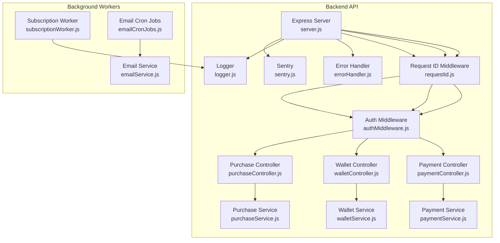
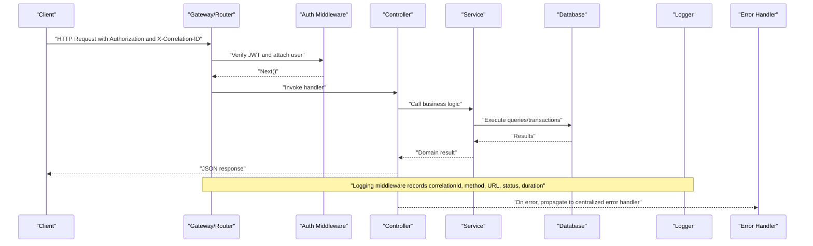
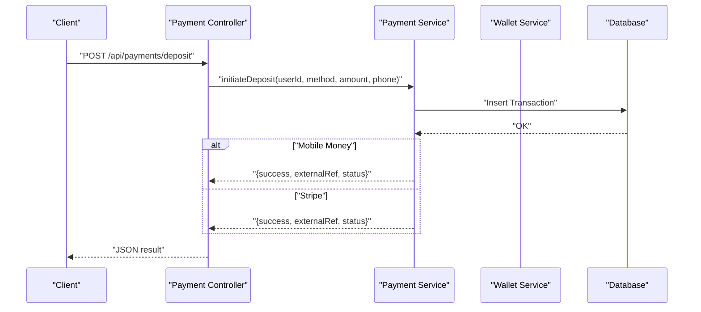
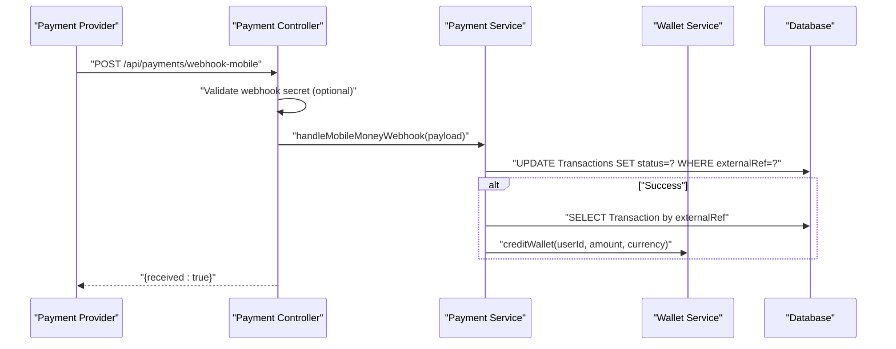
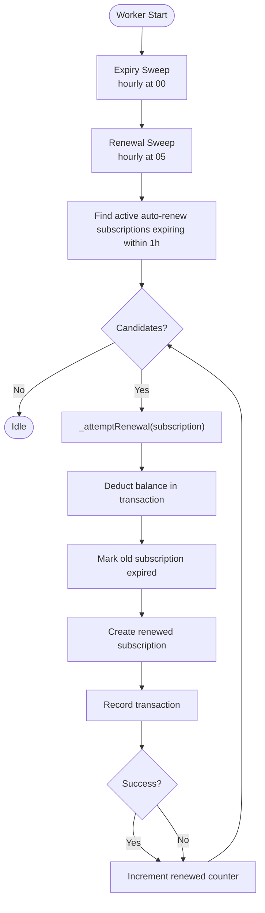
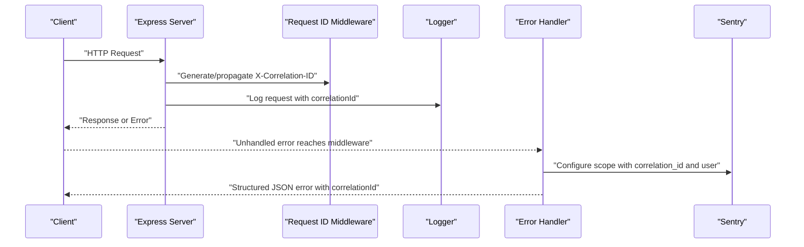
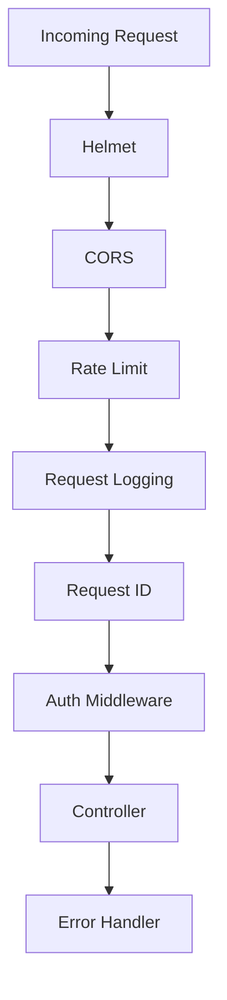
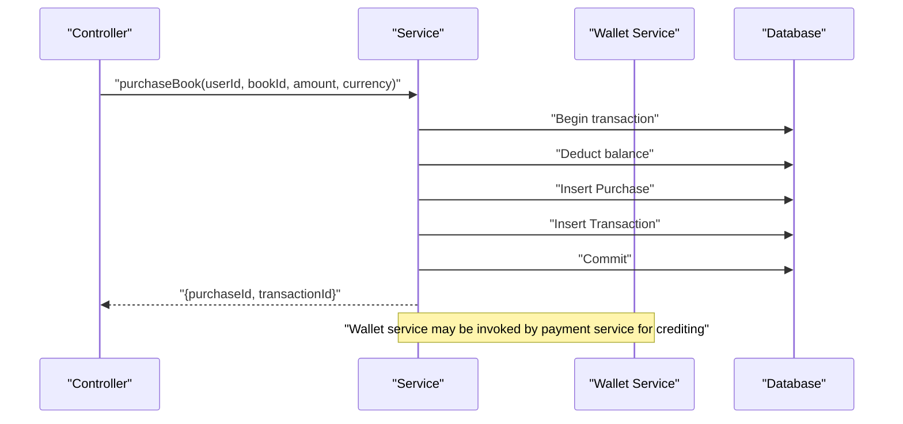
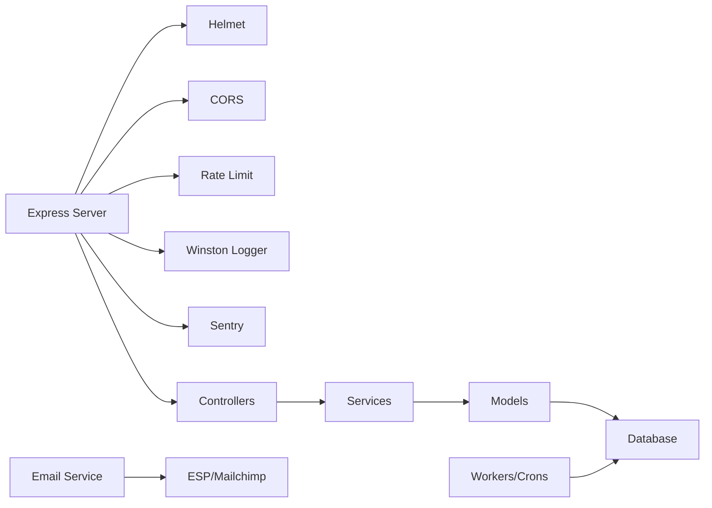

# Inter-Service Communication

<cite>
**Referenced Files in This Document**
- [server.js](file://backend/server.js)
- [requestId.js](file://backend/middleware/requestId.js)
- [errorHandler.js](file://backend/middleware/errorHandler.js)
- [logger.js](file://backend/utils/logger.js)
- [sentry.js](file://backend/utils/sentry.js)
- [authMiddleware.js](file://backend/middleware/authMiddleware.js)
- [asyncHandler.js](file://backend/middleware/asyncHandler.js)
- [paymentController.js](file://backend/controllers/paymentController.js)
- [walletController.js](file://backend/controllers/walletController.js)
- [purchaseController.js](file://backend/controllers/purchaseController.js)
- [paymentService.js](file://backend/services/paymentService.js)
- [walletService.js](file://backend/services/walletService.js)
- [purchaseService.js](file://backend/services/purchaseService.js)
- [subscriptionWorker.js](file://backend/workers/subscriptionWorker.js)
- [emailCronJobs.js](file://services/shared/cron/emailCronJobs.js)
- [emailService.js](file://services/shared/emailService.js)
- [service-registry-client.js](file://backend/utils/service-registry-client.js)
</cite>

## Table of Contents
1. [Introduction](#introduction)
2. [Project Structure](#project-structure)
3. [Core Components](#core-components)
4. [Architecture Overview](#architecture-overview)
5. [Detailed Component Analysis](#detailed-component-analysis)
6. [Dependency Analysis](#dependency-analysis)
7. [Performance Considerations](#performance-considerations)
8. [Troubleshooting Guide](#troubleshooting-guide)
9. [Conclusion](#conclusion)
10. [Appendices](#appendices)

## Introduction
This document explains inter-service communication patterns and protocols across the backend, supporting services, and shared components. It covers HTTP/REST communication, asynchronous event-driven patterns, and background workers. It also documents request correlation, distributed tracing, error propagation, and the middleware stack for authentication, logging, and rate limiting. Guidance is included for service-to-service API calls, webhook handling, and scheduling automation. Timeout handling, retry mechanisms, and circuit breaker strategies are outlined as recommended practices.

## Project Structure
The backend is an Express application that exposes REST endpoints grouped by domain capabilities (authentication, payments, wallet, purchases, subscriptions, refunds, learners, sellers, admin, search, TTS, formula, and interactions). Controllers delegate to services, which encapsulate business logic and database interactions. Background tasks are handled by workers and cron-based jobs. Cross-cutting concerns are implemented via middleware and utilities for logging, error handling, request correlation, and optional distributed tracing.

**Diagram sources**
- [server.js:18-155](file://backend/server.js#L18-L155)
- [requestId.js:1-15](file://backend/middleware/requestId.js#L1-L15)
- [errorHandler.js:1-44](file://backend/middleware/errorHandler.js#L1-L44)
- [authMiddleware.js:1-36](file://backend/middleware/authMiddleware.js#L1-L36)
- [paymentController.js:1-99](file://backend/controllers/paymentController.js#L1-L99)
- [walletController.js:1-17](file://backend/controllers/walletController.js#L1-L17)
- [purchaseController.js:1-13](file://backend/controllers/purchaseController.js#L1-L13)
- [paymentService.js:1-234](file://backend/services/paymentService.js#L1-L234)
- [walletService.js:1-80](file://backend/services/walletService.js#L1-L80)
- [purchaseService.js:1-68](file://backend/services/purchaseService.js#L1-L68)
- [logger.js:1-58](file://backend/utils/logger.js#L1-L58)
- [sentry.js:1-22](file://backend/utils/sentry.js#L1-L22)
- [subscriptionWorker.js:1-175](file://backend/workers/subscriptionWorker.js#L1-L175)
- [emailCronJobs.js:1-267](file://services/shared/cron/emailCronJobs.js#L1-L267)
- [emailService.js:1-399](file://services/shared/emailService.js#L1-L399)

**Section sources**
- [server.js:18-155](file://backend/server.js#L18-L155)

## Core Components
- HTTP request pipeline: Express server with Helmet, CORS, rate limiting, JSON parsing, request correlation, logging, and centralized error handling.
- Authentication: JWT bearer token verification middleware enforcing HS256 and admin role gating.
- Request correlation: X-Correlation-ID propagation via middleware and logging.
- Error handling: Centralized error handler enriching Sentry scope with correlation ID and returning structured JSON responses.
- Logging: Winston-based logger with file/console transports and component-scoped child loggers.
- Distributed tracing: Sentry initialization with sampling for backend services.
- Services: Domain services encapsulating business logic and database interactions.
- Background workers: Subscription renewal and expiry automation; email cron jobs for automation.

**Section sources**
- [server.js:18-155](file://backend/server.js#L18-L155)
- [requestId.js:1-15](file://backend/middleware/requestId.js#L1-L15)
- [errorHandler.js:1-44](file://backend/middleware/errorHandler.js#L1-L44)
- [logger.js:1-58](file://backend/utils/logger.js#L1-L58)
- [sentry.js:1-22](file://backend/utils/sentry.js#L1-L22)
- [authMiddleware.js:1-36](file://backend/middleware/authMiddleware.js#L1-L36)
- [paymentService.js:1-234](file://backend/services/paymentService.js#L1-L234)
- [walletService.js:1-80](file://backend/services/walletService.js#L1-L80)
- [purchaseService.js:1-68](file://backend/services/purchaseService.js#L1-L68)
- [subscriptionWorker.js:1-175](file://backend/workers/subscriptionWorker.js#L1-L175)
- [emailCronJobs.js:1-267](file://services/shared/cron/emailCronJobs.js#L1-L267)
- [emailService.js:1-399](file://services/shared/emailService.js#L1-L399)

## Architecture Overview
The backend exposes REST endpoints under /api/*, each mapped to a controller. Controllers validate inputs, enforce authentication, and delegate to services. Services coordinate database operations and may call other internal services. Background workers and cron jobs operate independently, interacting with the database and external providers. Cross-cutting concerns are injected via middleware and utilities.

**Diagram sources**
- [server.js:18-155](file://backend/server.js#L18-L155)
- [authMiddleware.js:1-36](file://backend/middleware/authMiddleware.js#L1-L36)
- [paymentController.js:1-99](file://backend/controllers/paymentController.js#L1-L99)
- [paymentService.js:1-234](file://backend/services/paymentService.js#L1-L234)
- [logger.js:1-58](file://backend/utils/logger.js#L1-L58)
- [errorHandler.js:1-44](file://backend/middleware/errorHandler.js#L1-L44)

## Detailed Component Analysis

### HTTP/REST Communication Patterns
- Endpoint routing: Controllers are mounted under /api/* routes and use async wrappers to forward exceptions to the error handler.
- Request validation: Controllers extract and validate request bodies and query parameters.
- Authentication: All protected routes use JWT bearer tokens validated by middleware.
- Response format: Controllers return JSON; errors are normalized by the centralized error handler.

**Diagram sources**
- [paymentController.js:17-33](file://backend/controllers/paymentController.js#L17-L33)
- [paymentService.js:53-85](file://backend/services/paymentService.js#L53-L85)

**Section sources**
- [paymentController.js:17-33](file://backend/controllers/paymentController.js#L17-L33)
- [paymentService.js:53-85](file://backend/services/paymentService.js#L53-L85)

### Webhook Handling and Event-Driven Patterns
- Mobile Money webhook: Validates presence of a shared secret in production and delegates to the payment service to update transaction status and credit wallets when appropriate.
- Stripe webhook: Verifies signatures using the Stripe SDK and processes payment intent events to update transactions and credit wallets.
- Event publication/subscription: Not implemented as HTTP callbacks in the backend; however, the email service supports scheduled sequences and webhook event handling for provider integrations.

**Diagram sources**
- [paymentController.js:59-72](file://backend/controllers/paymentController.js#L59-L72)
- [paymentService.js:149-166](file://backend/services/paymentService.js#L149-L166)
- [walletService.js:64-80](file://backend/services/walletService.js#L64-L80)

**Section sources**
- [paymentController.js:59-72](file://backend/controllers/paymentController.js#L59-L72)
- [paymentController.js:74-98](file://backend/controllers/paymentController.js#L74-L98)
- [paymentService.js:149-185](file://backend/services/paymentService.js#L149-L185)
- [emailService.js:374-392](file://services/shared/emailService.js#L374-L392)

### Asynchronous Event-Driven Patterns and Background Workers
- Subscription worker: Runs hourly cron jobs to mark expired subscriptions and attempt auto-renewals within a rolling window, all within database transactions. Logs outcomes and errors.
- Email automation: Cron-based jobs orchestrate abandoned cart reminders, newsletter dispatch, back-in-stock alerts, and queue processing. Email service supports scheduled sequences and provider webhooks.

**Diagram sources**
- [subscriptionWorker.js:97-175](file://backend/workers/subscriptionWorker.js#L97-L175)

**Section sources**
- [subscriptionWorker.js:17-89](file://backend/workers/subscriptionWorker.js#L17-L89)
- [subscriptionWorker.js:97-175](file://backend/workers/subscriptionWorker.js#L97-L175)
- [emailCronJobs.js:19-118](file://services/shared/cron/emailCronJobs.js#L19-L118)
- [emailService.js:272-312](file://services/shared/emailService.js#L272-L312)

### Request Correlation, Distributed Tracing, and Error Propagation
- Request correlation: A unique X-Correlation-ID is generated or propagated and attached to logs and error responses.
- Distributed tracing: Sentry is initialized with a DSN and sampling rate; the error handler attaches correlation ID and user info to the Sentry scope.
- Error propagation: Errors thrown in async handlers bubble to the centralized error handler, which returns structured JSON and logs appropriately.

**Diagram sources**
- [server.js:18-47](file://backend/server.js#L18-L47)
- [requestId.js:7-12](file://backend/middleware/requestId.js#L7-L12)
- [logger.js:21-31](file://backend/utils/logger.js#L21-L31)
- [errorHandler.js:5-41](file://backend/middleware/errorHandler.js#L5-L41)
- [sentry.js:3-21](file://backend/utils/sentry.js#L3-L21)

**Section sources**
- [requestId.js:7-12](file://backend/middleware/requestId.js#L7-L12)
- [logger.js:21-31](file://backend/utils/logger.js#L21-L31)
- [errorHandler.js:5-41](file://backend/middleware/errorHandler.js#L5-L41)
- [sentry.js:3-21](file://backend/utils/sentry.js#L3-L21)

### Middleware Stack for Cross-Cutting Concerns
- Helmet: Basic security headers.
- CORS: Configured origins, methods, headers, credentials, and preflight caching.
- Rate limiting: Global limiter for all routes.
- Request logging: Measures duration and logs correlationId, method, URL, status, and IP.
- Request ID: Generates or preserves X-Correlation-ID.
- Authentication: JWT bearer token verification and admin role enforcement.
- Error handling: Centralized handler with Sentry tagging and structured responses.

**Diagram sources**
- [server.js:18-55](file://backend/server.js#L18-L55)
- [server.js:32-47](file://backend/server.js#L32-L47)
- [requestId.js:7-12](file://backend/middleware/requestId.js#L7-L12)
- [authMiddleware.js:3-25](file://backend/middleware/authMiddleware.js#L3-L25)
- [errorHandler.js:5-41](file://backend/middleware/errorHandler.js#L5-L41)

**Section sources**
- [server.js:18-55](file://backend/server.js#L18-L55)
- [server.js:32-47](file://backend/server.js#L32-L47)
- [authMiddleware.js:3-25](file://backend/middleware/authMiddleware.js#L3-L25)

### Service-to-Service API Calls and Contracts
- Internal service calls: Controllers call services; services may call other services (e.g., payment service invokes wallet service to credit balances).
- Database access: Services use the Sequelize instance provided by the Express app to execute queries and transactions.
- Contract expectations: Controllers validate inputs and return structured JSON; services enforce domain rules and return domain-specific results.

**Diagram sources**
- [purchaseController.js:7-12](file://backend/controllers/purchaseController.js#L7-L12)
- [purchaseService.js:4-67](file://backend/services/purchaseService.js#L4-L67)
- [paymentService.js:161-164](file://backend/services/paymentService.js#L161-L164)
- [walletService.js:64-80](file://backend/services/walletService.js#L64-L80)

**Section sources**
- [purchaseController.js:7-12](file://backend/controllers/purchaseController.js#L7-L12)
- [purchaseService.js:4-67](file://backend/services/purchaseService.js#L4-L67)
- [paymentService.js:161-164](file://backend/services/paymentService.js#L161-L164)
- [walletService.js:64-80](file://backend/services/walletService.js#L64-L80)

### Timeout Handling, Retry Mechanisms, and Circuit Breakers
- Timeouts: Configure HTTP client timeouts when invoking external services (e.g., payment providers) to prevent resource starvation.
- Retries: Implement exponential backoff with jitter for transient failures; guard against thundering herd by staggering retry schedules.
- Circuit breakers: Monitor failure rates and latency; open the circuit on thresholds and allow limited probe requests to detect recovery.

[No sources needed since this section provides general guidance]

### Guidelines for Service Contract Management and API Versioning
- Version endpoints under /api/v1/, /api/v2/, etc., and maintain backward compatibility during transitions.
- Use semantic versioning and deprecation timelines; expose a changelog and migration guide.
- Enforce strict request/response schemas and evolve contracts with additive changes.
- Maintain separate deployment artifacts per major version to avoid breaking dependent clients.

[No sources needed since this section provides general guidance]

## Dependency Analysis
The backend’s runtime dependencies include Express, Helmet, CORS, rate limiting, Winston for logging, Sentry for error tracking, and Sequelize for persistence. Controllers depend on services; services depend on models and the database. Background workers depend on the database and external providers. The email service depends on provider SDKs and cron jobs.

**Diagram sources**
- [server.js:18-155](file://backend/server.js#L18-L155)
- [logger.js:21-31](file://backend/utils/logger.js#L21-L31)
- [sentry.js:3-21](file://backend/utils/sentry.js#L3-L21)
- [subscriptionWorker.js:1-175](file://backend/workers/subscriptionWorker.js#L1-175)
- [emailService.js:1-399](file://services/shared/emailService.js#L1-L399)

**Section sources**
- [server.js:18-155](file://backend/server.js#L18-L155)
- [logger.js:21-31](file://backend/utils/logger.js#L21-L31)
- [sentry.js:3-21](file://backend/utils/sentry.js#L3-L21)
- [subscriptionWorker.js:1-175](file://backend/workers/subscriptionWorker.js#L1-175)
- [emailService.js:1-399](file://services/shared/emailService.js#L1-L399)

## Performance Considerations
- Keep request payloads minimal and bounded; the server enforces a 10kb limit for JSON and URL-encoded bodies.
- Use database transactions for atomic operations to reduce contention and improve consistency.
- Apply rate limiting to protect downstream systems; tune thresholds per endpoint if needed.
- Offload long-running tasks to background workers and cron jobs to keep request latency low.
- Enable compression and cache static assets at the gateway where applicable.

[No sources needed since this section provides general guidance]

## Troubleshooting Guide
- Correlation ID: Include X-Correlation-ID in all requests and logs to trace end-to-end flows.
- Error responses: Centralized error handler returns structured JSON with correlationId; inspect stack traces and Sentry events.
- Logging: Use component-scoped loggers to isolate service logs; verify transports and log levels.
- Sentry: Ensure DSN is configured; verify tracesSampleRate and environment; confirm correlation_id tag is present.
- Webhooks: Validate signatures for Stripe; enforce shared secrets for mobile money in production.
- Background jobs: Monitor worker logs and cron schedules; verify database connectivity and transaction rollbacks.

**Section sources**
- [requestId.js:7-12](file://backend/middleware/requestId.js#L7-L12)
- [errorHandler.js:5-41](file://backend/middleware/errorHandler.js#L5-L41)
- [logger.js:21-31](file://backend/utils/logger.js#L21-L31)
- [sentry.js:3-21](file://backend/utils/sentry.js#L3-L21)
- [paymentController.js:59-72](file://backend/controllers/paymentController.js#L59-L72)
- [paymentController.js:74-98](file://backend/controllers/paymentController.js#L74-L98)
- [subscriptionWorker.js:97-175](file://backend/workers/subscriptionWorker.js#L97-L175)

## Conclusion
The backend implements a clean separation of concerns with robust cross-cutting middleware for security, observability, and reliability. HTTP/REST endpoints are protected and logged, with request correlation and centralized error handling. Webhook processing ensures reliable event ingestion from payment providers. Background workers and cron jobs automate recurring tasks while maintaining data consistency. Recommended improvements include implementing distributed tracing spans, adding timeouts and retries for outbound calls, and adopting circuit breakers for resilience.

## Appendices
- Service Registry: A client stub is provided for future service registration and health checks.
- Exchange Rate Service: Wallet service integrates with an exchange rate service for dynamic conversions.

**Section sources**
- [service-registry-client.js:1-16](file://backend/utils/service-registry-client.js#L1-L16)
- [walletService.js:15-21](file://backend/services/walletService.js#L15-L21)