# Microservices Architecture

<cite>
**Referenced Files in This Document**
- [backend/package.json](file://backend/package.json)
- [backend/server.js](file://backend/server.js)
- [backend/utils/service-registry-client.js](file://backend/utils/service-registry-client.js)
- [backend/workers/subscriptionWorker.js](file://backend/workers/subscriptionWorker.js)
- [frontend/src/api/client.ts](file://frontend/src/api/client.ts)
- [infrastructure/docker-compose.yml](file://infrastructure/docker-compose.yml)
- [infrastructure/docker-compose.complete.yml](file://infrastructure/docker-compose.complete.yml)
- [infrastructure/nginx/nginx.conf](file://infrastructure/nginx/nginx.conf)
- [services/auth/server.js](file://services/auth/server.js)
- [services/subscription/src/index.ts](file://services/subscription/src/index.ts)
- [services/content/api/app.py](file://services/content/api/app.py)
- [services/video/api/server.js](file://services/video/api/server.js)
- [services/tts/python/server.py](file://services/tts/python/server.py)
- [services/analytics-service/src/server.js](file://services/analytics-service/src/server.js)
- [services/paygo-service/src/server.js](file://services/paygo-service/src/server.js)
- [prometheus/prometheus.yml](file://prometheus/prometheus.yml)
- [docs/SERVICES.md](file://docs/SERVICES.md)
</cite>

## Table of Contents
1. [Introduction](#introduction)
2. [Project Structure](#project-structure)
3. [Core Components](#core-components)
4. [Architecture Overview](#architecture-overview)
5. [Detailed Component Analysis](#detailed-component-analysis)
6. [Dependency Analysis](#dependency-analysis)
7. [Performance Considerations](#performance-considerations)
8. [Troubleshooting Guide](#troubleshooting-guide)
9. [Conclusion](#conclusion)
10. [Appendices](#appendices)

## Introduction
This document describes the microservices ecosystem for the QuantumMint bookstore platform. It covers service discovery, inter-service communication, distributed system patterns, load balancing, fault tolerance, messaging and event-driven architectures, deployment and orchestration, monitoring and observability, circuit breaker patterns, and graceful degradation. The platform integrates a unified API gateway, monolithic backend, specialized microservices, and supporting infrastructure such as databases, caching, and analytics.

## Project Structure
The platform is organized into:
- Monolithic backend (Node.js) exposing REST APIs and coordinating core business logic
- Specialized microservices (Node.js, Python, TypeScript) for authentication, subscriptions, content, video, TTS, analytics, and PayGO
- Frontend (React) consuming service endpoints
- Infrastructure composed of Docker containers orchestrated by Docker Compose and NGINX for routing
- Observability stack with Prometheus and Grafana

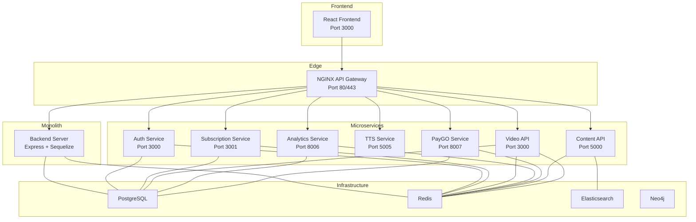

**Diagram sources**
- [infrastructure/docker-compose.yml:1-373](file://infrastructure/docker-compose.yml#L1-L373)
- [infrastructure/docker-compose.complete.yml:1-344](file://infrastructure/docker-compose.complete.yml#L1-L344)
- [infrastructure/nginx/nginx.conf:1-49](file://infrastructure/nginx/nginx.conf#L1-L49)
- [backend/server.js:1-155](file://backend/server.js#L1-L155)

**Section sources**
- [infrastructure/docker-compose.yml:1-373](file://infrastructure/docker-compose.yml#L1-L373)
- [infrastructure/docker-compose.complete.yml:1-344](file://infrastructure/docker-compose.complete.yml#L1-L344)
- [infrastructure/nginx/nginx.conf:1-49](file://infrastructure/nginx/nginx.conf#L1-L49)

## Core Components
- API Gateway (NGINX): Central entrypoint routing traffic to backend and microservices; defines upstreams for video API, streaming server, and admin dashboard.
- Backend (monolith): Express server with route registration, database connectivity, and background workers for subscription lifecycle automation.
- Auth Service: Lightweight health-check service for authentication.
- Subscription Service: Subscription lifecycle, billing, access control, and usage tracking with health checks and graceful shutdown.
- Video API: Chunked uploads, Redis-backed state, PostgreSQL persistence, Prometheus metrics, and scheduled cleanup.
- TTS Service: Text segmentation, SSML generation, optional caching, and rate limiting.
- Content API: Audiobook generation and TTS synthesis endpoints with SSE for progress.
- Analytics Service: Event ingestion, user/book analytics, and platform overview with JWT auth.
- PayGO Service: Wallet management, session-based usage tracking, charging, and scheduled maintenance.
- Infrastructure: PostgreSQL, Redis, Elasticsearch, Neo4j, Prometheus/Grafana.

**Section sources**
- [infrastructure/nginx/nginx.conf:9-41](file://infrastructure/nginx/nginx.conf#L9-L41)
- [backend/server.js:110-147](file://backend/server.js#L110-L147)
- [services/auth/server.js:1-14](file://services/auth/server.js#L1-L14)
- [services/subscription/src/index.ts:162-180](file://services/subscription/src/index.ts#L162-L180)
- [services/video/api/server.js:267-390](file://services/video/api/server.js#L267-L390)
- [services/tts/python/server.py:1-190](file://services/tts/python/server.py#L1-L190)
- [services/content/api/app.py:34-265](file://services/content/api/app.py#L34-L265)
- [services/analytics-service/src/server.js:78-356](file://services/analytics-service/src/server.js#L78-L356)
- [services/paygo-service/src/server.js:87-691](file://services/paygo-service/src/server.js#L87-L691)

## Architecture Overview
The system employs a hybrid architecture:
- Edge routing via NGINX
- Monolithic backend for core services and route aggregation
- Dedicated microservices for specialized domains
- Shared infrastructure for persistence and caching
- Observability with Prometheus and Grafana

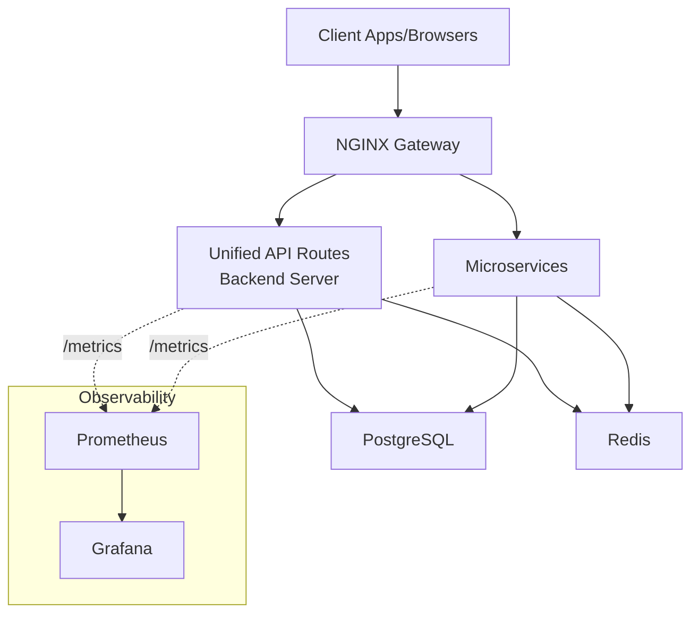

**Diagram sources**
- [infrastructure/docker-compose.yml:5-27](file://infrastructure/docker-compose.yml#L5-L27)
- [prometheus/prometheus.yml:20-28](file://prometheus/prometheus.yml#L20-L28)

**Section sources**
- [infrastructure/docker-compose.yml:1-373](file://infrastructure/docker-compose.yml#L1-L373)
- [prometheus/prometheus.yml:1-29](file://prometheus/prometheus.yml#L1-L29)

## Detailed Component Analysis

### Service Discovery and Registration
- Service Registry Client exists but is currently a stub; it logs registration and health endpoints without HTTP calls.
- In practice, services rely on Docker Compose service names for inter-container networking and explicit port exposure for external access.

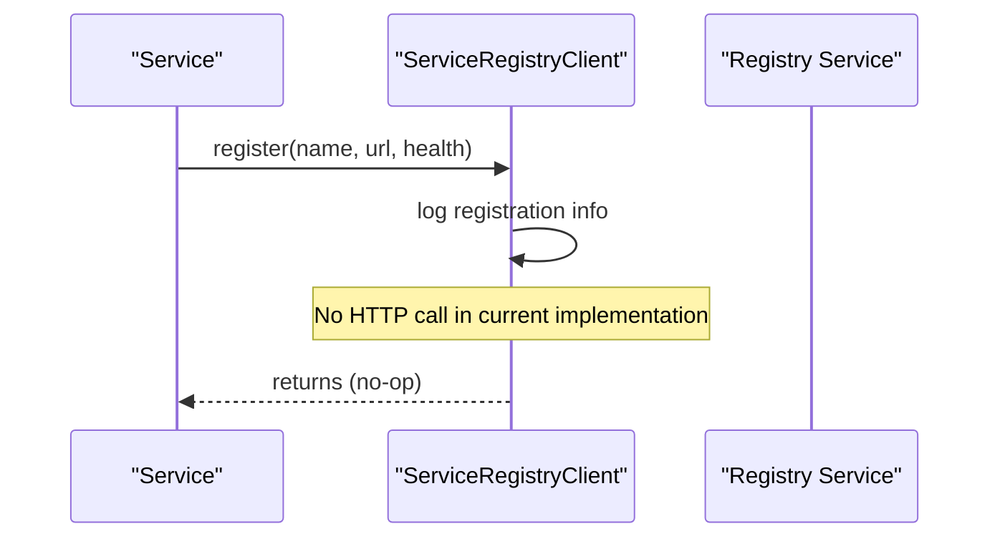

**Diagram sources**
- [backend/utils/service-registry-client.js:1-16](file://backend/utils/service-registry-client.js#L1-L16)

**Section sources**
- [backend/utils/service-registry-client.js:1-16](file://backend/utils/service-registry-client.js#L1-L16)

### Inter-Service Communication Patterns
- REST over HTTP with JWT-based authentication in several services.
- SSE for progress updates in Content API.
- Prometheus metrics endpoints for health and operational visibility.
- Redis used for caching and lightweight queuing across services.

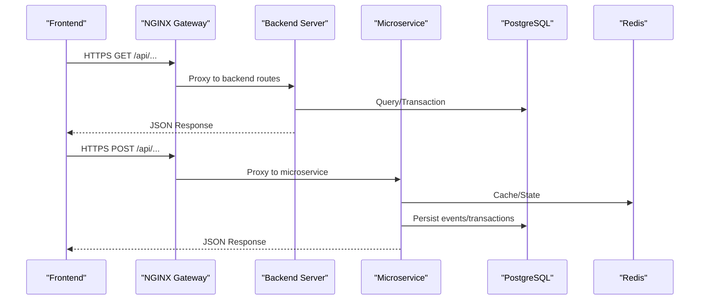

**Diagram sources**
- [infrastructure/nginx/nginx.conf:21-47](file://infrastructure/nginx/nginx.conf#L21-L47)
- [backend/server.js:127-142](file://backend/server.js#L127-L142)
- [services/subscription/src/index.ts:186-210](file://services/subscription/src/index.ts#L186-L210)
- [services/video/api/server.js:267-318](file://services/video/api/server.js#L267-L318)

**Section sources**
- [frontend/src/api/client.ts:1-119](file://frontend/src/api/client.ts#L1-L119)
- [services/subscription/src/index.ts:59-118](file://services/subscription/src/index.ts#L59-L118)
- [services/content/api/app.py:60-113](file://services/content/api/app.py#L60-L113)
- [services/video/api/server.js:353-364](file://services/video/api/server.js#L353-L364)

### Load Balancing Strategies
- NGINX upstream blocks define service backends for video API, streaming server, and admin dashboard.
- Horizontal scaling can be achieved by running multiple replicas behind the same upstream; NGINX round-robin balances requests by default.

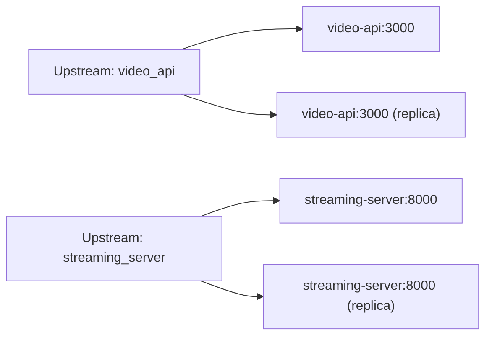

**Diagram sources**
- [infrastructure/docker-compose.yml:9-15](file://infrastructure/docker-compose.yml#L9-L15)
- [infrastructure/nginx/nginx.conf:9-15](file://infrastructure/nginx/nginx.conf#L9-L15)

**Section sources**
- [infrastructure/nginx/nginx.conf:9-15](file://infrastructure/nginx/nginx.conf#L9-L15)
- [infrastructure/docker-compose.yml:23-27](file://infrastructure/docker-compose.yml#L23-L27)

### Fault Tolerance and Graceful Degradation
- Health checks: Services expose /health endpoints for readiness/liveness.
- Graceful shutdown: Subscription service handles SIGTERM/SIGINT to close connections cleanly.
- Background workers: Subscription worker runs periodic tasks for expiry and renewal with error logging.
- Redis resilience: Video API initializes Redis with reconnection strategy and guards against test mode.
- Rate limiting: Express rate limiter applied at API boundaries to protect services.

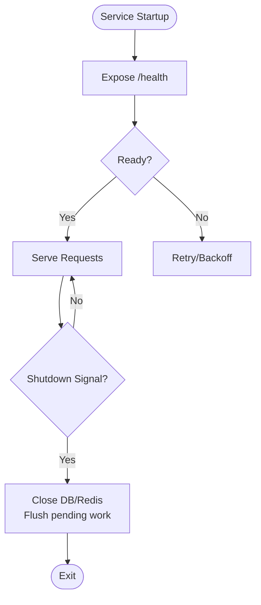

**Diagram sources**
- [services/subscription/src/index.ts:162-180](file://services/subscription/src/index.ts#L162-L180)
- [services/subscription/src/index.ts:568-583](file://services/subscription/src/index.ts#L568-L583)
- [backend/workers/subscriptionWorker.js:97-172](file://backend/workers/subscriptionWorker.js#L97-L172)
- [services/video/api/server.js:82-95](file://services/video/api/server.js#L82-L95)

**Section sources**
- [services/subscription/src/index.ts:162-180](file://services/subscription/src/index.ts#L162-L180)
- [services/subscription/src/index.ts:568-583](file://services/subscription/src/index.ts#L568-L583)
- [backend/workers/subscriptionWorker.js:97-172](file://backend/workers/subscriptionWorker.js#L97-L172)
- [services/video/api/server.js:82-95](file://services/video/api/server.js#L82-L95)

### Messaging and Event-Driven Architecture
- Redis pub/sub and lists are used for lightweight queuing and caching across services (e.g., video queue, upload state).
- SSE endpoints deliver progress updates for long-running tasks (Content API).
- Scheduled tasks automate maintenance (e.g., expired session cleanup, auto-topup processing).

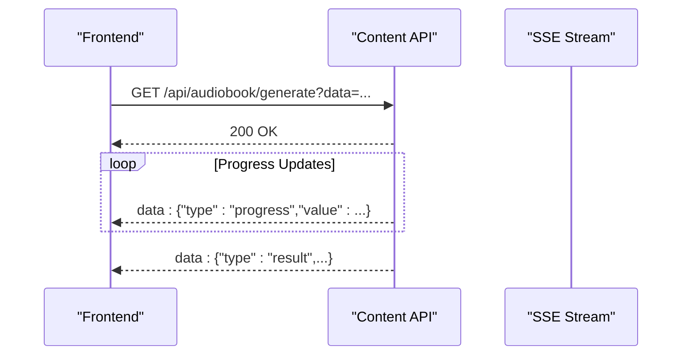

**Diagram sources**
- [services/content/api/app.py:60-113](file://services/content/api/app.py#L60-L113)

**Section sources**
- [services/video/api/server.js:298-311](file://services/video/api/server.js#L298-L311)
- [services/content/api/app.py:60-113](file://services/content/api/app.py#L60-L113)
- [services/paygo-service/src/server.js:642-682](file://services/paygo-service/src/server.js#L642-L682)

### Deployment and Container Orchestration
- Docker Compose orchestrates services, networks, and volumes; includes healthchecks and resource reservations for GPU-enabled processors.
- Separate compose files for different environments (basic and complete).
- NGINX configuration defines upstreams and proxy rules.

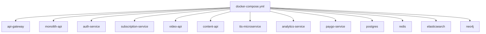

**Diagram sources**
- [infrastructure/docker-compose.yml:3-112](file://infrastructure/docker-compose.yml#L3-L112)
- [infrastructure/docker-compose.complete.yml:4-136](file://infrastructure/docker-compose.complete.yml#L4-L136)

**Section sources**
- [infrastructure/docker-compose.yml:1-373](file://infrastructure/docker-compose.yml#L1-L373)
- [infrastructure/docker-compose.complete.yml:1-344](file://infrastructure/docker-compose.complete.yml#L1-L344)

### Monitoring and Observability
- Prometheus scrapes metrics from services (/metrics endpoints).
- Grafana dashboard for visualization.
- Service-specific metrics endpoints (e.g., Video API exposes metrics protected by auth).

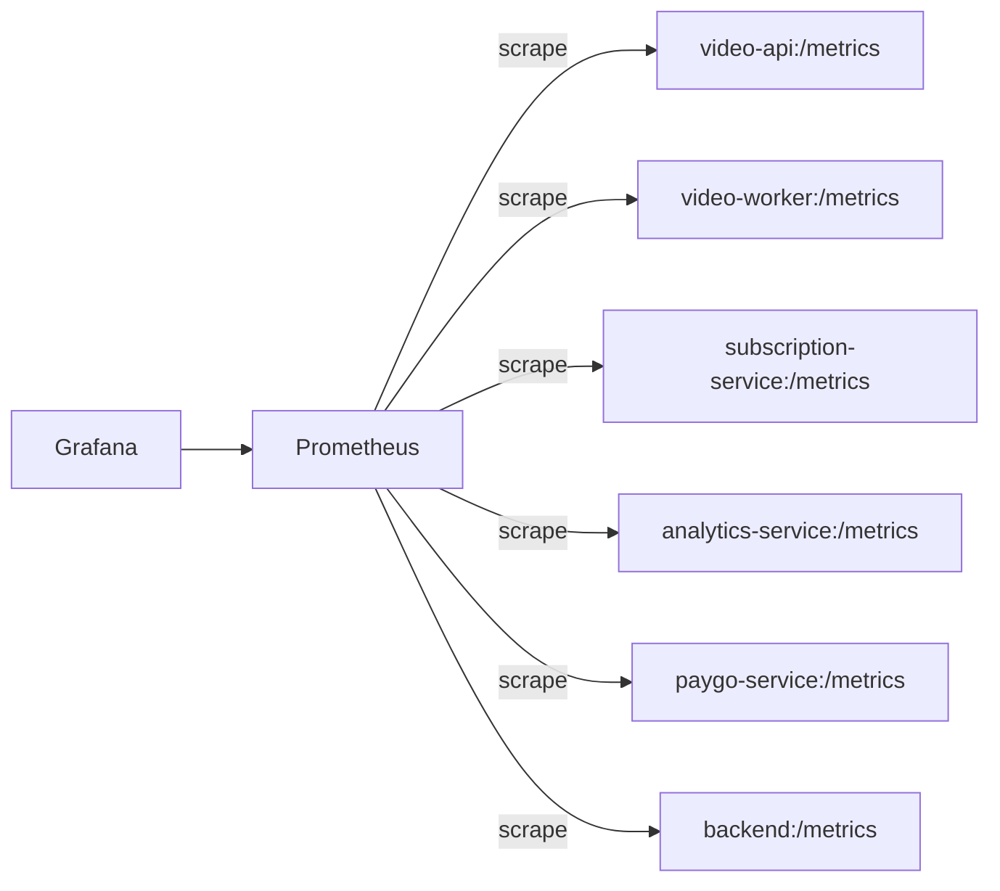

**Diagram sources**
- [prometheus/prometheus.yml:20-28](file://prometheus/prometheus.yml#L20-L28)

**Section sources**
- [prometheus/prometheus.yml:1-29](file://prometheus/prometheus.yml#L1-L29)
- [services/video/api/server.js:353-364](file://services/video/api/server.js#L353-L364)

### Circuit Breaker and Graceful Degradation Mechanisms
- Frontend API client centralizes error handling and redirects on 401; while not a traditional circuit breaker, it demonstrates client-side resilience.
- Redis availability is guarded; when unavailable, services operate without cache (graceful degradation).
- Health checks enable external monitoring and remediation.

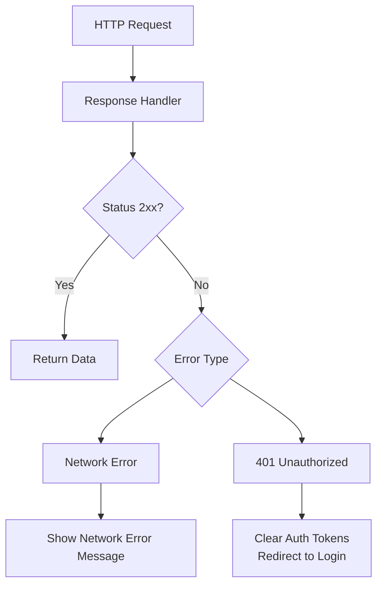

**Diagram sources**
- [frontend/src/api/client.ts:34-61](file://frontend/src/api/client.ts#L34-L61)

**Section sources**
- [frontend/src/api/client.ts:1-119](file://frontend/src/api/client.ts#L1-L119)
- [services/tts/python/server.py:40-58](file://services/tts/python/server.py#L40-L58)

### Examples of Service Interactions
- Frontend to Backend: Frontend constructs base URLs and uses a shared client to call backend routes.
- Frontend to Microservices: Frontend reads service URLs from environment and routes accordingly.
- Backend to Subscription Service: Backend routes under /api/subscriptions delegate to the subscription service.

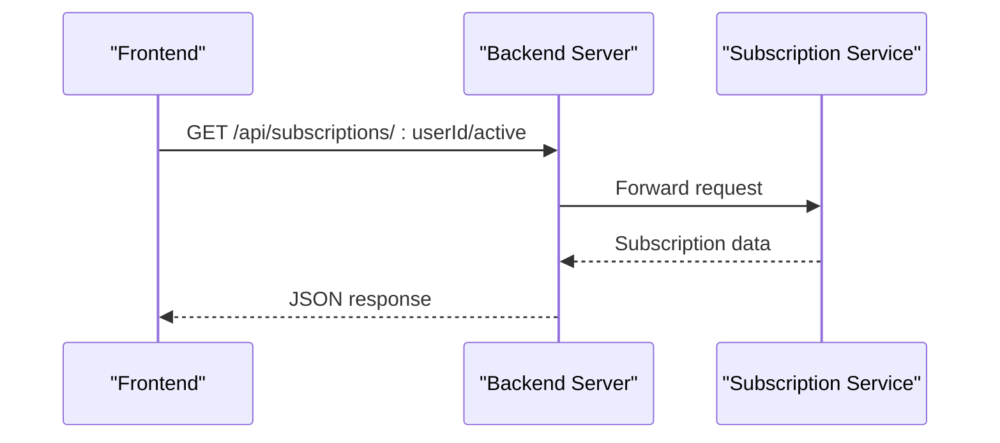

**Diagram sources**
- [frontend/src/api/client.ts:90-104](file://frontend/src/api/client.ts#L90-L104)
- [backend/server.js:140-142](file://backend/server.js#L140-L142)
- [services/subscription/src/index.ts:240-262](file://services/subscription/src/index.ts#L240-L262)

**Section sources**
- [frontend/src/api/client.ts:90-104](file://frontend/src/api/client.ts#L90-L104)
- [backend/server.js:127-142](file://backend/server.js#L127-L142)
- [services/subscription/src/index.ts:240-262](file://services/subscription/src/index.ts#L240-L262)

### Dependency Management and Lifecycle
- Backend dependencies include Express, Sequelize, Redis, Stripe, Sentry, and others.
- Docker Compose manages service lifecycles, healthchecks, and resource allocation (e.g., GPU).
- Service lifecycle includes startup, health checks, metrics exposure, and graceful shutdown.

**Section sources**
- [backend/package.json:16-39](file://backend/package.json#L16-L39)
- [infrastructure/docker-compose.yml:107-111](file://infrastructure/docker-compose.yml#L107-L111)
- [services/subscription/src/index.ts:568-583](file://services/subscription/src/index.ts#L568-L583)

## Dependency Analysis
Inter-service dependencies and coupling:
- Backend depends on PostgreSQL and Redis; routes are mounted under /api.
- Microservices share PostgreSQL and Redis; some depend on Elasticsearch (e.g., Content API).
- NGINX acts as a reverse proxy and load balancer for upstream services.

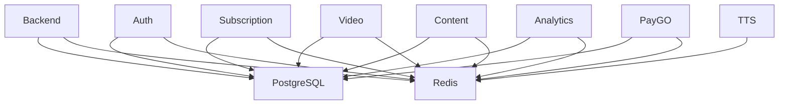

**Diagram sources**
- [infrastructure/docker-compose.yml:67-112](file://infrastructure/docker-compose.yml#L67-L112)

**Section sources**
- [infrastructure/docker-compose.yml:67-112](file://infrastructure/docker-compose.yml#L67-L112)

## Performance Considerations
- Use Redis for caching frequently accessed data and reducing database load.
- Apply rate limiting at the gateway and per-service to prevent overload.
- Offload heavy computations (e.g., video processing) to dedicated workers and GPUs.
- Monitor queue depths and latency via Prometheus metrics.
- Scale horizontally by adding replicas behind NGINX upstreams.

## Troubleshooting Guide
Common issues and resolutions:
- Port conflicts: Verify ports are free or adjust .env and docker-compose.
- Database connectivity: Confirm PostgreSQL is healthy and credentials are correct.
- Redis unavailability: Check Redis connection and fallback behavior.
- Health check failures: Review service logs and ensure /health endpoints are reachable.
- Metrics scraping: Confirm /metrics endpoints are exposed and Prometheus targets match service ports.

**Section sources**
- [docs/SERVICES.md:350-383](file://docs/SERVICES.md#L350-L383)
- [services/video/api/server.js:387-390](file://services/video/api/server.js#L387-L390)

## Conclusion
The QuantumMint platform combines a monolithic backend with specialized microservices, orchestrated by Docker Compose and routed via NGINX. Redis, PostgreSQL, Elasticsearch, and Neo4j provide shared infrastructure. Observability is implemented with Prometheus and Grafana. The architecture supports horizontal scaling, fault tolerance, and graceful degradation, with room for production enhancements such as a real service registry and circuit breakers.

## Appendices
- Additional service documentation and quick start procedures are available in the platform’s documentation.

**Section sources**
- [docs/SERVICES.md:112-130](file://docs/SERVICES.md#L112-L130)