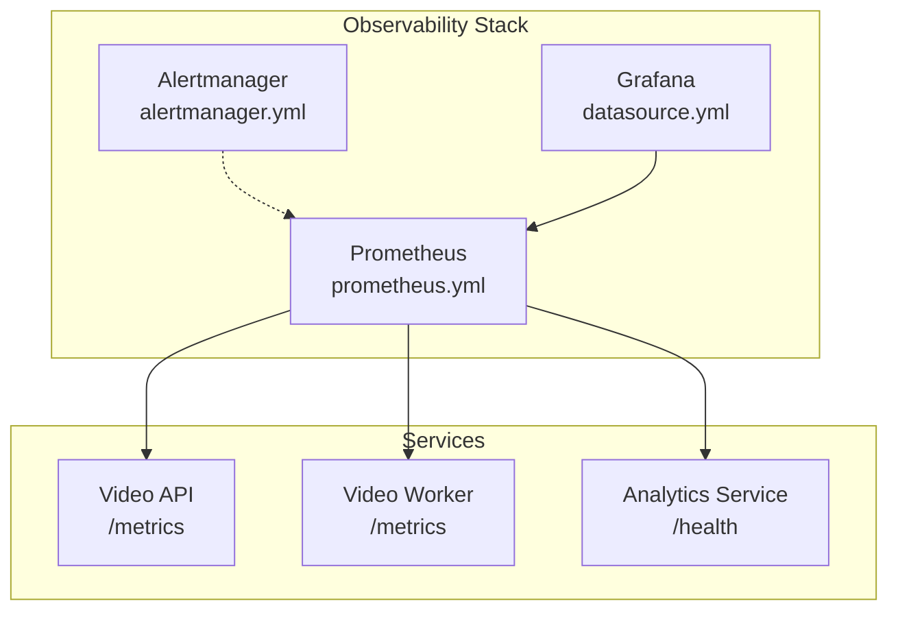
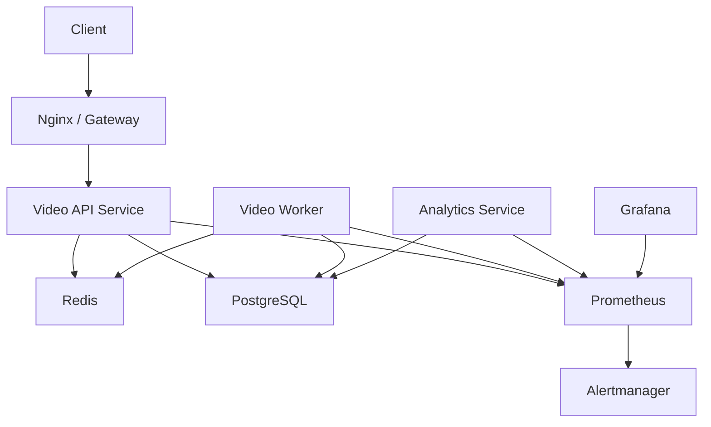
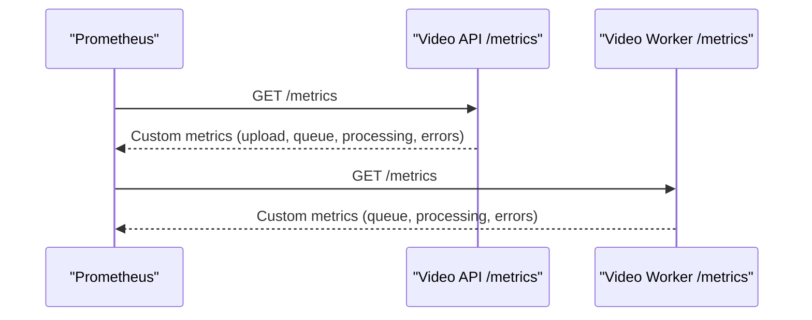
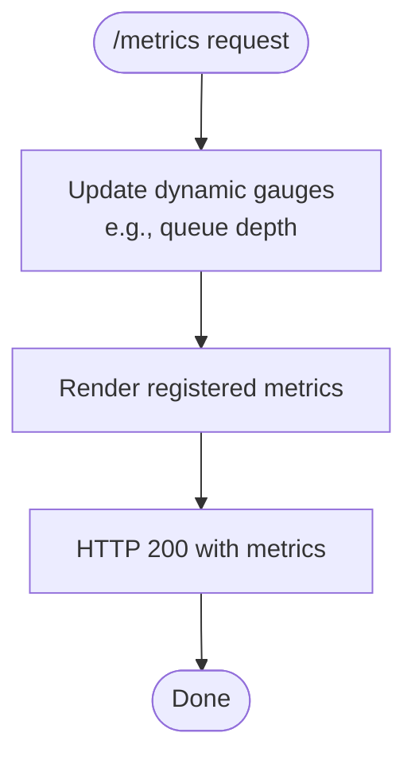
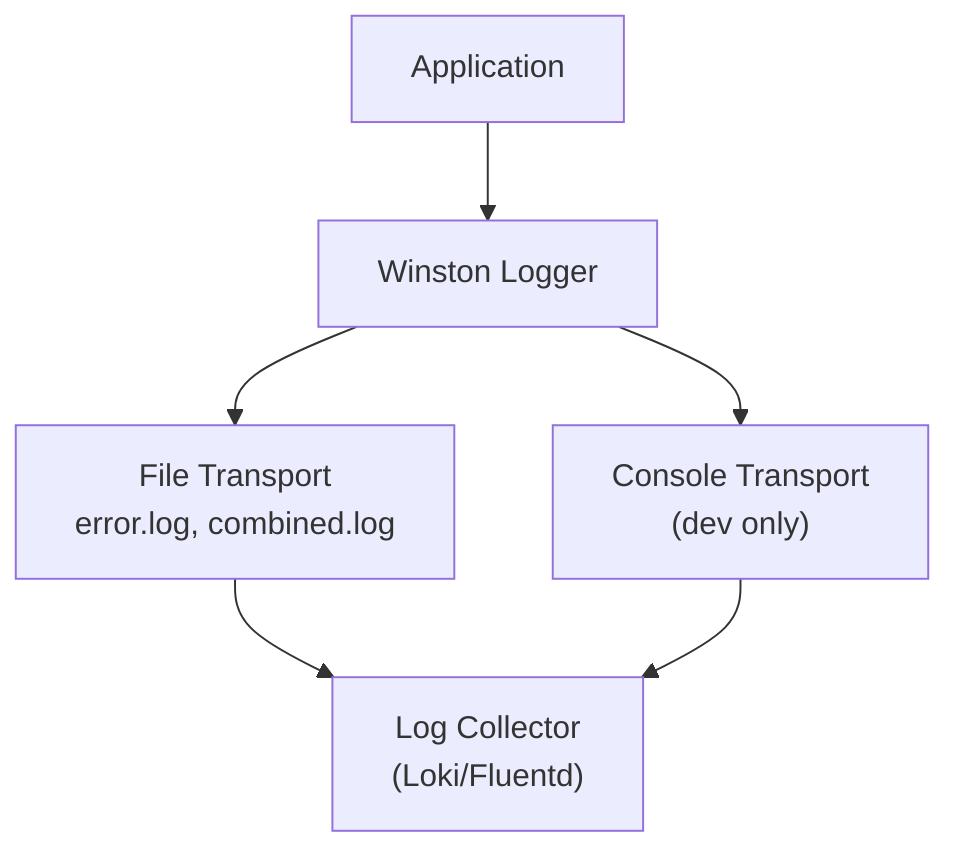
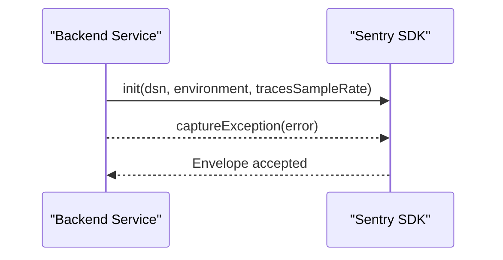
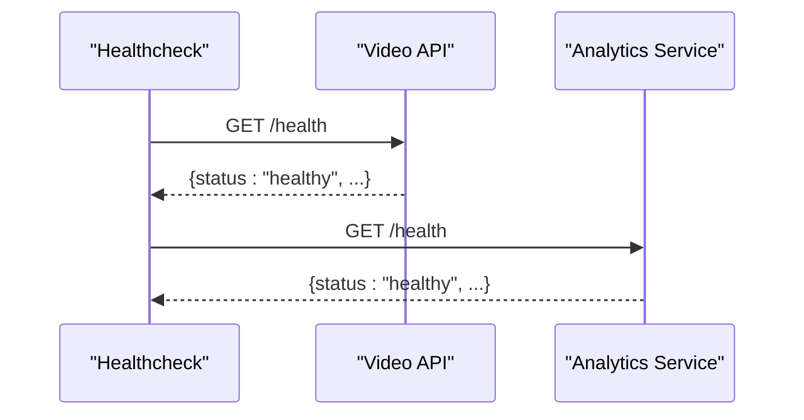
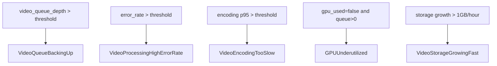
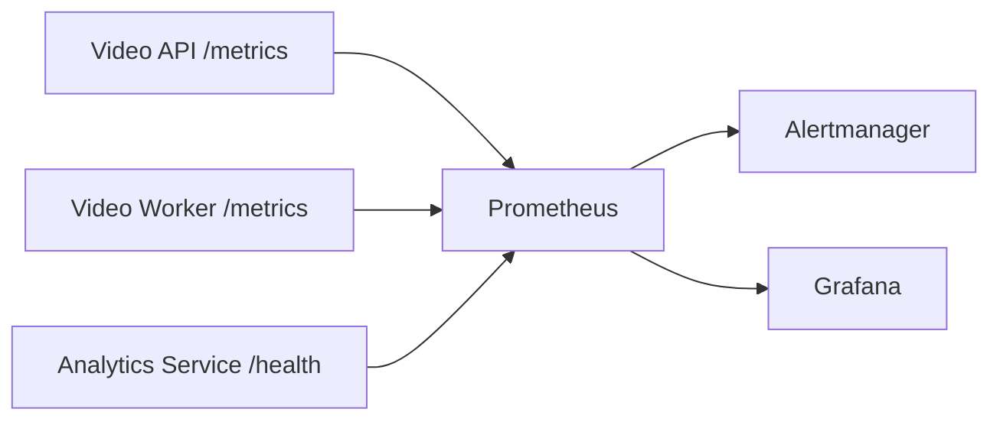

# Monitoring and Observability

<cite>
**Referenced Files in This Document**
- [prometheus.yml](file://prometheus/prometheus.yml)
- [alerts.yml](file://prometheus/alerts.yml)
- [alertmanager.yml](file://prometheus/alertmanager.yml)
- [datasource.yml](file://grafana/datasources/datasource.yml)
- [docker-compose.monitoring.yml](file://docker-compose.monitoring.yml)
- [metrics.js (video-api)](file://services/video/api/metrics.js)
- [metrics.js (video-worker)](file://services/video/worker/metrics.js)
- [server.js (video-api)](file://services/video/api/server.js)
- [worker.js (video-worker)](file://services/video/worker/worker.js)
- [server.js (analytics-service)](file://services/analytics-service/src/server.js)
- [logger.js (backend)](file://backend/utils/logger.js)
- [logger.js (mail-server)](file://mail-server/src/utils/logger.js)
- [sentry.js (backend)](file://backend/utils/sentry.js)
- [analyticsService.ts (frontend)](file://frontend/src/services/analyticsService.ts)
</cite>

## Table of Contents
1. [Introduction](#introduction)
2. [Project Structure](#project-structure)
3. [Core Components](#core-components)
4. [Architecture Overview](#architecture-overview)
5. [Detailed Component Analysis](#detailed-component-analysis)
6. [Dependency Analysis](#dependency-analysis)
7. [Performance Considerations](#performance-considerations)
8. [Troubleshooting Guide](#troubleshooting-guide)
9. [Conclusion](#conclusion)
10. [Appendices](#appendices)

## Introduction
This document describes the monitoring and observability implementation across the microservices ecosystem. It covers metrics collection via Prometheus, logging aggregation, error tracking with Sentry, distributed tracing readiness, health monitoring, alerting, and visualization with Grafana. It also documents service-level metrics for video processing, error tracking, performance profiling, and operational dashboards. Guidance is included for troubleshooting, incident response, and reliability patterns.

## Project Structure
The observability stack is composed of:
- Prometheus scraping metrics from services
- Alertmanager handling alert routing
- Grafana visualizing metrics and dashboards
- Service-specific metrics endpoints
- Logging via Winston with service-specific loggers
- Error tracking via Sentry initialization
- Frontend analytics hooks for telemetry

**Diagram sources**
- [prometheus.yml:15-28](file://prometheus/prometheus.yml#L15-L28)
- [alertmanager.yml:5-15](file://prometheus/alertmanager.yml#L5-L15)
- [datasource.yml:4-10](file://grafana/datasources/datasource.yml#L4-L10)
- [server.js (video-api):353-364](file://services/video/api/server.js#L353-L364)
- [worker.js (video-worker):23-33](file://services/video/worker/worker.js#L23-L33)
- [server.js (analytics-service):349-356](file://services/analytics-service/src/server.js#L349-L356)

**Section sources**
- [docker-compose.monitoring.yml:4-53](file://docker-compose.monitoring.yml#L4-L53)
- [prometheus.yml:1-29](file://prometheus/prometheus.yml#L1-L29)
- [alertmanager.yml:1-16](file://prometheus/alertmanager.yml#L1-L16)
- [datasource.yml:1-11](file://grafana/datasources/datasource.yml#L1-L11)

## Core Components
- Prometheus configuration defines scrape jobs for video-api and video-worker and loads alert rules.
- Alertmanager routes alerts to a webhook receiver.
- Grafana connects to Prometheus as a data source.
- Video services expose metrics endpoints and record custom metrics for uploads, processing, queues, and streams.
- Backend and mail-server use Winston loggers with structured JSON logs and service tagging.
- Backend initializes Sentry for error tracking when a DSN is present.
- Frontend analytics service exposes hooks for tracking events, errors, and performance.

**Section sources**
- [prometheus.yml:15-28](file://prometheus/prometheus.yml#L15-L28)
- [alerts.yml:1-65](file://prometheus/alerts.yml#L1-L65)
- [alertmanager.yml:5-15](file://prometheus/alertmanager.yml#L5-L15)
- [datasource.yml:4-10](file://grafana/datasources/datasource.yml#L4-L10)
- [metrics.js (video-api):10-78](file://services/video/api/metrics.js#L10-L78)
- [metrics.js (video-worker):10-43](file://services/video/worker/metrics.js#L10-L43)
- [server.js (video-api):353-364](file://services/video/api/server.js#L353-L364)
- [worker.js (video-worker):23-33](file://services/video/worker/worker.js#L23-L33)
- [logger.js (backend):21-31](file://backend/utils/logger.js#L21-L31)
- [logger.js (mail-server):25-85](file://mail-server/src/utils/logger.js#L25-L85)
- [sentry.js (backend):3-16](file://backend/utils/sentry.js#L3-L16)
- [analyticsService.ts (frontend):4-144](file://frontend/src/services/analyticsService.ts#L4-L144)

## Architecture Overview
The observability pipeline integrates Prometheus scraping, alerting, and Grafana dashboards. Services export metrics, logs are collected via Winston, and errors are captured with Sentry.

**Diagram sources**
- [server.js (video-api):18-21](file://services/video/api/server.js#L18-L21)
- [worker.js (video-worker):13-19](file://services/video/worker/worker.js#L13-L19)
- [server.js (analytics-service):36-58](file://services/analytics-service/src/server.js#L36-L58)
- [prometheus.yml:15-28](file://prometheus/prometheus.yml#L15-L28)
- [alertmanager.yml:5-15](file://prometheus/alertmanager.yml#L5-L15)
- [datasource.yml:4-10](file://grafana/datasources/datasource.yml#L4-L10)

## Detailed Component Analysis

### Prometheus Metrics Collection
- Video API exports metrics for upload duration, upload size, queue depth, processing time, errors, and stream requests/bytes.
- Video Worker exports queue depth, processing time, and processing errors.
- Both services expose a /metrics endpoint protected by internal access controls.

**Diagram sources**
- [metrics.js (video-api):10-78](file://services/video/api/metrics.js#L10-L78)
- [metrics.js (video-worker):10-43](file://services/video/worker/metrics.js#L10-L43)
- [server.js (video-api):353-364](file://services/video/api/server.js#L353-L364)
- [worker.js (video-worker):23-33](file://services/video/worker/worker.js#L23-L33)

**Section sources**
- [metrics.js (video-api):10-78](file://services/video/api/metrics.js#L10-L78)
- [metrics.js (video-worker):10-43](file://services/video/worker/metrics.js#L10-L43)
- [server.js (video-api):353-364](file://services/video/api/server.js#L353-L364)
- [worker.js (video-worker):23-33](file://services/video/worker/worker.js#L23-L33)

### Metrics Endpoint Implementation
- Video API updates queue depth dynamically and serves metrics content-type.
- Worker exposes a metrics server and updates queue depth from Redis.

**Diagram sources**
- [server.js (video-api):353-385](file://services/video/api/server.js#L353-L385)
- [worker.js (video-worker):23-33](file://services/video/worker/worker.js#L23-L33)

**Section sources**
- [server.js (video-api):353-385](file://services/video/api/server.js#L353-L385)
- [worker.js (video-worker):23-33](file://services/video/worker/worker.js#L23-L33)

### Logging and Log Aggregation
- Backend and mail-server use Winston with JSON formatting and service-tagged metadata.
- Logs are written to files and optionally to console in non-production environments.
- Recommended for log aggregation: ship logs to a centralized collector (e.g., Fluentd, Logstash, Loki) and correlate by service and request ID.

**Diagram sources**
- [logger.js (backend):21-31](file://backend/utils/logger.js#L21-L31)
- [logger.js (mail-server):25-85](file://mail-server/src/utils/logger.js#L25-L85)

**Section sources**
- [logger.js (backend):21-31](file://backend/utils/logger.js#L21-L31)
- [logger.js (mail-server):25-85](file://mail-server/src/utils/logger.js#L25-L85)

### Error Tracking with Sentry
- Backend initializes Sentry when a DSN is configured, capturing unhandled exceptions and rejections.
- Frontend analytics service includes hooks for error tracking (placeholder for Sentry integration).

**Diagram sources**
- [sentry.js (backend):3-16](file://backend/utils/sentry.js#L3-L16)
- [analyticsService.ts (frontend):95-102](file://frontend/src/services/analyticsService.ts#L95-L102)

**Section sources**
- [sentry.js (backend):3-16](file://backend/utils/sentry.js#L3-L16)
- [analyticsService.ts (frontend):95-102](file://frontend/src/services/analyticsService.ts#L95-L102)

### Distributed Tracing Readiness
- Services do not currently implement OpenTelemetry or Zipkin tracing.
- Recommendation: instrument key HTTP entrypoints and inter-service calls with tracing spans and export to a tracing backend (e.g., Jaeger, Tempo).

[No sources needed since this section provides general guidance]

### Health Monitoring
- Video API exposes a /health endpoint returning service status.
- Analytics Service exposes a /health endpoint for readiness checks.

**Diagram sources**
- [server.js (video-api):387-390](file://services/video/api/server.js#L387-L390)
- [server.js (analytics-service):349-356](file://services/analytics-service/src/server.js#L349-L356)

**Section sources**
- [server.js (video-api):387-390](file://services/video/api/server.js#L387-L390)
- [server.js (analytics-service):349-356](file://services/analytics-service/src/server.js#L349-L356)

### Alerting Strategy
- Prometheus rules define alerts for:
  - Video queue backlog
  - High error rate during processing
  - Slow encoding thresholds
  - GPU underutilization
  - Rapid storage growth
- Alertmanager groups and repeats alerts and posts to a webhook.

**Diagram sources**
- [alerts.yml:5-64](file://prometheus/alerts.yml#L5-L64)
- [alertmanager.yml:5-15](file://prometheus/alertmanager.yml#L5-L15)

**Section sources**
- [alerts.yml:1-65](file://prometheus/alerts.yml#L1-L65)
- [alertmanager.yml:1-16](file://prometheus/alertmanager.yml#L1-L16)

### Metric Definitions and Labels
- Video API metrics:
  - video_upload_duration_seconds (histogram, labels: status)
  - video_upload_bytes_total (counter, labels: user_id)
  - video_queue_depth (gauge)
  - video_processing_duration_seconds (histogram, labels: quality, format, gpu_used)
  - video_processing_errors_total (counter, labels: error_type, quality)
  - video_stream_requests_total (counter, labels: format, quality, status)
  - video_stream_bytes_total (counter, labels: format)
- Video Worker metrics:
  - video_queue_depth (gauge)
  - video_processing_duration_seconds (histogram, labels: quality, format, gpu_used)
  - video_processing_errors_total (counter, labels: error_type, quality)

**Section sources**
- [metrics.js (video-api):10-78](file://services/video/api/metrics.js#L10-L78)
- [metrics.js (video-worker):10-43](file://services/video/worker/metrics.js#L10-L43)

### Operational Dashboards
- Grafana data source configured to Prometheus.
- Provision dashboards and panels for:
  - Queue depth and throughput
  - Encoding latency and error rates
  - Storage growth trends
  - Stream requests and bandwidth
- Use PromQL queries aligned with the exported metric names.

**Section sources**
- [datasource.yml:4-10](file://grafana/datasources/datasource.yml#L4-L10)

## Dependency Analysis
Prometheus scrapes metrics from services, Alertmanager receives alerts, and Grafana visualizes metrics.

**Diagram sources**
- [prometheus.yml:15-28](file://prometheus/prometheus.yml#L15-L28)
- [alertmanager.yml:5-15](file://prometheus/alertmanager.yml#L5-L15)
- [datasource.yml:4-10](file://grafana/datasources/datasource.yml#L4-L10)

**Section sources**
- [prometheus.yml:15-28](file://prometheus/prometheus.yml#L15-L28)
- [alertmanager.yml:5-15](file://prometheus/alertmanager.yml#L5-L15)
- [datasource.yml:4-10](file://grafana/datasources/datasource.yml#L4-L10)

## Performance Considerations
- Use histograms for latency (e.g., video_processing_duration_seconds) to compute quantiles for SLOs.
- Monitor queue depth to detect backpressure and scale workers accordingly.
- Track upload sizes and stream bytes to estimate bandwidth and storage costs.
- Tune Prometheus scrape intervals and retention to balance fidelity and resource usage.

[No sources needed since this section provides general guidance]

## Troubleshooting Guide
- Metrics not appearing:
  - Verify Prometheus scrape configs and target reachability.
  - Confirm metrics endpoints return 200 and correct content-type.
- Alerts firing unexpectedly:
  - Inspect alert conditions and thresholds; adjust for traffic patterns.
  - Validate that queue depth and error counters reflect actual workload.
- Logs not visible:
  - Ensure Winston transports are configured and log files are readable.
  - Ship logs to a collector for centralized querying and correlation.
- Errors not reported:
  - Confirm Sentry DSN is set and init is called.
  - Check for suppressed exceptions and ensure unhandled rejections are captured.

**Section sources**
- [prometheus.yml:15-28](file://prometheus/prometheus.yml#L15-L28)
- [server.js (video-api):353-364](file://services/video/api/server.js#L353-L364)
- [worker.js (video-worker):23-33](file://services/video/worker/worker.js#L23-L33)
- [logger.js (backend):21-31](file://backend/utils/logger.js#L21-L31)
- [logger.js (mail-server):25-85](file://mail-server/src/utils/logger.js#L25-L85)
- [sentry.js (backend):3-16](file://backend/utils/sentry.js#L3-L16)

## Conclusion
The system integrates Prometheus metrics, Alertmanager alerts, and Grafana dashboards with service-specific metrics, Winston-based logging, and Sentry error tracking. Extending observability with distributed tracing and centralized log aggregation will further improve operational insight and reliability.

[No sources needed since this section summarizes without analyzing specific files]

## Appendices

### Service-Level Monitoring Checklist
- Expose /metrics and update dynamic gauges (queue depth, in-progress tasks).
- Instrument critical paths with histograms and counters.
- Implement /health endpoints for readiness probes.
- Ship structured logs to a collector and tag by service.
- Initialize error tracking when a DSN is available.
- Define Prometheus alerts for queue, error rate, latency, and storage.

**Section sources**
- [server.js (video-api):353-385](file://services/video/api/server.js#L353-L385)
- [worker.js (video-worker):23-33](file://services/video/worker/worker.js#L23-L33)
- [metrics.js (video-api):10-78](file://services/video/api/metrics.js#L10-L78)
- [metrics.js (video-worker):10-43](file://services/video/worker/metrics.js#L10-L43)
- [logger.js (backend):21-31](file://backend/utils/logger.js#L21-L31)
- [sentry.js (backend):3-16](file://backend/utils/sentry.js#L3-L16)