# Service Deployment and Scaling

<cite>
**Referenced Files in This Document**
- [DEPLOYMENT.md](file://docs/DEPLOYMENT.md)
- [docker-compose.yml](file://infrastructure/docker-compose.yml)
- [docker-compose.complete.yml](file://infrastructure/docker-compose.complete.yml)
- [docker-compose.video.yml](file://docker-compose.video.yml)
- [docker-compose.monitoring.yml](file://docker-compose.monitoring.yml)
- [backend/Dockerfile](file://backend/Dockerfile)
- [frontend/Dockerfile](file://frontend/Dockerfile)
- [services/tts/python/Dockerfile](file://services/tts/python/Dockerfile)
- [services/tts/node/Dockerfile](file://services/tts/node/Dockerfile)
- [services/video/processor/Dockerfile.gpu](file://services/video/processor/Dockerfile.gpu)
- [services/video/worker/Dockerfile.gpu](file://services/video/worker/Dockerfile.gpu)
- [infrastructure/vps-migration/docker-compose.yml](file://infrastructure/vps-migration/docker-compose.yml)
- [infrastructure/nginx/nginx.conf](file://infrastructure/nginx/nginx.conf)
- [.github/workflows/backend-ci.yml](file://.github/workflows/backend-ci.yml)
- [backend/package.json](file://backend/package.json)
- [frontend/package.json](file://frontend/package.json)
- [prometheus/prometheus.yml](file://prometheus/prometheus.yml)
- [setup-gpu.sh](file://setup-gpu.sh)
</cite>

## Table of Contents
1. [Introduction](#introduction)
2. [Project Structure](#project-structure)
3. [Core Components](#core-components)
4. [Architecture Overview](#architecture-overview)
5. [Detailed Component Analysis](#detailed-component-analysis)
6. [Dependency Analysis](#dependency-analysis)
7. [Performance Considerations](#performance-considerations)
8. [Troubleshooting Guide](#troubleshooting-guide)
9. [Conclusion](#conclusion)
10. [Appendices](#appendices)

## Introduction
This document provides a comprehensive guide to deploying and scaling the QuantumMint Bookstore platform. It covers containerization patterns, Docker configurations, GPU-enabled service deployments, horizontal scaling, auto-scaling policies, CI/CD pipelines, blue-green and rolling updates, service orchestration, environment-specific configurations, isolation and resource limits, performance optimization, deployment checklists, rollback procedures, and capacity planning.

## Project Structure
The platform consists of:
- A monolithic backend API containerized with Node.js
- A frontend built with Vite and served via Nginx
- Microservices for video processing, TTS, formula engine, concept visualizer, knowledge graph, analytics, and others
- Orchestration via Docker Compose with multiple variants for local, educational, and video-focused deployments
- GPU-enabled containers for video encoding and visualization
- CI/CD using GitHub Actions
- Monitoring stack with Prometheus and Grafana

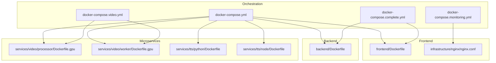

**Diagram sources**
- [docker-compose.yml:1-373](file://infrastructure/docker-compose.yml#L1-L373)
- [docker-compose.complete.yml:1-344](file://infrastructure/docker-compose.complete.yml#L1-L344)
- [docker-compose.video.yml](file://docker-compose.video.yml)
- [docker-compose.monitoring.yml](file://docker-compose.monitoring.yml)
- [frontend/Dockerfile:1-15](file://frontend/Dockerfile#L1-L15)
- [backend/Dockerfile:1-8](file://backend/Dockerfile#L1-L8)
- [services/video/processor/Dockerfile.gpu:1-46](file://services/video/processor/Dockerfile.gpu#L1-L46)
- [services/video/worker/Dockerfile.gpu:1-46](file://services/video/worker/Dockerfile.gpu#L1-L46)
- [services/tts/python/Dockerfile:1-26](file://services/tts/python/Dockerfile#L1-L26)
- [services/tts/node/Dockerfile:1-9](file://services/tts/node/Dockerfile#L1-L9)
- [infrastructure/nginx/nginx.conf:1-49](file://infrastructure/nginx/nginx.conf#L1-L49)

**Section sources**
- [docker-compose.yml:1-373](file://infrastructure/docker-compose.yml#L1-L373)
- [docker-compose.complete.yml:1-344](file://infrastructure/docker-compose.complete.yml#L1-L344)
- [frontend/Dockerfile:1-15](file://frontend/Dockerfile#L1-L15)
- [backend/Dockerfile:1-8](file://backend/Dockerfile#L1-L8)
- [services/video/processor/Dockerfile.gpu:1-46](file://services/video/processor/Dockerfile.gpu#L1-L46)
- [services/video/worker/Dockerfile.gpu:1-46](file://services/video/worker/Dockerfile.gpu#L1-L46)
- [services/tts/python/Dockerfile:1-26](file://services/tts/python/Dockerfile#L1-L26)
- [services/tts/node/Dockerfile:1-9](file://services/tts/node/Dockerfile#L1-L9)
- [infrastructure/nginx/nginx.conf:1-49](file://infrastructure/nginx/nginx.conf#L1-L49)

## Core Components
- API Gateway and Reverse Proxy: Nginx-based routing for video API, streaming, and admin dashboard
- Monolithic Backend: Node.js Express API containerized for production
- Frontend: Vite-built React app served via Nginx
- Video Processing: GPU-enabled workers and processors using CUDA base images
- TTS Services: Python FastAPI service and Node.js service
- Databases and Caches: PostgreSQL, Redis, Neo4j, Elasticsearch
- Monitoring: Prometheus scraping and Grafana dashboards

Key containerization patterns:
- Multi-stage builds for frontend
- Alpine-based minimal images
- GPU-enabled Dockerfiles for video workloads
- Healthchecks for service readiness
- Volume mounts for persistent data and model caches

**Section sources**
- [infrastructure/nginx/nginx.conf:1-49](file://infrastructure/nginx/nginx.conf#L1-L49)
- [backend/Dockerfile:1-8](file://backend/Dockerfile#L1-L8)
- [frontend/Dockerfile:1-15](file://frontend/Dockerfile#L1-L15)
- [services/video/processor/Dockerfile.gpu:1-46](file://services/video/processor/Dockerfile.gpu#L1-L46)
- [services/video/worker/Dockerfile.gpu:1-46](file://services/video/worker/Dockerfile.gpu#L1-L46)
- [services/tts/python/Dockerfile:1-26](file://services/tts/python/Dockerfile#L1-L26)
- [services/tts/node/Dockerfile:1-9](file://services/tts/node/Dockerfile#L1-L9)
- [docker-compose.yml:1-373](file://infrastructure/docker-compose.yml#L1-L373)

## Architecture Overview
The deployment architecture combines a monolithic backend with microservices behind an API gateway. The gateway routes traffic to appropriate services, while databases and caches are shared across services. GPU-enabled containers handle compute-intensive tasks like video encoding and visualization.

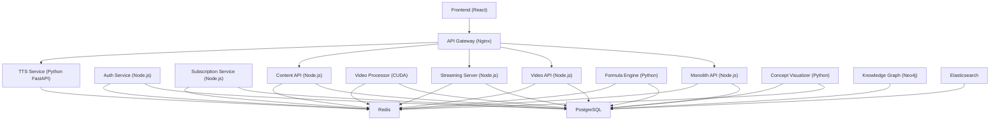

**Diagram sources**
- [infrastructure/nginx/nginx.conf:1-49](file://infrastructure/nginx/nginx.conf#L1-L49)
- [docker-compose.yml:1-373](file://infrastructure/docker-compose.yml#L1-L373)
- [docker-compose.complete.yml:1-344](file://infrastructure/docker-compose.complete.yml#L1-L344)

**Section sources**
- [infrastructure/nginx/nginx.conf:1-49](file://infrastructure/nginx/nginx.conf#L1-L49)
- [docker-compose.yml:1-373](file://infrastructure/docker-compose.yml#L1-L373)
- [docker-compose.complete.yml:1-344](file://infrastructure/docker-compose.complete.yml#L1-L344)

## Detailed Component Analysis

### API Gateway and Reverse Proxy
- Nginx upstreams route requests to video API, streaming server, and admin dashboard
- Static asset serving and proxying configured for clean separation of concerns
- SSL and logging volumes mounted for secure and observable operation

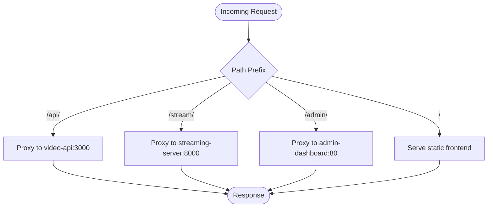

**Diagram sources**
- [infrastructure/nginx/nginx.conf:9-47](file://infrastructure/nginx/nginx.conf#L9-L47)

**Section sources**
- [infrastructure/nginx/nginx.conf:1-49](file://infrastructure/nginx/nginx.conf#L1-L49)

### Monolithic Backend API
- Minimal Alpine-based container with production Node.js runtime
- Exposes port 3000 (mapped in compose files)
- Uses environment variables for database connectivity and JWT secret

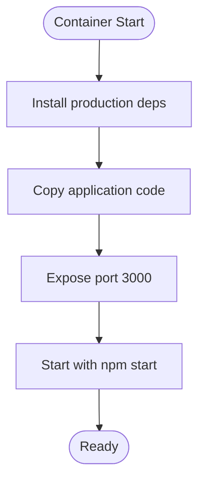

**Diagram sources**
- [backend/Dockerfile:1-8](file://backend/Dockerfile#L1-L8)

**Section sources**
- [backend/Dockerfile:1-8](file://backend/Dockerfile#L1-L8)
- [docker-compose.yml:28-50](file://infrastructure/docker-compose.yml#L28-L50)

### Frontend Containerization
- Multi-stage build: build stage with Node.js, serve stage with Nginx alpine
- Copies built assets and custom Nginx config
- Exposes port 80 for serving static content

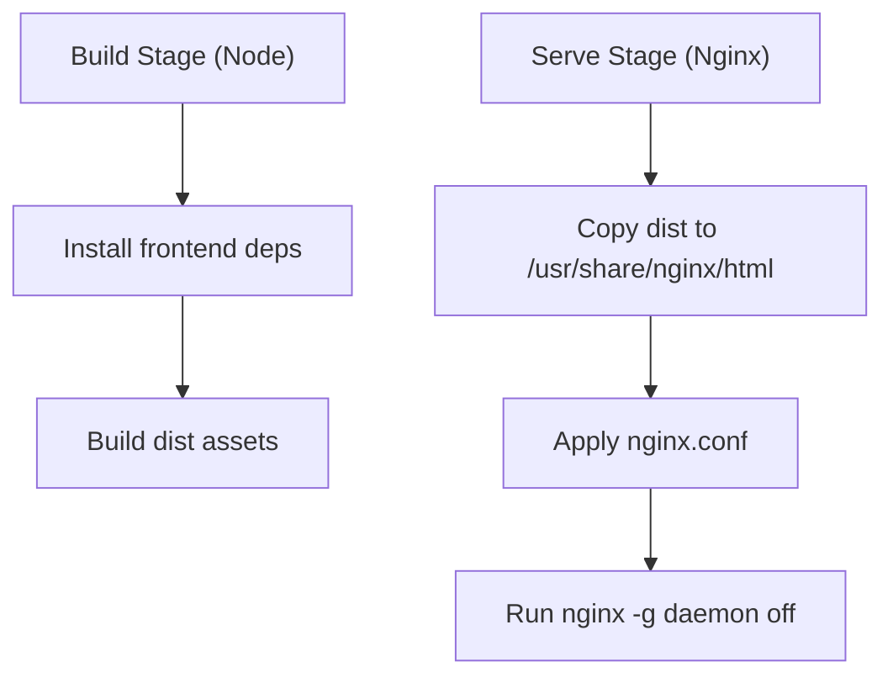

**Diagram sources**
- [frontend/Dockerfile:1-15](file://frontend/Dockerfile#L1-L15)

**Section sources**
- [frontend/Dockerfile:1-15](file://frontend/Dockerfile#L1-L15)

### Video Processing Services (GPU)
- CUDA base image with FFmpeg and Node.js
- GPU device reservation via compose deploy.resources
- Exposes port 3001 for worker processes
- Includes a GPU-optimized FFmpeg wrapper

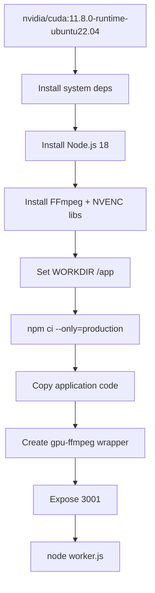

**Diagram sources**
- [services/video/processor/Dockerfile.gpu:1-46](file://services/video/processor/Dockerfile.gpu#L1-L46)
- [services/video/worker/Dockerfile.gpu:1-46](file://services/video/worker/Dockerfile.gpu#L1-L46)

**Section sources**
- [services/video/processor/Dockerfile.gpu:1-46](file://services/video/processor/Dockerfile.gpu#L1-L46)
- [services/video/worker/Dockerfile.gpu:1-46](file://services/video/worker/Dockerfile.gpu#L1-L46)
- [docker-compose.yml:130-150](file://infrastructure/docker-compose.yml#L130-L150)

### TTS Services
- Python FastAPI service containerized with uvicorn
- Node.js TTS service for lightweight operations
- Both expose dedicated ports and integrate with Redis

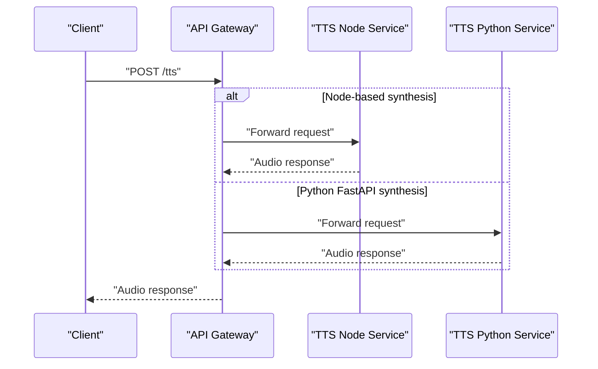

**Diagram sources**
- [services/tts/node/Dockerfile:1-9](file://services/tts/node/Dockerfile#L1-L9)
- [services/tts/python/Dockerfile:1-26](file://services/tts/python/Dockerfile#L1-L26)
- [infrastructure/nginx/nginx.conf:1-49](file://infrastructure/nginx/nginx.conf#L1-L49)

**Section sources**
- [services/tts/node/Dockerfile:1-9](file://services/tts/node/Dockerfile#L1-L9)
- [services/tts/python/Dockerfile:1-26](file://services/tts/python/Dockerfile#L1-L26)
- [docker-compose.yml:208-223](file://infrastructure/docker-compose.yml#L208-L223)

### Databases and Caches
- PostgreSQL: multiple logical databases initialized via SQL scripts
- Redis: configured with password and persistence
- Neo4j: community edition with plugins
- Elasticsearch: single-node with memory limits and persistence

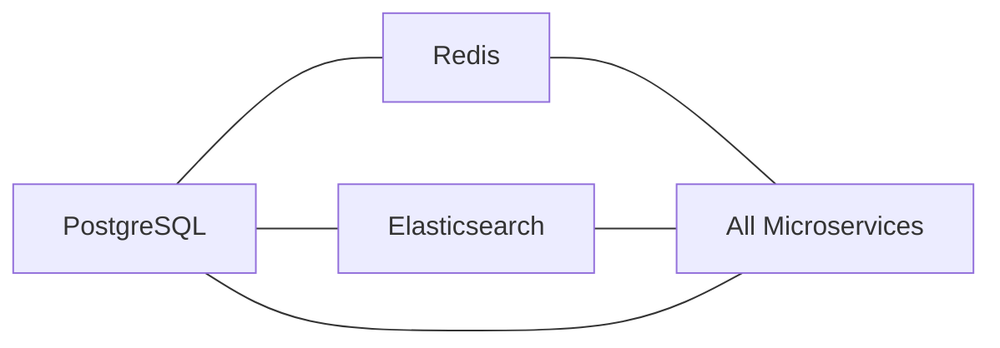

**Diagram sources**
- [docker-compose.yml:257-304](file://infrastructure/docker-compose.yml#L257-L304)

**Section sources**
- [docker-compose.yml:257-304](file://infrastructure/docker-compose.yml#L257-L304)

### Monitoring Stack
- Prometheus configured to scrape video API and worker metrics
- Grafana container for visualization
- Compose variants enable monitoring stack deployment

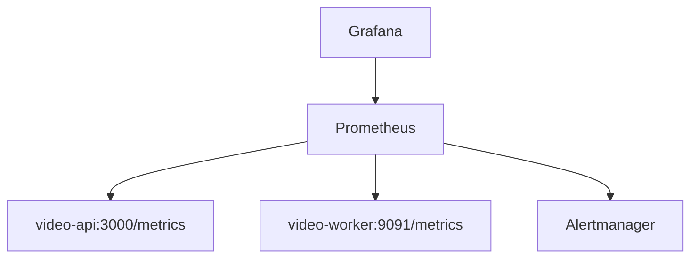

**Diagram sources**
- [prometheus/prometheus.yml:1-29](file://prometheus/prometheus.yml#L1-L29)
- [docker-compose.monitoring.yml](file://docker-compose.monitoring.yml)

**Section sources**
- [prometheus/prometheus.yml:1-29](file://prometheus/prometheus.yml#L1-L29)
- [docker-compose.monitoring.yml](file://docker-compose.monitoring.yml)

## Dependency Analysis
- Service coupling is primarily through shared databases and Redis
- API Gateway decouples frontend from backend services
- GPU-enabled services depend on host NVIDIA drivers and Docker runtime configuration
- CI/CD pipelines validate backend and specific microservices

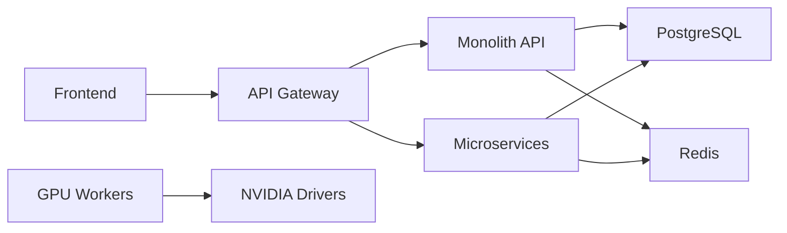

**Diagram sources**
- [infrastructure/nginx/nginx.conf:1-49](file://infrastructure/nginx/nginx.conf#L1-L49)
- [docker-compose.yml:1-373](file://infrastructure/docker-compose.yml#L1-L373)
- [setup-gpu.sh:1-37](file://setup-gpu.sh#L1-L37)

**Section sources**
- [infrastructure/nginx/nginx.conf:1-49](file://infrastructure/nginx/nginx.conf#L1-L49)
- [docker-compose.yml:1-373](file://infrastructure/docker-compose.yml#L1-L373)
- [setup-gpu.sh:1-37](file://setup-gpu.sh#L1-L37)

## Performance Considerations
- GPU acceleration for video encoding and visualization reduces latency and improves throughput
- Multi-stage frontend builds minimize image size and improve cold-start performance
- Alpine-based images reduce attack surface and footprint
- Healthchecks ensure only ready services receive traffic
- Resource reservations for GPU devices prevent overcommitment
- Nginx worker connections tuned for concurrent requests
- Elasticsearch memory limits prevent OOM under load

[No sources needed since this section provides general guidance]

## Troubleshooting Guide
Common operational issues and remedies:
- GPU container fails to start: verify NVIDIA drivers and Docker runtime toolkit installation, confirm device reservations
- Database initialization failures: check SQL scripts and environment variables for multiple databases
- Service timeouts: review healthcheck intervals and service dependencies
- Frontend static assets missing: validate Nginx config and volume mounts
- CI/CD failures: inspect workflow logs for dependency installation and test execution

**Section sources**
- [setup-gpu.sh:1-37](file://setup-gpu.sh#L1-L37)
- [docker-compose.yml:1-373](file://infrastructure/docker-compose.yml#L1-L373)
- [.github/workflows/backend-ci.yml:1-58](file://.github/workflows/backend-ci.yml#L1-L58)
- [infrastructure/nginx/nginx.conf:1-49](file://infrastructure/nginx/nginx.conf#L1-L49)

## Conclusion
The platform employs a hybrid architecture combining a monolithic backend with specialized microservices, orchestrated via Docker Compose. Containerization strategies emphasize minimalism, observability, and scalability. GPU-enabled services are integrated for compute-heavy tasks, while CI/CD ensures reliable deployments. The provided checklists, rollback procedures, and capacity planning guidelines support safe, repeatable operations across environments.

[No sources needed since this section summarizes without analyzing specific files]

## Appendices

### Horizontal Scaling Strategies
- Stateless services: scale horizontally by increasing replica counts behind the API Gateway
- Database: use managed PostgreSQL or set up read replicas; shard by domain if needed
- Caching: Redis cluster for high availability and low latency
- CDN: serve frontend assets globally via CDN for improved latency

[No sources needed since this section provides general guidance]

### Auto-Scaling Policies
- CPU/memory utilization thresholds for Kubernetes clusters
- Queue depth for TTS and video processing services
- Request latency and error rate triggers
- Scheduled scaling for predictable traffic spikes

[No sources needed since this section provides general guidance]

### Resource Allocation Strategies
- CPU and memory requests/limits per service
- GPU quotas and device sharing policies
- Persistent volume sizing for databases and media storage
- Network bandwidth allocation for streaming

[No sources needed since this section provides general guidance]

### CI/CD Pipeline Details
- Backend CI workflow validates backend and voice profile services
- Frontend builds and deploys to Vercel or Netlify
- Automated tests and audits included in CI jobs

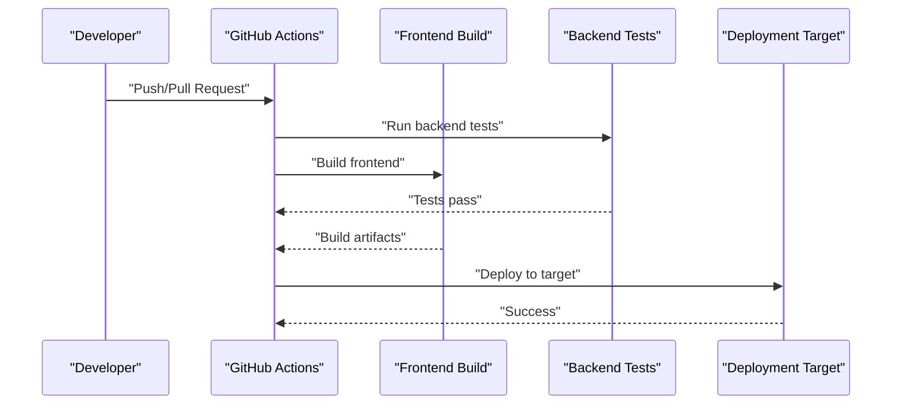

**Diagram sources**
- [.github/workflows/backend-ci.yml:1-58](file://.github/workflows/backend-ci.yml#L1-L58)
- [docs/DEPLOYMENT.md:514-554](file://docs/DEPLOYMENT.md#L514-L554)

**Section sources**
- [.github/workflows/backend-ci.yml:1-58](file://.github/workflows/backend-ci.yml#L1-L58)
- [docs/DEPLOYMENT.md:514-554](file://docs/DEPLOYMENT.md#L514-L554)

### Blue-Green and Rolling Updates
- Blue-Green: maintain two identical environments; switch traffic after validation
- Rolling updates: phased rollout with healthchecks and rollback on failure
- Canary releases: route small percentage of traffic to new version

[No sources needed since this section provides general guidance]

### Service Isolation and Security
- Network segmentation via Docker bridge networks
- Healthchecks and restart policies for resilience
- Secrets management via environment variables and external secret managers
- TLS termination at the API Gateway

**Section sources**
- [docker-compose.yml:358-364](file://infrastructure/docker-compose.yml#L358-L364)
- [docs/DEPLOYMENT.md:401-442](file://docs/DEPLOYMENT.md#L401-L442)

### Environment-Specific Configurations
- Local development: compose files for unified or modular setups
- Staging: separate compose variants for video and monitoring stacks
- Production: Vercel/Netlify for frontend; backend on managed services or VPS with Nginx and PM2

**Section sources**
- [docker-compose.complete.yml:1-344](file://infrastructure/docker-compose.complete.yml#L1-L344)
- [docker-compose.video.yml](file://docker-compose.video.yml)
- [docs/DEPLOYMENT.md:89-246](file://docs/DEPLOYMENT.md#L89-L246)

### Deployment Checklists
Pre-deployment:
- Tests passing, environment variables configured, SSL valid, backups taken, monitoring enabled

Deployment:
- Build successful, assets uploaded, DNS updated, health checks passing, smoke tests passed

Post-deployment:
- Monitor error rates, check performance metrics, verify payment processing, test critical flows, update documentation, notify stakeholders

**Section sources**
- [docs/DEPLOYMENT.md:619-646](file://docs/DEPLOYMENT.md#L619-L646)

### Rollback Procedures
- Vercel: list deployments and rollback to previous
- Manual rollback: switch to previous commit, rebuild, restart services
- Database rollback: revert migrations with version control

**Section sources**
- [docs/DEPLOYMENT.md:579-616](file://docs/DEPLOYMENT.md#L579-L616)

### Capacity Planning Guidelines
- Estimate peak concurrent users and request rates
- Size databases and caches accordingly
- Provision GPU capacity for video encoding and visualization
- Plan CDN and edge locations for geographic coverage

[No sources needed since this section provides general guidance]