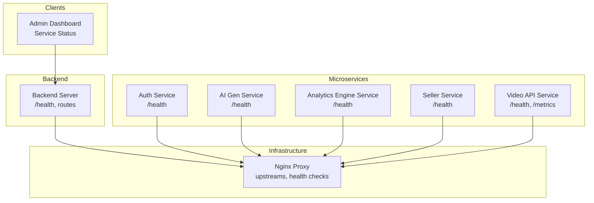
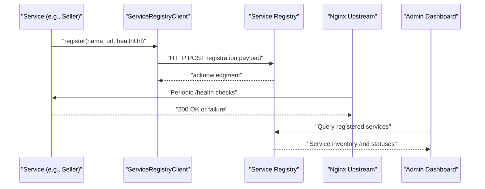
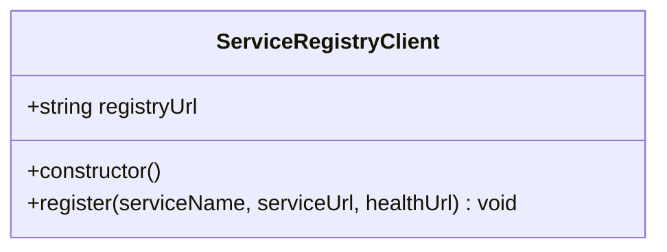
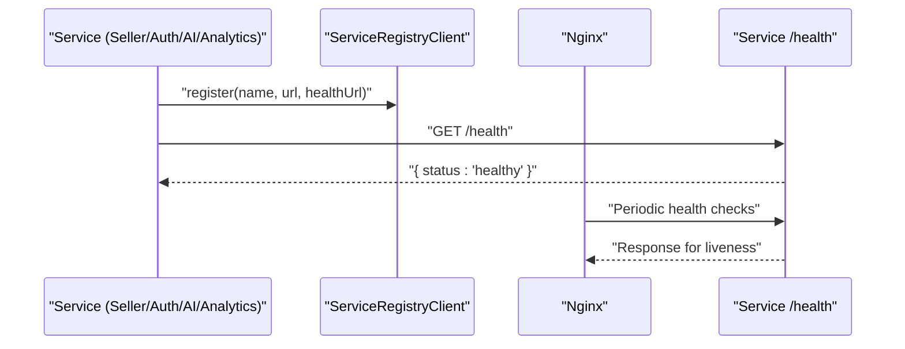
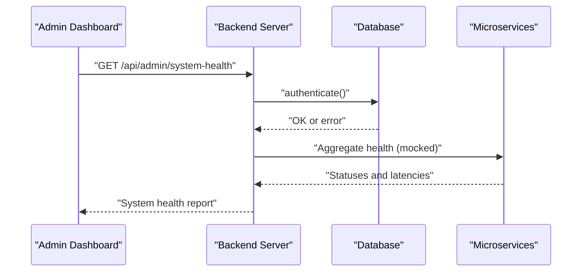
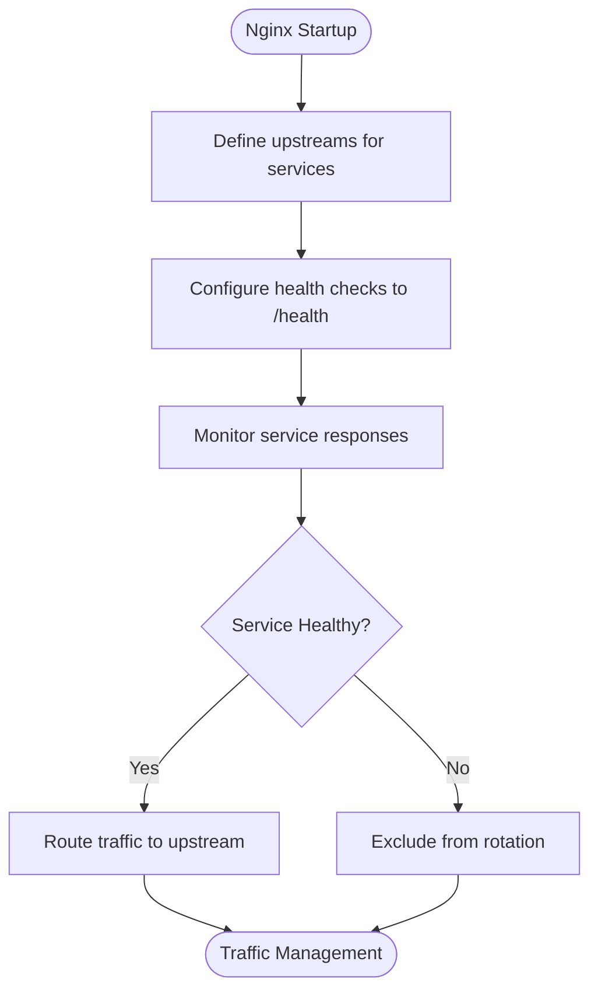
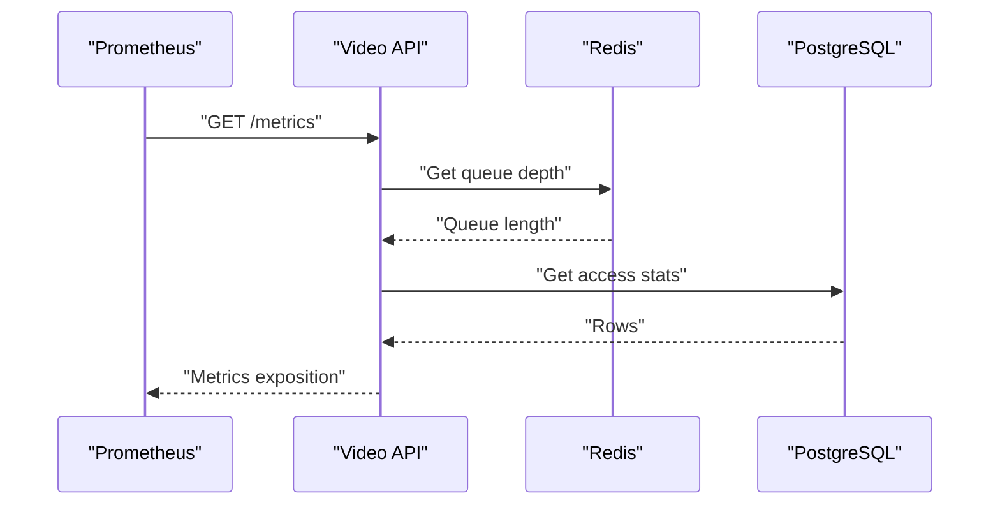
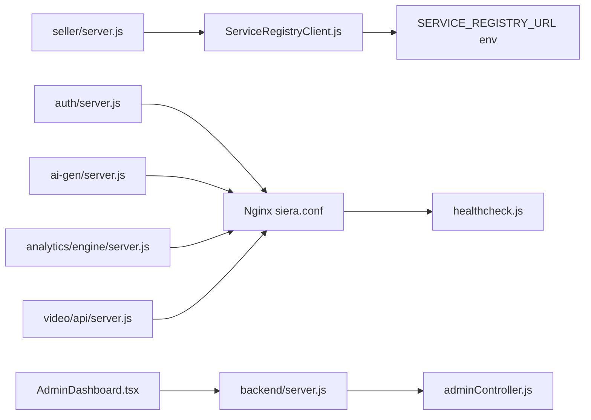

# Service Discovery and Registry

<cite>
**Referenced Files in This Document**
- [service-registry-client.js](file://backend/utils/service-registry-client.js)
- [server.js](file://backend/server.js)
- [seller/server.js](file://services/seller/server.js)
- [auth/server.js](file://services/auth/server.js)
- [ai-gen/server.js](file://services/ai-gen/server.js)
- [analytics/engine/server.js](file://services/analytics/engine/server.js)
- [video/api/server.js](file://services/video/api/server.js)
- [video/api/healthcheck.js](file://services/video/api/healthcheck.js)
- [adminController.js](file://backend/controllers/adminController.js)
- [infrastructure/nginx/siera.conf](file://infrastructure/nginx/siera.conf)
- [frontend/src/pages/AdminDashboard.tsx](file://frontend/src/pages/AdminDashboard.tsx)
</cite>

## Table of Contents
1. [Introduction](#introduction)
2. [Project Structure](#project-structure)
3. [Core Components](#core-components)
4. [Architecture Overview](#architecture-overview)
5. [Detailed Component Analysis](#detailed-component-analysis)
6. [Dependency Analysis](#dependency-analysis)
7. [Performance Considerations](#performance-considerations)
8. [Troubleshooting Guide](#troubleshooting-guide)
9. [Conclusion](#conclusion)
10. [Appendices](#appendices)

## Introduction
This document explains the service discovery and registry system across the platform. It covers the dynamic service registration mechanism, health checking, and automatic failover capabilities. It documents the service registry client implementation, service resolution patterns, and load balancing strategies. It also details service metadata management, versioning, and backward compatibility handling, and provides examples of registration, deregistration, and discovery workflows. Finally, it addresses service mesh integration, circuit breaker patterns, graceful degradation mechanisms, troubleshooting, and monitoring approaches.

## Project Structure
The service discovery and registry system spans:
- Backend core service exposing health and administrative endpoints
- Multiple microservices with standardized health endpoints
- A service registry client used by services to register themselves
- Nginx configuration for upstream routing and health checks
- Frontend dashboards for monitoring service status

**Diagram sources**
- [server.js:144-155](file://backend/server.js#L144-L155)
- [auth/server.js:7-9](file://services/auth/server.js#L7-L9)
- [ai-gen/server.js:7-9](file://services/ai-gen/server.js#L7-L9)
- [analytics/engine/server.js:7-9](file://services/analytics/engine/server.js#L7-L9)
- [seller/server.js:20-31](file://services/seller/server.js#L20-L31)
- [video/api/server.js:387-390](file://services/video/api/server.js#L387-L390)
- [infrastructure/nginx/siera.conf:189-194](file://infrastructure/nginx/siera.conf#L189-L194)
- [frontend/src/pages/AdminDashboard.tsx:291-310](file://frontend/src/pages/AdminDashboard.tsx#L291-L310)

**Section sources**
- [server.js:1-155](file://backend/server.js#L1-L155)
- [service-registry-client.js:1-16](file://backend/utils/service-registry-client.js#L1-L16)
- [seller/server.js:1-32](file://services/seller/server.js#L1-L32)
- [auth/server.js:1-14](file://services/auth/server.js#L1-L14)
- [ai-gen/server.js:1-14](file://services/ai-gen/server.js#L1-L14)
- [analytics/engine/server.js:1-13](file://services/analytics/engine/server.js#L1-L13)
- [video/api/server.js:1-445](file://services/video/api/server.js#L1-L445)
- [infrastructure/nginx/siera.conf:189-194](file://infrastructure/nginx/siera.conf#L189-L194)
- [frontend/src/pages/AdminDashboard.tsx:291-310](file://frontend/src/pages/AdminDashboard.tsx#L291-L310)

## Core Components
- Service Registry Client: Provides a lightweight client to register services with the registry and log health endpoints. In the current implementation, registration is logged; a real-world deployment would send an HTTP request to the registry service.
- Microservices: Each service exposes a standard /health endpoint and registers itself upon startup using the registry client.
- Backend Server: Exposes administrative endpoints and aggregates system health for monitoring.
- Nginx: Acts as an upstream proxy and performs health checks against service endpoints.
- Frontend Admin Dashboard: Displays service status and latency for operational visibility.

Key responsibilities:
- Dynamic registration: Services self-register with the registry at startup.
- Health checking: Standardized /health endpoints enable automated liveness/readiness checks.
- Automatic failover: Nginx upstreams and health checks route traffic away from unhealthy instances.
- Monitoring: Metrics and administrative endpoints feed dashboards and alerting systems.

**Section sources**
- [service-registry-client.js:1-16](file://backend/utils/service-registry-client.js#L1-L16)
- [seller/server.js:10-13](file://services/seller/server.js#L10-L13)
- [server.js:144-155](file://backend/server.js#L144-L155)
- [infrastructure/nginx/siera.conf:189-194](file://infrastructure/nginx/siera.conf#L189-L194)
- [frontend/src/pages/AdminDashboard.tsx:291-310](file://frontend/src/pages/AdminDashboard.tsx#L291-L310)

## Architecture Overview
The system follows a centralized registry pattern with health-based routing:
- Services register themselves with the registry and publish health URLs.
- Nginx performs periodic health checks against service endpoints.
- Traffic is routed to healthy instances; unhealthy instances are removed from rotation.
- The backend aggregates system health for administrative dashboards.

**Diagram sources**
- [service-registry-client.js:6-12](file://backend/utils/service-registry-client.js#L6-L12)
- [seller/server.js:28-31](file://services/seller/server.js#L28-L31)
- [infrastructure/nginx/siera.conf:189-194](file://infrastructure/nginx/siera.conf#L189-L194)
- [frontend/src/pages/AdminDashboard.tsx:291-310](file://frontend/src/pages/AdminDashboard.tsx#L291-L310)

## Detailed Component Analysis

### Service Registry Client
The client encapsulates registry connectivity and registration behavior. It logs registration attempts and health endpoints; a production implementation would POST to the registry service.

**Diagram sources**
- [service-registry-client.js:1-16](file://backend/utils/service-registry-client.js#L1-L16)

**Section sources**
- [service-registry-client.js:1-16](file://backend/utils/service-registry-client.js#L1-L16)

### Microservice Registration and Health
Each microservice initializes a registry client and registers itself during startup. All services expose a /health endpoint for monitoring.

**Diagram sources**
- [seller/server.js:18-31](file://services/seller/server.js#L18-L31)
- [auth/server.js:7-9](file://services/auth/server.js#L7-L9)
- [ai-gen/server.js:7-9](file://services/ai-gen/server.js#L7-L9)
- [analytics/engine/server.js:7-9](file://services/analytics/engine/server.js#L7-L9)
- [infrastructure/nginx/siera.conf:189-194](file://infrastructure/nginx/siera.conf#L189-L194)

**Section sources**
- [seller/server.js:1-32](file://services/seller/server.js#L1-L32)
- [auth/server.js:1-14](file://services/auth/server.js#L1-L14)
- [ai-gen/server.js:1-14](file://services/ai-gen/server.js#L1-L14)
- [analytics/engine/server.js:1-13](file://services/analytics/engine/server.js#L1-L13)

### Backend Health and Administrative Views
The backend server exposes a root health endpoint and an administrative system health controller that reports service statuses.

**Diagram sources**
- [server.js:144-155](file://backend/server.js#L144-L155)
- [adminController.js:335-358](file://backend/controllers/adminController.js#L335-L358)

**Section sources**
- [server.js:144-155](file://backend/server.js#L144-L155)
- [adminController.js:335-358](file://backend/controllers/adminController.js#L335-L358)

### Nginx Health Checks and Upstreams
Nginx performs health checks against service endpoints and routes traffic accordingly. A dedicated /health endpoint confirms Nginx availability.

**Diagram sources**
- [infrastructure/nginx/siera.conf:189-194](file://infrastructure/nginx/siera.conf#L189-L194)

**Section sources**
- [infrastructure/nginx/siera.conf:189-194](file://infrastructure/nginx/siera.conf#L189-L194)

### Video API Health and Metrics
The Video API service exposes both /health and /metrics endpoints, enabling health checks and Prometheus scraping.

**Diagram sources**
- [video/api/server.js:353-364](file://services/video/api/server.js#L353-L364)
- [video/api/server.js:377-385](file://services/video/api/server.js#L377-L385)

**Section sources**
- [video/api/server.js:387-390](file://services/video/api/server.js#L387-L390)
- [video/api/server.js:353-364](file://services/video/api/server.js#L353-L364)
- [video/api/server.js:377-385](file://services/video/api/server.js#L377-L385)

## Dependency Analysis
- Service-to-registry dependency: Services depend on the registry client to register themselves.
- Infrastructure dependency: Nginx depends on service /health endpoints for liveness.
- Monitoring dependency: Frontend dashboard consumes backend administrative endpoints.
- Cross-service dependency: Backend aggregates service health for reporting.

**Diagram sources**
- [service-registry-client.js](file://backend/utils/service-registry-client.js#L3)
- [seller/server.js:18-31](file://services/seller/server.js#L18-L31)
- [auth/server.js:7-9](file://services/auth/server.js#L7-L9)
- [ai-gen/server.js:7-9](file://services/ai-gen/server.js#L7-L9)
- [analytics/engine/server.js:7-9](file://services/analytics/engine/server.js#L7-L9)
- [video/api/server.js:387-390](file://services/video/api/server.js#L387-L390)
- [video/api/healthcheck.js:1-48](file://services/video/api/healthcheck.js#L1-L48)
- [server.js:144-155](file://backend/server.js#L144-L155)
- [adminController.js:335-358](file://backend/controllers/adminController.js#L335-L358)
- [frontend/src/pages/AdminDashboard.tsx:291-310](file://frontend/src/pages/AdminDashboard.tsx#L291-L310)

**Section sources**
- [service-registry-client.js:1-16](file://backend/utils/service-registry-client.js#L1-L16)
- [seller/server.js:1-32](file://services/seller/server.js#L1-L32)
- [auth/server.js:1-14](file://services/auth/server.js#L1-L14)
- [ai-gen/server.js:1-14](file://services/ai-gen/server.js#L1-L14)
- [analytics/engine/server.js:1-13](file://services/analytics/engine/server.js#L1-L13)
- [video/api/server.js:1-445](file://services/video/api/server.js#L1-L445)
- [video/api/healthcheck.js:1-48](file://services/video/api/healthcheck.js#L1-L48)
- [server.js:144-155](file://backend/server.js#L144-L155)
- [adminController.js:335-358](file://backend/controllers/adminController.js#L335-L358)
- [frontend/src/pages/AdminDashboard.tsx:291-310](file://frontend/src/pages/AdminDashboard.tsx#L291-L310)

## Performance Considerations
- Health check intervals: Tune Nginx health check timeouts and thresholds to balance responsiveness and overhead.
- Load distribution: Use Nginx upstream hashing or least_conn to distribute load across healthy instances.
- Caching: Cache frequently accessed service metadata to reduce registry pressure.
- Observability: Expose metrics endpoints and scrape with Prometheus; correlate latency and error rates with service health.
- Backpressure: Integrate circuit breakers to prevent cascading failures under load.

[No sources needed since this section provides general guidance]

## Troubleshooting Guide
Common issues and resolutions:
- Service fails health checks
  - Verify /health endpoint availability and response format.
  - Confirm Nginx health check configuration and network reachability.
  - Inspect service logs for startup errors.
- Registration not recorded
  - Ensure SERVICE_REGISTRY_URL is set and reachable.
  - Confirm the registry client is invoked at startup.
- Unhealthy service still receives traffic
  - Check Nginx health check timing and thresholds.
  - Validate that failing instances are excluded from upstream rotation.
- Monitoring gaps
  - Confirm /metrics endpoint is exposed and scraped.
  - Verify Prometheus targets and firewall rules.
- Administrative dashboard shows degraded status
  - Review backend system health controller and database connectivity.

**Section sources**
- [video/api/healthcheck.js:1-48](file://services/video/api/healthcheck.js#L1-L48)
- [infrastructure/nginx/siera.conf:189-194](file://infrastructure/nginx/siera.conf#L189-L194)
- [service-registry-client.js:1-16](file://backend/utils/service-registry-client.js#L1-L16)
- [server.js:144-155](file://backend/server.js#L144-L155)
- [adminController.js:335-358](file://backend/controllers/adminController.js#L335-L358)

## Conclusion
The platform implements a straightforward service discovery and registry system with standardized health endpoints and Nginx-based routing. While the current registry client logs registrations, the architecture supports easy extension to a full registry service. Health checks, monitoring, and administrative dashboards provide operational visibility. Enhancements such as circuit breakers, advanced load balancing, and service mesh integration can further improve resilience and scalability.

[No sources needed since this section summarizes without analyzing specific files]

## Appendices

### Service Metadata Management, Versioning, and Backward Compatibility
- Metadata fields: Name, URL, health URL, version, tags, and region.
- Versioning: Use semantic versioning and service tags to manage compatibility.
- Backward compatibility: Maintain stable endpoints and deprecate older versions gradually.
- Registry schema: Define a canonical schema for service entries and validation.

[No sources needed since this section provides general guidance]

### Examples: Registration, Deregistration, and Discovery Workflows
- Registration
  - Service starts, constructs registry client, and invokes register with name, URL, and health URL.
  - Example path: [seller/server.js:18-31](file://services/seller/server.js#L18-L31)
- Deregistration
  - On shutdown, send a deregistration request to the registry service.
  - Example path: [service-registry-client.js:6-12](file://backend/utils/service-registry-client.js#L6-L12)
- Discovery
  - Clients query the registry for service instances and filter by tags/version.
  - Example path: [frontend/src/pages/AdminDashboard.tsx:291-310](file://frontend/src/pages/AdminDashboard.tsx#L291-L310)

**Section sources**
- [seller/server.js:18-31](file://services/seller/server.js#L18-L31)
- [service-registry-client.js:6-12](file://backend/utils/service-registry-client.js#L6-L12)
- [frontend/src/pages/AdminDashboard.tsx:291-310](file://frontend/src/pages/AdminDashboard.tsx#L291-L310)

### Service Mesh Integration, Circuit Breakers, and Graceful Degradation
- Service mesh: Integrate Istio or similar for advanced routing, retries, and mTLS.
- Circuit breakers: Enforce failure thresholds and half-open recovery.
- Graceful degradation: Return cached responses or simplified payloads when downstream services are unavailable.

[No sources needed since this section provides general guidance]