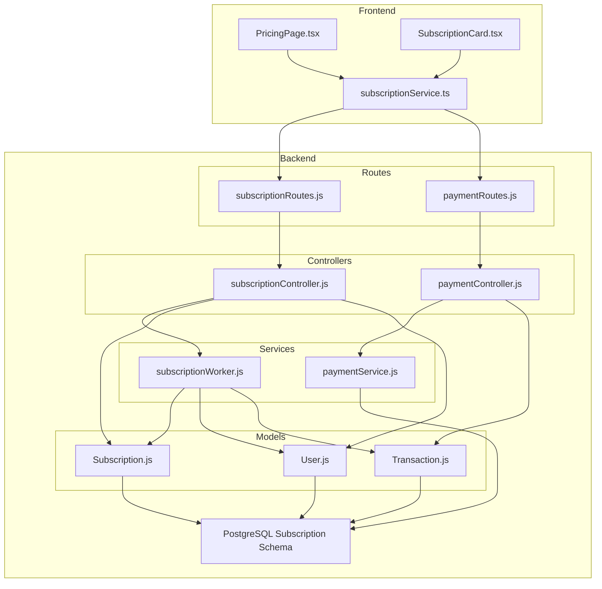
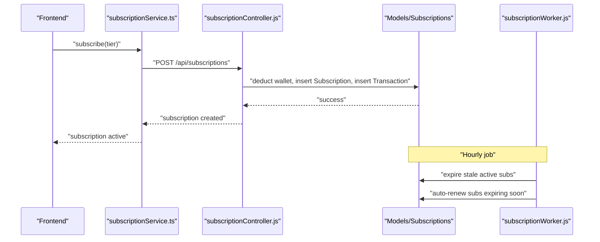
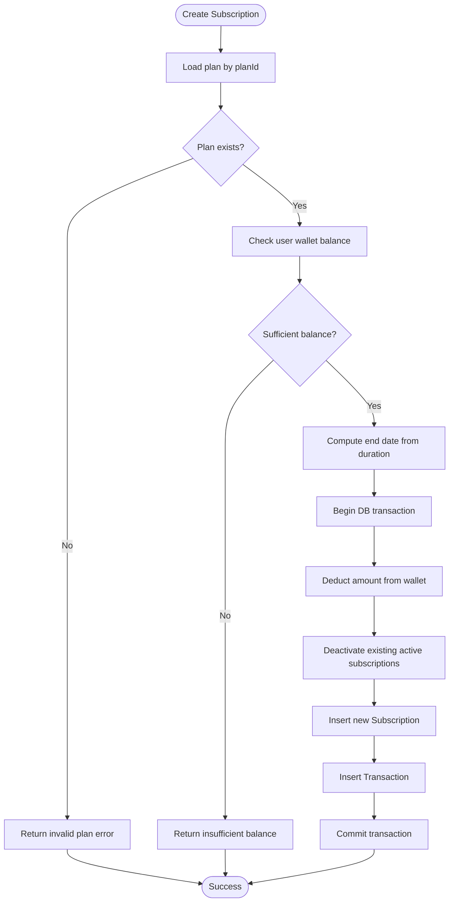
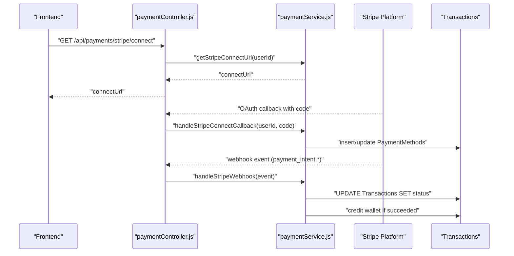
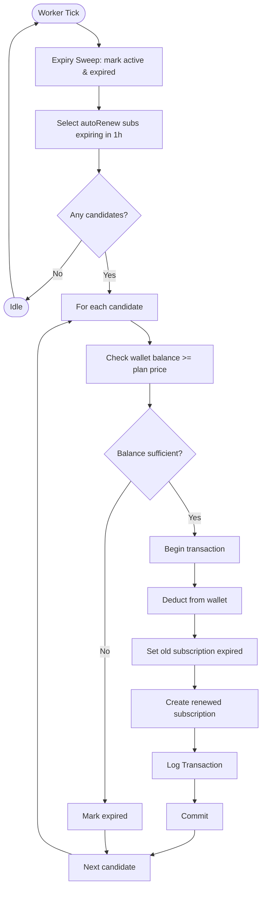
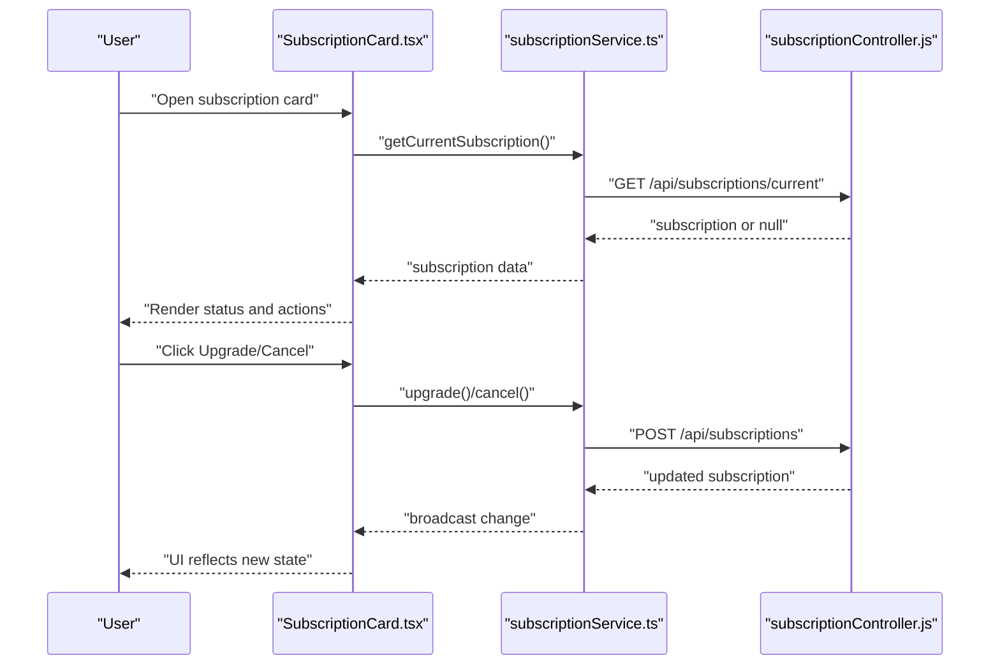
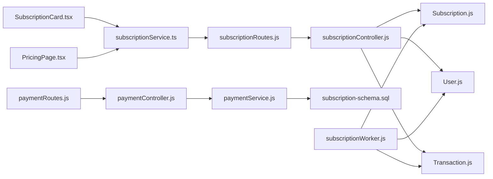

# Billing Engine and Subscription Management

<cite>
**Referenced Files in This Document**
- [subscriptionController.js](file://backend/controllers/subscriptionController.js)
- [subscriptionRoutes.js](file://backend/routes/subscriptionRoutes.js)
- [subscriptionPlans.js](file://backend/config/subscriptionPlans.js)
- [Subscription.js](file://backend/models/Subscription.js)
- [User.js](file://backend/models/User.js)
- [Transaction.js](file://backend/models/Transaction.js)
- [paymentController.js](file://backend/controllers/paymentController.js)
- [paymentService.js](file://backend/services/paymentService.js)
- [paymentRoutes.js](file://backend/routes/paymentRoutes.js)
- [subscriptionWorker.js](file://backend/workers/subscriptionWorker.js)
- [subscription-schema.sql](file://database/subscription-schema.sql)
- [PricingPage.tsx](file://frontend/src/pages/PricingPage.tsx)
- [SubscriptionCard.tsx](file://frontend/src/components/SubscriptionCard.tsx)
- [subscriptionService.ts](file://frontend/src/services/subscriptionService.ts)
</cite>

## Table of Contents
1. [Introduction](#introduction)
2. [Project Structure](#project-structure)
3. [Core Components](#core-components)
4. [Architecture Overview](#architecture-overview)
5. [Detailed Component Analysis](#detailed-component-analysis)
6. [Dependency Analysis](#dependency-analysis)
7. [Performance Considerations](#performance-considerations)
8. [Troubleshooting Guide](#troubleshooting-guide)
9. [Conclusion](#conclusion)
10. [Appendices](#appendices)

## Introduction
This document describes the billing engine and subscription management system, focusing on:
- Stripe integration architecture and webhook processing
- One-time payment intent creation for purchases
- Recurring subscription setup with automatic payment methods
- Subscription lifecycle from creation through updates and cancellations
- Customer management including Stripe customer creation and payment method attachment
- Webhook processing for payment success/failure events and subscription status synchronization
- Implementation examples for subscription tiers, pricing models, and payment method handling
- Database schema for subscription tracking, invoice generation, and payment reconciliation

## Project Structure
The billing system spans backend controllers, services, models, workers, and frontend components. It integrates with Stripe for card payments and supports local wallet-based subscriptions alongside mobile money.

**Diagram sources**
- [subscriptionController.js:1-171](file://backend/controllers/subscriptionController.js#L1-L171)
- [paymentController.js:1-99](file://backend/controllers/paymentController.js#L1-L99)
- [subscriptionRoutes.js:1-18](file://backend/routes/subscriptionRoutes.js#L1-L18)
- [paymentRoutes.js:1-22](file://backend/routes/paymentRoutes.js#L1-L22)
- [subscriptionWorker.js:1-175](file://backend/workers/subscriptionWorker.js#L1-L175)
- [Subscription.js:1-46](file://backend/models/Subscription.js#L1-L46)
- [User.js:1-50](file://backend/models/User.js#L1-L50)
- [Transaction.js:1-54](file://backend/models/Transaction.js#L1-L54)
- [subscription-schema.sql:1-644](file://database/subscription-schema.sql#L1-L644)
- [PricingPage.tsx:1-211](file://frontend/src/pages/PricingPage.tsx#L1-L211)
- [SubscriptionCard.tsx:1-185](file://frontend/src/components/SubscriptionCard.tsx#L1-L185)
- [subscriptionService.ts:1-161](file://frontend/src/services/subscriptionService.ts#L1-L161)

**Section sources**
- [subscriptionController.js:1-171](file://backend/controllers/subscriptionController.js#L1-L171)
- [subscriptionRoutes.js:1-18](file://backend/routes/subscriptionRoutes.js#L1-L18)
- [subscriptionWorker.js:1-175](file://backend/workers/subscriptionWorker.js#L1-L175)
- [subscription-schema.sql:1-644](file://database/subscription-schema.sql#L1-L644)

## Core Components
- Subscription controller: handles current subscription retrieval, creation, cancellation, and history.
- Payment controller/service: initiates deposits/withdrawals, Stripe Connect OAuth, and webhook handlers.
- Models: Subscription, User, Transaction define the core data structures.
- Worker: performs hourly expiry sweeps and auto-renewal for eligible subscriptions.
- Frontend services/components: present pricing tiers, manage subscription state, and orchestrate requests.

Key implementation examples:
- Subscription tiers and pricing model: [subscriptionPlans.js:13-18](file://backend/config/subscriptionPlans.js#L13-L18)
- One-time subscription creation with wallet deduction: [subscriptionController.js:34-109](file://backend/controllers/subscriptionController.js#L34-L109)
- Stripe Connect OAuth initiation and callback: [paymentController.js:38-55](file://backend/controllers/paymentController.js#L38-L55), [paymentService.js:188-233](file://backend/services/paymentService.js#L188-L233)
- Stripe webhook verification and event handling: [paymentController.js:74-98](file://backend/controllers/paymentController.js#L74-L98), [paymentService.js:168-185](file://backend/services/paymentService.js#L168-L185)
- Auto-renewal worker: [subscriptionWorker.js:97-172](file://backend/workers/subscriptionWorker.js#L97-L172)

**Section sources**
- [subscriptionPlans.js:13-18](file://backend/config/subscriptionPlans.js#L13-L18)
- [subscriptionController.js:34-109](file://backend/controllers/subscriptionController.js#L34-L109)
- [paymentController.js:38-55](file://backend/controllers/paymentController.js#L38-L55)
- [paymentService.js:168-233](file://backend/services/paymentService.js#L168-L233)
- [subscriptionWorker.js:97-172](file://backend/workers/subscriptionWorker.js#L97-L172)

## Architecture Overview
The system supports two primary payment flows:
- Local wallet-based subscriptions (time-based access with fixed durations).
- Stripe-powered recurring and one-time payments with webhooks for reconciliation.

**Diagram sources**
- [subscriptionService.ts:29-39](file://frontend/src/services/subscriptionService.ts#L29-L39)
- [subscriptionController.js:34-109](file://backend/controllers/subscriptionController.js#L34-L109)
- [Subscription.js:1-46](file://backend/models/Subscription.js#L1-L46)
- [Transaction.js:1-54](file://backend/models/Transaction.js#L1-L54)
- [subscriptionWorker.js:97-172](file://backend/workers/subscriptionWorker.js#L97-L172)

## Detailed Component Analysis

### Subscription Lifecycle Management
- Creation: Validates plan, checks wallet balance, sets end date based on plan duration, and records transactions.
- Current status: Returns active subscription or null if expired.
- Cancellation: Disables auto-renew and marks as cancelled.
- History: Lists all past and current subscriptions.

**Diagram sources**
- [subscriptionController.js:34-109](file://backend/controllers/subscriptionController.js#L34-L109)
- [subscriptionPlans.js:13-18](file://backend/config/subscriptionPlans.js#L13-L18)
- [User.js:30-37](file://backend/models/User.js#L30-L37)
- [Subscription.js:22-29](file://backend/models/Subscription.js#L22-L29)
- [Transaction.js:14-17](file://backend/models/Transaction.js#L14-L17)

**Section sources**
- [subscriptionController.js:7-143](file://backend/controllers/subscriptionController.js#L7-L143)
- [subscriptionPlans.js:13-18](file://backend/config/subscriptionPlans.js#L13-L18)
- [Subscription.js:1-46](file://backend/models/Subscription.js#L1-L46)
- [User.js:1-50](file://backend/models/User.js#L1-L50)
- [Transaction.js:1-54](file://backend/models/Transaction.js#L1-L54)

### Stripe Integration and Webhooks
- OAuth Connect: Generates Stripe Connect URL and persists Stripe account association.
- Webhooks: Verifies Stripe signatures, updates Transactions, and credits wallets on success.

**Diagram sources**
- [paymentController.js:38-55](file://backend/controllers/paymentController.js#L38-L55)
- [paymentController.js:74-98](file://backend/controllers/paymentController.js#L74-L98)
- [paymentService.js:188-233](file://backend/services/paymentService.js#L188-L233)
- [paymentService.js:168-185](file://backend/services/paymentService.js#L168-L185)

**Section sources**
- [paymentController.js:38-98](file://backend/controllers/paymentController.js#L38-L98)
- [paymentService.js:168-233](file://backend/services/paymentService.js#L168-L233)

### Auto-Renewal and Expiry Worker
- Hourly expiry sweep: Marks active non-auto-renew subscriptions as expired if past end date.
- Renewal sweep: Attempts to auto-renew subscriptions expiring within the next hour by charging the user’s wallet and extending the subscription.

**Diagram sources**
- [subscriptionWorker.js:97-172](file://backend/workers/subscriptionWorker.js#L97-L172)
- [subscriptionPlans.js:13-18](file://backend/config/subscriptionPlans.js#L13-L18)
- [Subscription.js:18-21](file://backend/models/Subscription.js#L18-L21)
- [User.js:30-37](file://backend/models/User.js#L30-L37)
- [Transaction.js:14-17](file://backend/models/Transaction.js#L14-L17)

**Section sources**
- [subscriptionWorker.js:17-89](file://backend/workers/subscriptionWorker.js#L17-L89)
- [subscriptionWorker.js:97-172](file://backend/workers/subscriptionWorker.js#L97-L172)

### Database Schema for Subscriptions, Invoices, and Reconciliation
The PostgreSQL schema defines:
- subscription_plans: pricing and access configuration
- user_subscriptions: active subscriptions, periods, auto-renew flags
- subscription_invoices: invoicing and payment metadata
- subscription_events: webhook event storage with retry tracking
- subscription_usage and subscription_access_logs: usage and access logs
- subscription_analytics: pre-aggregated metrics

```mermaid
erDiagram
SUBSCRIPTION_PLANS {
uuid id PK
varchar sku UK
varchar name
text description
varchar access_period_unit
integer access_period_value
integer access_duration_seconds
decimal price_amount
varchar price_currency
varchar billing_interval
varchar recurring_interval
integer max_concurrent_streams
varchar max_quality
integer max_downloads
integer max_offline_devices
text[] allowed_product_types
text[] allowed_categories
text[] excluded_categories
integer max_products_per_month
boolean is_active
boolean is_featured
boolean requires_approval
integer trial_period_days
decimal trial_price_amount
integer sort_order
text icon_url
jsonb features
jsonb restrictions
timestamp created_at
timestamp updated_at
}
USER_SUBSCRIPTIONS {
uuid id PK
varchar user_id
uuid plan_id FK
varchar status
timestamp current_period_start
timestamp current_period_end
boolean cancel_at_period_end
timestamp cancelled_at
integer total_seconds_consumed
integer seconds_consumed_this_period
timestamp last_access_time
varchar payment_method_id
varchar payment_provider
varchar subscription_provider_id
timestamp billing_cycle_anchor
timestamp current_billing_period_start
timestamp current_billing_period_end
timestamp trial_start
timestamp trial_end
boolean is_in_trial
boolean auto_renew
integer renewal_attempts
timestamp next_payment_attempt
integer products_accessed_this_month
integer streams_this_month
integer downloads_this_month
jsonb metadata
text notes
timestamp created_at
timestamp updated_at
}
SUBSCRIPTION_INVOICES {
uuid id PK
uuid subscription_id FK
varchar user_id
varchar invoice_number UK
timestamp period_start
timestamp period_end
timestamp due_date
decimal subtotal_amount
decimal tax_amount
decimal total_amount
varchar currency
decimal tax_rate
decimal discount_amount
varchar status
timestamp paid_at
varchar payment_method
varchar payment_id
varchar payment_provider
jsonb billing_address
varchar tax_id
text invoice_pdf_url
text hosted_invoice_url
varchar receipt_number
jsonb metadata
text notes
timestamp created_at
timestamp updated_at
}
SUBSCRIPTION_EVENTS {
uuid id PK
varchar event_id UK
varchar event_type
varchar provider
varchar provider_event_id
jsonb payload
boolean processed
text processing_error
integer retry_count
timestamp created_at
timestamp processed_at
}
SUBSCRIPTION_PLANS ||--o{ USER_SUBSCRIPTIONS : "has"
USER_SUBSCRIPTIONS ||--o{ SUBSCRIPTION_INVOICES : "generates"
```

**Diagram sources**
- [subscription-schema.sql:18-66](file://database/subscription-schema.sql#L18-L66)
- [subscription-schema.sql:72-123](file://database/subscription-schema.sql#L72-L123)
- [subscription-schema.sql:172-222](file://database/subscription-schema.sql#L172-L222)
- [subscription-schema.sql:263-288](file://database/subscription-schema.sql#L263-L288)

**Section sources**
- [subscription-schema.sql:1-644](file://database/subscription-schema.sql#L1-L644)

### Frontend Subscription Experience
- Pricing page displays available tiers and pricing in local and USD terms.
- Subscription card shows current status, remaining time, and actions to upgrade or cancel.
- Subscription service manages current subscription state, broadcasts changes, and calculates upgrade costs.

**Diagram sources**
- [PricingPage.tsx:64-160](file://frontend/src/pages/PricingPage.tsx#L64-L160)
- [SubscriptionCard.tsx:13-184](file://frontend/src/components/SubscriptionCard.tsx#L13-L184)
- [subscriptionService.ts:16-80](file://frontend/src/services/subscriptionService.ts#L16-L80)
- [subscriptionController.js:7-143](file://backend/controllers/subscriptionController.js#L7-L143)

**Section sources**
- [PricingPage.tsx:1-211](file://frontend/src/pages/PricingPage.tsx#L1-L211)
- [SubscriptionCard.tsx:1-185](file://frontend/src/components/SubscriptionCard.tsx#L1-L185)
- [subscriptionService.ts:1-161](file://frontend/src/services/subscriptionService.ts#L1-L161)

## Dependency Analysis
- Controllers depend on models and services for business logic.
- Services encapsulate Stripe SDK usage and database interactions.
- Worker depends on models and configuration for renewal logic.
- Routes enforce authentication and delegate to controllers.
- Frontend services depend on backend APIs and models.

**Diagram sources**
- [subscriptionRoutes.js:1-18](file://backend/routes/subscriptionRoutes.js#L1-L18)
- [paymentRoutes.js:1-22](file://backend/routes/paymentRoutes.js#L1-L22)
- [subscriptionController.js:1-171](file://backend/controllers/subscriptionController.js#L1-L171)
- [paymentController.js:1-99](file://backend/controllers/paymentController.js#L1-L99)
- [Subscription.js:1-46](file://backend/models/Subscription.js#L1-L46)
- [User.js:1-50](file://backend/models/User.js#L1-L50)
- [Transaction.js:1-54](file://backend/models/Transaction.js#L1-L54)
- [paymentService.js:1-234](file://backend/services/paymentService.js#L1-L234)
- [subscriptionWorker.js:1-175](file://backend/workers/subscriptionWorker.js#L1-L175)
- [subscription-schema.sql:1-644](file://database/subscription-schema.sql#L1-L644)
- [subscriptionService.ts:1-161](file://frontend/src/services/subscriptionService.ts#L1-L161)
- [SubscriptionCard.tsx:1-185](file://frontend/src/components/SubscriptionCard.tsx#L1-L185)
- [PricingPage.tsx:1-211](file://frontend/src/pages/PricingPage.tsx#L1-L211)

**Section sources**
- [subscriptionRoutes.js:1-18](file://backend/routes/subscriptionRoutes.js#L1-L18)
- [paymentRoutes.js:1-22](file://backend/routes/paymentRoutes.js#L1-L22)
- [subscriptionController.js:1-171](file://backend/controllers/subscriptionController.js#L1-L171)
- [paymentController.js:1-99](file://backend/controllers/paymentController.js#L1-L99)
- [subscriptionWorker.js:1-175](file://backend/workers/subscriptionWorker.js#L1-L175)
- [subscriptionService.ts:1-161](file://frontend/src/services/subscriptionService.ts#L1-L161)

## Performance Considerations
- Use database transactions for atomic subscription and wallet updates to prevent race conditions.
- Indexes on subscription status, end dates, and user IDs improve worker and controller query performance.
- Webhook verification ensures only legitimate events trigger reconciliation.
- Cron scheduling runs expiry and renewal sweeps at predictable intervals to avoid spikes.

## Troubleshooting Guide
Common issues and resolutions:
- Stripe webhook signature verification fails: ensure webhook secret is configured and the Stripe SDK is available.
- Insufficient wallet balance during renewal: worker marks subscription expired; notify users and prompt manual re-subscription.
- Invalid OAuth code or state: validate parameters and enable stub mode only in development.
- Mobile money webhook payload missing fields: validate required keys and return appropriate errors.

**Section sources**
- [paymentController.js:74-98](file://backend/controllers/paymentController.js#L74-L98)
- [paymentService.js:168-185](file://backend/services/paymentService.js#L168-L185)
- [paymentService.js:201-228](file://backend/services/paymentService.js#L201-L228)
- [subscriptionWorker.js:35-40](file://backend/workers/subscriptionWorker.js#L35-L40)

## Conclusion
The billing engine combines a local wallet-based subscription model with Stripe integration for seamless one-time and recurring payments. The system enforces strict reconciliation via webhooks, maintains robust subscription lifecycle automation, and provides a clear frontend experience for users to manage their subscriptions.

## Appendices

### API Endpoints Summary
- GET /api/subscriptions/plans: Public endpoint returning canonical SLL prices and live USD conversions.
- GET /api/subscriptions/current: Authenticated endpoint returning active subscription or null.
- POST /api/subscriptions: Authenticated endpoint to create a new subscription.
- POST /api/subscriptions/cancel: Authenticated endpoint to cancel active subscription.
- GET /api/subscriptions/history: Authenticated endpoint returning subscription history.
- POST /api/payments/deposit: Authenticated endpoint to initiate deposits (including Stripe).
- POST /api/payments/withdraw: Authenticated endpoint to initiate withdrawals.
- GET /api/payments/stripe/connect: Authenticated endpoint to initiate Stripe Connect.
- GET /api/payments/stripe/callback: OAuth callback handler.
- DELETE /api/payments/stripe/disconnect: Authenticated endpoint to disconnect Stripe.
- POST /api/payments/webhooks/stripe: Stripe webhook endpoint with signature verification.
- POST /api/payments/webhooks/orange, /api/payments/webhooks/afrimoney, /api/payments/webhooks/qmoney: Mobile money webhook endpoints.

**Section sources**
- [subscriptionRoutes.js:6-15](file://backend/routes/subscriptionRoutes.js#L6-L15)
- [paymentRoutes.js:6-19](file://backend/routes/paymentRoutes.js#L6-L19)
- [subscriptionController.js:145-170](file://backend/controllers/subscriptionController.js#L145-L170)
- [paymentController.js:17-98](file://backend/controllers/paymentController.js#L17-L98)