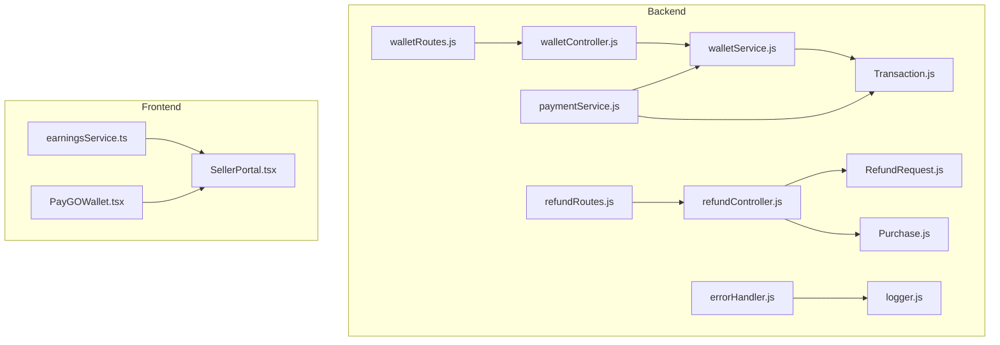
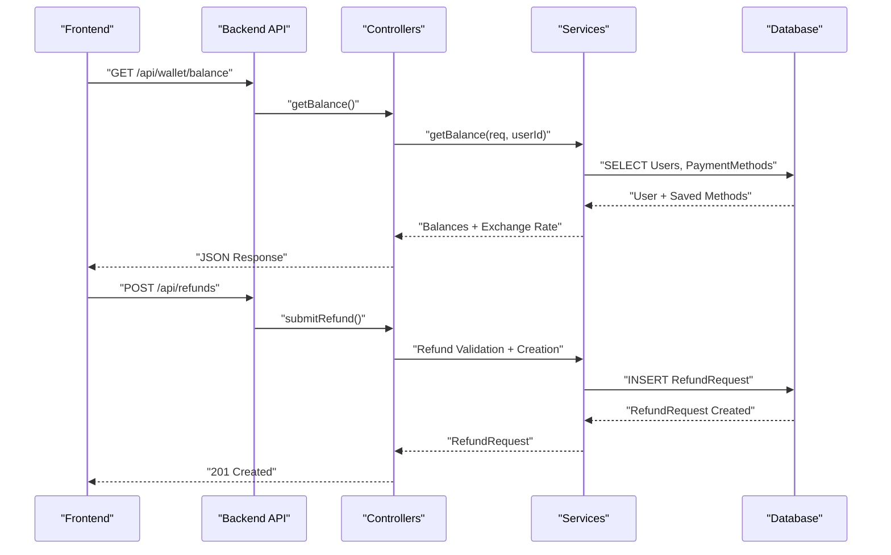
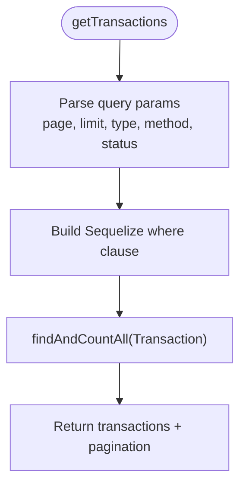
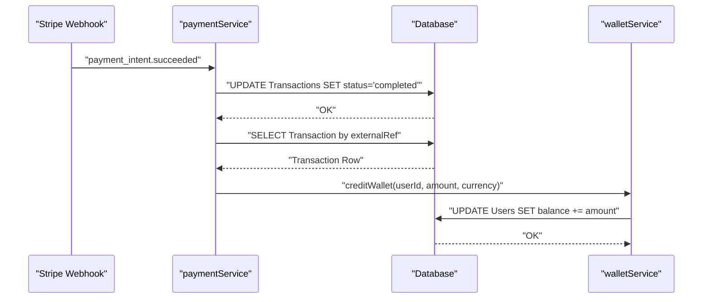
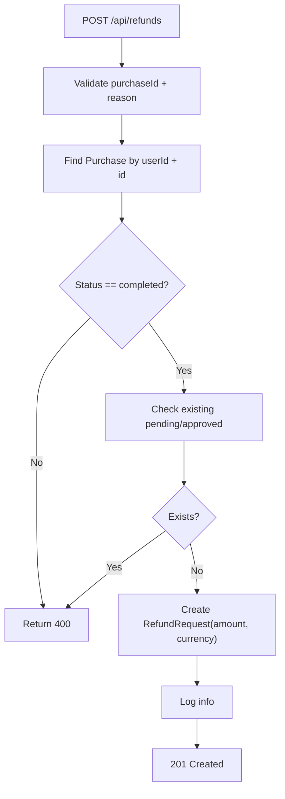
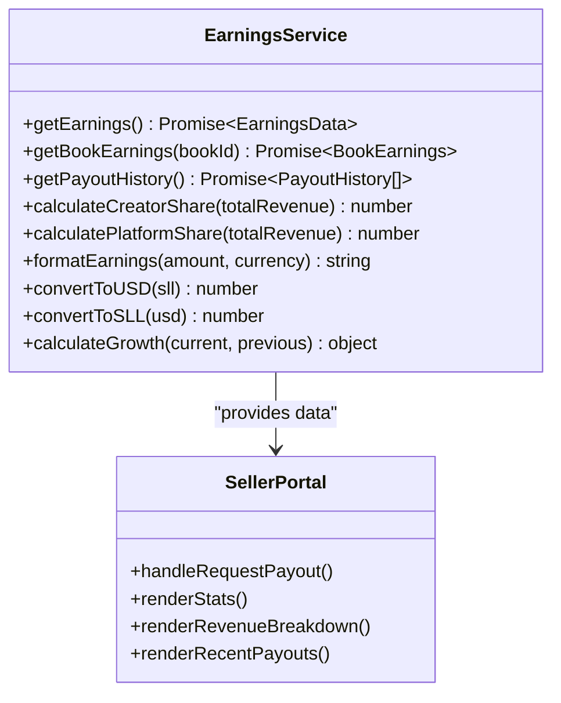
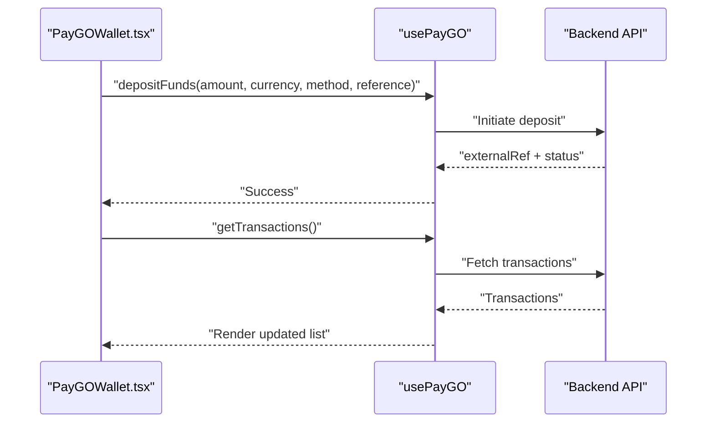
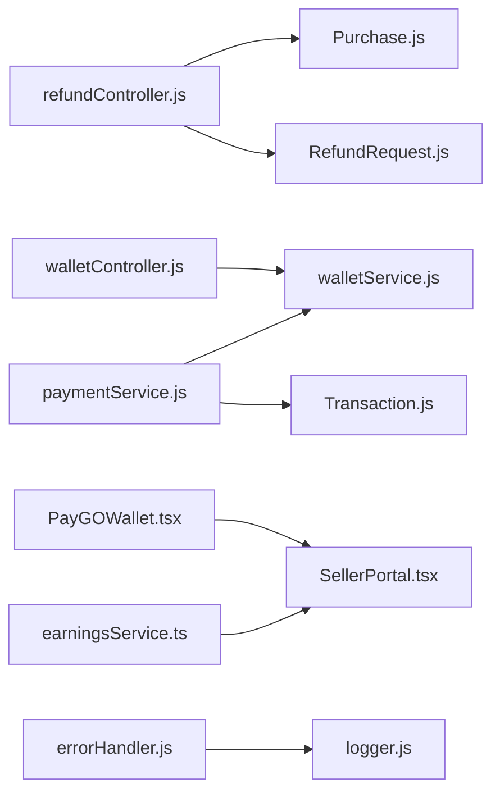

# Financial Reporting and Analytics

<cite>
**Referenced Files in This Document**
- [walletController.js](file://backend/controllers/walletController.js)
- [walletService.js](file://backend/services/walletService.js)
- [walletRoutes.js](file://backend/routes/walletRoutes.js)
- [refundController.js](file://backend/controllers/refundController.js)
- [refundRoutes.js](file://backend/routes/refundRoutes.js)
- [RefundRequest.js](file://backend/models/RefundRequest.js)
- [Transaction.js](file://backend/models/Transaction.js)
- [Purchase.js](file://backend/models/Purchase.js)
- [paymentService.js](file://backend/services/paymentService.js)
- [earningsService.ts](file://frontend/src/services/earningsService.ts)
- [SellerPortal.tsx](file://frontend/src/pages/SellerPortal.tsx)
- [PayGOWallet.tsx](file://frontend/src/components/PayGOWallet.tsx)
- [errorHandler.js](file://backend/middleware/errorHandler.js)
- [logger.js](file://backend/utils/logger.js)
</cite>

## Table of Contents
1. [Introduction](#introduction)
2. [Project Structure](#project-structure)
3. [Core Components](#core-components)
4. [Architecture Overview](#architecture-overview)
5. [Detailed Component Analysis](#detailed-component-analysis)
6. [Dependency Analysis](#dependency-analysis)
7. [Performance Considerations](#performance-considerations)
8. [Troubleshooting Guide](#troubleshooting-guide)
9. [Conclusion](#conclusion)
10. [Appendices](#appendices)

## Introduction
This document provides comprehensive documentation for the financial reporting and analytics systems, focusing on wallet controller implementation for creator earnings management, payout processing, and revenue tracking. It explains transaction reporting, income statements, and financial reconciliation processes, details the refund request handling system including calculations, approvals, and payouts, and covers earnings analytics, revenue dashboards, and financial insights generation. It also includes examples of creator payout calculations, commission tracking, and revenue distribution algorithms, along with reporting intervals, data aggregation, and export capabilities for accounting purposes.

## Project Structure
The financial reporting and analytics system spans backend controllers, services, and models, alongside frontend services and UI components. Key areas include:
- Wallet and transaction management (backend)
- Refund request lifecycle (backend)
- Creator earnings analytics and payout dashboards (frontend)
- Payment processing and reconciliation (backend)
- Logging and error handling (backend)

**Diagram sources**
- [walletController.js:1-17](file://backend/controllers/walletController.js#L1-L17)
- [walletService.js:1-80](file://backend/services/walletService.js#L1-L80)
- [walletRoutes.js:1-11](file://backend/routes/walletRoutes.js#L1-L11)
- [refundController.js:1-145](file://backend/controllers/refundController.js#L1-L145)
- [refundRoutes.js:1-31](file://backend/routes/refundRoutes.js#L1-L31)
- [RefundRequest.js:1-42](file://backend/models/RefundRequest.js#L1-L42)
- [Transaction.js:1-54](file://backend/models/Transaction.js#L1-L54)
- [Purchase.js:1-26](file://backend/models/Purchase.js#L1-L26)
- [paymentService.js:1-234](file://backend/services/paymentService.js#L1-L234)
- [errorHandler.js:1-44](file://backend/middleware/errorHandler.js#L1-L44)
- [logger.js:1-58](file://backend/utils/logger.js#L1-L58)
- [earningsService.ts:1-119](file://frontend/src/services/earningsService.ts#L1-L119)
- [SellerPortal.tsx:1-322](file://frontend/src/pages/SellerPortal.tsx#L1-L322)
- [PayGOWallet.tsx:1-299](file://frontend/src/components/PayGOWallet.tsx#L1-L299)

**Section sources**
- [walletController.js:1-17](file://backend/controllers/walletController.js#L1-L17)
- [walletService.js:1-80](file://backend/services/walletService.js#L1-L80)
- [walletRoutes.js:1-11](file://backend/routes/walletRoutes.js#L1-L11)
- [refundController.js:1-145](file://backend/controllers/refundController.js#L1-L145)
- [refundRoutes.js:1-31](file://backend/routes/refundRoutes.js#L1-L31)
- [RefundRequest.js:1-42](file://backend/models/RefundRequest.js#L1-L42)
- [Transaction.js:1-54](file://backend/models/Transaction.js#L1-L54)
- [Purchase.js:1-26](file://backend/models/Purchase.js#L1-L26)
- [paymentService.js:1-234](file://backend/services/paymentService.js#L1-L234)
- [errorHandler.js:1-44](file://backend/middleware/errorHandler.js#L1-L44)
- [logger.js:1-58](file://backend/utils/logger.js#L1-L58)
- [earningsService.ts:1-119](file://frontend/src/services/earningsService.ts#L1-L119)
- [SellerPortal.tsx:1-322](file://frontend/src/pages/SellerPortal.tsx#L1-L322)
- [PayGOWallet.tsx:1-299](file://frontend/src/components/PayGOWallet.tsx#L1-L299)

## Core Components
- Wallet Controller: Exposes endpoints to retrieve user wallet balance and transaction history.
- Wallet Service: Implements balance computation, transaction pagination, and atomic wallet crediting.
- Refund Controller: Manages learner refund requests, validations, and retrieval.
- Refund Request Model: Defines refund request schema with status and amount tracking.
- Transaction Model: Captures transaction events with type, amount, currency, fees, and status.
- Payment Service: Handles deposit/withdrawal initiation, fee calculations, and webhook reconciliation.
- Frontend Earnings Service: Provides creator earnings analytics, currency conversion, and growth calculations.
- Seller Portal: Visualizes earnings, revenue breakdown, and recent payouts.
- PayGO Wallet: Displays PayGo wallet balances and transaction actions.

**Section sources**
- [walletController.js:8-17](file://backend/controllers/walletController.js#L8-L17)
- [walletService.js:8-80](file://backend/services/walletService.js#L8-L80)
- [refundController.js:25-144](file://backend/controllers/refundController.js#L25-L144)
- [RefundRequest.js:4-41](file://backend/models/RefundRequest.js#L4-L41)
- [Transaction.js:4-50](file://backend/models/Transaction.js#L4-L50)
- [paymentService.js:53-147](file://backend/services/paymentService.js#L53-L147)
- [earningsService.ts:28-115](file://frontend/src/services/earningsService.ts#L28-L115)
- [SellerPortal.tsx:129-231](file://frontend/src/pages/SellerPortal.tsx#L129-L231)
- [PayGOWallet.tsx:20-299](file://frontend/src/components/PayGOWallet.tsx#L20-L299)

## Architecture Overview
The system integrates frontend analytics with backend financial operations:
- Controllers orchestrate requests and delegate to services.
- Services encapsulate business logic, including fee calculations, atomic updates, and reconciliation.
- Models define transaction and refund schemas for persistence.
- Frontend services and UI present earnings, revenue breakdown, and payout dashboards.
- Logging and error handling centralize observability and diagnostics.

**Diagram sources**
- [walletController.js:8-12](file://backend/controllers/walletController.js#L8-L12)
- [walletService.js:8-38](file://backend/services/walletService.js#L8-L38)
- [refundController.js:25-87](file://backend/controllers/refundController.js#L25-L87)
- [RefundRequest.js:4-38](file://backend/models/RefundRequest.js#L4-L38)

## Detailed Component Analysis

### Wallet Controller and Service
The wallet controller delegates to the wallet service to compute balances and fetch transactions. The service retrieves user balances, applies an exchange rate (with fallback), and returns saved payment methods. Transactions are paginated and filtered by optional criteria.

**Diagram sources**
- [walletController.js:13-17](file://backend/controllers/walletController.js#L13-L17)
- [walletService.js:40-62](file://backend/services/walletService.js#L40-L62)

**Section sources**
- [walletController.js:8-17](file://backend/controllers/walletController.js#L8-L17)
- [walletService.js:8-80](file://backend/services/walletService.js#L8-L80)
- [walletRoutes.js:7-8](file://backend/routes/walletRoutes.js#L7-L8)

### Transaction Reporting and Reconciliation
Transactions are persisted with type, amount, currency, platform fee, and status. Payment service reconciles webhooks by updating transaction statuses and crediting wallets atomically.

**Diagram sources**
- [paymentService.js:168-185](file://backend/services/paymentService.js#L168-L185)
- [walletService.js:64-80](file://backend/services/walletService.js#L64-L80)
- [Transaction.js:4-50](file://backend/models/Transaction.js#L4-L50)

**Section sources**
- [Transaction.js:14-49](file://backend/models/Transaction.js#L14-L49)
- [paymentService.js:44-51](file://backend/services/paymentService.js#L44-L51)
- [paymentService.js:168-185](file://backend/services/paymentService.js#L168-L185)
- [walletService.js:64-80](file://backend/services/walletService.js#L64-L80)

### Refund Request Handling
Refund requests are validated against purchase ownership, completion status, and duplicate pending/approved requests. The controller creates a refund request with amount and currency copied from the purchase.

**Diagram sources**
- [refundController.js:25-87](file://backend/controllers/refundController.js#L25-L87)
- [RefundRequest.js:4-38](file://backend/models/RefundRequest.js#L4-L38)
- [Purchase.js:4-22](file://backend/models/Purchase.js#L4-L22)

**Section sources**
- [refundController.js:25-87](file://backend/controllers/refundController.js#L25-L87)
- [refundRoutes.js:14-28](file://backend/routes/refundRoutes.js#L14-L28)
- [RefundRequest.js:4-41](file://backend/models/RefundRequest.js#L4-L41)
- [Purchase.js:4-26](file://backend/models/Purchase.js#L4-L26)

### Creator Earnings Analytics and Payouts
The frontend earnings service computes creator and platform shares, converts currencies, and calculates growth. The seller portal aggregates earnings, revenue breakdown, and recent payouts for dashboard visualization.

**Diagram sources**
- [earningsService.ts:28-115](file://frontend/src/services/earningsService.ts#L28-L115)
- [SellerPortal.tsx:45-58](file://frontend/src/pages/SellerPortal.tsx#L45-L58)

**Section sources**
- [earningsService.ts:28-115](file://frontend/src/services/earningsService.ts#L28-L115)
- [SellerPortal.tsx:129-231](file://frontend/src/pages/SellerPortal.tsx#L129-L231)

### PayGO Wallet Integration
The PayGO wallet component displays balances, supports deposits, and refreshes transaction history. It formats currency and handles user actions for adding funds.

**Diagram sources**
- [PayGOWallet.tsx:37-66](file://frontend/src/components/PayGOWallet.tsx#L37-L66)
- [walletController.js:13-17](file://backend/controllers/walletController.js#L13-L17)

**Section sources**
- [PayGOWallet.tsx:20-299](file://frontend/src/components/PayGOWallet.tsx#L20-L299)
- [walletController.js:13-17](file://backend/controllers/walletController.js#L13-L17)

## Dependency Analysis
The system exhibits clear separation of concerns:
- Controllers depend on services for business logic.
- Services depend on models and external integrations (exchange rates, payment providers).
- Frontend services depend on backend APIs for analytics and reporting.
- Middleware and logging provide cross-cutting concerns.

**Diagram sources**
- [walletController.js:1-17](file://backend/controllers/walletController.js#L1-L17)
- [walletService.js:1-80](file://backend/services/walletService.js#L1-L80)
- [refundController.js:1-145](file://backend/controllers/refundController.js#L1-L145)
- [RefundRequest.js:1-42](file://backend/models/RefundRequest.js#L1-L42)
- [Purchase.js:1-26](file://backend/models/Purchase.js#L1-L26)
- [paymentService.js:1-234](file://backend/services/paymentService.js#L1-L234)
- [Transaction.js:1-54](file://backend/models/Transaction.js#L1-L54)
- [earningsService.ts:1-119](file://frontend/src/services/earningsService.ts#L1-L119)
- [SellerPortal.tsx:1-322](file://frontend/src/pages/SellerPortal.tsx#L1-L322)
- [PayGOWallet.tsx:1-299](file://frontend/src/components/PayGOWallet.tsx#L1-L299)
- [errorHandler.js:1-44](file://backend/middleware/errorHandler.js#L1-L44)
- [logger.js:1-58](file://backend/utils/logger.js#L1-L58)

**Section sources**
- [walletController.js:1-17](file://backend/controllers/walletController.js#L1-L17)
- [walletService.js:1-80](file://backend/services/walletService.js#L1-L80)
- [refundController.js:1-145](file://backend/controllers/refundController.js#L1-L145)
- [RefundRequest.js:1-42](file://backend/models/RefundRequest.js#L1-L42)
- [Purchase.js:1-26](file://backend/models/Purchase.js#L1-L26)
- [paymentService.js:1-234](file://backend/services/paymentService.js#L1-L234)
- [Transaction.js:1-54](file://backend/models/Transaction.js#L1-L54)
- [earningsService.ts:1-119](file://frontend/src/services/earningsService.ts#L1-L119)
- [SellerPortal.tsx:1-322](file://frontend/src/pages/SellerPortal.tsx#L1-L322)
- [PayGOWallet.tsx:1-299](file://frontend/src/components/PayGOWallet.tsx#L1-L299)
- [errorHandler.js:1-44](file://backend/middleware/errorHandler.js#L1-L44)
- [logger.js:1-58](file://backend/utils/logger.js#L1-L58)

## Performance Considerations
- Atomic updates: Wallet crediting uses direct SQL increments to prevent race conditions.
- Pagination: Transaction queries enforce limits and offsets to control payload sizes.
- Exchange rate fallback: Live rates are preferred with a static fallback to maintain availability.
- Webhook reconciliation: Minimal round-trips by updating status and crediting in sequence after successful events.
- Frontend caching: Earnings and payout history can be cached per session to reduce API calls.

[No sources needed since this section provides general guidance]

## Troubleshooting Guide
- Error handling middleware centralizes error responses and attaches correlation IDs for tracing.
- Logger utilities provide structured logs with timestamps and service tagging.
- Common issues:
  - Insufficient balance during withdrawals: Validate wallet balances before initiating withdrawals.
  - Invalid payment method or amounts: Enforce configuration-driven validation.
  - Duplicate refund requests: Prevent creation when pending/approved exists.
  - Webhook mismatches: Ensure external references match and statuses are updated consistently.

**Section sources**
- [errorHandler.js:5-41](file://backend/middleware/errorHandler.js#L5-L41)
- [logger.js:21-31](file://backend/utils/logger.js#L21-L31)
- [paymentService.js:87-147](file://backend/services/paymentService.js#L87-L147)
- [refundController.js:52-64](file://backend/controllers/refundController.js#L52-L64)
- [paymentService.js:149-185](file://backend/services/paymentService.js#L149-L185)

## Conclusion
The financial reporting and analytics system integrates robust backend controllers and services with frontend dashboards to manage wallet balances, transactions, refunds, and creator earnings. Atomic operations, webhook reconciliation, and structured logging ensure reliability. The frontend provides actionable insights through earnings analytics, revenue breakdowns, and payout summaries, supporting informed financial decisions and accounting workflows.

[No sources needed since this section summarizes without analyzing specific files]

## Appendices

### Reporting Intervals and Data Aggregation
- Intervals: Daily, weekly, monthly aggregations can be derived from transaction timestamps.
- Aggregation: Group by type (deposit, purchase, withdrawal, refund) and currency to compute totals and fees.
- Export: Generate CSV/Excel reports for accounting with columns for date, type, amount, currency, platform fee, and status.

[No sources needed since this section provides general guidance]

### Financial Statement Generation
- Income statement components: Revenue (sales), Cost of Goods (platform fees), Net income (revenue minus fees).
- Balance sheet components: Assets (wallet balances), Liabilities (pending payouts), Equity (accumulated earnings).
- Reconciliation: Match transaction statuses to ledger entries and reconcile discrepancies.

[No sources needed since this section provides general guidance]