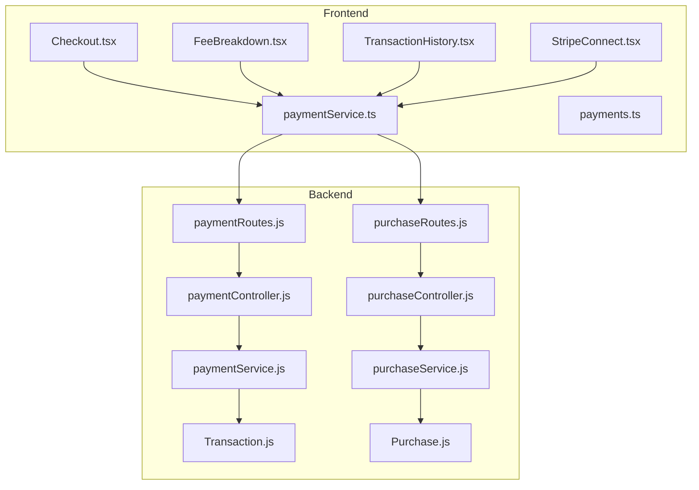
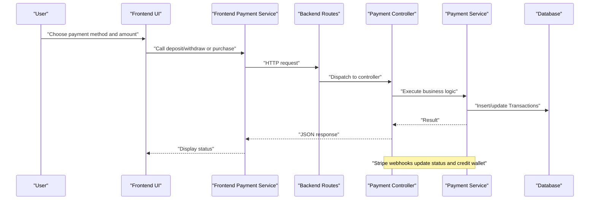
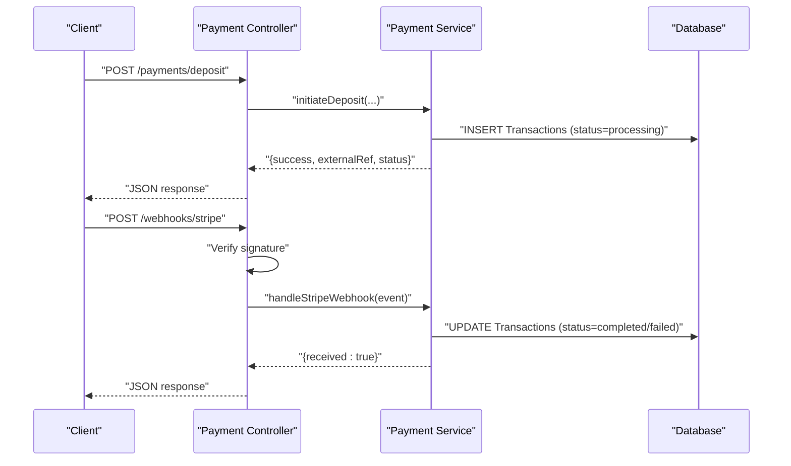
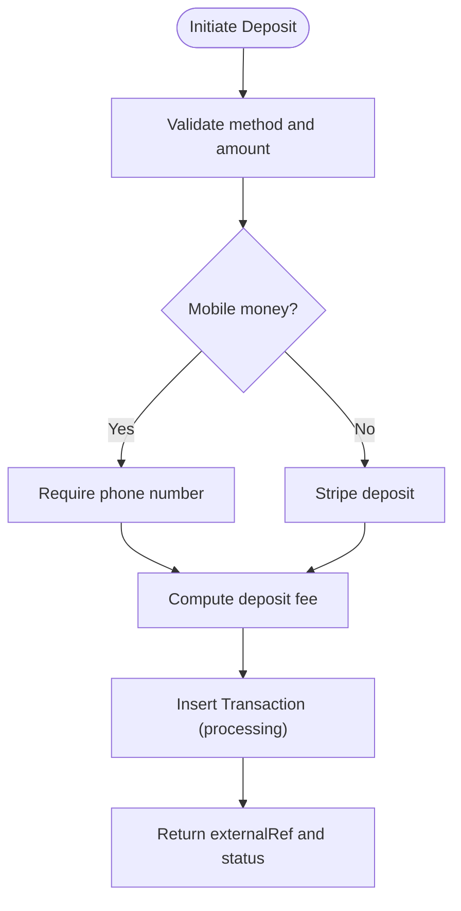
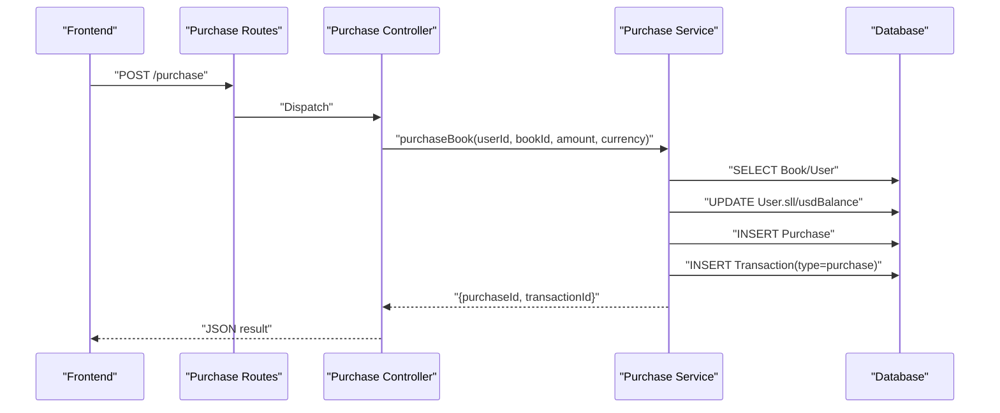
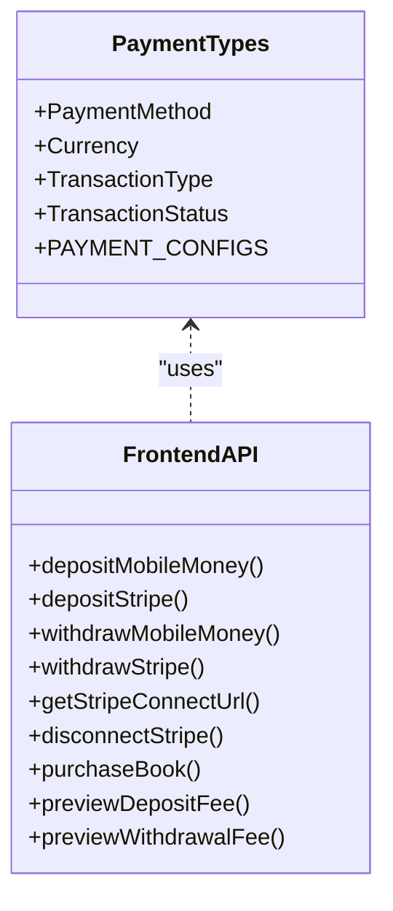
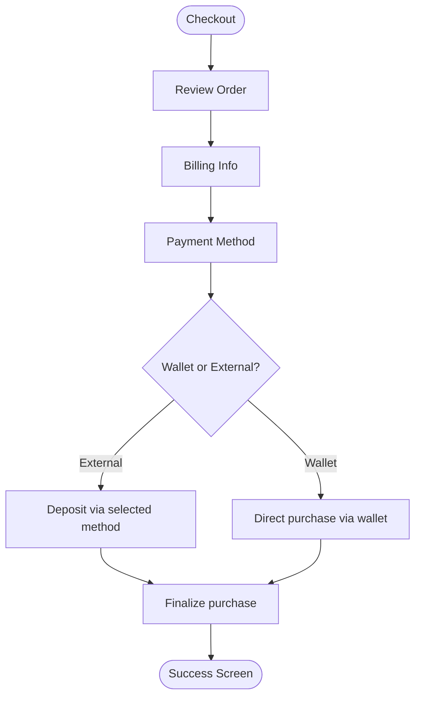
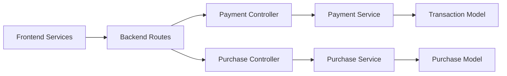

# Payment Processing and Transaction Handling

<cite>
**Referenced Files in This Document**
- [paymentController.js](file://backend/controllers/paymentController.js)
- [paymentService.js](file://backend/services/paymentService.js)
- [Transaction.js](file://backend/models/Transaction.js)
- [paymentRoutes.js](file://backend/routes/paymentRoutes.js)
- [purchaseController.js](file://backend/controllers/purchaseController.js)
- [purchaseRoutes.js](file://backend/routes/purchaseRoutes.js)
- [purchaseService.js](file://backend/services/purchaseService.js)
- [Purchase.js](file://backend/models/Purchase.js)
- [StripeConnect.tsx](file://frontend/src/components/payment/StripeConnect.tsx)
- [paymentService.ts](file://frontend/src/services/paymentService.ts)
- [payments.ts](file://frontend/src/types/payments.ts)
- [Checkout.tsx](file://frontend/src/pages/Checkout.tsx)
- [FeeBreakdown.tsx](file://frontend/src/components/payment/FeeBreakdown.tsx)
- [TransactionHistory.tsx](file://frontend/src/components/payment/TransactionHistory.tsx)
</cite>

## Table of Contents
1. [Introduction](#introduction)
2. [Project Structure](#project-structure)
3. [Core Components](#core-components)
4. [Architecture Overview](#architecture-overview)
5. [Detailed Component Analysis](#detailed-component-analysis)
6. [Dependency Analysis](#dependency-analysis)
7. [Performance Considerations](#performance-considerations)
8. [Troubleshooting Guide](#troubleshooting-guide)
9. [Conclusion](#conclusion)
10. [Appendices](#appendices)

## Introduction
This document explains the payment processing and transaction handling systems across the backend and frontend. It covers:
- Frontend payment service implementation, including Stripe Connect integration, payment form handling, and client-side validation
- Backend payment controller functionality, transaction creation, and payment verification processes
- The purchase workflow from initial payment attempt through completion and failure scenarios
- Transaction recording, payment status tracking, and error handling mechanisms
- Examples of payment method processing, currency conversion handling, and payment retry logic
- The purchase model structure, transaction logging, and payment audit trails

## Project Structure
The payment system spans backend controllers, services, and models, and frontend services and UI components:
- Backend: Controllers and services for payments and purchases, route definitions, and Sequelize models for Transactions and Purchases
- Frontend: Services for payment APIs, type definitions for payment configurations and transactions, and UI components for checkout, Stripe Connect, fee breakdown, and transaction history

**Diagram sources**
- [paymentRoutes.js:1-22](file://backend/routes/paymentRoutes.js#L1-L22)
- [paymentController.js:1-99](file://backend/controllers/paymentController.js#L1-L99)
- [paymentService.js:1-234](file://backend/services/paymentService.js#L1-L234)
- [Transaction.js:1-54](file://backend/models/Transaction.js#L1-L54)
- [purchaseRoutes.js:1-10](file://backend/routes/purchaseRoutes.js#L1-L10)
- [purchaseController.js:1-13](file://backend/controllers/purchaseController.js#L1-L13)
- [purchaseService.js:1-68](file://backend/services/purchaseService.js#L1-L68)
- [Purchase.js:1-26](file://backend/models/Purchase.js#L1-L26)
- [paymentService.ts:1-153](file://frontend/src/services/paymentService.ts#L1-L153)
- [payments.ts:1-195](file://frontend/src/types/payments.ts#L1-L195)
- [Checkout.tsx:1-604](file://frontend/src/pages/Checkout.tsx#L1-L604)
- [FeeBreakdown.tsx:1-76](file://frontend/src/components/payment/FeeBreakdown.tsx#L1-L76)
- [TransactionHistory.tsx:1-194](file://frontend/src/components/payment/TransactionHistory.tsx#L1-L194)
- [StripeConnect.tsx:1-120](file://frontend/src/components/payment/StripeConnect.tsx#L1-L120)

**Section sources**
- [paymentRoutes.js:1-22](file://backend/routes/paymentRoutes.js#L1-L22)
- [paymentController.js:1-99](file://backend/controllers/paymentController.js#L1-L99)
- [paymentService.js:1-234](file://backend/services/paymentService.js#L1-L234)
- [Transaction.js:1-54](file://backend/models/Transaction.js#L1-L54)
- [purchaseRoutes.js:1-10](file://backend/routes/purchaseRoutes.js#L1-L10)
- [purchaseController.js:1-13](file://backend/controllers/purchaseController.js#L1-L13)
- [purchaseService.js:1-68](file://backend/services/purchaseService.js#L1-L68)
- [Purchase.js:1-26](file://backend/models/Purchase.js#L1-L26)
- [paymentService.ts:1-153](file://frontend/src/services/paymentService.ts#L1-L153)
- [payments.ts:1-195](file://frontend/src/types/payments.ts#L1-L195)
- [Checkout.tsx:1-604](file://frontend/src/pages/Checkout.tsx#L1-L604)
- [FeeBreakdown.tsx:1-76](file://frontend/src/components/payment/FeeBreakdown.tsx#L1-L76)
- [TransactionHistory.tsx:1-194](file://frontend/src/components/payment/TransactionHistory.tsx#L1-L194)
- [StripeConnect.tsx:1-120](file://frontend/src/components/payment/StripeConnect.tsx#L1-L120)

## Core Components
- Backend Payment Controller: Exposes endpoints for initiating deposits and withdrawals, Stripe Connect OAuth, and webhooks for mobile money and Stripe
- Backend Payment Service: Implements payment method validation, amount limits, fees, transaction creation, and webhook handlers for status updates
- Backend Purchase Controller and Service: Handles direct wallet purchases, validates amounts against book prices, and records purchases and transactions
- Frontend Payment Service: Provides typed API wrappers for deposits, withdrawals, Stripe Connect, and purchase flows
- Frontend Types: Define payment methods, currencies, transaction types/statuses, and fee calculation helpers
- Frontend UI Components: Checkout flow, Stripe Connect integration, fee preview, and transaction history

Key backend models:
- Transaction: Tracks deposits, withdrawals, purchases, and related metadata with status lifecycle
- Purchase: Records completed purchases with amount, currency, and status

**Section sources**
- [paymentController.js:1-99](file://backend/controllers/paymentController.js#L1-L99)
- [paymentService.js:1-234](file://backend/services/paymentService.js#L1-L234)
- [Transaction.js:1-54](file://backend/models/Transaction.js#L1-L54)
- [purchaseController.js:1-13](file://backend/controllers/purchaseController.js#L1-L13)
- [purchaseService.js:1-68](file://backend/services/purchaseService.js#L1-L68)
- [Purchase.js:1-26](file://backend/models/Purchase.js#L1-L26)
- [paymentService.ts:1-153](file://frontend/src/services/paymentService.ts#L1-L153)
- [payments.ts:1-195](file://frontend/src/types/payments.ts#L1-L195)

## Architecture Overview
The system integrates frontend UI and services with backend controllers and services, backed by Sequelize models. Payments support four methods: Orange Money, Afrimoney, Qmoney (mobile money), and Stripe. Stripe Connect enables Stripe account linking for payouts.

**Diagram sources**
- [paymentRoutes.js:1-22](file://backend/routes/paymentRoutes.js#L1-L22)
- [paymentController.js:1-99](file://backend/controllers/paymentController.js#L1-L99)
- [paymentService.js:1-234](file://backend/services/paymentService.js#L1-L234)
- [Transaction.js:1-54](file://backend/models/Transaction.js#L1-L54)

## Detailed Component Analysis

### Backend Payment Controller
Responsibilities:
- Initiate deposits and withdrawals with method, amount, and optional phone number
- Stripe Connect OAuth initiation, callback handling, and disconnection
- Verify and process webhooks from mobile money providers and Stripe

Security and verification:
- Stripe webhook verification requires a signing secret and SDK availability
- Mobile money webhooks optionally enforce a shared secret in production

**Diagram sources**
- [paymentController.js:17-99](file://backend/controllers/paymentController.js#L17-L99)
- [paymentService.js:53-147](file://backend/services/paymentService.js#L53-L147)
- [paymentService.js:168-185](file://backend/services/paymentService.js#L168-L185)

**Section sources**
- [paymentController.js:1-99](file://backend/controllers/paymentController.js#L1-L99)

### Backend Payment Service
Core logic:
- Payment method configuration and validation (min/max amounts, currency)
- Deposit and withdrawal fee calculations (Stripe vs. mobile money)
- Transaction creation with external reference and status
- Webhook handlers for mobile money and Stripe events
- Stripe Connect URL generation and callback simulation

**Diagram sources**
- [paymentService.js:53-85](file://backend/services/paymentService.js#L53-L85)

**Section sources**
- [paymentService.js:1-234](file://backend/services/paymentService.js#L1-L234)

### Backend Purchase Controller and Service
Workflow:
- Validate book existence and price consistency with selected currency
- Ensure sufficient user balance
- Deduct balance atomically and record Purchase and Transaction entries

**Diagram sources**
- [purchaseRoutes.js:1-10](file://backend/routes/purchaseRoutes.js#L1-L10)
- [purchaseController.js:1-13](file://backend/controllers/purchaseController.js#L1-L13)
- [purchaseService.js:4-67](file://backend/services/purchaseService.js#L4-L67)

**Section sources**
- [purchaseController.js:1-13](file://backend/controllers/purchaseController.js#L1-L13)
- [purchaseService.js:1-68](file://backend/services/purchaseService.js#L1-L68)

### Frontend Payment Service and Types
- Typed API wrappers for deposits, withdrawals, Stripe Connect, and purchases
- Client-side fee previews for deposit and withdrawal
- Exchange rate constant for SLL↔USD conversions
- Strongly typed enums for payment methods, currencies, transaction types, and statuses

**Diagram sources**
- [payments.ts:1-195](file://frontend/src/types/payments.ts#L1-L195)
- [paymentService.ts:1-153](file://frontend/src/services/paymentService.ts#L1-L153)

**Section sources**
- [paymentService.ts:1-153](file://frontend/src/services/paymentService.ts#L1-L153)
- [payments.ts:1-195](file://frontend/src/types/payments.ts#L1-L195)

### Frontend UI Components
- Checkout: Multi-step checkout with currency selection, billing info, and payment method choice; triggers purchase or deposit+purchase
- StripeConnect: Initiates OAuth to connect Stripe accounts and displays connection status
- FeeBreakdown: Shows deposit/withdrawal fee previews and SLL↔USD conversions
- TransactionHistory: Lists transactions with filters, pagination, and status badges

**Diagram sources**
- [Checkout.tsx:143-214](file://frontend/src/pages/Checkout.tsx#L143-L214)
- [paymentService.ts:141-152](file://frontend/src/services/paymentService.ts#L141-L152)

**Section sources**
- [Checkout.tsx:1-604](file://frontend/src/pages/Checkout.tsx#L1-L604)
- [StripeConnect.tsx:1-120](file://frontend/src/components/payment/StripeConnect.tsx#L1-L120)
- [FeeBreakdown.tsx:1-76](file://frontend/src/components/payment/FeeBreakdown.tsx#L1-L76)
- [TransactionHistory.tsx:1-194](file://frontend/src/components/payment/TransactionHistory.tsx#L1-L194)

## Dependency Analysis
- Controllers depend on services for business logic
- Services depend on Sequelize for database operations
- Frontend services depend on backend routes and types
- Models define transaction and purchase schemas and statuses

**Diagram sources**
- [paymentRoutes.js:1-22](file://backend/routes/paymentRoutes.js#L1-L22)
- [paymentController.js:1-99](file://backend/controllers/paymentController.js#L1-L99)
- [paymentService.js:1-234](file://backend/services/paymentService.js#L1-L234)
- [Transaction.js:1-54](file://backend/models/Transaction.js#L1-L54)
- [purchaseRoutes.js:1-10](file://backend/routes/purchaseRoutes.js#L1-L10)
- [purchaseController.js:1-13](file://backend/controllers/purchaseController.js#L1-L13)
- [purchaseService.js:1-68](file://backend/services/purchaseService.js#L1-L68)
- [Purchase.js:1-26](file://backend/models/Purchase.js#L1-L26)
- [paymentService.ts:1-153](file://frontend/src/services/paymentService.ts#L1-L153)

**Section sources**
- [paymentController.js:1-99](file://backend/controllers/paymentController.js#L1-L99)
- [paymentService.js:1-234](file://backend/services/paymentService.js#L1-L234)
- [Transaction.js:1-54](file://backend/models/Transaction.js#L1-L54)
- [purchaseController.js:1-13](file://backend/controllers/purchaseController.js#L1-L13)
- [purchaseService.js:1-68](file://backend/services/purchaseService.js#L1-L68)
- [Purchase.js:1-26](file://backend/models/Purchase.js#L1-L26)
- [paymentService.ts:1-153](file://frontend/src/services/paymentService.ts#L1-L153)

## Performance Considerations
- Prefer client-side fee previews to reduce backend calls for estimates
- Batch pagination queries for transaction history to minimize round trips
- Use database transactions for atomic purchase operations to prevent race conditions
- Cache Stripe Connect URLs and configuration in memory for development environments
- Limit webhook payload sizes and avoid heavy synchronous work in webhook handlers

## Troubleshooting Guide
Common issues and resolutions:
- Stripe webhook verification failures: Ensure webhook secret is configured and signature header is present
- Mobile money webhook validation: Confirm optional shared secret header matches environment configuration
- Insufficient balance during purchase: Validate user balance before attempting purchase
- Missing OAuth parameters for Stripe Connect: Verify state and code parameters and environment-specific stubbing rules
- Invalid payment method or amount: Validate method and amount ranges before invoking backend endpoints

**Section sources**
- [paymentController.js:74-98](file://backend/controllers/paymentController.js#L74-L98)
- [paymentService.js:188-233](file://backend/services/paymentService.js#L188-L233)
- [purchaseService.js:3-35](file://backend/services/purchaseService.js#L3-L35)

## Conclusion
The payment system provides a robust, extensible foundation supporting multiple payment methods, currency handling, and comprehensive transaction tracking. The frontend offers intuitive payment experiences with fee transparency and history visibility, while the backend enforces validation, maintains audit trails, and integrates with Stripe for global card payments and payouts.

## Appendices

### Payment Method and Currency Configuration
- Supported methods: orange_money, afrimoney, qmoney (mobile money), stripe
- Currencies: SLL (Le) for mobile money, USD for Stripe
- Amount limits and fees are enforced per method and direction (deposit/withdrawal)

**Section sources**
- [payments.ts:32-105](file://frontend/src/types/payments.ts#L32-L105)
- [paymentService.js:5-10](file://backend/services/paymentService.js#L5-L10)

### Transaction Lifecycle and Status Tracking
- Transaction statuses: completed, pending, failed, processing
- Purchase records reflect completed purchases with associated transaction entries

**Section sources**
- [Transaction.js:46-49](file://backend/models/Transaction.js#L46-L49)
- [Purchase.js:18-21](file://backend/models/Purchase.js#L18-L21)