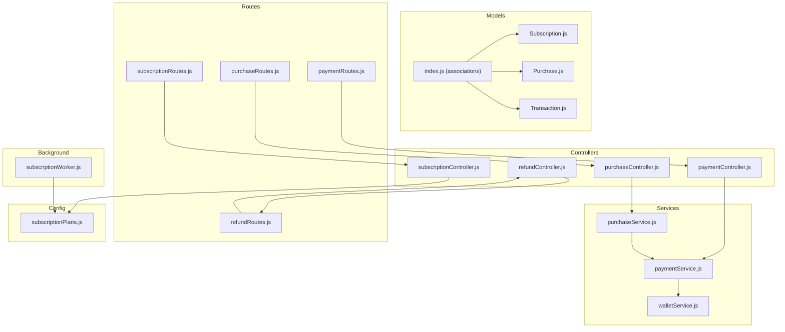
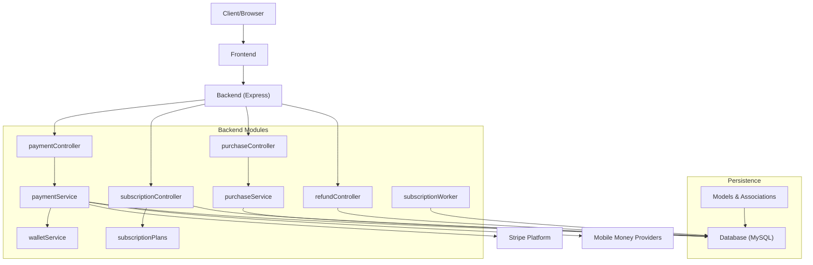
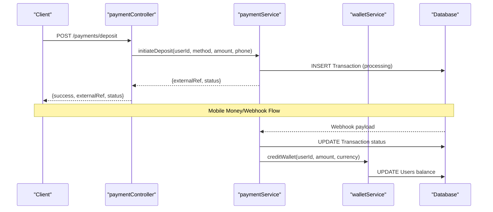
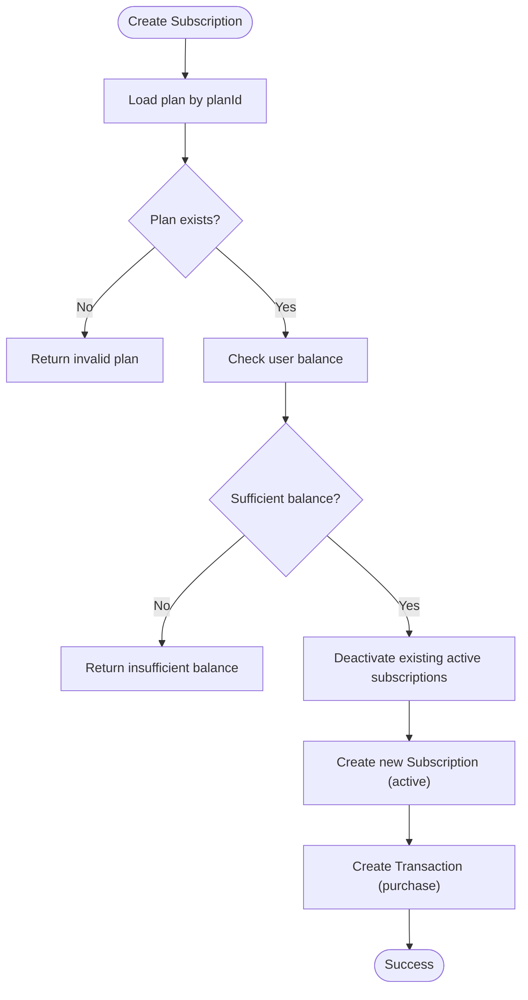
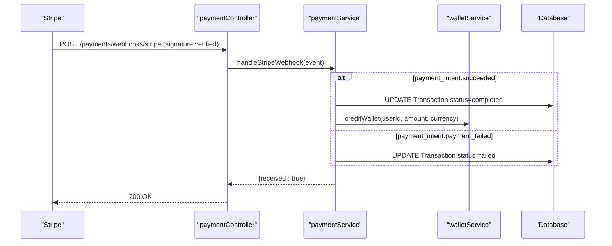
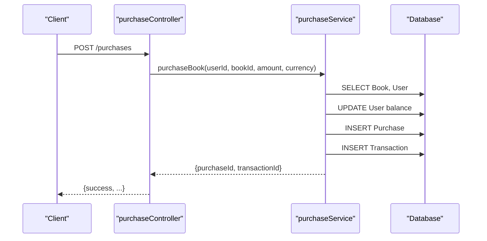
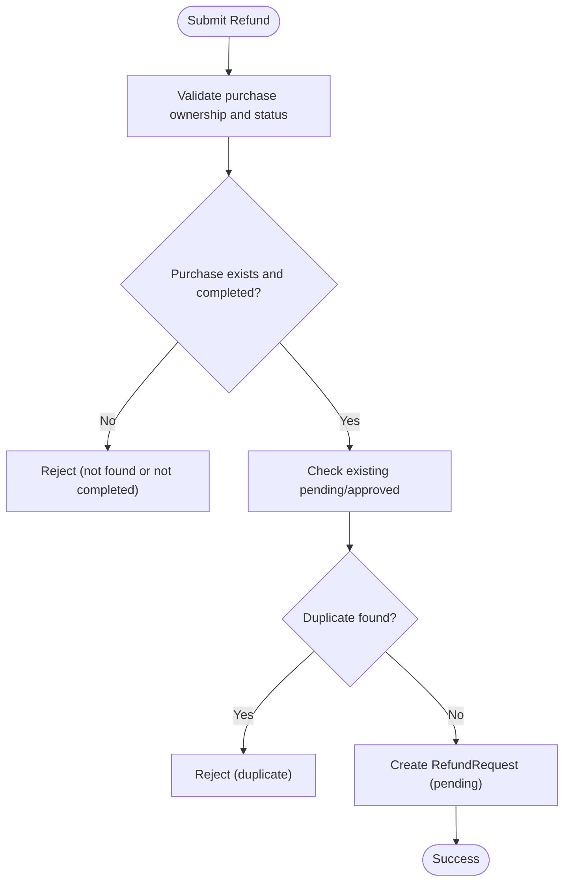
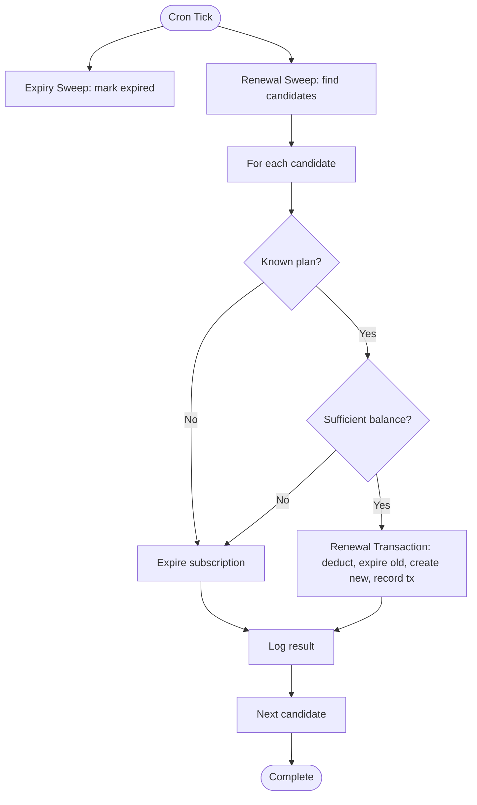
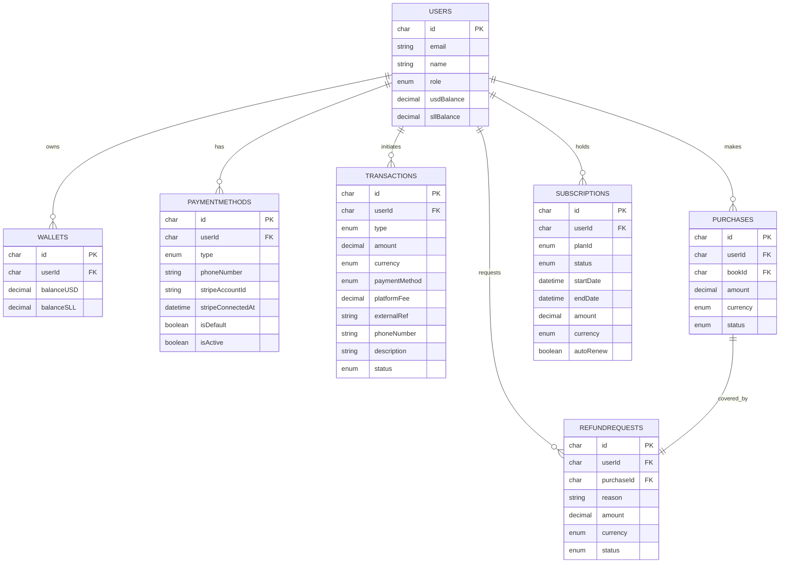
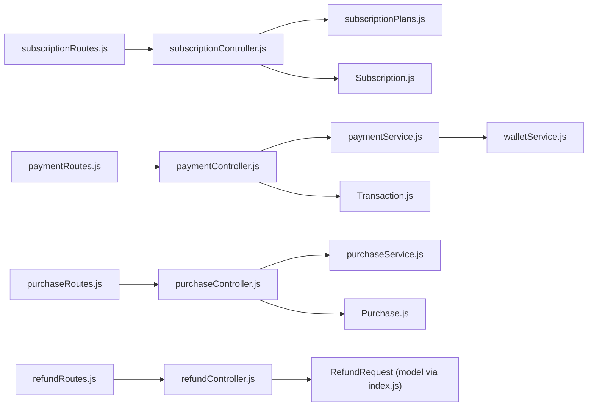

# Payment and Subscription System

<cite>
**Referenced Files in This Document**
- [paymentController.js](file://backend/controllers/paymentController.js)
- [subscriptionController.js](file://backend/controllers/subscriptionController.js)
- [purchaseController.js](file://backend/controllers/purchaseController.js)
- [refundController.js](file://backend/controllers/refundController.js)
- [paymentService.js](file://backend/services/paymentService.js)
- [purchaseService.js](file://backend/services/purchaseService.js)
- [walletService.js](file://backend/services/walletService.js)
- [subscriptionWorker.js](file://backend/workers/subscriptionWorker.js)
- [subscriptionPlans.js](file://backend/config/subscriptionPlans.js)
- [paymentRoutes.js](file://backend/routes/paymentRoutes.js)
- [subscriptionRoutes.js](file://backend/routes/subscriptionRoutes.js)
- [purchaseRoutes.js](file://backend/routes/purchaseRoutes.js)
- [refundRoutes.js](file://backend/routes/refundRoutes.js)
- [Subscription.js](file://backend/models/Subscription.js)
- [Purchase.js](file://backend/models/Purchase.js)
- [Transaction.js](file://backend/models/Transaction.js)
- [index.js](file://backend/models/index.js)
- [schema.sql](file://backend/schema.sql)
</cite>

## Table of Contents
1. [Introduction](#introduction)
2. [Project Structure](#project-structure)
3. [Core Components](#core-components)
4. [Architecture Overview](#architecture-overview)
5. [Detailed Component Analysis](#detailed-component-analysis)
6. [Dependency Analysis](#dependency-analysis)
7. [Performance Considerations](#performance-considerations)
8. [Troubleshooting Guide](#troubleshooting-guide)
9. [Conclusion](#conclusion)
10. [Appendices](#appendices)

## Introduction
This document describes the payment and subscription management system, focusing on:
- Billing engine implementation for deposits, withdrawals, purchases, and Stripe Connect
- Subscription lifecycle management and recurring billing automation
- Recurring payment processing with Stripe integration
- Purchase workflow, transaction handling, and refund processing
- Subscription worker for automated billing, failure handling, and status synchronization
- Financial reporting and revenue tracking foundations
- Implementation examples for subscription tiers, pricing models, and payment method handling

The system supports dual-currency wallets (USD and SLL), mobile money (Orange Money, Afrimoney, Qmoney), and Stripe Connect for payouts and card payments. It maintains audit trails via transaction records and enforces strict validation and atomicity for financial operations.

## Project Structure
The payment and subscription system spans controllers, services, models, routes, and a background worker:
- Controllers orchestrate HTTP endpoints and delegate to services
- Services encapsulate business logic for payments, purchases, wallets, and subscriptions
- Models define domain entities and associations
- Routes bind endpoints to controllers
- Worker automates subscription renewal and expiration checks

**Diagram sources**
- [paymentController.js:1-99](file://backend/controllers/paymentController.js#L1-L99)
- [subscriptionController.js:1-171](file://backend/controllers/subscriptionController.js#L1-L171)
- [purchaseController.js:1-13](file://backend/controllers/purchaseController.js#L1-L13)
- [refundController.js:1-145](file://backend/controllers/refundController.js#L1-L145)
- [paymentService.js:1-234](file://backend/services/paymentService.js#L1-L234)
- [purchaseService.js:1-68](file://backend/services/purchaseService.js#L1-L68)
- [walletService.js:1-80](file://backend/services/walletService.js#L1-L80)
- [subscriptionWorker.js:1-175](file://backend/workers/subscriptionWorker.js#L1-L175)
- [subscriptionPlans.js:1-21](file://backend/config/subscriptionPlans.js#L1-L21)
- [paymentRoutes.js:1-22](file://backend/routes/paymentRoutes.js#L1-L22)
- [subscriptionRoutes.js:1-18](file://backend/routes/subscriptionRoutes.js#L1-L18)
- [purchaseRoutes.js:1-10](file://backend/routes/purchaseRoutes.js#L1-L10)
- [refundRoutes.js:1-31](file://backend/routes/refundRoutes.js#L1-L31)
- [Subscription.js:1-46](file://backend/models/Subscription.js#L1-L46)
- [Purchase.js:1-26](file://backend/models/Purchase.js#L1-L26)
- [Transaction.js:1-54](file://backend/models/Transaction.js#L1-L54)
- [index.js:1-168](file://backend/models/index.js#L1-L168)

**Section sources**
- [paymentController.js:1-99](file://backend/controllers/paymentController.js#L1-L99)
- [subscriptionController.js:1-171](file://backend/controllers/subscriptionController.js#L1-L171)
- [purchaseController.js:1-13](file://backend/controllers/purchaseController.js#L1-L13)
- [refundController.js:1-145](file://backend/controllers/refundController.js#L1-L145)
- [paymentService.js:1-234](file://backend/services/paymentService.js#L1-L234)
- [purchaseService.js:1-68](file://backend/services/purchaseService.js#L1-L68)
- [walletService.js:1-80](file://backend/services/walletService.js#L1-L80)
- [subscriptionWorker.js:1-175](file://backend/workers/subscriptionWorker.js#L1-L175)
- [subscriptionPlans.js:1-21](file://backend/config/subscriptionPlans.js#L1-L21)
- [paymentRoutes.js:1-22](file://backend/routes/paymentRoutes.js#L1-L22)
- [subscriptionRoutes.js:1-18](file://backend/routes/subscriptionRoutes.js#L1-L18)
- [purchaseRoutes.js:1-10](file://backend/routes/purchaseRoutes.js#L1-L10)
- [refundRoutes.js:1-31](file://backend/routes/refundRoutes.js#L1-L31)
- [Subscription.js:1-46](file://backend/models/Subscription.js#L1-L46)
- [Purchase.js:1-26](file://backend/models/Purchase.js#L1-L26)
- [Transaction.js:1-54](file://backend/models/Transaction.js#L1-L54)
- [index.js:1-168](file://backend/models/index.js#L1-L168)

## Core Components
- Payment Controller: Handles deposit/withdrawal initiation, Stripe Connect OAuth, and webhooks for mobile money and Stripe
- Subscription Controller: Manages current subscription retrieval, creation, cancellation, and plan listing with live exchange rates
- Purchase Controller: Processes book purchases using wallet balances
- Refund Controller: Learner-facing refund request submission and retrieval
- Payment Service: Implements payment method validation, fee calculations, transaction creation, webhook handlers, and Stripe Connect helpers
- Purchase Service: Validates book and price, checks balances, and performs atomic purchase and transaction recording
- Wallet Service: Provides balance queries, transaction history, and atomic wallet crediting
- Subscription Worker: Cron-based automation for subscription expiration and auto-renewal
- Subscription Plans: Centralized plan definitions used by controllers and worker
- Routes: Endpoint definitions for payment, subscription, purchase, and refund operations
- Models: Domain models for Subscription, Purchase, Transaction, and associations
- Database Schema: Defines Users, Wallets, PaymentMethods, Transactions, Purchases, and related tables

**Section sources**
- [paymentController.js:1-99](file://backend/controllers/paymentController.js#L1-L99)
- [subscriptionController.js:1-171](file://backend/controllers/subscriptionController.js#L1-L171)
- [purchaseController.js:1-13](file://backend/controllers/purchaseController.js#L1-L13)
- [refundController.js:1-145](file://backend/controllers/refundController.js#L1-L145)
- [paymentService.js:1-234](file://backend/services/paymentService.js#L1-L234)
- [purchaseService.js:1-68](file://backend/services/purchaseService.js#L1-L68)
- [walletService.js:1-80](file://backend/services/walletService.js#L1-L80)
- [subscriptionWorker.js:1-175](file://backend/workers/subscriptionWorker.js#L1-L175)
- [subscriptionPlans.js:1-21](file://backend/config/subscriptionPlans.js#L1-L21)
- [paymentRoutes.js:1-22](file://backend/routes/paymentRoutes.js#L1-L22)
- [subscriptionRoutes.js:1-18](file://backend/routes/subscriptionRoutes.js#L1-L18)
- [purchaseRoutes.js:1-10](file://backend/routes/purchaseRoutes.js#L1-L10)
- [refundRoutes.js:1-31](file://backend/routes/refundRoutes.js#L1-L31)
- [Subscription.js:1-46](file://backend/models/Subscription.js#L1-L46)
- [Purchase.js:1-26](file://backend/models/Purchase.js#L1-L26)
- [Transaction.js:1-54](file://backend/models/Transaction.js#L1-L54)
- [schema.sql:1-132](file://backend/schema.sql#L1-L132)

## Architecture Overview
The system integrates multiple payment channels and currencies with robust webhook-driven reconciliation and a dedicated worker for recurring billing.

**Diagram sources**
- [paymentController.js:1-99](file://backend/controllers/paymentController.js#L1-L99)
- [subscriptionController.js:1-171](file://backend/controllers/subscriptionController.js#L1-L171)
- [purchaseController.js:1-13](file://backend/controllers/purchaseController.js#L1-L13)
- [refundController.js:1-145](file://backend/controllers/refundController.js#L1-L145)
- [paymentService.js:1-234](file://backend/services/paymentService.js#L1-L234)
- [purchaseService.js:1-68](file://backend/services/purchaseService.js#L1-L68)
- [walletService.js:1-80](file://backend/services/walletService.js#L1-L80)
- [subscriptionWorker.js:1-175](file://backend/workers/subscriptionWorker.js#L1-L175)
- [subscriptionPlans.js:1-21](file://backend/config/subscriptionPlans.js#L1-L21)
- [schema.sql:1-132](file://backend/schema.sql#L1-L132)
- [index.js:1-168](file://backend/models/index.js#L1-L168)

## Detailed Component Analysis

### Payment Controller and Services
- Deposit initiation validates method and amount, constructs external references, and records transactions
- Withdrawal initiation validates balances and methods, applies fees, debits wallets, and records transactions
- Mobile money webhooks update transaction statuses and credit wallets upon success
- Stripe webhooks update transaction statuses and credit wallets upon payment intent success
- Stripe Connect OAuth initializes authorization URLs, validates callbacks, and persists connected accounts

**Diagram sources**
- [paymentController.js:17-33](file://backend/controllers/paymentController.js#L17-L33)
- [paymentService.js:53-85](file://backend/services/paymentService.js#L53-L85)
- [paymentService.js:149-166](file://backend/services/paymentService.js#L149-L166)
- [walletService.js:64-80](file://backend/services/walletService.js#L64-L80)

**Section sources**
- [paymentController.js:1-99](file://backend/controllers/paymentController.js#L1-L99)
- [paymentService.js:1-234](file://backend/services/paymentService.js#L1-L234)
- [walletService.js:1-80](file://backend/services/walletService.js#L1-L80)

### Subscription Lifecycle Management
- Current subscription retrieval checks active status and expiration, updating status to expired if past end date
- Subscription creation validates plan, checks user balance, deactivates existing active subscriptions, creates new subscription, and records a transaction
- Subscription cancellation toggles auto-renew off and sets status to cancelled
- Plan listing returns canonical SLL prices and live USD conversions

**Diagram sources**
- [subscriptionController.js:34-109](file://backend/controllers/subscriptionController.js#L34-L109)
- [subscriptionPlans.js:13-18](file://backend/config/subscriptionPlans.js#L13-L18)

**Section sources**
- [subscriptionController.js:1-171](file://backend/controllers/subscriptionController.js#L1-L171)
- [subscriptionPlans.js:1-21](file://backend/config/subscriptionPlans.js#L1-L21)

### Recurring Payment Processing with Stripe
- Stripe webhooks handle payment intent success/failure, updating transaction status and crediting wallets on success
- Stripe Connect OAuth flow stores Stripe account IDs for payouts

**Diagram sources**
- [paymentController.js:74-98](file://backend/controllers/paymentController.js#L74-L98)
- [paymentService.js:168-185](file://backend/services/paymentService.js#L168-L185)
- [walletService.js:64-80](file://backend/services/walletService.js#L64-L80)

**Section sources**
- [paymentController.js:74-98](file://backend/controllers/paymentController.js#L74-L98)
- [paymentService.js:168-185](file://backend/services/paymentService.js#L168-L185)

### Purchase Workflow and Transaction Handling
- Purchase controller delegates to purchase service
- Purchase service validates book existence and price against currency, checks user balance, and performs atomic updates for deduction, purchase creation, and transaction recording

**Diagram sources**
- [purchaseController.js:7-12](file://backend/controllers/purchaseController.js#L7-L12)
- [purchaseService.js:4-67](file://backend/services/purchaseService.js#L4-L67)

**Section sources**
- [purchaseController.js:1-13](file://backend/controllers/purchaseController.js#L1-L13)
- [purchaseService.js:1-68](file://backend/services/purchaseService.js#L1-L68)

### Refund Processing System
- Learners submit refund requests for completed purchases with a reason
- Duplicate pending/approved requests are prevented
- Requests are retrievable by the requester

**Diagram sources**
- [refundController.js:25-87](file://backend/controllers/refundController.js#L25-L87)

**Section sources**
- [refundController.js:1-145](file://backend/controllers/refundController.js#L1-L145)

### Subscription Worker for Automated Billing
- Hourly expiry sweep: marks active, non-auto-renew subscriptions past end date as expired
- Hourly renewal sweep: finds subscriptions expiring within the next hour with autoRenew enabled, attempts renewal, and logs outcomes
- Uses centralized plan definitions and atomic database transactions for renewal

**Diagram sources**
- [subscriptionWorker.js:97-172](file://backend/workers/subscriptionWorker.js#L97-L172)
- [subscriptionWorker.js:17-89](file://backend/workers/subscriptionWorker.js#L17-L89)
- [subscriptionPlans.js:13-18](file://backend/config/subscriptionPlans.js#L13-L18)

**Section sources**
- [subscriptionWorker.js:1-175](file://backend/workers/subscriptionWorker.js#L1-L175)
- [subscriptionPlans.js:1-21](file://backend/config/subscriptionPlans.js#L1-L21)

### Financial Reporting and Revenue Tracking
- Transaction records capture all financial events with amounts, currencies, fees, and statuses
- Wallets maintain dual-currency balances per user
- Exchange rate service provides live SLL-to-USD conversions for display and reporting
- Associations tie Users, Purchases, RefundRequests, Subscriptions, and Transactions

**Diagram sources**
- [schema.sql:7-132](file://backend/schema.sql#L7-L132)
- [index.js:45-167](file://backend/models/index.js#L45-L167)

**Section sources**
- [schema.sql:1-132](file://backend/schema.sql#L1-L132)
- [index.js:1-168](file://backend/models/index.js#L1-L168)

### Implementation Examples
- Subscription tiers and pricing models:
  - 12 hours, 24 hours, 7 days, 30 days with USD and SLL prices and durations
- Payment method handling:
  - Mobile money (Orange Money, Afrimoney, Qmoney): requires phone number, minimal/max limits, zero fees in this implementation
  - Stripe: card payments with percentage + fixed fee for deposits and percentage fee for withdrawals
- Wallet and transaction handling:
  - Atomic balance updates via SQL increments
  - Transaction records track type, amount, currency, platform fee, external reference, and status

**Section sources**
- [subscriptionPlans.js:13-18](file://backend/config/subscriptionPlans.js#L13-L18)
- [paymentService.js:5-10](file://backend/services/paymentService.js#L5-L10)
- [paymentService.js:21-37](file://backend/services/paymentService.js#L21-L37)
- [walletService.js:64-80](file://backend/services/walletService.js#L64-L80)
- [Transaction.js:1-54](file://backend/models/Transaction.js#L1-L54)

## Dependency Analysis
- Controllers depend on services for business logic
- Services depend on models and database connections
- Worker depends on models and plan definitions
- Routes bind endpoints to controllers
- Models define associations used by controllers and services

**Diagram sources**
- [paymentRoutes.js:1-22](file://backend/routes/paymentRoutes.js#L1-L22)
- [subscriptionRoutes.js:1-18](file://backend/routes/subscriptionRoutes.js#L1-L18)
- [purchaseRoutes.js:1-10](file://backend/routes/purchaseRoutes.js#L1-L10)
- [refundRoutes.js:1-31](file://backend/routes/refundRoutes.js#L1-L31)
- [paymentController.js:1-99](file://backend/controllers/paymentController.js#L1-L99)
- [subscriptionController.js:1-171](file://backend/controllers/subscriptionController.js#L1-L171)
- [purchaseController.js:1-13](file://backend/controllers/purchaseController.js#L1-L13)
- [refundController.js:1-145](file://backend/controllers/refundController.js#L1-L145)
- [paymentService.js:1-234](file://backend/services/paymentService.js#L1-L234)
- [purchaseService.js:1-68](file://backend/services/purchaseService.js#L1-L68)
- [walletService.js:1-80](file://backend/services/walletService.js#L1-L80)
- [subscriptionPlans.js:1-21](file://backend/config/subscriptionPlans.js#L1-L21)
- [Subscription.js:1-46](file://backend/models/Subscription.js#L1-L46)
- [Purchase.js:1-26](file://backend/models/Purchase.js#L1-L26)
- [Transaction.js:1-54](file://backend/models/Transaction.js#L1-L54)
- [index.js:1-168](file://backend/models/index.js#L1-L168)

**Section sources**
- [index.js:1-168](file://backend/models/index.js#L1-L168)

## Performance Considerations
- Use database transactions for all financial operations to ensure atomicity
- Prefer direct SQL updates for balance increments to avoid race conditions
- Validate inputs early in controllers/services to reduce database round trips
- Keep webhook handlers idempotent and rely on external references to deduplicate events
- Schedule subscription worker tasks at off-peak intervals to minimize load spikes

## Troubleshooting Guide
- Stripe webhook verification failures:
  - Ensure webhook secret is configured and signature header is present
  - Verify endpoint accepts raw JSON body
- Mobile money webhook validation:
  - Confirm webhook secret header matches environment configuration
- Insufficient balance during subscription renewal:
  - Worker logs warnings and expires subscription; notify users accordingly
- Stripe Connect callback:
  - In production, ensure stubbed callback is explicitly allowed; otherwise reject unauthorized callbacks

**Section sources**
- [paymentController.js:74-98](file://backend/controllers/paymentController.js#L74-L98)
- [paymentController.js:59-72](file://backend/controllers/paymentController.js#L59-L72)
- [subscriptionWorker.js:17-89](file://backend/workers/subscriptionWorker.js#L17-L89)

## Conclusion
The payment and subscription system provides a robust, multi-channel payment infrastructure with strong validation, atomic financial operations, and automated recurring billing. It supports learners and sellers across currencies and payment methods while maintaining comprehensive auditability through transaction records and associations.

## Appendices
- Endpoint summaries:
  - Payments: deposit, withdraw, Stripe Connect OAuth, webhooks
  - Subscriptions: plans, current, create, cancel, history
  - Purchases: book purchase
  - Refunds: submit, list, detail

**Section sources**
- [paymentRoutes.js:1-22](file://backend/routes/paymentRoutes.js#L1-L22)
- [subscriptionRoutes.js:1-18](file://backend/routes/subscriptionRoutes.js#L1-L18)
- [purchaseRoutes.js:1-10](file://backend/routes/purchaseRoutes.js#L1-L10)
- [refundRoutes.js:1-31](file://backend/routes/refundRoutes.js#L1-L31)