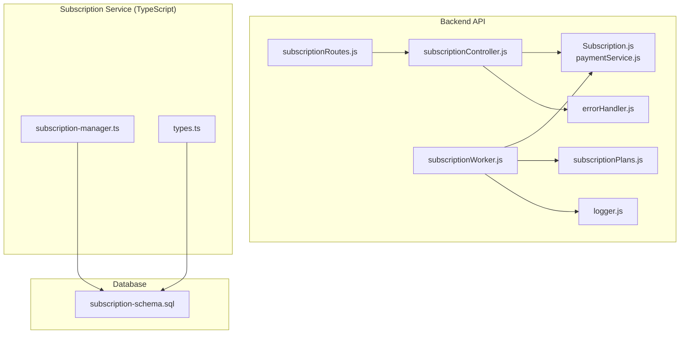
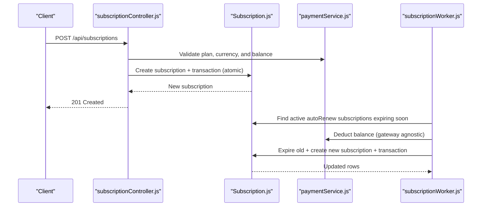
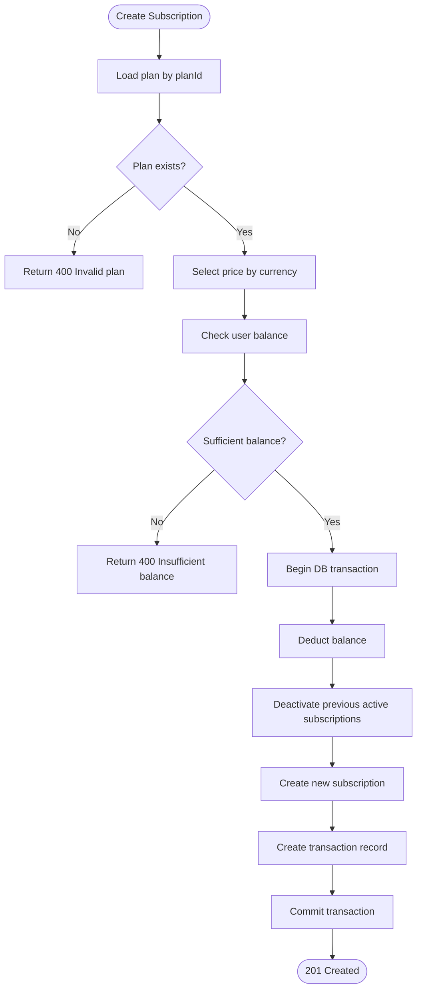
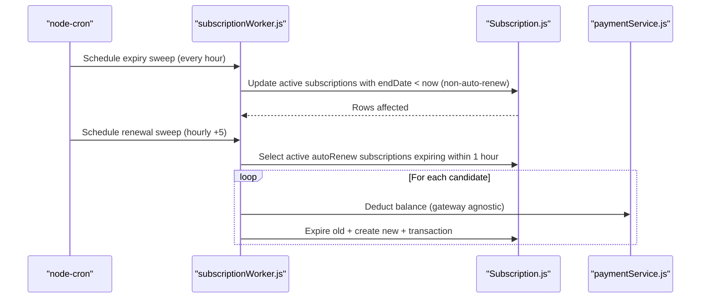
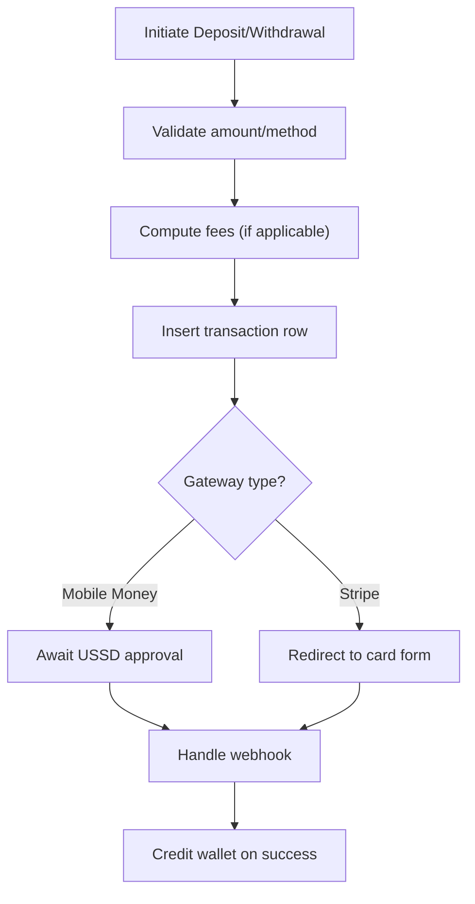
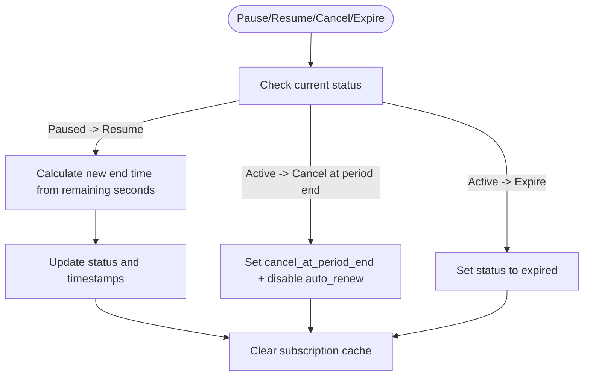
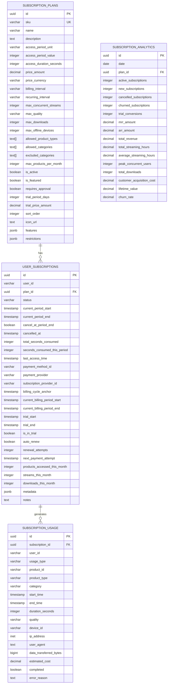
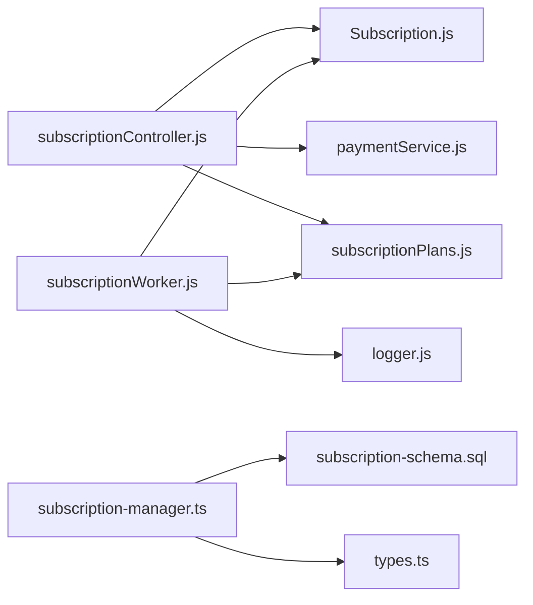

# Subscription Lifecycle and Automation

<cite>
**Referenced Files in This Document**
- [subscriptionController.js](file://backend/controllers/subscriptionController.js)
- [subscriptionWorker.js](file://backend/workers/subscriptionWorker.js)
- [subscriptionRoutes.js](file://backend/routes/subscriptionRoutes.js)
- [subscriptionPlans.js](file://backend/config/subscriptionPlans.js)
- [Subscription.js](file://backend/models/Subscription.js)
- [paymentService.js](file://backend/services/paymentService.js)
- [logger.js](file://backend/utils/logger.js)
- [errorHandler.js](file://backend/middleware/errorHandler.js)
- [subscription-schema.sql](file://database/subscription-schema.sql)
- [subscriptionManager.ts](file://services/subscription/src/subscription-manager.ts)
- [types.ts](file://services/subscription/src/types.ts)
- [emailAutomation.js](file://services/shared/middleware/emailAutomation.js)
- [emailService.js](file://services/shared/emailService.js)
</cite>

## Table of Contents
1. [Introduction](#introduction)
2. [Project Structure](#project-structure)
3. [Core Components](#core-components)
4. [Architecture Overview](#architecture-overview)
5. [Detailed Component Analysis](#detailed-component-analysis)
6. [Dependency Analysis](#dependency-analysis)
7. [Performance Considerations](#performance-considerations)
8. [Troubleshooting Guide](#troubleshooting-guide)
9. [Conclusion](#conclusion)
10. [Appendices](#appendices)

## Introduction
This document explains the subscription lifecycle management and automated billing system across the backend and a complementary TypeScript subscription service. It covers:
- Scheduled billing and renewal processing via a worker
- Subscription controller actions for creating, cancelling, and querying subscriptions
- Automated billing mechanics, including payment retry logic, grace periods, and suspension/cancellation workflows
- Subscription plan configurations, pricing tiers, and feature access controls
- Examples of state transitions, renewal notifications, and automated cleanup
- Worker scheduling, error handling for failed payments, and subscription analytics tracking

## Project Structure
The subscription system spans multiple layers:
- Backend API (Express) with controllers, routes, models, and workers
- Subscription plan configuration
- Payment service supporting multiple gateways
- A separate subscription service (TypeScript) implementing advanced lifecycle features
- Database schemas for analytics and usage tracking

**Diagram sources**
- [subscriptionRoutes.js:1-18](file://backend/routes/subscriptionRoutes.js#L1-L18)
- [subscriptionController.js:1-171](file://backend/controllers/subscriptionController.js#L1-L171)
- [subscriptionWorker.js:1-175](file://backend/workers/subscriptionWorker.js#L1-L175)
- [Subscription.js:1-46](file://backend/models/Subscription.js#L1-L46)
- [subscriptionPlans.js:1-21](file://backend/config/subscriptionPlans.js#L1-L21)
- [paymentService.js:1-234](file://backend/services/paymentService.js#L1-L234)
- [subscription-manager.ts:348-542](file://services/subscription/src/subscription-manager.ts#L348-L542)
- [subscription-schema.sql:1-644](file://database/subscription-schema.sql#L1-L644)

**Section sources**
- [subscriptionRoutes.js:1-18](file://backend/routes/subscriptionRoutes.js#L1-L18)
- [subscriptionController.js:1-171](file://backend/controllers/subscriptionController.js#L1-L171)
- [subscriptionWorker.js:1-175](file://backend/workers/subscriptionWorker.js#L1-L175)
- [subscriptionPlans.js:1-21](file://backend/config/subscriptionPlans.js#L1-L21)
- [Subscription.js:1-46](file://backend/models/Subscription.js#L1-L46)
- [paymentService.js:1-234](file://backend/services/paymentService.js#L1-L234)
- [subscription-manager.ts:348-542](file://services/subscription/src/subscription-manager.ts#L348-L542)
- [subscription-schema.sql:1-644](file://database/subscription-schema.sql#L1-L644)

## Core Components
- Subscription Controller: Handles current subscription retrieval, creation, cancellation, and history queries. Enforces plan validity, currency, and user balance checks before creating subscriptions.
- Subscription Worker: Runs periodic tasks to expire stale subscriptions and attempt auto-renewals within a defined window. Deducts balances and updates records atomically.
- Subscription Model: Defines schema for subscriptions with status, dates, amounts, currency, and auto-renew flag.
- Subscription Plans: Centralized pricing and duration definitions used by both controller and worker.
- Payment Service: Manages gateway-specific validations, fees, and webhook handling for deposits and withdrawals.
- Subscription Manager (TypeScript): Advanced lifecycle management including pause/resume, cancellation at period end, and expiration logic.
- Database Schema: Provides analytics, invoices, coupons, access logs, and usage tracking for deeper insights.

**Section sources**
- [subscriptionController.js:7-171](file://backend/controllers/subscriptionController.js#L7-L171)
- [subscriptionWorker.js:17-175](file://backend/workers/subscriptionWorker.js#L17-L175)
- [Subscription.js:4-46](file://backend/models/Subscription.js#L4-L46)
- [subscriptionPlans.js:13-21](file://backend/config/subscriptionPlans.js#L13-L21)
- [paymentService.js:5-234](file://backend/services/paymentService.js#L5-L234)
- [subscription-manager.ts:348-542](file://services/subscription/src/subscription-manager.ts#L348-L542)
- [subscription-schema.sql:17-364](file://database/subscription-schema.sql#L17-L364)

## Architecture Overview
The system integrates a backend worker with a subscription service to manage time-based access, recurring billing, and analytics.

**Diagram sources**
- [subscriptionController.js:34-109](file://backend/controllers/subscriptionController.js#L34-L109)
- [Subscription.js:4-46](file://backend/models/Subscription.js#L4-L46)
- [paymentService.js:53-85](file://backend/services/paymentService.js#L53-L85)
- [subscriptionWorker.js:17-89](file://backend/workers/subscriptionWorker.js#L17-L89)

## Detailed Component Analysis

### Subscription Controller
Responsibilities:
- Retrieve current active subscription and expire stale ones
- Create subscriptions with plan validation, currency selection, and balance checks
- Cancel subscriptions by disabling auto-renew and marking status as cancelled
- Fetch subscription history
- Expose plans with live exchange rates

Key behaviors:
- Uses centralized plan definitions to compute price and duration
- Performs atomic updates for balance deduction, status change, and transaction logging
- Returns canonical SLL prices and live USD conversions for public consumption

**Diagram sources**
- [subscriptionController.js:34-98](file://backend/controllers/subscriptionController.js#L34-L98)

**Section sources**
- [subscriptionController.js:7-171](file://backend/controllers/subscriptionController.js#L7-L171)
- [subscriptionPlans.js:13-21](file://backend/config/subscriptionPlans.js#L13-L21)

### Subscription Worker
Responsibilities:
- Periodic expiry sweep: mark active, non-auto-renew subscriptions as expired when past end date
- Auto-renewal sweep: attempt renewal for subscriptions ending within a defined window
- Atomic renewal: balance deduction, old subscription expiry, new subscription creation, and transaction recording

Scheduling:
- Expiry sweep runs hourly
- Renewal sweep runs hourly, 5 minutes after expiry sweep

Failure handling:
- Logs errors during renewal attempts
- Marks subscriptions as expired on insufficient funds or unknown plan/user

**Diagram sources**
- [subscriptionWorker.js:97-172](file://backend/workers/subscriptionWorker.js#L97-L172)
- [Subscription.js:4-46](file://backend/models/Subscription.js#L4-L46)
- [paymentService.js:53-85](file://backend/services/paymentService.js#L53-L85)

**Section sources**
- [subscriptionWorker.js:17-175](file://backend/workers/subscriptionWorker.js#L17-L175)
- [logger.js:21-31](file://backend/utils/logger.js#L21-L31)

### Subscription Model and Plans
Model highlights:
- Enumerated statuses: active, expired, cancelled
- Enumerated plan IDs aligned with backend plan definitions
- Currency and amount fields
- Auto-renew flag for automation

Plan configuration:
- Canonical SLL prices and USD equivalents
- Duration in hours per plan
- Shared source of truth for controller and worker

**Section sources**
- [Subscription.js:4-46](file://backend/models/Subscription.js#L4-L46)
- [subscriptionPlans.js:13-21](file://backend/config/subscriptionPlans.js#L13-L21)

### Payment Service Integration
Mechanics:
- Validates amounts against method-specific min/max thresholds
- Computes fees for Stripe deposits/withdrawals
- Creates transactions and supports webhooks for mobile money and Stripe
- Credits wallet on successful deposit

**Diagram sources**
- [paymentService.js:53-185](file://backend/services/paymentService.js#L53-L185)

**Section sources**
- [paymentService.js:1-234](file://backend/services/paymentService.js#L1-L234)

### Subscription Service (Advanced Lifecycle)
The TypeScript subscription manager provides:
- Pause/resume with remaining seconds preservation
- Cancellation at period end while preserving current period
- Expiration logic and cache invalidation
- End-time calculation based on plan durations

**Diagram sources**
- [subscription-manager.ts:354-390](file://services/subscription/src/subscription-manager.ts#L354-L390)
- [subscription-manager.ts:470-487](file://services/subscription/src/subscription-manager.ts#L470-L487)
- [subscription-manager.ts:523-531](file://services/subscription/src/subscription-manager.ts#L523-L531)

**Section sources**
- [subscription-manager.ts:348-542](file://services/subscription/src/subscription-manager.ts#L348-L542)
- [types.ts:41-87](file://services/subscription/src/types.ts#L41-L87)

### Database Schema and Analytics
The schema supports:
- Subscription plans with access periods, pricing, and feature sets
- User subscriptions with status, billing cycles, and usage metrics
- Usage tracking, invoices, coupons, access logs, and analytics tables
- Triggers to auto-calculate durations and update timestamps

**Diagram sources**
- [subscription-schema.sql:18-364](file://database/subscription-schema.sql#L18-L364)

**Section sources**
- [subscription-schema.sql:1-644](file://database/subscription-schema.sql#L1-L644)

## Dependency Analysis
- Controller depends on:
  - Subscription model for persistence
  - Payment service for balance and transaction handling
  - Exchange rate service for plan pricing exposure
- Worker depends on:
  - Subscription model and plans for renewal logic
  - Logger for operational visibility
- Subscription Manager depends on:
  - Database schema for lifecycle operations
  - Types for strong typing of entities

**Diagram sources**
- [subscriptionController.js:1-6](file://backend/controllers/subscriptionController.js#L1-L6)
- [subscriptionWorker.js:1-6](file://backend/workers/subscriptionWorker.js#L1-L6)
- [subscription-manager.ts:1-20](file://services/subscription/src/subscription-manager.ts#L1-L20)

**Section sources**
- [subscriptionController.js:1-6](file://backend/controllers/subscriptionController.js#L1-L6)
- [subscriptionWorker.js:1-6](file://backend/workers/subscriptionWorker.js#L1-L6)
- [subscription-manager.ts:1-20](file://services/subscription/src/subscription-manager.ts#L1-L20)

## Performance Considerations
- Worker scheduling: Hourly expiry and renewal sweeps minimize unnecessary scans; renewal window reduces redundant attempts.
- Atomic operations: Controller and worker use database transactions to prevent inconsistent states.
- Logging: Structured logs with Winston aid in diagnosing slow paths and failures.
- Database indexing: Schema includes indexes on frequently queried fields (status, period end, plan id) to optimize scans.

[No sources needed since this section provides general guidance]

## Troubleshooting Guide
Common issues and resolutions:
- Insufficient balance during renewal:
  - Worker marks subscription as expired and logs the event; consider low-balance notifications via email automation.
- Unknown plan ID:
  - Worker expires the subscription and logs a warning; ensure plan definitions are synchronized.
- Transaction failures:
  - Worker logs errors and throws; investigate underlying database connectivity or constraint violations.
- Frontend errors:
  - Centralized error handler returns structured messages and attaches correlation IDs for tracing.

Operational checks:
- Verify worker schedules are active and logs show periodic sweeps.
- Confirm plan definitions match controller and worker usage.
- Ensure payment webhooks are configured to credit wallets and update transactions.

**Section sources**
- [subscriptionWorker.js:17-89](file://backend/workers/subscriptionWorker.js#L17-L89)
- [errorHandler.js:5-41](file://backend/middleware/errorHandler.js#L5-L41)
- [emailAutomation.js:116-193](file://services/shared/middleware/emailAutomation.js#L116-L193)

## Conclusion
The subscription system combines a robust backend controller and worker with a comprehensive database schema and a feature-rich TypeScript subscription manager. It automates billing, enforces grace periods, and tracks analytics, while providing clear state transitions and extensible plan configurations. Operational reliability is ensured through atomic transactions, structured logging, and centralized error handling.

[No sources needed since this section summarizes without analyzing specific files]

## Appendices

### Subscription State Transitions
- Creation: active (with end date derived from plan duration)
- Renewal: expire old, create new active subscription
- Expiry: non-auto-renew subscriptions become expired at end date
- Cancellation: auto-renew disabled, status updated; cancellation at period end supported by subscription manager

**Section sources**
- [subscriptionController.js:34-109](file://backend/controllers/subscriptionController.js#L34-L109)
- [subscriptionWorker.js:17-89](file://backend/workers/subscriptionWorker.js#L17-L89)
- [subscription-manager.ts:470-487](file://services/subscription/src/subscription-manager.ts#L470-L487)

### Automated Billing and Cleanup Examples
- Renewal notifications: Worker logs renewal outcomes; integrate email automation for user notifications.
- Grace period: Implemented implicitly by allowing renewal attempts only within the defined window; consider adding pre-expiry notices.
- Cleanup: Hourly expiry sweep removes stale non-auto-renew subscriptions.

**Section sources**
- [subscriptionWorker.js:97-172](file://backend/workers/subscriptionWorker.js#L97-L172)
- [emailAutomation.js:116-193](file://services/shared/middleware/emailAutomation.js#L116-L193)

### Subscription Analytics Tracking
- Analytics table aggregates daily metrics by plan (active, new, cancelled, churned, revenue).
- Usage tracking captures streams, downloads, and costs for monetization insights.

**Section sources**
- [subscription-schema.sql:328-364](file://database/subscription-schema.sql#L328-L364)