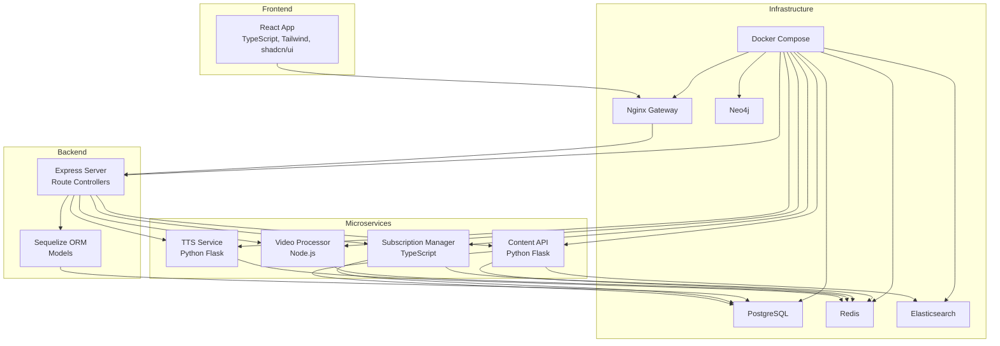
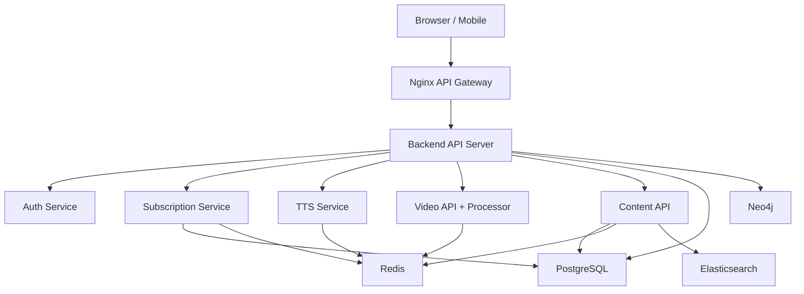
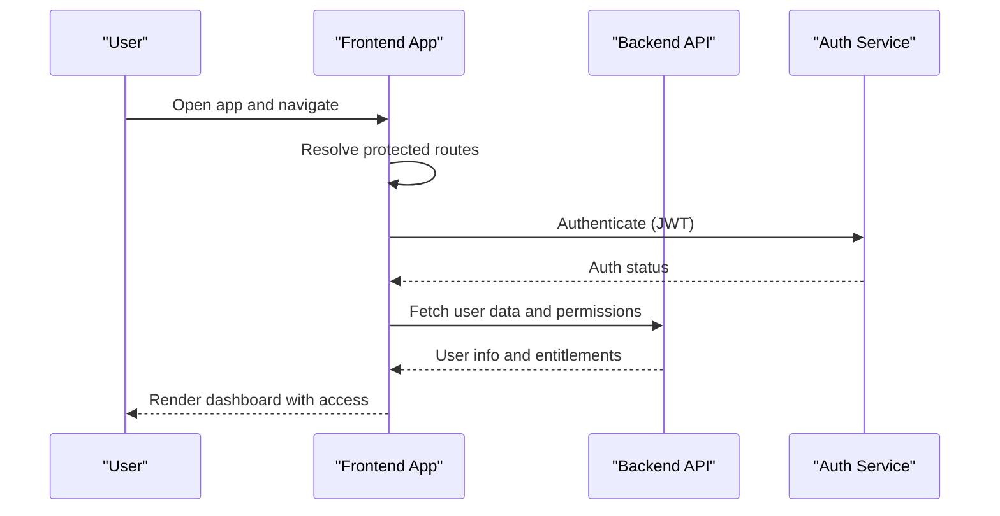
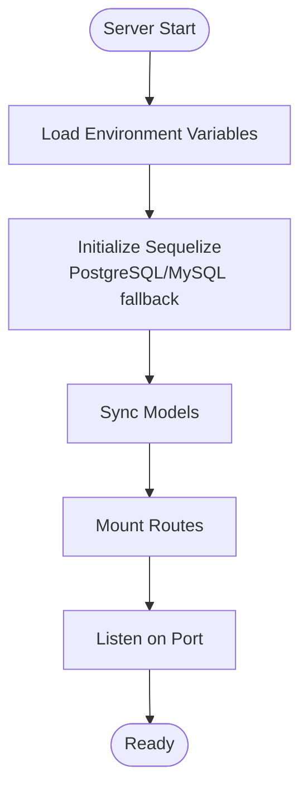
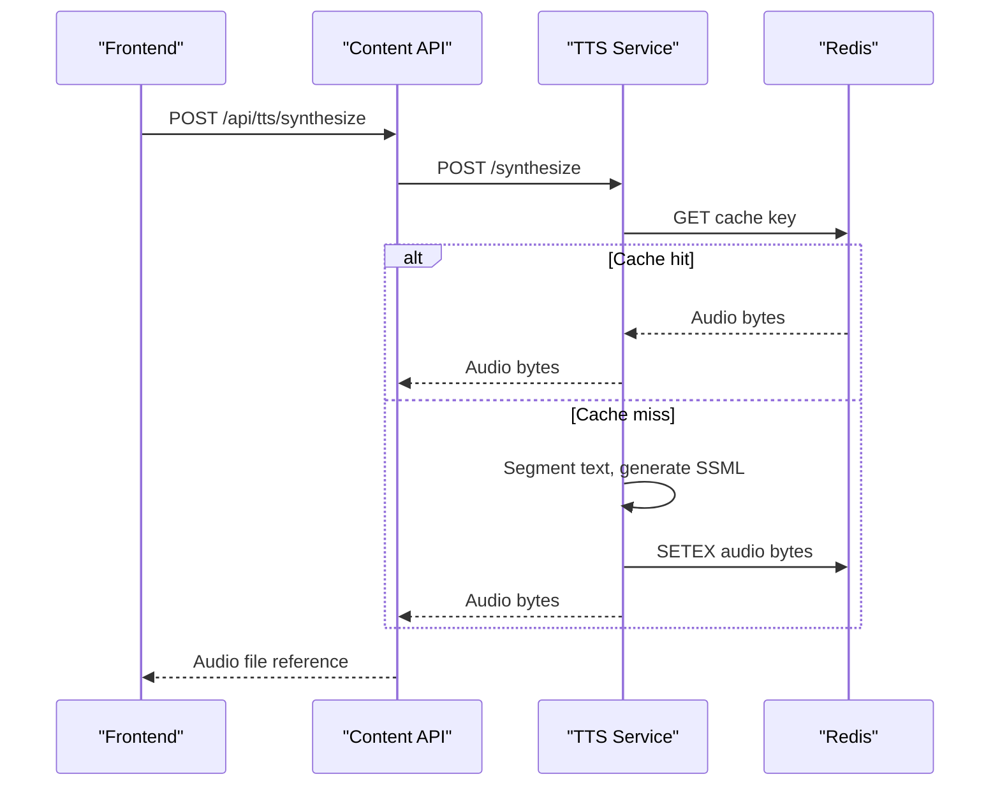
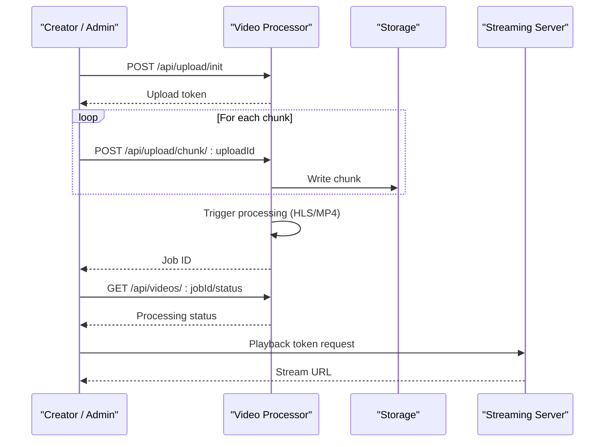
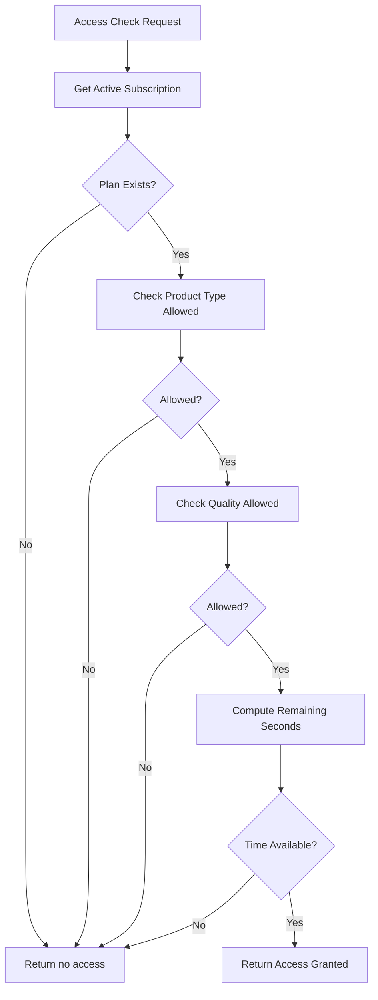
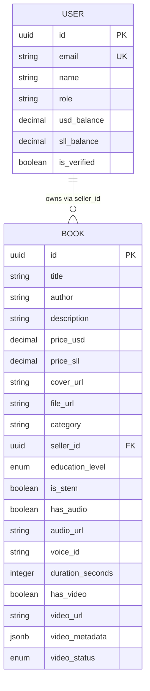
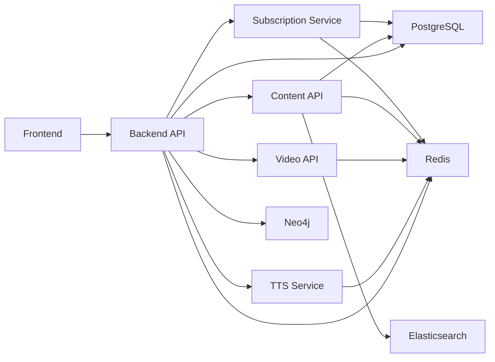

# Project Overview

<cite>
**Referenced Files in This Document**
- [docs/README.md](file://docs/README.md)
- [FINAL_PLATFORM_SUMMARY.md](file://FINAL_PLATFORM_SUMMARY.md)
- [EDUCATIONAL_PLATFORM_SUMMARY.md](file://EDUCATIONAL_PLATFORM_SUMMARY.md)
- [docs/DEPLOYMENT.md](file://docs/DEPLOYMENT.md)
- [docs/PAYMENT_SYSTEMS.md](file://docs/PAYMENT_SYSTEMS.md)
- [backend/server.js](file://backend/server.js)
- [backend/package.json](file://backend/package.json)
- [frontend/src/App.tsx](file://frontend/src/App.tsx)
- [frontend/package.json](file://frontend/package.json)
- [infrastructure/docker-compose.yml](file://infrastructure/docker-compose.yml)
- [services/tts/python/server.py](file://services/tts/python/server.py)
- [services/video/processor/server.js](file://services/video/processor/server.js)
- [services/content/api/app.py](file://services/content/api/app.py)
- [services/subscription/src/subscription-manager.ts](file://services/subscription/src/subscription-manager.ts)
- [backend/models/Book.js](file://backend/models/Book.js)
- [backend/models/User.js](file://backend/models/User.js)
</cite>

## Table of Contents
1. [Introduction](#introduction)
2. [Project Structure](#project-structure)
3. [Core Components](#core-components)
4. [Architecture Overview](#architecture-overview)
5. [Detailed Component Analysis](#detailed-component-analysis)
6. [Dependency Analysis](#dependency-analysis)
7. [Performance Considerations](#performance-considerations)
8. [Troubleshooting Guide](#troubleshooting-guide)
9. [Conclusion](#conclusion)
10. [Appendices](#appendices)

## Introduction
QuantumMint Bookstore is an integrated educational ecosystem that unifies digital books, interactive readers, AI-powered text-to-speech (TTS) for scientific content, video processing, and creator monetization tools. It targets learners, educators, and creators with a focus on immersive, synchronized learning experiences and flexible payment systems. The platform emphasizes STEM-aware TTS, dynamic formula rendering, adaptive playback, and scalable microservices architecture.

Core value proposition:
- Immersive learning with synchronized audio, visual cues, and interactive content
- AI-powered narration that intelligently handles LaTeX math and chemistry formulas
- Flexible, multi-region payment options optimized for Sierra Leone and international users
- Creator tools for content management, monetization, and analytics
- Developer-friendly microservices and containerized deployment

Target audiences:
- Learners: Students and self-learners seeking synchronized, adaptive educational content
- Educators: Institutions and tutors leveraging analytics and structured content
- Creators: Authors and publishers uploading, managing, and monetizing STEM-focused content

Key differentiators:
- STEM-aware TTS and visual sync engine
- PayGO billing with per-minute usage tracking
- Multi-service architecture with dedicated TTS, video, formula, and knowledge graph services
- Comprehensive creator and admin dashboards

**Section sources**
- [docs/README.md:1-65](file://docs/README.md#L1-L65)
- [FINAL_PLATFORM_SUMMARY.md:3-336](file://FINAL_PLATFORM_SUMMARY.md#L3-L336)
- [EDUCATIONAL_PLATFORM_SUMMARY.md:1-268](file://EDUCATIONAL_PLATFORM_SUMMARY.md#L1-L268)

## Project Structure
The repository is organized into frontend, backend, microservices, infrastructure, and supporting documentation. Key areas:
- frontend: React 19 with TypeScript, modern UI libraries, and real-time features
- backend: Express server with route-driven controllers and Sequelize ORM
- services: Microservices for TTS, video processing, content management, formula parsing, knowledge graph, analytics, and subscriptions
- infrastructure: Docker Compose for orchestrated deployment and monitoring
- docs: Deployment, payment systems, and integration guides

**Diagram sources**
- [infrastructure/docker-compose.yml:1-373](file://infrastructure/docker-compose.yml#L1-L373)
- [backend/server.js:110-142](file://backend/server.js#L110-L142)
- [services/tts/python/server.py:1-190](file://services/tts/python/server.py#L1-L190)
- [services/video/processor/server.js:1-137](file://services/video/processor/server.js#L1-L137)
- [services/content/api/app.py:1-266](file://services/content/api/app.py#L1-L266)
- [services/subscription/src/subscription-manager.ts:1-543](file://services/subscription/src/subscription-manager.ts#L1-L543)

**Section sources**
- [docs/README.md:19-65](file://docs/README.md#L19-L65)
- [infrastructure/docker-compose.yml:1-373](file://infrastructure/docker-compose.yml#L1-L373)

## Core Components
- Frontend (React 19 + TypeScript): Provides user and admin dashboards, reader interfaces, and creator tools with real-time updates and analytics.
- Backend (Express + Sequelize): Central API server exposing routes for authentication, payments, purchases, educational content, TTS, formulas, interactions, and subscriptions.
- Microservices:
  - TTS Service: STEM-aware text segmentation, SSML generation, and audio synthesis with caching.
  - Video Processor: Chunked uploads, HLS/MP4 generation, streaming server integration, and monitoring.
  - Content API: Audiobook generation, TTS synthesis, and content search endpoints.
  - Subscription Manager: Plan management, access control, usage tracking, and lifecycle operations.
- Infrastructure: Docker Compose orchestrating API gateway, databases (PostgreSQL, Redis, Neo4j, Elasticsearch), and monitoring.

Technology stack highlights:
- Frontend: React 19, TypeScript, Tailwind CSS, shadcn/ui, React Query, Framer Motion, Recharts
- Backend: Express, Sequelize, JWT, rate limiting, Sentry
- Microservices: Node.js, Python Flask, Redis, PostgreSQL, Elasticsearch, Neo4j
- DevOps: Docker Compose, Nginx, monitoring dashboards

**Section sources**
- [frontend/package.json:1-47](file://frontend/package.json#L1-L47)
- [backend/package.json:1-52](file://backend/package.json#L1-L52)
- [services/tts/python/server.py:1-190](file://services/tts/python/server.py#L1-L190)
- [services/video/processor/server.js:1-137](file://services/video/processor/server.js#L1-L137)
- [services/content/api/app.py:1-266](file://services/content/api/app.py#L1-L266)
- [services/subscription/src/subscription-manager.ts:1-543](file://services/subscription/src/subscription-manager.ts#L1-L543)

## Architecture Overview
The platform follows a microservices architecture behind an API gateway and Nginx reverse proxy. The backend serves REST endpoints, while specialized services handle TTS, video processing, content generation, and subscriptions. Databases and caches are provisioned via Docker Compose, enabling scalable and reproducible deployments.

**Diagram sources**
- [infrastructure/docker-compose.yml:1-373](file://infrastructure/docker-compose.yml#L1-L373)
- [backend/server.js:110-142](file://backend/server.js#L110-L142)

**Section sources**
- [docs/DEPLOYMENT.md:147-320](file://docs/DEPLOYMENT.md#L147-L320)
- [infrastructure/docker-compose.yml:1-373](file://infrastructure/docker-compose.yml#L1-L373)

## Detailed Component Analysis

### Frontend Application
The frontend is a React 19 application with TypeScript, routing, protected routes, and real-time features. It integrates with backend services for authentication, payments, reading analytics, and creator tools.

Key capabilities:
- Protected routing with role-based access
- Lazy-loaded pages for performance
- Real-time analytics and reading progress
- Creator portal and admin dashboards

**Diagram sources**
- [frontend/src/App.tsx:52-160](file://frontend/src/App.tsx#L52-L160)
- [backend/server.js:110-142](file://backend/server.js#L110-L142)

**Section sources**
- [frontend/src/App.tsx:1-160](file://frontend/src/App.tsx#L1-L160)

### Backend API Server
The backend initializes Express, applies security middleware, connects to the database, loads models, and mounts routes. It exposes endpoints for authentication, payments, purchases, educational content, TTS, formulas, interactions, search, sellers, admin, learners, subscriptions, and refunds.

**Diagram sources**
- [backend/server.js:110-155](file://backend/server.js#L110-L155)

**Section sources**
- [backend/server.js:1-155](file://backend/server.js#L1-L155)

### TTS Microservice (STEM-aware)
The TTS service performs text segmentation, complexity scoring, SSML generation, and audio synthesis with Redis caching. It exposes endpoints for single and multi-voice processing and synthesis.

**Diagram sources**
- [services/tts/python/server.py:80-185](file://services/tts/python/server.py#L80-L185)
- [services/content/api/app.py:119-201](file://services/content/api/app.py#L119-L201)

**Section sources**
- [services/tts/python/server.py:1-190](file://services/tts/python/server.py#L1-L190)
- [services/content/api/app.py:1-266](file://services/content/api/app.py#L1-L266)

### Video Processing Pipeline
The video processor handles chunked uploads, triggers encoding jobs, and integrates with a streaming server. It exposes endpoints for upload initiation, chunk handling, and job status.

**Diagram sources**
- [services/video/processor/server.js:62-113](file://services/video/processor/server.js#L62-L113)

**Section sources**
- [services/video/processor/server.js:1-137](file://services/video/processor/server.js#L1-L137)

### Subscription Management
The subscription manager handles plan retrieval, subscription creation, access checks, usage tracking, and lifecycle operations (pause, resume, extend, cancel).

**Diagram sources**
- [services/subscription/src/subscription-manager.ts:154-233](file://services/subscription/src/subscription-manager.ts#L154-L233)

**Section sources**
- [services/subscription/src/subscription-manager.ts:1-543](file://services/subscription/src/subscription-manager.ts#L1-543)

### Data Models
Core models define user roles, balances, and book metadata including STEM flags, audio/video presence, and video processing status.

**Diagram sources**
- [backend/models/User.js:1-50](file://backend/models/User.js#L1-L50)
- [backend/models/Book.js:1-92](file://backend/models/Book.js#L1-L92)

**Section sources**
- [backend/models/User.js:1-50](file://backend/models/User.js#L1-L50)
- [backend/models/Book.js:1-92](file://backend/models/Book.js#L1-L92)

## Dependency Analysis
The platform’s dependencies span frontend, backend, and microservices. The backend depends on database connectivity and middleware, while microservices rely on Redis, PostgreSQL, Elasticsearch, and Neo4j. Docker Compose coordinates all services and persistent volumes.

**Diagram sources**
- [infrastructure/docker-compose.yml:1-373](file://infrastructure/docker-compose.yml#L1-L373)
- [backend/server.js:110-142](file://backend/server.js#L110-L142)

**Section sources**
- [infrastructure/docker-compose.yml:1-373](file://infrastructure/docker-compose.yml#L1-L373)

## Performance Considerations
- Caching: Redis used for session management, TTS caching, and subscription lookups
- Database optimization: Indexing and connection pooling for high concurrency
- CDN-ready static assets and lazy loading for frontend performance
- Horizontal scaling: Multiple service instances and load balancer readiness
- GPU acceleration: Dedicated GPU-enabled video processor for accelerated encoding

[No sources needed since this section provides general guidance]

## Troubleshooting Guide
Common issues and resolutions:
- Service health checks: Verify API gateway, backend, TTS, video, content, and subscription services are running
- Database connectivity: Confirm PostgreSQL initialization and schema application
- Frontend environment: Ensure API URLs and WebSocket endpoints are correctly configured
- Payment flows: Validate payment method configurations and webhook handlers
- Real-time features: Confirm WebSocket connections and media synchronization endpoints

**Section sources**
- [docs/DEPLOYMENT.md:556-646](file://docs/DEPLOYMENT.md#L556-L646)
- [FINAL_PLATFORM_SUMMARY.md:241-277](file://FINAL_PLATFORM_SUMMARY.md#L241-L277)

## Conclusion
QuantumMint Bookstore delivers a comprehensive, scalable educational platform integrating immersive reading, AI-powered TTS, video processing, and creator monetization. Its microservices architecture, robust payment systems, and developer-friendly deployment model position it to serve learners, educators, and creators effectively across regions and use cases.

[No sources needed since this section summarizes without analyzing specific files]

## Appendices

### User Workflow Examples
Discovery to consumption:
- Discovery: Browse marketplace, filter by category/level, preview content
- Access: Check wallet balance, choose payment method (PayGO or subscription)
- Immersive session: Start synchronized reading with audio, formulas, and visual cues
- Session management: Monitor usage, receive real-time billing updates, manage pauses
- Analytics: View progress, achievements, and personalized recommendations

**Section sources**
- [FINAL_PLATFORM_SUMMARY.md:97-131](file://FINAL_PLATFORM_SUMMARY.md#L97-L131)

### Technology Stack Summary
- Frontend: React 19, TypeScript, Tailwind CSS, shadcn/ui, React Query, Framer Motion, Recharts
- Backend: Express, Sequelize, JWT, rate limiting, Sentry
- Microservices: Node.js, Python Flask, Redis, PostgreSQL, Elasticsearch, Neo4j
- DevOps: Docker Compose, Nginx, monitoring dashboards

**Section sources**
- [frontend/package.json:1-47](file://frontend/package.json#L1-L47)
- [backend/package.json:1-52](file://backend/package.json#L1-L52)
- [docs/DEPLOYMENT.md:147-320](file://docs/DEPLOYMENT.md#L147-L320)

### Deployment Model
- Local development: Node.js, Docker, optional PostgreSQL
- Staging/Production: Vercel/Netlify for frontend, backend on managed services or VPS, microservices containerized
- Infrastructure: Docker Compose orchestration with health checks, load balancing, and monitoring

**Section sources**
- [docs/DEPLOYMENT.md:17-86](file://docs/DEPLOYMENT.md#L17-L86)
- [docs/DEPLOYMENT.md:147-320](file://docs/DEPLOYMENT.md#L147-L320)

### Business Model
- Learners: PayGO per-minute usage and subscription tiers
- Creators: Revenue split via mobile money or Stripe payouts
- Payment systems: Orange Money, Afrimoney, Qmoney (local), Stripe (international)

**Section sources**
- [docs/PAYMENT_SYSTEMS.md:1-582](file://docs/PAYMENT_SYSTEMS.md#L1-L582)
- [FINAL_PLATFORM_SUMMARY.md:146-167](file://FINAL_PLATFORM_SUMMARY.md#L146-L167)