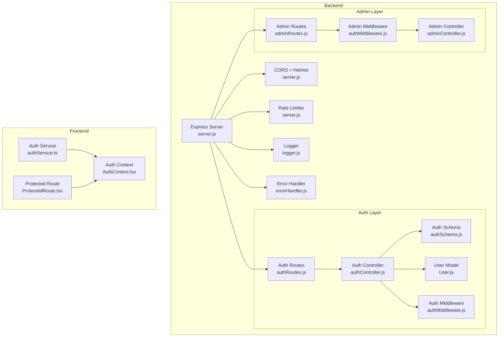
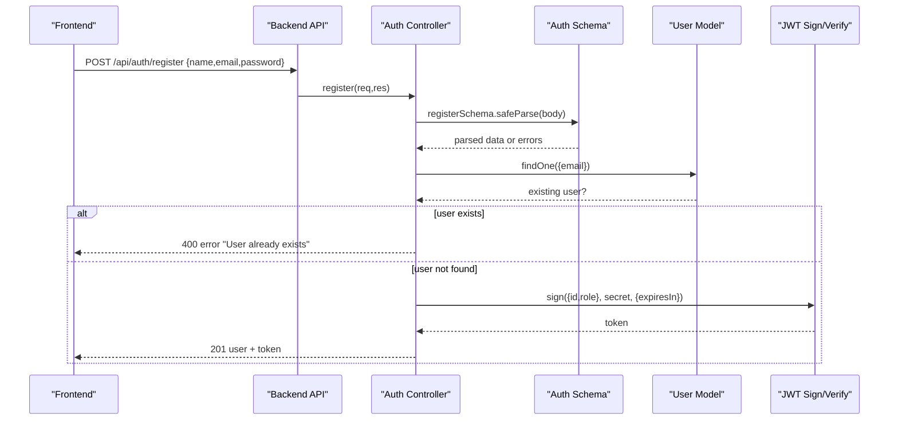
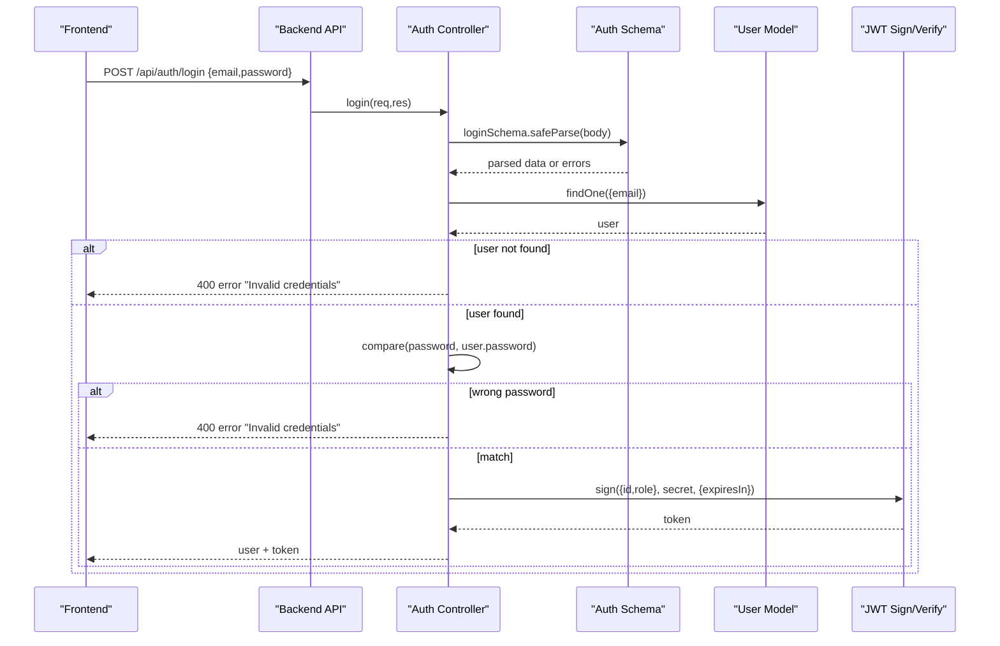
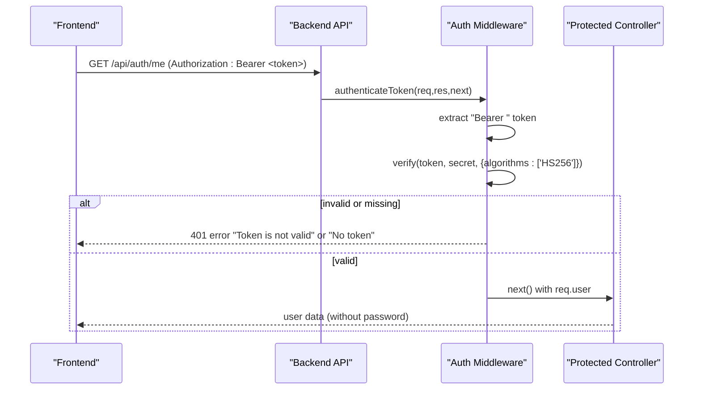
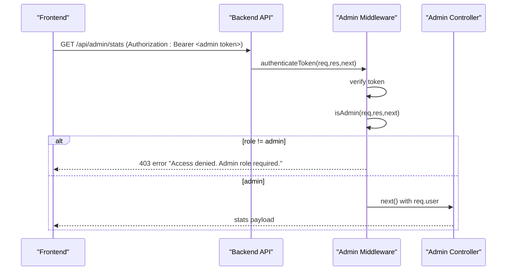
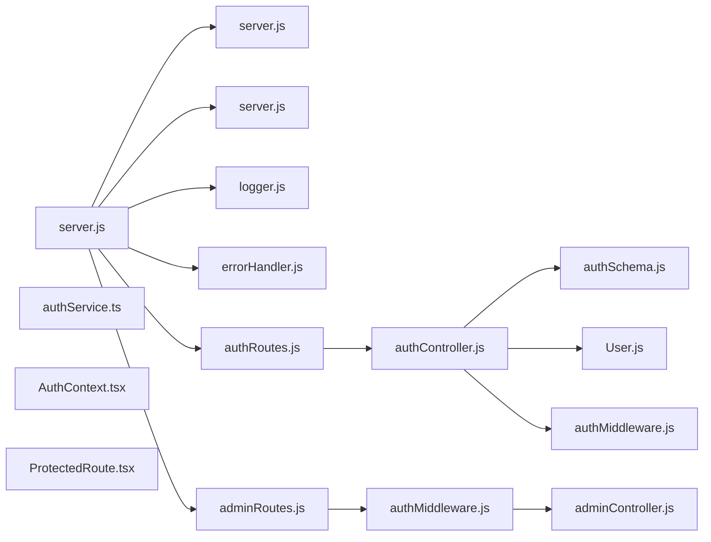

# Authentication and Authorization

<cite>
**Referenced Files in This Document**
- [authMiddleware.js](file://backend/middleware/authMiddleware.js)
- [authController.js](file://backend/controllers/authController.js)
- [authSchema.js](file://backend/validation/authSchema.js)
- [User.js](file://backend/models/User.js)
- [authRoutes.js](file://backend/routes/authRoutes.js)
- [adminController.js](file://backend/controllers/adminController.js)
- [adminRoutes.js](file://backend/routes/adminRoutes.js)
- [server.js](file://backend/server.js)
- [errorHandler.js](file://backend/middleware/errorHandler.js)
- [logger.js](file://backend/utils/logger.js)
- [authService.ts](file://frontend/src/api/services/authService.ts)
- [AuthContext.tsx](file://frontend/src/contexts/AuthContext.tsx)
- [ProtectedRoute.tsx](file://frontend/src/components/ProtectedRoute.tsx)
</cite>

## Table of Contents
1. [Introduction](#introduction)
2. [Project Structure](#project-structure)
3. [Core Components](#core-components)
4. [Architecture Overview](#architecture-overview)
5. [Detailed Component Analysis](#detailed-component-analysis)
6. [Dependency Analysis](#dependency-analysis)
7. [Performance Considerations](#performance-considerations)
8. [Troubleshooting Guide](#troubleshooting-guide)
9. [Conclusion](#conclusion)

## Introduction
This document explains the authentication and authorization system used by the backend API and integrated frontend. It covers JWT-based authentication, role-based access control (RBAC), and user session management. It documents the authentication middleware, token verification process, security headers, admin role enforcement, user permissions patterns, schema validation, password hashing, and session security measures. Practical examples illustrate protected routes, role checks, and user context management. It also addresses token refresh strategies, logout mechanisms, and security best practices for authentication flows.

## Project Structure
The authentication system spans the backend server, middleware, controllers, routes, models, and validation, and integrates with the frontend authentication service and context.

**Diagram sources**
- [server.js:1-155](file://backend/server.js#L1-L155)
- [authMiddleware.js:1-36](file://backend/middleware/authMiddleware.js#L1-L36)
- [authRoutes.js:1-11](file://backend/routes/authRoutes.js#L1-L11)
- [authController.js:1-121](file://backend/controllers/authController.js#L1-L121)
- [authSchema.js:1-18](file://backend/validation/authSchema.js#L1-L18)
- [User.js:1-50](file://backend/models/User.js#L1-L50)
- [adminRoutes.js:1-107](file://backend/routes/adminRoutes.js#L1-L107)
- [adminController.js:1-599](file://backend/controllers/adminController.js#L1-L599)
- [logger.js:1-58](file://backend/utils/logger.js#L1-L58)
- [errorHandler.js:1-44](file://backend/middleware/errorHandler.js#L1-L44)
- [authService.ts:1-57](file://frontend/src/api/services/authService.ts#L1-L57)
- [AuthContext.tsx:1-82](file://frontend/src/contexts/AuthContext.tsx#L1-L82)
- [ProtectedRoute.tsx:1-20](file://frontend/src/components/ProtectedRoute.tsx#L1-L20)

**Section sources**
- [server.js:1-155](file://backend/server.js#L1-L155)
- [authMiddleware.js:1-36](file://backend/middleware/authMiddleware.js#L1-L36)
- [authRoutes.js:1-11](file://backend/routes/authRoutes.js#L1-L11)
- [authController.js:1-121](file://backend/controllers/authController.js#L1-L121)
- [authSchema.js:1-18](file://backend/validation/authSchema.js#L1-L18)
- [User.js:1-50](file://backend/models/User.js#L1-L50)
- [adminRoutes.js:1-107](file://backend/routes/adminRoutes.js#L1-L107)
- [adminController.js:1-599](file://backend/controllers/adminController.js#L1-L599)
- [logger.js:1-58](file://backend/utils/logger.js#L1-L58)
- [errorHandler.js:1-44](file://backend/middleware/errorHandler.js#L1-L44)
- [authService.ts:1-57](file://frontend/src/api/services/authService.ts#L1-L57)
- [AuthContext.tsx:1-82](file://frontend/src/contexts/AuthContext.tsx#L1-L82)
- [ProtectedRoute.tsx:1-20](file://frontend/src/components/ProtectedRoute.tsx#L1-L20)

## Core Components
- JWT-based authentication with HS256 signing and strict algorithm enforcement.
- Zod schema validation for registration and login payloads.
- Bcrypt password hashing during registration and verification on login.
- Express middleware for bearer token extraction and verification.
- Role-based access control enforcing admin-only routes.
- Frontend authentication service storing tokens and user data in localStorage.
- Centralized error handling and structured logging.

Key implementation references:
- Token generation and validation: [authController.js:21-28], [authMiddleware.js:3-25]
- Schema validation: [authSchema.js:3-12]
- Password hashing and comparison: [authController.js:52-54], [authController.js:94-98]
- Admin enforcement: [authMiddleware.js:27-33], [adminRoutes.js:7-8]
- Frontend token storage and logout: [authService.ts:8-35]

**Section sources**
- [authController.js:21-28](file://backend/controllers/authController.js#L21-L28)
- [authMiddleware.js:3-25](file://backend/middleware/authMiddleware.js#L3-L25)
- [authSchema.js:3-12](file://backend/validation/authSchema.js#L3-L12)
- [authController.js:52-54](file://backend/controllers/authController.js#L52-L54)
- [authController.js:94-98](file://backend/controllers/authController.js#L94-L98)
- [authMiddleware.js:27-33](file://backend/middleware/authMiddleware.js#L27-L33)
- [adminRoutes.js:7-8](file://backend/routes/adminRoutes.js#L7-L8)
- [authService.ts:8-35](file://frontend/src/api/services/authService.ts#L8-L35)

## Architecture Overview
The authentication flow consists of:
- Registration: validate input, hash password, persist user, issue JWT.
- Login: validate input, verify credentials, issue JWT.
- Protected routes: extract Bearer token, verify JWT, attach user to request.
- Admin routes: enforce admin role after successful authentication.

**Diagram sources**
- [authController.js:30-70](file://backend/controllers/authController.js#L30-L70)
- [authSchema.js:3-7](file://backend/validation/authSchema.js#L3-L7)
- [User.js:10-29](file://backend/models/User.js#L10-L29)

**Diagram sources**
- [authController.js:72-107](file://backend/controllers/authController.js#L72-L107)
- [authSchema.js:9-12](file://backend/validation/authSchema.js#L9-L12)
- [User.js:18-20](file://backend/models/User.js#L18-L20)

**Diagram sources**
- [authRoutes.js:8](file://backend/routes/authRoutes.js#L8)
- [authMiddleware.js:3-25](file://backend/middleware/authMiddleware.js#L3-L25)
- [authController.js:109-121](file://backend/controllers/authController.js#L109-L121)

**Diagram sources**
- [adminRoutes.js:7-8](file://backend/routes/adminRoutes.js#L7-L8)
- [authMiddleware.js:27-33](file://backend/middleware/authMiddleware.js#L27-L33)
- [adminController.js:261-302](file://backend/controllers/adminController.js#L261-L302)

## Detailed Component Analysis

### Authentication Middleware
- Extracts the Bearer token from the Authorization header.
- Verifies the token using HS256 with the configured secret.
- Attaches the decoded user payload to req.user.
- Provides an isAdmin guard that checks role equality to 'admin'.

Security highlights:
- Enforces HS256 only to prevent algorithm downgrade attacks.
- Returns 401 for missing or malformed tokens.
- Returns 403 for admin-only routes when role is not 'admin'.

References:
- Token extraction and verification: [authMiddleware.js:3-25]
- Admin role enforcement: [authMiddleware.js:27-33]

**Section sources**
- [authMiddleware.js:3-25](file://backend/middleware/authMiddleware.js#L3-L25)
- [authMiddleware.js:27-33](file://backend/middleware/authMiddleware.js#L27-L33)

### Auth Controller
- Validates registration and login payloads using Zod schemas.
- Registers new users: checks uniqueness, hashes password, persists user, issues JWT.
- Authenticates users: finds user by email, compares password, issues JWT.
- Implements a protected route to fetch current user data excluding password.

Security highlights:
- JWT_SECRET is enforced in production; otherwise server refuses to start.
- Password hashing uses bcrypt with salt rounds.
- Token expiry is set to 30 days.

References:
- Secret enforcement and defaulting: [authController.js:6-19]
- Token generation: [authController.js:21-28]
- Registration flow: [authController.js:30-70]
- Login flow: [authController.js:72-107]
- Protected user fetch: [authController.js:109-121]

**Section sources**
- [authController.js:6-19](file://backend/controllers/authController.js#L6-L19)
- [authController.js:21-28](file://backend/controllers/authController.js#L21-L28)
- [authController.js:30-70](file://backend/controllers/authController.js#L30-L70)
- [authController.js:72-107](file://backend/controllers/authController.js#L72-L107)
- [authController.js:109-121](file://backend/controllers/authController.js#L109-L121)

### Validation Schema
- Registration requires name, valid email, and minimum 8-character password.
- Login requires valid email and non-empty password.

References:
- [authSchema.js:3-12]

**Section sources**
- [authSchema.js:3-12](file://backend/validation/authSchema.js#L3-L12)

### User Model
- Defines role as ENUM('user','seller','admin') with default 'user'.
- Stores hashed passwords and exposes UUID primary keys.

References:
- [User.js:26-29]

**Section sources**
- [User.js:26-29](file://backend/models/User.js#L26-L29)

### Admin Access Control
- Admin routes apply both authentication and admin guards at the router level.
- Admin controller enforces role-based actions and records audit logs.

References:
- Router-level guards: [adminRoutes.js:7-8]
- Admin-only endpoints: [adminRoutes.js:10-106]
- Admin controller actions: [adminController.js:25-599]

**Section sources**
- [adminRoutes.js:7-8](file://backend/routes/adminRoutes.js#L7-L8)
- [adminRoutes.js:10-106](file://backend/routes/adminRoutes.js#L10-L106)
- [adminController.js:25-599](file://backend/controllers/adminController.js#L25-L599)

### Frontend Authentication Context and Service
- Frontend stores JWT and user data in localStorage upon login/register.
- Provides an isAuthenticated flag and a logout function clearing storage.
- ProtectedRoute redirects unauthenticated users to the sign-in page.

References:
- Storage and logout: [authService.ts:8-35]
- Authentication state provider: [AuthContext.tsx:16-73]
- Protected route behavior: [ProtectedRoute.tsx:9-19]

**Section sources**
- [authService.ts:8-35](file://frontend/src/api/services/authService.ts#L8-L35)
- [AuthContext.tsx:16-73](file://frontend/src/contexts/AuthContext.tsx#L16-L73)
- [ProtectedRoute.tsx:9-19](file://frontend/src/components/ProtectedRoute.tsx#L9-L19)

### Server Security Headers and Environment Checks
- Helmet enabled for standard security headers.
- CORS configured with allowed headers including Authorization and credentials support.
- Basic environment checks for DB and JWT_SECRET presence.
- Rate limiting applied globally.
- Centralized error handler enriches logs with correlation IDs and user context.

References:
- Security headers and CORS: [server.js:21-28]
- Environment checks: [server.js:11-16]
- Rate limiting: [server.js:49-55]
- Error handler: [errorHandler.js:5-41]
- Logger: [logger.js:21-31]

**Section sources**
- [server.js:21-28](file://backend/server.js#L21-L28)
- [server.js:11-16](file://backend/server.js#L11-L16)
- [server.js:49-55](file://backend/server.js#L49-L55)
- [errorHandler.js:5-41](file://backend/middleware/errorHandler.js#L5-L41)
- [logger.js:21-31](file://backend/utils/logger.js#L21-L31)

## Dependency Analysis

**Diagram sources**
- [server.js:1-155](file://backend/server.js#L1-L155)
- [authMiddleware.js:1-36](file://backend/middleware/authMiddleware.js#L1-L36)
- [authRoutes.js:1-11](file://backend/routes/authRoutes.js#L1-L11)
- [authController.js:1-121](file://backend/controllers/authController.js#L1-L121)
- [authSchema.js:1-18](file://backend/validation/authSchema.js#L1-L18)
- [User.js:1-50](file://backend/models/User.js#L1-L50)
- [adminRoutes.js:1-107](file://backend/routes/adminRoutes.js#L1-L107)
- [adminController.js:1-599](file://backend/controllers/adminController.js#L1-L599)
- [authService.ts:1-57](file://frontend/src/api/services/authService.ts#L1-L57)
- [AuthContext.tsx:1-82](file://frontend/src/contexts/AuthContext.tsx#L1-L82)
- [ProtectedRoute.tsx:1-20](file://frontend/src/components/ProtectedRoute.tsx#L1-L20)

**Section sources**
- [server.js:1-155](file://backend/server.js#L1-L155)
- [authMiddleware.js:1-36](file://backend/middleware/authMiddleware.js#L1-L36)
- [authRoutes.js:1-11](file://backend/routes/authRoutes.js#L1-L11)
- [authController.js:1-121](file://backend/controllers/authController.js#L1-L121)
- [authSchema.js:1-18](file://backend/validation/authSchema.js#L1-L18)
- [User.js:1-50](file://backend/models/User.js#L1-L50)
- [adminRoutes.js:1-107](file://backend/routes/adminRoutes.js#L1-L107)
- [adminController.js:1-599](file://backend/controllers/adminController.js#L1-L599)
- [authService.ts:1-57](file://frontend/src/api/services/authService.ts#L1-L57)
- [AuthContext.tsx:1-82](file://frontend/src/contexts/AuthContext.tsx#L1-L82)
- [ProtectedRoute.tsx:1-20](file://frontend/src/components/ProtectedRoute.tsx#L1-L20)

## Performance Considerations
- Token verification is O(1) and lightweight; keep JWT_SECRET securely managed.
- Password hashing cost can be tuned; current salt rounds are suitable for most environments.
- Rate limiting reduces brute-force login attempts and protects endpoints.
- Avoid storing sensitive tokens in memory longer than necessary; frontend clears localStorage on logout.

## Troubleshooting Guide
Common issues and resolutions:
- Missing or invalid Authorization header:
  - Symptom: 401 "No token, authorization denied" or "Token is not valid".
  - Resolution: Ensure requests include "Authorization: Bearer <token>".
  - References: [authMiddleware.js:6-8], [authMiddleware.js:22-24]
- JWT_SECRET not configured in production:
  - Symptom: Server refuses to start with explicit error.
  - Resolution: Set JWT_SECRET in environment; do not rely on development default.
  - References: [authController.js:8-15]
- Invalid credentials during login/registration:
  - Symptom: 400 error indicating invalid credentials or schema mismatch.
  - Resolution: Validate email format and password length; ensure user exists for login.
  - References: [authController.js:89-98], [authController.js:36-41]
- Admin access denied:
  - Symptom: 403 "Access denied. Admin role required."
  - Resolution: Ensure the token belongs to a user with role 'admin'.
  - References: [authMiddleware.js:27-33], [User.js:26-29]
- Frontend authentication state not persisting:
  - Symptom: Not redirected to sign-in after logout.
  - Resolution: Confirm localStorage entries are cleared and ProtectedRoute logic is applied.
  - References: [authService.ts:32-35], [ProtectedRoute.tsx:13-16]

**Section sources**
- [authMiddleware.js:6-8](file://backend/middleware/authMiddleware.js#L6-L8)
- [authMiddleware.js:22-24](file://backend/middleware/authMiddleware.js#L22-L24)
- [authController.js:8-15](file://backend/controllers/authController.js#L8-L15)
- [authController.js:89-98](file://backend/controllers/authController.js#L89-L98)
- [authController.js:36-41](file://backend/controllers/authController.js#L36-L41)
- [authMiddleware.js:27-33](file://backend/middleware/authMiddleware.js#L27-L33)
- [User.js:26-29](file://backend/models/User.js#L26-L29)
- [authService.ts:32-35](file://frontend/src/api/services/authService.ts#L32-L35)
- [ProtectedRoute.tsx:13-16](file://frontend/src/components/ProtectedRoute.tsx#L13-L16)

## Conclusion
The system implements a robust JWT-based authentication and RBAC framework with:
- Strict token verification using HS256.
- Zod-driven input validation and bcrypt password hashing.
- Admin-only routes guarded by role checks.
- Frontend integration with localStorage-backed sessions and protected routing.
- Strong server-side security headers, CORS, rate limiting, and centralized error handling with logging.

To maintain security:
- Never use the development JWT_SECRET in production.
- Rotate secrets regularly and store them securely.
- Consider short-lived access tokens with a refresh mechanism if needed.
- Monitor logs and error telemetry for suspicious activity.