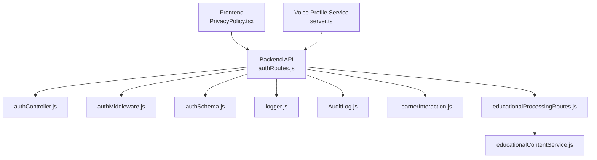
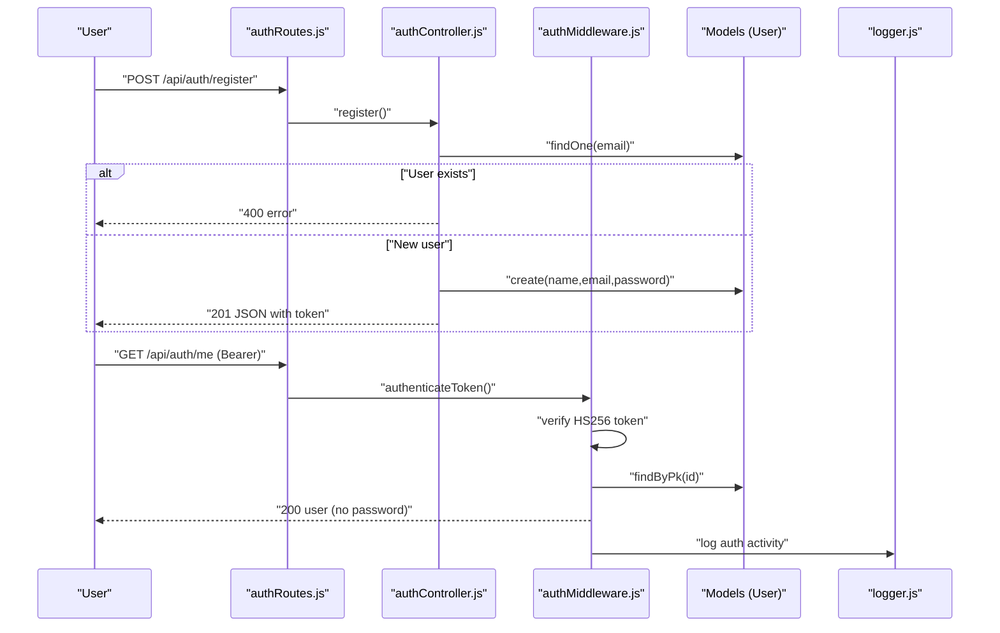
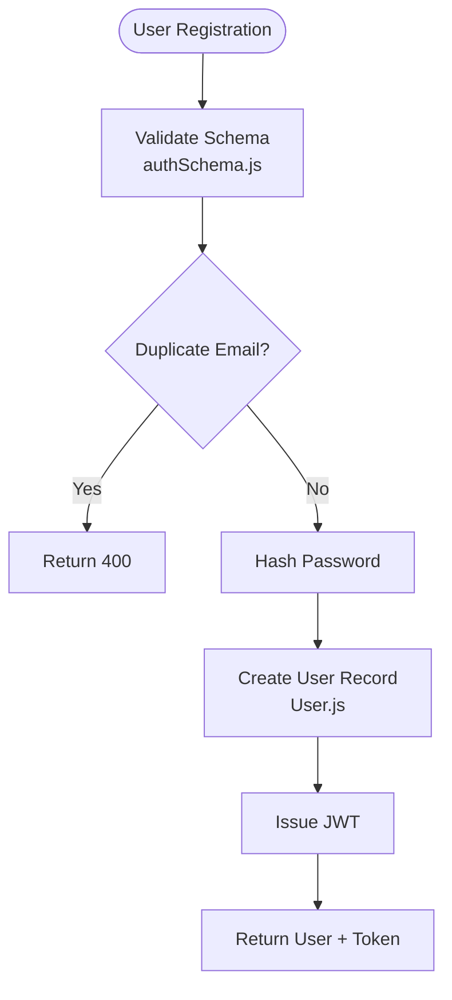
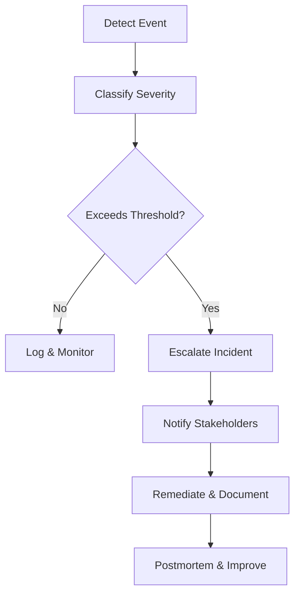
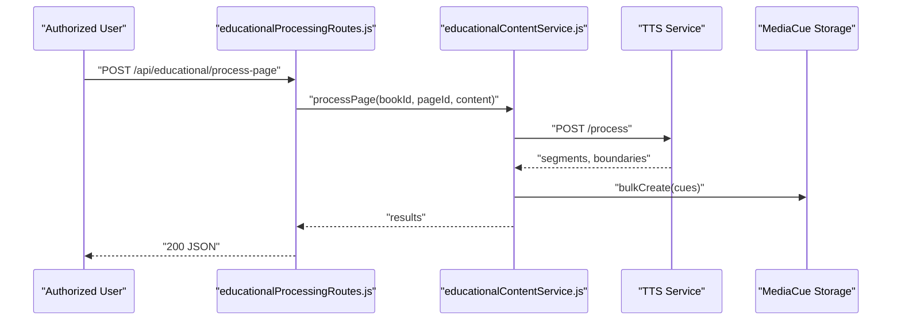
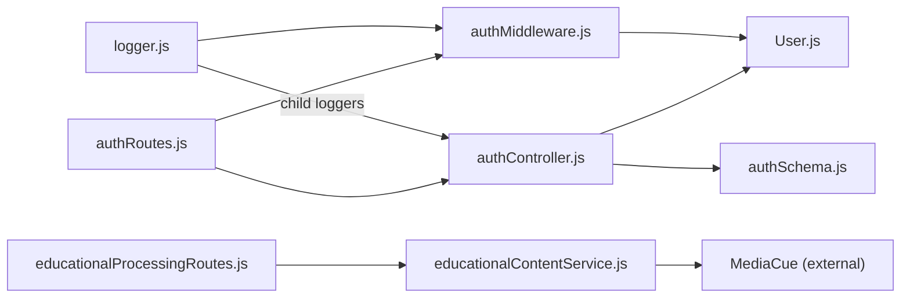

# Compliance and Regulatory Requirements

<cite>
**Referenced Files in This Document**
- [User.js](file://backend/models/User.js)
- [PrivacyPolicy.tsx](file://frontend/src/pages/PrivacyPolicy.tsx)
- [authController.js](file://backend/controllers/authController.js)
- [authMiddleware.js](file://backend/middleware/authMiddleware.js)
- [authRoutes.js](file://backend/routes/authRoutes.js)
- [authSchema.js](file://backend/validation/authSchema.js)
- [logger.js](file://backend/utils/logger.js)
- [AuditLog.js](file://backend/models/AuditLog.js)
- [LearnerInteraction.js](file://backend/models/LearnerInteraction.js)
- [educationalProcessingRoutes.js](file://backend/routes/educationalProcessingRoutes.js)
- [educationalContentService.js](file://backend/services/educationalContentService.js)
- [server.ts](file://services/voice/profile/src/server.ts)
</cite>

## Table of Contents
1. [Introduction](#introduction)
2. [Project Structure](#project-structure)
3. [Core Components](#core-components)
4. [Architecture Overview](#architecture-overview)
5. [Detailed Component Analysis](#detailed-component-analysis)
6. [Dependency Analysis](#dependency-analysis)
7. [Performance Considerations](#performance-considerations)
8. [Troubleshooting Guide](#troubleshooting-guide)
9. [Conclusion](#conclusion)
10. [Appendices](#appendices)

## Introduction
This document consolidates compliance and regulatory requirements for data privacy, educational platform safeguards, and security standards across the platform. It focuses on:
- Data Subject Rights and Consent Management
- Privacy Policy Implementation
- Data Retention and Portability
- Security Incident Reporting and Breach Notification
- International Data Transfer Controls
- Parental Consent and Student Data Protection
- GDPR, CCPA, and FERPA Considerations
- Compliance Checklists, Risk Templates, and Change Management

Where applicable, this document maps identified implementation points to concrete source files to guide remediation and validation.

## Project Structure
The platform comprises:
- Frontend: Privacy policy page and user-facing settings
- Backend: Authentication, routing, models, logging, and educational processing
- Services: Voice profile service with educator-specific protections
- Infrastructure: Educational content processing and media cue generation

**Diagram sources**
- [authRoutes.js:1-11](file://backend/routes/authRoutes.js#L1-L11)
- [authController.js:1-121](file://backend/controllers/authController.js#L1-L121)
- [authMiddleware.js:1-36](file://backend/middleware/authMiddleware.js#L1-L36)
- [authSchema.js:1-18](file://backend/validation/authSchema.js#L1-L18)
- [logger.js:1-58](file://backend/utils/logger.js#L1-L58)
- [AuditLog.js:1-30](file://backend/models/AuditLog.js#L1-L30)
- [LearnerInteraction.js:1-34](file://backend/models/LearnerInteraction.js#L1-L34)
- [educationalProcessingRoutes.js:1-102](file://backend/routes/educationalProcessingRoutes.js#L1-L102)
- [educationalContentService.js:1-181](file://backend/services/educationalContentService.js#L1-L181)
- [PrivacyPolicy.tsx:1-147](file://frontend/src/pages/PrivacyPolicy.tsx#L1-L147)
- [server.ts:201-218](file://services/voice/profile/src/server.ts#L201-L218)

**Section sources**
- [authRoutes.js:1-11](file://backend/routes/authRoutes.js#L1-L11)
- [PrivacyPolicy.tsx:1-147](file://frontend/src/pages/PrivacyPolicy.tsx#L1-L147)

## Core Components
- Authentication and Access Control: JWT-based authentication, protected routes, and role checks
- Data Models: User, AuditLog, LearnerInteraction
- Logging and Auditing: Centralized structured logging with component-scoped loggers
- Educational Processing: Content segmentation, media cue generation, and quiz orchestration
- Privacy Policy Page: Published front-end policy with rights and third-party disclosures

Key compliance-relevant observations:
- Authentication enforces bearer tokens and role-based access
- Models capture user identifiers and learner interactions
- Logging supports incident tracking and audit trails
- Educational routes and services process content with external integrations

**Section sources**
- [authController.js:1-121](file://backend/controllers/authController.js#L1-L121)
- [authMiddleware.js:1-36](file://backend/middleware/authMiddleware.js#L1-L36)
- [User.js:1-50](file://backend/models/User.js#L1-L50)
- [AuditLog.js:1-30](file://backend/models/AuditLog.js#L1-L30)
- [LearnerInteraction.js:1-34](file://backend/models/LearnerInteraction.js#L1-L34)
- [educationalProcessingRoutes.js:1-102](file://backend/routes/educationalProcessingRoutes.js#L1-L102)
- [educationalContentService.js:1-181](file://backend/services/educationalContentService.js#L1-L181)
- [logger.js:1-58](file://backend/utils/logger.js#L1-L58)
- [PrivacyPolicy.tsx:1-147](file://frontend/src/pages/PrivacyPolicy.tsx#L1-L147)

## Architecture Overview
The following diagram maps the authentication and audit/logging architecture, highlighting data subjects, processing, and compliance-relevant flows.

**Diagram sources**
- [authRoutes.js:1-11](file://backend/routes/authRoutes.js#L1-L11)
- [authController.js:1-121](file://backend/controllers/authController.js#L1-L121)
- [authMiddleware.js:1-36](file://backend/middleware/authMiddleware.js#L1-L36)
- [User.js:1-50](file://backend/models/User.js#L1-L50)
- [logger.js:1-58](file://backend/utils/logger.js#L1-L58)

## Detailed Component Analysis

### Authentication and Consent Management
- Token issuance and validation enforce bearer token usage and HS256 verification
- Role-based access ensures administrative controls
- Registration validates inputs and prevents duplicate accounts
- Password hashing and secure token storage are implemented

Recommended enhancements for consent and transparency:
- Add explicit consent fields and timestamps in the User model
- Implement granular consent toggles for marketing and analytics
- Provide a dedicated endpoint to record and withdraw consent per article 13 GDPR

**Diagram sources**
- [authSchema.js:1-18](file://backend/validation/authSchema.js#L1-L18)
- [authController.js:1-121](file://backend/controllers/authController.js#L1-L121)
- [User.js:1-50](file://backend/models/User.js#L1-L50)

**Section sources**
- [authController.js:1-121](file://backend/controllers/authController.js#L1-L121)
- [authMiddleware.js:1-36](file://backend/middleware/authMiddleware.js#L1-L36)
- [authSchema.js:1-18](file://backend/validation/authSchema.js#L1-L18)
- [User.js:1-50](file://backend/models/User.js#L1-L50)

### Privacy Policy Implementation
- The published Privacy Policy outlines information collection, use, security, third-party services, user rights, cookies, children’s privacy, changes, and contact
- Rights enumerated include access, correction, deletion, opt-out, and portability

Recommendations:
- Implement data access and deletion endpoints aligned with user rights
- Add a data portability export feature for user data
- Ensure children’s privacy section is enforced by age-gating and parental consent mechanisms

**Section sources**
- [PrivacyPolicy.tsx:1-147](file://frontend/src/pages/PrivacyPolicy.tsx#L1-L147)

### Data Retention and Portability
- No explicit retention schedules or automated deletion policies were identified in the reviewed backend models and routes
- Portability features are not present in the current implementation

Recommendations:
- Define retention periods for User, LearnerInteraction, and AuditLog data
- Implement automated deletion jobs and user-driven deletion APIs
- Provide CSV/JSON exports of user data upon request

**Section sources**
- [User.js:1-50](file://backend/models/User.js#L1-L50)
- [LearnerInteraction.js:1-34](file://backend/models/LearnerInteraction.js#L1-L34)
- [AuditLog.js:1-30](file://backend/models/AuditLog.js#L1-L30)

### Security Incident Reporting and Breach Notification
- Centralized logging with component-scoped loggers supports incident tracking
- No formal incident classification, escalation, or breach notification workflows were identified

Recommendations:
- Define incident categories and thresholds
- Implement automated alerting and runbooks
- Establish breach detection, containment, and notification timelines aligned with applicable regulations

**Section sources**
- [logger.js:1-58](file://backend/utils/logger.js#L1-L58)

### International Data Transfers and Cross-Border Processing
- Educational processing integrates external AI/TTS services; no data transfer agreements or binding corporate rules were identified
- Voice profile service restricts access by educator ownership and admin role

Recommendations:
- Document data transfers and implement Standard Contractual Clauses or Adequacy decisions
- Add vendor assessment and DPIAs for third-party processors
- Enforce encryption in transit and at rest for cross-border flows

**Section sources**
- [educationalContentService.js:1-181](file://backend/services/educationalContentService.js#L1-L181)
- [server.ts:201-218](file://services/voice/profile/src/server.ts#L201-L218)

### Parental Consent and Student Data Protection
- Children under 13 are not targeted; no parental consent mechanism is implemented
- LearnerInteraction captures learning activities; no pseudonymization or de-identification policies were found

Recommendations:
- Implement age-gating and verifiable parental consent for learners under 18
- Apply data minimization and pseudonymization for student data
- Conduct DPIAs for educational data processing and publish privacy notices for parents

**Section sources**
- [PrivacyPolicy.tsx:80-82](file://frontend/src/pages/PrivacyPolicy.tsx#L80-L82)
- [LearnerInteraction.js:1-34](file://backend/models/LearnerInteraction.js#L1-L34)

### GDPR, CCPA, and FERPA Considerations
- GDPR: Lawful basis, data retention, data portability, and breach notification timelines are not yet implemented
- CCPA: No sale/disposal disclosures or Do Not Sell links observed; no data portability endpoint
- FERPA: No student directory information policies or consent mechanisms for educational records

Recommendations:
- Add lawful basis fields and processing records
- Implement CCPA-compliant opt-out and data sale disclosures
- Adopt FERPA-aligned policies for educational data and parent consent

**Section sources**
- [PrivacyPolicy.tsx:50-72](file://frontend/src/pages/PrivacyPolicy.tsx#L50-L72)
- [educationalProcessingRoutes.js:1-102](file://backend/routes/educationalProcessingRoutes.js#L1-L102)

### Data Subject Rights and Consent Management
- Rights enumerated in the Privacy Policy include access, correction, deletion, opt-out, and portability
- No explicit consent recording or withdrawal mechanisms were identified

Recommendations:
- Add consent records with timestamps and purposes
- Implement consent withdrawal and re-consent workflows
- Provide a dedicated UI/API for data access and deletion requests

**Section sources**
- [PrivacyPolicy.tsx:63-71](file://frontend/src/pages/PrivacyPolicy.tsx#L63-L71)

### Audit Logs and Accountability
- AuditLog model captures admin actions with JSON details
- Logging supports incident tracking but lacks standardized event taxonomy

Recommendations:
- Define audit event taxonomy and retention
- Implement automated audit reports and anomaly detection
- Ensure immutable audit trails for regulatory inspections

**Section sources**
- [AuditLog.js:1-30](file://backend/models/AuditLog.js#L1-L30)
- [logger.js:1-58](file://backend/utils/logger.js#L1-L58)

### Educational Data Processing and AI Integration
- EducationalProcessingRoutes orchestrates page and bulk processing
- EducationalContentService integrates external TTS/AI services and generates media cues and quizzes
- Voice profile service restricts access to authorized educators

Recommendations:
- Document data minimization and purpose limitation for educational processing
- Implement DPIAs for AI-assisted content generation
- Add learner consent for AI-generated content and quizzes

**Diagram sources**
- [educationalProcessingRoutes.js:1-102](file://backend/routes/educationalProcessingRoutes.js#L1-L102)
- [educationalContentService.js:1-181](file://backend/services/educationalContentService.js#L1-L181)

**Section sources**
- [educationalProcessingRoutes.js:1-102](file://backend/routes/educationalProcessingRoutes.js#L1-L102)
- [educationalContentService.js:1-181](file://backend/services/educationalContentService.js#L1-L181)
- [server.ts:201-218](file://services/voice/profile/src/server.ts#L201-L218)

## Dependency Analysis

**Diagram sources**
- [authRoutes.js:1-11](file://backend/routes/authRoutes.js#L1-L11)
- [authController.js:1-121](file://backend/controllers/authController.js#L1-L121)
- [authMiddleware.js:1-36](file://backend/middleware/authMiddleware.js#L1-L36)
- [User.js:1-50](file://backend/models/User.js#L1-L50)
- [authSchema.js:1-18](file://backend/validation/authSchema.js#L1-L18)
- [educationalProcessingRoutes.js:1-102](file://backend/routes/educationalProcessingRoutes.js#L1-L102)
- [educationalContentService.js:1-181](file://backend/services/educationalContentService.js#L1-L181)
- [logger.js:1-58](file://backend/utils/logger.js#L1-L58)

**Section sources**
- [authRoutes.js:1-11](file://backend/routes/authRoutes.js#L1-L11)
- [authController.js:1-121](file://backend/controllers/authController.js#L1-L121)
- [authMiddleware.js:1-36](file://backend/middleware/authMiddleware.js#L1-L36)
- [User.js:1-50](file://backend/models/User.js#L1-L50)
- [educationalProcessingRoutes.js:1-102](file://backend/routes/educationalProcessingRoutes.js#L1-L102)
- [educationalContentService.js:1-181](file://backend/services/educationalContentService.js#L1-L181)
- [logger.js:1-58](file://backend/utils/logger.js#L1-L58)

## Performance Considerations
- Logging includes file rotation and JSON formatting; consider structured fields for compliance queries
- Educational processing batches pages to avoid overload; ensure rate limiting and circuit breakers for external services
- Authentication uses bcrypt hashing and JWT verification; ensure adequate key rotation and token lifetimes

[No sources needed since this section provides general guidance]

## Troubleshooting Guide
- Authentication failures: Verify JWT_SECRET is configured in production and token algorithms match expectations
- Authorization errors: Confirm roles and bearer tokens; ensure protected routes apply middleware
- Logging issues: Check log directory permissions and transport configurations
- Educational processing errors: Validate external service availability and content payloads

**Section sources**
- [authController.js:6-19](file://backend/controllers/authController.js#L6-L19)
- [authMiddleware.js:15-24](file://backend/middleware/authMiddleware.js#L15-L24)
- [logger.js:25-31](file://backend/utils/logger.js#L25-L31)
- [educationalProcessingRoutes.js:37-41](file://backend/routes/educationalProcessingRoutes.js#L37-L41)

## Conclusion
The platform demonstrates foundational authentication, logging, and educational processing capabilities. To achieve comprehensive compliance with GDPR, CCPA, and FERPA:
- Implement consent management, data retention schedules, and data portability
- Strengthen breach notification and incident response procedures
- Define international data transfer safeguards and parental consent mechanisms
- Enhance auditability and automate compliance-related workflows

[No sources needed since this section summarizes without analyzing specific files]

## Appendices

### Compliance Checklist
- Data mapping and retention schedules
- Consent records and withdrawal mechanisms
- Data access/deletion APIs and user portals
- Breach detection, escalation, and notification procedures
- Vendor assessment and data processing agreements
- DPIAs for AI and educational data processing
- Parental consent and student data protection policies
- CCPA opt-out and sale disclosures
- FERPA-aligned policies for educational records

### Risk Assessment Template
- Asset inventory (personal data, learner interactions)
- Threat modeling (unauthorized access, data leaks, third-party risks)
- Likelihood and impact scoring
- Mitigations and monitoring
- Residual risk acceptance and approvals

### Regulatory Change Management Process
- Impact assessment for new features or vendors
- DPIA and stakeholder consultation
- Policy and procedure updates
- Training and communication
- Monitoring and audit

[No sources needed since this section provides general guidance]