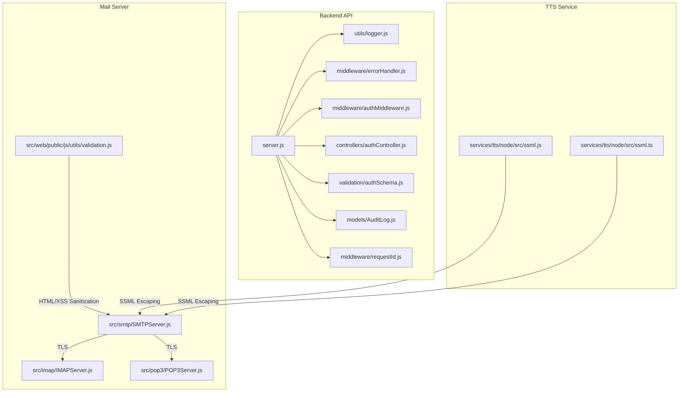
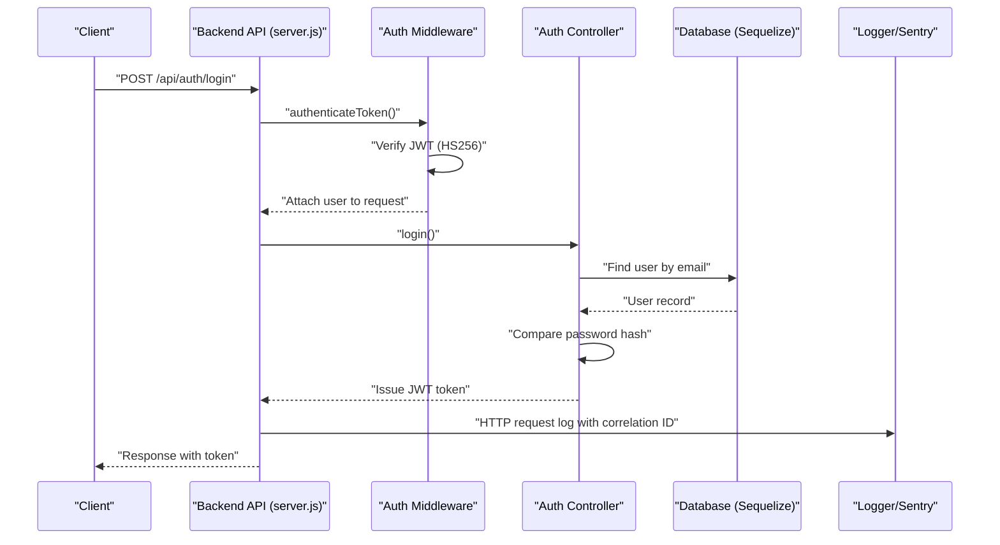
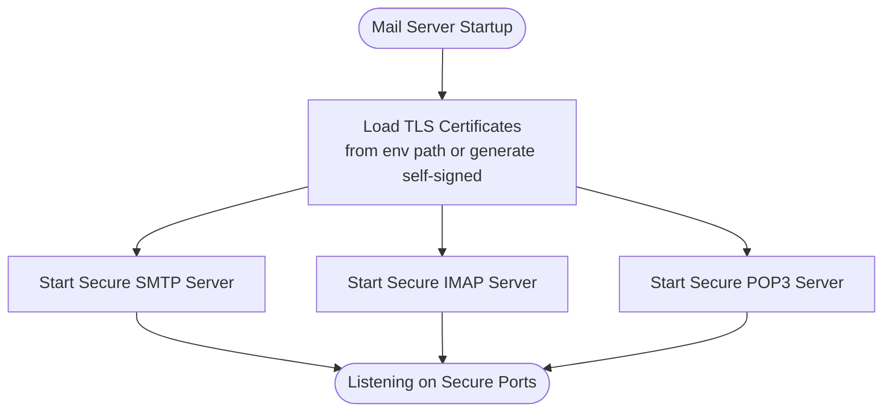
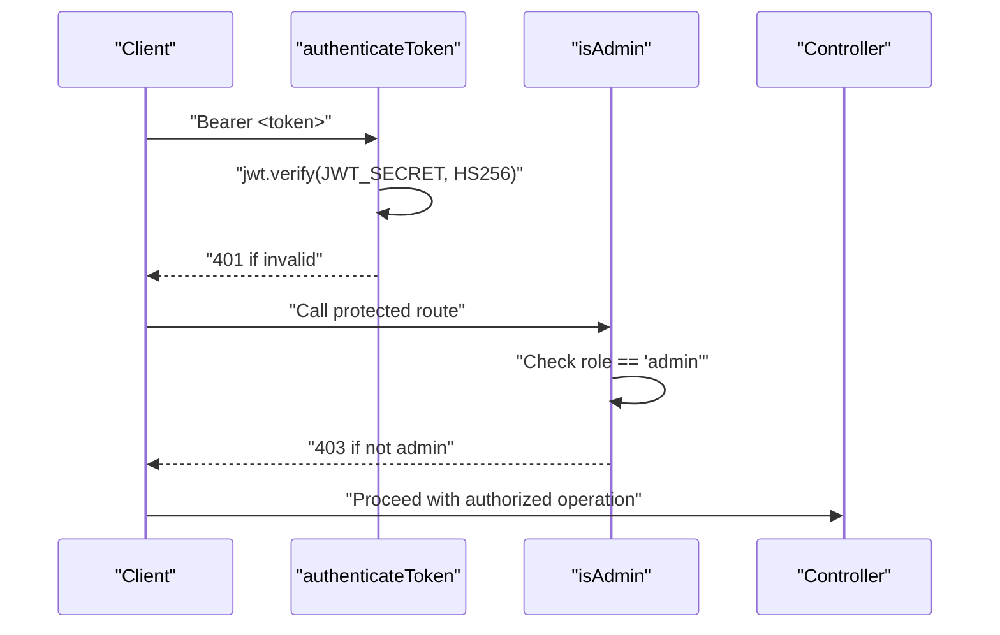
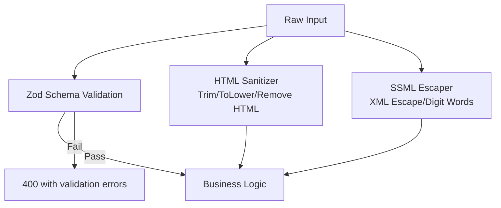
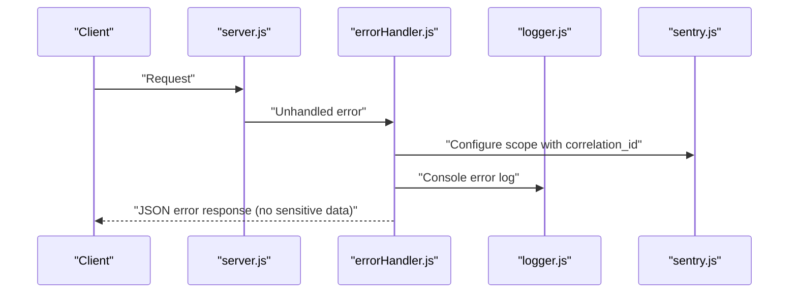
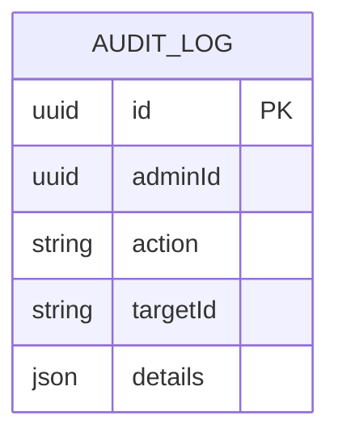
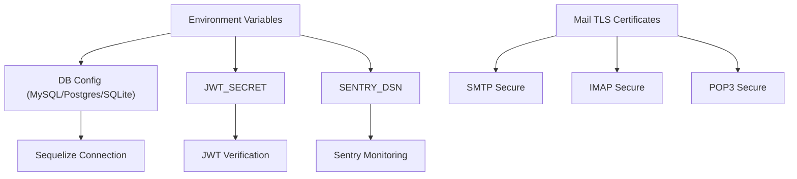
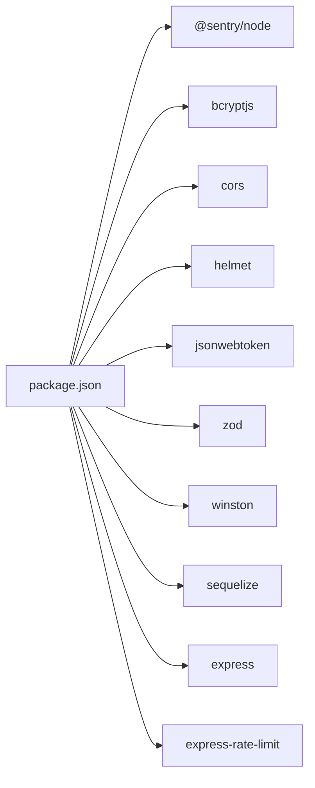

# Data Security and Encryption

<cite>
**Referenced Files in This Document**
- [server.js](file://backend/server.js)
- [logger.js](file://backend/utils/logger.js)
- [sentry.js](file://backend/utils/sentry.js)
- [errorHandler.js](file://backend/middleware/errorHandler.js)
- [authMiddleware.js](file://backend/middleware/authMiddleware.js)
- [authController.js](file://backend/controllers/authController.js)
- [authSchema.js](file://backend/validation/authSchema.js)
- [AuditLog.js](file://backend/models/AuditLog.js)
- [requestId.js](file://backend/middleware/requestId.js)
- [SMTPServer.js](file://mail-server/src/smtp/SMTPServer.js)
- [IMAPServer.js](file://mail-server/src/imap/IMAPServer.js)
- [POP3Server.js](file://mail-server/src/pop3/POP3Server.js)
- [validation.js](file://mail-server/src/web/public/js/utils/validation.js)
- [ssml.js](file://services/tts/node/src/ssml.js)
- [ssml.ts](file://services/tts/node/src/ssml.ts)
- [package.json](file://backend/package.json)
</cite>

## Table of Contents
1. [Introduction](#introduction)
2. [Project Structure](#project-structure)
3. [Core Components](#core-components)
4. [Architecture Overview](#architecture-overview)
5. [Detailed Component Analysis](#detailed-component-analysis)
6. [Dependency Analysis](#dependency-analysis)
7. [Performance Considerations](#performance-considerations)
8. [Troubleshooting Guide](#troubleshooting-guide)
9. [Conclusion](#conclusion)
10. [Appendices](#appendices)

## Introduction
This document provides comprehensive data security documentation for the platform, focusing on encryption at rest and in transit, secure data handling, sensitive information protection, and operational controls. It covers database connectivity and transport security, input sanitization and validation, logging and error handling practices, audit trails, encryption key management, secure file storage, and data retention and anonymization guidance. Where applicable, the document references actual source files and highlights areas requiring attention or enhancement.

## Project Structure
Security-relevant components span the backend API, mail server, and TTS services. The backend API enforces request correlation, rate limiting, and structured logging. Authentication relies on JWT with HS256 verification. The mail server implements TLS for SMTP/IMAP/POP3. Validation utilities exist in both backend and mail web components. The TTS service includes SSML escaping and digit-to-word transformations to mitigate unsafe input handling.

**Diagram sources**
- [server.js:1-155](file://backend/server.js#L1-L155)
- [logger.js:1-58](file://backend/utils/logger.js#L1-L58)
- [errorHandler.js:1-44](file://backend/middleware/errorHandler.js#L1-L44)
- [authMiddleware.js:1-36](file://backend/middleware/authMiddleware.js#L1-L36)
- [authController.js:1-121](file://backend/controllers/authController.js#L1-L121)
- [authSchema.js:1-18](file://backend/validation/authSchema.js#L1-L18)
- [AuditLog.js:1-30](file://backend/models/AuditLog.js#L1-L30)
- [requestId.js:1-15](file://backend/middleware/requestId.js#L1-L15)
- [SMTPServer.js:199-228](file://mail-server/src/smtp/SMTPServer.js#L199-L228)
- [IMAPServer.js:77-126](file://mail-server/src/imap/IMAPServer.js#L77-L126)
- [POP3Server.js:76-113](file://mail-server/src/pop3/POP3Server.js#L76-L113)
- [validation.js:447-487](file://mail-server/src/web/public/js/utils/validation.js#L447-L487)
- [ssml.js:108-143](file://services/tts/node/src/ssml.js#L108-L143)
- [ssml.ts:110-148](file://services/tts/node/src/ssml.ts#L110-L148)

**Section sources**
- [server.js:1-155](file://backend/server.js#L1-L155)
- [package.json:1-52](file://backend/package.json#L1-L52)

## Core Components
- Transport security: Helmet, CORS, rate limiting, and TLS-enabled mail protocols.
- Authentication: JWT with HS256 verification and admin role checks.
- Input validation and sanitization: Zod schemas and HTML sanitization.
- Logging and observability: Winston file transports and Sentry initialization.
- Audit logging: Structured audit records with JSON details.
- Request correlation: Unique correlation IDs propagated across services.

**Section sources**
- [server.js:18-56](file://backend/server.js#L18-L56)
- [authMiddleware.js:1-36](file://backend/middleware/authMiddleware.js#L1-L36)
- [authController.js:1-121](file://backend/controllers/authController.js#L1-L121)
- [authSchema.js:1-18](file://backend/validation/authSchema.js#L1-L18)
- [logger.js:1-58](file://backend/utils/logger.js#L1-L58)
- [sentry.js:1-22](file://backend/utils/sentry.js#L1-L22)
- [AuditLog.js:1-30](file://backend/models/AuditLog.js#L1-L30)
- [requestId.js:1-15](file://backend/middleware/requestId.js#L1-L15)

## Architecture Overview
The system employs layered security controls:
- Network and transport: TLS for mail protocols; Helmet/CORS/rate limiting for API.
- Identity and access: JWT HS256 tokens validated centrally; admin role enforcement.
- Data validation: Zod schemas for registration/login; HTML sanitization in mail web UI.
- Observability: Structured logs and Sentry error reporting with correlation IDs.
- Auditability: Dedicated audit log model capturing administrative actions.

**Diagram sources**
- [server.js:110-150](file://backend/server.js#L110-L150)
- [authMiddleware.js:3-25](file://backend/middleware/authMiddleware.js#L3-L25)
- [authController.js:75-107](file://backend/controllers/authController.js#L75-L107)
- [logger.js:33-44](file://backend/utils/logger.js#L33-L44)

## Detailed Component Analysis

### Transport Security and TLS
- API transport: Helmet hardens headers; CORS allows credentials and specific headers; rate limiting protects against abuse.
- Mail protocols: SMTP/IMAP/POP3 servers support TLS with certificate loading and optional self-signed fallback. Start-up logs indicate secure ports and TLS readiness.

**Diagram sources**
- [SMTPServer.js:199-228](file://mail-server/src/smtp/SMTPServer.js#L199-L228)
- [IMAPServer.js:77-126](file://mail-server/src/imap/IMAPServer.js#L77-L126)
- [POP3Server.js:76-113](file://mail-server/src/pop3/POP3Server.js#L76-L113)

**Section sources**
- [server.js:18-28](file://backend/server.js#L18-L28)
- [SMTPServer.js:199-228](file://mail-server/src/smtp/SMTPServer.js#L199-L228)
- [IMAPServer.js:77-126](file://mail-server/src/imap/IMAPServer.js#L77-L126)
- [POP3Server.js:76-113](file://mail-server/src/pop3/POP3Server.js#L76-L113)

### Authentication and Authorization
- Token verification uses HS256 exclusively, preventing algorithm downgrade attacks.
- Admin role enforcement restricts privileged endpoints.
- Registration/login use Zod schemas for input validation.

**Diagram sources**
- [authMiddleware.js:3-33](file://backend/middleware/authMiddleware.js#L3-L33)
- [authController.js:30-121](file://backend/controllers/authController.js#L30-L121)
- [authSchema.js:1-18](file://backend/validation/authSchema.js#L1-L18)

**Section sources**
- [authMiddleware.js:1-36](file://backend/middleware/authMiddleware.js#L1-L36)
- [authController.js:1-121](file://backend/controllers/authController.js#L1-L121)
- [authSchema.js:1-18](file://backend/validation/authSchema.js#L1-L18)

### Input Validation and Sanitization
- Backend: Zod schemas enforce minimum length and format for registration and login.
- Frontend (mail web): HTML sanitization and input trimming to mitigate XSS.
- TTS SSML: Escaping XML metacharacters and transforming digits to words to avoid malformed SSML.

**Diagram sources**
- [authSchema.js:1-18](file://backend/validation/authSchema.js#L1-L18)
- [validation.js:447-487](file://mail-server/src/web/public/js/utils/validation.js#L447-L487)
- [ssml.js:137-143](file://services/tts/node/src/ssml.js#L137-L143)
- [ssml.ts:142-148](file://services/tts/node/src/ssml.ts#L142-L148)

**Section sources**
- [authSchema.js:1-18](file://backend/validation/authSchema.js#L1-L18)
- [validation.js:447-487](file://mail-server/src/web/public/js/utils/validation.js#L447-L487)
- [ssml.js:108-143](file://services/tts/node/src/ssml.js#L108-L143)
- [ssml.ts:110-148](file://services/tts/node/src/ssml.ts#L110-L148)

### Logging Security and Error Handling
- HTTP request logs include correlation ID, method, URL, status, duration, and IP.
- Error handler centralizes responses, attaches correlation ID to Sentry, and avoids leaking internal details in production.
- Winston transports write structured logs to files with rotation; Sentry initialized when DSN present.

**Diagram sources**
- [server.js:32-47](file://backend/server.js#L32-L47)
- [errorHandler.js:5-41](file://backend/middleware/errorHandler.js#L5-L41)
- [logger.js:21-31](file://backend/utils/logger.js#L21-L31)
- [sentry.js:3-21](file://backend/utils/sentry.js#L3-L21)

**Section sources**
- [server.js:32-47](file://backend/server.js#L32-L47)
- [errorHandler.js:1-44](file://backend/middleware/errorHandler.js#L1-L44)
- [logger.js:1-58](file://backend/utils/logger.js#L1-L58)
- [sentry.js:1-22](file://backend/utils/sentry.js#L1-L22)

### Audit Trail Maintenance
- AuditLog model captures admin actions with UUID primary key, admin identifier, action string, optional target identifier, and JSON details for traceability.

**Diagram sources**
- [AuditLog.js:4-26](file://backend/models/AuditLog.js#L4-L26)

**Section sources**
- [AuditLog.js:1-30](file://backend/models/AuditLog.js#L1-L30)

### Encryption at Rest and in Transit
- Database connectivity: MySQL/PostgreSQL via Sequelize with configurable dialect and pooling; SQLite fallback for local development.
- Transport security: TLS for SMTP/IMAP/POP3 mail protocols; Helmet and CORS for API.
- Secrets: JWT_SECRET enforced at startup; Sentry DSN optional but recommended.

**Diagram sources**
- [server.js:57-84](file://backend/server.js#L57-L84)
- [authController.js:6-19](file://backend/controllers/authController.js#L6-L19)
- [sentry.js:3-15](file://backend/utils/sentry.js#L3-L15)
- [SMTPServer.js:199-228](file://mail-server/src/smtp/SMTPServer.js#L199-L228)
- [IMAPServer.js:77-126](file://mail-server/src/imap/IMAPServer.js#L77-L126)
- [POP3Server.js:76-113](file://mail-server/src/pop3/POP3Server.js#L76-L113)

**Section sources**
- [server.js:57-84](file://backend/server.js#L57-L84)
- [authController.js:6-19](file://backend/controllers/authController.js#L6-L19)
- [sentry.js:1-22](file://backend/utils/sentry.js#L1-L22)
- [SMTPServer.js:199-228](file://mail-server/src/smtp/SMTPServer.js#L199-L228)
- [IMAPServer.js:77-126](file://mail-server/src/imap/IMAPServer.js#L77-L126)
- [POP3Server.js:76-113](file://mail-server/src/pop3/POP3Server.js#L76-L113)

### Secure Data Handling Practices
- Request correlation: X-Correlation-ID propagation ensures traceability across services.
- Rate limiting: Prevents abuse and supports DoS resilience.
- Structured logging: Logs include correlation ID and contextual metadata without sensitive data.

**Section sources**
- [requestId.js:1-15](file://backend/middleware/requestId.js#L1-L15)
- [server.js:49-55](file://backend/server.js#L49-L55)
- [logger.js:33-44](file://backend/utils/logger.js#L33-L44)

### Data Masking Techniques
- Password hashing: bcrypt used during registration; password fields excluded from user responses.
- Token issuance: JWT tokens replace plaintext secrets.
- SSML escaping: XML metacharacters escaped and numeric sequences transformed to words to prevent SSML injection.

**Section sources**
- [authController.js:52-69](file://backend/controllers/authController.js#L52-L69)
- [authController.js:114-120](file://backend/controllers/authController.js#L114-L120)
- [ssml.js:137-143](file://services/tts/node/src/ssml.js#L137-L143)
- [ssml.ts:142-148](file://services/tts/node/src/ssml.ts#L142-L148)

### Logging Security Practices
- Winston transports write structured JSON logs to rotating files.
- Console transport enabled outside production with colorized/simple format.
- Exception and rejection handlers capture unhandled conditions.

**Section sources**
- [logger.js:21-31](file://backend/utils/logger.js#L21-L31)

### Error Handling Without Exposing Sensitive Data
- Centralized error handler:
  - Attaches correlation ID to Sentry scope.
  - Returns generic messages for 5xx in production.
  - Preserves validation errors for client-side remediation.

**Section sources**
- [errorHandler.js:5-41](file://backend/middleware/errorHandler.js#L5-L41)

### Audit Trail Maintenance
- AuditLog model supports:
  - Admin actions tracking.
  - Optional target identifiers.
  - JSON details for contextual information.

**Section sources**
- [AuditLog.js:1-30](file://backend/models/AuditLog.js#L1-L30)

### Encryption Key Management
- JWT_SECRET:
  - Required in production; startup failure if missing.
  - Default only for development to prevent accidental production exposure.
- Sentry DSN:
  - Optional initialization; logs warning if absent.

**Section sources**
- [authController.js:6-19](file://backend/controllers/authController.js#L6-L19)
- [sentry.js:3-15](file://backend/utils/sentry.js#L3-L15)

### Secure File Storage
- No explicit secure file storage implementation detected in the backend. Recommendations:
  - Enforce signed URLs with short TTLs for downloads.
  - Store files outside the web root and restrict filesystem permissions.
  - Apply server-side validation and virus scanning for uploads.

[No sources needed since this section provides general guidance]

### Data Retention Policies
- No explicit retention policy detected in the backend. Recommendations:
  - Define retention periods for logs, audit entries, and user data.
  - Implement automated cleanup jobs with secure deletion.
  - Comply with applicable regulations (e.g., privacy laws).

[No sources needed since this section provides general guidance]

### Data Breach Prevention
- Transport hardening: Helmet, CORS, rate limiting.
- Input validation: Zod schemas and HTML sanitization.
- Observability: Sentry integration and structured logs.
- Access control: JWT HS256 and admin role checks.

**Section sources**
- [server.js:18-28](file://backend/server.js#L18-L28)
- [authSchema.js:1-18](file://backend/validation/authSchema.js#L1-L18)
- [validation.js:447-487](file://mail-server/src/web/public/js/utils/validation.js#L447-L487)
- [sentry.js:1-22](file://backend/utils/sentry.js#L1-L22)

### Secure Deletion Procedures
- No secure deletion implementation detected. Recommendations:
  - Overwrite files with random data before removal.
  - Use secure delete APIs where supported.
  - Zeroize database rows and log deletions in audit trail.

[No sources needed since this section provides general guidance]

### Data Anonymization for Testing Environments
- No anonymization pipeline detected. Recommendations:
  - Replace real PII with deterministic pseudonyms.
  - Hash identifiers and redact sensitive fields.
  - Maintain separate anonymized datasets for testing.

[No sources needed since this section provides general guidance]

## Dependency Analysis
Security-related dependencies include Helmet, CORS, rate limiting, JWT, bcrypt, Sequelize, Winston, Sentry, and Zod. These libraries underpin transport hardening, authentication, validation, persistence, logging, and error monitoring.

**Diagram sources**
- [package.json:16-39](file://backend/package.json#L16-L39)

**Section sources**
- [package.json:1-52](file://backend/package.json#L1-L52)

## Performance Considerations
- Rate limiting reduces load and mitigates abuse.
- Structured logging minimizes overhead while preserving observability.
- Database pooling limits concurrent connections and improves stability.

[No sources needed since this section provides general guidance]

## Troubleshooting Guide
- Missing JWT_SECRET in production: Controller enforces startup failure to prevent insecure operation.
- Sentry disabled: Initialization warns when DSN is absent; enable DSN for error tracking.
- Validation failures: Zod schemas return structured errors; sanitize inputs before processing.
- TLS certificate issues: Mail servers attempt to load certificates from configured path or generate self-signed; ensure proper file permissions and paths.

**Section sources**
- [authController.js:6-19](file://backend/controllers/authController.js#L6-L19)
- [sentry.js:3-15](file://backend/utils/sentry.js#L3-L15)
- [authSchema.js:1-18](file://backend/validation/authSchema.js#L1-L18)
- [IMAPServer.js:77-92](file://mail-server/src/imap/IMAPServer.js#L77-L92)

## Conclusion
The platform implements several strong security foundations: transport hardening, JWT-based authentication, input validation, structured logging, and Sentry monitoring. Areas for improvement include explicit encryption at rest, secure file storage, data retention policies, secure deletion, anonymization for testing, and comprehensive key management practices. Adopting the recommendations herein will strengthen the overall data security posture.

## Appendices
- Environment variables to review:
  - DB_NAME, DB_USER, DB_PASS, DB_HOST, DB_PORT, DB_DIALECT
  - JWT_SECRET
  - SENTRY_DSN
  - FRONTEND_URL
  - LOG_LEVEL
  - TLS_CERT_PATH

[No sources needed since this section provides general guidance]