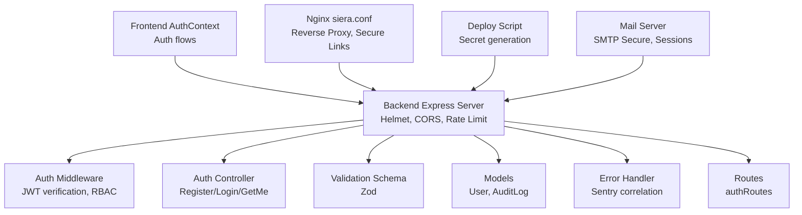
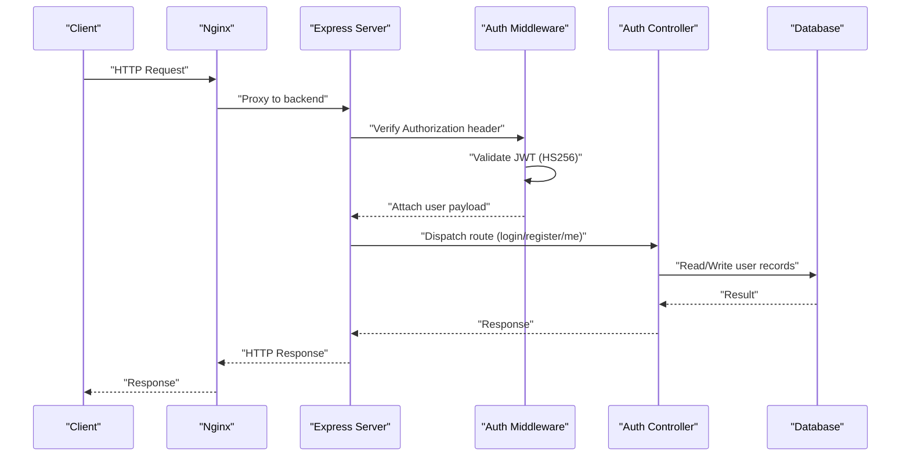
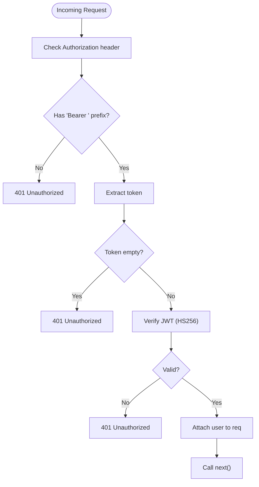
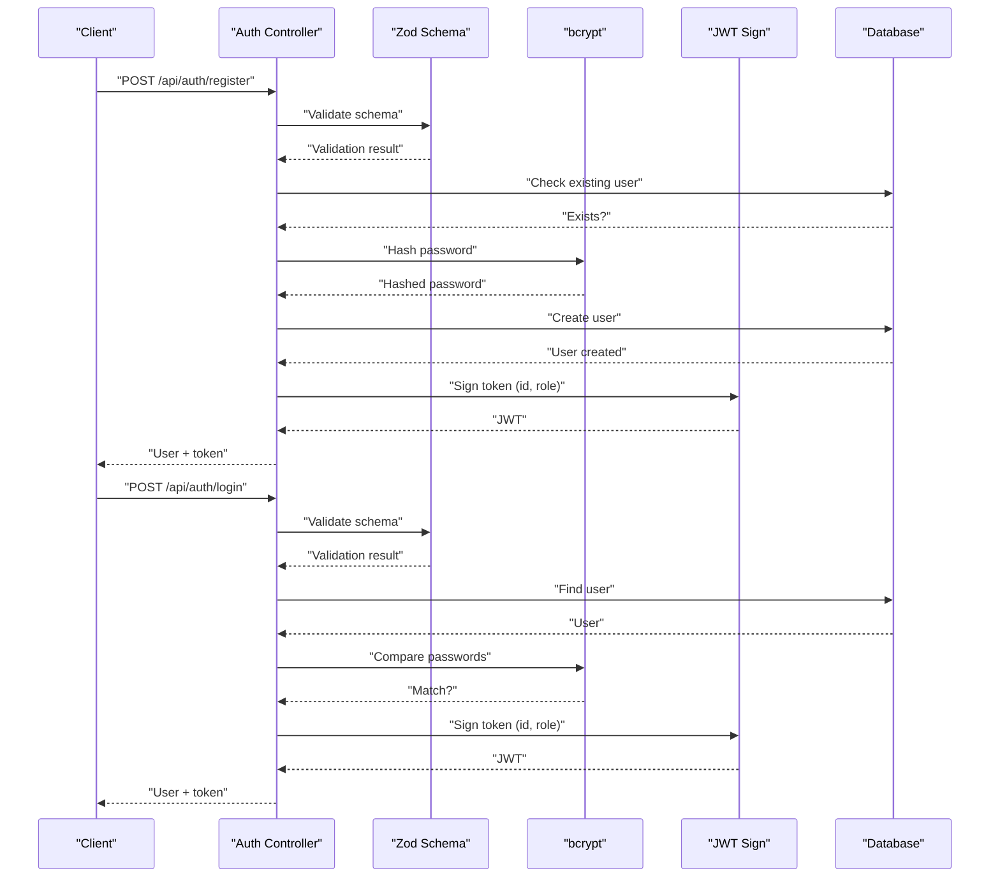
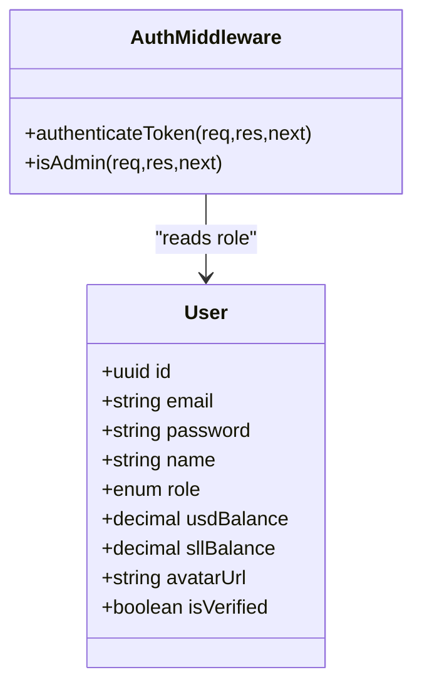
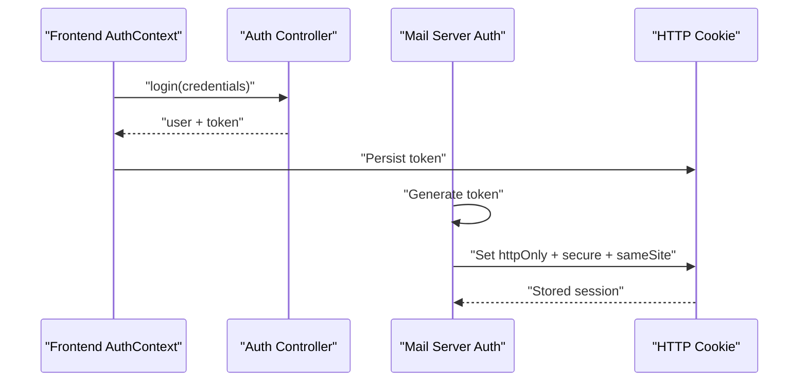
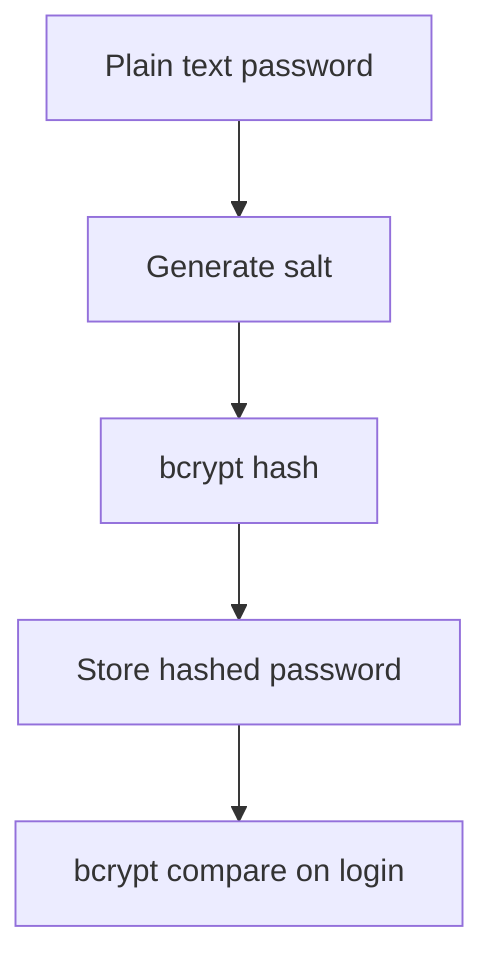
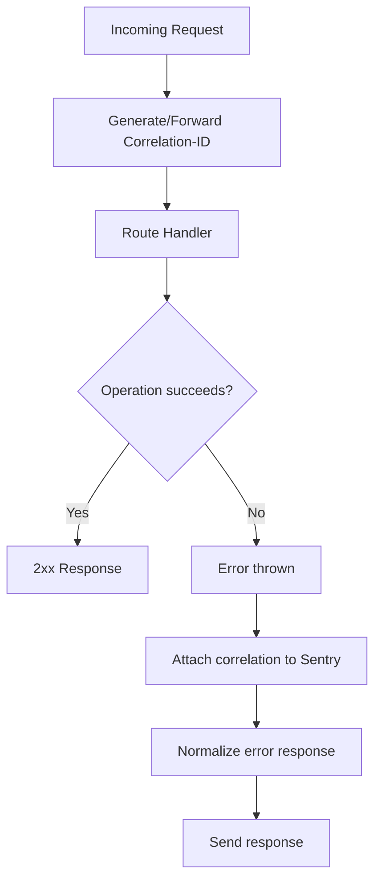
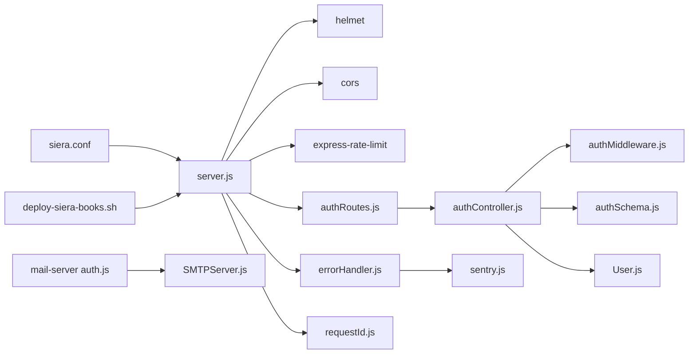

# Security and Compliance

<cite>
**Referenced Files in This Document**
- [authMiddleware.js](file://backend/middleware/authMiddleware.js)
- [authController.js](file://backend/controllers/authController.js)
- [authSchema.js](file://backend/validation/authSchema.js)
- [authRoutes.js](file://backend/routes/authRoutes.js)
- [server.js](file://backend/server.js)
- [errorHandler.js](file://backend/middleware/errorHandler.js)
- [requestId.js](file://backend/middleware/requestId.js)
- [sentry.js](file://backend/utils/sentry.js)
- [User.js](file://backend/models/User.js)
- [AuditLog.js](file://backend/models/AuditLog.js)
- [AuthContext.tsx](file://frontend/src/contexts/AuthContext.tsx)
- [USER_ROLES.md](file://docs/USER_ROLES.md)
- [siera.conf](file://infrastructure/nginx/siera.conf)
- [deploy-siera-books.sh](file://infrastructure/deploy-siera-books.sh)
- [SMTPServer.js](file://mail-server/src/smtp/SMTPServer.js)
- [auth.js](file://mail-server/src/web/middleware/auth.js)
- [validation.js](file://mail-server/src/web/public/js/utils/validation.js)
</cite>

## Table of Contents
1. [Introduction](#introduction)
2. [Project Structure](#project-structure)
3. [Core Components](#core-components)
4. [Architecture Overview](#architecture-overview)
5. [Detailed Component Analysis](#detailed-component-analysis)
6. [Dependency Analysis](#dependency-analysis)
7. [Performance Considerations](#performance-considerations)
8. [Troubleshooting Guide](#troubleshooting-guide)
9. [Conclusion](#conclusion)
10. [Appendices](#appendices)

## Introduction
This document provides comprehensive security and compliance guidance for the platform. It covers authentication and authorization, role-based access control (RBAC), session management, data protection, secure communications, error handling security patterns, input validation, and protections against common vulnerabilities. It also outlines compliance considerations for education platforms, data privacy regulations, and security audit procedures, along with best practices, threat modeling, and incident response procedures.

## Project Structure
Security-relevant components span the backend API, frontend authentication context, Nginx configuration, deployment scripts, and supporting services such as the mail server. The backend enforces authentication via middleware, validates inputs with schema-based validators, centralizes error handling, and logs with correlation IDs. Frontend manages authentication state and tokens. Nginx provides reverse proxy capabilities and optional secure link enforcement for protected assets. Deployment scripts generate secrets and configure environment variables.

**Diagram sources**
- [server.js:18-56](file://backend/server.js#L18-L56)
- [authMiddleware.js:3-35](file://backend/middleware/authMiddleware.js#L3-L35)
- [authController.js:21-107](file://backend/controllers/authController.js#L21-L107)
- [authSchema.js:1-18](file://backend/validation/authSchema.js#L1-L18)
- [User.js:1-50](file://backend/models/User.js#L1-L50)
- [AuditLog.js:1-30](file://backend/models/AuditLog.js#L1-L30)
- [errorHandler.js:5-41](file://backend/middleware/errorHandler.js#L5-L41)
- [authRoutes.js:1-11](file://backend/routes/authRoutes.js#L1-L11)
- [siera.conf:142-182](file://infrastructure/nginx/siera.conf#L142-L182)
- [deploy-siera-books.sh:84-132](file://infrastructure/deploy-siera-books.sh#L84-L132)
- [SMTPServer.js:199-228](file://mail-server/src/smtp/SMTPServer.js#L199-L228)
- [auth.js:158-194](file://mail-server/src/web/middleware/auth.js#L158-L194)

**Section sources**
- [server.js:18-155](file://backend/server.js#L18-L155)
- [authMiddleware.js:3-35](file://backend/middleware/authMiddleware.js#L3-L35)
- [authController.js:21-107](file://backend/controllers/authController.js#L21-L107)
- [authSchema.js:1-18](file://backend/validation/authSchema.js#L1-L18)
- [User.js:1-50](file://backend/models/User.js#L1-L50)
- [AuditLog.js:1-30](file://backend/models/AuditLog.js#L1-L30)
- [errorHandler.js:5-41](file://backend/middleware/errorHandler.js#L5-L41)
- [authRoutes.js:1-11](file://backend/routes/authRoutes.js#L1-L11)
- [siera.conf:142-182](file://infrastructure/nginx/siera.conf#L142-L182)
- [deploy-siera-books.sh:84-132](file://infrastructure/deploy-siera-books.sh#L84-L132)
- [SMTPServer.js:199-228](file://mail-server/src/smtp/SMTPServer.js#L199-L228)
- [auth.js:158-194](file://mail-server/src/web/middleware/auth.js#L158-L194)

## Core Components
- Authentication middleware verifies JWT tokens and attaches user identity to requests. It enforces HS256 algorithm and rejects missing or invalid tokens.
- Auth controller implements registration and login with Zod schema validation, bcrypt password hashing, and JWT issuance with a configurable expiration.
- Validation schemas define strict input requirements for registration and login.
- Frontend AuthContext coordinates login, registration, and logout flows and persists user state.
- Error handling middleware integrates Sentry, attaches correlation IDs, and normalizes responses across environments.
- Request ID middleware ensures every request has a unique correlation ID for tracing.
- Nginx configuration supports reverse proxying and includes commented secure link directives for protected asset delivery.
- Deployment script generates secrets and environment variables for cryptographic keys and platform configuration.
- Models define the User entity with role enumeration and AuditLog for administrative actions.
- Mail server implements a secure SMTP server with TLS and session management including cookies with secure flags.

**Section sources**
- [authMiddleware.js:3-35](file://backend/middleware/authMiddleware.js#L3-L35)
- [authController.js:21-107](file://backend/controllers/authController.js#L21-L107)
- [authSchema.js:1-18](file://backend/validation/authSchema.js#L1-L18)
- [AuthContext.tsx:16-72](file://frontend/src/contexts/AuthContext.tsx#L16-L72)
- [errorHandler.js:5-41](file://backend/middleware/errorHandler.js#L5-L41)
- [requestId.js:7-12](file://backend/middleware/requestId.js#L7-L12)
- [siera.conf:142-182](file://infrastructure/nginx/siera.conf#L142-L182)
- [deploy-siera-books.sh:84-132](file://infrastructure/deploy-siera-books.sh#L84-L132)
- [User.js:26-28](file://backend/models/User.js#L26-L28)
- [AuditLog.js:10-25](file://backend/models/AuditLog.js#L10-L25)
- [SMTPServer.js:199-228](file://mail-server/src/smtp/SMTPServer.js#L199-L228)
- [auth.js:158-194](file://mail-server/src/web/middleware/auth.js#L158-L194)

## Architecture Overview
The authentication and authorization architecture centers on JWT-based stateless sessions with role checks. Requests are validated by schema-based middleware, authenticated by the auth middleware, and protected by route-level guards. Errors are normalized and correlated across services. Nginx proxies requests and optionally secures asset delivery. Secrets are generated during deployment.

**Diagram sources**
- [authMiddleware.js:3-35](file://backend/middleware/authMiddleware.js#L3-L35)
- [authController.js:30-107](file://backend/controllers/authController.js#L30-L107)
- [authRoutes.js:1-11](file://backend/routes/authRoutes.js#L1-L11)
- [server.js:110-150](file://backend/server.js#L110-L150)

## Detailed Component Analysis

### Authentication Middleware
- Token extraction: Reads Authorization header and expects Bearer scheme.
- Verification: Uses HS256 with a configured secret; rejects missing or invalid tokens.
- Role enforcement: Provides an admin guard that checks user role before allowing access.

**Diagram sources**
- [authMiddleware.js:3-25](file://backend/middleware/authMiddleware.js#L3-L25)

**Section sources**
- [authMiddleware.js:3-35](file://backend/middleware/authMiddleware.js#L3-L35)

### Auth Controller and Input Validation
- Registration and login endpoints use Zod schemas to validate inputs before processing.
- Passwords are hashed with bcrypt; tokens are issued with role and id claims.
- Startup-time validation ensures JWT_SECRET is present in production.

**Diagram sources**
- [authController.js:30-107](file://backend/controllers/authController.js#L30-L107)
- [authSchema.js:1-18](file://backend/validation/authSchema.js#L1-L18)

**Section sources**
- [authController.js:21-107](file://backend/controllers/authController.js#L21-L107)
- [authSchema.js:1-18](file://backend/validation/authSchema.js#L1-L18)

### Role-Based Access Control (RBAC)
- User model defines an ENUM role with values including user, seller, and admin.
- Admin guard middleware restricts routes to admin role only.
- Documentation defines role permissions and responsibility matrices.

**Diagram sources**
- [User.js:26-28](file://backend/models/User.js#L26-L28)
- [authMiddleware.js:27-33](file://backend/middleware/authMiddleware.js#L27-L33)

**Section sources**
- [User.js:26-28](file://backend/models/User.js#L26-L28)
- [authMiddleware.js:27-33](file://backend/middleware/authMiddleware.js#L27-L33)
- [USER_ROLES.md:94-140](file://docs/USER_ROLES.md#L94-L140)

### Session Management
- Frontend authentication context stores user state and coordinates login/logout.
- Mail server implements secure sessions with HTTP-only, secure, and same-site cookies and tracks session metadata.

**Diagram sources**
- [AuthContext.tsx:28-57](file://frontend/src/contexts/AuthContext.tsx#L28-L57)
- [auth.js:158-194](file://mail-server/src/web/middleware/auth.js#L158-L194)

**Section sources**
- [AuthContext.tsx:16-72](file://frontend/src/contexts/AuthContext.tsx#L16-L72)
- [auth.js:158-194](file://mail-server/src/web/middleware/auth.js#L158-L194)

### Data Protection and Encryption
- Passwords are hashed with bcrypt before storage.
- JWT_SECRET and other secrets are generated during deployment.
- TLS-enabled SMTP server secures mail transport.

**Diagram sources**
- [authController.js:52-98](file://backend/controllers/authController.js#L52-L98)
- [deploy-siera-books.sh:94-98](file://infrastructure/deploy-siera-books.sh#L94-L98)
- [SMTPServer.js:199-228](file://mail-server/src/smtp/SMTPServer.js#L199-L228)

**Section sources**
- [authController.js:52-98](file://backend/controllers/authController.js#L52-L98)
- [deploy-siera-books.sh:94-98](file://infrastructure/deploy-siera-books.sh#L94-L98)
- [SMTPServer.js:199-228](file://mail-server/src/smtp/SMTPServer.js#L199-L228)

### Secure Communication Protocols
- Nginx configuration supports reverse proxying and includes commented secure link blocks for protected asset delivery.
- SMTP server listens securely with TLS options.

**Section sources**
- [siera.conf:142-182](file://infrastructure/nginx/siera.conf#L142-L182)
- [SMTPServer.js:199-228](file://mail-server/src/smtp/SMTPServer.js#L199-L228)

### Sensitive Data Handling
- Frontend avoids storing secrets; tokens are stored in HTTP-only cookies where applicable.
- Input sanitization utilities are present in the mail web interface to mitigate XSS risks.

**Section sources**
- [auth.js:158-194](file://mail-server/src/web/middleware/auth.js#L158-L194)
- [validation.js:447-487](file://mail-server/src/web/public/js/utils/validation.js#L447-L487)

### Error Handling Security Patterns
- Centralized error handler integrates Sentry, attaches correlation IDs, and masks internal errors in production.
- Request ID middleware ensures traceability across services.

**Diagram sources**
- [requestId.js:7-12](file://backend/middleware/requestId.js#L7-L12)
- [errorHandler.js:5-41](file://backend/middleware/errorHandler.js#L5-L41)
- [sentry.js:3-21](file://backend/utils/sentry.js#L3-L21)

**Section sources**
- [requestId.js:7-12](file://backend/middleware/requestId.js#L7-L12)
- [errorHandler.js:5-41](file://backend/middleware/errorHandler.js#L5-L41)
- [sentry.js:3-21](file://backend/utils/sentry.js#L3-L21)

### Input Validation and Protection Against Common Vulnerabilities
- Zod schemas enforce minimum length and format for registration and login inputs.
- Frontend validation utilities sanitize HTML and input values to reduce XSS risk.
- Rate limiting is applied at the Express layer to mitigate brute force and abuse.

**Section sources**
- [authSchema.js:1-18](file://backend/validation/authSchema.js#L1-L18)
- [validation.js:447-487](file://mail-server/src/web/public/js/utils/validation.js#L447-L487)
- [server.js:49-55](file://backend/server.js#L49-L55)

### Compliance Considerations for Education Platforms
- Role-based access control and audit logging align with data minimization and accountability.
- Administrative actions are recorded with structured audit logs.
- Documentation outlines privacy and payment security considerations.

**Section sources**
- [AuditLog.js:10-25](file://backend/models/AuditLog.js#L10-L25)
- [USER_ROLES.md:350-373](file://docs/USER_ROLES.md#L350-L373)

### Security Audit Procedures
- Centralized error handling and correlation IDs enable effective incident investigation.
- Audit logs capture admin actions for review.
- Environment validation and secret generation during deployment improve operational security.

**Section sources**
- [errorHandler.js:5-41](file://backend/middleware/errorHandler.js#L5-L41)
- [AuditLog.js:10-25](file://backend/models/AuditLog.js#L10-L25)
- [deploy-siera-books.sh:11-16](file://infrastructure/deploy-siera-books.sh#L11-L16)

## Dependency Analysis

**Diagram sources**
- [server.js:18-150](file://backend/server.js#L18-L150)
- [authRoutes.js:1-11](file://backend/routes/authRoutes.js#L1-L11)
- [authController.js:1-121](file://backend/controllers/authController.js#L1-L121)
- [authMiddleware.js:1-36](file://backend/middleware/authMiddleware.js#L1-L36)
- [authSchema.js:1-18](file://backend/validation/authSchema.js#L1-L18)
- [User.js:1-50](file://backend/models/User.js#L1-L50)
- [errorHandler.js:1-44](file://backend/middleware/errorHandler.js#L1-L44)
- [requestId.js:1-15](file://backend/middleware/requestId.js#L1-L15)
- [sentry.js:1-22](file://backend/utils/sentry.js#L1-L22)
- [siera.conf:142-182](file://infrastructure/nginx/siera.conf#L142-L182)
- [deploy-siera-books.sh:84-132](file://infrastructure/deploy-siera-books.sh#L84-L132)
- [auth.js:158-194](file://mail-server/src/web/middleware/auth.js#L158-L194)
- [SMTPServer.js:199-228](file://mail-server/src/smtp/SMTPServer.js#L199-L228)

**Section sources**
- [server.js:18-150](file://backend/server.js#L18-L150)
- [authRoutes.js:1-11](file://backend/routes/authRoutes.js#L1-L11)
- [authController.js:1-121](file://backend/controllers/authController.js#L1-L121)
- [authMiddleware.js:1-36](file://backend/middleware/authMiddleware.js#L1-L36)
- [authSchema.js:1-18](file://backend/validation/authSchema.js#L1-L18)
- [User.js:1-50](file://backend/models/User.js#L1-L50)
- [errorHandler.js:1-44](file://backend/middleware/errorHandler.js#L1-L44)
- [requestId.js:1-15](file://backend/middleware/requestId.js#L1-L15)
- [sentry.js:1-22](file://backend/utils/sentry.js#L1-L22)
- [siera.conf:142-182](file://infrastructure/nginx/siera.conf#L142-L182)
- [deploy-siera-books.sh:84-132](file://infrastructure/deploy-siera-books.sh#L84-L132)
- [auth.js:158-194](file://mail-server/src/web/middleware/auth.js#L158-L194)
- [SMTPServer.js:199-228](file://mail-server/src/smtp/SMTPServer.js#L199-L228)

## Performance Considerations
- Rate limiting reduces load and mitigates abuse.
- Centralized logging and correlation IDs improve observability without impacting throughput.
- JWT verification is lightweight; ensure secret rotation policies are established.

[No sources needed since this section provides general guidance]

## Troubleshooting Guide
- 401 Unauthorized on protected routes indicates missing or invalid Authorization header or token verification failure.
- 403 Forbidden indicates insufficient role (admin) for the requested route.
- Production errors are masked; use correlation IDs to trace issues in Sentry and logs.
- Environment validation warnings indicate missing configuration variables.

**Section sources**
- [authMiddleware.js:6-24](file://backend/middleware/authMiddleware.js#L6-L24)
- [authMiddleware.js:27-33](file://backend/middleware/authMiddleware.js#L27-L33)
- [errorHandler.js:17-41](file://backend/middleware/errorHandler.js#L17-L41)
- [server.js:11-16](file://backend/server.js#L11-L16)

## Conclusion
The platform implements a robust foundation for authentication, authorization, and error handling. JWT-based sessions, schema-driven validation, and centralized error management provide strong security controls. RBAC and audit logging support compliance and governance. Additional hardening measures include secret rotation, secure cookie policies, and secure asset delivery via Nginx. Operational excellence is supported by correlation IDs, Sentry integration, and environment validation.

[No sources needed since this section summarizes without analyzing specific files]

## Appendices

### Best Practices
- Enforce HTTPS everywhere and rotate secrets periodically.
- Implement 2FA for privileged roles.
- Apply principle of least privilege and review permissions regularly.
- Log and monitor all administrative actions.

[No sources needed since this section provides general guidance]

### Threat Modeling
- JWT token theft: Mitigate via short-lived tokens, secure storage, and rate limiting.
- Brute force attacks: Enforce rate limits and account lockouts.
- XSS: Sanitize inputs and escape outputs; use CSP headers.
- Privilege escalation: Strict RBAC and audit trails.

[No sources needed since this section provides general guidance]

### Incident Response Procedures
- Isolate affected systems, rotate secrets, and re-authenticate users.
- Investigate using correlation IDs and Sentry events.
- Document and escalate according to policy.

[No sources needed since this section provides general guidance]