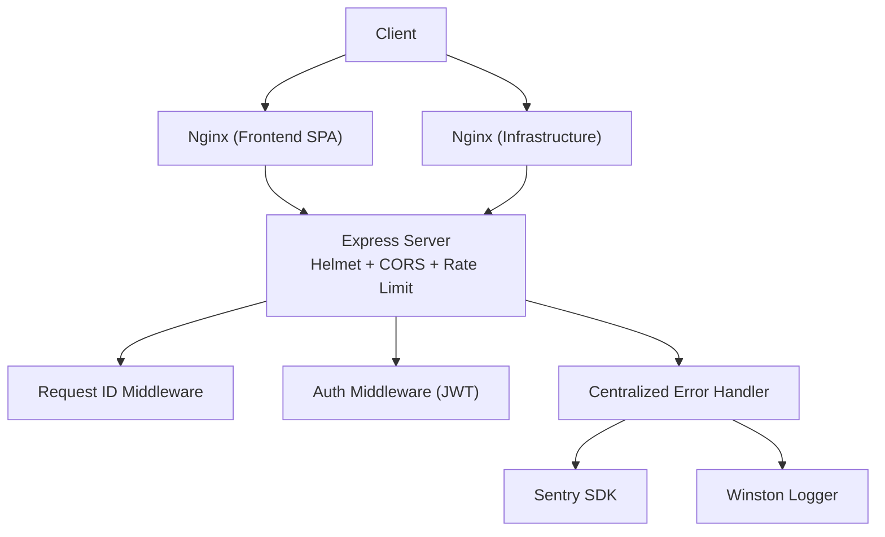
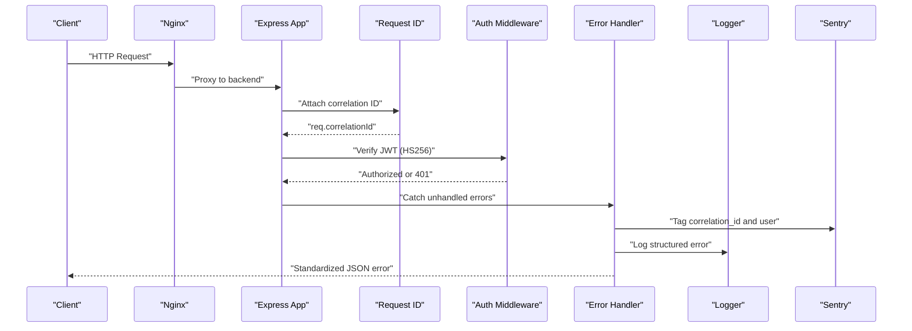
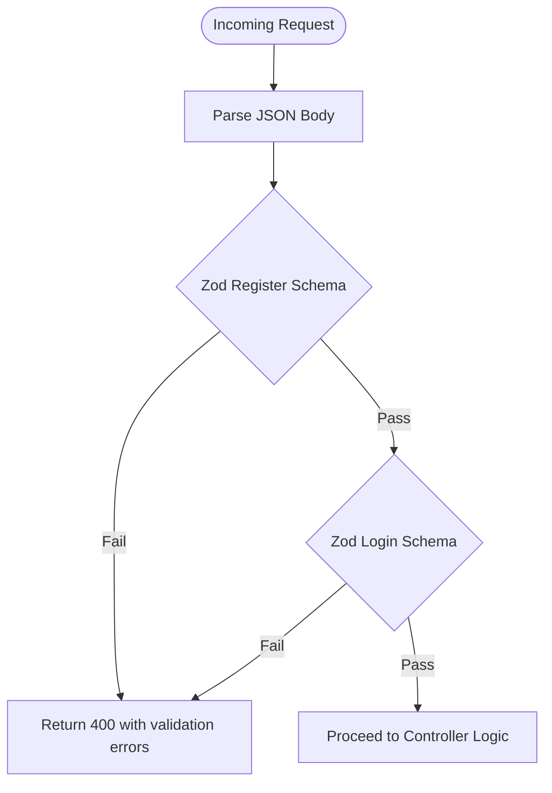
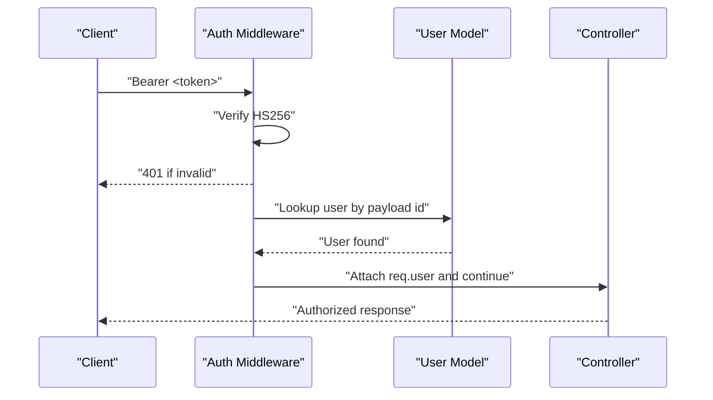
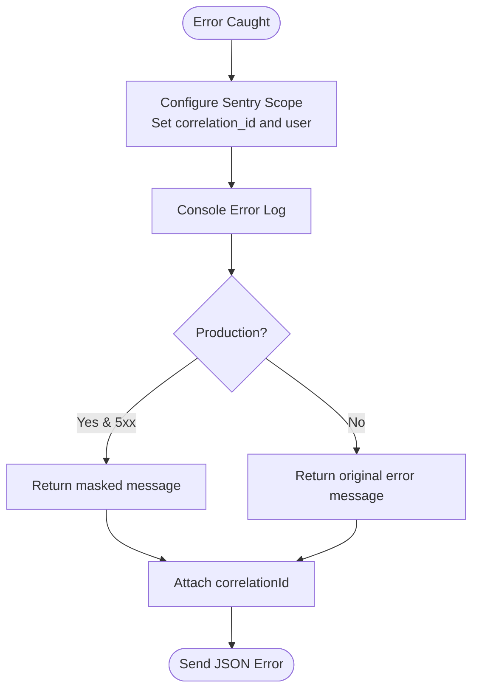
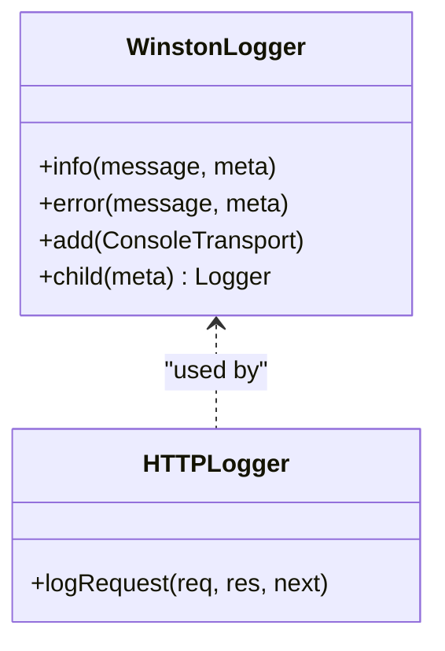
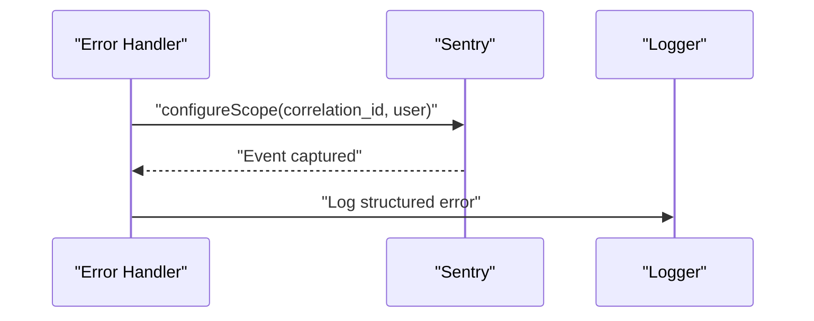
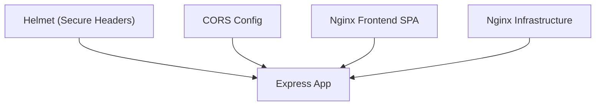
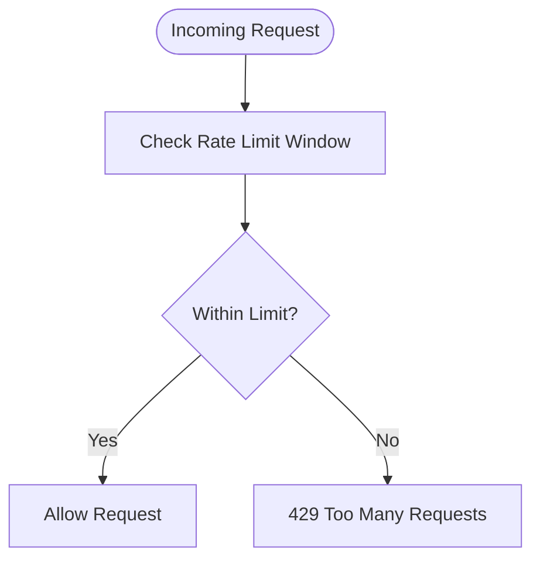
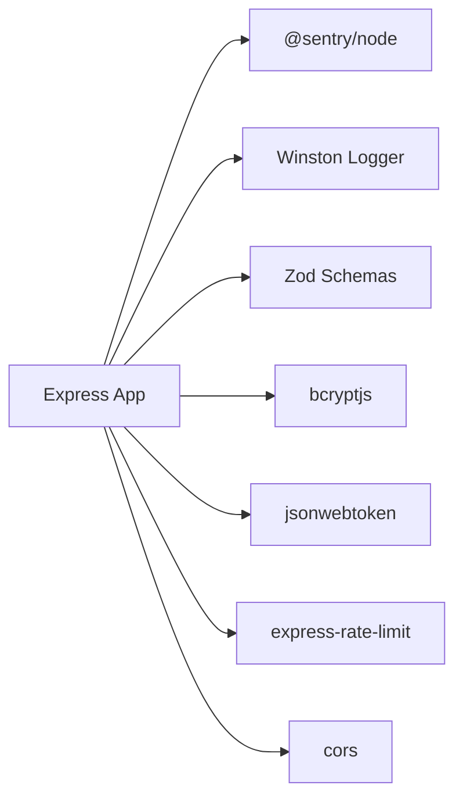

# Vulnerability Protection and Error Handling

<cite>
**Referenced Files in This Document**
- [server.js](file://backend/server.js)
- [errorHandler.js](file://backend/middleware/errorHandler.js)
- [authMiddleware.js](file://backend/middleware/authMiddleware.js)
- [requestId.js](file://backend/middleware/requestId.js)
- [logger.js](file://backend/utils/logger.js)
- [sentry.js](file://backend/utils/sentry.js)
- [authSchema.js](file://backend/validation/authSchema.js)
- [authController.js](file://backend/controllers/authController.js)
- [adminController.js](file://backend/controllers/adminController.js)
- [nginx.conf](file://frontend/nginx.conf)
- [nginx.conf](file://infrastructure/nginx/nginx.conf)
- [email-config.yaml](file://config/email-config.yaml)
</cite>

## Table of Contents
1. [Introduction](#introduction)
2. [Project Structure](#project-structure)
3. [Core Components](#core-components)
4. [Architecture Overview](#architecture-overview)
5. [Detailed Component Analysis](#detailed-component-analysis)
6. [Dependency Analysis](#dependency-analysis)
7. [Performance Considerations](#performance-considerations)
8. [Troubleshooting Guide](#troubleshooting-guide)
9. [Conclusion](#conclusion)
10. [Appendices](#appendices)

## Introduction
This document provides comprehensive vulnerability protection guidance for the backend API and related services. It covers input validation patterns, authentication and authorization controls, centralized error handling, sensitive data filtering in error responses, security logging, Sentry integration, CORS and secure headers, rate limiting, DDoS and brute-force mitigations, and security scanning integration. The goal is to help teams implement robust defenses against common web application threats while maintaining operational visibility and reliability.

## Project Structure
The backend API is implemented as an Express server with layered middleware for request correlation, security headers, CORS, rate limiting, and centralized error handling. Validation is enforced using Zod schemas. Authentication relies on signed JWT tokens with strict algorithm enforcement. Logging is handled via Winston with structured JSON output, and error telemetry is integrated with Sentry. Supporting infrastructure includes Nginx for reverse proxying and static serving, and YAML-based email system configuration for compliance and operational controls.

**Diagram sources**
- [server.js:18-56](file://backend/server.js#L18-L56)
- [requestId.js:7-12](file://backend/middleware/requestId.js#L7-L12)
- [authMiddleware.js:3-25](file://backend/middleware/authMiddleware.js#L3-L25)
- [errorHandler.js:5-41](file://backend/middleware/errorHandler.js#L5-L41)
- [logger.js:21-31](file://backend/utils/logger.js#L21-L31)
- [sentry.js:3-16](file://backend/utils/sentry.js#L3-L16)

**Section sources**
- [server.js:18-56](file://backend/server.js#L18-L56)
- [requestId.js:7-12](file://backend/middleware/requestId.js#L7-L12)
- [authMiddleware.js:3-25](file://backend/middleware/authMiddleware.js#L3-L25)
- [errorHandler.js:5-41](file://backend/middleware/errorHandler.js#L5-L41)
- [logger.js:21-31](file://backend/utils/logger.js#L21-L31)
- [sentry.js:3-16](file://backend/utils/sentry.js#L3-L16)

## Core Components
- Request correlation and tracing: A middleware generates or preserves a correlation ID for end-to-end request tracking across services.
- Authentication and authorization: JWT-based authentication with strict HS256 verification and role-based access control for admin endpoints.
- Input validation: Zod schemas enforce shape and constraints for registration and login requests.
- Centralized error handling: Unified error response formatting, environment-aware messages, and correlation ID injection.
- Security headers and CORS: Helmet applied globally; CORS configured with allowed origins, methods, headers, and credentials.
- Rate limiting: Global request throttling to mitigate abuse and DDoS-like scenarios.
- Logging and telemetry: Structured JSON logs with Winston; Sentry initialization and error tagging with correlation ID.
- Infrastructure: Nginx reverse proxying and static asset serving; YAML-based email system configuration for compliance and rate limits.

**Section sources**
- [requestId.js:7-12](file://backend/middleware/requestId.js#L7-L12)
- [authMiddleware.js:3-33](file://backend/middleware/authMiddleware.js#L3-L33)
- [authSchema.js:3-12](file://backend/validation/authSchema.js#L3-L12)
- [errorHandler.js:5-41](file://backend/middleware/errorHandler.js#L5-L41)
- [server.js:22-28](file://backend/server.js#L22-L28)
- [server.js:50-55](file://backend/server.js#L50-L55)
- [logger.js:21-31](file://backend/utils/logger.js#L21-L31)
- [sentry.js:3-16](file://backend/utils/sentry.js#L3-L16)
- [nginx.conf:16-40](file://frontend/nginx.conf#L16-L40)
- [nginx.conf:21-47](file://infrastructure/nginx/nginx.conf#L21-L47)
- [email-config.yaml:106-118](file://config/email-config.yaml#L106-L118)

## Architecture Overview
The backend enforces security at the gateway and within the application layer. Requests traverse Nginx proxies, then Express middleware, authentication, route handlers, and finally centralized error handling and logging. Sentry captures errors and attaches correlation IDs for traceability.

**Diagram sources**
- [server.js:18-56](file://backend/server.js#L18-L56)
- [requestId.js:7-12](file://backend/middleware/requestId.js#L7-L12)
- [authMiddleware.js:3-25](file://backend/middleware/authMiddleware.js#L3-L25)
- [errorHandler.js:5-41](file://backend/middleware/errorHandler.js#L5-L41)
- [logger.js:21-31](file://backend/utils/logger.js#L21-L31)
- [sentry.js:3-16](file://backend/utils/sentry.js#L3-L16)

## Detailed Component Analysis

### Input Validation Patterns
- Registration and login payloads are validated using Zod schemas to ensure required fields, length constraints, and format correctness.
- Validation failures return structured JSON with error details and a 400 status, preventing downstream processing of malformed data.

**Diagram sources**
- [authSchema.js:3-12](file://backend/validation/authSchema.js#L3-L12)
- [authController.js:33-83](file://backend/controllers/authController.js#L33-L83)

**Section sources**
- [authSchema.js:3-12](file://backend/validation/authSchema.js#L3-L12)
- [authController.js:33-83](file://backend/controllers/authController.js#L33-L83)

### Authentication and Authorization Controls
- JWT verification enforces HS256 exclusively, mitigating algorithm downgrade attacks.
- Admin-only routes check user role to restrict access to privileged actions.
- Controllers exclude sensitive fields (e.g., passwords) from responses.

**Diagram sources**
- [authMiddleware.js:3-25](file://backend/middleware/authMiddleware.js#L3-L25)
- [authController.js:112-121](file://backend/controllers/authController.js#L112-L121)

**Section sources**
- [authMiddleware.js:3-33](file://backend/middleware/authMiddleware.js#L3-L33)
- [authController.js:112-121](file://backend/controllers/authController.js#L112-L121)

### Centralized Error Handling and Sensitive Data Filtering
- The error handler:
  - Attaches correlation ID and user identity to Sentry scope.
  - Logs errors with environment-aware messages.
  - Returns standardized JSON responses, masking internal server errors in production.
  - Preserves existing response objects when present.
- Sensitive data filtering:
  - Passwords are excluded from controller responses.
  - Error messages are sanitized in production to avoid leaking internal details.

**Diagram sources**
- [errorHandler.js:5-41](file://backend/middleware/errorHandler.js#L5-L41)
- [logger.js:14-15](file://backend/utils/logger.js#L14-L15)

**Section sources**
- [errorHandler.js:5-41](file://backend/middleware/errorHandler.js#L5-L41)
- [logger.js:14-15](file://backend/utils/logger.js#L14-L15)
- [authController.js:114-116](file://backend/controllers/authController.js#L114-L116)

### Security Logging Practices
- Winston structured logging with JSON format, timestamps, and service tagging.
- Separate transports for error and general logs with rotation and retention.
- HTTP request logging includes correlation ID, method, URL, status, duration, and client IP.
- Exception and rejection handlers capture uncaught conditions for diagnostics.

**Diagram sources**
- [logger.js:21-31](file://backend/utils/logger.js#L21-L31)
- [logger.js:33-44](file://backend/utils/logger.js#L33-L44)
- [server.js:32-47](file://backend/server.js#L32-L47)

**Section sources**
- [logger.js:21-31](file://backend/utils/logger.js#L21-L31)
- [logger.js:33-44](file://backend/utils/logger.js#L33-L44)
- [server.js:32-47](file://backend/server.js#L32-L47)

### Sentry Integration for Error Monitoring and Incident Detection
- Sentry is initialized when a DSN is present, setting environment and trace sampling.
- The error handler tags correlation ID and user identity to correlate logs with Sentry events.
- Production-safe error messages prevent sensitive data exposure while preserving observability.

**Diagram sources**
- [sentry.js:3-16](file://backend/utils/sentry.js#L3-L16)
- [errorHandler.js:5-12](file://backend/middleware/errorHandler.js#L5-L12)
- [logger.js:14-15](file://backend/utils/logger.js#L14-L15)

**Section sources**
- [sentry.js:3-16](file://backend/utils/sentry.js#L3-L16)
- [errorHandler.js:5-12](file://backend/middleware/errorHandler.js#L5-L12)
- [logger.js:14-15](file://backend/utils/logger.js#L14-L15)

### CORS Policy Configuration and Secure Headers
- CORS allows specific origins, methods, headers, credentials, and preflight caching.
- Helmet is applied globally to set secure HTTP headers (e.g., HSTS, CSP, XSS protections).
- Nginx reverse proxy configuration routes API traffic to backend services and serves static assets.

**Diagram sources**
- [server.js:21-28](file://backend/server.js#L21-L28)
- [server.js:19-21](file://backend/server.js#L19-L21)
- [nginx.conf:16-40](file://frontend/nginx.conf#L16-L40)
- [nginx.conf:21-47](file://infrastructure/nginx/nginx.conf#L21-L47)

**Section sources**
- [server.js:21-28](file://backend/server.js#L21-L28)
- [server.js:19-21](file://backend/server.js#L19-L21)
- [nginx.conf:16-40](file://frontend/nginx.conf#L16-L40)
- [nginx.conf:21-47](file://infrastructure/nginx/nginx.conf#L21-L47)

### Rate Limiting Implementation
- A global rate limiter caps requests per IP over a sliding window.
- Standard headers are enabled for client awareness of limits.
- Additional service-specific rate limiting is present in supporting services (e.g., mail server).

**Diagram sources**
- [server.js:50-55](file://backend/server.js#L50-L55)

**Section sources**
- [server.js:50-55](file://backend/server.js#L50-L55)

### DDoS Protection and Brute Force Attack Prevention
- Global rate limiting reduces impact of sustained abusive traffic.
- JWT verification with HS256 and short-lived tokens helps mitigate token replay risks.
- Admin endpoints enforce role checks to limit blast radius of compromised sessions.
- Nginx acts as a reverse proxy and can be tuned for timeouts and connection limits.

**Section sources**
- [server.js:50-55](file://backend/server.js#L50-L55)
- [authMiddleware.js:3-25](file://backend/middleware/authMiddleware.js#L3-L25)
- [adminController.js:27-33](file://backend/controllers/adminController.js#L27-L33)
- [nginx.conf:21-47](file://infrastructure/nginx/nginx.conf#L21-L47)

### Security Scanning Integration
- Static analysis and linting configurations exist across services (e.g., ESLint configs).
- CI workflows orchestrate backend builds and tests; integrate security scans (SAST/SCA) into these jobs to detect vulnerabilities early.

**Section sources**
- [email-config.yaml:1-282](file://config/email-config.yaml#L1-L282)

### Content Security Policies and Secure Headers
- Helmet applies secure defaults for CSP, X-Frame-Options, X-Content-Type-Options, and HSTS.
- CSP directives can be customized per service; ensure they align with frontend asset delivery and third-party integrations.

**Section sources**
- [server.js:21-21](file://backend/server.js#L21-L21)

### Request Tracing and Correlation
- A correlation ID is attached to each request and returned in responses and logs, enabling end-to-end tracing across services.

**Section sources**
- [requestId.js:7-12](file://backend/middleware/requestId.js#L7-L12)
- [errorHandler.js:7-11](file://backend/middleware/errorHandler.js#L7-L11)

## Dependency Analysis
The backend’s security posture depends on several key dependencies and their correct configuration:
- Express middleware chain: request ID → auth → routes → error handler → logging/Sentry.
- Environment variables: JWT_SECRET, SENTRY_DSN, FRONTEND_URL, DB_*.
- Third-party libraries: helmet, cors, express-rate-limit, winston, @sentry/node, zod, bcryptjs, jsonwebtoken.

**Diagram sources**
- [server.js:3-5](file://backend/server.js#L3-L5)
- [errorHandler.js:3-3](file://backend/middleware/errorHandler.js#L3-L3)
- [logger.js:1-3](file://backend/utils/logger.js#L1-L3)
- [authSchema.js:1-1](file://backend/validation/authSchema.js#L1-L1)
- [authController.js:1-3](file://backend/controllers/authController.js#L1-L3)

**Section sources**
- [server.js:3-5](file://backend/server.js#L3-L5)
- [errorHandler.js:3-3](file://backend/middleware/errorHandler.js#L3-L3)
- [logger.js:1-3](file://backend/utils/logger.js#L1-L3)
- [authSchema.js:1-1](file://backend/validation/authSchema.js#L1-L1)
- [authController.js:1-3](file://backend/controllers/authController.js#L1-L3)

## Performance Considerations
- Keep rate limit windows and counts aligned with expected traffic patterns to avoid false positives.
- Use structured logging efficiently; avoid excessive metadata to reduce overhead.
- Initialize Sentry only when DSN is present to avoid unnecessary overhead in non-production environments.
- Tune Nginx worker connections and proxy timeouts to handle bursts without resource exhaustion.

## Troubleshooting Guide
- Missing JWT_SECRET in production: The auth controller enforces startup validation and refuses to start without a proper secret in production.
- Sentry disabled: If SENTRY_DSN is not set, initialization is skipped with a warning; enable the DSN to activate error tracking.
- CORS errors: Verify allowed origins, methods, and headers match frontend requests; confirm credentials are enabled when cookies or auth headers are used.
- Rate limiting: If clients receive 429 responses unexpectedly, review windowMs and max values; consider per-route customization for sensitive endpoints.
- Audit logs: Administrative actions are recorded; ensure database connectivity and permissions for AuditLog writes.

**Section sources**
- [authController.js:8-19](file://backend/controllers/authController.js#L8-L19)
- [sentry.js:6-9](file://backend/utils/sentry.js#L6-L9)
- [server.js:22-28](file://backend/server.js#L22-L28)
- [server.js:50-55](file://backend/server.js#L50-L55)
- [adminController.js:8-20](file://backend/controllers/adminController.js#L8-L20)

## Conclusion
The backend implements a layered security model with strong input validation, strict authentication, centralized error handling, structured logging, and telemetry integration. By enforcing CORS and secure headers, applying rate limiting, and maintaining robust audit trails, the system reduces exposure to common web vulnerabilities. Integrating security scanning into CI and continuously reviewing configurations will further strengthen resilience.

## Appendices
- Email system configuration includes operational controls such as rate limits, compliance settings, and monitoring thresholds that inform broader security and risk management practices.

**Section sources**
- [email-config.yaml:106-118](file://config/email-config.yaml#L106-L118)
- [email-config.yaml:142-169](file://config/email-config.yaml#L142-L169)
- [email-config.yaml:119-137](file://config/email-config.yaml#L119-L137)