# Backend Architecture

<cite>
**Referenced Files in This Document**
- [server.js](file://backend/server.js)
- [package.json](file://backend/package.json)
- [models/index.js](file://backend/models/index.js)
- [middleware/authMiddleware.js](file://backend/middleware/authMiddleware.js)
- [middleware/errorHandler.js](file://backend/middleware/errorHandler.js)
- [middleware/asyncHandler.js](file://backend/middleware/asyncHandler.js)
- [middleware/requestId.js](file://backend/middleware/requestId.js)
- [controllers/authController.js](file://backend/controllers/authController.js)
- [routes/authRoutes.js](file://backend/routes/authRoutes.js)
- [validation/authSchema.js](file://backend/validation/authSchema.js)
- [services/paymentService.js](file://backend/services/paymentService.js)
- [workers/subscriptionWorker.js](file://backend/workers/subscriptionWorker.js)
- [utils/logger.js](file://backend/utils/logger.js)
- [schema.sql](file://backend/schema.sql)
</cite>

## Table of Contents
1. [Introduction](#introduction)
2. [Project Structure](#project-structure)
3. [Core Components](#core-components)
4. [Architecture Overview](#architecture-overview)
5. [Detailed Component Analysis](#detailed-component-analysis)
6. [Dependency Analysis](#dependency-analysis)
7. [Performance Considerations](#performance-considerations)
8. [Troubleshooting Guide](#troubleshooting-guide)
9. [Conclusion](#conclusion)
10. [Appendices](#appendices)

## Introduction
This document describes the backend architecture of a monolithic Express.js application implementing a modular controller-based design. The system follows an MVC-like pattern where controllers orchestrate business logic, models encapsulate data access via Sequelize ORM, and middleware handles cross-cutting concerns such as authentication, error handling, request logging, and rate limiting. The backend exposes RESTful APIs organized by feature domains, integrates PostgreSQL or MySQL with connection pooling and transaction management, and includes a service layer abstraction for domain-specific operations. It also documents dependency injection patterns, error handling strategies, request/response validation, and the API versioning strategy with backward compatibility considerations.

## Project Structure
The backend is organized into feature-focused directories:
- server.js: Application entry point initializing Express, middleware, database, models, routes, and workers.
- controllers/: Feature-specific request handlers implementing business logic.
- routes/: Route definitions delegating to controllers.
- services/: Domain services abstracting complex operations and orchestrating model interactions.
- models/: Sequelize model definitions and associations.
- middleware/: Cross-cutting concerns (auth, error handling, async wrapper, request correlation).
- validation/: Zod schemas for request validation.
- utils/: Utilities (logging, Sentry integration).
- workers/: Background tasks (e.g., subscription renewal and expiry).

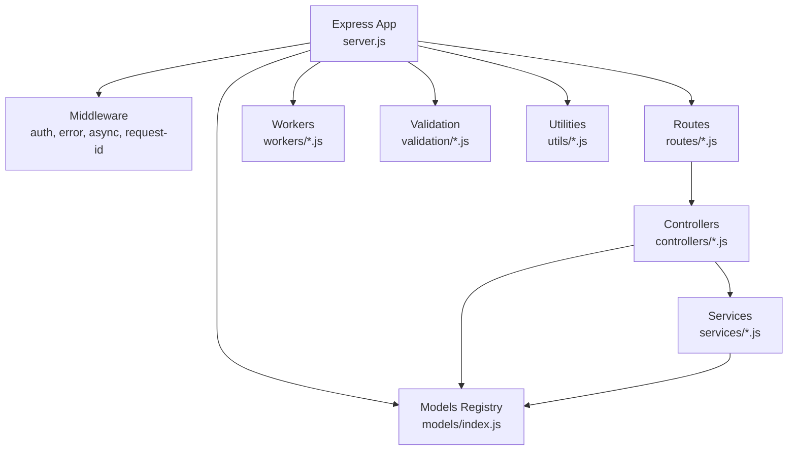

**Diagram sources**
- [server.js:1-155](file://backend/server.js#L1-L155)
- [models/index.js:1-168](file://backend/models/index.js#L1-L168)

**Section sources**
- [server.js:1-155](file://backend/server.js#L1-L155)
- [package.json:1-52](file://backend/package.json#L1-L52)

## Core Components
- Express server initialization and middleware pipeline
- Database connectivity with Sequelize (PostgreSQL/MySQL or SQLite fallback)
- Model registry and associations
- Modular controllers handling business logic
- Route modules organizing endpoints by feature
- Service layer for domain operations
- Validation layer using Zod schemas
- Middleware for authentication, error handling, async wrapping, and request correlation
- Workers for background tasks and transactional operations
- Logging and Sentry integration utilities

**Section sources**
- [server.js:1-155](file://backend/server.js#L1-L155)
- [models/index.js:1-168](file://backend/models/index.js#L1-L168)
- [middleware/authMiddleware.js:1-36](file://backend/middleware/authMiddleware.js#L1-L36)
- [middleware/errorHandler.js:1-44](file://backend/middleware/errorHandler.js#L1-L44)
- [middleware/asyncHandler.js:1-9](file://backend/middleware/asyncHandler.js#L1-L9)
- [middleware/requestId.js:1-15](file://backend/middleware/requestId.js#L1-L15)
- [utils/logger.js:1-58](file://backend/utils/logger.js#L1-L58)

## Architecture Overview
The backend follows a layered architecture:
- Presentation Layer: Express routes and controllers
- Business Logic Layer: Controllers and Services
- Data Access Layer: Sequelize models and associations
- Infrastructure Layer: Middleware, logging, Sentry, workers

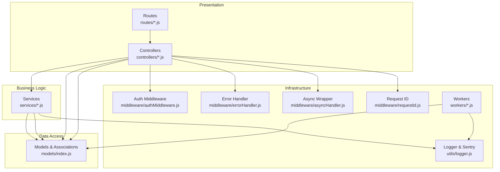

**Diagram sources**
- [server.js:110-150](file://backend/server.js#L110-L150)
- [controllers/authController.js:1-121](file://backend/controllers/authController.js#L1-L121)
- [services/paymentService.js:1-234](file://backend/services/paymentService.js#L1-L234)
- [models/index.js:24-167](file://backend/models/index.js#L24-L167)
- [middleware/authMiddleware.js:1-36](file://backend/middleware/authMiddleware.js#L1-L36)
- [middleware/errorHandler.js:1-44](file://backend/middleware/errorHandler.js#L1-L44)
- [middleware/asyncHandler.js:1-9](file://backend/middleware/asyncHandler.js#L1-L9)
- [middleware/requestId.js:1-15](file://backend/middleware/requestId.js#L1-L15)
- [workers/subscriptionWorker.js:1-175](file://backend/workers/subscriptionWorker.js#L1-L175)
- [utils/logger.js:1-58](file://backend/utils/logger.js#L1-L58)

## Detailed Component Analysis

### Express Server and Bootstrapping
- Initializes Express, Helmet, CORS, rate limiting, and request logging.
- Configures Sequelize with environment-driven dialect selection (PostgreSQL/MySQL) and SQLite fallback.
- Sets up connection pooling and exposes sequelize and models to controllers via app.locals.
- Imports and mounts feature routes under /api/* paths.
- Starts background workers with injected Sequelize instance.

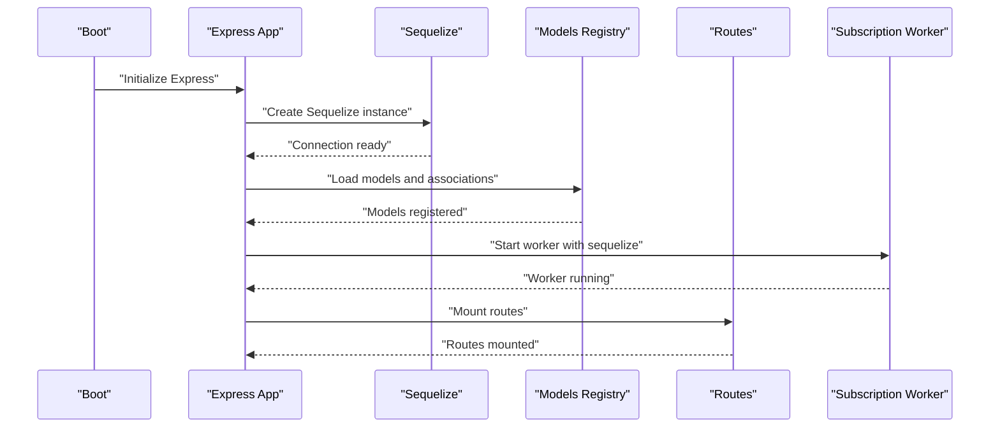

**Diagram sources**
- [server.js:57-108](file://backend/server.js#L57-L108)
- [models/index.js:24-167](file://backend/models/index.js#L24-L167)
- [workers/subscriptionWorker.js:97-172](file://backend/workers/subscriptionWorker.js#L97-L172)

**Section sources**
- [server.js:18-155](file://backend/server.js#L18-L155)
- [package.json:16-39](file://backend/package.json#L16-L39)

### Authentication and Authorization Middleware
- Token extraction from Authorization header and verification using HS256.
- Role-based access control with an isAdmin guard.
- Middleware ensures req.user is populated for protected routes.

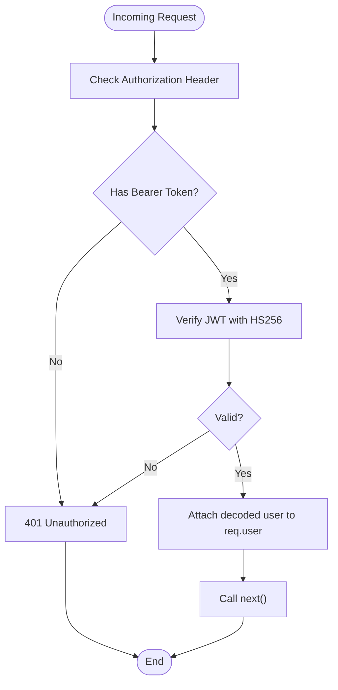

**Diagram sources**
- [middleware/authMiddleware.js:3-25](file://backend/middleware/authMiddleware.js#L3-L25)

**Section sources**
- [middleware/authMiddleware.js:1-36](file://backend/middleware/authMiddleware.js#L1-L36)

### Error Handling Strategy
- Centralized error handler attaches correlation ID and user context to Sentry.
- Environment-aware error messages (production hides internal details).
- Supports preformatted error responses and normalizes status codes.

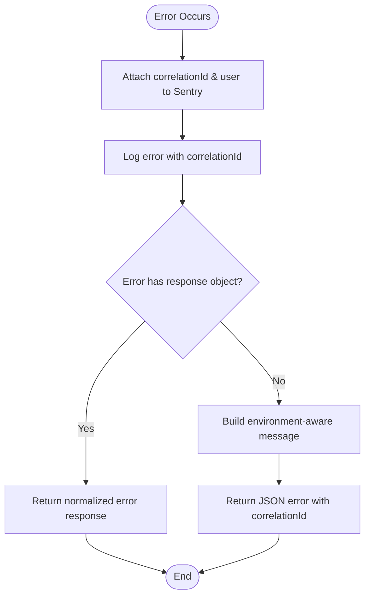

**Diagram sources**
- [middleware/errorHandler.js:5-41](file://backend/middleware/errorHandler.js#L5-L41)

**Section sources**
- [middleware/errorHandler.js:1-44](file://backend/middleware/errorHandler.js#L1-L44)

### Request Validation with Zod
- Request bodies validated using Zod schemas before controller logic executes.
- Validation failures return structured 400 responses with field-level details.

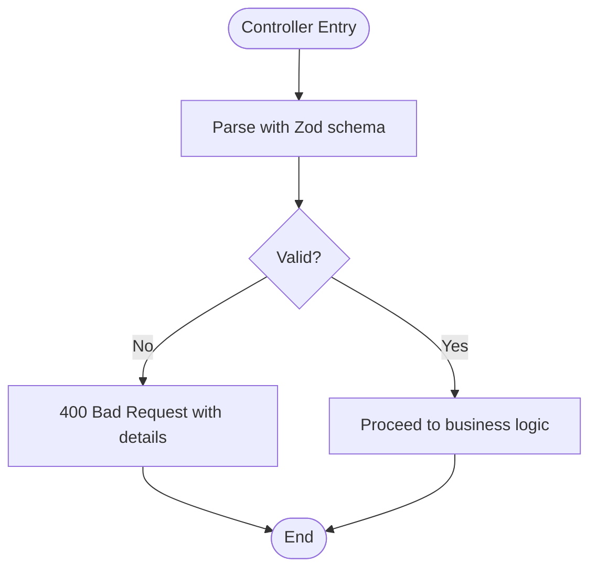

**Diagram sources**
- [validation/authSchema.js:1-18](file://backend/validation/authSchema.js#L1-L18)
- [controllers/authController.js:34-41](file://backend/controllers/authController.js#L34-L41)

**Section sources**
- [validation/authSchema.js:1-18](file://backend/validation/authSchema.js#L1-L18)
- [controllers/authController.js:1-121](file://backend/controllers/authController.js#L1-L121)

### Controller Implementation Pattern
- Controllers act as orchestration layers invoking services and returning standardized responses.
- Async route handlers are wrapped with an async error-forwarding middleware.
- Controllers access models via req.app.get('models') and Sequelize via req.app.get('sequelize').
- Example: Authentication controller validates input, accesses User model, and generates tokens.

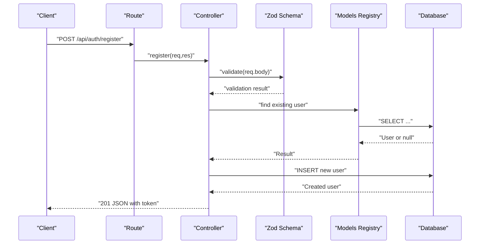

**Diagram sources**
- [routes/authRoutes.js:1-11](file://backend/routes/authRoutes.js#L1-L11)
- [controllers/authController.js:33-70](file://backend/controllers/authController.js#L33-L70)
- [validation/authSchema.js:3-7](file://backend/validation/authSchema.js#L3-L7)
- [models/index.js:24-44](file://backend/models/index.js#L24-L44)

**Section sources**
- [controllers/authController.js:1-121](file://backend/controllers/authController.js#L1-L121)
- [routes/authRoutes.js:1-11](file://backend/routes/authRoutes.js#L1-L11)
- [middleware/asyncHandler.js:4-8](file://backend/middleware/asyncHandler.js#L4-L8)

### Service Layer Abstraction
- Services encapsulate domain logic and coordinate model operations.
- Payment service demonstrates:
  - Amount validation against configured limits per payment method.
  - Transaction creation and updates.
  - Stripe and mobile money webhook handling.
  - Stripe Connect URL generation and callback stubbing with safety checks.
- Dependency injection: Services receive Sequelize via req.app.get('sequelize').

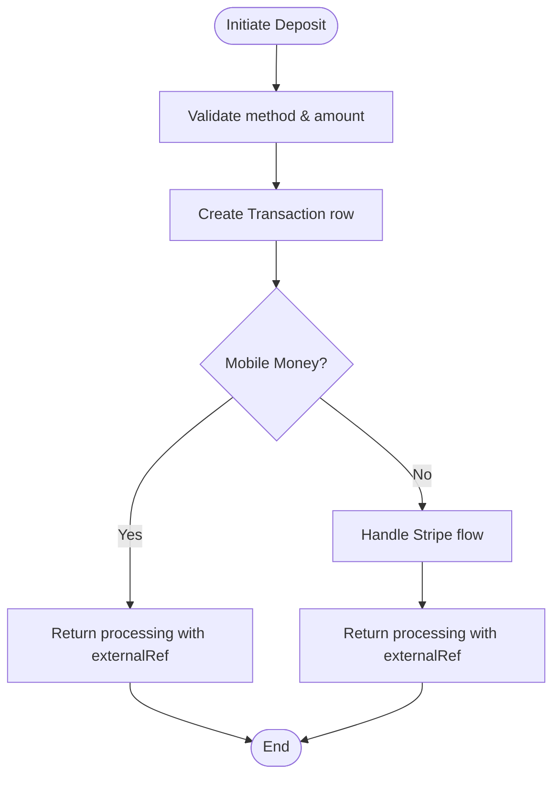

**Diagram sources**
- [services/paymentService.js:53-85](file://backend/services/paymentService.js#L53-L85)
- [services/paymentService.js:149-166](file://backend/services/paymentService.js#L149-L166)
- [services/paymentService.js:168-185](file://backend/services/paymentService.js#L168-L185)

**Section sources**
- [services/paymentService.js:1-234](file://backend/services/paymentService.js#L1-L234)

### Database Integration and Transactions
- Sequelize configured with connection pooling and dialect selection.
- Models loaded and associations defined centrally.
- Workers perform transactional operations for subscription renewal and expiry.
- Manual SQL statements used for targeted updates and inserts within transactions.

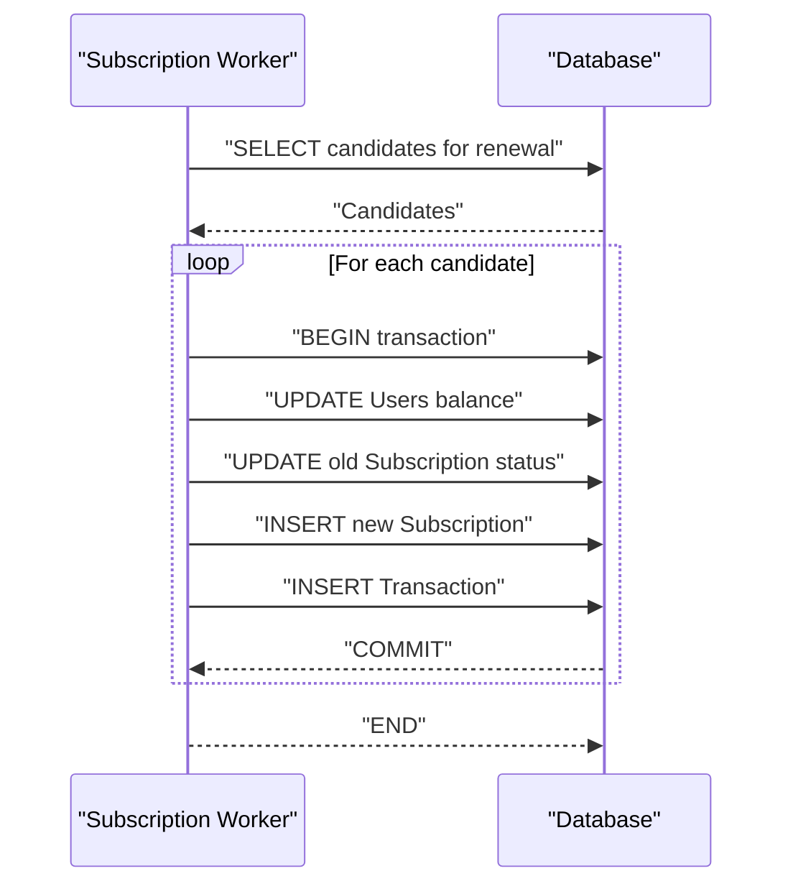

**Diagram sources**
- [workers/subscriptionWorker.js:44-81](file://backend/workers/subscriptionWorker.js#L44-L81)
- [models/index.js:24-167](file://backend/models/index.js#L24-L167)

**Section sources**
- [server.js:57-84](file://backend/server.js#L57-L84)
- [models/index.js:1-168](file://backend/models/index.js#L1-L168)
- [workers/subscriptionWorker.js:1-175](file://backend/workers/subscriptionWorker.js#L1-L175)

### Logging and Observability
- Winston-based logger with file transports and optional console transport.
- Structured logs with timestamps, service tags, and metadata.
- Sentry integration in error handler for production diagnostics.

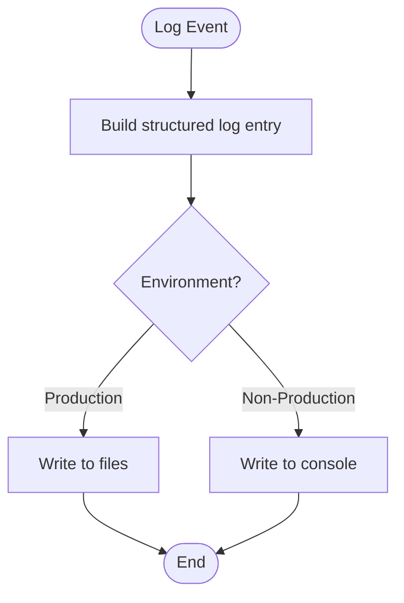

**Diagram sources**
- [utils/logger.js:21-44](file://backend/utils/logger.js#L21-L44)
- [middleware/errorHandler.js:6-12](file://backend/middleware/errorHandler.js#L6-L12)

**Section sources**
- [utils/logger.js:1-58](file://backend/utils/logger.js#L1-L58)
- [middleware/errorHandler.js:1-44](file://backend/middleware/errorHandler.js#L1-L44)

### API Versioning and Backward Compatibility
- Current routes are mounted under /api/* without explicit version segments.
- No versioned route directories or headers are present in the codebase.
- Recommendations:
  - Introduce /api/v1/* and future /api/v2/* to maintain backward compatibility.
  - Keep v1 endpoints frozen; evolve v2 with new endpoints and deprecate selectively.
  - Add Accept-Version header negotiation and default to latest supported version.

[No sources needed since this section provides general guidance]

## Dependency Analysis
- Express dependencies include cors, helmet, express-rate-limit, jsonwebtoken, bcryptjs, multer, stripe, uuid, winston, zod, and Sequelize with mysql2/pg drivers.
- Runtime dependencies are injected via app.locals:
  - req.app.get('sequelize'): Sequelize instance
  - req.app.get('models'): Models registry

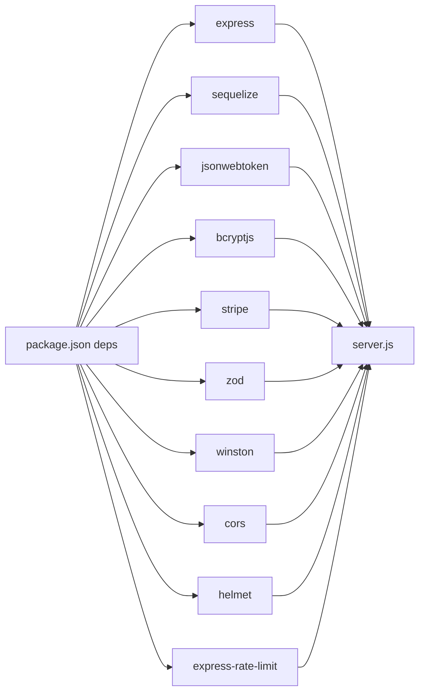

**Diagram sources**
- [package.json:16-39](file://backend/package.json#L16-L39)
- [server.js:1-10](file://backend/server.js#L1-L10)

**Section sources**
- [package.json:1-52](file://backend/package.json#L1-L52)
- [server.js:86-92](file://backend/server.js#L86-L92)

## Performance Considerations
- Connection pooling: Sequelize configured with max/min/acquire/idle settings for controlled resource usage.
- Request size limits: JSON and URL-encoded bodies limited to 10KB to prevent abuse.
- Rate limiting: Global rate limit applied to all routes.
- Logging overhead: File-based logging with rotation; consider structured logging for high-throughput environments.
- Transaction boundaries: Keep transaction scopes minimal and avoid long-running operations inside transactions.

[No sources needed since this section provides general guidance]

## Troubleshooting Guide
- Missing environment variables: The server warns if critical variables are missing and falls back to SQLite locally.
- JWT_SECRET in production: Startup enforces presence of JWT_SECRET; otherwise, it refuses to start.
- Database connectivity: Authentication and sync are performed at startup; failures are logged.
- Error visibility: Use correlation IDs attached to requests and Sentry tags for end-to-end tracing.

**Section sources**
- [server.js:12-16](file://backend/server.js#L12-L16)
- [controllers/authController.js:8-19](file://backend/controllers/authController.js#L8-L19)
- [server.js:97-108](file://backend/server.js#L97-L108)
- [middleware/errorHandler.js:7-12](file://backend/middleware/errorHandler.js#L7-L12)

## Conclusion
The backend employs a clean, modular Express architecture with a strong separation of concerns. Controllers handle request orchestration, services encapsulate domain logic, models manage data access, and middleware provides robust cross-cutting capabilities. The system supports PostgreSQL/MySQL with connection pooling and transactional integrity, while background workers automate recurring tasks. Validation and error handling are centralized, and logging/Sentry enable observability. For scalability and long-term maintainability, adopting explicit API versioning and evolving the service layer independently will support continued growth.

## Appendices

### Database Schema Overview
- Core entities include Users, Sellers, Books, Purchases, Transactions, Wallets, PaymentMethods, and Referrals.
- Associations define relationships across entities (e.g., User has many Purchases, Book belongs to Seller).
- Dual-currency wallets and payment methods support multi-region operations.

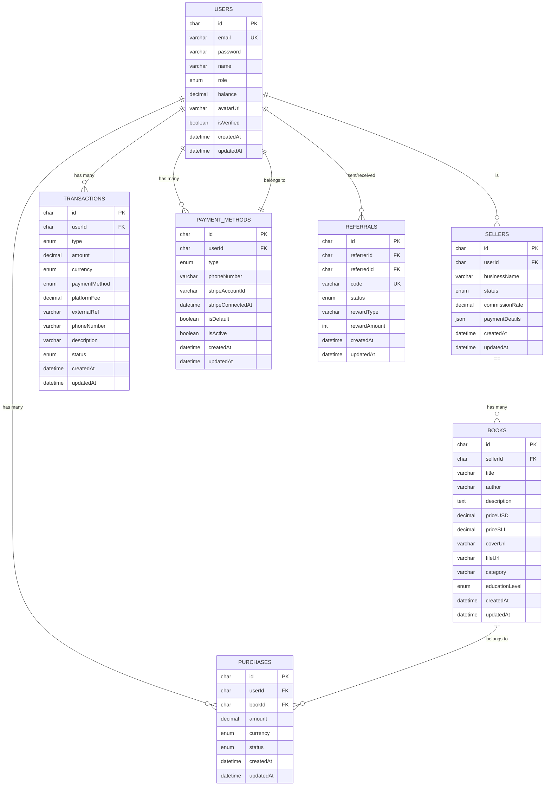

**Diagram sources**
- [schema.sql:7-132](file://backend/schema.sql#L7-L132)
- [models/index.js:45-146](file://backend/models/index.js#L45-L146)