# Data Architecture

<cite>
**Referenced Files in This Document**
- [docker-compose.yml](file://infrastructure/docker-compose.yml)
- [init-all-databases.sql](file://database/init-all-databases.sql)
- [schema.sql](file://backend/schema.sql)
- [educational_schema_update.sql](file://database/educational_schema_update.sql)
- [paygo-schema.sql](file://database/paygo-schema.sql)
- [subscription-schema.sql](file://database/subscription-schema.sql)
- [video_jobs.sql](file://database/video_jobs.sql)
- [voice_profiles.sql](file://database/voice_profiles.sql)
- [index.js](file://backend/models/index.js)
- [User.js](file://backend/models/User.js)
- [Book.js](file://backend/models/Book.js)
- [Purchase.js](file://backend/models/Purchase.js)
- [Transaction.js](file://backend/models/Transaction.js)
- [Seller.js](file://backend/models/Seller.js)
- [VoiceProfile.js](file://backend/models/VoiceProfile.js)
- [ttsCache.js](file://backend/utils/ttsCache.js)
- [backup.sh](file://infrastructure/vps-migration/scripts/backup.sh)
</cite>

## Table of Contents
1. [Introduction](#introduction)
2. [Project Structure](#project-structure)
3. [Core Components](#core-components)
4. [Architecture Overview](#architecture-overview)
5. [Detailed Component Analysis](#detailed-component-analysis)
6. [Dependency Analysis](#dependency-analysis)
7. [Performance Considerations](#performance-considerations)
8. [Troubleshooting Guide](#troubleshooting-guide)
9. [Conclusion](#conclusion)
10. [Appendices](#appendices)

## Introduction
This document describes the data architecture of the QuantumMint Bookstore platform, focusing on the multi-database strategy, entity relationships, consistency and transaction patterns, schema evolution, caching, synchronization, and operational procedures. The platform employs PostgreSQL for unified relational data and specialized databases for domain-specific workloads (video, audiobook, bookstore, subscriptions). It also leverages Redis for caching and performance optimization, and implements robust initialization and migration strategies.

## Project Structure
The data architecture spans:
- A monolithic backend using MySQL for core bookstore data
- A unified PostgreSQL cluster hosting multiple specialized databases
- Dedicated microservices with their own database connections
- A Redis cache layer for session and performance optimization
- Operational tooling for initialization, migrations, and backups

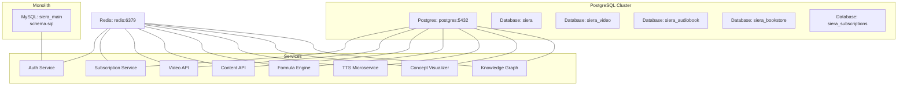

**Diagram sources**
- [docker-compose.yml:1-373](file://infrastructure/docker-compose.yml#L1-L373)
- [init-all-databases.sql:1-470](file://database/init-all-databases.sql#L1-L470)

**Section sources**
- [docker-compose.yml:1-373](file://infrastructure/docker-compose.yml#L1-L373)
- [init-all-databases.sql:1-470](file://database/init-all-databases.sql#L1-L470)

## Core Components
- Multi-database strategy:
  - Unified relational data in MySQL (monolith) and PostgreSQL (specialized services)
  - Specialized databases: siera_video, siera_audiobook, siera_bookstore, siera_subscriptions
- Entity relationship models:
  - Defined via Sequelize models and PostgreSQL DDL
  - Associations among Users, Books, Purchases, Transactions, Sellers, VoiceProfiles, and domain entities
- Caching layer:
  - Redis-backed TTSCache for synthesized audio URL caching with TTL and invalidation
- Initialization and migrations:
  - SQL scripts initialize databases and tables
  - Seed data and triggers populate and maintain referential integrity
- Operational procedures:
  - Automated backup script for PostgreSQL and uploads
  - Health checks and environment-driven configuration

**Section sources**
- [index.js:1-168](file://backend/models/index.js#L1-L168)
- [User.js:1-50](file://backend/models/User.js#L1-L50)
- [Book.js:1-92](file://backend/models/Book.js#L1-L92)
- [Purchase.js:1-26](file://backend/models/Purchase.js#L1-L26)
- [Transaction.js:1-54](file://backend/models/Transaction.js#L1-L54)
- [Seller.js:1-30](file://backend/models/Seller.js#L1-L30)
- [VoiceProfile.js:1-50](file://backend/models/VoiceProfile.js#L1-L50)
- [ttsCache.js:1-59](file://backend/utils/ttsCache.js#L1-L59)
- [schema.sql:1-132](file://backend/schema.sql#L1-L132)
- [init-all-databases.sql:1-470](file://database/init-all-databases.sql#L1-L470)
- [paygo-schema.sql:1-371](file://database/paygo-schema.sql#L1-L371)
- [subscription-schema.sql:1-644](file://database/subscription-schema.sql#L1-L644)
- [video_jobs.sql:1-53](file://database/video_jobs.sql#L1-L53)
- [voice_profiles.sql:1-38](file://database/voice_profiles.sql#L1-L38)
- [backup.sh:1-19](file://infrastructure/vps-migration/scripts/backup.sh#L1-L19)

## Architecture Overview
The system uses a hybrid relational architecture:
- MySQL hosts the monolithic bookstore domain (users, purchases, transactions)
- PostgreSQL hosts specialized domains:
  - siera: unified users and products
  - siera_video: video encodings and processing
  - siera_audiobook: audiobook chapters and scientific explanations
  - siera_bookstore: collections, recommendations
  - siera_subscriptions: subscription plans, invoices, usage logs
- Redis caches frequently accessed data and session artifacts
- Services connect to their respective databases and share Redis for cross-cutting concerns

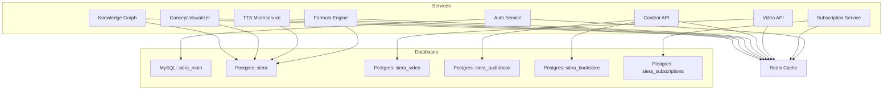

**Diagram sources**
- [docker-compose.yml:67-222](file://infrastructure/docker-compose.yml#L67-L222)
- [init-all-databases.sql:341-470](file://database/init-all-databases.sql#L341-L470)

## Detailed Component Analysis

### Relational Model and Associations
The Sequelize models define core entities and their relationships:
- Users ↔ Purchases, Transactions, Sellers, Referrals, Subscriptions
- Books ↔ Purchases, Notes, ReadingSessions, Quizzes, MediaCues, Formulas
- Sellers ↔ Books, VoiceProfiles
- VoiceProfiles ↔ NarrationSegments
- LearnerInteraction links Users, Formulas, and FormulaTokens
- Additional associations for Notes, ReadingSessions, and AuditLogs

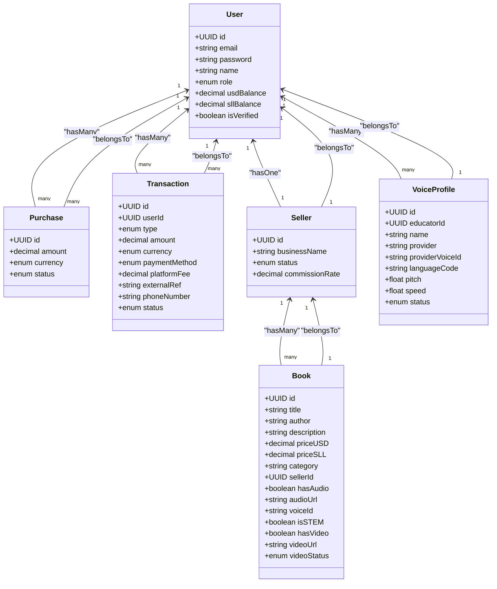

**Diagram sources**
- [index.js:45-167](file://backend/models/index.js#L45-L167)
- [User.js:1-50](file://backend/models/User.js#L1-L50)
- [Book.js:1-92](file://backend/models/Book.js#L1-L92)
- [Purchase.js:1-26](file://backend/models/Purchase.js#L1-L26)
- [Transaction.js:1-54](file://backend/models/Transaction.js#L1-L54)
- [Seller.js:1-30](file://backend/models/Seller.js#L1-L30)
- [VoiceProfile.js:1-50](file://backend/models/VoiceProfile.js#L1-L50)

**Section sources**
- [index.js:1-168](file://backend/models/index.js#L1-L168)
- [User.js:1-50](file://backend/models/User.js#L1-L50)
- [Book.js:1-92](file://backend/models/Book.js#L1-L92)
- [Purchase.js:1-26](file://backend/models/Purchase.js#L1-L26)
- [Transaction.js:1-54](file://backend/models/Transaction.js#L1-L54)
- [Seller.js:1-30](file://backend/models/Seller.js#L1-L30)
- [VoiceProfile.js:1-50](file://backend/models/VoiceProfile.js#L1-L50)

### PostgreSQL Domain Databases
- siera: unified users, creators, products (video/audiobook/ebook bundles), purchases, subscriptions, consumption history, reviews, wishlists, cart, notifications
- siera_video: video encodings, processing jobs, storage usage
- siera_audiobook: audiobook chapters, scientific explanations, formula explanations
- siera_bookstore: collections, collection items, recommendations
- siera_subscriptions: subscription plans, user subscriptions, usage tracking, invoices, coupons, webhook events, access logs, analytics

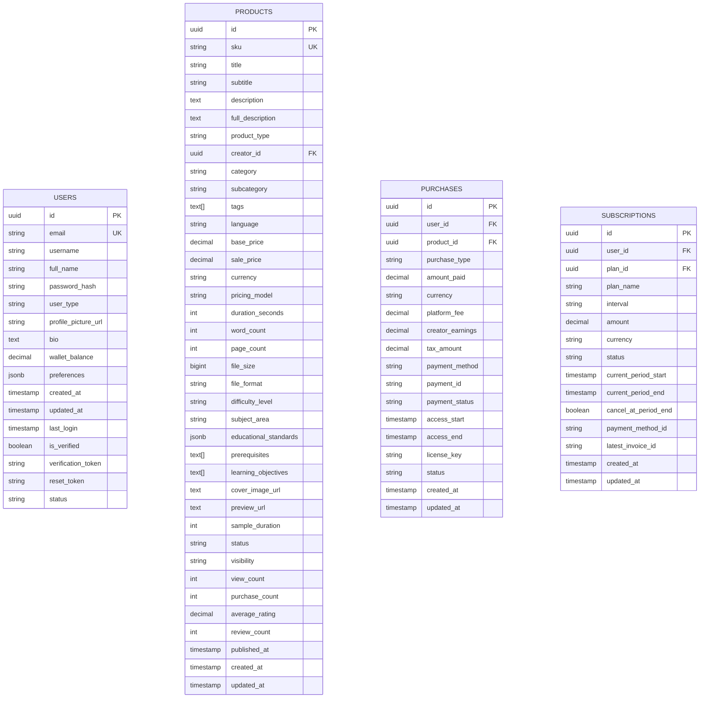

**Diagram sources**
- [init-all-databases.sql:11-470](file://database/init-all-databases.sql#L11-L470)
- [subscription-schema.sql:17-123](file://database/subscription-schema.sql#L17-L123)

**Section sources**
- [init-all-databases.sql:1-470](file://database/init-all-databases.sql#L1-L470)
- [subscription-schema.sql:1-644](file://database/subscription-schema.sql#L1-L644)

### Pay-Per-Minute (PayGo) System
The PayGo schema defines:
- Wallets with dual-currency balances and limits
- Transactions for deposits, charges, refunds
- Real-time usage sessions with heartbeats and quality settings
- Rate cards for different content types and categories

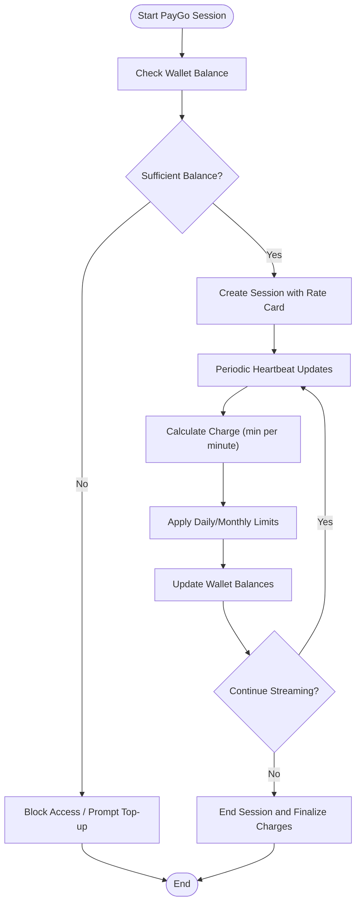

**Diagram sources**
- [paygo-schema.sql:1-371](file://database/paygo-schema.sql#L1-L371)

**Section sources**
- [paygo-schema.sql:1-371](file://database/paygo-schema.sql#L1-L371)

### Educational Platform Extensions
The educational platform extends the base schema with:
- Categories, BookPages, MediaCues, ReadingProgress, UserReviews, AnalyticsEvents, Achievements, UserAchievements
- Full-text search indexing on books
- Sample seed data for categories and achievements

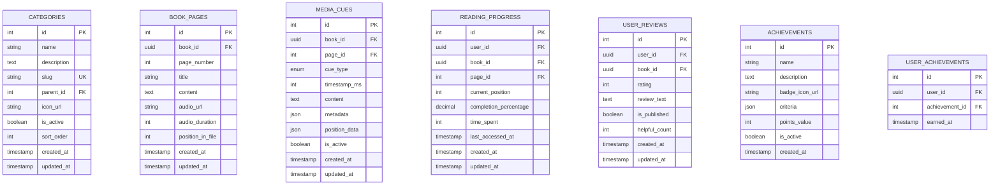

**Diagram sources**
- [educational_schema_update.sql:19-188](file://database/educational_schema_update.sql#L19-L188)

**Section sources**
- [educational_schema_update.sql:1-188](file://database/educational_schema_update.sql#L1-L188)

### Caching Layer with Redis
TTSCache provides:
- Key-value caching for synthesized audio URLs keyed by text hash
- TTL defaults to 30 days
- Batch invalidation for a specific book’s cached entries

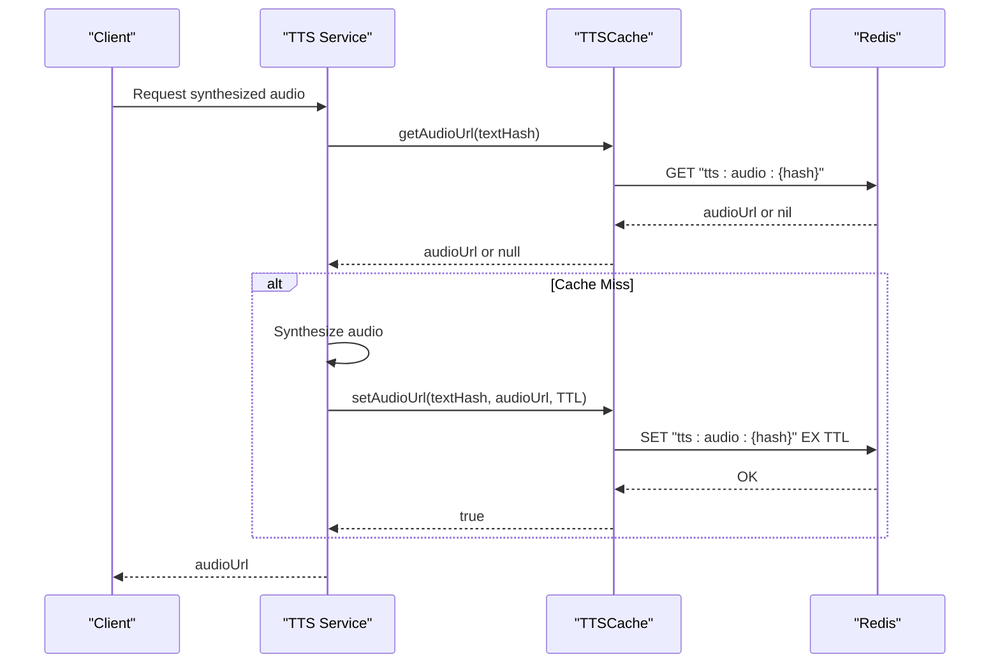

**Diagram sources**
- [ttsCache.js:1-59](file://backend/utils/ttsCache.js#L1-L59)

**Section sources**
- [ttsCache.js:1-59](file://backend/utils/ttsCache.js#L1-L59)

### Database Initialization and Schema Evolution
- Initialization:
  - MySQL: schema.sql initializes the monolith database
  - PostgreSQL: init-all-databases.sql creates multiple databases and tables
- Schema evolution:
  - Educational updates add new tables and indexes
  - PayGo and subscription schemas introduce specialized tables, indexes, functions, and triggers
  - Video and voice profiles schemas define domain-specific entities and storage metadata

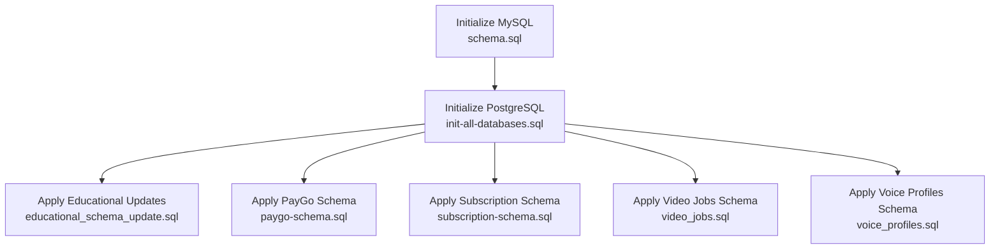

**Diagram sources**
- [schema.sql:1-132](file://backend/schema.sql#L1-L132)
- [init-all-databases.sql:1-470](file://database/init-all-databases.sql#L1-L470)
- [educational_schema_update.sql:1-188](file://database/educational_schema_update.sql#L1-L188)
- [paygo-schema.sql:1-371](file://database/paygo-schema.sql#L1-L371)
- [subscription-schema.sql:1-644](file://database/subscription-schema.sql#L1-L644)
- [video_jobs.sql:1-53](file://database/video_jobs.sql#L1-L53)
- [voice_profiles.sql:1-38](file://database/voice_profiles.sql#L1-L38)

**Section sources**
- [schema.sql:1-132](file://backend/schema.sql#L1-L132)
- [init-all-databases.sql:1-470](file://database/init-all-databases.sql#L1-L470)
- [educational_schema_update.sql:1-188](file://database/educational_schema_update.sql#L1-L188)
- [paygo-schema.sql:1-371](file://database/paygo-schema.sql#L1-L371)
- [subscription-schema.sql:1-644](file://database/subscription-schema.sql#L1-L644)
- [video_jobs.sql:1-53](file://database/video_jobs.sql#L1-L53)
- [voice_profiles.sql:1-38](file://database/voice_profiles.sql#L1-L38)

### Transaction Management and Consistency Patterns
- Cross-service consistency:
  - Use idempotent operations and unique constraints (e.g., unique user-method combinations)
  - Implement compensating actions for failed operations
  - Maintain audit trails via AuditLog and access logs
- Eventual consistency:
  - Asynchronous processing for video encoding and audiobook generation
  - Heartbeat-driven PayGo charging decouples real-time billing from streaming
- Conflict resolution:
  - Use optimistic locking with timestamps and retry logic
  - Deduplicate webhook events and enforce uniqueness on event ids

[No sources needed since this section provides general guidance]

### Data Synchronization Patterns
- Video pipeline:
  - Job queue with statuses queued/processing/completed/failed
  - Metadata stored for duration, resolution, codec
- Audiobook pipeline:
  - Chapters and scientific explanations linked to audiobooks
  - Formula explanations with timestamps and complexity scores
- Recommendations:
  - Scores and reasons stored per user-product pair

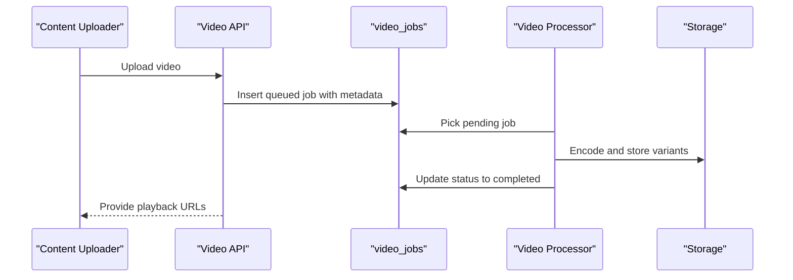

**Diagram sources**
- [video_jobs.sql:1-53](file://database/video_jobs.sql#L1-L53)

**Section sources**
- [video_jobs.sql:1-53](file://database/video_jobs.sql#L1-L53)
- [voice_profiles.sql:1-38](file://database/voice_profiles.sql#L1-L38)

### Backup and Recovery Procedures
- Automated backup script:
  - Backs up PostgreSQL database dumps and uploaded content
  - Retains backups for a defined retention period
  - Executes within the VPS environment

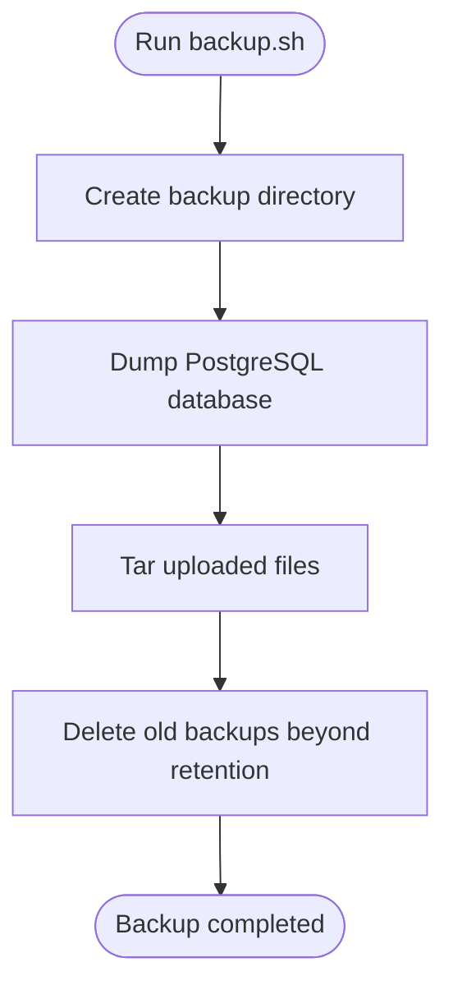

**Diagram sources**
- [backup.sh:1-19](file://infrastructure/vps-migration/scripts/backup.sh#L1-L19)

**Section sources**
- [backup.sh:1-19](file://infrastructure/vps-migration/scripts/backup.sh#L1-L19)

### Compliance Considerations for Educational Data Protection
- Data minimization and retention:
  - Implement data lifecycle policies aligned with educational regulations
  - Regularly purge inactive sessions and logs per policy
- Access controls:
  - Role-based access for users, educators, and admins
  - Secure JWT-based authentication and authorization
- Auditability:
  - Maintain audit logs for sensitive operations
  - Track access attempts and subscription usage

[No sources needed since this section provides general guidance]

## Dependency Analysis
- Database dependencies:
  - Monolith depends on MySQL for core entities
  - Services depend on PostgreSQL databases for domain-specific data
- Redis dependencies:
  - All services configured with Redis connection parameters
- External integrations:
  - Stripe for payments
  - Elasticsearch for search (configured in compose)
  - Neo4j for knowledge graph (configured in compose)

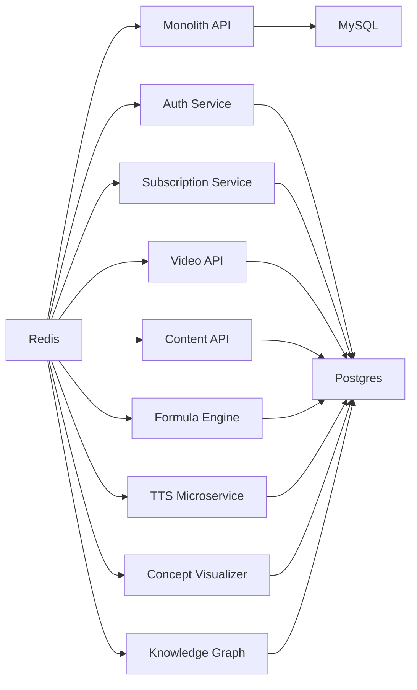

**Diagram sources**
- [docker-compose.yml:28-222](file://infrastructure/docker-compose.yml#L28-L222)

**Section sources**
- [docker-compose.yml:1-373](file://infrastructure/docker-compose.yml#L1-L373)

## Performance Considerations
- Caching:
  - Use Redis for synthesized audio caching with TTL to reduce latency
  - Invalidate caches after content updates to ensure freshness
- Indexing:
  - Create appropriate indexes for frequent filters (user_id, product_id, status)
- Asynchronous processing:
  - Offload heavy tasks (encoding, synthesis) to background workers
- Database scaling:
  - Separate databases per domain to isolate load and simplify maintenance

[No sources needed since this section provides general guidance]

## Troubleshooting Guide
- Redis connectivity:
  - Verify REDIS_HOST, REDIS_PORT, and credentials
  - Monitor connection errors and retry strategies
- Database initialization:
  - Confirm database creation and schema execution steps
  - Validate environment variables for database URLs
- Backup failures:
  - Check backup script permissions and retention settings
  - Ensure PostgreSQL dump connectivity and disk space availability

**Section sources**
- [ttsCache.js:1-59](file://backend/utils/ttsCache.js#L1-L59)
- [docker-compose.yml:257-268](file://infrastructure/docker-compose.yml#L257-L268)
- [backup.sh:1-19](file://infrastructure/vps-migration/scripts/backup.sh#L1-L19)

## Conclusion
The platform’s data architecture combines a MySQL monolith with a PostgreSQL cluster of specialized databases, enabling scalable and maintainable domain modeling. Redis enhances performance for time-sensitive operations like TTS caching. Robust initialization and migration scripts, combined with operational automation, support reliable deployments. Eventual consistency and asynchronous pipelines accommodate complex workflows while maintaining user experience.

## Appendices
- Environment variables and service mappings are defined in the Docker Compose file for seamless orchestration across databases, Redis, and microservices.

**Section sources**
- [docker-compose.yml:1-373](file://infrastructure/docker-compose.yml#L1-L373)