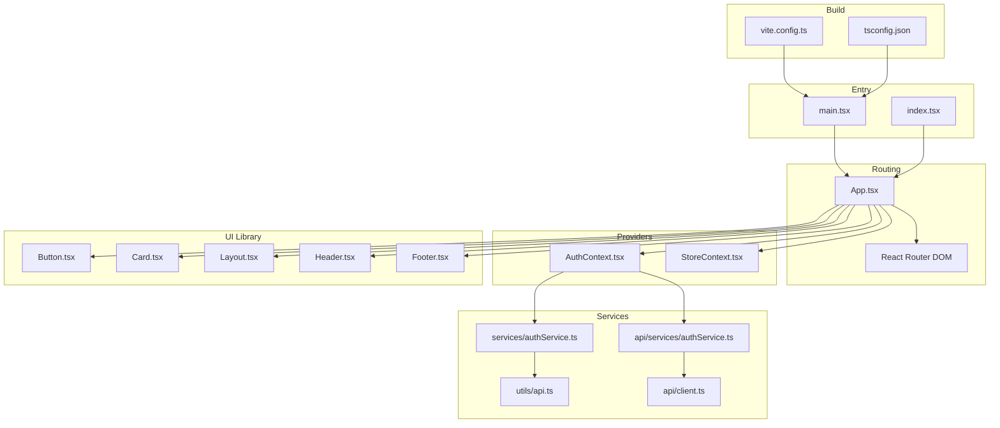
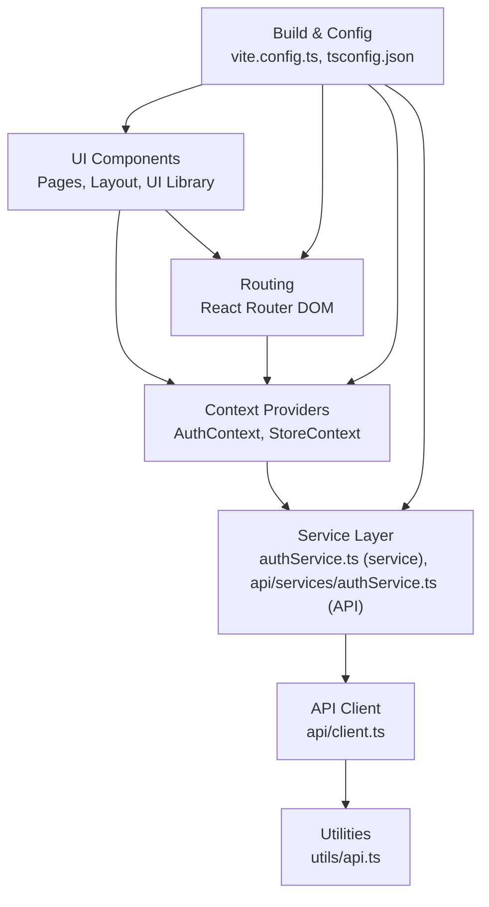
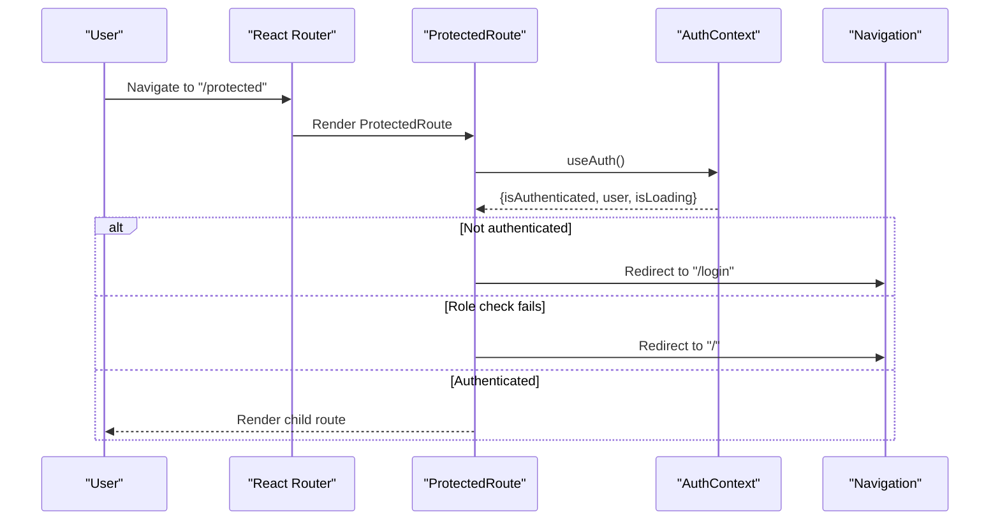
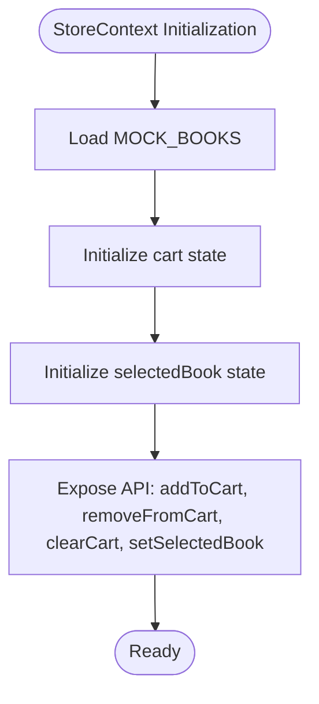
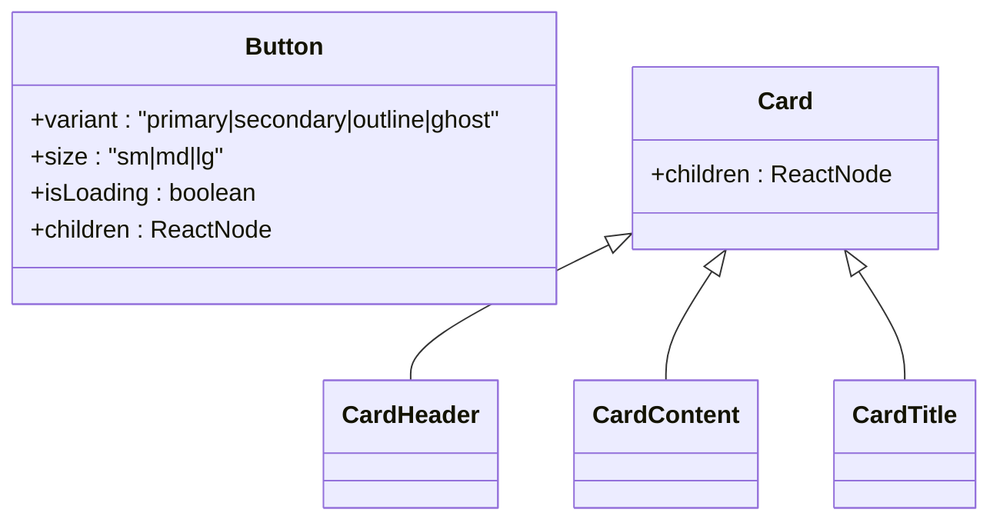
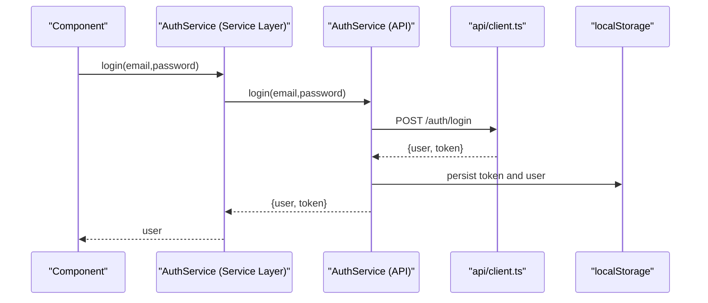
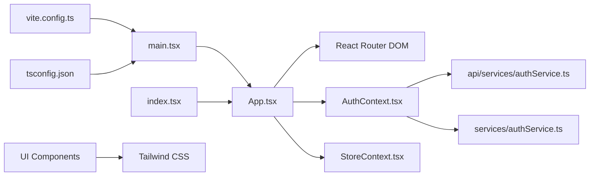

# Frontend Architecture

<cite>
**Referenced Files in This Document**
- [main.tsx](file://frontend/src/main.tsx)
- [index.tsx](file://frontend/src/index.tsx)
- [App.tsx](file://frontend/src/App.tsx)
- [vite.config.ts](file://frontend/vite.config.ts)
- [tsconfig.json](file://frontend/tsconfig.json)
- [AuthContext.tsx](file://frontend/src/contexts/AuthContext.tsx)
- [StoreContext.tsx](file://frontend/src/contexts/StoreContext.tsx)
- [authService.ts (API)](file://frontend/src/api/services/authService.ts)
- [authService.ts (Service Layer)](file://frontend/src/services/authService.ts)
- [Header.tsx](file://frontend/src/components/layout/Header.tsx)
- [Footer.tsx](file://frontend/src/components/layout/Footer.tsx)
- [Layout.tsx](file://frontend/src/components/layout/Layout.tsx)
- [Button.tsx](file://frontend/src/components/ui/Button.tsx)
- [Card.tsx](file://frontend/src/components/ui/Card.tsx)
- [ErrorBoundary.tsx](file://frontend/src/components/ErrorBoundary.tsx)
- [api.ts (utils)](file://frontend/src/utils/api.ts)
- [api.ts (client)](file://frontend/src/api/client.ts)
- [types.ts (api types)](file://frontend/src/types/api.ts)
</cite>

## Table of Contents
1. [Introduction](#introduction)
2. [Project Structure](#project-structure)
3. [Core Components](#core-components)
4. [Architecture Overview](#architecture-overview)
5. [Detailed Component Analysis](#detailed-component-analysis)
6. [Dependency Analysis](#dependency-analysis)
7. [Performance Considerations](#performance-considerations)
8. [Troubleshooting Guide](#troubleshooting-guide)
9. [Conclusion](#conclusion)

## Introduction
This document describes the frontend architecture of the React 19 application, focusing on application structure, component hierarchy, routing with dynamic imports for 40+ pages, context-based state management for authentication and a global store, UI component library patterns, build configuration with Vite and TypeScript, Tailwind CSS styling, performance optimizations, lazy loading, and client-side caching. It also outlines the service layer abstraction for backend integration.

## Project Structure
The frontend is organized around a clear separation of concerns:
- Application bootstrap and providers in the root entry files
- Routing with React Router DOM and route-level lazy loading
- Context providers for authentication and global store
- UI component library under components/ui
- Service layer abstractions for API communication
- Build configuration via Vite and TypeScript compiler options



**Diagram sources**
- [main.tsx:1-17](file://frontend/src/main.tsx#L1-L17)
- [index.tsx:1-19](file://frontend/src/index.tsx#L1-L19)
- [App.tsx:1-160](file://frontend/src/App.tsx#L1-L160)
- [AuthContext.tsx:1-82](file://frontend/src/contexts/AuthContext.tsx#L1-L82)
- [StoreContext.tsx:1-56](file://frontend/src/contexts/StoreContext.tsx#L1-L56)
- [Button.tsx:1-54](file://frontend/src/components/ui/Button.tsx#L1-L54)
- [Card.tsx:1-31](file://frontend/src/components/ui/Card.tsx#L1-L31)
- [Layout.tsx:1-55](file://frontend/src/components/layout/Layout.tsx#L1-L55)
- [Header.tsx:1-88](file://frontend/src/components/layout/Header.tsx#L1-L88)
- [Footer.tsx:1-20](file://frontend/src/components/layout/Footer.tsx#L1-L20)
- [authService.ts (API):1-57](file://frontend/src/api/services/authService.ts#L1-L57)
- [authService.ts (Service Layer):1-120](file://frontend/src/services/authService.ts#L1-L120)
- [api.ts (utils)](file://frontend/src/utils/api.ts)
- [api.ts (client)](file://frontend/src/api/client.ts)
- [vite.config.ts:1-20](file://frontend/vite.config.ts#L1-L20)
- [tsconfig.json:1-30](file://frontend/tsconfig.json#L1-L30)

**Section sources**
- [main.tsx:1-17](file://frontend/src/main.tsx#L1-L17)
- [index.tsx:1-19](file://frontend/src/index.tsx#L1-L19)
- [App.tsx:1-160](file://frontend/src/App.tsx#L1-L160)
- [vite.config.ts:1-20](file://frontend/vite.config.ts#L1-L20)
- [tsconfig.json:1-30](file://frontend/tsconfig.json#L1-L30)

## Core Components
- Application bootstrap initializes Sentry, sets up TanStack Query, and renders the root App inside strict mode and an error boundary.
- App composes routing with React Router, lazy-loads pages, and wraps content with AuthProvider and StoreProvider.
- ProtectedRoute enforces authentication and role-based access.
- Contexts manage authentication state and a simple global store for books/cart/selection.

Key responsibilities:
- main.tsx: Initializes error tracking and query client provider, mounts the app.
- index.tsx: Wraps App with StrictMode and ErrorBoundary.
- App.tsx: Defines routes, lazy loads pages, and applies protected routing.
- AuthContext.tsx: Provides login, register, logout, and user state with localStorage caching.
- StoreContext.tsx: Provides cart and selection state for the store.

**Section sources**
- [main.tsx:1-17](file://frontend/src/main.tsx#L1-L17)
- [index.tsx:1-19](file://frontend/src/index.tsx#L1-L19)
- [App.tsx:52-69](file://frontend/src/App.tsx#L52-L69)
- [AuthContext.tsx:1-82](file://frontend/src/contexts/AuthContext.tsx#L1-L82)
- [StoreContext.tsx:1-56](file://frontend/src/contexts/StoreContext.tsx#L1-L56)

## Architecture Overview
The frontend follows a layered architecture:
- Presentation layer: React components and pages
- Routing layer: React Router with lazy-loaded routes
- State management: Context providers for auth and store
- Service layer: Abstractions over API clients for auth and other domain services
- Infrastructure: Vite build, TypeScript compilation, Tailwind CSS styling



**Diagram sources**
- [App.tsx:1-160](file://frontend/src/App.tsx#L1-L160)
- [AuthContext.tsx:1-82](file://frontend/src/contexts/AuthContext.tsx#L1-L82)
- [StoreContext.tsx:1-56](file://frontend/src/contexts/StoreContext.tsx#L1-L56)
- [authService.ts (Service Layer):1-120](file://frontend/src/services/authService.ts#L1-L120)
- [authService.ts (API):1-57](file://frontend/src/api/services/authService.ts#L1-L57)
- [api.ts (client)](file://frontend/src/api/client.ts)
- [api.ts (utils)](file://frontend/src/utils/api.ts)
- [vite.config.ts:1-20](file://frontend/vite.config.ts#L1-L20)
- [tsconfig.json:1-30](file://frontend/tsconfig.json#L1-L30)

## Detailed Component Analysis

### Routing and Navigation
- Routes are defined in App.tsx with lazy imports for all pages, enabling code-splitting and improved initial load performance.
- ProtectedRoute handles authentication checks and role-based redirection.
- Mobile-friendly navigation and sidebar are integrated into the main layout.



**Diagram sources**
- [App.tsx:52-69](file://frontend/src/App.tsx#L52-L69)
- [AuthContext.tsx:1-82](file://frontend/src/contexts/AuthContext.tsx#L1-L82)

**Section sources**
- [App.tsx:92-139](file://frontend/src/App.tsx#L92-L139)
- [AuthContext.tsx:1-82](file://frontend/src/contexts/AuthContext.tsx#L1-L82)

### Authentication State Management
- AuthContext manages user state, login/register/logout, and loading state.
- It persists tokens and user data in localStorage and exposes a hook for consuming components.
- A higher-level service layer (AuthService) encapsulates API calls and broadcasts auth changes.

```mermaid
classDiagram
class AuthContext {
+boolean isAuthenticated
+User|null user
+boolean isLoading
+login(credentials) Promise~void~
+register(data) Promise~void~
+logout() Promise~void~
}
class AuthService_ServiceLayer {
-User|null currentUser
+login(email,password) Promise~User~
+register(userData) Promise~User~
+logout() Promise~void~
+getCurrentUser() User|null
+isAuthenticated() boolean
+hasRole(role) boolean
+isAdmin() boolean
+onAuthChange(callback) () => void
}
class AuthService_API {
+login(credentials) Promise~{user, token}~
+register(data) Promise~{user, token}~
+logout() Promise~void~
+getCurrentUser() User|null
+isAuthenticated() boolean
}
AuthContext --> AuthService_API : "uses"
AuthContext --> AuthService_ServiceLayer : "consumes"
```

**Diagram sources**
- [AuthContext.tsx:1-82](file://frontend/src/contexts/AuthContext.tsx#L1-L82)
- [authService.ts (Service Layer):1-120](file://frontend/src/services/authService.ts#L1-L120)
- [authService.ts (API):1-57](file://frontend/src/api/services/authService.ts#L1-L57)

**Section sources**
- [AuthContext.tsx:1-82](file://frontend/src/contexts/AuthContext.tsx#L1-L82)
- [authService.ts (Service Layer):1-120](file://frontend/src/services/authService.ts#L1-L120)
- [authService.ts (API):1-57](file://frontend/src/api/services/authService.ts#L1-L57)

### Global Store Context
- StoreContext provides a simple cart and selected book state with add/remove/clear operations.
- It is initialized with mock data and intended to evolve into a richer store.



**Diagram sources**
- [StoreContext.tsx:1-56](file://frontend/src/contexts/StoreContext.tsx#L1-L56)

**Section sources**
- [StoreContext.tsx:1-56](file://frontend/src/contexts/StoreContext.tsx#L1-L56)

### UI Component Library and Composition Patterns
- Button and Card components demonstrate composition patterns with props for variants, sizes, and slots for header/content/title.
- Layout and Header integrate navigation and responsive behavior.
- Footer provides a reusable site footer.



**Diagram sources**
- [Button.tsx:1-54](file://frontend/src/components/ui/Button.tsx#L1-L54)
- [Card.tsx:1-31](file://frontend/src/components/ui/Card.tsx#L1-L31)

**Section sources**
- [Button.tsx:1-54](file://frontend/src/components/ui/Button.tsx#L1-L54)
- [Card.tsx:1-31](file://frontend/src/components/ui/Card.tsx#L1-L31)
- [Layout.tsx:1-55](file://frontend/src/components/layout/Layout.tsx#L1-L55)
- [Header.tsx:1-88](file://frontend/src/components/layout/Header.tsx#L1-L88)
- [Footer.tsx:1-20](file://frontend/src/components/layout/Footer.tsx#L1-L20)

### Service Layer and Backend Integration
- The API service layer abstracts HTTP calls and local storage usage for auth.
- The service layer wraps the API client to provide typed methods and broadcast auth events.
- Types define request/response contracts for backend integration.



**Diagram sources**
- [authService.ts (Service Layer):1-120](file://frontend/src/services/authService.ts#L1-L120)
- [authService.ts (API):1-57](file://frontend/src/api/services/authService.ts#L1-L57)
- [api.ts (client)](file://frontend/src/api/client.ts)
- [api.ts (utils)](file://frontend/src/utils/api.ts)

**Section sources**
- [authService.ts (Service Layer):1-120](file://frontend/src/services/authService.ts#L1-L120)
- [authService.ts (API):1-57](file://frontend/src/api/services/authService.ts#L1-L57)
- [api.ts (utils)](file://frontend/src/utils/api.ts)
- [types.ts (api types):1-182](file://frontend/src/types/api.ts#L1-L182)

## Dependency Analysis
- Entry files depend on App and providers; App depends on routing, contexts, and pages.
- AuthContext depends on the API service for auth operations and localStorage.
- UI components depend on Tailwind classes and Lucide icons.
- Build configuration aliases paths and enables React plugin.



**Diagram sources**
- [main.tsx:1-17](file://frontend/src/main.tsx#L1-L17)
- [index.tsx:1-19](file://frontend/src/index.tsx#L1-L19)
- [App.tsx:1-160](file://frontend/src/App.tsx#L1-L160)
- [AuthContext.tsx:1-82](file://frontend/src/contexts/AuthContext.tsx#L1-L82)
- [StoreContext.tsx:1-56](file://frontend/src/contexts/StoreContext.tsx#L1-L56)
- [authService.ts (API):1-57](file://frontend/src/api/services/authService.ts#L1-L57)
- [authService.ts (Service Layer):1-120](file://frontend/src/services/authService.ts#L1-L120)
- [vite.config.ts:1-20](file://frontend/vite.config.ts#L1-L20)
- [tsconfig.json:1-30](file://frontend/tsconfig.json#L1-L30)

**Section sources**
- [main.tsx:1-17](file://frontend/src/main.tsx#L1-L17)
- [index.tsx:1-19](file://frontend/src/index.tsx#L1-L19)
- [App.tsx:1-160](file://frontend/src/App.tsx#L1-L160)
- [AuthContext.tsx:1-82](file://frontend/src/contexts/AuthContext.tsx#L1-L82)
- [StoreContext.tsx:1-56](file://frontend/src/contexts/StoreContext.tsx#L1-L56)
- [authService.ts (API):1-57](file://frontend/src/api/services/authService.ts#L1-L57)
- [authService.ts (Service Layer):1-120](file://frontend/src/services/authService.ts#L1-L120)
- [vite.config.ts:1-20](file://frontend/vite.config.ts#L1-L20)
- [tsconfig.json:1-30](file://frontend/tsconfig.json#L1-L30)

## Performance Considerations
- Lazy loading: All pages are lazy-loaded via React.lazy and Suspense to reduce initial bundle size.
- TanStack Query: QueryClientProvider is initialized at the root to enable caching and optimistic updates across the app.
- Build optimization: Vite provides fast dev server and optimized production builds; TypeScript ensures type-safe development.
- Client-side caching: Auth tokens and user data are cached in localStorage to avoid repeated logins and to hydrate user state on mount.
- UI rendering: Composable UI components minimize re-renders and promote reuse.

Recommendations:
- Implement pagination and virtualization for large lists.
- Use selective re-fetching and background updates with TanStack Query.
- Split bundles further by grouping related pages and components.
- Add image lazy-loading and asset optimization.

**Section sources**
- [main.tsx:3-16](file://frontend/src/main.tsx#L3-L16)
- [App.tsx:16-33](file://frontend/src/App.tsx#L16-L33)
- [vite.config.ts:1-20](file://frontend/vite.config.ts#L1-L20)
- [tsconfig.json:1-30](file://frontend/tsconfig.json#L1-L30)
- [authService.ts (API):10-14](file://frontend/src/api/services/authService.ts#L10-L14)

## Troubleshooting Guide
- Error boundaries: index.tsx wraps the app with an ErrorBoundary to gracefully handle rendering errors.
- Sentry initialization: main.tsx initializes Sentry for runtime error tracking.
- Auth state issues: Verify localStorage keys for token and user; ensure AuthContext is wrapped by App.
- Route protection: ProtectedRoute redirects unauthenticated users and enforces role checks.
- Build issues: Confirm Vite aliases and TypeScript path mapping align with project structure.

**Section sources**
- [index.tsx:1-19](file://frontend/src/index.tsx#L1-L19)
- [main.tsx:6-9](file://frontend/src/main.tsx#L6-L9)
- [ErrorBoundary.tsx](file://frontend/src/components/ErrorBoundary.tsx)

## Conclusion
The frontend architecture leverages React 19, React Router, and Vite to deliver a scalable, type-safe, and maintainable application. Context-based state management covers authentication and a global store, while a layered service abstraction supports backend integration. UI components follow compositional patterns, and performance is addressed through lazy loading, caching, and modern build tooling. This foundation supports the planned expansion to 40+ pages and advanced features such as real-time sessions, AI tools, and marketplace integrations.