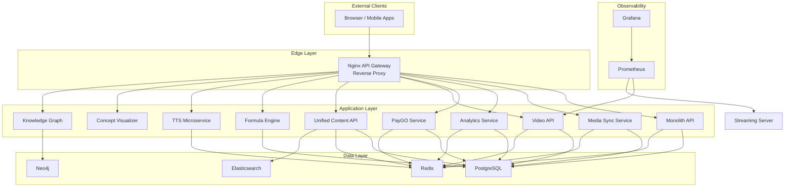
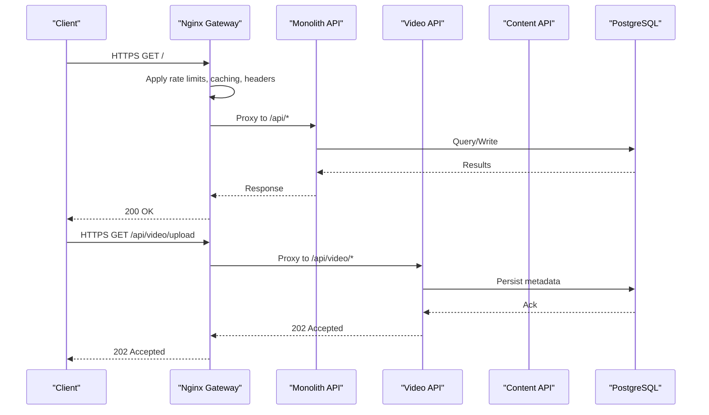
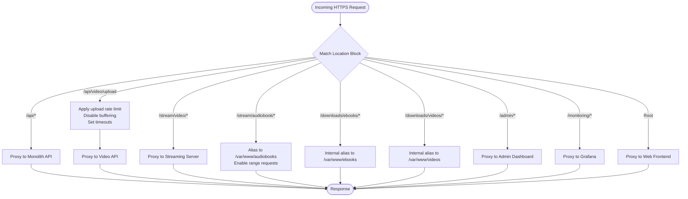
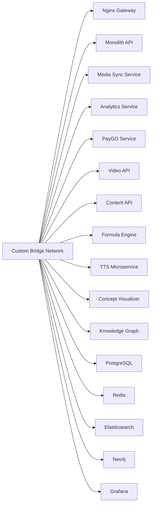
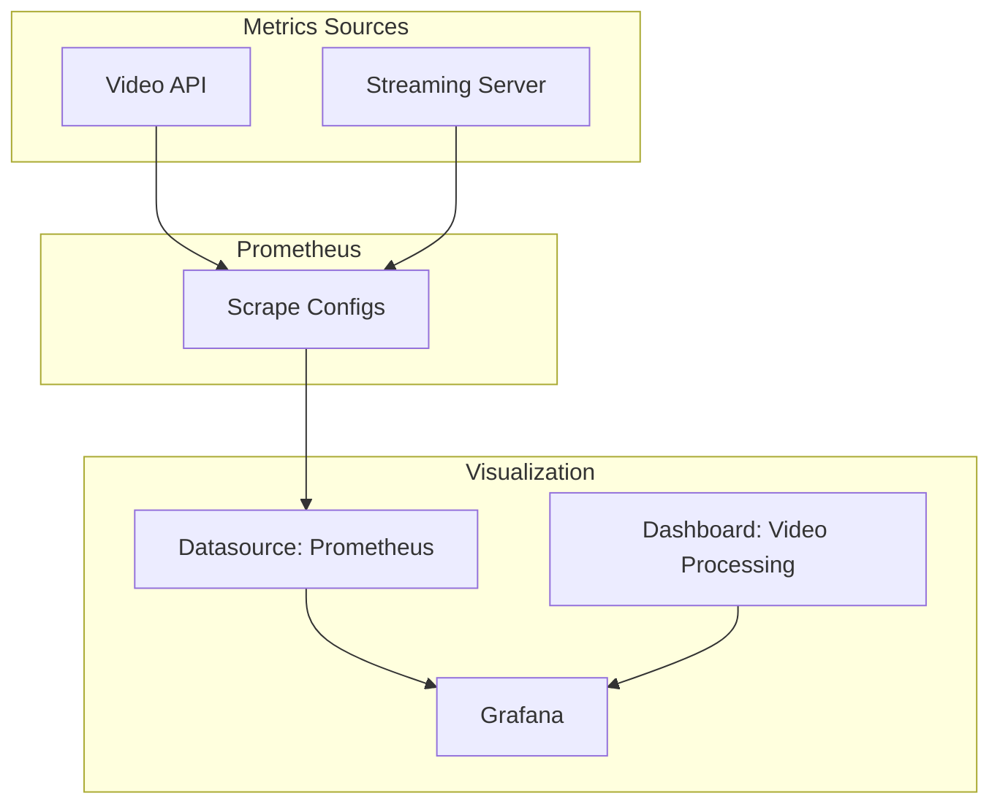
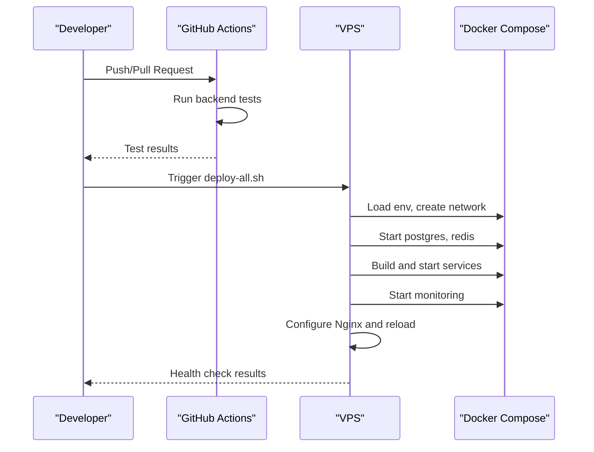
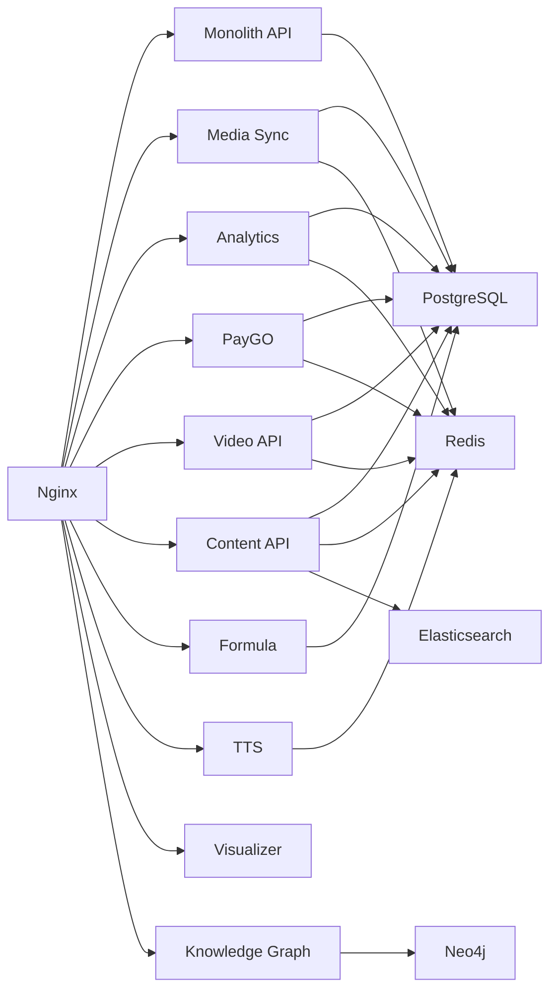

# Infrastructure Design

<cite>
**Referenced Files in This Document**
- [docker-compose.yml](file://infrastructure/docker-compose.yml)
- [docker-compose.complete.yml](file://infrastructure/docker-compose.complete.yml)
- [docker-compose.educational.yml](file://infrastructure/docker-compose.educational.yml)
- [docker-compose.paygo.yml](file://infrastructure/docker-compose.paygo.yml)
- [nginx.conf](file://infrastructure/nginx/nginx.conf)
- [siera.conf](file://infrastructure/nginx/siera.conf)
- [prometheus.yml](file://infrastructure/monitoring/prometheus.yml)
- [datasource.yml](file://grafana/datasources/datasource.yml)
- [video_dashboard.json](file://grafana/dashboards/video_dashboard.json)
- [backend-ci.yml](file://.github/workflows/backend-ci.yml)
- [deploy-all.sh](file://deploy-all.sh)
- [deploy-siera-books.sh](file://deploy-siera-books.sh)
- [Dockerfile (video-api)](file://services/video/api/Dockerfile)
- [Dockerfile (content-api)](file://services/content/api/Dockerfile)
- [docker-compose.yml (vps-migration)](file://infrastructure/vps-migration/docker-compose.yml)
</cite>

## Table of Contents
1. [Introduction](#introduction)
2. [Project Structure](#project-structure)
3. [Core Components](#core-components)
4. [Architecture Overview](#architecture-overview)
5. [Detailed Component Analysis](#detailed-component-analysis)
6. [Dependency Analysis](#dependency-analysis)
7. [Performance Considerations](#performance-considerations)
8. [Troubleshooting Guide](#troubleshooting-guide)
9. [Conclusion](#conclusion)
10. [Appendices](#appendices)

## Introduction
This document describes the infrastructure design for the educational platform, focusing on containerization with Docker Compose, Nginx-based API gateway configuration, and the monitoring ecosystem. It covers network topology with custom bridge networks, persistent volume management, service discovery, load balancing, SSL termination, static asset serving, and monitoring dashboards. It also documents CI/CD pipeline integration, automated deployment processes, environment management, scaling strategies, resource allocation, and cost optimization approaches.

## Project Structure
The infrastructure is composed of:
- A primary Docker Compose stack orchestrating the API gateway, backend services, databases, caches, search, graph database, and monitoring.
- An Nginx configuration acting as the reverse proxy and API gateway, routing traffic to appropriate backend services and serving static assets.
- A monitoring stack with Prometheus and Grafana, including preconfigured dashboards.
- Separate Compose fragments for educational and PayGo extensions.
- CI/CD workflows and deployment scripts for automated provisioning and rollout.

**Diagram sources**
- [docker-compose.yml:1-373](file://infrastructure/docker-compose.yml#L1-L373)
- [siera.conf:44-227](file://infrastructure/nginx/siera.conf#L44-L227)
- [prometheus.yml:1-12](file://infrastructure/monitoring/prometheus.yml#L1-L12)

**Section sources**
- [docker-compose.yml:1-373](file://infrastructure/docker-compose.yml#L1-L373)
- [siera.conf:1-228](file://infrastructure/nginx/siera.conf#L1-L228)

## Core Components
- API Gateway (Nginx): Provides SSL termination, routing, rate limiting, caching, and static asset serving. It routes to backend services and serves monitoring and admin dashboards.
- Monolithic API: Central backend handling authentication, payments, wallets, and bookstore operations.
- Educational Services: Media synchronization, analytics, and PayGO services with dedicated ports and health checks.
- Content APIs: Unified audiobooks, TTS, and bookstore content service.
- Infrastructure: PostgreSQL, Redis, Elasticsearch, Neo4j, and monitoring stack.
- Monitoring: Prometheus scraping selected services and Grafana dashboards.

Key configuration highlights:
- Network: Custom bridge network with a defined subnet for service-to-service communication.
- Volumes: Named volumes for persistent data and bind mounts for logs, media, and models.
- Service Discovery: Internal DNS via Docker networks; services resolve by service name.
- Load Balancing: Nginx upstream blocks distribute traffic to backend instances.
- SSL/TLS: Nginx listens on 443 and proxies to backend services; certificate placement is managed externally.
- Static Assets: Nginx serves frontend assets and media downloads with caching and range support.

**Section sources**
- [docker-compose.yml:1-373](file://infrastructure/docker-compose.yml#L1-L373)
- [siera.conf:44-227](file://infrastructure/nginx/siera.conf#L44-L227)
- [prometheus.yml:1-12](file://infrastructure/monitoring/prometheus.yml#L1-L12)

## Architecture Overview
The system uses a reverse-proxy-first architecture:
- Nginx terminates TLS and routes requests to appropriate services.
- Services communicate internally via the custom bridge network.
- Persistent data is stored in named volumes and bind mounts for logs and media.
- Observability is integrated with Prometheus metrics and Grafana dashboards.

**Diagram sources**
- [siera.conf:52-91](file://infrastructure/nginx/siera.conf#L52-L91)
- [docker-compose.yml:28-50](file://infrastructure/docker-compose.yml#L28-L50)

## Detailed Component Analysis

### Nginx API Gateway
- Responsibilities:
  - SSL termination and HTTP/2 support.
  - Request routing to backend services via upstreams.
  - Rate limiting per endpoint category.
  - Static asset caching and range requests for media.
  - Security headers and CORS for payment endpoints.
- Routing:
  - /api/ -> Monolith API.
  - /api/video/ -> Video API with special upload handling.
  - /stream/video/, /stream/audiobook/ -> Streaming endpoints.
  - /downloads/ -> Internal aliases for protected media downloads.
  - /admin/, /monitoring/ -> Admin dashboard and Grafana.
  - Root -> Web frontend.
- Caching and Compression:
  - Gzip enabled for text-based assets.
  - Cache-Control headers for JS/CSS and media files.
  - Range requests supported for video/audio streaming.
- Security:
  - X-Frame-Options and CORS headers for payment endpoints.
  - Access logging with correlation ID propagation.

**Diagram sources**
- [siera.conf:44-227](file://infrastructure/nginx/siera.conf#L44-L227)

**Section sources**
- [siera.conf:1-228](file://infrastructure/nginx/siera.conf#L1-L228)
- [nginx.conf:1-49](file://infrastructure/nginx/nginx.conf#L1-L49)

### Docker Compose Orchestration
- Networks:
  - Custom bridge network with a fixed subnet enabling predictable internal DNS resolution.
- Volumes:
  - Named volumes for databases and caches.
  - Bind mounts for logs, media, and model directories.
- Services:
  - Monolith API, educational services, content APIs, infrastructure services, and monitoring.
  - Health checks defined for critical services.
- Port Exposure:
  - Nginx exposes 80/443; internal services expose on private ports.
- Environment Variables:
  - Secrets and configuration injected via environment variables and mounted files.

**Diagram sources**
- [docker-compose.yml:358-373](file://infrastructure/docker-compose.yml#L358-L373)

**Section sources**
- [docker-compose.yml:1-373](file://infrastructure/docker-compose.yml#L1-L373)
- [docker-compose.complete.yml:1-344](file://infrastructure/docker-compose.complete.yml#L1-L344)
- [docker-compose.educational.yml:1-106](file://infrastructure/docker-compose.educational.yml#L1-L106)
- [docker-compose.paygo.yml:1-54](file://infrastructure/docker-compose.paygo.yml#L1-L54)

### Monitoring Stack
- Prometheus:
  - Scrapes selected services (e.g., Video API, Streaming Server).
  - Configured with a 15s scrape interval.
- Grafana:
  - Preconfigured Prometheus data source.
  - Includes a video processing dashboard with panels for queue depth, processing time heatmaps, error rates, and stream throughput.
- Metrics Collection:
  - Services expose metrics endpoints; Prometheus scrapes them on configured targets.

**Diagram sources**
- [prometheus.yml:1-12](file://infrastructure/monitoring/prometheus.yml#L1-L12)
- [datasource.yml:1-11](file://grafana/datasources/datasource.yml#L1-L11)
- [video_dashboard.json:1-51](file://grafana/dashboards/video_dashboard.json#L1-L51)

**Section sources**
- [prometheus.yml:1-12](file://infrastructure/monitoring/prometheus.yml#L1-L12)
- [datasource.yml:1-11](file://grafana/datasources/datasource.yml#L1-L11)
- [video_dashboard.json:1-51](file://grafana/dashboards/video_dashboard.json#L1-L51)

### CI/CD Pipeline Integration
- GitHub Actions:
  - Backend tests run on pushes and pull requests.
  - Voice profile tests run in a separate job.
- Deployment Scripts:
  - Automated deployment to VPS with environment loading, network creation, service startup, health checks, and Nginx configuration updates.
  - Production deployment script validates Docker availability, pulls code, starts databases, builds images, sets up SSL, and performs health checks.

**Diagram sources**
- [backend-ci.yml:1-58](file://.github/workflows/backend-ci.yml#L1-L58)
- [deploy-all.sh:1-78](file://deploy-all.sh#L1-L78)
- [deploy-siera-books.sh:1-73](file://deploy-siera-books.sh#L1-L73)

**Section sources**
- [backend-ci.yml:1-58](file://.github/workflows/backend-ci.yml#L1-L58)
- [deploy-all.sh:1-78](file://deploy-all.sh#L1-L78)
- [deploy-siera-books.sh:1-73](file://deploy-siera-books.sh#L1-L73)

### Container Images and Health Checks
- Video API:
  - Alpine-based Node.js image with FFmpeg and tini.
  - Health check probes /health endpoint.
- Content API:
  - Python slim image with FFmpeg and required libraries.
  - Health check probes /health endpoint.

**Section sources**
- [Dockerfile (video-api):1-41](file://services/video/api/Dockerfile#L1-L41)
- [Dockerfile (content-api):1-31](file://services/content/api/Dockerfile#L1-L31)

## Dependency Analysis
- Service Coupling:
  - Nginx depends on backend services; backend services depend on databases and caches.
  - Educational services depend on shared databases and caches.
- External Dependencies:
  - Nginx relies on SSL certificates placed under a mounted directory.
  - Monitoring depends on Prometheus targets and Grafana datasource configuration.
- Potential Circular Dependencies:
  - None observed; dependencies are acyclic and fan-out from Nginx to services.

**Diagram sources**
- [docker-compose.yml:1-373](file://infrastructure/docker-compose.yml#L1-L373)

**Section sources**
- [docker-compose.yml:1-373](file://infrastructure/docker-compose.yml#L1-L373)

## Performance Considerations
- Network Topology:
  - Single custom bridge network reduces latency and enables efficient internal DNS resolution.
- Volume Management:
  - Named volumes for databases and caches ensure persistence and snapshot capability.
  - Bind mounts for logs and media enable centralized logging and scalable storage.
- Load Balancing:
  - Nginx upstreams distribute load; consider adding multiple replicas behind the same upstream for horizontal scaling.
- SSL Termination:
  - Offload TLS to Nginx reduces CPU overhead on backend services.
- Static Asset Serving:
  - Nginx caching and range requests improve media delivery performance.
- GPU Workloads:
  - Dedicated GPU-enabled container for video processing with device reservations.
- Resource Allocation:
  - Use Compose deploy.resources to reserve GPUs and CPUs for compute-intensive tasks.
- Cost Optimization:
  - Consolidate services on fewer hosts; leverage spot instances for batch processing.
  - Use volume snapshots for backups; prune unused images regularly.

[No sources needed since this section provides general guidance]

## Troubleshooting Guide
- Health Checks:
  - Services define health checks; verify target endpoints and network connectivity.
- Logs:
  - Inspect bind-mounted logs for Nginx and services.
- Database Initialization:
  - Verify initialization scripts are present in mounted directories and executed during first boot.
- SSL Certificates:
  - Ensure certificates are placed under the Nginx SSL directory and permissions are correct.
- Monitoring:
  - Confirm Prometheus targets are reachable and Grafana datasource is configured.

**Section sources**
- [docker-compose.yml:107-111](file://infrastructure/docker-compose.yml#L107-L111)
- [docker-compose.complete.yml:72-105](file://infrastructure/docker-compose.complete.yml#L72-L105)
- [docker-compose.educational.yml:29-33](file://infrastructure/docker-compose.educational.yml#L29-L33)
- [docker-compose.paygo.yml:29-33](file://infrastructure/docker-compose.paygo.yml#L29-L33)
- [deploy-all.sh:38-44](file://deploy-all.sh#L38-L44)

## Conclusion
The infrastructure leverages Docker Compose for orchestration, Nginx as a robust API gateway with SSL termination and intelligent routing, and a Prometheus-Grafana monitoring stack for observability. The design emphasizes service isolation, persistent data management, and operational automation through CI/CD and deployment scripts. Scaling and cost optimization can be achieved through horizontal scaling of Nginx and backend services, GPU reservations for compute-heavy tasks, and consolidation of workloads.

[No sources needed since this section summarizes without analyzing specific files]

## Appendices

### Appendix A: Network Topology Details
- Custom bridge network with subnet configuration for deterministic service discovery.
- External exposure limited to Nginx; internal services communicate privately.

**Section sources**
- [docker-compose.yml:358-364](file://infrastructure/docker-compose.yml#L358-L364)

### Appendix B: Volume Management Summary
- Named volumes for databases and caches.
- Bind mounts for logs, media, and model directories.

**Section sources**
- [docker-compose.yml:60-62](file://infrastructure/docker-compose.yml#L60-L62)
- [docker-compose.yml:124-126](file://infrastructure/docker-compose.yml#L124-L126)
- [docker-compose.yml:176-182](file://infrastructure/docker-compose.yml#L176-L182)

### Appendix C: Service Discovery Mechanisms
- Internal DNS resolves service names to container IPs within the custom network.

**Section sources**
- [docker-compose.yml:20-22](file://infrastructure/docker-compose.yml#L20-L22)

### Appendix D: SSL Termination and Static Asset Serving
- Nginx listens on 443; certificates are mounted; static assets cached and range requests supported.

**Section sources**
- [siera.conf:45-227](file://infrastructure/nginx/siera.conf#L45-L227)

### Appendix E: Monitoring Dashboards
- Prometheus configured to scrape selected services; Grafana dashboard JSON defines panels for video metrics.

**Section sources**
- [prometheus.yml:1-12](file://infrastructure/monitoring/prometheus.yml#L1-L12)
- [datasource.yml:1-11](file://grafana/datasources/datasource.yml#L1-L11)
- [video_dashboard.json:1-51](file://grafana/dashboards/video_dashboard.json#L1-L51)

### Appendix F: CI/CD and Automated Deployment
- GitHub Actions for backend testing; deployment scripts for VPS provisioning and health verification.

**Section sources**
- [backend-ci.yml:1-58](file://.github/workflows/backend-ci.yml#L1-L58)
- [deploy-all.sh:1-78](file://deploy-all.sh#L1-L78)
- [deploy-siera-books.sh:1-73](file://deploy-siera-books.sh#L1-L73)

### Appendix G: Legacy VPS Migration Stack
- Separate Compose for migration scenario with explicit network and volume definitions.

**Section sources**
- [docker-compose.yml (vps-migration):1-107](file://infrastructure/vps-migration/docker-compose.yml#L1-L107)