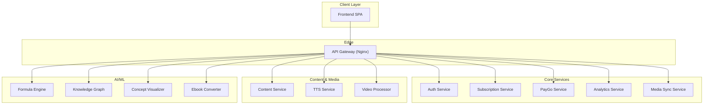
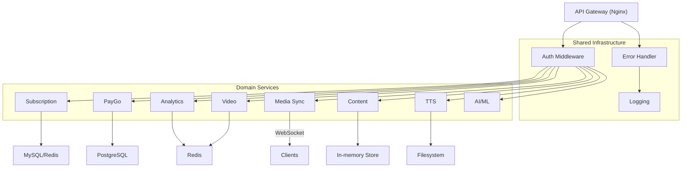
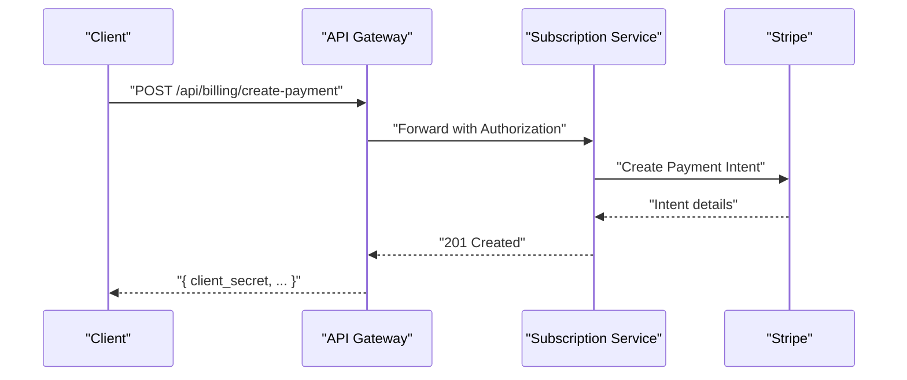
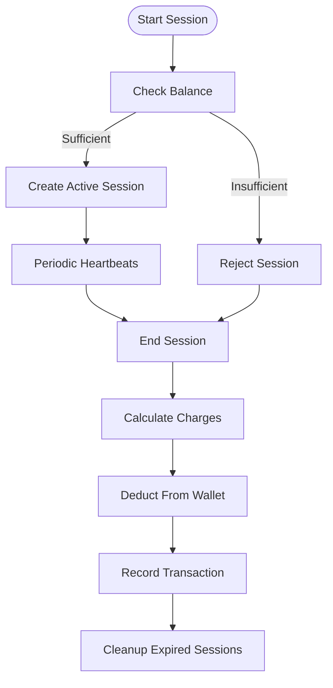
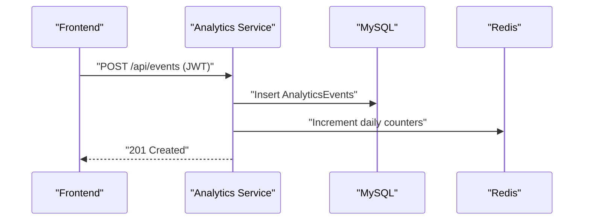
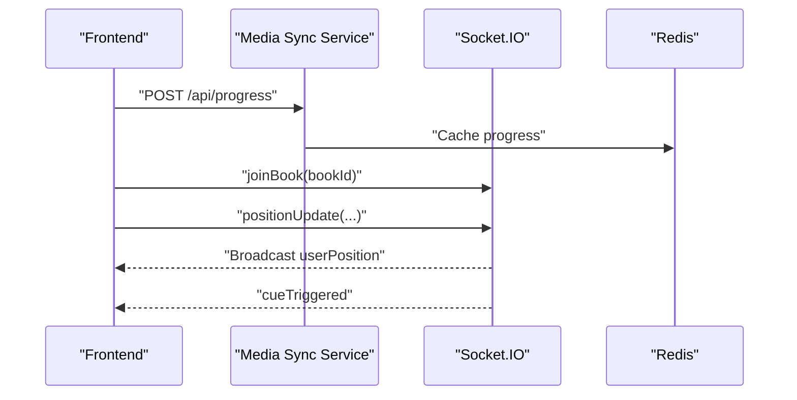
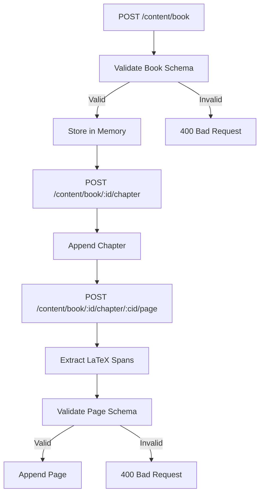
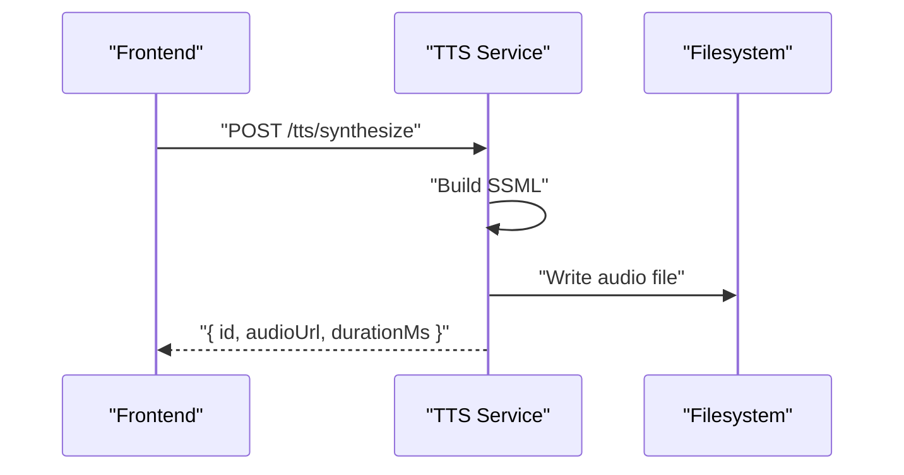
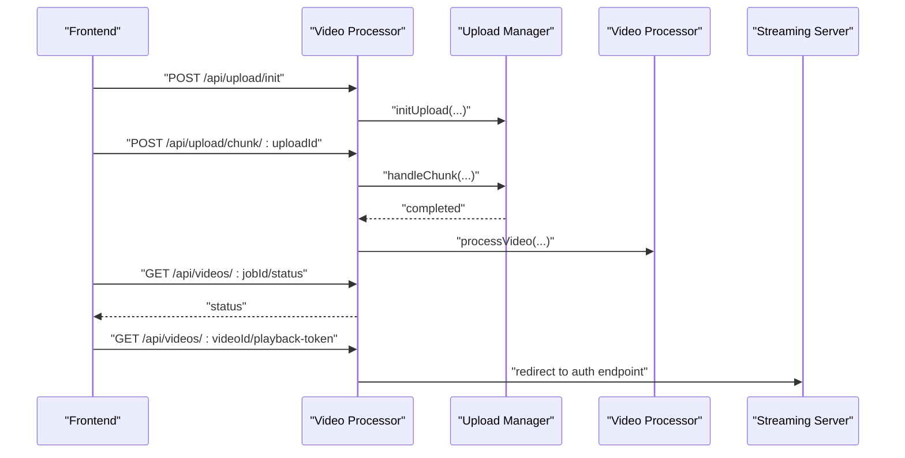
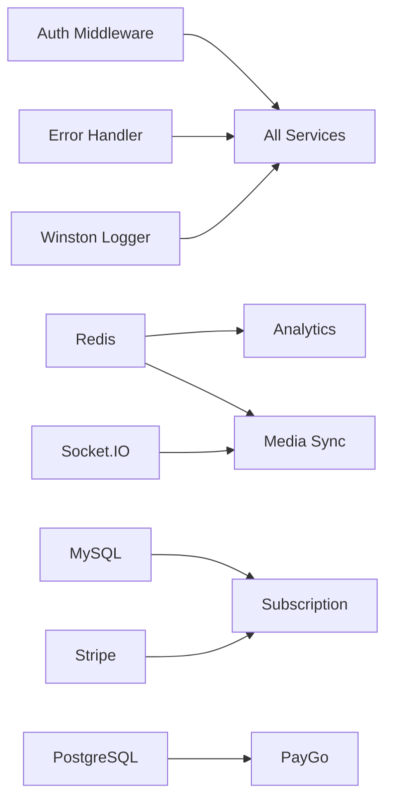

# Microservices Design

<cite>
**Referenced Files in This Document**
- [backend/package.json](file://backend/package.json)
- [services/content/service/src/index.ts](file://services/content/service/src/index.ts)
- [services/video/processor/server.js](file://services/video/processor/server.js)
- [services/tts/node/src/index.ts](file://services/tts/node/src/index.ts)
- [services/subscription/src/index.ts](file://services/subscription/src/index.ts)
- [services/analytics-service/src/server.js](file://services/analytics-service/src/server.js)
- [services/paygo-service/src/server.js](file://services/paygo-service/src/server.js)
- [services/media-sync-service/src/server.js](file://services/media-sync-service/src/server.js)
- [services/auth/server.js](file://services/auth/server.js)
- [services/api-gateway/Dockerfile](file://services/api-gateway/Dockerfile)
- [services/shared/http/errorHandler.js](file://services/shared/http/errorHandler.js)
- [services/shared/middleware/auth.js](file://services/shared/middleware/auth.js)
- [services/knowledge-graph/server.py](file://services/knowledge-graph/server.py)
- [services/concept-visualizer/server.py](file://services/concept-visualizer/server.py)
- [services/formula-engine/server.py](file://services/formula-engine/server.py)
- [services/ebook-converter/server.py](file://services/ebook-converter/server.py)
</cite>

## Table of Contents
1. [Introduction](#introduction)
2. [Project Structure](#project-structure)
3. [Core Components](#core-components)
4. [Architecture Overview](#architecture-overview)
5. [Detailed Component Analysis](#detailed-component-analysis)
6. [Dependency Analysis](#dependency-analysis)
7. [Performance Considerations](#performance-considerations)
8. [Troubleshooting Guide](#troubleshooting-guide)
9. [Conclusion](#conclusion)
10. [Appendices](#appendices)

## Introduction
This document presents a comprehensive microservices architecture design for a modern educational and media platform. It covers the decomposition strategy, bounded contexts, inter-service communication patterns, shared infrastructure, common libraries, and cross-cutting concerns such as authentication, logging, and error handling. It also documents asynchronous communication, event-driven patterns, message queuing systems, service mesh considerations, API gateway responsibilities, and traffic management.

## Project Structure
The platform is organized into:
- A monorepo with a backend service and multiple specialized microservices
- Dedicated services for content processing, video platform, subscription management, PayGo billing, analytics, media synchronization, and AI/ML services
- Shared infrastructure for authentication, error handling, and middleware
- An API Gateway implemented via Nginx

**Diagram sources**
- [services/api-gateway/Dockerfile:1-4](file://services/api-gateway/Dockerfile#L1-L4)
- [services/auth/server.js:1-14](file://services/auth/server.js#L1-L14)
- [services/subscription/src/index.ts:1-586](file://services/subscription/src/index.ts#L1-L586)
- [services/paygo-service/src/server.js:1-707](file://services/paygo-service/src/server.js#L1-L707)
- [services/analytics-service/src/server.js:1-372](file://services/analytics-service/src/server.js#L1-L372)
- [services/media-sync-service/src/server.js:1-309](file://services/media-sync-service/src/server.js#L1-L309)
- [services/content/service/src/index.ts:1-79](file://services/content/service/src/index.ts#L1-L79)
- [services/tts/node/src/index.ts:1-98](file://services/tts/node/src/index.ts#L1-L98)
- [services/video/processor/server.js:1-137](file://services/video/processor/server.js#L1-L137)
- [services/formula-engine/server.py:1-25](file://services/formula-engine/server.py#L1-L25)
- [services/knowledge-graph/server.py:1-23](file://services/knowledge-graph/server.py#L1-L23)
- [services/concept-visualizer/server.py:1-40](file://services/concept-visualizer/server.py#L1-L40)
- [services/ebook-converter/server.py:1-13](file://services/ebook-converter/server.py#L1-L13)

**Section sources**
- [services/api-gateway/Dockerfile:1-4](file://services/api-gateway/Dockerfile#L1-L4)
- [services/auth/server.js:1-14](file://services/auth/server.js#L1-L14)

## Core Components
- API Gateway: Nginx-based routing and TLS termination
- Auth Service: Centralized JWT-based authentication and authorization
- Subscription Service: Plan management, access control, billing intents, Stripe webhooks, usage tracking
- PayGo Service: Wallet management, session-based usage, real-time charging, scheduled maintenance
- Analytics Service: Event ingestion, user/book performance, platform overview, learning insights
- Media Sync Service: Real-time reading progress, synchronized playback cues, Socket.IO rooms
- Content Service: Educational content modeling and formula extraction
- TTS Service: SSML-based synthesis, voice selection, rate/pitch controls, rate limiting
- Video Processor: Chunked uploads, job orchestration, HLS/MP4 generation, streaming proxy
- AI/ML Services: Formula parsing, knowledge graph, concept visualization, ebook conversion

**Section sources**
- [services/subscription/src/index.ts:1-586](file://services/subscription/src/index.ts#L1-L586)
- [services/paygo-service/src/server.js:1-707](file://services/paygo-service/src/server.js#L1-L707)
- [services/analytics-service/src/server.js:1-372](file://services/analytics-service/src/server.js#L1-L372)
- [services/media-sync-service/src/server.js:1-309](file://services/media-sync-service/src/server.js#L1-L309)
- [services/content/service/src/index.ts:1-79](file://services/content/service/src/index.ts#L1-L79)
- [services/tts/node/src/index.ts:1-98](file://services/tts/node/src/index.ts#L1-L98)
- [services/video/processor/server.js:1-137](file://services/video/processor/server.js#L1-L137)
- [services/formula-engine/server.py:1-25](file://services/formula-engine/server.py#L1-L25)
- [services/knowledge-graph/server.py:1-23](file://services/knowledge-graph/server.py#L1-L23)
- [services/concept-visualizer/server.py:1-40](file://services/concept-visualizer/server.py#L1-L40)
- [services/ebook-converter/server.py:1-13](file://services/ebook-converter/server.py#L1-L13)

## Architecture Overview
The system follows a distributed, event-driven design:
- API Gateway centralizes ingress, routing, and rate limiting
- Services communicate via synchronous HTTP and asynchronous messaging
- Shared middleware enforces auth and error handling
- Redis and relational databases support caching and persistence
- Cron-based jobs handle periodic maintenance and auto-topups

**Diagram sources**
- [services/api-gateway/Dockerfile:1-4](file://services/api-gateway/Dockerfile#L1-L4)
- [services/shared/middleware/auth.js:1-48](file://services/shared/middleware/auth.js#L1-L48)
- [services/shared/http/errorHandler.js:1-48](file://services/shared/http/errorHandler.js#L1-L48)
- [services/analytics-service/src/server.js:1-372](file://services/analytics-service/src/server.js#L1-L372)
- [services/paygo-service/src/server.js:1-707](file://services/paygo-service/src/server.js#L1-L707)
- [services/subscription/src/index.ts:1-586](file://services/subscription/src/index.ts#L1-L586)
- [services/media-sync-service/src/server.js:1-309](file://services/media-sync-service/src/server.js#L1-L309)
- [services/video/processor/server.js:1-137](file://services/video/processor/server.js#L1-L137)
- [services/tts/node/src/index.ts:1-98](file://services/tts/node/src/index.ts#L1-L98)
- [services/content/service/src/index.ts:1-79](file://services/content/service/src/index.ts#L1-L79)

## Detailed Component Analysis

### API Gateway
Responsibilities:
- TLS termination and reverse proxy
- Route requests to appropriate services
- Apply global rate limits and security headers

Implementation highlights:
- Nginx container with a single exposed port configuration

Operational notes:
- Use upstream blocks to define service discovery targets
- Configure health checks and circuit breaker-like timeouts

**Section sources**
- [services/api-gateway/Dockerfile:1-4](file://services/api-gateway/Dockerfile#L1-L4)

### Authentication and Authorization
Responsibilities:
- JWT verification and role-based authorization
- Centralized middleware for all downstream services

Implementation highlights:
- JWT verification with HS256
- Role gating and user context injection
- Consistent 401/403 responses

Security considerations:
- Enforce HTTPS and secure cookies in production
- Rotate secrets and enforce short-lived tokens

**Section sources**
- [services/shared/middleware/auth.js:1-48](file://services/shared/middleware/auth.js#L1-L48)

### Subscription Service
Bounded Context:
- Plans, subscriptions, access control, billing integrations, usage tracking

Key capabilities:
- Create/modify subscriptions
- Access checks against entitlements
- Stripe webhooks for payment lifecycle
- Usage tracking with structured schema

Interactions:
- Calls billing engine and subscription manager
- Integrates with Stripe for payment intents and webhooks
- Validates JWT and enforces ownership

**Diagram sources**
- [services/subscription/src/index.ts:379-402](file://services/subscription/src/index.ts#L379-L402)

**Section sources**
- [services/subscription/src/index.ts:1-586](file://services/subscription/src/index.ts#L1-L586)

### PayGo Service
Bounded Context:
- Wallet management, session-based usage, real-time charging, scheduled maintenance

Key capabilities:
- Wallet CRUD, deposits, balance checks
- Session lifecycle: start, heartbeat, end
- Discrete usage reporting with rate cards
- Cron jobs for cleanup and auto-topups

**Diagram sources**
- [services/paygo-service/src/server.js:281-523](file://services/paygo-service/src/server.js#L281-L523)

**Section sources**
- [services/paygo-service/src/server.js:1-707](file://services/paygo-service/src/server.js#L1-L707)

### Analytics Service
Bounded Context:
- Event ingestion, user/book analytics, platform overview, learning insights

Key capabilities:
- JWT-protected endpoints for event tracking
- Aggregated analytics queries with Redis caching
- Admin-only platform overview

**Diagram sources**
- [services/analytics-service/src/server.js:78-112](file://services/analytics-service/src/server.js#L78-L112)

**Section sources**
- [services/analytics-service/src/server.js:1-372](file://services/analytics-service/src/server.js#L1-L372)

### Media Sync Service
Bounded Context:
- Real-time reading progress, synchronized playback, cue triggers

Key capabilities:
- REST endpoints for cues and progress
- Socket.IO rooms for collaborative reading
- Redis caching for positions and progress

**Diagram sources**
- [services/media-sync-service/src/server.js:238-284](file://services/media-sync-service/src/server.js#L238-L284)

**Section sources**
- [services/media-sync-service/src/server.js:1-309](file://services/media-sync-service/src/server.js#L1-L309)

### Content Service
Bounded Context:
- Educational content modeling and formula extraction

Key capabilities:
- Create books, chapters, pages
- Extract LaTeX spans from page text
- Zod-based validation

**Diagram sources**
- [services/content/service/src/index.ts:32-76](file://services/content/service/src/index.ts#L32-L76)

**Section sources**
- [services/content/service/src/index.ts:1-79](file://services/content/service/src/index.ts#L1-L79)

### TTS Service
Bounded Context:
- Text-to-Speech synthesis with SSML, voice selection, rate/pitch controls

Key capabilities:
- Rate-limited synthesis endpoint
- Safe file path handling
- Voice catalog retrieval

**Diagram sources**
- [services/tts/node/src/index.ts:45-85](file://services/tts/node/src/index.ts#L45-L85)

**Section sources**
- [services/tts/node/src/index.ts:1-98](file://services/tts/node/src/index.ts#L1-L98)

### Video Processor
Bounded Context:
- Chunked uploads, job orchestration, HLS/MP4 generation, streaming proxy

Key capabilities:
- Upload initiation and chunked upload handling
- Job status polling
- Streaming server integration

**Diagram sources**
- [services/video/processor/server.js:62-113](file://services/video/processor/server.js#L62-L113)

**Section sources**
- [services/video/processor/server.js:1-137](file://services/video/processor/server.js#L1-L137)

### AI/ML Services
- Formula Engine: Parse mathematical expressions
- Knowledge Graph: Find related concepts
- Concept Visualizer: Generate concept images
- Ebook Converter: Basic converter service

Operational notes:
- Lightweight Flask services
- Health endpoints for readiness/liveness
- Containerized deployments

**Section sources**
- [services/formula-engine/server.py:1-25](file://services/formula-engine/server.py#L1-L25)
- [services/knowledge-graph/server.py:1-23](file://services/knowledge-graph/server.py#L1-L23)
- [services/concept-visualizer/server.py:1-40](file://services/concept-visualizer/server.py#L1-L40)
- [services/ebook-converter/server.py:1-13](file://services/ebook-converter/server.py#L1-L13)

## Dependency Analysis
Cross-cutting concerns:
- Authentication: JWT middleware applied across services
- Error handling: Shared error handler attaches correlation IDs and logs
- Logging: Winston-based structured logging
- Observability: Health endpoints across services

External dependencies (selected):
- Redis for caching and pub/sub
- MySQL/PostgreSQL for persistence
- Stripe for billing
- Socket.IO for real-time features

**Diagram sources**
- [services/shared/middleware/auth.js:1-48](file://services/shared/middleware/auth.js#L1-L48)
- [services/shared/http/errorHandler.js:1-48](file://services/shared/http/errorHandler.js#L1-L48)
- [services/analytics-service/src/server.js:1-372](file://services/analytics-service/src/server.js#L1-L372)
- [services/media-sync-service/src/server.js:1-309](file://services/media-sync-service/src/server.js#L1-L309)
- [services/subscription/src/index.ts:1-586](file://services/subscription/src/index.ts#L1-L586)
- [services/paygo-service/src/server.js:1-707](file://services/paygo-service/src/server.js#L1-L707)

**Section sources**
- [services/shared/http/errorHandler.js:1-48](file://services/shared/http/errorHandler.js#L1-L48)
- [services/shared/middleware/auth.js:1-48](file://services/shared/middleware/auth.js#L1-L48)
- [services/analytics-service/src/server.js:1-372](file://services/analytics-service/src/server.js#L1-L372)
- [services/media-sync-service/src/server.js:1-309](file://services/media-sync-service/src/server.js#L1-L309)
- [services/subscription/src/index.ts:1-586](file://services/subscription/src/index.ts#L1-L586)
- [services/paygo-service/src/server.js:1-707](file://services/paygo-service/src/server.js#L1-L707)

## Performance Considerations
- Caching: Use Redis for hot reads (progress, cues, counters)
- Database pooling: Connection pools for Postgres/MySQL
- Rate limiting: Per-route and global rate limits at gateway and service level
- Asynchronous processing: Offload heavy work to workers or background jobs
- CDN and static assets: Serve media via CDN or dedicated static hosts
- Circuit breakers: Implement timeout/retry policies and fallbacks for downstream calls

## Troubleshooting Guide
Common issues and resolutions:
- Authentication failures: Verify JWT secret, token format, and expiration
- Database connectivity: Check connection strings and pool sizes
- Redis unavailability: Monitor health endpoints and enable failover
- CORS errors: Align origins and allowed headers across services
- WebSocket disconnects: Validate rooms and broadcast logic

Operational tools:
- Health endpoints for readiness probes
- Structured logs with correlation IDs
- Sentry integration for error tracking

**Section sources**
- [services/shared/http/errorHandler.js:1-48](file://services/shared/http/errorHandler.js#L1-L48)
- [services/analytics-service/src/server.js:349-356](file://services/analytics-service/src/server.js#L349-L356)
- [services/paygo-service/src/server.js:684-691](file://services/paygo-service/src/server.js#L684-L691)
- [services/media-sync-service/src/server.js:286-293](file://services/media-sync-service/src/server.js#L286-L293)
- [services/subscription/src/index.ts:161-180](file://services/subscription/src/index.ts#L161-L180)

## Conclusion
The platform employs a clean microservices architecture with well-defined bounded contexts, shared infrastructure, and robust cross-cutting concerns. The design balances synchronous HTTP APIs with real-time features and asynchronous workflows, enabling scalability and maintainability. Adopting the recommended patterns for service mesh, API gateway, and observability will further strengthen the system’s resilience and operability.

## Appendices
- Service Registry: Not present in the current codebase; consider Consul, Eureka, or Kubernetes Services for dynamic discovery
- Load Balancing: Nginx or Envoy for L7 routing; Kubernetes Services for internal load balancing
- Circuit Breakers: Implement via Envoy, Resilience4j, or client-side retries/timeouts
- Message Queues: Introduce Kafka/RabbitMQ for decoupled event processing (e.g., analytics, billing)
- Service Mesh: Istio or Linkerd for mTLS, telemetry, and traffic shaping