# Overall System Design

<cite>
**Referenced Files in This Document**
- [docker-compose.yml](file://infrastructure/docker-compose.yml)
- [DEPLOYMENT.md](file://docs/DEPLOYMENT.md)
- [SERVICES.md](file://docs/SERVICES.md)
- [server.js](file://backend/server.js)
- [package.json](file://backend/package.json)
- [App.tsx](file://frontend/src/App.tsx)
- [package.json](file://frontend/package.json)
- [nginx.conf](file://infrastructure/nginx/nginx.conf)
- [Dockerfile](file://services/api-gateway/Dockerfile)
- [Dockerfile](file://services/content/api/Dockerfile)
- [Dockerfile](file://services/video/api/Dockerfile)
- [Dockerfile](file://services/tts/python/Dockerfile)
- [index.ts](file://services/subscription/src/index.ts)
- [server.js](file://services/auth/server.js)
- [app.py](file://services/ai-gen/app.py)
- [elevenlabs.ts](file://services/voice/profile/src/providers/elevenlabs.ts)
- [geminiService.ts](file://frontend/src/services/geminiService.ts)
- [paymentService.ts](file://frontend/src/services/paymentService.ts)
</cite>

## Table of Contents
1. [Introduction](#introduction)
2. [Project Structure](#project-structure)
3. [Core Components](#core-components)
4. [Architecture Overview](#architecture-overview)
5. [Detailed Component Analysis](#detailed-component-analysis)
6. [Dependency Analysis](#dependency-analysis)
7. [Performance Considerations](#performance-considerations)
8. [Troubleshooting Guide](#troubleshooting-guide)
9. [Conclusion](#conclusion)
10. [Appendices](#appendices)

## Introduction
QuantumMint Bookstore is a modern, containerized learning and publishing platform integrating a React frontend, a unified API gateway, a monolithic backend, and a set of specialized microservices. The system emphasizes layered architecture (presentation, business logic, data access), robust containerization with Docker Compose, and strategic integrations with external systems such as Stripe for payments, ElevenLabs for voice cloning and synthesis, and Gemini AI for content generation and TTS.

## Project Structure
The repository is organized into distinct areas:
- frontend: React application with TypeScript and Vite
- backend: Node.js/Express monolith with route-driven controllers and Sequelize ORM
- infrastructure: Docker Compose orchestration, Nginx configuration, monitoring
- services: Microservices for video, content, subscription, TTS, voice, AI generation, analytics, and more
- docs: Deployment, service, and operational documentation
- database: Initialization scripts and schema updates
- mail-server and domain controller: Legacy services included for historical completeness

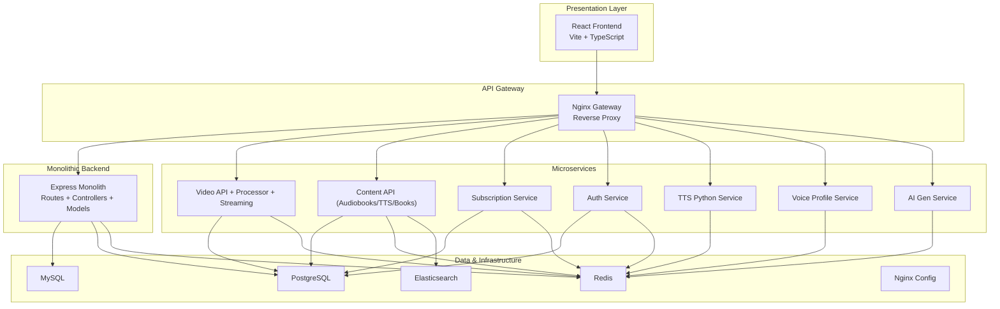

**Diagram sources**
- [docker-compose.yml:1-373](file://infrastructure/docker-compose.yml#L1-L373)
- [nginx.conf:1-49](file://infrastructure/nginx/nginx.conf#L1-L49)
- [server.js:1-155](file://backend/server.js#L1-L155)
- [index.ts:1-586](file://services/subscription/src/index.ts#L1-L586)

**Section sources**
- [docker-compose.yml:1-373](file://infrastructure/docker-compose.yml#L1-L373)
- [SERVICES.md:1-396](file://docs/SERVICES.md#L1-L396)

## Core Components
- React Frontend: Single-page application with protected routes, lazy loading, and role-based access. It consumes backend APIs and integrates AI services for immersive content.
- API Gateway (Nginx): Centralized routing and SSL termination, forwarding traffic to backend monolith, microservices, and static assets.
- Monolithic Backend: Express server with route modules, middleware for security and logging, Sequelize ORM, and background workers for subscriptions.
- Microservices:
  - Auth: Lightweight health-checked service.
  - Subscription: Billing, access control, usage tracking, and Stripe webhooks.
  - Video: API, processor (GPU-enabled), streaming server.
  - Content: Unified audiobooks/TTS/bookstore API with Elasticsearch and Redis.
  - TTS: Python FastAPI service for speech synthesis.
  - Voice: Voice profile management with ElevenLabs integration.
  - AI Gen: Flask health endpoint for AI generation service.
- Data & Infrastructure: MySQL, PostgreSQL, Redis, Elasticsearch, Grafana/Prometheus monitoring.

**Section sources**
- [App.tsx:1-160](file://frontend/src/App.tsx#L1-L160)
- [nginx.conf:1-49](file://infrastructure/nginx/nginx.conf#L1-L49)
- [server.js:1-155](file://backend/server.js#L1-L155)
- [index.ts:1-586](file://services/subscription/src/index.ts#L1-L586)
- [docker-compose.yml:1-373](file://infrastructure/docker-compose.yml#L1-L373)

## Architecture Overview
The system follows a layered architecture:
- Presentation: React SPA with protected routes and role-based navigation.
- Business Logic: Express monolith routes and controllers; microservices encapsulate domain concerns (subscriptions, video processing, voice cloning).
- Data Access: Sequelize ORM for relational models; PostgreSQL/MySQL for persistence; Redis for caching and messaging; Elasticsearch for content search.

External integrations:
- Stripe: Payment processing and webhooks handled by the subscription service and backend payment routes.
- ElevenLabs: Voice cloning and synthesis via the voice profile service provider.
- Gemini AI: Frontend service for text-to-audio generation using Google’s generative models.

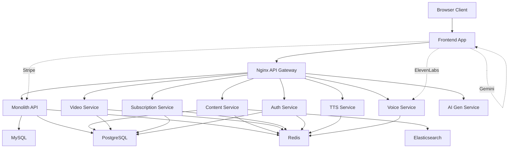

**Diagram sources**
- [docker-compose.yml:1-373](file://infrastructure/docker-compose.yml#L1-L373)
- [nginx.conf:1-49](file://infrastructure/nginx/nginx.conf#L1-L49)
- [server.js:1-155](file://backend/server.js#L1-L155)
- [index.ts:1-586](file://services/subscription/src/index.ts#L1-L586)
- [elevenlabs.ts:1-78](file://services/voice/profile/src/providers/elevenlabs.ts#L1-L78)
- [geminiService.ts:68-114](file://frontend/src/services/geminiService.ts#L68-L114)

## Detailed Component Analysis

### API Gateway (Nginx)
- Purpose: Reverse proxy and load balancing across backend monolith and microservices; serves static assets and media.
- Configuration: Upstreams for video-api, streaming-server, admin-dashboard; location blocks for /api/, /stream/, /admin/.
- SSL/TLS: Mounted SSL certificates volume; listens on 80/443.

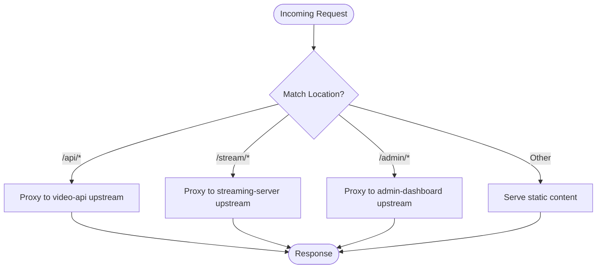

**Diagram sources**
- [nginx.conf:1-49](file://infrastructure/nginx/nginx.conf#L1-L49)
- [Dockerfile:1-4](file://services/api-gateway/Dockerfile#L1-L4)

**Section sources**
- [nginx.conf:1-49](file://infrastructure/nginx/nginx.conf#L1-L49)
- [Dockerfile:1-4](file://services/api-gateway/Dockerfile#L1-L4)

### Monolithic Backend (Express)
- Responsibilities: Authentication, payments, purchases, wallet, educational content, TTS, formula processing, learner interactions, search, seller/admin management, refunds, subscriptions.
- Security: Helmet, CORS, rate limiting, request ID logging, centralized error handling.
- Data Access: Sequelize ORM with MySQL/PostgreSQL; background worker for subscription tasks.
- Routing: Modular route files under routes/.

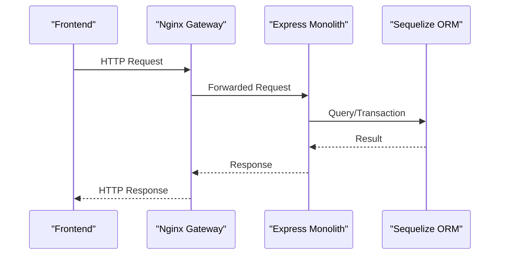

**Diagram sources**
- [server.js:1-155](file://backend/server.js#L1-L155)
- [package.json:1-52](file://backend/package.json#L1-L52)

**Section sources**
- [server.js:1-155](file://backend/server.js#L1-L155)
- [package.json:1-52](file://backend/package.json#L1-L52)

### Subscription Service (TypeScript/Express)
- Responsibilities: Subscription lifecycle, access control, billing intents, Stripe webhooks, usage tracking.
- Security: JWT authentication and authorization middleware; strict schema validation with Zod.
- Health: Built-in /health endpoint; Docker healthcheck configured.

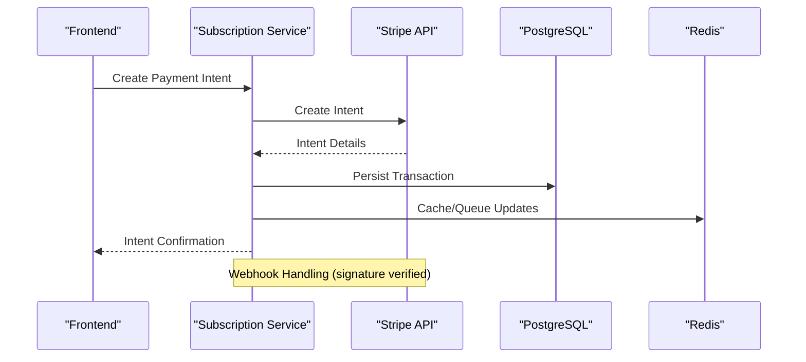

**Diagram sources**
- [index.ts:1-586](file://services/subscription/src/index.ts#L1-L586)

**Section sources**
- [index.ts:1-586](file://services/subscription/src/index.ts#L1-L586)

### Video Platform (Node.js + Python)
- Components: video-api (Node), video-processor (Python/GPU), streaming-server (Node).
- Persistence: PostgreSQL for metadata; Redis for coordination; mounted volumes for media storage.
- Streaming: RTMP and HTTP streaming endpoints.

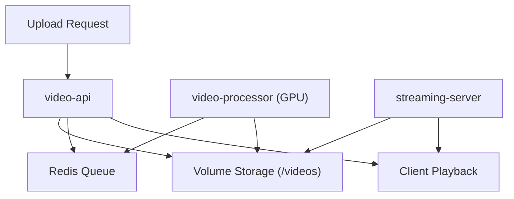

**Diagram sources**
- [docker-compose.yml:114-163](file://infrastructure/docker-compose.yml#L114-L163)
- [Dockerfile:1-41](file://services/video/api/Dockerfile#L1-L41)

**Section sources**
- [docker-compose.yml:114-163](file://infrastructure/docker-compose.yml#L114-L163)
- [Dockerfile:1-41](file://services/video/api/Dockerfile#L1-L41)

### Content API (Unified Audiobooks/TTS/Books)
- Purpose: Serve audiobooks, TTS synthesis, and book-related content; integrates Elasticsearch and Redis.
- Containerization: Python-based with FFmpeg dependencies; healthchecked.

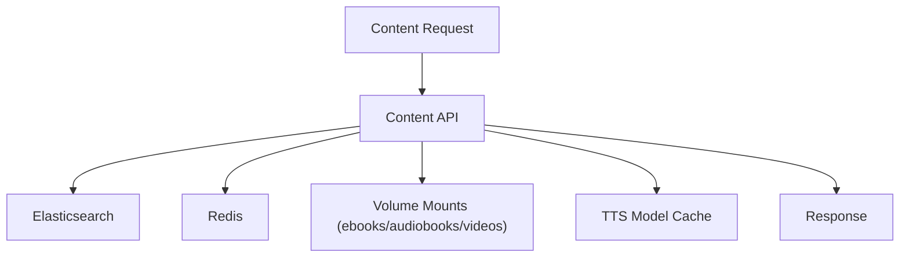

**Diagram sources**
- [docker-compose.yml:165-191](file://infrastructure/docker-compose.yml#L165-L191)
- [Dockerfile:1-31](file://services/content/api/Dockerfile#L1-L31)

**Section sources**
- [docker-compose.yml:165-191](file://infrastructure/docker-compose.yml#L165-L191)
- [Dockerfile:1-31](file://services/content/api/Dockerfile#L1-L31)

### TTS Service (Python/FastAPI)
- Purpose: Speech synthesis with Redis-backed coordination.
- Runtime: Uvicorn; exposed on port 8000.

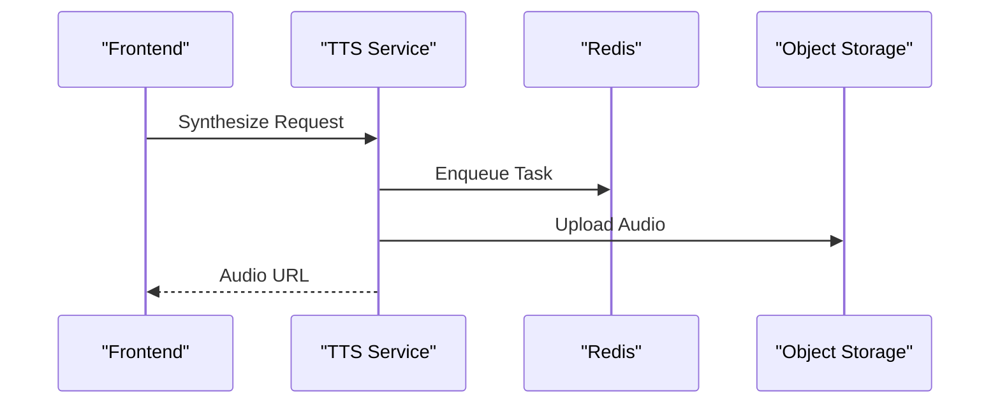

**Diagram sources**
- [docker-compose.yml:209-222](file://infrastructure/docker-compose.yml#L209-L222)
- [Dockerfile:1-26](file://services/tts/python/Dockerfile#L1-L26)

**Section sources**
- [docker-compose.yml:209-222](file://infrastructure/docker-compose.yml#L209-L222)
- [Dockerfile:1-26](file://services/tts/python/Dockerfile#L1-L26)

### Voice Profile Service (ElevenLabs Integration)
- Provider: ElevenLabs API for voice cloning and synthesis.
- Workflow: Clone voice via samples; synthesize text to audio; upload to storage.

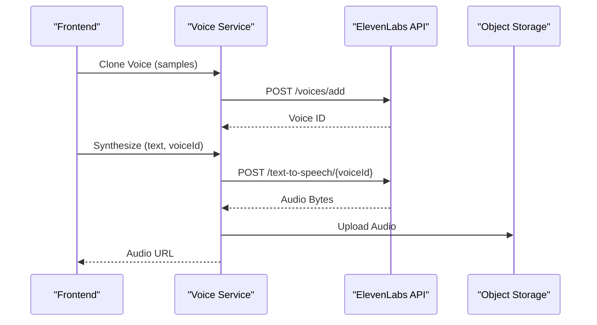

**Diagram sources**
- [elevenlabs.ts:1-78](file://services/voice/profile/src/providers/elevenlabs.ts#L1-L78)

**Section sources**
- [elevenlabs.ts:1-78](file://services/voice/profile/src/providers/elevenlabs.ts#L1-L78)

### AI Generation and Gemini Integration
- Frontend service leverages @google/genai to generate immersive content and TTS audio via Gemini models.
- Provides fallback error handling and conversion utilities for PCM/WAV.

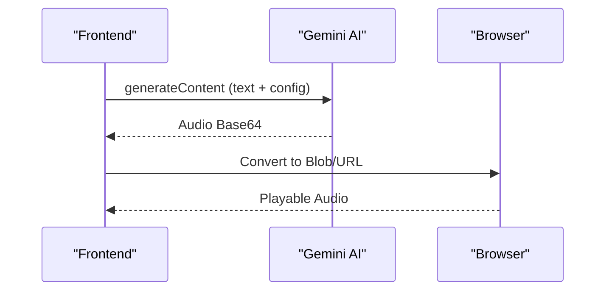

**Diagram sources**
- [geminiService.ts:68-114](file://frontend/src/services/geminiService.ts#L68-L114)
- [package.json:12-34](file://frontend/package.json#L12-L34)

**Section sources**
- [geminiService.ts:68-114](file://frontend/src/services/geminiService.ts#L68-L114)
- [package.json:12-34](file://frontend/package.json#L12-L34)

### Auth Service
- Lightweight health endpoint; intended for authentication and identity management across the platform.

**Section sources**
- [server.js:1-14](file://services/auth/server.js#L1-L14)

### AI Gen Service
- Minimal Flask health endpoint for AI generation service.

**Section sources**
- [app.py:1-13](file://services/ai-gen/app.py#L1-L13)

## Dependency Analysis
- Container orchestration: Docker Compose defines 15+ services across networks and volumes; includes healthchecks and GPU reservations for video processing.
- Inter-service communication: Nginx upstreams; internal Docker networking; Redis for caching and messaging; PostgreSQL for relational data; Elasticsearch for search.
- External integrations: Stripe SDK in backend; ElevenLabs provider in voice service; Gemini SDK in frontend.

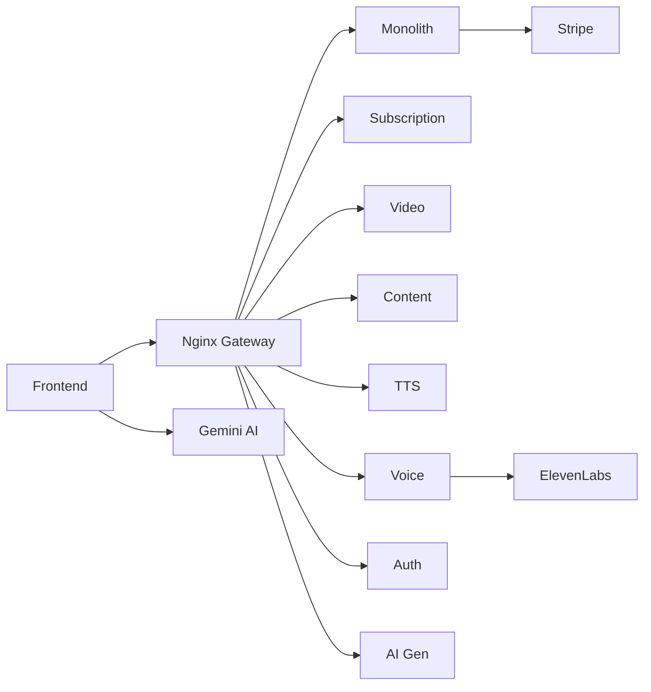

**Diagram sources**
- [docker-compose.yml:1-373](file://infrastructure/docker-compose.yml#L1-L373)
- [server.js:1-155](file://backend/server.js#L1-L155)
- [index.ts:1-586](file://services/subscription/src/index.ts#L1-L586)
- [elevenlabs.ts:1-78](file://services/voice/profile/src/providers/elevenlabs.ts#L1-L78)
- [geminiService.ts:68-114](file://frontend/src/services/geminiService.ts#L68-L114)

**Section sources**
- [docker-compose.yml:1-373](file://infrastructure/docker-compose.yml#L1-L373)
- [DEPLOYMENT.md:1-761](file://docs/DEPLOYMENT.md#L1-L761)

## Performance Considerations
- Containerization: Multi-stage builds, non-root users, healthchecks, and resource reservations (e.g., GPU) improve reliability and performance.
- Caching: Redis used for sessions, queues, and short-term caches; Elasticsearch for search performance.
- Media: Volume mounts for videos/audiobooks reduce I/O overhead; streaming server optimized for low-latency delivery.
- Frontend: Lazy loading and route-based code splitting minimize bundle sizes; Sentry for error tracking and performance monitoring.

[No sources needed since this section provides general guidance]

## Troubleshooting Guide
- Health checks: Use built-in /health endpoints for services; verify Docker health status.
- Logs: Access service logs via Docker Compose; centralized logging volumes for gateway and video API.
- Networking: Confirm Nginx upstreams and container connectivity; verify service ports and dependencies.
- Payments: Validate Stripe webhooks signature verification and environment variables.
- Voice/Storage: Ensure ElevenLabs API key and storage upload permissions are configured.

**Section sources**
- [index.ts:161-180](file://services/subscription/src/index.ts#L161-L180)
- [docker-compose.yml:107-111](file://infrastructure/docker-compose.yml#L107-L111)
- [DEPLOYMENT.md:445-507](file://docs/DEPLOYMENT.md#L445-L507)

## Conclusion
QuantumMint Bookstore employs a layered, container-first architecture integrating a React frontend, an Nginx API gateway, a feature-rich monolithic backend, and a suite of specialized microservices. The design emphasizes modularity, scalability, and resilience through Docker Compose orchestration, Redis/Elasticsearch caching, and health-checked services. Strategic integrations with Stripe, ElevenLabs, and Gemini enhance monetization, voice personalization, and AI-driven content creation.

[No sources needed since this section summarizes without analyzing specific files]

## Appendices

### Deployment Strategy Highlights
- Local development: Vite for frontend, Node servers for backend and microservices.
- Staging/Production: Vercel for frontend; backend and microservices deployed via Docker Compose or platform-specific runners; CI/CD via GitHub Actions.
- Security: Environment variables, SSL/TLS, rate limiting, and audit logging.

**Section sources**
- [DEPLOYMENT.md:1-761](file://docs/DEPLOYMENT.md#L1-L761)