# System Architecture

<cite>
**Referenced Files in This Document**
- [docker-compose.yml](file://infrastructure/docker-compose.yml)
- [nginx.conf](file://infrastructure/nginx/nginx.conf)
- [server.js](file://backend/server.js)
- [package.json](file://backend/package.json)
- [main.tsx](file://frontend/src/main.tsx)
- [App.tsx](file://frontend/src/App.tsx)
- [client.ts](file://frontend/src/api/client.ts)
- [package.json](file://frontend/package.json)
- [server.js](file://services/auth/server.js)
- [index.ts](file://services/subscription/src/index.ts)
- [app.py](file://services/content/api/app.py)
- [server.js](file://services/video/api/server.js)
- [server.py](file://services/tts/python/server.py)
- [Dockerfile](file://services/api-gateway/Dockerfile)
- [config.js](file://services/shared/config.js)
- [DEPLOYMENT.md](file://docs/DEPLOYMENT.md)
- [SERVICES.md](file://docs/SERVICES.md)
</cite>

## Table of Contents
1. [Introduction](#introduction)
2. [Project Structure](#project-structure)
3. [Core Components](#core-components)
4. [Architecture Overview](#architecture-overview)
5. [Detailed Component Analysis](#detailed-component-analysis)
6. [Dependency Analysis](#dependency-analysis)
7. [Performance Considerations](#performance-considerations)
8. [Troubleshooting Guide](#troubleshooting-guide)
9. [Conclusion](#conclusion)
10. [Appendices](#appendices)

## Introduction
This document describes the system architecture of the QuantumMint Bookstore platform. It explains the microservices architecture pattern, container orchestration with Docker, and inter-service communication mechanisms. The layered architecture includes a frontend React application, an API gateway, backend services, and external integrations. It documents component interactions, data flows, and integration patterns including REST APIs, streaming endpoints, and event-driven communication. It also covers infrastructure requirements, scalability, load balancing, deployment topology, and cross-cutting concerns such as security, monitoring, caching, and disaster recovery.

## Project Structure
The platform is organized into distinct layers and services:
- Frontend: React application with routing, authentication, and service clients
- API Gateway: Nginx-based reverse proxy and load balancer
- Backend Services: Node.js monolith and specialized microservices (authentication, subscriptions, content, video, TTS, etc.)
- Infrastructure: Docker Compose orchestration, databases, caches, and monitoring
- External Integrations: Payment providers, analytics, and third-party APIs

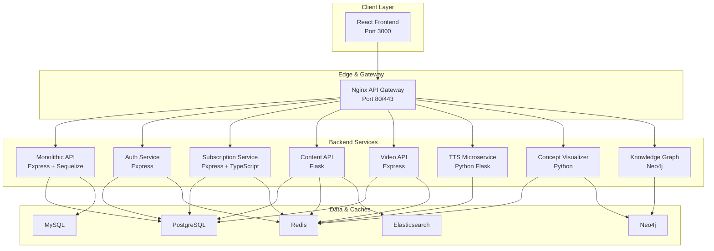

**Diagram sources**
- [docker-compose.yml:1-373](file://infrastructure/docker-compose.yml#L1-L373)
- [nginx.conf:1-49](file://infrastructure/nginx/nginx.conf#L1-L49)
- [server.js:1-155](file://backend/server.js#L1-L155)
- [server.js:1-14](file://services/auth/server.js#L1-L14)
- [index.ts:1-586](file://services/subscription/src/index.ts#L1-L586)
- [app.py:1-266](file://services/content/api/app.py#L1-L266)
- [server.js:1-445](file://services/video/api/server.js#L1-L445)
- [server.py:1-190](file://services/tts/python/server.py#L1-L190)

**Section sources**
- [docker-compose.yml:1-373](file://infrastructure/docker-compose.yml#L1-L373)
- [nginx.conf:1-49](file://infrastructure/nginx/nginx.conf#L1-L49)

## Core Components
- Frontend React Application
  - Routing and protected routes
  - Authentication and store contexts
  - Axios-based API client with interceptors
- API Gateway (Nginx)
  - Reverse proxy and load balancing across backend services
  - Static asset serving and SSL termination
- Backend Services
  - Monolithic API (Express): routes for auth, payments, purchases, education, TTS, formulas, interactions, search, sellers, admin, learners, subscriptions, refunds
  - Auth Service (Express): health endpoint
  - Subscription Service (Express + TypeScript): JWT auth, rate limiting, subscription lifecycle, billing webhooks, usage tracking
  - Content API (Flask): audiobook generation, TTS synthesis, content search and upload
  - Video API (Express): chunked uploads, Redis-backed state, queueing, HLS/MP4 encoding, Prometheus metrics
  - TTS Microservice (Python Flask): text segmentation, SSML generation, caching, rate limiting
  - Concept Visualizer (Python): scientific visualization
  - Knowledge Graph (Neo4j): graph data and reasoning
- Infrastructure
  - Docker Compose orchestration with bridged networks and named volumes
  - PostgreSQL, MySQL, Redis, Elasticsearch, Neo4j
  - Grafana/Prometheus monitoring stack

**Section sources**
- [main.tsx:1-17](file://frontend/src/main.tsx#L1-L17)
- [App.tsx:1-160](file://frontend/src/App.tsx#L1-L160)
- [client.ts:1-119](file://frontend/src/api/client.ts#L1-L119)
- [server.js:1-155](file://backend/server.js#L1-L155)
- [server.js:1-14](file://services/auth/server.js#L1-L14)
- [index.ts:1-586](file://services/subscription/src/index.ts#L1-L586)
- [app.py:1-266](file://services/content/api/app.py#L1-L266)
- [server.js:1-445](file://services/video/api/server.js#L1-L445)
- [server.py:1-190](file://services/tts/python/server.py#L1-L190)
- [docker-compose.yml:1-373](file://infrastructure/docker-compose.yml#L1-L373)

## Architecture Overview
The system follows a microservices architecture with a centralized API Gateway (Nginx) that routes traffic to backend services. The frontend communicates with the backend via REST APIs and consumes streaming endpoints where applicable. Services share common infrastructure (PostgreSQL, Redis, Elasticsearch, Neo4j) and rely on Docker Compose for orchestration.

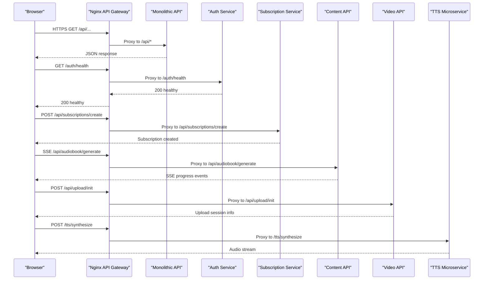

**Diagram sources**
- [nginx.conf:1-49](file://infrastructure/nginx/nginx.conf#L1-L49)
- [server.js:128-142](file://backend/server.js#L128-L142)
- [server.js:7-9](file://services/auth/server.js#L7-L9)
- [index.ts:217-238](file://services/subscription/src/index.ts#L217-L238)
- [app.py:61-113](file://services/content/api/app.py#L61-L113)
- [server.js:268-276](file://services/video/api/server.js#L268-L276)
- [server.py:134-185](file://services/tts/python/server.py#L134-L185)

## Detailed Component Analysis

### Frontend Layer
- React application bootstrapped with Sentry and React Query
- Protected routes enforce authentication and role-based access
- Axios client injects auth token and handles 401 redirects
- Environment-based service URLs for backend microservices

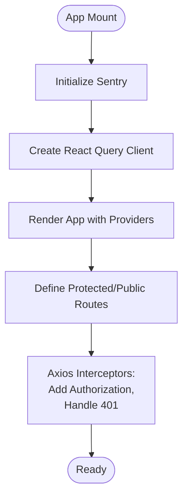

**Diagram sources**
- [main.tsx:1-17](file://frontend/src/main.tsx#L1-L17)
- [App.tsx:52-69](file://frontend/src/App.tsx#L52-L69)
- [client.ts:22-46](file://frontend/src/api/client.ts#L22-L46)

**Section sources**
- [main.tsx:1-17](file://frontend/src/main.tsx#L1-L17)
- [App.tsx:1-160](file://frontend/src/App.tsx#L1-L160)
- [client.ts:1-119](file://frontend/src/api/client.ts#L1-L119)
- [package.json:1-47](file://frontend/package.json#L1-L47)

### API Gateway and Load Balancing
- Nginx upstreams route traffic to backend services
- Static assets served from mounted volumes
- SSL termination and reverse proxy headers

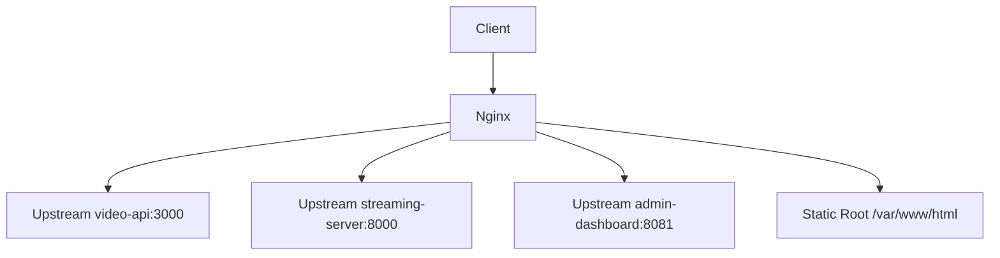

**Diagram sources**
- [nginx.conf:9-47](file://infrastructure/nginx/nginx.conf#L9-L47)
- [Dockerfile:1-4](file://services/api-gateway/Dockerfile#L1-L4)

**Section sources**
- [nginx.conf:1-49](file://infrastructure/nginx/nginx.conf#L1-L49)
- [Dockerfile:1-4](file://services/api-gateway/Dockerfile#L1-L4)

### Monolithic API (Backend)
- Express server with Helmet, CORS, rate limiting, and request logging
- Dynamic database selection (MySQL/PostgreSQL) via Sequelize
- Centralized routes for auth, payments, purchases, education, TTS, formulas, interactions, search, sellers, admin, learners, subscriptions, refunds
- Background worker for subscription tasks

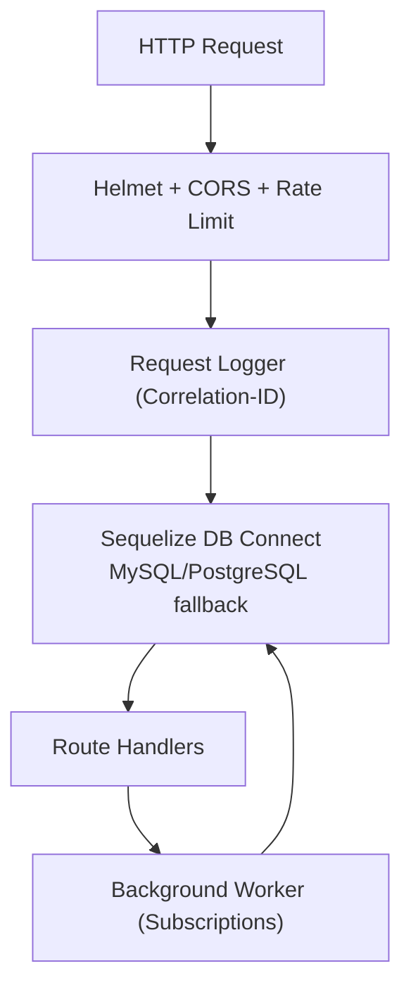

**Diagram sources**
- [server.js:18-108](file://backend/server.js#L18-L108)
- [server.js:110-142](file://backend/server.js#L110-L142)

**Section sources**
- [server.js:1-155](file://backend/server.js#L1-L155)
- [package.json:16-40](file://backend/package.json#L16-L40)

### Authentication Service
- Minimal Express service exposing a health endpoint
- Intended for user management and JWT issuance

**Section sources**
- [server.js:1-14](file://services/auth/server.js#L1-L14)

### Subscription Service
- JWT-based authentication and authorization middleware
- Zod schema validation for requests
- Subscription lifecycle: create, pause, resume, extend, cancel
- Billing endpoints: create payment intent, create subscription, Stripe webhook, refund calculation and processing
- Usage tracking endpoint with structured schema
- Health check and graceful shutdown

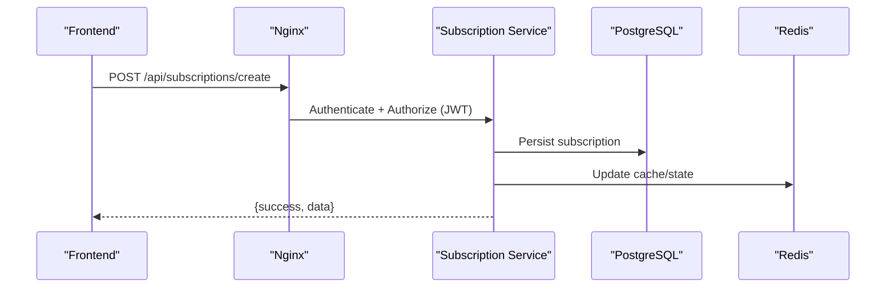

**Diagram sources**
- [index.ts:59-118](file://services/subscription/src/index.ts#L59-L118)
- [index.ts:217-238](file://services/subscription/src/index.ts#L217-L238)

**Section sources**
- [index.ts:1-586](file://services/subscription/src/index.ts#L1-L586)

### Content API (Audiobooks and TTS)
- Flask service with CORS and health endpoint
- SSE endpoint for audiobook generation progress
- TTS synthesis endpoints with file generation
- Placeholder content search and upload handlers

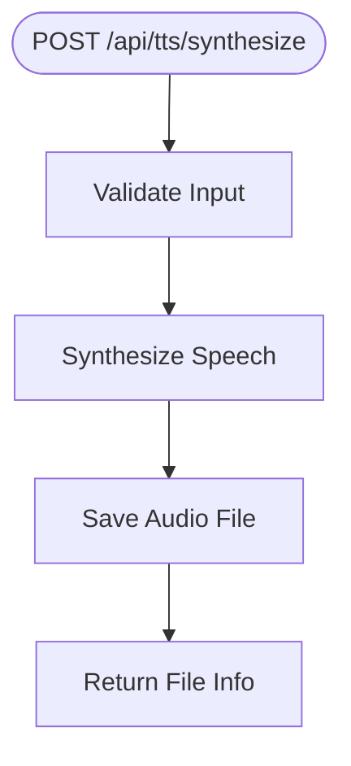

**Diagram sources**
- [app.py:119-159](file://services/content/api/app.py#L119-L159)

**Section sources**
- [app.py:1-266](file://services/content/api/app.py#L1-L266)

### Video API
- JWT authentication middleware
- Multer-based chunked upload handling with Redis state
- PostgreSQL persistence for video jobs
- Prometheus metrics and cleanup cron jobs
- Internal auth_request endpoint for Nginx

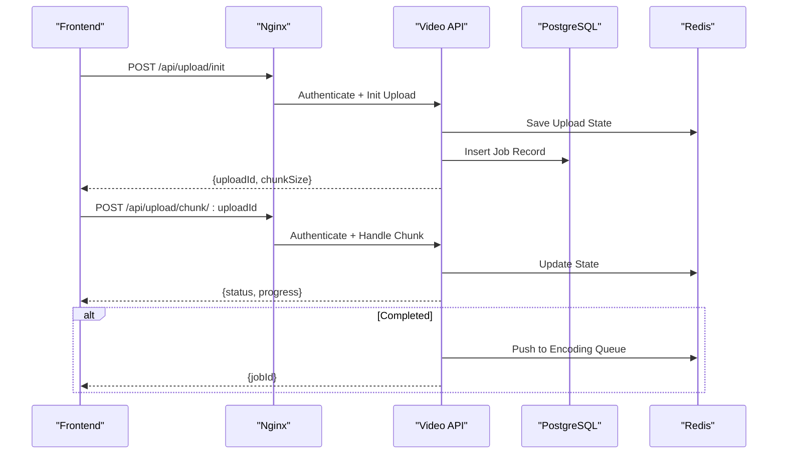

**Diagram sources**
- [server.js:268-318](file://services/video/api/server.js#L268-L318)
- [server.js:132-263](file://services/video/api/server.js#L132-L263)

**Section sources**
- [server.js:1-445](file://services/video/api/server.js#L1-L445)

### TTS Microservice
- Flask service with CORS and rate limiting
- Redis caching with SHA256 keys
- Text segmentation and SSML generation
- Mock synthesis with caching and headers indicating cache hit/miss

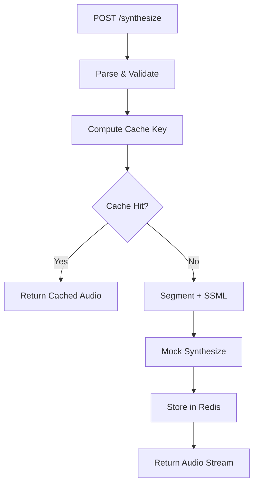

**Diagram sources**
- [server.py:60-84](file://services/tts/python/server.py#L60-L84)
- [server.py:134-185](file://services/tts/python/server.py#L134-L185)

**Section sources**
- [server.py:1-190](file://services/tts/python/server.py#L1-L190)

### Infrastructure and Orchestration
- Docker Compose defines services, networks, volumes, and dependencies
- Shared bridge network for service-to-service communication
- Named volumes for persistent data (PostgreSQL, Redis, Neo4j, Elasticsearch)
- Health checks for subscription service
- GPU-enabled video processor with NVIDIA device exposure

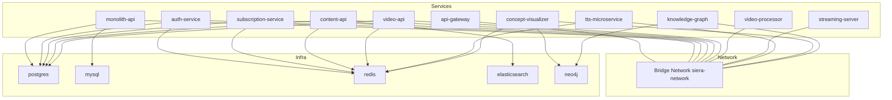

**Diagram sources**
- [docker-compose.yml:3-373](file://infrastructure/docker-compose.yml#L3-L373)

**Section sources**
- [docker-compose.yml:1-373](file://infrastructure/docker-compose.yml#L1-L373)

## Dependency Analysis
- Frontend depends on backend service URLs configured via environment variables
- API Gateway proxies to backend services; depends on service availability and health
- Backend services depend on shared infrastructure (PostgreSQL, Redis, Elasticsearch, Neo4j)
- Subscription and video services integrate with Redis for state and queues
- Content API integrates with Elasticsearch for search (placeholder implementation)
- TTS microservice integrates with Redis for caching

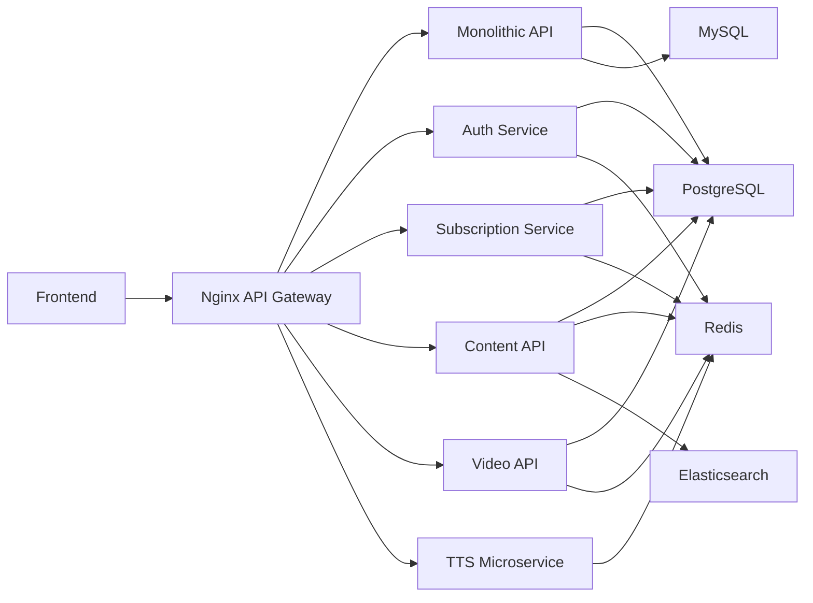

**Diagram sources**
- [client.ts:89-104](file://frontend/src/api/client.ts#L89-L104)
- [nginx.conf:9-47](file://infrastructure/nginx/nginx.conf#L9-L47)
- [docker-compose.yml:28-373](file://infrastructure/docker-compose.yml#L28-L373)

**Section sources**
- [client.ts:1-119](file://frontend/src/api/client.ts#L1-L119)
- [nginx.conf:1-49](file://infrastructure/nginx/nginx.conf#L1-L49)
- [docker-compose.yml:1-373](file://infrastructure/docker-compose.yml#L1-L373)

## Performance Considerations
- Rate limiting at multiple layers (Express, Flask) prevents abuse
- Redis caching reduces latency for TTS synthesis
- Chunked uploads with Redis state and queueing improve video ingestion throughput
- SSE endpoints provide real-time progress feedback
- GPU-enabled video processor accelerates encoding workloads
- Prometheus metrics enable runtime observability and alerting

[No sources needed since this section provides general guidance]

## Troubleshooting Guide
- Health checks
  - Monolithic API: root endpoint returns status/version
  - Subscription service: dedicated health endpoint
  - Video API: health endpoint and metrics endpoint
  - TTS microservice: CORS and rate limiting diagnostics
- Logs
  - Frontend Sentry initialization and Axios interceptors
  - Backend request logging with correlation IDs
  - Docker Compose logs for orchestrated services
- Common issues
  - Port conflicts and service startup failures
  - Redis connectivity and cache misses
  - JWT validation errors and unauthorized access
  - Upload path sanitization and chunk validation

**Section sources**
- [server.js:144-147](file://backend/server.js#L144-L147)
- [index.ts:161-180](file://services/subscription/src/index.ts#L161-L180)
- [server.js:387-390](file://services/video/api/server.js#L387-L390)
- [server.py:1-190](file://services/tts/python/server.py#L1-L190)
- [main.tsx:1-17](file://frontend/src/main.tsx#L1-L17)
- [client.ts:34-46](file://frontend/src/api/client.ts#L34-L46)

## Conclusion
The QuantumMint Bookstore employs a robust microservices architecture with a centralized API Gateway, a monolithic backend for core business logic, and specialized services for content, video, and TTS. Docker Compose orchestrates the environment, while Redis, PostgreSQL, Elasticsearch, and Neo4j provide shared infrastructure. The system emphasizes security (JWT, rate limiting, CORS), observability (Sentry, Prometheus), and scalability (chunked uploads, SSE, GPU acceleration). Deployment is streamlined via documented procedures and CI/CD integration.

[No sources needed since this section summarizes without analyzing specific files]

## Appendices

### Cross-Cutting Concerns
- Security
  - Helmet, CORS, rate limiting, JWT-based auth, and request logging
  - Redis and database credentials managed via environment variables
- Monitoring
  - Frontend Sentry integration and Web Vitals reporting
  - Prometheus metrics endpoints and Grafana dashboards
- Caching
  - Redis caching for TTS synthesis with cache headers
- Disaster Recovery
  - Automated backups and rollback strategies for deployments

**Section sources**
- [server.js:18-55](file://backend/server.js#L18-L55)
- [index.ts:24-48](file://services/subscription/src/index.ts#L24-L48)
- [server.py:40-58](file://services/tts/python/server.py#L40-L58)
- [DEPLOYMENT.md:445-507](file://docs/DEPLOYMENT.md#L445-L507)

### Deployment Topology
- Local development with Docker Compose
- Staging and production via Vercel/Netlify with environment variables
- Custom VPS with Nginx, PM2, and SSL/TLS
- CI/CD with GitHub Actions

**Section sources**
- [DEPLOYMENT.md:17-86](file://docs/DEPLOYMENT.md#L17-L86)
- [DEPLOYMENT.md:89-144](file://docs/DEPLOYMENT.md#L89-L144)
- [DEPLOYMENT.md:147-320](file://docs/DEPLOYMENT.md#L147-L320)
- [SERVICES.md:114-130](file://docs/SERVICES.md#L114-L130)