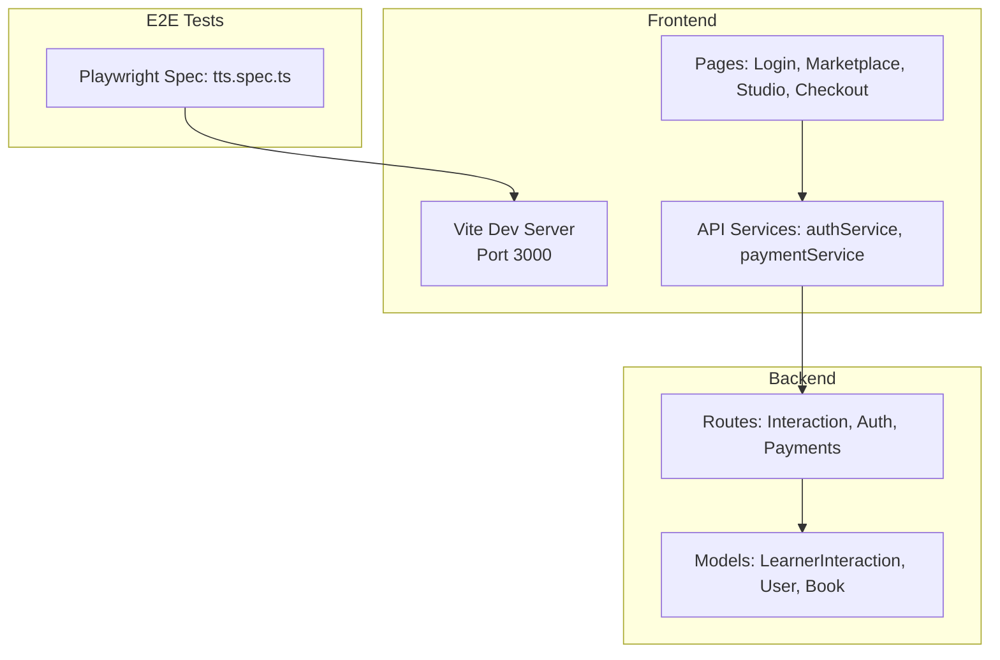
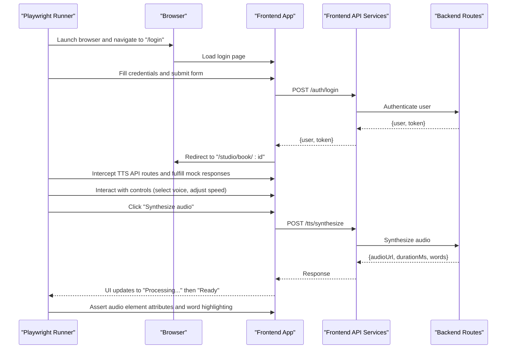
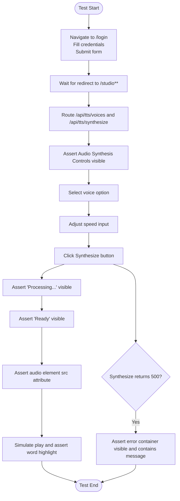
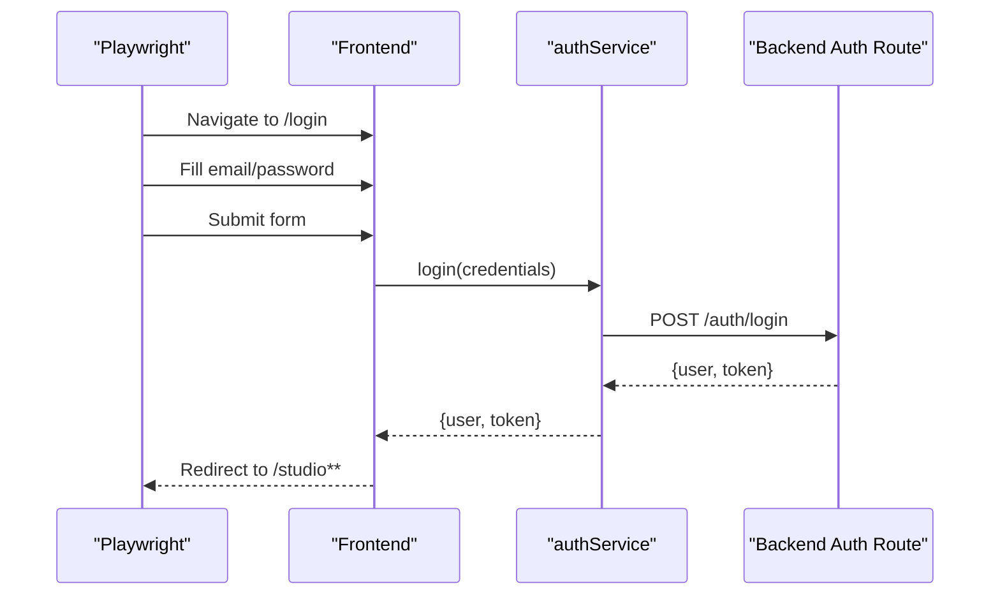
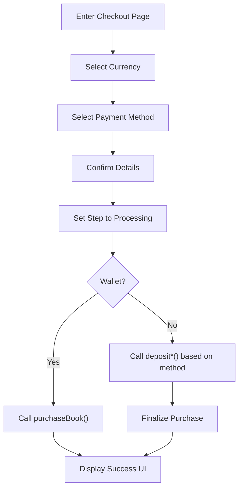
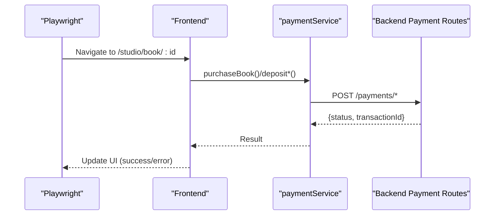
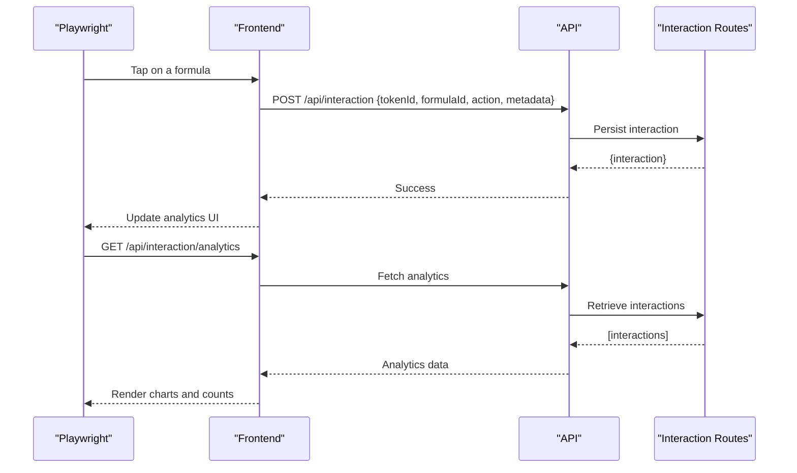
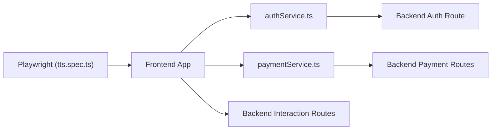

# End-to-End Testing

<cite>
**Referenced Files in This Document**
- [tts.spec.ts](file://tests/e2e/tts.spec.ts)
- [vite.config.ts](file://frontend/vite.config.ts)
- [jest.config.js](file://backend/jest.config.js)
- [authService.ts](file://frontend/src/api/services/authService.ts)
- [Checkout.tsx](file://frontend/src/pages/Checkout.tsx)
- [paymentService.ts](file://frontend/src/services/paymentService.ts)
- [interactionRoutes.js](file://backend/routes/interactionRoutes.js)
- [Studio.tsx](file://frontend/src/pages/Studio.tsx)
- [BookEditor.tsx](file://frontend/src/pages/BookEditor.tsx)
- [Marketplace.tsx](file://frontend/src/pages/Marketplace.tsx)
- [DESIGN_DEVELOPMENT.md](file://docs/DESIGN_DEVELOPMENT.md)
</cite>

## Table of Contents
1. [Introduction](#introduction)
2. [Project Structure](#project-structure)
3. [Core Components](#core-components)
4. [Architecture Overview](#architecture-overview)
5. [Detailed Component Analysis](#detailed-component-analysis)
6. [Dependency Analysis](#dependency-analysis)
7. [Performance Considerations](#performance-considerations)
8. [Troubleshooting Guide](#troubleshooting-guide)
9. [Conclusion](#conclusion)
10. [Appendices](#appendices)

## Introduction
This document provides comprehensive end-to-end testing guidance for the platform, focusing on Playwright configuration, browser automation, and user workflow validation. It covers complete user journeys including authentication, content browsing, purchase flows, and creator workflows. It also explains page object modeling, element interaction testing, cross-browser compatibility, and testing of interactive readers, payment processing, and real-time features. Finally, it details test environment setup, screenshot capture, video recording, and debugging techniques for E2E tests.

## Project Structure
The testing effort spans three primary areas:
- Frontend (React + Vite) serves the application under test.
- Backend (Express) exposes APIs consumed by the frontend.
- E2E tests (Playwright) automate browser-based workflows.

Key locations:
- Frontend dev server configuration and ports
- Backend test framework configuration
- E2E test suite for TTS synthesis flows
- Frontend pages implementing user workflows (authentication, checkout, studio, marketplace)
- Backend routes supporting analytics and interactions

**Diagram sources**
- [vite.config.ts:1-20](file://frontend/vite.config.ts#L1-L20)
- [tts.spec.ts:1-94](file://tests/e2e/tts.spec.ts#L1-L94)
- [authService.ts:1-56](file://frontend/src/api/services/authService.ts#L1-L56)
- [Checkout.tsx:1-197](file://frontend/src/pages/Checkout.tsx#L1-L197)
- [interactionRoutes.js:1-54](file://backend/routes/interactionRoutes.js#L1-L54)

**Section sources**
- [vite.config.ts:1-20](file://frontend/vite.config.ts#L1-L20)
- [tts.spec.ts:1-94](file://tests/e2e/tts.spec.ts#L1-L94)
- [DESIGN_DEVELOPMENT.md:143-193](file://docs/DESIGN_DEVELOPMENT.md#L143-L193)

## Core Components
- Playwright E2E test suite: Implements user journeys for TTS synthesis, including success and error flows.
- Frontend pages and services:
  - Authentication via API services and local storage tokens.
  - Checkout and payment processing flows.
  - Creator Studio and Book Editor for publishing workflows.
  - Marketplace for browsing content.
- Backend routes:
  - Interaction logging and analytics retrieval.
  - Auth and payment endpoints used by frontend services.

**Section sources**
- [tts.spec.ts:1-94](file://tests/e2e/tts.spec.ts#L1-L94)
- [authService.ts:1-56](file://frontend/src/api/services/authService.ts#L1-L56)
- [Checkout.tsx:1-197](file://frontend/src/pages/Checkout.tsx#L1-L197)
- [interactionRoutes.js:1-54](file://backend/routes/interactionRoutes.js#L1-L54)

## Architecture Overview
The E2E flow integrates Playwright with the frontend application and backend services. Playwright automates the browser, interacts with UI elements, and validates outcomes. It mocks backend endpoints to simulate TTS synthesis and error scenarios.

**Diagram sources**
- [tts.spec.ts:15-74](file://tests/e2e/tts.spec.ts#L15-L74)
- [authService.ts:8-15](file://frontend/src/api/services/authService.ts#L8-L15)
- [Checkout.tsx:170-197](file://frontend/src/pages/Checkout.tsx#L170-L197)

## Detailed Component Analysis

### Playwright E2E Suite: TTS Synthesis Flow
The suite demonstrates:
- Pre-test setup: navigation to login, filling credentials, and redirect verification.
- Mocking backend endpoints for voices and synthesis.
- UI assertions for visibility, attributes, and interactivity.
- Error handling: asserting error messages on server failures.

**Diagram sources**
- [tts.spec.ts:4-92](file://tests/e2e/tts.spec.ts#L4-L92)

**Section sources**
- [tts.spec.ts:1-94](file://tests/e2e/tts.spec.ts#L1-L94)

### Authentication and Authorization Workflows
- Frontend authentication service persists tokens in local storage and exposes helpers to check authentication state and roles.
- The E2E test simulates login by navigating to the login page, filling credentials, and verifying redirect to the studio/dashboard.

**Diagram sources**
- [tts.spec.ts:4-13](file://tests/e2e/tts.spec.ts#L4-L13)
- [authService.ts:8-15](file://frontend/src/api/services/authService.ts#L8-L15)

**Section sources**
- [authService.ts:1-56](file://frontend/src/api/services/authService.ts#L1-L56)
- [tts.spec.ts:4-13](file://tests/e2e/tts.spec.ts#L4-L13)

### Purchase and Payment Processing Workflows
- The Checkout page orchestrates payment steps, selecting currency, payment method, and invoking payment services.
- Payment flows include direct wallet purchases and mobile money deposits followed by purchase completion.
- The E2E test can validate UI transitions and service invocations by mocking backend endpoints and asserting UI states.

**Diagram sources**
- [Checkout.tsx:55-197](file://frontend/src/pages/Checkout.tsx#L55-L197)

**Section sources**
- [Checkout.tsx:1-197](file://frontend/src/pages/Checkout.tsx#L1-L197)

### Creator Workflows: Studio and Publishing
- Studio and Book Editor pages enable creators to manage content and publish books.
- The E2E test navigates to the studio, selects a book, and triggers synthesis, validating UI feedback and audio playback.

**Diagram sources**
- [Studio.tsx:323-342](file://frontend/src/pages/Studio.tsx#L323-L342)
- [BookEditor.tsx:257-278](file://frontend/src/pages/BookEditor.tsx#L257-L278)

**Section sources**
- [Studio.tsx:323-342](file://frontend/src/pages/Studio.tsx#L323-L342)
- [BookEditor.tsx:257-278](file://frontend/src/pages/BookEditor.tsx#L257-L278)

### Interactive Readers and Real-Time Features
- The platform supports interactive readers with formula taps and analytics logging.
- Backend routes support logging learner interactions and retrieving analytics.
- E2E tests can validate interaction logging and analytics retrieval by asserting UI updates and API responses.

**Diagram sources**
- [interactionRoutes.js:10-52](file://backend/routes/interactionRoutes.js#L10-L52)

**Section sources**
- [interactionRoutes.js:1-54](file://backend/routes/interactionRoutes.js#L1-L54)

## Dependency Analysis
- Playwright depends on the frontend dev server running on port 3000.
- Frontend pages depend on API services for authentication, payments, and interactions.
- API services depend on backend routes for authentication, payments, and analytics.
- Backend routes depend on models for persistence.

**Diagram sources**
- [tts.spec.ts:1-94](file://tests/e2e/tts.spec.ts#L1-L94)
- [authService.ts:1-56](file://frontend/src/api/services/authService.ts#L1-L56)
- [Checkout.tsx:1-197](file://frontend/src/pages/Checkout.tsx#L1-L197)
- [interactionRoutes.js:1-54](file://backend/routes/interactionRoutes.js#L1-L54)

**Section sources**
- [vite.config.ts:7-10](file://frontend/vite.config.ts#L7-L10)
- [DESIGN_DEVELOPMENT.md:143-193](file://docs/DESIGN_DEVELOPMENT.md#L143-L193)

## Performance Considerations
- Use Playwright’s built-in tracing and video recording to capture slow interactions and identify bottlenecks.
- Prefer targeted selectors and avoid excessive waits; rely on network route mocking for deterministic behavior.
- Run tests in headless mode for CI and enable screenshots on failure to reduce noise in local runs.
- Parallelize independent tests to improve throughput while ensuring isolated state per test.

## Troubleshooting Guide
Common issues and resolutions:
- Port conflicts: Ensure the frontend dev server runs on port 3000 and is reachable by Playwright.
- Authentication failures: Verify local storage token handling and ensure login redirects to expected URLs.
- Network flakiness: Use route mocking for external services and assert response codes and payloads.
- Cross-browser differences: Test on Chromium, Firefox, and Safari; use browser-specific capabilities and viewport settings.
- Debugging: Enable Playwright tracing, video recording, and screenshots; use verbose logs and step-by-step assertions.

## Conclusion
This guide outlines a robust E2E testing strategy using Playwright to validate end-to-end user journeys across authentication, content browsing, purchase flows, and creator workflows. By leveraging page object modeling, route mocking, and targeted assertions, teams can ensure reliable and maintainable browser automation tests. Integrating tracing, video, and screenshots enhances debugging and observability.

## Appendices

### Playwright Configuration and Setup
- Install Playwright and initialize a project.
- Configure test timeouts, retries, and reporter options.
- Use browser-specific settings for cross-browser compatibility.
- Integrate with CI for automated test runs.

### Environment Variables and Secrets
- Define environment variables for backend endpoints, Stripe keys, and test accounts.
- Keep secrets out of source control; use CI/CD secret stores.

### Cross-Browser Compatibility Testing
- Run tests on Chromium, Firefox, and Safari.
- Adjust viewport sizes and device emulation as needed.
- Validate responsive behavior and accessibility.

### Screenshot Capture and Video Recording
- Enable video recording per test or globally.
- Take targeted screenshots on failure or key milestones.
- Use tracing to capture DOM snapshots and network logs.

### Debugging Techniques
- Use Playwright Inspector for interactive debugging.
- Leverage step-through debugging in VS Code.
- Inspect network requests and responses to validate API behavior.