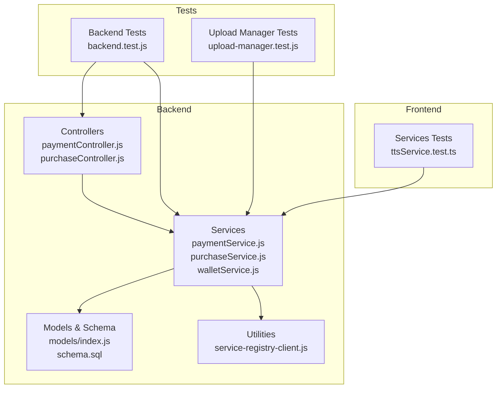
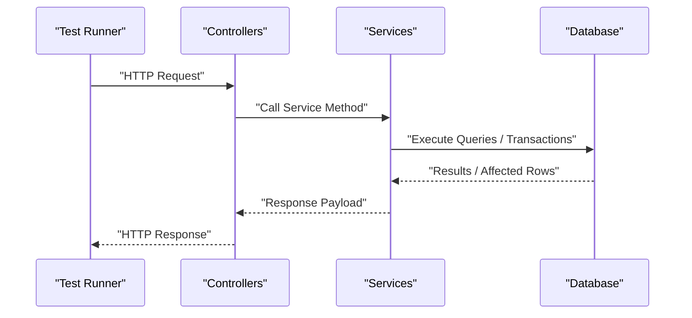
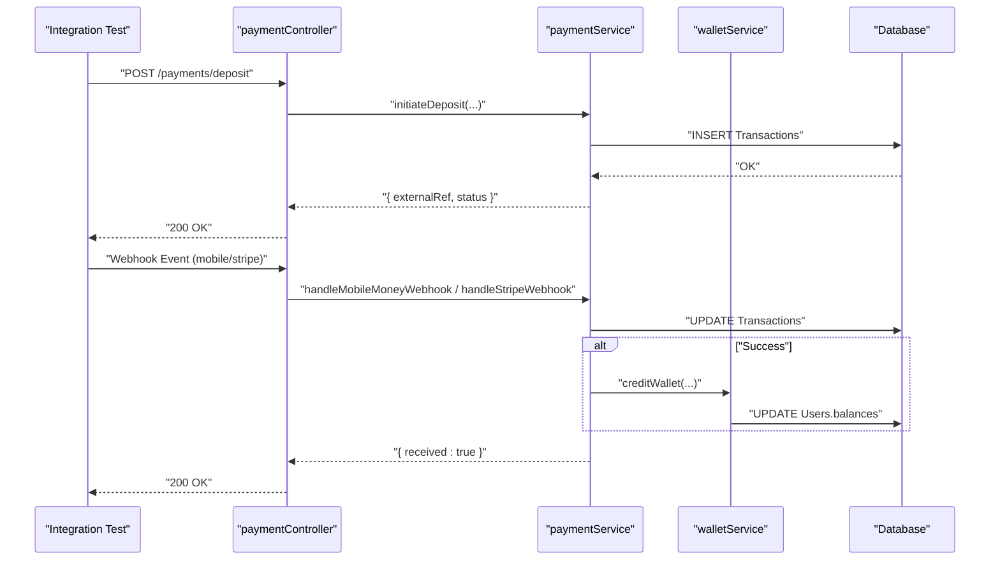
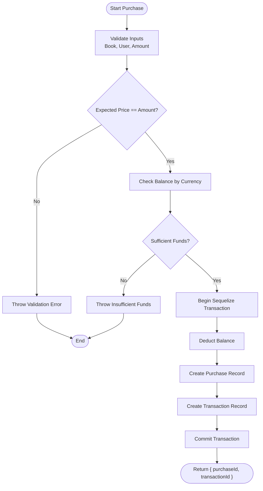
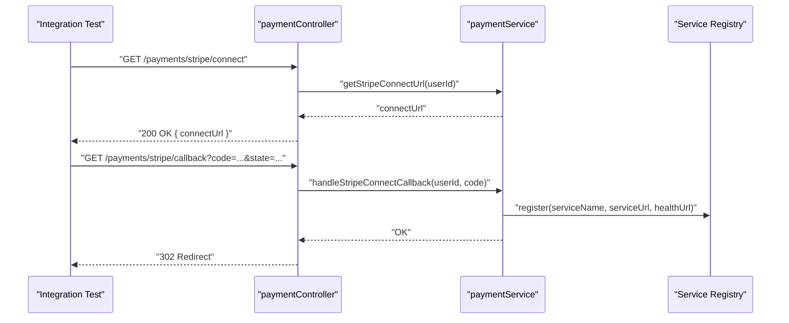
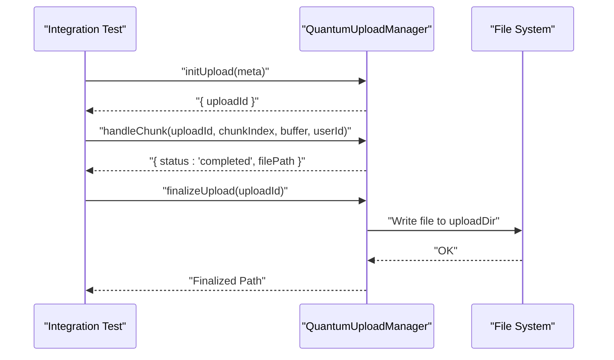
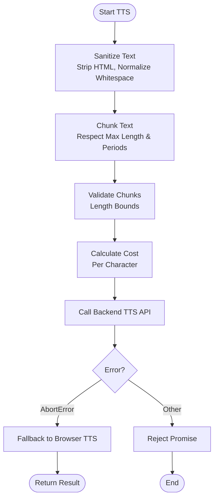
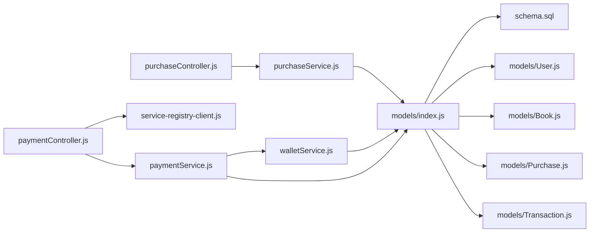

# Integration Testing

<cite>
**Referenced Files in This Document**
- [backend/jest.config.js](file://backend/jest.config.js)
- [backend/tests/backend.test.js](file://backend/tests/backend.test.js)
- [backend/__tests__/upload-manager.test.js](file://backend/__tests__/upload-manager.test.js)
- [frontend/src/services/__tests__/ttsService.test.ts](file://frontend/src/services/__tests__/ttsService.test.ts)
- [backend/services/purchaseService.js](file://backend/services/purchaseService.js)
- [backend/services/paymentService.js](file://backend/services/paymentService.js)
- [backend/services/walletService.js](file://backend/services/walletService.js)
- [backend/controllers/paymentController.js](file://backend/controllers/paymentController.js)
- [backend/controllers/purchaseController.js](file://backend/controllers/purchaseController.js)
- [backend/models/index.js](file://backend/models/index.js)
- [backend/schema.sql](file://backend/schema.sql)
- [backend/models/User.js](file://backend/models/User.js)
- [backend/models/Book.js](file://backend/models/Book.js)
- [backend/models/Purchase.js](file://backend/models/Purchase.js)
- [backend/models/Transaction.js](file://backend/models/Transaction.js)
- [backend/utils/service-registry-client.js](file://backend/utils/service-registry-client.js)
</cite>

## Table of Contents
1. [Introduction](#introduction)
2. [Project Structure](#project-structure)
3. [Core Components](#core-components)
4. [Architecture Overview](#architecture-overview)
5. [Detailed Component Analysis](#detailed-component-analysis)
6. [Dependency Analysis](#dependency-analysis)
7. [Performance Considerations](#performance-considerations)
8. [Troubleshooting Guide](#troubleshooting-guide)
9. [Conclusion](#conclusion)
10. [Appendices](#appendices)

## Introduction
This document provides comprehensive integration testing guidance for the QuantumMint Bookstore platform. It focuses on:
- End-to-end service testing across payment processing, purchases, and wallet operations
- Database integration verification using Sequelize models and schema
- Microservice communication testing patterns
- File upload processing validation
- Content synchronization workflows
- Test environment setup, test data preparation, and execution workflows

The goal is to enable reliable, repeatable integration tests that validate cross-layer behavior, transactional integrity, and inter-service coordination.

## Project Structure
The integration testing landscape spans backend services, controllers, models, and frontend services. The backend uses Jest for unit/integration tests, while the frontend includes service-level tests. The database schema defines the canonical data model validated by tests.

**Diagram sources**
- [backend/controllers/paymentController.js:1-99](file://backend/controllers/paymentController.js#L1-L99)
- [backend/controllers/purchaseController.js:1-13](file://backend/controllers/purchaseController.js#L1-L13)
- [backend/services/paymentService.js:1-234](file://backend/services/paymentService.js#L1-L234)
- [backend/services/purchaseService.js:1-68](file://backend/services/purchaseService.js#L1-L68)
- [backend/services/walletService.js:1-80](file://backend/services/walletService.js#L1-L80)
- [backend/models/index.js:1-168](file://backend/models/index.js#L1-L168)
- [backend/schema.sql:1-132](file://backend/schema.sql#L1-L132)
- [backend/utils/service-registry-client.js:1-16](file://backend/utils/service-registry-client.js#L1-L16)
- [backend/tests/backend.test.js:1-80](file://backend/tests/backend.test.js#L1-L80)
- [backend/__tests__/upload-manager.test.js:1-66](file://backend/__tests__/upload-manager.test.js#L1-L66)
- [frontend/src/services/__tests__/ttsService.test.ts:1-139](file://frontend/src/services/__tests__/ttsService.test.ts#L1-L139)

**Section sources**
- [backend/jest.config.js:1-8](file://backend/jest.config.js#L1-L8)
- [backend/tests/backend.test.js:1-80](file://backend/tests/backend.test.js#L1-L80)
- [backend/__tests__/upload-manager.test.js:1-66](file://backend/__tests__/upload-manager.test.js#L1-L66)
- [frontend/src/services/__tests__/ttsService.test.ts:1-139](file://frontend/src/services/__tests__/ttsService.test.ts#L1-L139)

## Core Components
This section outlines the primary components under test and their roles in integration scenarios.

- Controllers
  - Payment controller orchestrates deposit/withdrawal initiation, Stripe Connect OAuth, and webhook handling.
  - Purchase controller handles book purchases via wallet funds.

- Services
  - Payment service encapsulates payment method validation, transaction creation, fees calculation, and webhook handlers.
  - Purchase service validates pricing, checks balances, and executes atomic database updates.
  - Wallet service exposes balance retrieval and atomic credit operations.

- Models and Schema
  - Sequelize models define Users, Books, Purchases, Transactions, and related entities.
  - The schema enforces constraints and relationships validated by tests.

- Utilities
  - Service registry client demonstrates registration patterns for microservices.

**Section sources**
- [backend/controllers/paymentController.js:1-99](file://backend/controllers/paymentController.js#L1-L99)
- [backend/controllers/purchaseController.js:1-13](file://backend/controllers/purchaseController.js#L1-L13)
- [backend/services/paymentService.js:1-234](file://backend/services/paymentService.js#L1-L234)
- [backend/services/purchaseService.js:1-68](file://backend/services/purchaseService.js#L1-L68)
- [backend/services/walletService.js:1-80](file://backend/services/walletService.js#L1-L80)
- [backend/models/index.js:1-168](file://backend/models/index.js#L1-L168)
- [backend/schema.sql:1-132](file://backend/schema.sql#L1-L132)
- [backend/utils/service-registry-client.js:1-16](file://backend/utils/service-registry-client.js#L1-L16)

## Architecture Overview
The integration testing architecture emphasizes layered validation:
- HTTP boundary: Controllers receive requests and delegate to services.
- Service boundary: Services coordinate database operations and external integrations.
- Data boundary: Models and schema enforce data integrity and relationships.
- Inter-service boundary: Utilities and registries demonstrate service discovery patterns.

**Diagram sources**
- [backend/controllers/paymentController.js:1-99](file://backend/controllers/paymentController.js#L1-L99)
- [backend/controllers/purchaseController.js:1-13](file://backend/controllers/purchaseController.js#L1-L13)
- [backend/services/paymentService.js:1-234](file://backend/services/paymentService.js#L1-L234)
- [backend/services/purchaseService.js:1-68](file://backend/services/purchaseService.js#L1-L68)
- [backend/services/walletService.js:1-80](file://backend/services/walletService.js#L1-L80)
- [backend/models/index.js:1-168](file://backend/models/index.js#L1-L168)

## Detailed Component Analysis

### Payment Processing Integration
This section documents testing patterns for payment initiation, fees calculation, and webhook handling.

- Deposit initiation
  - Validates payment method configuration, amount bounds, and phone number requirements.
  - Creates a transaction record and returns an external reference for downstream processing.
  - Mobile money paths return immediate processing status; Stripe path returns a client-ready message.

- Withdrawal initiation
  - Verifies wallet existence and sufficient balance.
  - Applies platform fees for Stripe withdrawals and updates wallet balances atomically.
  - Produces a withdrawal transaction with appropriate metadata.

- Webhook handling
  - Mobile money webhook updates transaction status and credits wallets upon success.
  - Stripe webhook verifies signatures, updates transaction status, and credits wallets on success.

**Diagram sources**
- [backend/controllers/paymentController.js:1-99](file://backend/controllers/paymentController.js#L1-L99)
- [backend/services/paymentService.js:1-234](file://backend/services/paymentService.js#L1-L234)
- [backend/services/walletService.js:1-80](file://backend/services/walletService.js#L1-L80)

**Section sources**
- [backend/controllers/paymentController.js:1-99](file://backend/controllers/paymentController.js#L1-L99)
- [backend/services/paymentService.js:1-234](file://backend/services/paymentService.js#L1-L234)
- [backend/services/walletService.js:1-80](file://backend/services/walletService.js#L1-L80)
- [backend/tests/backend.test.js:46-79](file://backend/tests/backend.test.js#L46-L79)

### Database Transaction Testing
This section explains how to validate transactional integrity and atomicity across services.

- Purchase flow
  - Validates book and user existence, checks currency-specific pricing, and ensures sufficient balance.
  - Executes a Sequelize transaction to deduct balance, create a purchase record, and log a transaction.
  - Asserts that all writes occur atomically and that the response includes identifiers.

- Wallet credit
  - Uses an atomic SQL increment to credit balances, ensuring no race conditions.
  - Validates affected rows to confirm successful updates.

**Diagram sources**
- [backend/services/purchaseService.js:1-68](file://backend/services/purchaseService.js#L1-L68)
- [backend/services/walletService.js:1-80](file://backend/services/walletService.js#L1-L80)
- [backend/models/User.js:1-50](file://backend/models/User.js#L1-L50)
- [backend/models/Purchase.js:1-26](file://backend/models/Purchase.js#L1-L26)
- [backend/models/Transaction.js:1-54](file://backend/models/Transaction.js#L1-L54)

**Section sources**
- [backend/services/purchaseService.js:1-68](file://backend/services/purchaseService.js#L1-L68)
- [backend/services/walletService.js:1-80](file://backend/services/walletService.js#L1-L80)
- [backend/tests/backend.test.js:7-44](file://backend/tests/backend.test.js#L7-L44)

### Microservice Communication Testing
Patterns for validating inter-service communication and service discovery.

- Service registry client
  - Demonstrates registration and health check logging; can be extended to integrate with a real registry via HTTP calls.

- Stripe Connect OAuth
  - Controller generates a connect URL and redirects users after callback.
  - Service simulates token exchange and persists payment method records.

**Diagram sources**
- [backend/controllers/paymentController.js:36-55](file://backend/controllers/paymentController.js#L36-L55)
- [backend/services/paymentService.js:188-233](file://backend/services/paymentService.js#L188-L233)
- [backend/utils/service-registry-client.js:1-16](file://backend/utils/service-registry-client.js#L1-L16)

**Section sources**
- [backend/controllers/paymentController.js:36-55](file://backend/controllers/paymentController.js#L36-L55)
- [backend/services/paymentService.js:188-233](file://backend/services/paymentService.js#L188-L233)
- [backend/utils/service-registry-client.js:1-16](file://backend/utils/service-registry-client.js#L1-L16)

### File Upload Processing Integration
Testing patterns for upload manager validation, chunk handling, and finalization.

- Initialization and chunk handling
  - Validates required fields and MIME types.
  - Ensures authorized uploads and tracks chunk progress.
  - Finalizes uploads with path safety checks and file size validation.

**Diagram sources**
- [backend/__tests__/upload-manager.test.js:1-66](file://backend/__tests__/upload-manager.test.js#L1-L66)

**Section sources**
- [backend/__tests__/upload-manager.test.js:1-66](file://backend/__tests__/upload-manager.test.js#L1-L66)

### Content Synchronization and Frontend Service Testing
Testing frontend TTS service behavior, including text sanitization, chunking, validation, and fallback mechanisms.

- Text sanitization and chunking
  - Removes HTML tags and normalizes whitespace.
  - Splits text into chunks respecting maximum length and sentence boundaries.

- Validation and cost calculation
  - Enforces minimum and maximum lengths.
  - Computes cost based on character count and price per character.

- Synthesis and fallback
  - Calls backend TTS API with sanitized text.
  - Handles AbortError and falls back to browser speech synthesis when supported.

**Diagram sources**
- [frontend/src/services/__tests__/ttsService.test.ts:1-139](file://frontend/src/services/__tests__/ttsService.test.ts#L1-L139)

**Section sources**
- [frontend/src/services/__tests__/ttsService.test.ts:1-139](file://frontend/src/services/__tests__/ttsService.test.ts#L1-L139)

## Dependency Analysis
This section maps dependencies among components to guide integration test design.

**Diagram sources**
- [backend/controllers/paymentController.js:1-99](file://backend/controllers/paymentController.js#L1-L99)
- [backend/controllers/purchaseController.js:1-13](file://backend/controllers/purchaseController.js#L1-L13)
- [backend/services/paymentService.js:1-234](file://backend/services/paymentService.js#L1-L234)
- [backend/services/purchaseService.js:1-68](file://backend/services/purchaseService.js#L1-L68)
- [backend/services/walletService.js:1-80](file://backend/services/walletService.js#L1-L80)
- [backend/models/index.js:1-168](file://backend/models/index.js#L1-L168)
- [backend/schema.sql:1-132](file://backend/schema.sql#L1-L132)
- [backend/models/User.js:1-50](file://backend/models/User.js#L1-L50)
- [backend/models/Book.js:1-92](file://backend/models/Book.js#L1-L92)
- [backend/models/Purchase.js:1-26](file://backend/models/Purchase.js#L1-L26)
- [backend/models/Transaction.js:1-54](file://backend/models/Transaction.js#L1-L54)
- [backend/utils/service-registry-client.js:1-16](file://backend/utils/service-registry-client.js#L1-L16)

**Section sources**
- [backend/controllers/paymentController.js:1-99](file://backend/controllers/paymentController.js#L1-L99)
- [backend/controllers/purchaseController.js:1-13](file://backend/controllers/purchaseController.js#L1-L13)
- [backend/services/paymentService.js:1-234](file://backend/services/paymentService.js#L1-L234)
- [backend/services/purchaseService.js:1-68](file://backend/services/purchaseService.js#L1-L68)
- [backend/services/walletService.js:1-80](file://backend/services/walletService.js#L1-L80)
- [backend/models/index.js:1-168](file://backend/models/index.js#L1-L168)
- [backend/schema.sql:1-132](file://backend/schema.sql#L1-L132)

## Performance Considerations
- Prefer transactional operations for financial updates to minimize round trips and ensure atomicity.
- Use batched queries where feasible to reduce database load during bulk operations.
- Mock external integrations (e.g., Stripe SDK) in tests to avoid flakiness and latency.
- Keep test fixtures minimal and deterministic to improve reproducibility and speed.

## Troubleshooting Guide
Common issues and resolutions during integration testing:

- Stripe webhook verification failures
  - Ensure webhook secret is configured and the signature header is present.
  - Verify that the Stripe SDK is available in the environment.

- Mobile money webhook validation
  - Confirm webhook secret header is provided in production environments.
  - Validate payload structure and reference fields.

- Transaction status mismatches
  - Check that transaction updates occur within the expected service method.
  - Confirm that wallet credits are invoked only on successful events.

- Upload manager errors
  - Validate MIME types and required fields during initialization.
  - Ensure chunk ownership and path safety checks pass during finalization.

**Section sources**
- [backend/controllers/paymentController.js:74-98](file://backend/controllers/paymentController.js#L74-L98)
- [backend/services/paymentService.js:149-166](file://backend/services/paymentService.js#L149-L166)
- [backend/__tests__/upload-manager.test.js:20-64](file://backend/__tests__/upload-manager.test.js#L20-L64)

## Conclusion
This integration testing guide provides a structured approach to validating end-to-end flows across payment processing, purchases, wallet operations, file uploads, and microservice communication. By leveraging the existing controllers, services, models, and tests, teams can build robust, repeatable integration tests that ensure correctness, reliability, and maintainability of the platform.

## Appendices

### Test Environment Setup
- Backend
  - Install dependencies and run tests using Jest configuration.
  - Ensure database schema is initialized and reachable by the test environment.

- Frontend
  - Install dependencies and run service tests with mocked API modules.

**Section sources**
- [backend/jest.config.js:1-8](file://backend/jest.config.js#L1-L8)
- [backend/schema.sql:1-132](file://backend/schema.sql#L1-L132)

### Test Data Preparation
- Seed database with representative Users, Books, and Wallets.
- Prepare transaction records with various statuses for webhook testing.
- Create upload directories and temporary files for upload manager tests.

**Section sources**
- [backend/schema.sql:7-132](file://backend/schema.sql#L7-L132)
- [backend/__tests__/upload-manager.test.js:10-18](file://backend/__tests__/upload-manager.test.js#L10-L18)

### Integration Test Execution Workflows
- Backend integration tests
  - Run the backend test suite to validate payment and purchase flows, including transactional behavior and webhook handling.

- Upload manager tests
  - Execute upload manager tests to verify initialization, chunk handling, and finalization logic.

- Frontend service tests
  - Run frontend service tests to validate TTS behavior, including sanitization, chunking, and fallback mechanisms.

**Section sources**
- [backend/tests/backend.test.js:1-80](file://backend/tests/backend.test.js#L1-L80)
- [backend/__tests__/upload-manager.test.js:1-66](file://backend/__tests__/upload-manager.test.js#L1-L66)
- [frontend/src/services/__tests__/ttsService.test.ts:1-139](file://frontend/src/services/__tests__/ttsService.test.ts#L1-L139)