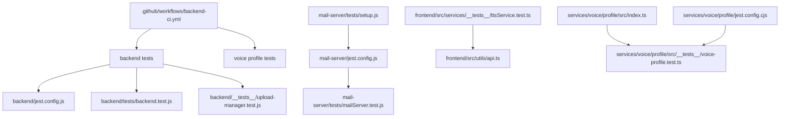
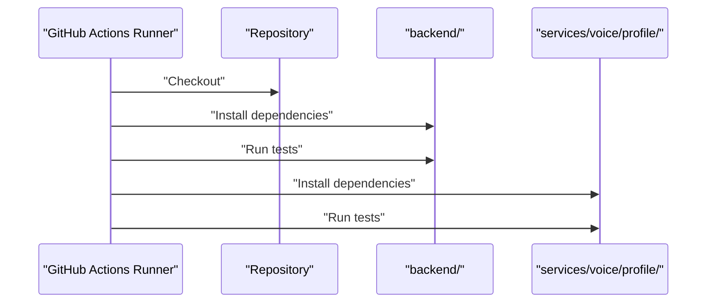
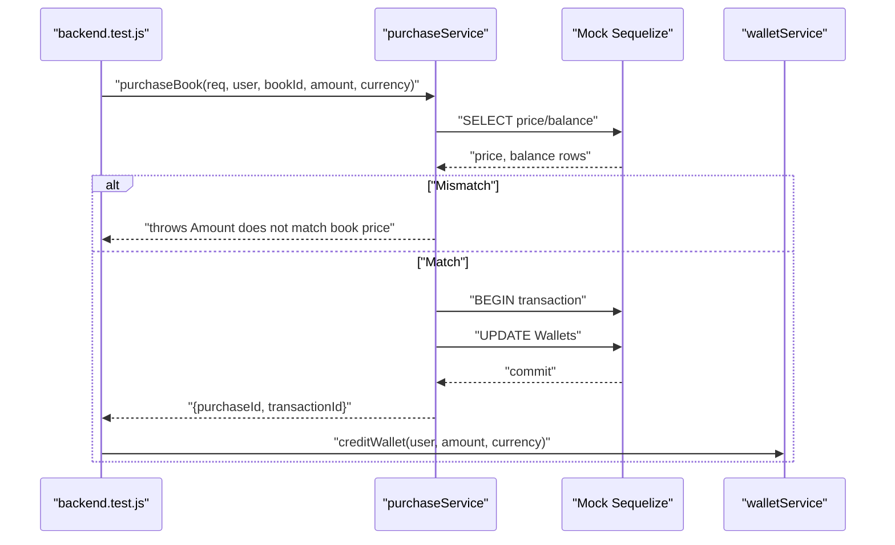
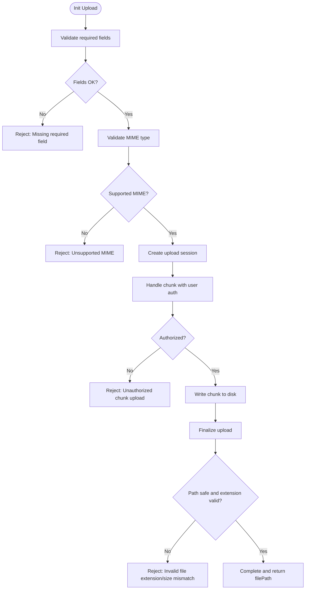
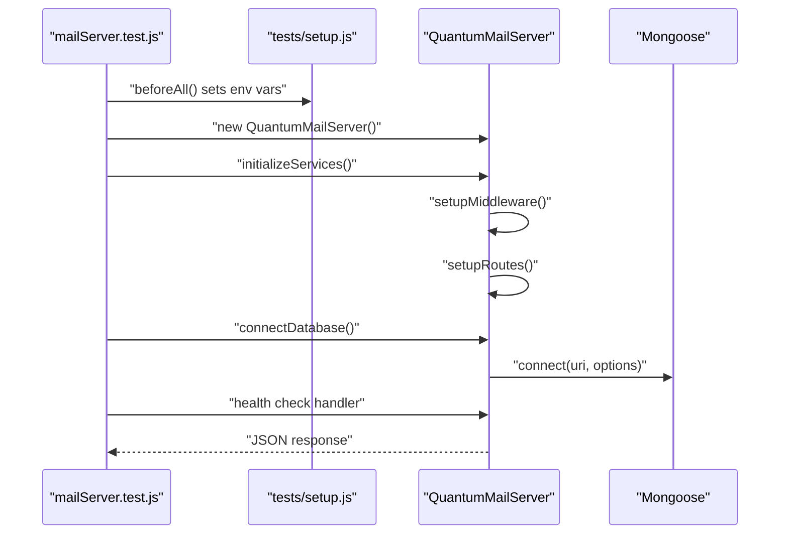
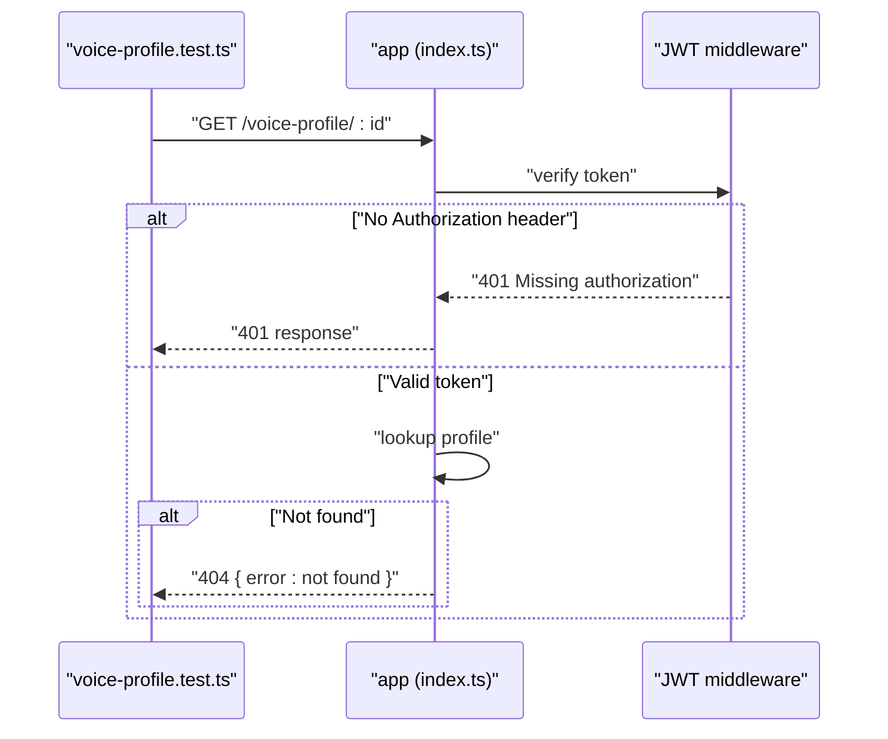
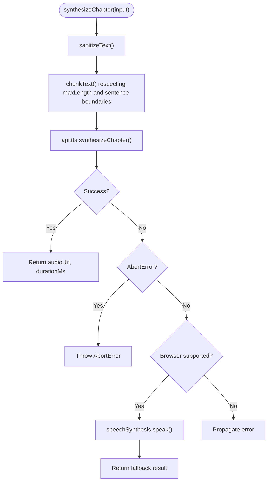
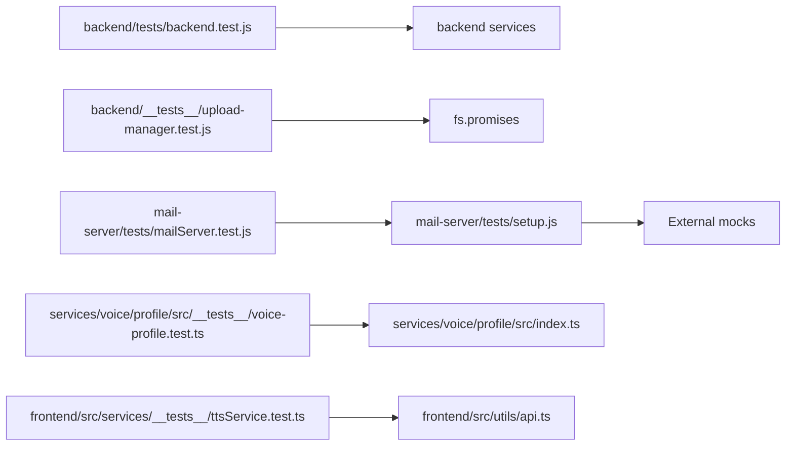

# Testing Best Practices and CI/CD

<cite>
**Referenced Files in This Document**
- [backend-ci.yml](file://.github/workflows/backend-ci.yml)
- [jest.config.js](file://backend/jest.config.js)
- [jest.config.js](file://mail-server/jest.config.js)
- [jest.config.cjs](file://services/voice/profile/jest.config.cjs)
- [backend.test.js](file://backend/tests/backend.test.js)
- [upload-manager.test.js](file://backend/__tests__/upload-manager.test.js)
- [setup.js](file://mail-server/tests/setup.js)
- [mailServer.test.js](file://mail-server/tests/mailServer.test.js)
- [ttsService.test.ts](file://frontend/src/services/__tests__/ttsService.test.ts)
- [voice-profile.test.ts](file://services/voice/profile/src/__tests__/voice-profile.test.ts)
- [index.ts](file://services/voice/profile/src/index.ts)
</cite>

## Table of Contents
1. [Introduction](#introduction)
2. [Project Structure](#project-structure)
3. [Core Components](#core-components)
4. [Architecture Overview](#architecture-overview)
5. [Detailed Component Analysis](#detailed-component-analysis)
6. [Dependency Analysis](#dependency-analysis)
7. [Performance Considerations](#performance-considerations)
8. [Troubleshooting Guide](#troubleshooting-guide)
9. [Conclusion](#conclusion)
10. [Appendices](#appendices)

## Introduction
This document consolidates testing best practices for the project, focusing on test organization, coverage, CI/CD integration, and maintenance strategies. It synthesizes real-world patterns observed across backend, mail server, voice profile, and frontend services to define standards for naming, isolation, mocking, and quality gates. It also provides guidance for performance optimization, flaky test prevention, and collaborative test documentation.

## Project Structure
The repository includes multiple services with distinct testing setups:
- Backend service uses Jest with TypeScript transformation and Node test environment.
- Mail server service defines coverage collection and reporters, plus a dedicated setup script for environment and mocks.
- Voice profile service uses a TS Jest preset with ESM and a simple test suite.
- Frontend service includes unit tests for client-side TTS logic with mocked API dependencies.
- GitHub Actions orchestrates CI jobs for backend and voice profile services.

**Diagram sources**
- [backend-ci.yml:1-58](file://.github/workflows/backend-ci.yml#L1-L58)
- [jest.config.js:1-8](file://backend/jest.config.js#L1-L8)
- [backend.test.js:1-80](file://backend/tests/backend.test.js#L1-L80)
- [upload-manager.test.js:1-66](file://backend/__tests__/upload-manager.test.js#L1-L66)
- [jest.config.js:1-15](file://mail-server/jest.config.js#L1-L15)
- [setup.js:1-129](file://mail-server/tests/setup.js#L1-L129)
- [mailServer.test.js:1-94](file://mail-server/tests/mailServer.test.js#L1-L94)
- [ttsService.test.ts:1-139](file://frontend/src/services/__tests__/ttsService.test.ts#L1-L139)
- [index.ts:1-4](file://services/voice/profile/src/index.ts#L1-L4)
- [jest.config.cjs:1-15](file://services/voice/profile/jest.config.cjs#L1-L15)
- [voice-profile.test.ts:1-22](file://services/voice/profile/src/__tests__/voice-profile.test.ts#L1-L22)

**Section sources**
- [backend-ci.yml:1-58](file://.github/workflows/backend-ci.yml#L1-L58)
- [jest.config.js:1-8](file://backend/jest.config.js#L1-L8)
- [jest.config.js:1-15](file://mail-server/jest.config.js#L1-L15)
- [jest.config.cjs:1-15](file://services/voice/profile/jest.config.cjs#L1-L15)

## Core Components
- Backend tests demonstrate controller/service-level behavior via isolated mocks and deterministic identifiers. They validate transactional logic and webhook handling.
- Upload manager tests validate file upload safety, chunk handling, and path traversal protections.
- Mail server tests validate configuration, initialization, database connection, Express setup, and health checks, with extensive mocking of external systems.
- Voice profile tests validate authentication gating and error responses for a REST endpoint.
- Frontend TTS service tests validate text sanitization, chunking, validation, cost calculation, synthesis, and browser fallback behavior, with mocked API dependencies.

Key testing patterns:
- Use of deterministic identifiers and fixed mocks to ensure reproducibility.
- Comprehensive mocking of external dependencies (database, transport, queues, Redis, etc.).
- Environment variable-driven configuration in tests.
- Explicit cleanup and reset of mocks between tests.

**Section sources**
- [backend.test.js:1-80](file://backend/tests/backend.test.js#L1-L80)
- [upload-manager.test.js:1-66](file://backend/__tests__/upload-manager.test.js#L1-L66)
- [setup.js:1-129](file://mail-server/tests/setup.js#L1-L129)
- [mailServer.test.js:1-94](file://mail-server/tests/mailServer.test.js#L1-L94)
- [voice-profile.test.ts:1-22](file://services/voice/profile/src/__tests__/voice-profile.test.ts#L1-L22)
- [ttsService.test.ts:1-139](file://frontend/src/services/__tests__/ttsService.test.ts#L1-L139)

## Architecture Overview
The CI pipeline executes backend and voice profile tests in parallel on Ubuntu runners. Each job installs dependencies in its working directory and runs the respective test command. Coverage is configured for the mail server service.

**Diagram sources**
- [backend-ci.yml:1-58](file://.github/workflows/backend-ci.yml#L1-L58)

**Section sources**
- [backend-ci.yml:1-58](file://.github/workflows/backend-ci.yml#L1-L58)

## Detailed Component Analysis

### Backend Tests: Purchase and Payment Services
These tests validate:
- Price mismatch detection during purchases.
- Successful purchase processing within a transaction boundary.
- Stripe webhook handling for successful and failed payment intents, including wallet crediting and status updates.

**Diagram sources**
- [backend.test.js:1-80](file://backend/tests/backend.test.js#L1-L80)

**Section sources**
- [backend.test.js:1-80](file://backend/tests/backend.test.js#L1-L80)

### Upload Manager Tests: Safety and Chunk Handling
These tests validate:
- Required fields and MIME type validation during upload initialization.
- Safe chunk handling and completion under authorized users.
- Unauthorized chunk uploads and path traversal protections.

**Diagram sources**
- [upload-manager.test.js:1-66](file://backend/__tests__/upload-manager.test.js#L1-L66)

**Section sources**
- [upload-manager.test.js:1-66](file://backend/__tests__/upload-manager.test.js#L1-L66)

### Mail Server Tests: Configuration, Initialization, and Health
These tests validate:
- Default and environment-driven configuration.
- Initialization of SMTP/IMAP/POP3 servers, web interface, queue, security, DNS, and analytics.
- Database connection via Mongoose.
- Express middleware and routes setup.
- Health check endpoint invocation.

**Diagram sources**
- [mailServer.test.js:1-94](file://mail-server/tests/mailServer.test.js#L1-L94)
- [setup.js:1-129](file://mail-server/tests/setup.js#L1-L129)

**Section sources**
- [mailServer.test.js:1-94](file://mail-server/tests/mailServer.test.js#L1-L94)
- [setup.js:1-129](file://mail-server/tests/setup.js#L1-L129)

### Voice Profile Tests: Authentication and Error Handling
These tests validate:
- Authentication header requirement for a protected route.
- Proper 404 response for a missing resource with a valid token.

**Diagram sources**
- [voice-profile.test.ts:1-22](file://services/voice/profile/src/__tests__/voice-profile.test.ts#L1-L22)
- [index.ts:1-4](file://services/voice/profile/src/index.ts#L1-L4)

**Section sources**
- [voice-profile.test.ts:1-22](file://services/voice/profile/src/__tests__/voice-profile.test.ts#L1-L22)
- [index.ts:1-4](file://services/voice/profile/src/index.ts#L1-L4)

### Frontend TTS Service Tests: Text Processing and Synthesis
These tests validate:
- Text sanitization and whitespace normalization.
- Chunking logic with preferred sentence boundaries.
- Validation thresholds and cost calculation.
- API synthesis calls with sanitized text and timestamps.
- Browser fallback behavior when server synthesis fails.

**Diagram sources**
- [ttsService.test.ts:1-139](file://frontend/src/services/__tests__/ttsService.test.ts#L1-L139)

**Section sources**
- [ttsService.test.ts:1-139](file://frontend/src/services/__tests__/ttsService.test.ts#L1-L139)

## Dependency Analysis
- Backend tests depend on internal services and a mocked Sequelize interface to isolate database interactions.
- Upload manager tests depend on filesystem operations and a custom manager class, with temporary directories cleaned after tests.
- Mail server tests rely on a setup script that mocks external systems and manages environment variables.
- Voice profile tests depend on supertest and JWT verification to validate authentication flows.
- Frontend tests depend on a mocked API module to isolate network calls.

**Diagram sources**
- [backend.test.js:1-80](file://backend/tests/backend.test.js#L1-L80)
- [upload-manager.test.js:1-66](file://backend/__tests__/upload-manager.test.js#L1-L66)
- [setup.js:1-129](file://mail-server/tests/setup.js#L1-L129)
- [mailServer.test.js:1-94](file://mail-server/tests/mailServer.test.js#L1-L94)
- [voice-profile.test.ts:1-22](file://services/voice/profile/src/__tests__/voice-profile.test.ts#L1-L22)
- [index.ts:1-4](file://services/voice/profile/src/index.ts#L1-L4)
- [ttsService.test.ts:1-139](file://frontend/src/services/__tests__/ttsService.test.ts#L1-L139)

**Section sources**
- [backend.test.js:1-80](file://backend/tests/backend.test.js#L1-L80)
- [upload-manager.test.js:1-66](file://backend/__tests__/upload-manager.test.js#L1-L66)
- [setup.js:1-129](file://mail-server/tests/setup.js#L1-L129)
- [mailServer.test.js:1-94](file://mail-server/tests/mailServer.test.js#L1-L94)
- [voice-profile.test.ts:1-22](file://services/voice/profile/src/__tests__/voice-profile.test.ts#L1-L22)
- [index.ts:1-4](file://services/voice/profile/src/index.ts#L1-L4)
- [ttsService.test.ts:1-139](file://frontend/src/services/__tests__/ttsService.test.ts#L1-L139)

## Performance Considerations
- Prefer deterministic mocks and fixed identifiers to avoid flakiness and reduce test runtime variability.
- Minimize reliance on external systems by mocking at the boundary; this reduces network latency and improves stability.
- Use targeted timeouts for slow operations; the mail server configuration demonstrates a 30-second test timeout.
- Keep test suites focused and small to improve feedback speed; group related tests and avoid heavy cross-module dependencies.
- Avoid expensive filesystem operations inside tests; when necessary, clean up immediately and use temporary directories.

[No sources needed since this section provides general guidance]

## Troubleshooting Guide
Common issues and resolutions:
- Flaky tests due to external dependencies: Replace with mocks or stubs; ensure environment variables are set consistently in setup scripts.
- Port conflicts or resource contention: Use isolated ports and temporary directories; clean up after each test.
- Authentication failures in API tests: Provide valid tokens or mock authentication middleware.
- Asynchronous teardown: Ensure cleanup functions are awaited in after hooks.

**Section sources**
- [setup.js:1-129](file://mail-server/tests/setup.js#L1-L129)
- [mailServer.test.js:1-94](file://mail-server/tests/mailServer.test.js#L1-L94)
- [voice-profile.test.ts:1-22](file://services/voice/profile/src/__tests__/voice-profile.test.ts#L1-L22)

## Conclusion
The project demonstrates robust testing practices across services, with clear separation of concerns, strong mocking, and CI automation. By adhering to the standards outlined here—consistent naming, isolation, deterministic behavior, and comprehensive coverage—the team can maintain reliable, fast, and maintainable test suites.

[No sources needed since this section summarizes without analyzing specific files]

## Appendices

### Test Organization Principles
- Group tests by feature or module; place them adjacent to the code under test.
- Use descriptive test names that communicate intent and expected outcomes.
- Separate setup, teardown, and cleanup logic into lifecycle hooks to keep tests readable.

**Section sources**
- [backend.test.js:1-80](file://backend/tests/backend.test.js#L1-L80)
- [upload-manager.test.js:1-66](file://backend/__tests__/upload-manager.test.js#L1-L66)
- [mailServer.test.js:1-94](file://mail-server/tests/mailServer.test.js#L1-L94)
- [ttsService.test.ts:1-139](file://frontend/src/services/__tests__/ttsService.test.ts#L1-L139)

### Code Coverage Requirements
- Configure coverage collection per service; the mail server demonstrates collecting coverage from source files and generating LCOV/HTML reports.
- Define coverage thresholds and enforce them in CI to prevent coverage regressions.

**Section sources**
- [jest.config.js:1-15](file://mail-server/jest.config.js#L1-L15)

### Continuous Integration Workflows
- Use separate jobs for independent services to maximize parallelism.
- Install dependencies in the service’s working directory and run tests from that context.
- Optionally run security audits with a tolerance to avoid blocking unrelated failures.

**Section sources**
- [backend-ci.yml:1-58](file://.github/workflows/backend-ci.yml#L1-L58)

### Naming Conventions
- Use descriptive filenames ending with `.test.js` or `.test.ts`.
- Prefix test files with the component name (e.g., `upload-manager.test.js`).
- Use pluralized nouns for describe blocks (e.g., “purchaseService”, “QuantumUploadManager”).

**Section sources**
- [upload-manager.test.js:1-66](file://backend/__tests__/upload-manager.test.js#L1-L66)
- [voice-profile.test.ts:1-22](file://services/voice/profile/src/__tests__/voice-profile.test.ts#L1-L22)
- [ttsService.test.ts:1-139](file://frontend/src/services/__tests__/ttsService.test.ts#L1-L139)

### Test Maintenance Strategies
- Regularly review and refactor tests that rely on brittle external systems.
- Keep setup scripts centralized and reusable across tests.
- Document assumptions and edge cases in test comments to aid future maintainers.

**Section sources**
- [setup.js:1-129](file://mail-server/tests/setup.js#L1-L129)
- [backend.test.js:1-80](file://backend/tests/backend.test.js#L1-L80)

### CI/CD Pipeline Integration and Quality Gates
- Gate PR merges on passing tests; run backend and service-specific jobs in parallel.
- Enforce coverage thresholds and security audit tolerances to maintain quality.

**Section sources**
- [backend-ci.yml:1-58](file://.github/workflows/backend-ci.yml#L1-L58)

### Test Performance Optimization and Flaky Test Prevention
- Use deterministic mocks and fixed identifiers.
- Limit IO and network calls; mock when possible.
- Apply targeted timeouts and ensure proper cleanup.

**Section sources**
- [jest.config.js:1-15](file://mail-server/jest.config.js#L1-L15)
- [setup.js:1-129](file://mail-server/tests/setup.js#L1-L129)

### Test Data Management
- Use minimal, deterministic fixtures; avoid real credentials or secrets.
- For file-based tests, create and destroy temporary directories per test run.

**Section sources**
- [upload-manager.test.js:1-66](file://backend/__tests__/upload-manager.test.js#L1-L66)
- [setup.js:1-129](file://mail-server/tests/setup.js#L1-L129)

### Code Coverage Reporting
- Configure reporters to produce machine-readable LCOV and human-friendly HTML outputs.
- Integrate coverage reports into CI artifacts for visibility.

**Section sources**
- [jest.config.js:1-15](file://mail-server/jest.config.js#L1-L15)

### Test Documentation Standards and Team Collaboration
- Document test rationale and assumptions in comments.
- Use pull request reviews to ensure test quality and maintainability.
- Standardize configuration and setup across services to lower cognitive load.

**Section sources**
- [jest.config.js:1-8](file://backend/jest.config.js#L1-L8)
- [jest.config.cjs:1-15](file://services/voice/profile/jest.config.cjs#L1-L15)