# Testing Strategy

<cite>
**Referenced Files in This Document**
- [backend-ci.yml](file://.github/workflows/backend-ci.yml)
- [backend package.json](file://backend/package.json)
- [backend jest.config.js](file://backend/jest.config.js)
- [backend __tests__/upload-manager.test.js](file://backend/__tests__/upload-manager.test.js)
- [backend tests/backend.test.js](file://backend/tests/backend.test.js)
- [frontend package.json](file://frontend/package.json)
- [frontend/src/services/__tests__/ttsService.test.ts](file://frontend/src/services/__tests__/ttsService.test.ts)
- [tests/e2e/tts.spec.ts](file://tests/e2e/tts.spec.ts)
- [mail-server jest.config.js](file://mail-server/jest.config.js)
- [mail-server tests/mailServer.test.js](file://mail-server/tests/mailServer.test.js)
- [services/voice/profile jest.config.cjs](file://services/voice/profile/jest.config.cjs)
- [services/voice/profile src/__tests__/voice-profile.test.ts](file://services/voice/profile/src/__tests__/voice-profile.test.ts)
- [services/tts/python/run_tests.py](file://services/tts/python/run_tests.py)
- [services/tts/python/test_fastapi.py](file://services/tts/python/test_fastapi.py)
</cite>

## Table of Contents
1. [Introduction](#introduction)
2. [Project Structure](#project-structure)
3. [Core Components](#core-components)
4. [Architecture Overview](#architecture-overview)
5. [Detailed Component Analysis](#detailed-component-analysis)
6. [Dependency Analysis](#dependency-analysis)
7. [Performance Considerations](#performance-considerations)
8. [Security Testing Considerations](#security-testing-considerations)
9. [Regression Testing Procedures](#regression-testing-procedures)
10. [Troubleshooting Guide](#troubleshooting-guide)
11. [Conclusion](#conclusion)
12. [Appendices](#appendices)

## Introduction
This document defines a comprehensive testing strategy for the QuantumMint Bookstore platform. It covers unit testing, integration testing, and end-to-end testing across backend services, frontend components, microservices, and database operations. It documents the testing frameworks in use (Jest, Playwright), test organization patterns, continuous integration pipelines, mocking strategies, test data management, automated workflows, performance testing approaches, security testing considerations, and regression testing procedures. The goal is to ensure reliable, maintainable, and secure delivery of features while keeping test coverage high and feedback cycles short.

## Project Structure
The repository organizes tests across multiple layers:
- Backend Node.js services use Jest for unit and integration tests.
- Frontend TypeScript/React components use Jest for unit tests and Playwright for end-to-end tests.
- Microservices include Python-based services with native Python test runners and Node.js services with Jest.
- GitHub Actions orchestrates continuous integration jobs for backend and voice profile services.

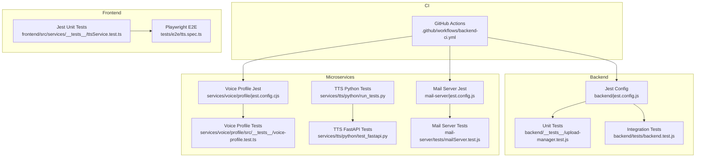

**Diagram sources**
- [backend-ci.yml:1-58](file://.github/workflows/backend-ci.yml#L1-L58)
- [backend jest.config.js:1-8](file://backend/jest.config.js#L1-L8)
- [services/voice/profile jest.config.cjs:1-15](file://services/voice/profile/jest.config.cjs#L1-L15)
- [mail-server jest.config.js:1-15](file://mail-server/jest.config.js#L1-L15)

**Section sources**
- [.github/workflows/backend-ci.yml:1-58](file://.github/workflows/backend-ci.yml#L1-L58)
- [backend package.json:1-52](file://backend/package.json#L1-L52)
- [frontend package.json:1-47](file://frontend/package.json#L1-L47)

## Core Components
- Backend testing framework: Jest configured for TypeScript/JavaScript with Node test environment.
- Frontend testing framework: Jest for unit tests and Playwright for end-to-end browser automation.
- Microservices testing:
  - Voice Profile service: Jest with ESM preset and TypeScript.
  - TTS Python service: Python unittest-style scripts for core logic.
  - Mail Server: Jest with coverage reporting and setup hooks.
- CI pipeline: GitHub Actions runs backend and voice profile tests on push and pull requests.

Key capabilities evidenced by the repository:
- Unit tests for backend services and controllers.
- Integration tests validating database transactions and webhook handling.
- End-to-end tests for TTS synthesis flow in the frontend.
- Microservice-specific tests for voice profiles and TTS logic.
- Coverage reporting and test timeouts configured in Jest configs.

**Section sources**
- [backend jest.config.js:1-8](file://backend/jest.config.js#L1-L8)
- [frontend package.json:1-47](file://frontend/package.json#L1-L47)
- [services/voice/profile jest.config.cjs:1-15](file://services/voice/profile/jest.config.cjs#L1-L15)
- [mail-server jest.config.js:1-15](file://mail-server/jest.config.js#L1-L15)
- [backend-ci.yml:1-58](file://.github/workflows/backend-ci.yml#L1-L58)

## Architecture Overview
The testing architecture spans unit, integration, and end-to-end layers with CI orchestration.

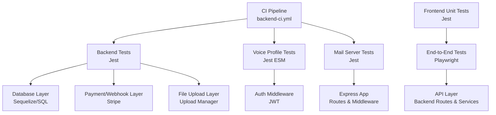

**Diagram sources**
- [backend-ci.yml:1-58](file://.github/workflows/backend-ci.yml#L1-L58)
- [tests/e2e/tts.spec.ts:1-94](file://tests/e2e/tts.spec.ts#L1-L94)
- [frontend/src/services/__tests__/ttsService.test.ts:1-139](file://frontend/src/services/__tests__/ttsService.test.ts#L1-L139)

## Detailed Component Analysis

### Backend Unit and Integration Testing
- Jest configuration enables TypeScript transformation and Node environment.
- Unit tests validate file upload manager behavior, including path safety and chunk handling.
- Integration tests validate purchase and payment flows, including database transactions and webhook handling.

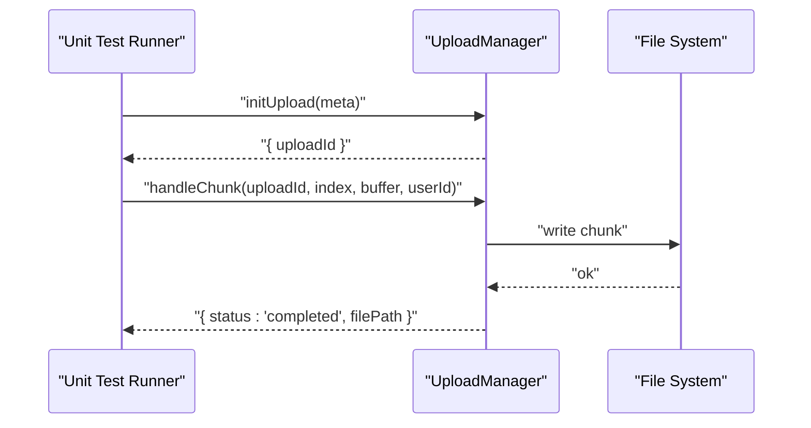

**Diagram sources**
- [backend __tests__/upload-manager.test.js:1-66](file://backend/__tests__/upload-manager.test.js#L1-L66)

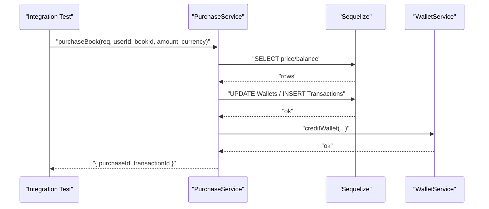

**Diagram sources**
- [backend tests/backend.test.js:1-80](file://backend/tests/backend.test.js#L1-L80)

**Section sources**
- [backend jest.config.js:1-8](file://backend/jest.config.js#L1-L8)
- [backend __tests__/upload-manager.test.js:1-66](file://backend/__tests__/upload-manager.test.js#L1-L66)
- [backend tests/backend.test.js:1-80](file://backend/tests/backend.test.js#L1-L80)

### Frontend Unit Testing (Jest)
- Tests cover text sanitization, chunking, validation, cost calculation, and synthesis flows.
- Uses module mocks for API layer and simulates browser fallback behavior.

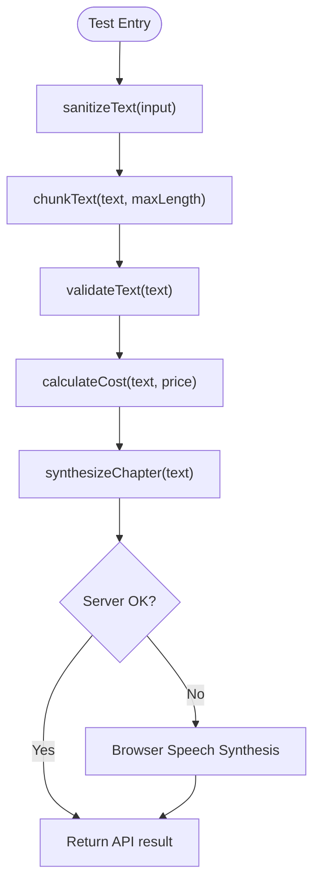

**Diagram sources**
- [frontend src/services/__tests__/ttsService.test.ts:1-139](file://frontend/src/services/__tests__/ttsService.test.ts#L1-L139)

**Section sources**
- [frontend src/services/__tests__/ttsService.test.ts:1-139](file://frontend/src/services/__tests__/ttsService.test.ts#L1-L139)

### End-to-End Testing (Playwright)
- Tests simulate user login and TTS synthesis flow, including voice selection, speed adjustment, and UI state transitions.
- Uses route interception to mock backend APIs and verify error handling.

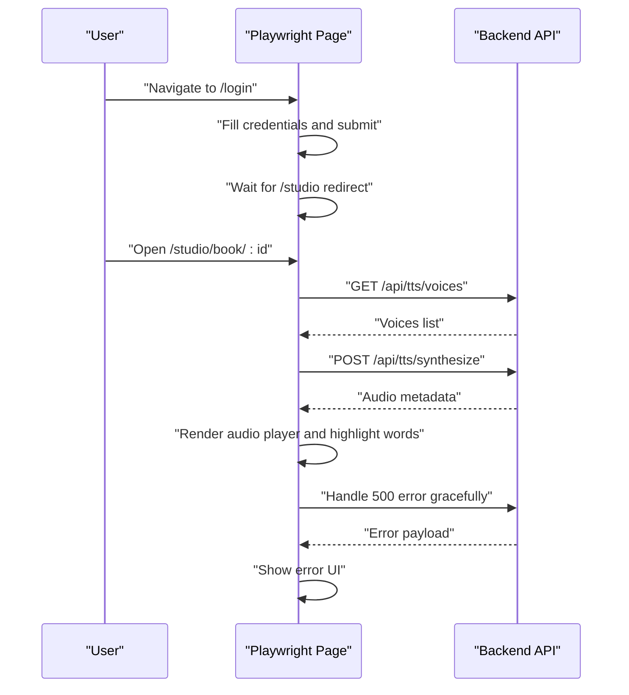

**Diagram sources**
- [tests/e2e/tts.spec.ts:1-94](file://tests/e2e/tts.spec.ts#L1-L94)

**Section sources**
- [tests/e2e/tts.spec.ts:1-94](file://tests/e2e/tts.spec.ts#L1-L94)

### Microservices Testing

#### Voice Profile Service (Jest ESM)
- Tests validate authentication requirements and 404 handling for non-existent profiles.

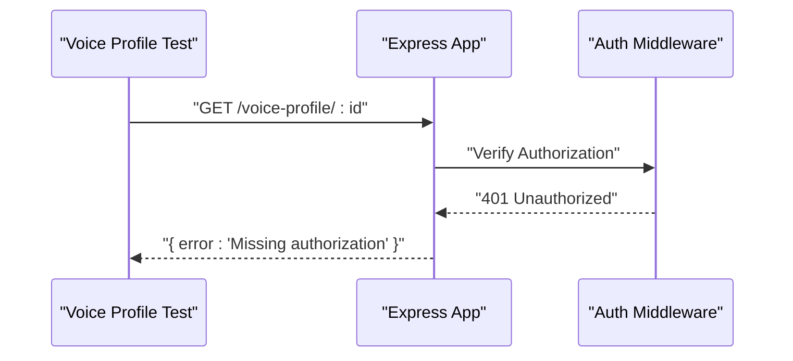

**Diagram sources**
- [services/voice/profile src/__tests__/voice-profile.test.ts:1-22](file://services/voice/profile/src/__tests__/voice-profile.test.ts#L1-L22)

**Section sources**
- [services/voice/profile jest.config.cjs:1-15](file://services/voice/profile/jest.config.cjs#L1-L15)
- [services/voice/profile src/__tests__/voice-profile.test.ts:1-22](file://services/voice/profile/src/__tests__/voice-profile.test.ts#L1-L22)

#### TTS Python Service
- Python scripts validate STEM parsing and SSML generation logic, ensuring mathematical and chemical expressions are handled correctly.

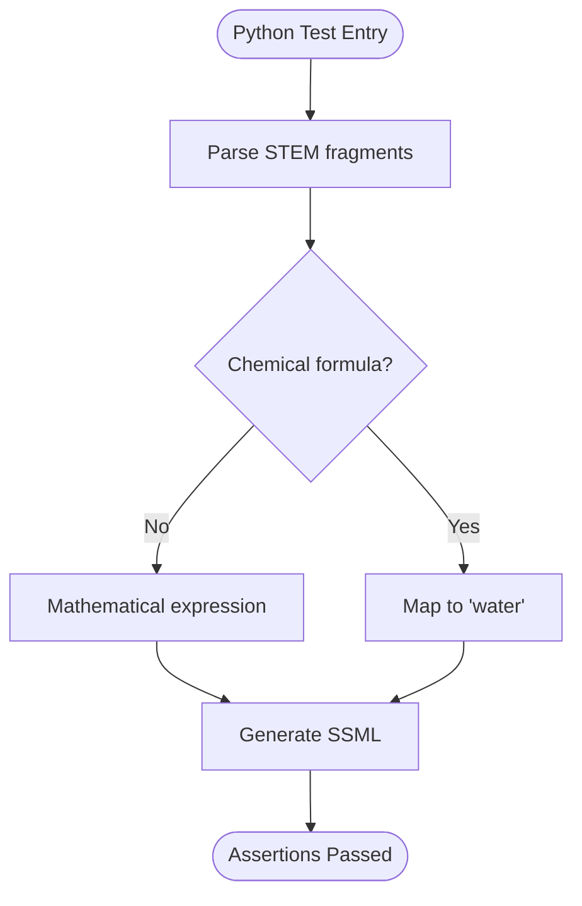

**Diagram sources**
- [services/tts/python/run_tests.py:1-40](file://services/tts/python/run_tests.py#L1-L40)
- [services/tts/python/test_fastapi.py:1-48](file://services/tts/python/test_fastapi.py#L1-L48)

**Section sources**
- [services/tts/python/run_tests.py:1-40](file://services/tts/python/run_tests.py#L1-L40)
- [services/tts/python/test_fastapi.py:1-48](file://services/tts/python/test_fastapi.py#L1-L48)

#### Mail Server (Jest)
- Tests cover configuration loading, service initialization, database connection, Express setup, and health checks.

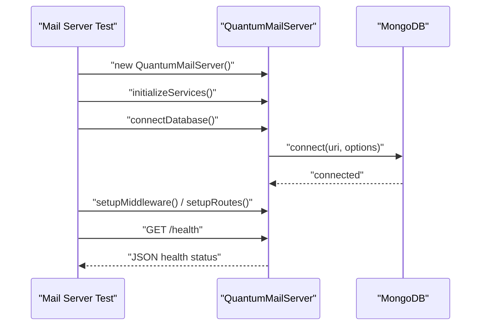

**Diagram sources**
- [mail-server tests/mailServer.test.js:1-94](file://mail-server/tests/mailServer.test.js#L1-L94)

**Section sources**
- [mail-server jest.config.js:1-15](file://mail-server/jest.config.js#L1-L15)
- [mail-server tests/mailServer.test.js:1-94](file://mail-server/tests/mailServer.test.js#L1-L94)

## Dependency Analysis
Testing dependencies and coupling:
- Backend tests depend on Jest, supertest for HTTP assertions, and Sequelize for database mocking.
- Frontend tests depend on Jest and module mocks for API clients.
- E2E tests depend on Playwright and route interception to isolate network dependencies.
- Microservices tests depend on their respective runtime environments and test frameworks.

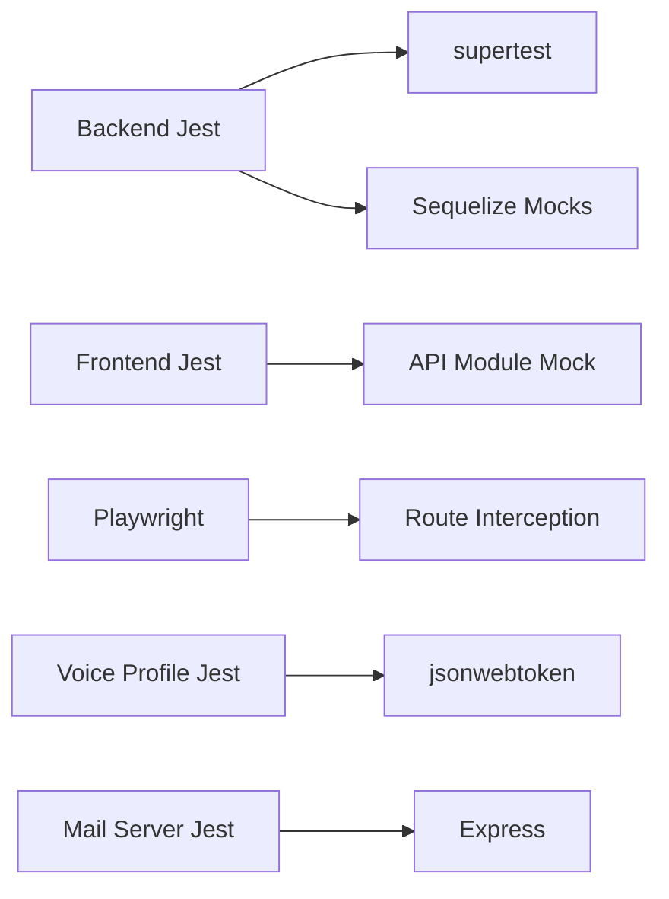

**Diagram sources**
- [backend package.json:1-52](file://backend/package.json#L1-L52)
- [frontend package.json:1-47](file://frontend/package.json#L1-L47)
- [services/voice/profile src/__tests__/voice-profile.test.ts:1-22](file://services/voice/profile/src/__tests__/voice-profile.test.ts#L1-L22)
- [mail-server tests/mailServer.test.js:1-94](file://mail-server/tests/mailServer.test.js#L1-L94)

**Section sources**
- [backend package.json:1-52](file://backend/package.json#L1-L52)
- [frontend package.json:1-47](file://frontend/package.json#L1-L47)

## Performance Considerations
- Use Jest’s test timeout configuration to prevent long-running tests from blocking CI.
- Prefer mocking expensive I/O operations (database, filesystem, external APIs) to keep unit tests fast.
- For E2E performance, minimize network round-trips by stubbing backend endpoints and using local assets.
- Consider splitting large test suites into focused files and leveraging Jest’s parallelism where appropriate.

[No sources needed since this section provides general guidance]

## Security Testing Considerations
- Validate input sanitization and path traversal protections in file upload handlers.
- Ensure authentication middleware is enforced in all protected routes and that tests assert 401 responses when missing tokens.
- Verify that sensitive configuration is not exposed in test logs and that secrets are mocked via environment variables.
- For payment/webhook flows, assert that only supported events trigger state changes and that invalid payloads are rejected.

**Section sources**
- [backend __tests__/upload-manager.test.js:44-64](file://backend/__tests__/upload-manager.test.js#L44-L64)
- [services/voice/profile src/__tests__/voice-profile.test.ts:6-20](file://services/voice/profile/src/__tests__/voice-profile.test.ts#L6-L20)

## Regression Testing Procedures
- Maintain a dedicated suite of integration tests for critical flows (purchase, payment webhook, file uploads).
- Keep E2E tests focused on user-facing journeys (login → synthesis → playback) to catch UI/API regressions.
- Use snapshot-like assertions sparingly; prefer deterministic checks on JSON payloads and UI states.
- Run regression tests alongside new feature tests in CI to detect unintended side effects early.

**Section sources**
- [backend tests/backend.test.js:1-80](file://backend/tests/backend.test.js#L1-L80)
- [tests/e2e/tts.spec.ts:1-94](file://tests/e2e/tts.spec.ts#L1-L94)

## Troubleshooting Guide
Common issues and resolutions:
- Jest timeout failures: Increase testTimeout in Jest config or refactor slow operations into mocks.
- Suppressed coverage reports: Ensure coverage configuration matches source paths and excludes generated files.
- E2E flakiness: Use explicit waits, route stubs, and deterministic selectors; avoid relying on real network latency.
- Authentication failures in tests: Provide valid JWT tokens via environment variables or signed tokens in tests.

**Section sources**
- [mail-server jest.config.js:1-15](file://mail-server/jest.config.js#L1-L15)
- [services/voice/profile jest.config.cjs:1-15](file://services/voice/profile/jest.config.cjs#L1-L15)

## Conclusion
The testing strategy leverages Jest for unit and integration tests, Playwright for end-to-end scenarios, and Python test scripts for core microservice logic. CI pipelines automate backend and voice profile tests on pull requests and pushes. By combining targeted mocking, route stubbing, and robust assertion patterns, the suite ensures reliability across backend services, frontend components, and microservices while maintaining strong security and regression coverage.

[No sources needed since this section summarizes without analyzing specific files]

## Appendices

### Test Organization Patterns
- Backend: Place unit tests adjacent to source files under __tests__ and integration tests under tests/.
- Frontend: Place unit tests alongside source modules under __tests__.
- Microservices: Use framework-specific configs and test directories per service.
- E2E: Centralize Playwright specs under tests/e2e/.

**Section sources**
- [backend __tests__/upload-manager.test.js:1-66](file://backend/__tests__/upload-manager.test.js#L1-L66)
- [backend tests/backend.test.js:1-80](file://backend/tests/backend.test.js#L1-L80)
- [frontend src/services/__tests__/ttsService.test.ts:1-139](file://frontend/src/services/__tests__/ttsService.test.ts#L1-L139)
- [tests/e2e/tts.spec.ts:1-94](file://tests/e2e/tts.spec.ts#L1-L94)

### Continuous Integration Testing Pipelines
- Backend job installs dependencies and runs Jest; optional npm audit is executed.
- Voice Profile job installs dependencies and runs tests with a JWT secret set.

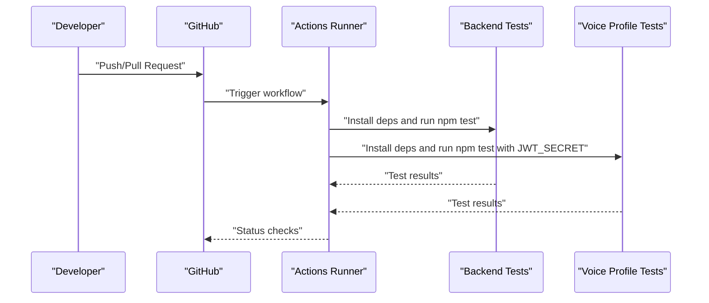

**Diagram sources**
- [backend-ci.yml:1-58](file://.github/workflows/backend-ci.yml#L1-L58)

**Section sources**
- [backend-ci.yml:1-58](file://.github/workflows/backend-ci.yml#L1-L58)