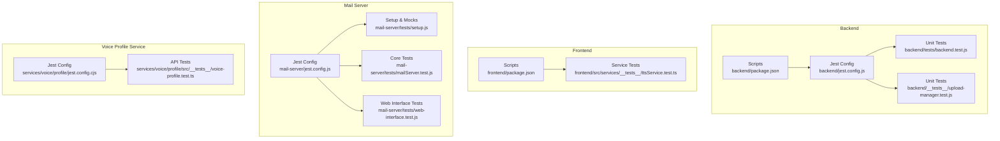
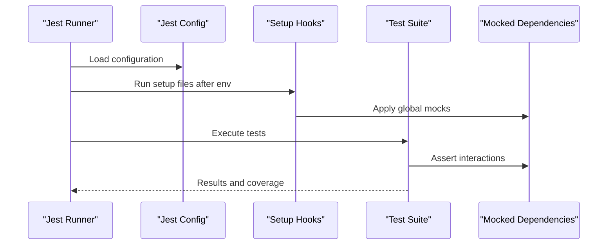
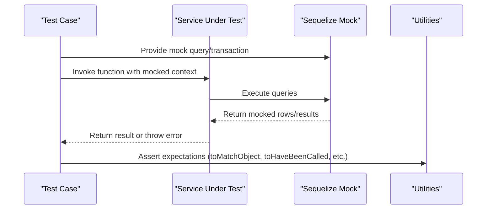
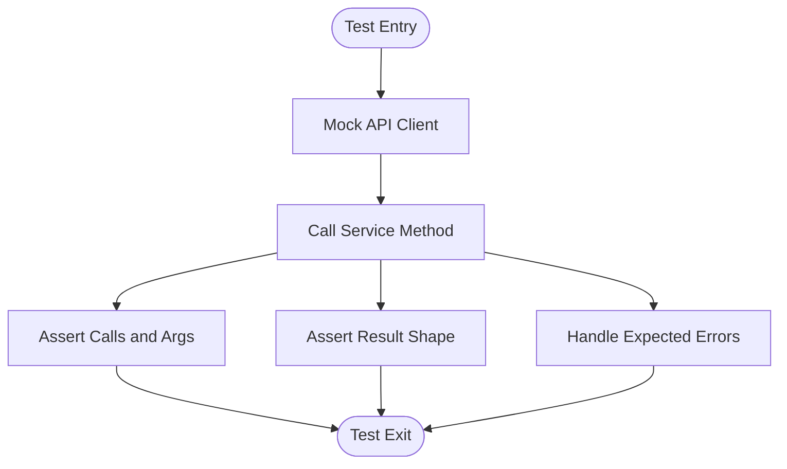
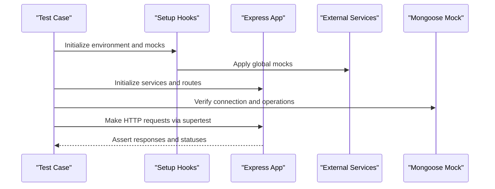
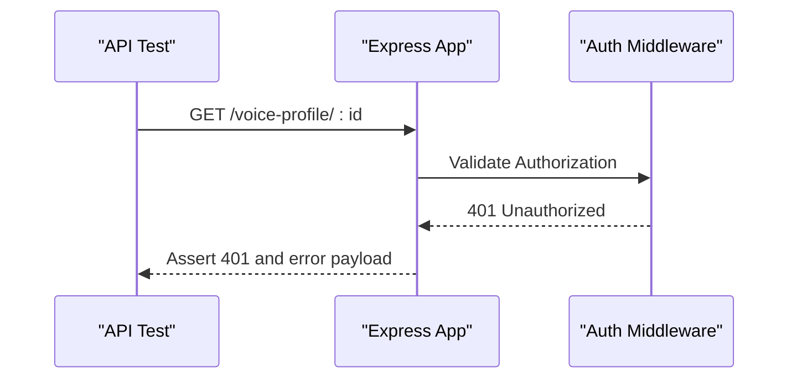
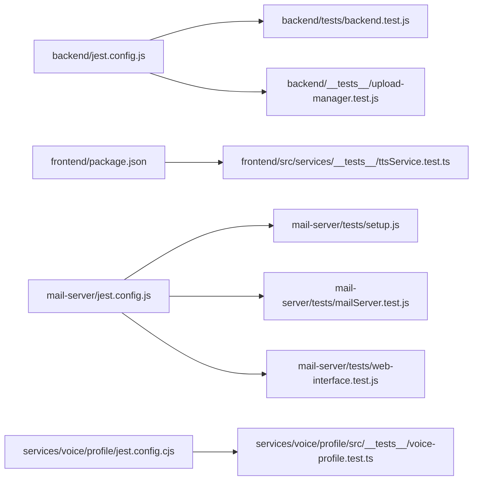

# Unit Testing Framework

<cite>
**Referenced Files in This Document**
- [backend/jest.config.js](file://backend/jest.config.js)
- [backend/package.json](file://backend/package.json)
- [backend/tests/backend.test.js](file://backend/tests/backend.test.js)
- [backend/__tests__/upload-manager.test.js](file://backend/__tests__/upload-manager.test.js)
- [frontend/package.json](file://frontend/package.json)
- [frontend/src/services/__tests__/ttsService.test.ts](file://frontend/src/services/__tests__/ttsService.test.ts)
- [mail-server/jest.config.js](file://mail-server/jest.config.js)
- [mail-server/tests/setup.js](file://mail-server/tests/setup.js)
- [mail-server/tests/mailServer.test.js](file://mail-server/tests/mailServer.test.js)
- [mail-server/tests/web-interface.test.js](file://mail-server/tests/web-interface.test.js)
- [services/voice/profile/src/__tests__/voice-profile.test.ts](file://services/voice/profile/src/__tests__/voice-profile.test.ts)
- [services/voice/profile/jest.config.cjs](file://services/voice/profile/jest.config.cjs)
</cite>

## Table of Contents
1. [Introduction](#introduction)
2. [Project Structure](#project-structure)
3. [Core Components](#core-components)
4. [Architecture Overview](#architecture-overview)
5. [Detailed Component Analysis](#detailed-component-analysis)
6. [Dependency Analysis](#dependency-analysis)
7. [Performance Considerations](#performance-considerations)
8. [Troubleshooting Guide](#troubleshooting-guide)
9. [Conclusion](#conclusion)
10. [Appendices](#appendices)

## Introduction
This document provides comprehensive unit testing guidance for the repository’s backend, frontend, and supporting services. It covers Jest configuration, test organization patterns, mocking strategies, and execution commands. It also documents how to mock databases, external APIs, and service dependencies, along with assertion patterns and reusable test utilities observed across the codebase.

## Project Structure
The repository includes multiple testing setups:
- Backend service with Jest configured for TypeScript and Node.js environment
- Frontend service with TypeScript-based tests and mocking of API clients
- Mail server service with extensive mocking of external systems and database
- Voice profile service with ESM-compatible Jest configuration

**Diagram sources**
- [backend/jest.config.js:1-8](file://backend/jest.config.js#L1-L8)
- [backend/package.json:6-11](file://backend/package.json#L6-L11)
- [backend/tests/backend.test.js:1-80](file://backend/tests/backend.test.js#L1-L80)
- [backend/__tests__/upload-manager.test.js:1-66](file://backend/__tests__/upload-manager.test.js#L1-L66)
- [frontend/package.json:6-11](file://frontend/package.json#L6-L11)
- [frontend/src/services/__tests__/ttsService.test.ts:1-139](file://frontend/src/services/__tests__/ttsService.test.ts#L1-L139)
- [mail-server/jest.config.js:1-15](file://mail-server/jest.config.js#L1-L15)
- [mail-server/tests/setup.js:1-129](file://mail-server/tests/setup.js#L1-L129)
- [mail-server/tests/mailServer.test.js:1-94](file://mail-server/tests/mailServer.test.js#L1-L94)
- [mail-server/tests/web-interface.test.js:1-669](file://mail-server/tests/web-interface.test.js#L1-L669)
- [services/voice/profile/jest.config.cjs:1-14](file://services/voice/profile/jest.config.cjs#L1-L14)
- [services/voice/profile/src/__tests__/voice-profile.test.ts:1-22](file://services/voice/profile/src/__tests__/voice-profile.test.ts#L1-L22)

**Section sources**
- [backend/jest.config.js:1-8](file://backend/jest.config.js#L1-L8)
- [backend/package.json:6-11](file://backend/package.json#L6-L11)
- [frontend/package.json:6-11](file://frontend/package.json#L6-L11)
- [mail-server/jest.config.js:1-15](file://mail-server/jest.config.js#L1-L15)
- [services/voice/profile/jest.config.cjs:1-14](file://services/voice/profile/jest.config.cjs#L1-L14)

## Core Components
- Backend testing framework:
  - Jest configuration for TypeScript transpilation and Node environment
  - Scripts to run tests in-band for compatibility with ES modules
  - Example unit tests for service-layer logic and database interactions via Sequelize mocks
- Frontend testing framework:
  - TypeScript-based service tests with mocked API client modules
  - Assertions for text sanitization, chunking, validation, and synthesis flows
- Mail server testing framework:
  - Comprehensive Jest configuration with coverage collection and setup hooks
  - Extensive mocking of external services (SMTP, IMAP, Redis, Bull Queue) and Mongoose models
  - End-to-end-style tests using supertest and DOM simulation via jsdom
- Voice profile service testing:
  - ESM-compatible Jest configuration with ts-jest defaults
  - API route tests using supertest asserting authentication and 404 scenarios

Key testing capabilities demonstrated:
- Database mocking via Sequelize mock factories and in-memory query tracking
- External API mocking via jest.mock and supertest for HTTP assertions
- DOM and browser-like environment mocking for web interface tests
- Coverage reporting and verbose test output for improved observability

**Section sources**
- [backend/jest.config.js:1-8](file://backend/jest.config.js#L1-L8)
- [backend/package.json:6-11](file://backend/package.json#L6-L11)
- [backend/tests/backend.test.js:1-80](file://backend/tests/backend.test.js#L1-L80)
- [frontend/src/services/__tests__/ttsService.test.ts:1-139](file://frontend/src/services/__tests__/ttsService.test.ts#L1-L139)
- [mail-server/jest.config.js:1-15](file://mail-server/jest.config.js#L1-L15)
- [mail-server/tests/setup.js:1-129](file://mail-server/tests/setup.js#L1-L129)
- [mail-server/tests/mailServer.test.js:1-94](file://mail-server/tests/mailServer.test.js#L1-L94)
- [mail-server/tests/web-interface.test.js:1-669](file://mail-server/tests/web-interface.test.js#L1-L669)
- [services/voice/profile/jest.config.cjs:1-14](file://services/voice/profile/jest.config.cjs#L1-L14)
- [services/voice/profile/src/__tests__/voice-profile.test.ts:1-22](file://services/voice/profile/src/__tests__/voice-profile.test.ts#L1-L22)

## Architecture Overview
The testing architecture follows a layered approach:
- Jest configuration per service defines environment, transforms, and coverage
- Setup files configure global mocks and environment variables
- Test suites isolate concerns: unit logic, service interactions, and integration-like HTTP flows
- Mock factories simulate external dependencies to keep tests deterministic and fast

**Diagram sources**
- [mail-server/jest.config.js:1-15](file://mail-server/jest.config.js#L1-L15)
- [mail-server/tests/setup.js:1-129](file://mail-server/tests/setup.js#L1-L129)
- [backend/tests/backend.test.js:1-80](file://backend/tests/backend.test.js#L1-L80)
- [frontend/src/services/__tests__/ttsService.test.ts:1-139](file://frontend/src/services/__tests__/ttsService.test.ts#L1-L139)

## Detailed Component Analysis

### Backend Testing Patterns
- Jest configuration:
  - TypeScript transform via ts-jest
  - Node test environment
  - Module resolution for ts/js/json
- Execution:
  - npm script invokes Jest with Node VM modules flag for ES module compatibility
- Test examples:
  - Service logic verification with Sequelize mock factories
  - Transactional purchase flow and webhook handling
  - Upload manager behavior with filesystem and path safety checks

**Diagram sources**
- [backend/tests/backend.test.js:1-80](file://backend/tests/backend.test.js#L1-L80)

**Section sources**
- [backend/jest.config.js:1-8](file://backend/jest.config.js#L1-L8)
- [backend/package.json:6-11](file://backend/package.json#L6-L11)
- [backend/tests/backend.test.js:1-80](file://backend/tests/backend.test.js#L1-L80)
- [backend/__tests__/upload-manager.test.js:1-66](file://backend/__tests__/upload-manager.test.js#L1-L66)

### Frontend Service Testing Patterns
- Test suite for TTS service:
  - Mocks the API client module to isolate service logic
  - Validates text sanitization, chunking, validation, and cost calculation
  - Exercises synthesis flows with and without timestamps
  - Implements browser fallback behavior with window speech APIs
- Assertion patterns:
  - Object matching for request payloads
  - Error propagation for AbortError
  - Fallback behavior verification

**Diagram sources**
- [frontend/src/services/__tests__/ttsService.test.ts:1-139](file://frontend/src/services/__tests__/ttsService.test.ts#L1-L139)

**Section sources**
- [frontend/src/services/__tests__/ttsService.test.ts:1-139](file://frontend/src/services/__tests__/ttsService.test.ts#L1-L139)

### Mail Server Testing Patterns
- Jest configuration:
  - Matches test files under tests/
  - Collects coverage from src/ excluding server entry
  - Uses setup file to apply global mocks and environment variables
  - Verbose output and increased timeout for async operations
- Setup and mocks:
  - Nodemailer, SMTPServer, IMAPFlow, Redis, and Bull mocked
  - Mongoose mocked with a factory returning lightweight model stubs
- Core tests:
  - Configuration precedence between defaults and environment variables
  - Service initialization and Express app setup
  - Database connection assertions
  - Health check route behavior
- Web interface tests:
  - Authentication flow via supertest
  - API endpoints for mailboxes, emails, domains, and queue
  - Utility components validation (API client, validation, notifications, errors, modals)
  - DOM-based UI checks using jsdom

**Diagram sources**
- [mail-server/jest.config.js:1-15](file://mail-server/jest.config.js#L1-L15)
- [mail-server/tests/setup.js:1-129](file://mail-server/tests/setup.js#L1-L129)
- [mail-server/tests/mailServer.test.js:1-94](file://mail-server/tests/mailServer.test.js#L1-L94)
- [mail-server/tests/web-interface.test.js:1-669](file://mail-server/tests/web-interface.test.js#L1-L669)

**Section sources**
- [mail-server/jest.config.js:1-15](file://mail-server/jest.config.js#L1-L15)
- [mail-server/tests/setup.js:1-129](file://mail-server/tests/setup.js#L1-L129)
- [mail-server/tests/mailServer.test.js:1-94](file://mail-server/tests/mailServer.test.js#L1-L94)
- [mail-server/tests/web-interface.test.js:1-669](file://mail-server/tests/web-interface.test.js#L1-L669)

### Voice Profile Service Testing Patterns
- ESM-compatible Jest configuration:
  - ts-jest default ESM preset
  - Root and match patterns for TS/JS test files
- Test coverage:
  - API route-level assertions for authentication and resource not found
  - Supertest usage for HTTP assertions

**Diagram sources**
- [services/voice/profile/jest.config.cjs:1-14](file://services/voice/profile/jest.config.cjs#L1-L14)
- [services/voice/profile/src/__tests__/voice-profile.test.ts:1-22](file://services/voice/profile/src/__tests__/voice-profile.test.ts#L1-L22)

**Section sources**
- [services/voice/profile/jest.config.cjs:1-14](file://services/voice/profile/jest.config.cjs#L1-L14)
- [services/voice/profile/src/__tests__/voice-profile.test.ts:1-22](file://services/voice/profile/src/__tests__/voice-profile.test.ts#L1-L22)

## Dependency Analysis
Testing dependencies and relationships:
- Backend
  - Jest configuration depends on ts-jest for TypeScript
  - Tests depend on Sequelize mock factories and utility mocks
- Frontend
  - Service tests depend on mocked API client modules
- Mail Server
  - Jest configuration depends on setup hooks for global mocks
  - Tests depend on supertest and jsdom for HTTP and DOM assertions
- Voice Profile
  - ESM Jest configuration aligns with ts-jest defaults

**Diagram sources**
- [backend/jest.config.js:1-8](file://backend/jest.config.js#L1-L8)
- [backend/tests/backend.test.js:1-80](file://backend/tests/backend.test.js#L1-L80)
- [backend/__tests__/upload-manager.test.js:1-66](file://backend/__tests__/upload-manager.test.js#L1-L66)
- [frontend/package.json:6-11](file://frontend/package.json#L6-L11)
- [frontend/src/services/__tests__/ttsService.test.ts:1-139](file://frontend/src/services/__tests__/ttsService.test.ts#L1-L139)
- [mail-server/jest.config.js:1-15](file://mail-server/jest.config.js#L1-L15)
- [mail-server/tests/setup.js:1-129](file://mail-server/tests/setup.js#L1-L129)
- [mail-server/tests/mailServer.test.js:1-94](file://mail-server/tests/mailServer.test.js#L1-L94)
- [mail-server/tests/web-interface.test.js:1-669](file://mail-server/tests/web-interface.test.js#L1-L669)
- [services/voice/profile/jest.config.cjs:1-14](file://services/voice/profile/jest.config.cjs#L1-L14)
- [services/voice/profile/src/__tests__/voice-profile.test.ts:1-22](file://services/voice/profile/src/__tests__/voice-profile.test.ts#L1-L22)

**Section sources**
- [backend/jest.config.js:1-8](file://backend/jest.config.js#L1-L8)
- [frontend/package.json:6-11](file://frontend/package.json#L6-L11)
- [mail-server/jest.config.js:1-15](file://mail-server/jest.config.js#L1-L15)
- [services/voice/profile/jest.config.cjs:1-14](file://services/voice/profile/jest.config.cjs#L1-L14)

## Performance Considerations
- Keep tests fast by relying on in-process mocks and avoiding real network calls
- Prefer small, focused tests that assert minimal behavior
- Use beforeEach/beforeAll judiciously to avoid expensive setup
- Limit coverage collection scope to relevant modules to reduce overhead

## Troubleshooting Guide
Common issues and resolutions:
- TypeScript transform failures:
  - Ensure Jest configuration includes ts-jest transform for ts/tsx files
- ES module compatibility:
  - Use Node VM modules flag in npm scripts when running Jest in ES module projects
- Global mocks not applied:
  - Confirm setup files are referenced in Jest configuration and executed after environment initialization
- Database connectivity in tests:
  - Use Sequelize mock factories to avoid real connections and manage transaction semantics deterministically
- External service dependencies:
  - Mock external libraries (HTTP clients, queues, databases) to remove flakiness and improve speed

**Section sources**
- [backend/jest.config.js:1-8](file://backend/jest.config.js#L1-L8)
- [backend/package.json:6-11](file://backend/package.json#L6-L11)
- [mail-server/jest.config.js:1-15](file://mail-server/jest.config.js#L1-L15)
- [mail-server/tests/setup.js:1-129](file://mail-server/tests/setup.js#L1-L129)

## Conclusion
The repository demonstrates robust testing practices across backend, frontend, and supporting services. Jest configurations are tailored to each service’s runtime and language needs, while comprehensive mocking strategies ensure reliable, fast, and maintainable tests. The provided patterns and examples can guide consistent test authoring and maintenance across the codebase.

## Appendices

### Test Execution Commands
- Backend:
  - Run tests with Node VM modules flag for ES module compatibility
- Frontend:
  - No dedicated test script is present; tests are written but not integrated into scripts
- Mail Server:
  - Jest runs tests under tests/ with coverage and verbose output
- Voice Profile Service:
  - ESM-compatible Jest configuration supports TS/JS test files

**Section sources**
- [backend/package.json:6-11](file://backend/package.json#L6-L11)
- [frontend/package.json:6-11](file://frontend/package.json#L6-L11)
- [mail-server/jest.config.js:1-15](file://mail-server/jest.config.js#L1-L15)
- [services/voice/profile/jest.config.cjs:1-14](file://services/voice/profile/jest.config.cjs#L1-L14)

### Mocking Strategies Across the Codebase
- Database mocking:
  - Sequelize mock factories with query and transaction stubs
  - In-memory query tracking to assert SQL execution
- External API mocking:
  - jest.mock on API client modules
  - Supertest for HTTP route-level assertions
- Browser/DOM mocking:
  - jsdom environment for DOM APIs and window features
- Model-level mocking:
  - Mongoose model factory returning lightweight stubs with CRUD methods

**Section sources**
- [backend/tests/backend.test.js:1-80](file://backend/tests/backend.test.js#L1-L80)
- [frontend/src/services/__tests__/ttsService.test.ts:1-139](file://frontend/src/services/__tests__/ttsService.test.ts#L1-L139)
- [mail-server/tests/setup.js:1-129](file://mail-server/tests/setup.js#L1-L129)
- [mail-server/tests/web-interface.test.js:1-669](file://mail-server/tests/web-interface.test.js#L1-L669)