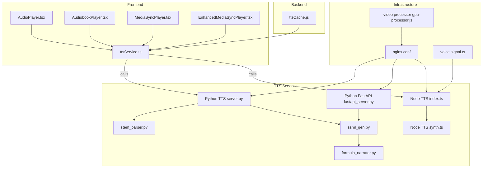
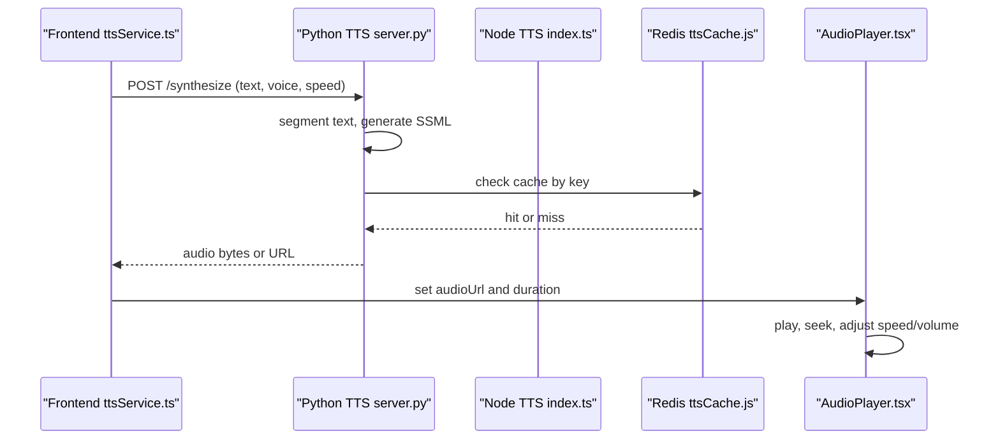
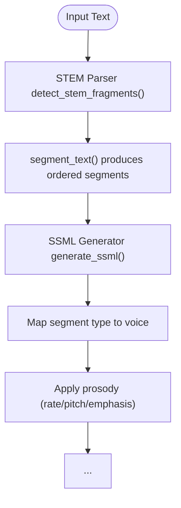
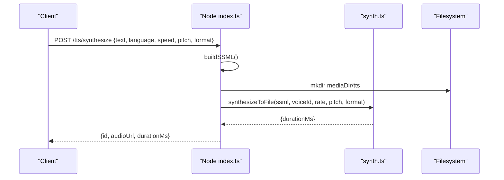
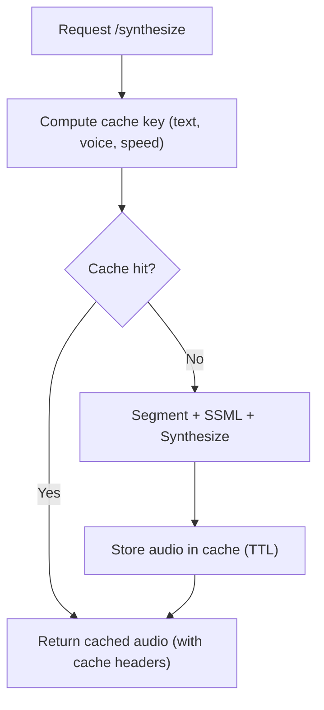
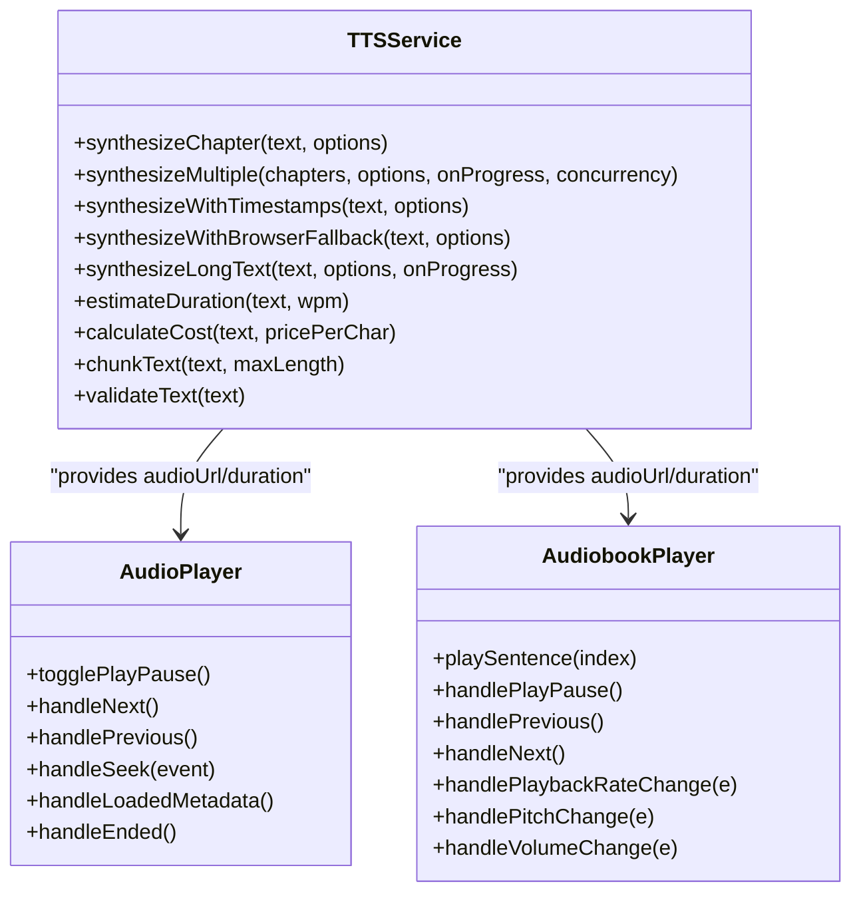
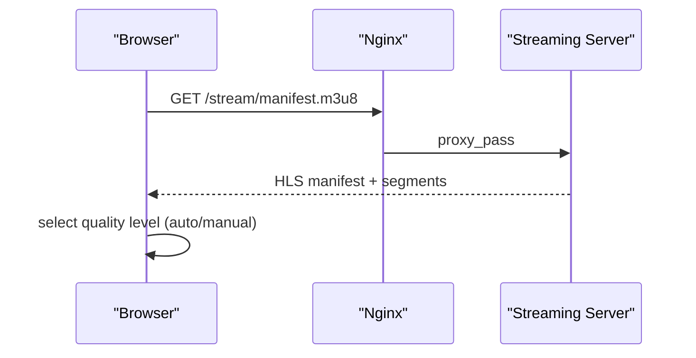
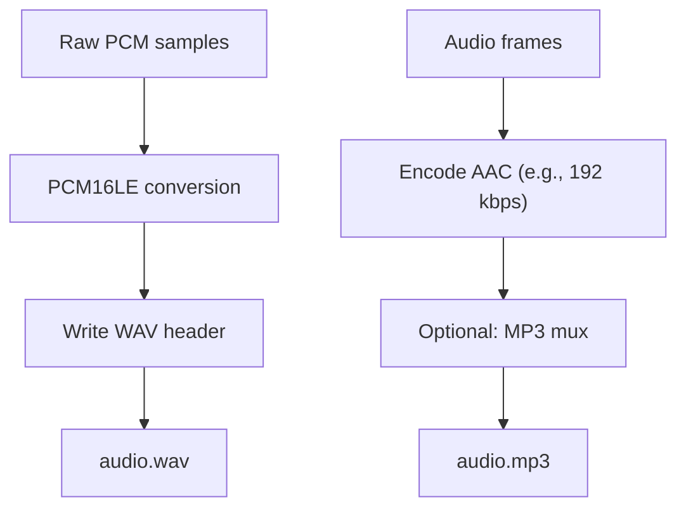
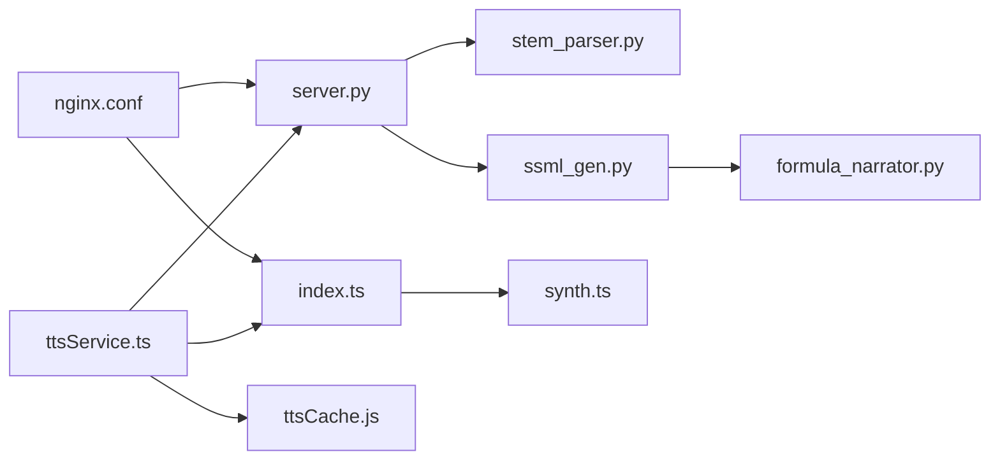

# Audio Processing and Optimization

<cite>
**Referenced Files in This Document**
- [server.py](file://services/tts/python/server.py)
- [fastapi_server.py](file://services/tts/python/fastapi_server.py)
- [ssml_gen.py](file://services/tts/python/ssml_gen.py)
- [stem_parser.py](file://services/tts/python/stem_parser.py)
- [formula_narrator.py](file://services/tts/python/formula_narrator.py)
- [index.ts](file://services/tts/node/src/index.ts)
- [synth.ts](file://services/tts/node/src/synth.ts)
- [ttsCache.js](file://backend/utils/ttsCache.js)
- [ttsService.ts](file://frontend/src/services/ttsService.ts)
- [AudioPlayer.tsx](file://frontend/src/components/AudioPlayer.tsx)
- [AudiobookPlayer.tsx](file://frontend/src/components/AudiobookPlayer.tsx)
- [MediaSyncPlayer.tsx](file://frontend/src/components/MediaSyncPlayer.tsx)
- [EnhancedMediaSyncPlayer.tsx](file://frontend/src/components/EnhancedMediaSyncPlayer.tsx)
- [nginx.conf](file://infrastructure/nginx/nginx.conf)
- [gpu-processor.js](file://services/video/processor/gpu-processor.js)
- [signal.ts](file://services/voice/profile/src/signal.ts)
</cite>

## Table of Contents
1. [Introduction](#introduction)
2. [Project Structure](#project-structure)
3. [Core Components](#core-components)
4. [Architecture Overview](#architecture-overview)
5. [Detailed Component Analysis](#detailed-component-analysis)
6. [Dependency Analysis](#dependency-analysis)
7. [Performance Considerations](#performance-considerations)
8. [Troubleshooting Guide](#troubleshooting-guide)
9. [Conclusion](#conclusion)
10. [Appendices](#appendices)

## Introduction
This document explains the audio processing and optimization system across the platform. It covers text-to-speech (TTS) pipeline design, audio format conversion, quality enhancement, caching, streaming optimization, and frontend integration. It also documents adaptive playback controls, audio quality settings, and practical workflows for performance tuning and troubleshooting.

## Project Structure
The audio system spans:
- Python-based TTS orchestration and SSML generation
- Node-based TTS synthesis service
- Backend caching utilities
- Frontend audio players and TTS service integration
- Infrastructure for streaming and proxy routing
- Supporting utilities for voice quality analysis

**Diagram sources**
- [server.py:1-190](file://services/tts/python/server.py#L1-L190)
- [fastapi_server.py:227-251](file://services/tts/python/fastapi_server.py#L227-L251)
- [ssml_gen.py:1-72](file://services/tts/python/ssml_gen.py#L1-L72)
- [stem_parser.py:1-132](file://services/tts/python/stem_parser.py#L1-L132)
- [formula_narrator.py:1-326](file://services/tts/python/formula_narrator.py#L1-L326)
- [index.ts:1-98](file://services/tts/node/src/index.ts#L1-L98)
- [synth.ts:72-107](file://services/tts/node/src/synth.ts#L72-L107)
- [ttsCache.js:1-59](file://backend/utils/ttsCache.js#L1-L59)
- [ttsService.ts:1-381](file://frontend/src/services/ttsService.ts#L1-L381)
- [AudioPlayer.tsx:1-288](file://frontend/src/components/AudioPlayer.tsx#L1-L288)
- [AudiobookPlayer.tsx:1-313](file://frontend/src/components/AudiobookPlayer.tsx#L1-L313)
- [MediaSyncPlayer.tsx:130-271](file://frontend/src/components/MediaSyncPlayer.tsx#L130-L271)
- [EnhancedMediaSyncPlayer.tsx:491-525](file://frontend/src/components/EnhancedMediaSyncPlayer.tsx#L491-L525)
- [nginx.conf:1-49](file://infrastructure/nginx/nginx.conf#L1-L49)
- [gpu-processor.js:84-195](file://services/video/processor/gpu-processor.js#L84-L195)
- [signal.ts:89-124](file://services/voice/profile/src/signal.ts#L89-L124)

**Section sources**
- [server.py:1-190](file://services/tts/python/server.py#L1-L190)
- [index.ts:1-98](file://services/tts/node/src/index.ts#L1-L98)
- [ttsService.ts:1-381](file://frontend/src/services/ttsService.ts#L1-L381)
- [ttsCache.js:1-59](file://backend/utils/ttsCache.js#L1-L59)
- [nginx.conf:1-49](file://infrastructure/nginx/nginx.conf#L1-L49)

## Core Components
- Text segmentation and SSML generation: STEM-aware parsing, formula narration, and SSML composition.
- TTS synthesis: Python service with caching and rate limiting; Node service for local synthesis and file output.
- Caching: Redis-backed cache for audio URLs keyed by text hash.
- Frontend integration: TTS service wrapper, audio players with playback controls, and adaptive pacing.
- Streaming and infrastructure: Nginx proxy routing and HLS streaming readiness.
- Quality analysis: Voice quality checks for SNR and clipping.

**Section sources**
- [stem_parser.py:1-132](file://services/tts/python/stem_parser.py#L1-L132)
- [ssml_gen.py:1-72](file://services/tts/python/ssml_gen.py#L1-L72)
- [formula_narrator.py:1-326](file://services/tts/python/formula_narrator.py#L1-L326)
- [server.py:134-185](file://services/tts/python/server.py#L134-L185)
- [index.ts:45-85](file://services/tts/node/src/index.ts#L45-L85)
- [ttsCache.js:17-55](file://backend/utils/ttsCache.js#L17-L55)
- [ttsService.ts:46-80](file://frontend/src/services/ttsService.ts#L46-L80)
- [AudioPlayer.tsx:120-288](file://frontend/src/components/AudioPlayer.tsx#L120-L288)
- [nginx.conf:21-47](file://infrastructure/nginx/nginx.conf#L21-L47)
- [signal.ts:89-124](file://services/voice/profile/src/signal.ts#L89-L124)

## Architecture Overview
The system orchestrates audio synthesis through a multi-service pipeline:
- Frontend requests TTS via ttsService.ts.
- ttsService.ts calls either Python or Node TTS endpoints depending on availability and mode.
- Python service performs text segmentation, SSML generation, and optionally caches results.
- Node service generates audio files and returns URLs for playback.
- Frontend players consume audio URLs and expose playback controls.
- Infrastructure proxies requests to appropriate services.

**Diagram sources**
- [ttsService.ts:46-80](file://frontend/src/services/ttsService.ts#L46-L80)
- [server.py:134-185](file://services/tts/python/server.py#L134-L185)
- [ttsCache.js:17-41](file://backend/utils/ttsCache.js#L17-L41)
- [AudioPlayer.tsx:158-163](file://frontend/src/components/AudioPlayer.tsx#L158-L163)

## Detailed Component Analysis

### Text Segmentation and SSML Generation
- STEM parsing detects math, chemistry, dialogue, and tutorial steps; segments plain text accordingly.
- SSML generator maps segment types to voices and applies prosody (rate, pitch, emphasis).
- Formula narrator converts LaTeX/MathML into spoken text with scientific rules.

**Diagram sources**
- [stem_parser.py:28-132](file://services/tts/python/stem_parser.py#L28-L132)
- [ssml_gen.py:26-72](file://services/tts/python/ssml_gen.py#L26-L72)
- [formula_narrator.py:137-169](file://services/tts/python/formula_narrator.py#L137-L169)

**Section sources**
- [stem_parser.py:1-132](file://services/tts/python/stem_parser.py#L1-L132)
- [ssml_gen.py:1-72](file://services/tts/python/ssml_gen.py#L1-L72)
- [formula_narrator.py:1-326](file://services/tts/python/formula_narrator.py#L1-L326)

### TTS Synthesis Pipeline
- Python service:
  - Validates inputs, segments text, computes complexity, builds SSML, and returns cached or generated audio.
  - Uses Redis for caching with cache keys derived from text, voice, and speed.
- Node service:
  - Accepts synthesis requests, builds SSML, writes audio to disk, and returns URL and duration.
  - Provides voice catalog and enforces request validation.

**Diagram sources**
- [index.ts:45-85](file://services/tts/node/src/index.ts#L45-L85)
- [synth.ts:72-107](file://services/tts/node/src/synth.ts#L72-L107)

**Section sources**
- [server.py:134-185](file://services/tts/python/server.py#L134-L185)
- [index.ts:12-98](file://services/tts/node/src/index.ts#L12-L98)
- [synth.ts:1-107](file://services/tts/node/src/synth.ts#L1-L107)

### Caching Strategy
- Redis cache stores audio URLs keyed by text hash for fast retrieval.
- Supports invalidation by book ID to refresh synthesized content.
- Python service also caches raw audio bytes with TTL and cache headers.

**Diagram sources**
- [ttsCache.js:17-41](file://backend/utils/ttsCache.js#L17-L41)
- [server.py:152-180](file://services/tts/python/server.py#L152-L180)

**Section sources**
- [ttsCache.js:1-59](file://backend/utils/ttsCache.js#L1-L59)
- [server.py:134-185](file://services/tts/python/server.py#L134-L185)

### Frontend Audio Player Integration
- ttsService.ts:
  - Sanitizes and validates text, batches synthesis, and supports browser fallback.
  - Estimates duration and cost, and chunks long texts.
- AudioPlayer.tsx:
  - Controls playback, speed, and volume; displays chapter navigation and progress.
- AudiobookPlayer.tsx:
  - Sentence-level playback with settings for rate, pitch, volume, and voice selection.
- MediaSyncPlayer.tsx and EnhancedMediaSyncPlayer.tsx:
  - Provide skip controls, volume sliders, and adaptive pacing toggles.

**Diagram sources**
- [ttsService.ts:33-381](file://frontend/src/services/ttsService.ts#L33-L381)
- [AudioPlayer.tsx:12-288](file://frontend/src/components/AudioPlayer.tsx#L12-L288)
- [AudiobookPlayer.tsx:49-313](file://frontend/src/components/AudiobookPlayer.tsx#L49-L313)

**Section sources**
- [ttsService.ts:1-381](file://frontend/src/services/ttsService.ts#L1-L381)
- [AudioPlayer.tsx:1-288](file://frontend/src/components/AudioPlayer.tsx#L1-L288)
- [AudiobookPlayer.tsx:1-313](file://frontend/src/components/AudiobookPlayer.tsx#L1-L313)
- [MediaSyncPlayer.tsx:130-271](file://frontend/src/components/MediaSyncPlayer.tsx#L130-L271)
- [EnhancedMediaSyncPlayer.tsx:491-525](file://frontend/src/components/EnhancedMediaSyncPlayer.tsx#L491-L525)

### Streaming Optimization and Bandwidth Adaptation
- HLS-ready player initialization and quality switching are demonstrated in the static video player page.
- Infrastructure routes streaming endpoints via Nginx to the streaming server.
- Video processor demonstrates adaptive bitrate and lookahead configuration suitable for audio streaming scenarios.

**Diagram sources**
- [nginx.conf:31-35](file://infrastructure/nginx/nginx.conf#L31-L35)
- [gpu-processor.js:84-114](file://services/video/processor/gpu-processor.js#L84-L114)

**Section sources**
- [nginx.conf:1-49](file://infrastructure/nginx/nginx.conf#L1-L49)
- [gpu-processor.js:84-195](file://services/video/processor/gpu-processor.js#L84-L195)

### Compression and Format Conversion
- Node TTS service writes WAV output; PCM16LE conversion and WAV header writing are implemented.
- Python FastAPI service supports streaming synthesis to configured output formats.
- Video processor demonstrates AAC audio encoding and adaptive bitrate for video; analogous techniques apply to audio-only streaming.

**Diagram sources**
- [synth.ts:88-107](file://services/tts/node/src/synth.ts#L88-L107)
- [fastapi_server.py:227-251](file://services/tts/python/fastapi_server.py#L227-L251)
- [gpu-processor.js:154-170](file://services/video/processor/gpu-processor.js#L154-L170)

**Section sources**
- [synth.ts:72-107](file://services/tts/node/src/synth.ts#L72-L107)
- [fastapi_server.py:227-251](file://services/tts/python/fastapi_server.py#L227-L251)
- [gpu-processor.js:154-170](file://services/video/processor/gpu-processor.js#L154-L170)

### Voice Quality Enhancement and Analysis
- Voice quality checks compute duration, SNR, and detect clipping for uploaded voice samples.
- These insights help tune synthesis parameters and detect degraded input audio.

**Section sources**
- [signal.ts:89-124](file://services/voice/profile/src/signal.ts#L89-L124)

## Dependency Analysis
- Frontend depends on ttsService.ts for synthesis and on players for playback.
- Python and Node services depend on SSML and formula narration modules.
- Caching is centralized in Redis and used by the Python service.
- Nginx proxies traffic to TTS services and streaming endpoints.

**Diagram sources**
- [ttsService.ts:1-381](file://frontend/src/services/ttsService.ts#L1-L381)
- [server.py:1-190](file://services/tts/python/server.py#L1-L190)
- [index.ts:1-98](file://services/tts/node/src/index.ts#L1-L98)
- [stem_parser.py:1-132](file://services/tts/python/stem_parser.py#L1-L132)
- [ssml_gen.py:1-72](file://services/tts/python/ssml_gen.py#L1-L72)
- [formula_narrator.py:1-326](file://services/tts/python/formula_narrator.py#L1-L326)
- [synth.ts:1-107](file://services/tts/node/src/synth.ts#L1-L107)
- [ttsCache.js:1-59](file://backend/utils/ttsCache.js#L1-L59)
- [nginx.conf:1-49](file://infrastructure/nginx/nginx.conf#L1-L49)

**Section sources**
- [ttsService.ts:1-381](file://frontend/src/services/ttsService.ts#L1-L381)
- [server.py:1-190](file://services/tts/python/server.py#L1-L190)
- [index.ts:1-98](file://services/tts/node/src/index.ts#L1-L98)
- [nginx.conf:1-49](file://infrastructure/nginx/nginx.conf#L1-L49)

## Performance Considerations
- Concurrency and batching:
  - Use ttsService.synthesizeMultiple with controlled concurrency to balance throughput and latency.
- Text chunking:
  - Long texts should be chunked to stay under backend limits and improve reliability.
- Caching:
  - Prefer stable text hashes for cache keys; invalidate per-book when content changes.
- Streaming:
  - Enable HLS with adaptive quality switching; configure buffer sizes and lookahead for stability.
- Audio encoding:
  - Choose AAC at 192 kbps for balanced quality and bandwidth; consider Opus for VoIP-like scenarios.
- Player controls:
  - Provide speed and pitch adjustments; adaptive pacing toggles can improve comprehension.

[No sources needed since this section provides general guidance]

## Troubleshooting Guide
- Synthesis failures:
  - Validate text length and format; sanitize HTML and whitespace before sending.
  - Use ttsService.synthesizeWithBrowserFallback for offline or network issues.
- Cache issues:
  - Verify Redis connectivity and keys; invalidate per-book cache when regenerating content.
- Player playback problems:
  - Ensure audioUrl is set and duration is accurate; check autoplay policies and user gesture requirements.
- Quality concerns:
  - Analyze voice samples for SNR and clipping; adjust input gain and filtering.
- Streaming stalls:
  - Confirm Nginx proxy routes and HLS manifest availability; monitor buffer health and network conditions.

**Section sources**
- [ttsService.ts:82-245](file://frontend/src/services/ttsService.ts#L82-L245)
- [ttsCache.js:12-55](file://backend/utils/ttsCache.js#L12-L55)
- [AudioPlayer.tsx:158-163](file://frontend/src/components/AudioPlayer.tsx#L158-L163)
- [signal.ts:89-124](file://services/voice/profile/src/signal.ts#L89-L124)
- [nginx.conf:31-35](file://infrastructure/nginx/nginx.conf#L31-L35)

## Conclusion
The audio system integrates robust text segmentation, SSML generation, and multi-service synthesis with caching and frontend playback controls. By leveraging HLS streaming, adaptive bitrate, and quality analysis, the platform delivers scalable, high-quality audio experiences across devices and network conditions.

[No sources needed since this section summarizes without analyzing specific files]

## Appendices

### Example Workflows
- End-to-end synthesis:
  - Frontend calls ttsService.synthesizeChapter; Python/Node synthesizes audio; cache stores URL; player plays audio.
- Batch synthesis:
  - Use ttsService.synthesizeMultiple with concurrency control; track progress and handle partial failures.
- Adaptive playback:
  - Use AudiobookPlayer controls for rate, pitch, and voice; integrate with MediaSyncPlayer for synchronized reading.

**Section sources**
- [ttsService.ts:133-176](file://frontend/src/services/ttsService.ts#L133-L176)
- [AudioPlayer.tsx:120-288](file://frontend/src/components/AudioPlayer.tsx#L120-L288)
- [AudiobookPlayer.tsx:49-313](file://frontend/src/components/AudiobookPlayer.tsx#L49-L313)