# Formula Recognition and Processing

<cite>
**Referenced Files in This Document**
- [server.py](file://services/formula-engine/server.py)
- [formula_parser.py](file://services/formula-engine/core/formula_parser.py)
- [server.py](file://services/tts/python/server.py)
- [stem_parser.py](file://services/tts/python/stem_parser.py)
- [formula_narrator.py](file://services/tts/python/formula_narrator.py)
- [ssml.ts](file://services/tts/node/src/ssml.ts)
- [scientific_tts.py](file://services/content/api/core/scientific_tts.py)
- [shapes.ts](file://services/video/service/src/shapes.ts)
- [MathRenderer.tsx](file://frontend/src/components/MathRenderer.tsx)
- [Formula.tsx](file://frontend/src/components/ui/Formula.tsx)
- [formulaDetector.ts](file://frontend/src/utils/text-analysis/formulaDetector.ts)
- [formulaRoutes.js](file://backend/routes/formulaRoutes.js)
- [Formula.js](file://backend/models/Formula.js)
</cite>

## Table of Contents
1. [Introduction](#introduction)
2. [Project Structure](#project-structure)
3. [Core Components](#core-components)
4. [Architecture Overview](#architecture-overview)
5. [Detailed Component Analysis](#detailed-component-analysis)
6. [Dependency Analysis](#dependency-analysis)
7. [Performance Considerations](#performance-considerations)
8. [Troubleshooting Guide](#troubleshooting-guide)
9. [Conclusion](#conclusion)
10. [Appendices](#appendices)

## Introduction
This document explains the STEM formula recognition and processing system across the backend, TTS pipeline, and frontend. It covers mathematical notation detection, LaTeX parsing, formula segmentation, complexity scoring, pronunciation mapping, chemistry formula handling, KaTeX rendering, formula-to-speech conversion rules, and multilingual support. It also provides examples, custom handling guidance, and troubleshooting for common parsing issues.

## Project Structure
The system spans three primary areas:
- Backend API for formula narration and persistence
- Python services for STEM text segmentation, formula narration, and scientific TTS
- Frontend components for rendering and interactive formula exploration

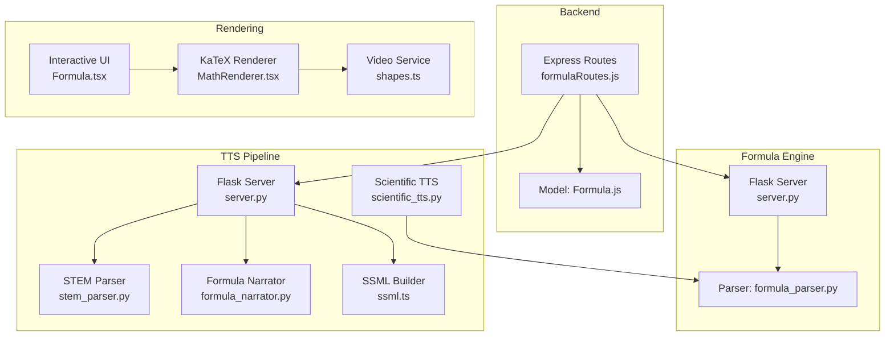

**Diagram sources**
- [formulaRoutes.js:1-86](file://backend/routes/formulaRoutes.js#L1-L86)
- [Formula.js:1-29](file://backend/models/Formula.js#L1-L29)
- [server.py:1-25](file://services/formula-engine/server.py#L1-L25)
- [formula_parser.py:1-133](file://services/formula-engine/core/formula_parser.py#L1-L133)
- [server.py:1-190](file://services/tts/python/server.py#L1-L190)
- [stem_parser.py:1-132](file://services/tts/python/stem_parser.py#L1-L132)
- [formula_narrator.py:1-326](file://services/tts/python/formula_narrator.py#L1-L326)
- [ssml.ts:1-149](file://services/tts/node/src/ssml.ts#L1-L149)
- [scientific_tts.py:1-407](file://services/content/api/core/scientific_tts.py#L1-L407)
- [MathRenderer.tsx:1-33](file://frontend/src/components/MathRenderer.tsx#L1-L33)
- [Formula.tsx:1-54](file://frontend/src/components/ui/Formula.tsx#L1-L54)
- [shapes.ts:1-33](file://services/video/service/src/shapes.ts#L1-L33)

**Section sources**
- [formulaRoutes.js:1-86](file://backend/routes/formulaRoutes.js#L1-L86)
- [Formula.js:1-29](file://backend/models/Formula.js#L1-L29)
- [server.py:1-25](file://services/formula-engine/server.py#L1-L25)
- [formula_parser.py:1-133](file://services/formula-engine/core/formula_parser.py#L1-L133)
- [server.py:1-190](file://services/tts/python/server.py#L1-L190)
- [stem_parser.py:1-132](file://services/tts/python/stem_parser.py#L1-L132)
- [formula_narrator.py:1-326](file://services/tts/python/formula_narrator.py#L1-L326)
- [ssml.ts:1-149](file://services/tts/node/src/ssml.ts#L1-L149)
- [scientific_tts.py:1-407](file://services/content/api/core/scientific_tts.py#L1-L407)
- [MathRenderer.tsx:1-33](file://frontend/src/components/MathRenderer.tsx#L1-L33)
- [Formula.tsx:1-54](file://frontend/src/components/ui/Formula.tsx#L1-L54)
- [shapes.ts:1-33](file://services/video/service/src/shapes.ts#L1-L33)

## Core Components
- Formula Engine: Parses LaTeX into symbolic expressions, classifies types, generates spoken forms, and computes complexity scores.
- STEM Parser: Detects math, chemistry, and dialogue/step fragments; segments text accordingly.
- Formula Narrator: Converts LaTeX and MathML into clear, spoken descriptions and supports interactive symbol breakdown.
- TTS Service: Orchestrates segmentation, complexity scoring, SSML generation, caching, and synthesis orchestration.
- Scientific TTS: Loads scientific-specialized models, processes formulas, and synthesizes speech with explanations.
- Rendering: Frontend renders LaTeX via KaTeX and exposes interactive tokens; backend routes integrate with TTS and persist formula metadata.

**Section sources**
- [formula_parser.py:1-133](file://services/formula-engine/core/formula_parser.py#L1-L133)
- [stem_parser.py:1-132](file://services/tts/python/stem_parser.py#L1-L132)
- [formula_narrator.py:1-326](file://services/tts/python/formula_narrator.py#L1-L326)
- [server.py:1-190](file://services/tts/python/server.py#L1-L190)
- [scientific_tts.py:1-407](file://services/content/api/core/scientific_tts.py#L1-L407)
- [MathRenderer.tsx:1-33](file://frontend/src/components/MathRenderer.tsx#L1-L33)
- [Formula.tsx:1-54](file://frontend/src/components/ui/Formula.tsx#L1-L54)

## Architecture Overview
The system integrates backend routes, formula engine, TTS pipeline, and frontend rendering. The backend route calls the TTS service for formula breakdown and optionally persists tokens. The TTS service orchestrates STEM parsing, complexity scoring, SSML generation, and optional caching. The frontend renders formulas with KaTeX and highlights interactive tokens.

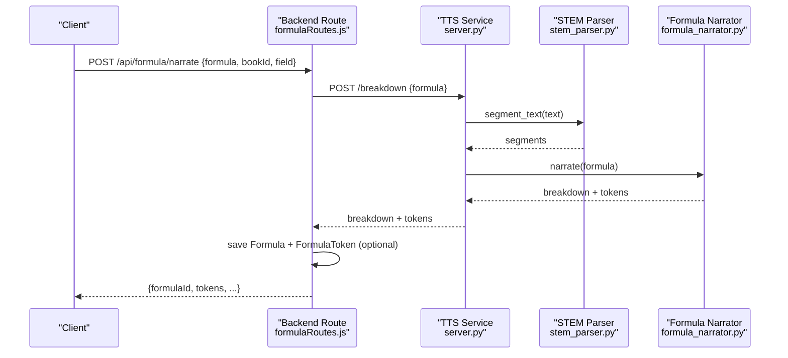

**Diagram sources**
- [formulaRoutes.js:14-65](file://backend/routes/formulaRoutes.js#L14-L65)
- [server.py:80-132](file://services/tts/python/server.py#L80-L132)
- [stem_parser.py:110-132](file://services/tts/python/stem_parser.py#L110-L132)
- [formula_narrator.py:137-169](file://services/tts/python/formula_narrator.py#L137-L169)

## Detailed Component Analysis

### Mathematical Notation Detection and LaTeX Parsing
- STEM Parser detects inline and display math delimited by various patterns, extracts dialogue and step indicators, and identifies chemistry formulas using uppercase-letter and digit heuristics.
- Formula Engine cleans LaTeX into a SymPy-compatible form, classifies expression types, and computes complexity based on free symbols and operation counts.

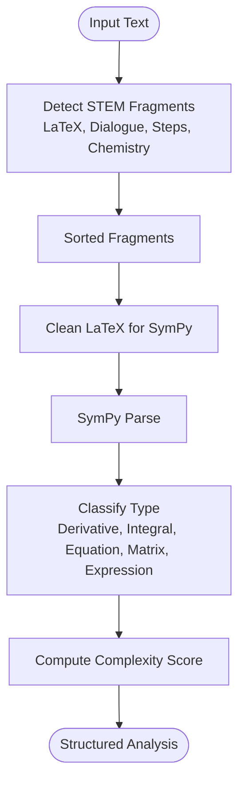

**Diagram sources**
- [stem_parser.py:28-108](file://services/tts/python/stem_parser.py#L28-L108)
- [formula_parser.py:10-37](file://services/formula-engine/core/formula_parser.py#L10-L37)
- [formula_parser.py:39-64](file://services/formula-engine/core/formula_parser.py#L39-L64)
- [formula_parser.py:66-76](file://services/formula-engine/core/formula_parser.py#L66-L76)
- [formula_parser.py:125-132](file://services/formula-engine/core/formula_parser.py#L125-L132)

**Section sources**
- [stem_parser.py:11-27](file://services/tts/python/stem_parser.py#L11-L27)
- [stem_parser.py:28-108](file://services/tts/python/stem_parser.py#L28-L108)
- [formula_parser.py:10-37](file://services/formula-engine/core/formula_parser.py#L10-L37)
- [formula_parser.py:39-64](file://services/formula-engine/core/formula_parser.py#L39-L64)
- [formula_parser.py:66-76](file://services/formula-engine/core/formula_parser.py#L66-L76)
- [formula_parser.py:125-132](file://services/formula-engine/core/formula_parser.py#L125-L132)

### Formula Segmentation Techniques
- STEM Parser builds a list of fragments with type, content, original text, and offsets, then merges them into ordered segments interleaving plain text and STEM blocks.
- Frontend detector locates inline math delimiters for initial identification.

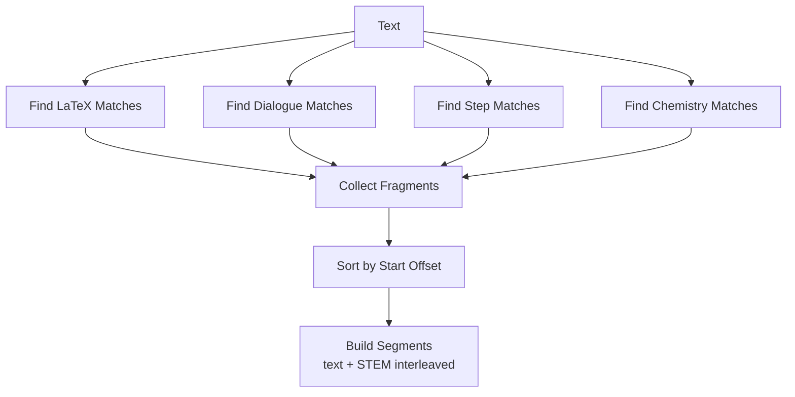

**Diagram sources**
- [stem_parser.py:28-108](file://services/tts/python/stem_parser.py#L28-L108)
- [stem_parser.py:110-132](file://services/tts/python/stem_parser.py#L110-L132)
- [formulaDetector.ts:1-11](file://frontend/src/utils/text-analysis/formulaDetector.ts#L1-L11)

**Section sources**
- [stem_parser.py:110-132](file://services/tts/python/stem_parser.py#L110-L132)
- [formulaDetector.ts:1-11](file://frontend/src/utils/text-analysis/formulaDetector.ts#L1-L11)

### Formula Complexity Scoring System
- Formula Engine: Weighted score based on free symbols and operation count; higher weight for derivatives/integrals.
- TTS Service: Heuristic complexity considers STEM segment types and LaTeX structure (escapes, subscripts/superscripts).

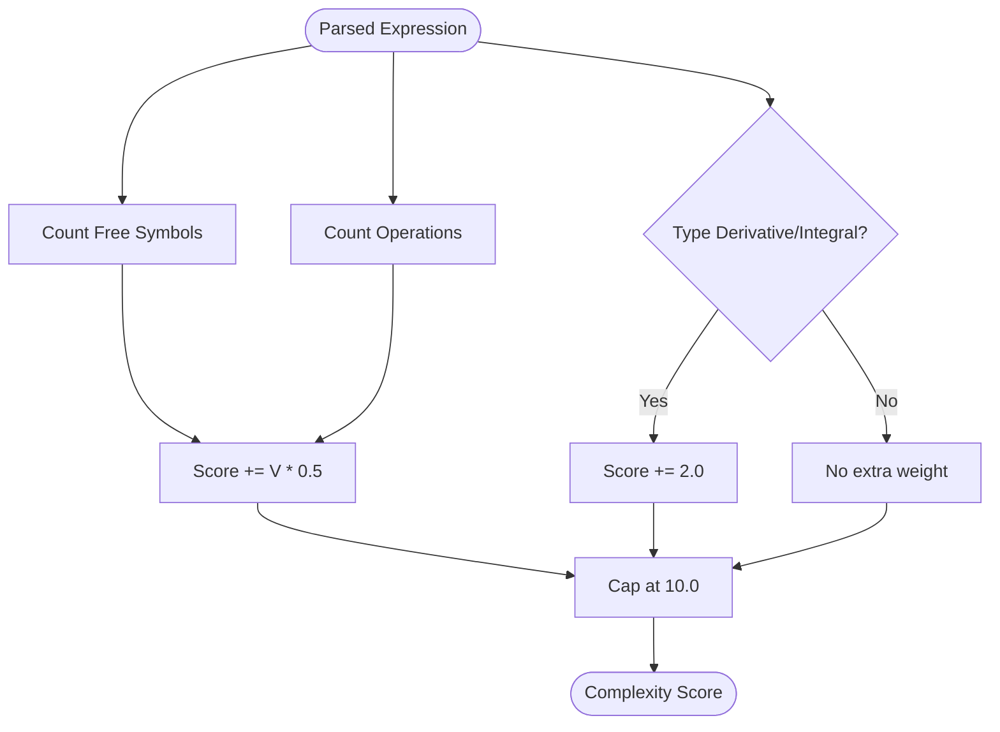

**Diagram sources**
- [formula_parser.py:125-132](file://services/formula-engine/core/formula_parser.py#L125-L132)
- [server.py:65-78](file://services/tts/python/server.py#L65-L78)

**Section sources**
- [formula_parser.py:125-132](file://services/formula-engine/core/formula_parser.py#L125-L132)
- [server.py:65-78](file://services/tts/python/server.py#L65-L78)

### Pronunciation Mapping for Mathematical Expressions
- Formula Narrator converts LaTeX constructs (fractions, roots, integrals, sums, exponents/subscripts, matrices/environments) and operators/greek letters into spoken forms.
- SSML builder translates LaTeX into speech-friendly tokens and applies prosody and emphasis.

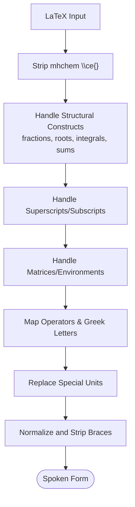

**Diagram sources**
- [formula_narrator.py:143-169](file://services/tts/python/formula_narrator.py#L143-L169)
- [formula_narrator.py:171-187](file://services/tts/python/formula_narrator.py#L171-L187)
- [formula_narrator.py:189-201](file://services/tts/python/formula_narrator.py#L189-L201)
- [formula_narrator.py:203-236](file://services/tts/python/formula_narrator.py#L203-L236)
- [ssml.ts:41-127](file://services/tts/node/src/ssml.ts#L41-L127)

**Section sources**
- [formula_narrator.py:143-169](file://services/tts/python/formula_narrator.py#L143-L169)
- [formula_narrator.py:171-187](file://services/tts/python/formula_narrator.py#L171-L187)
- [formula_narrator.py:189-201](file://services/tts/python/formula_narrator.py#L189-L201)
- [formula_narrator.py:203-236](file://services/tts/python/formula_narrator.py#L203-L236)
- [ssml.ts:41-127](file://services/tts/node/src/ssml.ts#L41-L127)

### Chemistry Formula Handling
- STEM Parser identifies chemistry fragments using capitalization and digit heuristics, excluding common non-chemical words.
- Formula Narrator includes a dictionary of common molecular formulas and units for clear pronunciation.

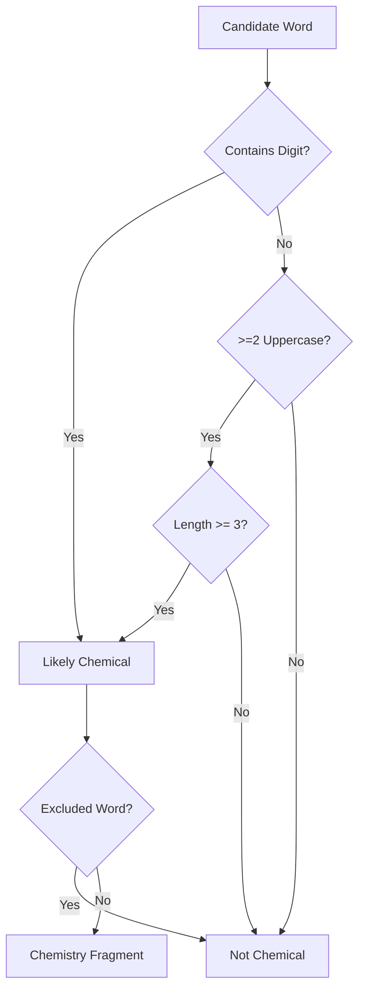

**Diagram sources**
- [stem_parser.py:81-105](file://services/tts/python/stem_parser.py#L81-L105)
- [formula_narrator.py:100-109](file://services/tts/python/formula_narrator.py#L100-L109)

**Section sources**
- [stem_parser.py:81-105](file://services/tts/python/stem_parser.py#L81-L105)
- [formula_narrator.py:100-109](file://services/tts/python/formula_narrator.py#L100-L109)

### Integration with KaTeX for Rendering
- Frontend components render LaTeX using KaTeX with error handling and fallback to plain text.
- Interactive UI supports tapping tokens and logging interactions.

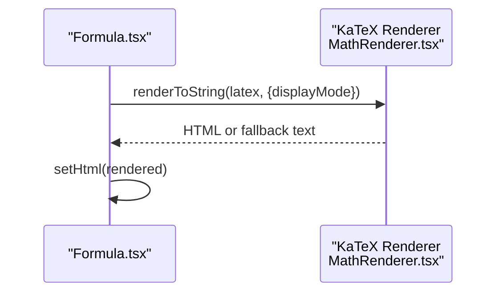

**Diagram sources**
- [Formula.tsx:42-54](file://frontend/src/components/ui/Formula.tsx#L42-L54)
- [MathRenderer.tsx:13-31](file://frontend/src/components/MathRenderer.tsx#L13-L31)

**Section sources**
- [Formula.tsx:1-54](file://frontend/src/components/ui/Formula.tsx#L1-L54)
- [MathRenderer.tsx:1-33](file://frontend/src/components/MathRenderer.tsx#L1-L33)

### Formula-to-Speech Conversion Rules
- TTS service orchestrates segmentation, complexity scoring, and SSML generation.
- Scientific TTS loads specialized models and processes formulas with contextual explanations.
- SSML builder converts LaTeX to speech-friendly tokens and applies prosody/pitch adjustments.

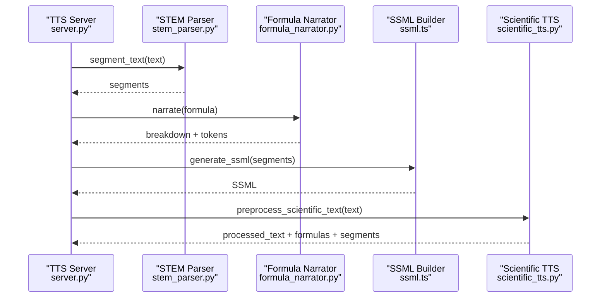

**Diagram sources**
- [server.py:80-132](file://services/tts/python/server.py#L80-L132)
- [stem_parser.py:110-132](file://services/tts/python/stem_parser.py#L110-L132)
- [formula_narrator.py:137-169](file://services/tts/python/formula_narrator.py#L137-L169)
- [ssml.ts:5-35](file://services/tts/node/src/ssml.ts#L5-L35)
- [scientific_tts.py:89-118](file://services/content/api/core/scientific_tts.py#L89-L118)

**Section sources**
- [server.py:80-132](file://services/tts/python/server.py#L80-L132)
- [ssml.ts:1-149](file://services/tts/node/src/ssml.ts#L1-L149)
- [scientific_tts.py:89-118](file://services/content/api/core/scientific_tts.py#L89-L118)

### Multilingual Formula Support
- Scientific TTS includes a multilingual model loader and scientific dictionary for pronunciation hints.
- SSML builder supports language attributes and numeric digit-to-word conversion.

**Section sources**
- [scientific_tts.py:12-31](file://services/content/api/core/scientific_tts.py#L12-L31)
- [ssml.ts:5-35](file://services/tts/node/src/ssml.ts#L5-L35)

### Backend Integration and Persistence
- Backend route calls TTS service for breakdown, optionally saves Formula and FormulaToken records, and returns tokens for interactive UI.

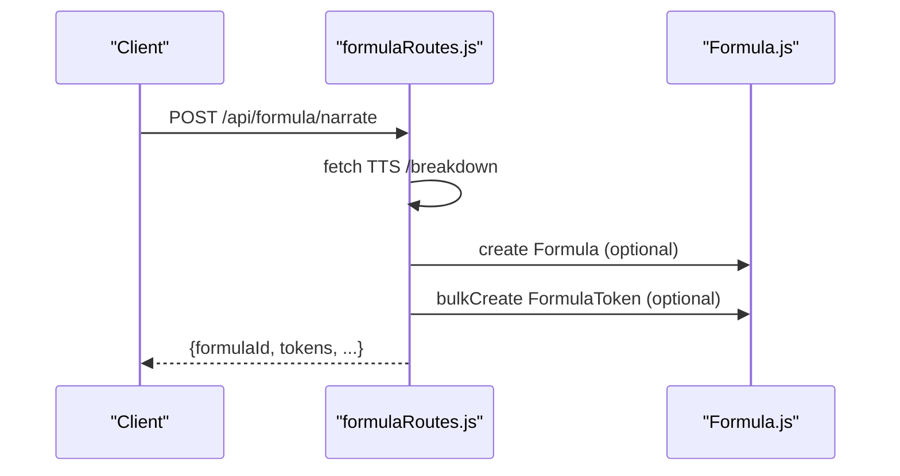

**Diagram sources**
- [formulaRoutes.js:14-65](file://backend/routes/formulaRoutes.js#L14-L65)
- [Formula.js:1-29](file://backend/models/Formula.js#L1-L29)

**Section sources**
- [formulaRoutes.js:14-65](file://backend/routes/formulaRoutes.js#L14-L65)
- [Formula.js:1-29](file://backend/models/Formula.js#L1-L29)

## Dependency Analysis
- Backend depends on TTS service for formula breakdown and optionally on Formula/FormulaToken models for persistence.
- TTS service depends on STEM Parser, Formula Narrator, and SSML builder.
- Scientific TTS depends on PyTorch models and SymPy for parsing.
- Frontend depends on KaTeX for rendering and interacts with backend for token data.

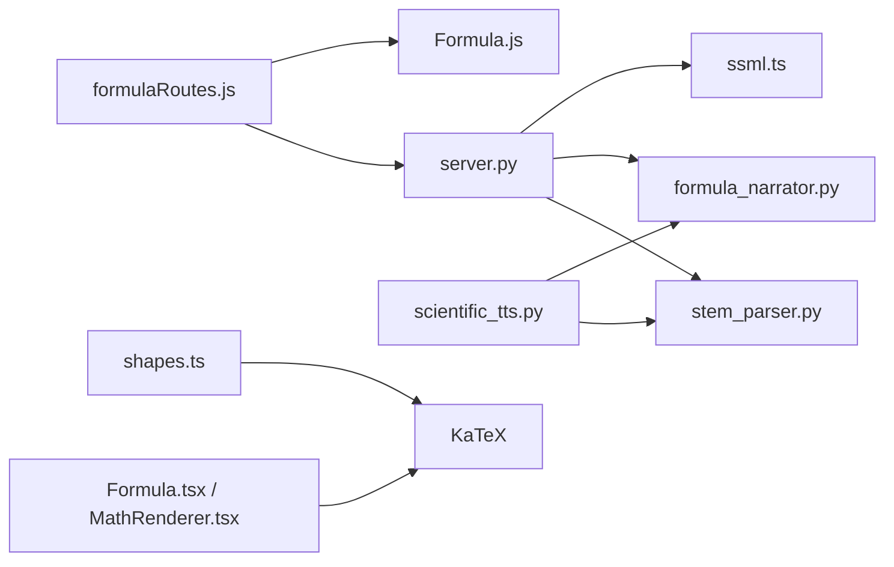

**Diagram sources**
- [formulaRoutes.js:1-86](file://backend/routes/formulaRoutes.js#L1-L86)
- [Formula.js:1-29](file://backend/models/Formula.js#L1-L29)
- [server.py:1-190](file://services/tts/python/server.py#L1-L190)
- [stem_parser.py:1-132](file://services/tts/python/stem_parser.py#L1-L132)
- [formula_narrator.py:1-326](file://services/tts/python/formula_narrator.py#L1-L326)
- [ssml.ts:1-149](file://services/tts/node/src/ssml.ts#L1-L149)
- [scientific_tts.py:1-407](file://services/content/api/core/scientific_tts.py#L1-L407)
- [Formula.tsx:1-54](file://frontend/src/components/ui/Formula.tsx#L1-L54)
- [MathRenderer.tsx:1-33](file://frontend/src/components/MathRenderer.tsx#L1-L33)
- [shapes.ts:1-33](file://services/video/service/src/shapes.ts#L1-L33)

**Section sources**
- [formulaRoutes.js:1-86](file://backend/routes/formulaRoutes.js#L1-L86)
- [Formula.js:1-29](file://backend/models/Formula.js#L1-L29)
- [server.py:1-190](file://services/tts/python/server.py#L1-L190)
- [scientific_tts.py:1-407](file://services/content/api/core/scientific_tts.py#L1-L407)

## Performance Considerations
- Complexity scoring caps growth to prevent runaway scores.
- TTS service caches synthesized audio keyed by text, voice, and speed to reduce latency.
- Frontend rendering falls back gracefully if KaTeX fails.
- Scientific TTS models are loaded once and reused; GPU acceleration is leveraged when available.

[No sources needed since this section provides general guidance]

## Troubleshooting Guide
Common issues and resolutions:
- Empty or missing formula input: Ensure the backend route receives a non-empty formula payload.
- LaTeX parsing errors: Verify LaTeX syntax; the parser cleans common constructs but may fail on malformed expressions.
- KaTeX rendering failures: The renderer falls back to plain text; check console logs for error messages.
- TTS synthesis errors: Confirm TTS service availability and cache connectivity; review rate-limiting and parameter validation.
- Chemistry detection false positives: Exclude non-chemical words and rely on digit/capitalization heuristics.

**Section sources**
- [formulaRoutes.js:18-20](file://backend/routes/formulaRoutes.js#L18-L20)
- [MathRenderer.tsx:23-26](file://frontend/src/components/MathRenderer.tsx#L23-L26)
- [server.py:143-150](file://services/tts/python/server.py#L143-L150)
- [server.py:56-58](file://services/tts/python/server.py#L56-L58)

## Conclusion
The system combines robust STEM text segmentation, formula parsing, and pronunciation mapping with flexible rendering and synthesis. It supports multilingual capabilities, interactive tokenization, and scalable caching for efficient delivery across backend and frontend.

[No sources needed since this section summarizes without analyzing specific files]

## Appendices

### Example Workflows
- Backend formula narration:
  - Client posts a formula with optional bookId and field.
  - Backend calls TTS service for breakdown and optionally persists tokens.
- Frontend formula rendering:
  - Component renders LaTeX via KaTeX and displays interactive tokens.
- Scientific synthesis:
  - Scientific TTS preprocesses text, replaces formulas with spoken equivalents, and synthesizes audio with explanations.

**Section sources**
- [formulaRoutes.js:14-65](file://backend/routes/formulaRoutes.js#L14-L65)
- [Formula.tsx:42-54](file://frontend/src/components/ui/Formula.tsx#L42-L54)
- [scientific_tts.py:269-297](file://services/content/api/core/scientific_tts.py#L269-L297)