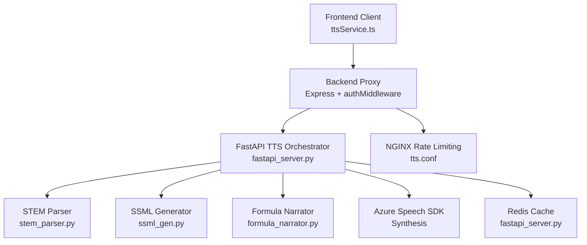
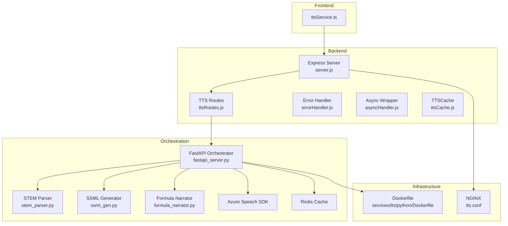
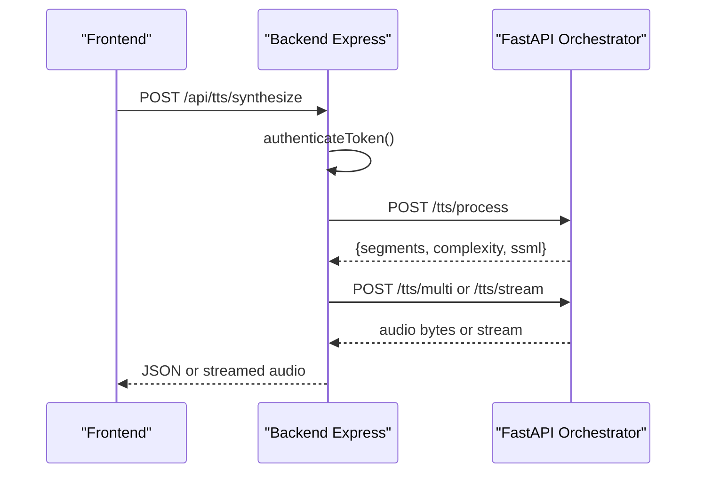
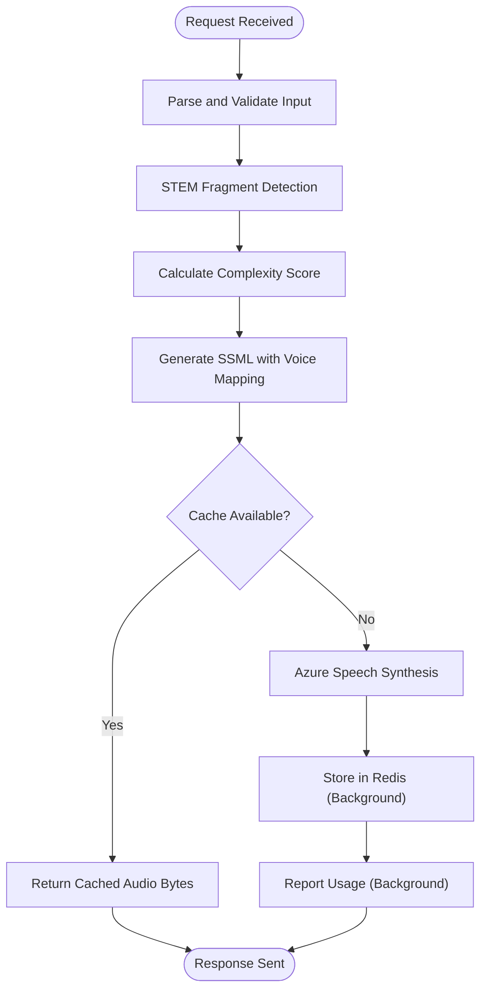
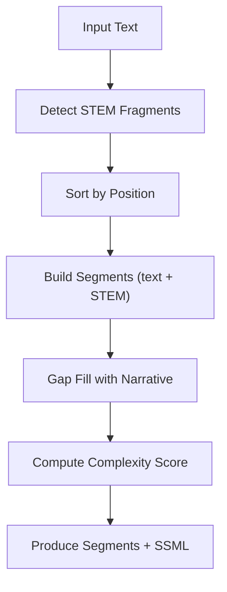
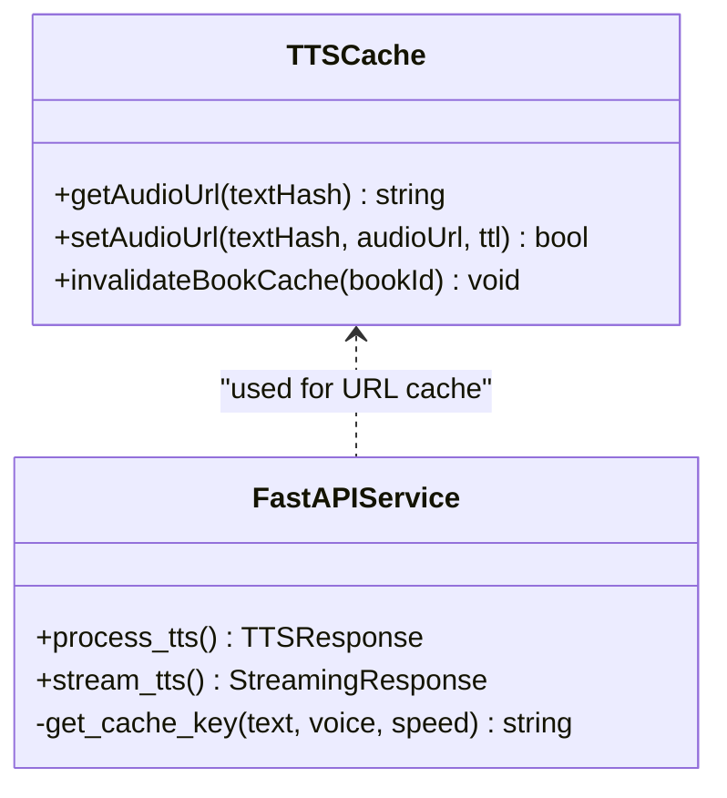
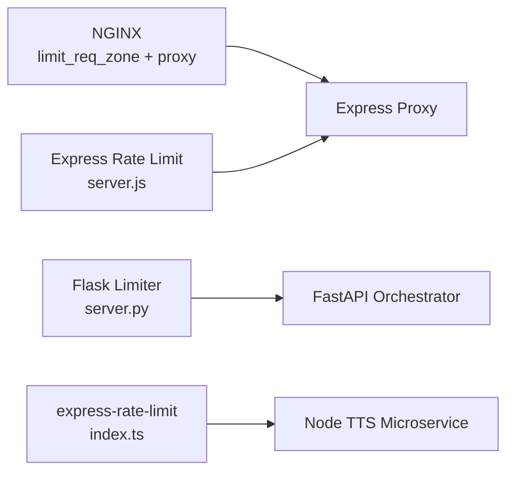
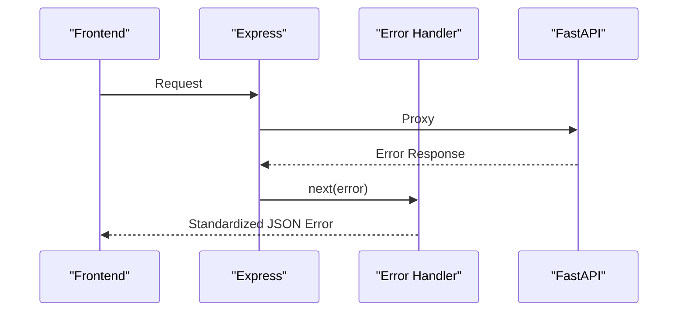
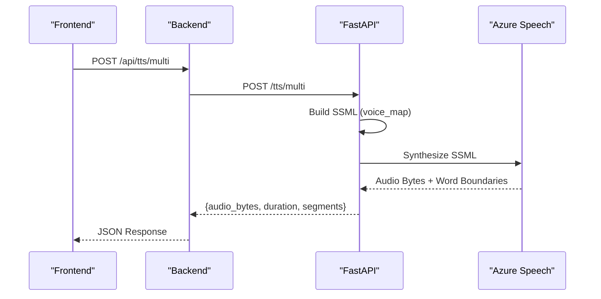
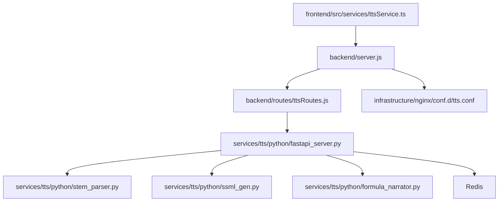

# TTS Architecture and Pipeline

<cite>
**Referenced Files in This Document**
- [server.js](file://backend/server.js)
- [ttsRoutes.js](file://backend/routes/ttsRoutes.js)
- [ttsCache.js](file://backend/utils/ttsCache.js)
- [ttsService.ts](file://frontend/src/services/ttsService.ts)
- [fastapi_server.py](file://services/tts/python/fastapi_server.py)
- [server.py](file://services/tts/python/server.py)
- [stem_parser.py](file://services/tts/python/stem_parser.py)
- [ssml_gen.py](file://services/tts/python/ssml_gen.py)
- [formula_narrator.py](file://services/tts/python/formula_narrator.py)
- [index.ts](file://services/tts/node/src/index.ts)
- [errorHandler.js](file://backend/middleware/errorHandler.js)
- [asyncHandler.js](file://backend/middleware/asyncHandler.js)
- [tts.conf](file://infrastructure/nginx/conf.d/tts.conf)
- [Dockerfile](file://services/tts/python/Dockerfile)
</cite>

## Table of Contents
1. [Introduction](#introduction)
2. [Project Structure](#project-structure)
3. [Core Components](#core-components)
4. [Architecture Overview](#architecture-overview)
5. [Detailed Component Analysis](#detailed-component-analysis)
6. [Dependency Analysis](#dependency-analysis)
7. [Performance Considerations](#performance-considerations)
8. [Troubleshooting Guide](#troubleshooting-guide)
9. [Conclusion](#conclusion)
10. [Appendices](#appendices)

## Introduction
This document describes the end-to-end Text-to-Speech (TTS) system architecture and processing pipeline used by the platform. It covers the Flask-based FastAPI orchestration service, the Express-based Node.js microservice, the backend proxy layer, text segmentation and SSML generation, caching and rate limiting, CORS and error handling, and the multi-voice orchestration workflow. It also includes configuration examples, performance optimization techniques, and troubleshooting guidance for common pipeline issues.

## Project Structure
The TTS system spans three primary layers:
- Frontend client service that orchestrates synthesis requests and manages fallbacks.
- Backend Express proxy that authenticates and forwards requests to the internal TTS service.
- Internal TTS orchestration service (FastAPI) that performs text segmentation, SSML generation, Azure Speech synthesis, caching, and streaming.

**Diagram sources**
- [ttsService.ts:1-381](file://frontend/src/services/ttsService.ts#L1-L381)
- [server.js:1-155](file://backend/server.js#L1-L155)
- [ttsRoutes.js:1-177](file://backend/routes/ttsRoutes.js#L1-L177)
- [fastapi_server.py:1-354](file://services/tts/python/fastapi_server.py#L1-L354)
- [stem_parser.py:1-132](file://services/tts/python/stem_parser.py#L1-L132)
- [ssml_gen.py:1-72](file://services/tts/python/ssml_gen.py#L1-L72)
- [formula_narrator.py:1-326](file://services/tts/python/formula_narrator.py#L1-L326)
- [tts.conf:1-59](file://infrastructure/nginx/conf.d/tts.conf#L1-L59)

**Section sources**
- [server.js:110-142](file://backend/server.js#L110-L142)
- [ttsRoutes.js:1-177](file://backend/routes/ttsRoutes.js#L1-L177)
- [fastapi_server.py:26-58](file://services/tts/python/fastapi_server.py#L26-L58)

## Core Components
- Backend proxy (Express): Authenticates users, validates requests, and proxies to the internal FastAPI service. It exposes endpoints for synthesis, multi-voice orchestration, streaming, formula breakdown, and voice lists.
- FastAPI orchestration service: Performs STEM text segmentation, SSML generation, Azure Speech synthesis, caching, streaming, and billing integration.
- Text segmentation and SSML generation: Detects STEM fragments (math, chemistry, physics), builds SSML with multi-voice orchestration, and adapts prosody for clarity.
- Caching: Redis-backed caching for synthesized audio with invalidation by book.
- Rate limiting and CORS: Configured at multiple layers (NGINX, FastAPI, Express) to protect resources and enable cross-origin access.
- Error handling: Centralized error handler with correlation IDs and Sentry tagging.

**Section sources**
- [ttsRoutes.js:14-176](file://backend/routes/ttsRoutes.js#L14-L176)
- [fastapi_server.py:187-326](file://services/tts/python/fastapi_server.py#L187-L326)
- [stem_parser.py:28-131](file://services/tts/python/stem_parser.py#L28-L131)
- [ssml_gen.py:26-71](file://services/tts/python/ssml_gen.py#L26-L71)
- [ttsCache.js:1-59](file://backend/utils/ttsCache.js#L1-L59)
- [errorHandler.js:1-44](file://backend/middleware/errorHandler.js#L1-L44)

## Architecture Overview
The system integrates the frontend, backend proxy, and internal orchestration service with NGINX for rate limiting and upstream routing.

**Diagram sources**
- [server.js:18-155](file://backend/server.js#L18-L155)
- [ttsRoutes.js:1-177](file://backend/routes/ttsRoutes.js#L1-L177)
- [fastapi_server.py:26-58](file://services/tts/python/fastapi_server.py#L26-L58)
- [stem_parser.py:4-27](file://services/tts/python/stem_parser.py#L4-L27)
- [ssml_gen.py:5-21](file://services/tts/python/ssml_gen.py#L5-L21)
- [formula_narrator.py:5-11](file://services/tts/python/formula_narrator.py#L5-L11)
- [tts.conf:1-59](file://infrastructure/nginx/conf.d/tts.conf#L1-L59)
- [Dockerfile:1-26](file://services/tts/python/Dockerfile#L1-L26)

## Detailed Component Analysis

### Backend Proxy Layer (Express)
Responsibilities:
- Authentication and request validation.
- Proxying to internal FastAPI endpoints for synthesis, multi-voice orchestration, streaming, formula breakdown, and voice lists.
- Returning standardized JSON responses and error handling.

Key behaviors:
- Authentication enforced via middleware.
- Validation for text length and payload shape.
- Forwarding to internal TTS service with normalized parameters.
- Streaming endpoints pipe raw audio streams to clients.

**Diagram sources**
- [ttsRoutes.js:14-108](file://backend/routes/ttsRoutes.js#L14-L108)
- [fastapi_server.py:253-320](file://services/tts/python/fastapi_server.py#L253-L320)

**Section sources**
- [ttsRoutes.js:14-176](file://backend/routes/ttsRoutes.js#L14-L176)
- [server.js:18-56](file://backend/server.js#L18-L56)

### FastAPI Orchestration Service
Responsibilities:
- Text segmentation using STEM parser.
- SSML generation with multi-voice orchestration.
- Azure Speech synthesis with streaming and word boundary events.
- Redis caching for synthesized audio.
- Billing hook via background tasks.
- Formula breakdown and interactive symbol narration.

Processing logic highlights:
- Segment detection and gap filling for narrative continuity.
- Complexity scoring for billing and throttling hints.
- SSML voice mapping for narrative, formula, dialogue, and step content.
- Streaming endpoint for long-form content to reduce latency.

**Diagram sources**
- [fastapi_server.py:253-320](file://services/tts/python/fastapi_server.py#L253-L320)
- [stem_parser.py:28-108](file://services/tts/python/stem_parser.py#L28-L108)
- [ssml_gen.py:26-71](file://services/tts/python/ssml_gen.py#L26-L71)

**Section sources**
- [fastapi_server.py:187-326](file://services/tts/python/fastapi_server.py#L187-L326)
- [stem_parser.py:28-131](file://services/tts/python/stem_parser.py#L28-L131)
- [ssml_gen.py:26-71](file://services/tts/python/ssml_gen.py#L26-L71)
- [formula_narrator.py:137-169](file://services/tts/python/formula_narrator.py#L137-L169)

### Text Segmentation Pipeline and Complexity Calculation
- STEM detection identifies math, chemistry, physics, dialogue, and tutorial steps.
- Gap filling ensures seamless transitions between segments.
- Complexity scoring is used for billing estimates and resource planning.

**Diagram sources**
- [stem_parser.py:28-131](file://services/tts/python/stem_parser.py#L28-L131)
- [fastapi_server.py:171-180](file://services/tts/python/fastapi_server.py#L171-L180)

**Section sources**
- [stem_parser.py:28-131](file://services/tts/python/stem_parser.py#L28-L131)
- [fastapi_server.py:171-180](file://services/tts/python/fastapi_server.py#L171-L180)

### Caching Mechanisms (Redis)
- Backend URL caching keyed by text hash for synthesized audio URLs.
- FastAPI audio bytes caching keyed by SSML fingerprint with TTL.
- Cache invalidation by book ID to refresh content after edits.

**Diagram sources**
- [ttsCache.js:3-56](file://backend/utils/ttsCache.js#L3-L56)
- [fastapi_server.py:95-97](file://services/tts/python/fastapi_server.py#L95-L97)
- [fastapi_server.py:289-301](file://services/tts/python/fastapi_server.py#L289-L301)

**Section sources**
- [ttsCache.js:1-59](file://backend/utils/ttsCache.js#L1-L59)
- [fastapi_server.py:43-58](file://services/tts/python/fastapi_server.py#L43-L58)
- [fastapi_server.py:289-301](file://services/tts/python/fastapi_server.py#L289-L301)

### Rate Limiting and CORS
- NGINX: Zone-based rate limiting for TTS endpoints with burst handling and keepalive tuning.
- FastAPI: Built-in rate limiting via Flask-Limiter with memory storage.
- Express: Global rate limiting and CORS hardening for the backend proxy.
- Node microservice: Zod-based validation and rate limiting for direct synthesis.

**Diagram sources**
- [tts.conf:4-32](file://infrastructure/nginx/conf.d/tts.conf#L4-L32)
- [server.py:24-30](file://services/tts/python/server.py#L24-L30)
- [server.js:49-55](file://backend/server.js#L49-L55)
- [index.ts:22-28](file://services/tts/node/src/index.ts#L22-L28)

**Section sources**
- [tts.conf:4-32](file://infrastructure/nginx/conf.d/tts.conf#L4-L32)
- [server.py:24-30](file://services/tts/python/server.py#L24-L30)
- [server.js:22-28](file://backend/server.js#L22-L28)
- [index.ts:22-28](file://services/tts/node/src/index.ts#L22-L28)

### Error Handling Strategies
- Centralized Express error handler attaches correlation IDs and Sentry tags.
- Async wrapper ensures uncaught exceptions are forwarded to Express error middleware.
- Frontend service includes abort handling and browser fallback to native speech synthesis.

**Diagram sources**
- [errorHandler.js:5-41](file://backend/middleware/errorHandler.js#L5-L41)
- [asyncHandler.js:4-8](file://backend/middleware/asyncHandler.js#L4-L8)
- [ttsService.ts:211-245](file://frontend/src/services/ttsService.ts#L211-L245)

**Section sources**
- [errorHandler.js:1-44](file://backend/middleware/errorHandler.js#L1-L44)
- [asyncHandler.js:1-9](file://backend/middleware/asyncHandler.js#L1-L9)
- [ttsService.ts:211-245](file://frontend/src/services/ttsService.ts#L211-L245)

### Multi-Voice Orchestration and Segment Processing Workflow
- Multi-voice orchestration combines narrator, tutor, and character voices with adaptive prosody.
- Formula narration converts LaTeX/MathML into spoken text with scientific rules.
- Streaming synthesis reduces initial latency for long content.

**Diagram sources**
- [ttsRoutes.js:53-76](file://backend/routes/ttsRoutes.js#L53-L76)
- [fastapi_server.py:196-225](file://services/tts/python/fastapi_server.py#L196-L225)
- [ssml_gen.py:26-71](file://services/tts/python/ssml_gen.py#L26-L71)

**Section sources**
- [ttsRoutes.js:53-76](file://backend/routes/ttsRoutes.js#L53-L76)
- [fastapi_server.py:196-225](file://services/tts/python/fastapi_server.py#L196-L225)
- [ssml_gen.py:26-71](file://services/tts/python/ssml_gen.py#L26-L71)

## Dependency Analysis
- Frontend depends on the backend proxy for TTS endpoints.
- Backend proxy depends on the internal FastAPI service.
- FastAPI orchestrator depends on STEM parser, SSML generator, formula narrator, Azure Speech SDK, and Redis.
- NGINX sits in front of the backend to enforce rate limits and proxy traffic.

**Diagram sources**
- [ttsService.ts:1-381](file://frontend/src/services/ttsService.ts#L1-L381)
- [server.js:110-142](file://backend/server.js#L110-L142)
- [ttsRoutes.js:1-177](file://backend/routes/ttsRoutes.js#L1-L177)
- [fastapi_server.py:1-354](file://services/tts/python/fastapi_server.py#L1-L354)
- [stem_parser.py:1-132](file://services/tts/python/stem_parser.py#L1-L132)
- [ssml_gen.py:1-72](file://services/tts/python/ssml_gen.py#L1-L72)
- [formula_narrator.py:1-326](file://services/tts/python/formula_narrator.py#L1-L326)
- [tts.conf:1-59](file://infrastructure/nginx/conf.d/tts.conf#L1-L59)

**Section sources**
- [server.js:110-142](file://backend/server.js#L110-L142)
- [ttsRoutes.js:1-177](file://backend/routes/ttsRoutes.js#L1-L177)
- [fastapi_server.py:1-354](file://services/tts/python/fastapi_server.py#L1-L354)

## Performance Considerations
- Streaming synthesis: Prefer streaming for long-form content to minimize initial latency.
- Caching: Use Redis to cache synthesized audio bytes and invalidate per-book when content changes.
- Rate limiting: Tune NGINX zones and FastAPI/Express limits to balance throughput and abuse protection.
- Concurrency: Frontend batching and chunking reduce load and improve UX.
- Keepalive: Configure NGINX keepalive upstreams to reduce connection overhead.
- Output format: Optimize audio format and bitrate for target devices and bandwidth.

[No sources needed since this section provides general guidance]

## Troubleshooting Guide
Common issues and resolutions:
- Authentication failures: Verify JWT secret and token presence in requests.
- Redis connectivity: Confirm host/port/password/db and ping success; fallback gracefully when unavailable.
- Azure credentials: Ensure subscription key and region are set; otherwise synthesis will fail.
- Text validation errors: Respect backend limits (e.g., 5000 characters) and payload shape.
- CORS errors: Confirm allowed origins and credentials in backend and NGINX configurations.
- Streaming timeouts: Increase proxy timeouts for long synthesis sessions.
- Cache misses: Verify cache key generation and TTL; confirm Redis availability.

**Section sources**
- [server.py:40-58](file://services/tts/python/server.py#L40-L58)
- [fastapi_server.py:60-63](file://services/tts/python/fastapi_server.py#L60-L63)
- [fastapi_server.py:100-102](file://services/tts/python/fastapi_server.py#L100-L102)
- [ttsRoutes.js:19-22](file://backend/routes/ttsRoutes.js#L19-L22)
- [tts.conf:28-32](file://infrastructure/nginx/conf.d/tts.conf#L28-L32)

## Conclusion
The TTS system integrates a robust backend proxy, a FastAPI orchestration service with advanced text segmentation and SSML generation, and multi-layer rate limiting and caching. The architecture supports multi-voice orchestration, streaming synthesis, and formula narration, while providing strong error handling and operational resilience.

[No sources needed since this section summarizes without analyzing specific files]

## Appendices

### Configuration Examples
- Environment variables for the FastAPI service:
  - FRONTEND_URL: Origin for CORS.
  - REDIS_HOST, REDIS_PORT, REDIS_PASSWORD, REDIS_DB: Redis connection.
  - AZURE_SPEECH_KEY, AZURE_SPEECH_REGION: Azure Speech credentials.
  - PAYGO_SERVICE_URL: Billing service endpoint.
- NGINX rate limiting zones and upstreams:
  - limit_req_zone for TTS endpoints.
  - upstream blocks for backend and internal TTS service.
- Dockerfile for the FastAPI service:
  - Base image, system dependencies, Python packages, exposed port, and CMD.

**Section sources**
- [fastapi_server.py:28-58](file://services/tts/python/fastapi_server.py#L28-L58)
- [server.py:40-54](file://services/tts/python/server.py#L40-L54)
- [tts.conf:4-16](file://infrastructure/nginx/conf.d/tts.conf#L4-L16)
- [Dockerfile:1-26](file://services/tts/python/Dockerfile#L1-L26)