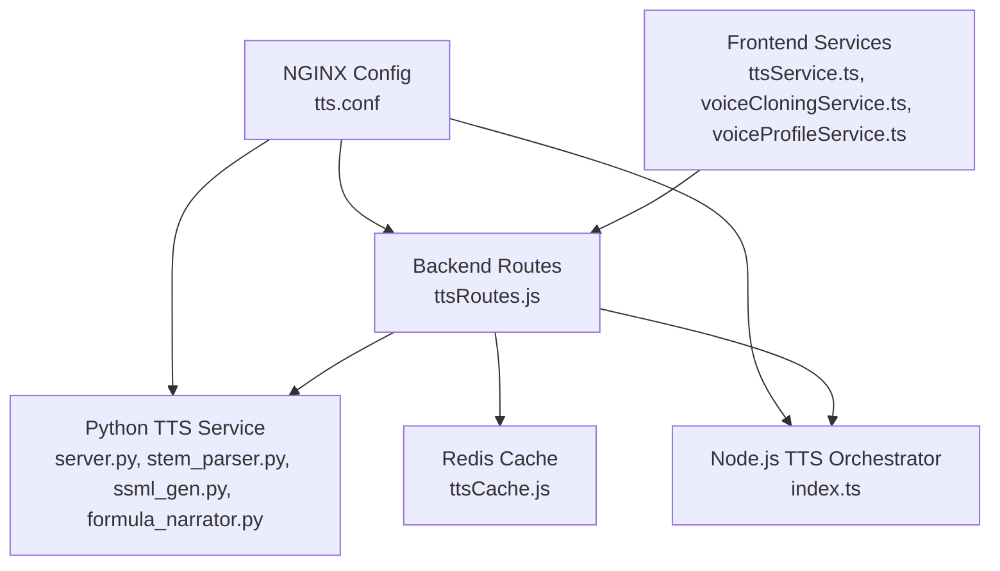
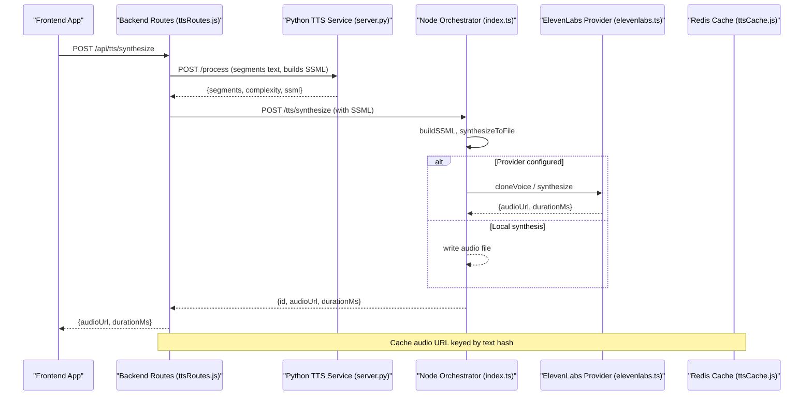
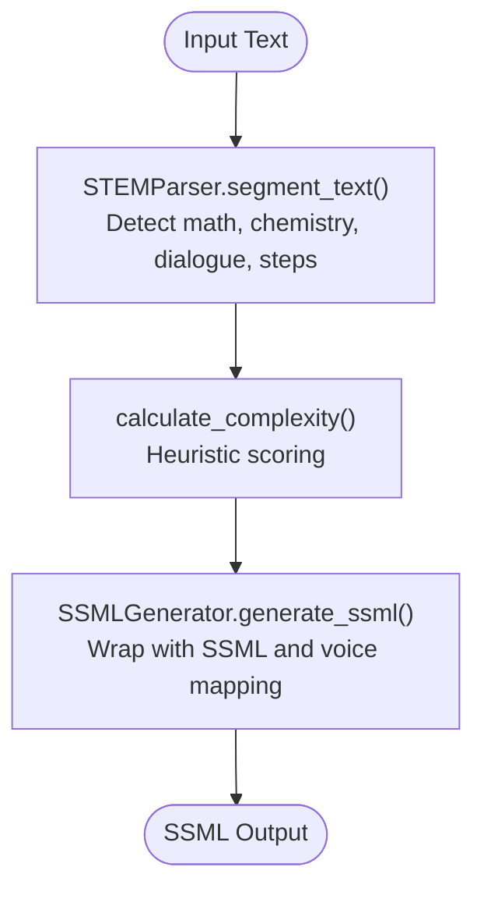
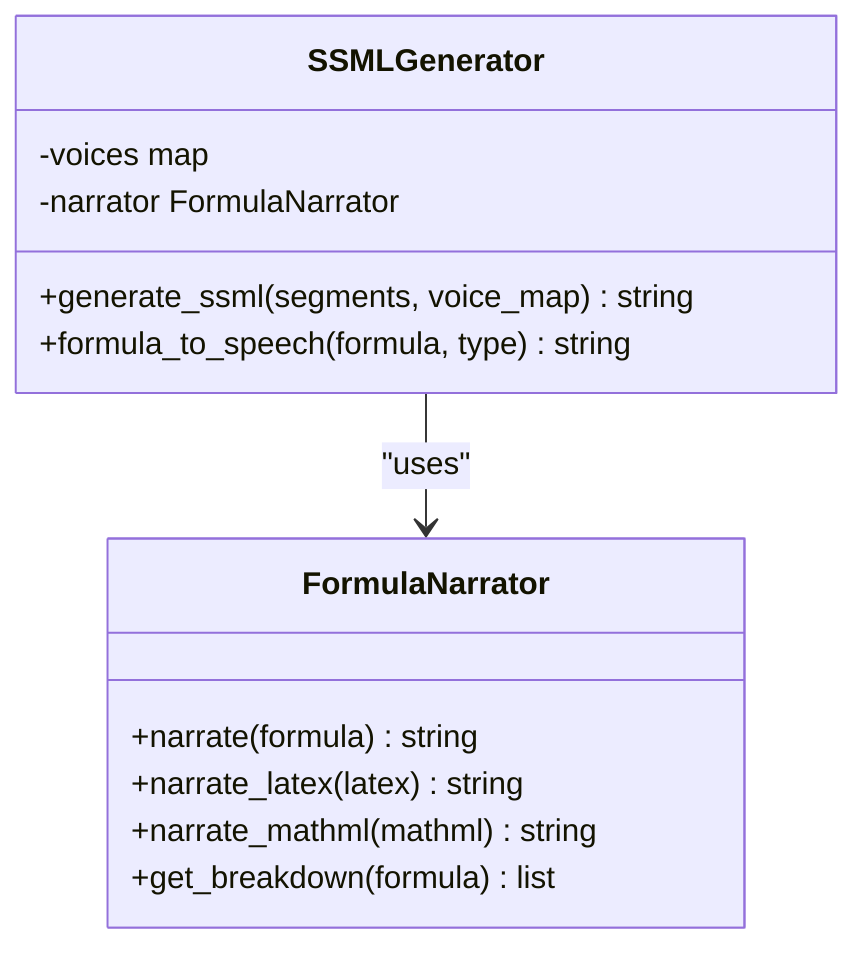
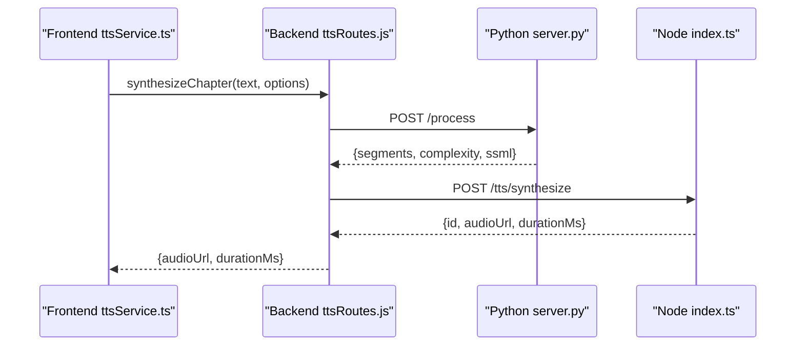
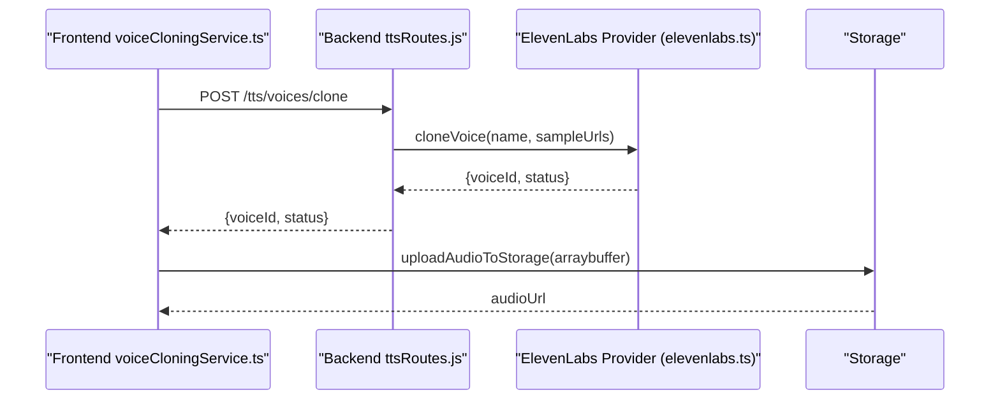
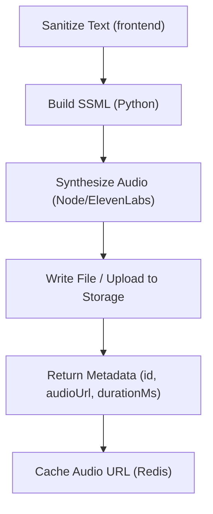
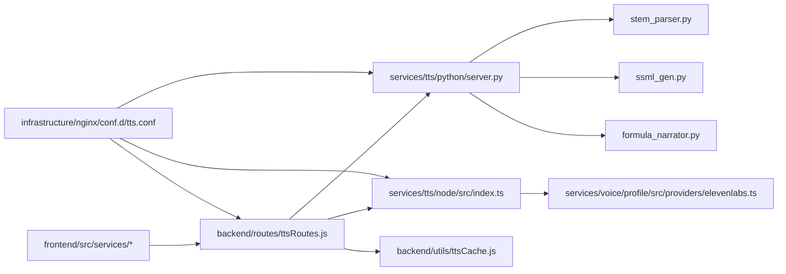

# Text-to-Speech System

<cite>
**Referenced Files in This Document**
- [index.ts](file://services/tts/node/src/index.ts)
- [server.py](file://services/tts/python/server.py)
- [ttsRoutes.js](file://backend/routes/ttsRoutes.js)
- [ttsService.ts](file://frontend/src/services/ttsService.ts)
- [voiceCloningService.ts](file://frontend/src/services/voiceCloningService.ts)
- [voiceProfileService.ts](file://frontend/src/services/voiceProfileService.ts)
- [stem_parser.py](file://services/tts/python/stem_parser.py)
- [ssml_gen.py](file://services/tts/python/ssml_gen.py)
- [formula_narrator.py](file://services/tts/python/formula_narrator.py)
- [elevenlabs.ts](file://services/voice/profile/src/providers/elevenlabs.ts)
- [ttsCache.js](file://backend/utils/ttsCache.js)
- [tts.conf](file://infrastructure/nginx/conf.d/tts.conf)
</cite>

## Table of Contents
1. [Introduction](#introduction)
2. [Project Structure](#project-structure)
3. [Core Components](#core-components)
4. [Architecture Overview](#architecture-overview)
5. [Detailed Component Analysis](#detailed-component-analysis)
6. [Dependency Analysis](#dependency-analysis)
7. [Performance Considerations](#performance-considerations)
8. [Troubleshooting Guide](#troubleshooting-guide)
9. [Conclusion](#conclusion)
10. [Appendices](#appendices)

## Introduction
This document describes the text-to-speech (TTS) system architecture and implementation for a STEM-focused educational platform. It covers the STEM-aware formula recognition and processing pipeline, SSML generation, voice synthesis workflows, integration with external voice providers (ElevenLabs), voice cloning capabilities, personalized narrator profiles, audio processing and caching, quality optimization, and multi-language support. It also provides implementation examples, configuration options, and troubleshooting guidance for common TTS issues.

## Project Structure
The TTS system spans three primary layers:
- Frontend services for synthesis orchestration, voice selection, and user interactions
- Backend routes that proxy requests to the internal TTS service
- Internal TTS service implemented in Python (FastAPI) with STEM parsing, SSML generation, and mock synthesis
- Node.js microservice for synthesis orchestration and file I/O
- Infrastructure configuration for rate limiting and proxying

**Diagram sources**
- [ttsService.ts:1-381](file://frontend/src/services/ttsService.ts#L1-L381)
- [voiceCloningService.ts:1-260](file://frontend/src/services/voiceCloningService.ts#L1-L260)
- [voiceProfileService.ts:1-261](file://frontend/src/services/voiceProfileService.ts#L1-L261)
- [ttsRoutes.js:1-177](file://backend/routes/ttsRoutes.js#L1-L177)
- [server.py:1-190](file://services/tts/python/server.py#L1-L190)
- [index.ts:1-98](file://services/tts/node/src/index.ts#L1-L98)
- [tts.conf:1-59](file://infrastructure/nginx/conf.d/tts.conf#L1-L59)
- [ttsCache.js:1-59](file://backend/utils/ttsCache.js#L1-L59)

**Section sources**
- [ttsService.ts:1-381](file://frontend/src/services/ttsService.ts#L1-L381)
- [ttsRoutes.js:1-177](file://backend/routes/ttsRoutes.js#L1-L177)
- [server.py:1-190](file://services/tts/python/server.py#L1-L190)
- [index.ts:1-98](file://services/tts/node/src/index.ts#L1-L98)
- [tts.conf:1-59](file://infrastructure/nginx/conf.d/tts.conf#L1-L59)
- [ttsCache.js:1-59](file://backend/utils/ttsCache.js#L1-L59)

## Core Components
- Frontend TTS orchestration and user-facing voice controls
- Backend route proxy for secure request forwarding
- Python-based STEM-aware text segmentation, SSML generation, and mock synthesis
- Node.js microservice for synthesis orchestration, file I/O, and voice discovery
- Voice provider integration (ElevenLabs) for cloning and synthesis
- Caching layer for synthesized audio URLs
- NGINX-based rate limiting and proxying

**Section sources**
- [ttsService.ts:1-381](file://frontend/src/services/ttsService.ts#L1-L381)
- [ttsRoutes.js:1-177](file://backend/routes/ttsRoutes.js#L1-L177)
- [server.py:1-190](file://services/tts/python/server.py#L1-L190)
- [index.ts:1-98](file://services/tts/node/src/index.ts#L1-L98)
- [elevenlabs.ts:1-79](file://services/voice/profile/src/providers/elevenlabs.ts#L1-L79)
- [ttsCache.js:1-59](file://backend/utils/ttsCache.js#L1-L59)

## Architecture Overview
The system integrates frontend, backend, and internal services with NGINX for traffic management and Redis for caching. The frontend orchestrates synthesis requests, selects voices, and falls back to browser TTS when needed. The backend proxies requests to the internal Python FastAPI service, which performs STEM-aware segmentation and SSML generation. The Node.js service handles synthesis orchestration and file I/O. ElevenLabs integration supports voice cloning and synthesis.

**Diagram sources**
- [ttsRoutes.js:14-51](file://backend/routes/ttsRoutes.js#L14-L51)
- [server.py:80-104](file://services/tts/python/server.py#L80-L104)
- [index.ts:45-85](file://services/tts/node/src/index.ts#L45-L85)
- [elevenlabs.ts:12-77](file://services/voice/profile/src/providers/elevenlabs.ts#L12-L77)
- [ttsCache.js:20-41](file://backend/utils/ttsCache.js#L20-L41)

## Detailed Component Analysis

### STEM-aware Formula Recognition and Processing Pipeline
The Python service segments raw text into typed segments (text, math, chemistry, dialogue, step). It computes a complexity heuristic for STEM content and generates SSML with multi-voice support.

**Diagram sources**
- [stem_parser.py:110-131](file://services/tts/python/stem_parser.py#L110-L131)
- [server.py:65-78](file://services/tts/python/server.py#L65-L78)
- [ssml_gen.py:26-71](file://services/tts/python/ssml_gen.py#L26-L71)

**Section sources**
- [stem_parser.py:1-132](file://services/tts/python/stem_parser.py#L1-L132)
- [ssml_gen.py:1-72](file://services/tts/python/ssml_gen.py#L1-L72)
- [server.py:60-104](file://services/tts/python/server.py#L60-L104)

### SSML Generation and Voice Mapping
SSML is generated per segment type with adaptive prosody and voice assignment. Mathematical and chemistry content receives slower rates and emphasis. Dialogue and tutorial steps receive distinct prosody and voice mappings.

**Diagram sources**
- [ssml_gen.py:5-71](file://services/tts/python/ssml_gen.py#L5-L71)
- [formula_narrator.py:5-326](file://services/tts/python/formula_narrator.py#L5-L326)

**Section sources**
- [ssml_gen.py:1-72](file://services/tts/python/ssml_gen.py#L1-L72)
- [formula_narrator.py:1-326](file://services/tts/python/formula_narrator.py#L1-L326)

### Voice Synthesis Workflows
The backend routes proxy synthesis requests to the internal Python service, which returns segments and SSML. The Node.js service orchestrates synthesis, writes audio files, and returns metadata. The frontend orchestrates synthesis, handles fallbacks, and manages long texts via chunking.

**Diagram sources**
- [ttsService.ts:46-80](file://frontend/src/services/ttsService.ts#L46-L80)
- [ttsRoutes.js:14-51](file://backend/routes/ttsRoutes.js#L14-L51)
- [server.py:80-104](file://services/tts/python/server.py#L80-L104)
- [index.ts:45-85](file://services/tts/node/src/index.ts#L45-L85)

**Section sources**
- [ttsService.ts:1-381](file://frontend/src/services/ttsService.ts#L1-L381)
- [ttsRoutes.js:1-177](file://backend/routes/ttsRoutes.js#L1-L177)
- [index.ts:1-98](file://services/tts/node/src/index.ts#L1-L98)

### Voice Cloning and Personalized Narrator Profiles
The frontend provides voice cloning and profile management services. Voice cloning uploads audio samples and interacts with ElevenLabs via a provider abstraction. Profile services manage voice preferences and ratings.

**Diagram sources**
- [voiceCloningService.ts:1-260](file://frontend/src/services/voiceCloningService.ts#L1-L260)
- [ttsRoutes.js:1-177](file://backend/routes/ttsRoutes.js#L1-L177)
- [elevenlabs.ts:12-77](file://services/voice/profile/src/providers/elevenlabs.ts#L12-L77)

**Section sources**
- [voiceCloningService.ts:1-260](file://frontend/src/services/voiceCloningService.ts#L1-L260)
- [elevenlabs.ts:1-79](file://services/voice/profile/src/providers/elevenlabs.ts#L1-L79)
- [voiceProfileService.ts:1-261](file://frontend/src/services/voiceProfileService.ts#L1-L261)

### Audio Processing Pipeline and Quality Optimization
The Node.js service constructs SSML, synthesizes audio, writes files, and exposes metadata. The Python service includes a mock synthesis path with caching. The frontend supports chunking long texts and browser fallback synthesis.

**Diagram sources**
- [ttsService.ts:85-90](file://frontend/src/services/ttsService.ts#L85-L90)
- [ssml_gen.py:26-71](file://services/tts/python/ssml_gen.py#L26-L71)
- [index.ts:51-73](file://services/tts/node/src/index.ts#L51-L73)
- [server.py:167-180](file://services/tts/python/server.py#L167-L180)
- [ttsCache.js:20-41](file://backend/utils/ttsCache.js#L20-L41)

**Section sources**
- [index.ts:1-98](file://services/tts/node/src/index.ts#L1-L98)
- [server.py:134-185](file://services/tts/python/server.py#L134-L185)
- [ttsCache.js:1-59](file://backend/utils/ttsCache.js#L1-L59)

### Multi-language Support
The system defines allowed languages and validates inputs. The Python service defaults to English for voice lists, while the Node.js service accepts language parameters and passes them to downstream components.

**Section sources**
- [index.ts:30-43](file://services/tts/node/src/index.ts#L30-L43)
- [index.ts:87-94](file://services/tts/node/src/index.ts#L87-L94)

## Dependency Analysis
The system exhibits layered dependencies: frontend depends on backend routes, backend depends on internal services, and internal services depend on Python modules and external providers. NGINX mediates traffic and enforces rate limits.

**Diagram sources**
- [ttsService.ts:1-381](file://frontend/src/services/ttsService.ts#L1-L381)
- [ttsRoutes.js:1-177](file://backend/routes/ttsRoutes.js#L1-L177)
- [server.py:1-190](file://services/tts/python/server.py#L1-L190)
- [index.ts:1-98](file://services/tts/node/src/index.ts#L1-L98)
- [stem_parser.py:1-132](file://services/tts/python/stem_parser.py#L1-L132)
- [ssml_gen.py:1-72](file://services/tts/python/ssml_gen.py#L1-L72)
- [formula_narrator.py:1-326](file://services/tts/python/formula_narrator.py#L1-L326)
- [elevenlabs.ts:1-79](file://services/voice/profile/src/providers/elevenlabs.ts#L1-L79)
- [ttsCache.js:1-59](file://backend/utils/ttsCache.js#L1-L59)
- [tts.conf:1-59](file://infrastructure/nginx/conf.d/tts.conf#L1-L59)

**Section sources**
- [ttsRoutes.js:1-177](file://backend/routes/ttsRoutes.js#L1-L177)
- [server.py:1-190](file://services/tts/python/server.py#L1-L190)
- [index.ts:1-98](file://services/tts/node/src/index.ts#L1-L98)
- [tts.conf:1-59](file://infrastructure/nginx/conf.d/tts.conf#L1-L59)

## Performance Considerations
- Rate limiting: NGINX zones limit requests to the TTS endpoints to control load.
- Caching: Redis caches synthesized audio URLs keyed by text hashes to reduce repeated synthesis.
- Concurrency: Frontend batching and chunking minimize latency for long texts.
- Complexity-aware synthesis: The Python service estimates complexity to adjust synthesis behavior.
- Streaming: Backend routes support streaming synthesis for immediate playback.

[No sources needed since this section provides general guidance]

## Troubleshooting Guide
Common issues and resolutions:
- Validation errors: Ensure text length is within limits and parameters are within accepted ranges.
- Proxy failures: Verify backend route proxy configuration and service availability.
- Cache failures: Confirm Redis connectivity and keyspace permissions.
- Provider errors: Check API keys and provider quotas; ElevenLabs requires multipart form uploads for cloning.
- Browser fallback: If network or server fails, the frontend attempts browser speech synthesis.

**Section sources**
- [index.ts:30-43](file://services/tts/node/src/index.ts#L30-L43)
- [ttsRoutes.js:14-51](file://backend/routes/ttsRoutes.js#L14-L51)
- [ttsCache.js:12-15](file://backend/utils/ttsCache.js#L12-L15)
- [elevenlabs.ts:12-46](file://services/voice/profile/src/providers/elevenlabs.ts#L12-L46)
- [ttsService.ts:212-245](file://frontend/src/services/ttsService.ts#L212-L245)

## Conclusion
The TTS system combines STEM-aware text processing, SSML generation, and flexible voice synthesis with robust caching and proxying. It supports voice cloning via ElevenLabs, personalized voice profiles, and multi-language synthesis. The architecture balances performance and reliability through NGINX rate limiting, Redis caching, and frontend fallback mechanisms.

[No sources needed since this section summarizes without analyzing specific files]

## Appendices

### Implementation Examples
- Frontend synthesis: Call the synthesis service with sanitized text and optional voice parameters.
- Multi-chunk synthesis: Use chunking to handle long texts and aggregate durations.
- Voice cloning: Upload audio samples and retrieve generated voice identifiers.
- Voice profiles: Fetch available profiles, update user preferences, and rate profiles.

**Section sources**
- [ttsService.ts:46-80](file://frontend/src/services/ttsService.ts#L46-L80)
- [ttsService.ts:289-318](file://frontend/src/services/ttsService.ts#L289-L318)
- [voiceCloningService.ts:7-39](file://frontend/src/services/voiceCloningService.ts#L7-L39)
- [voiceProfileService.ts:5-21](file://frontend/src/services/voiceProfileService.ts#L5-L21)

### Configuration Options
- Environment variables:
  - FRONTEND_URL: Controls CORS origin for the Node.js service.
  - MEDIA_DIR: Directory for writing synthesized audio files.
  - TTS_SERVICE_URL: Backend proxy target for internal TTS service.
  - REDIS_HOST, REDIS_PORT, REDIS_PASSWORD, REDIS_DB: Redis connection settings.
  - JWT_SECRET: Secret for token verification in GET streaming endpoint.
  - VITE_API_URL: Base URL for voice cloning and profile services.
  - NGINX rate limits: Configure per location blocks for synthesis, formula, and interaction endpoints.

**Section sources**
- [index.ts:14-19](file://services/tts/node/src/index.ts#L14-L19)
- [index.ts:54-61](file://services/tts/node/src/index.ts#L54-L61)
- [ttsRoutes.js:11-11](file://backend/routes/ttsRoutes.js#L11-L11)
- [ttsRoutes.js:115-118](file://backend/routes/ttsRoutes.js#L115-L118)
- [tts.conf:4-51](file://infrastructure/nginx/conf.d/tts.conf#L4-L51)