# Voice Cloning and Management

<cite>
**Referenced Files in This Document**
- [VoiceProfile.js](file://backend/models/VoiceProfile.js)
- [voiceCloningService.ts](file://frontend/src/services/voiceCloningService.ts)
- [voiceProfileService.ts](file://frontend/src/services/voiceProfileService.ts)
- [VoiceCloning.tsx](file://frontend/src/components/VoiceCloning.tsx)
- [VoiceProfileSelector.tsx](file://frontend/src/components/VoiceProfileSelector.tsx)
- [ttsService.ts](file://frontend/src/services/ttsService.ts)
- [storage.ts](file://services/voice/profile/src/storage.ts)
- [index.ts](file://services/voice/profile/src/index.ts)
</cite>

## Table of Contents
1. [Introduction](#introduction)
2. [Project Structure](#project-structure)
3. [Core Components](#core-components)
4. [Architecture Overview](#architecture-overview)
5. [Detailed Component Analysis](#detailed-component-analysis)
6. [Dependency Analysis](#dependency-analysis)
7. [Performance Considerations](#performance-considerations)
8. [Troubleshooting Guide](#troubleshooting-guide)
9. [Conclusion](#conclusion)

## Introduction
This document describes the voice cloning and management system, covering voice profile creation, audio sample collection, training orchestration, ElevenLabs API integration, voice quality assessment, profile storage, voice switching, personalized narrator settings, and the frontend voice selection interface. It also documents voice comparison tools, user voice management features, implementation patterns, and troubleshooting guidance for voice cloning issues.

## Project Structure
The voice cloning and management system spans three primary areas:
- Frontend services and UI components for voice selection, cloning, and management
- Backend models for voice profiles and related metadata
- Voice profile service for storage and provider integration

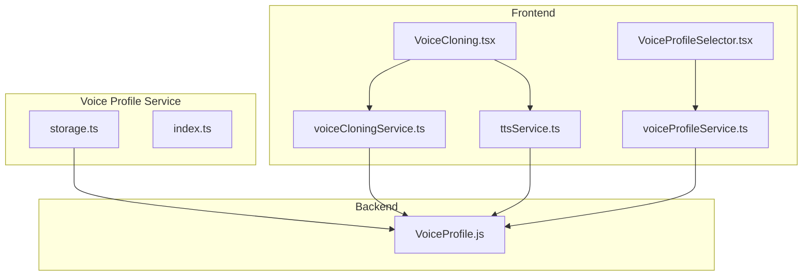

**Diagram sources**
- [VoiceCloning.tsx:1-381](file://frontend/src/components/VoiceCloning.tsx#L1-L381)
- [VoiceProfileSelector.tsx:1-265](file://frontend/src/components/VoiceProfileSelector.tsx#L1-L265)
- [voiceCloningService.ts:1-260](file://frontend/src/services/voiceCloningService.ts#L1-L260)
- [voiceProfileService.ts:1-261](file://frontend/src/services/voiceProfileService.ts#L1-L261)
- [ttsService.ts:1-381](file://frontend/src/services/ttsService.ts#L1-L381)
- [VoiceProfile.js:1-50](file://backend/models/VoiceProfile.js#L1-L50)
- [storage.ts:1-61](file://services/voice/profile/src/storage.ts#L1-L61)
- [index.ts:1-4](file://services/voice/profile/src/index.ts#L1-L4)

**Section sources**
- [VoiceCloning.tsx:1-381](file://frontend/src/components/VoiceCloning.tsx#L1-L381)
- [VoiceProfileSelector.tsx:1-265](file://frontend/src/components/VoiceProfileSelector.tsx#L1-L265)
- [voiceCloningService.ts:1-260](file://frontend/src/services/voiceCloningService.ts#L1-L260)
- [voiceProfileService.ts:1-261](file://frontend/src/services/voiceProfileService.ts#L1-L261)
- [ttsService.ts:1-381](file://frontend/src/services/ttsService.ts#L1-L381)
- [VoiceProfile.js:1-50](file://backend/models/VoiceProfile.js#L1-L50)
- [storage.ts:1-61](file://services/voice/profile/src/storage.ts#L1-L61)
- [index.ts:1-4](file://services/voice/profile/src/index.ts#L1-L4)

## Core Components
- Voice profile model: Defines schema for voice profiles, including identifiers, provider, language, pitch/speed controls, status, and metadata.
- Voice cloning service: Provides APIs for uploading audio samples, listing clones, retrieving details, deletion, default selection, status polling, and test generation.
- Voice profile service: Provides APIs for discovering available voice profiles, searching, rating, and managing user preferences.
- Voice cloning UI: Supports recording or uploading audio samples, previewing, and initiating training.
- Voice profile selector UI: Allows users to browse, filter, and compare available voice profiles with sample playback.
- TTS service: Centralizes TTS operations, including synthesis, batching, timestamps, browser fallback, and voice cloning uploads.
- Storage service: Handles persistent storage of voice samples and synthesized audio.

**Section sources**
- [VoiceProfile.js:1-50](file://backend/models/VoiceProfile.js#L1-L50)
- [voiceCloningService.ts:1-260](file://frontend/src/services/voiceCloningService.ts#L1-L260)
- [voiceProfileService.ts:1-261](file://frontend/src/services/voiceProfileService.ts#L1-L261)
- [VoiceCloning.tsx:1-381](file://frontend/src/components/VoiceCloning.tsx#L1-L381)
- [VoiceProfileSelector.tsx:1-265](file://frontend/src/components/VoiceProfileSelector.tsx#L1-L265)
- [ttsService.ts:1-381](file://frontend/src/services/ttsService.ts#L1-L381)
- [storage.ts:1-61](file://services/voice/profile/src/storage.ts#L1-L61)

## Architecture Overview
The system integrates frontend UI with backend services and external providers. Voice cloning begins in the UI, moves to the TTS service, and is persisted via the voice profile service’s storage module. Profiles are stored in the backend database and can be retrieved by the UI for selection and comparison.

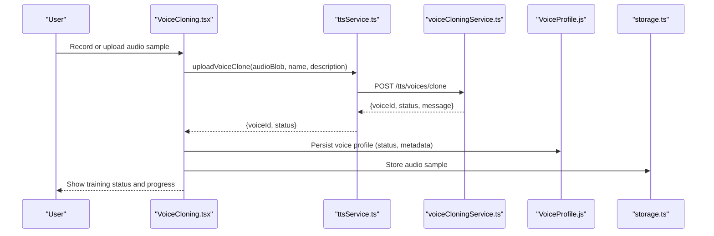

**Diagram sources**
- [VoiceCloning.tsx:109-153](file://frontend/src/components/VoiceCloning.tsx#L109-L153)
- [ttsService.ts:248-284](file://frontend/src/services/ttsService.ts#L248-L284)
- [voiceCloningService.ts:22-39](file://frontend/src/services/voiceCloningService.ts#L22-L39)
- [VoiceProfile.js:1-50](file://backend/models/VoiceProfile.js#L1-L50)
- [storage.ts:7-28](file://services/voice/profile/src/storage.ts#L7-L28)

## Detailed Component Analysis

### Voice Profile Model
The voice profile model defines the schema for storing voice-related metadata, including provider, language, pitch/speed, status, and arbitrary metadata. It supports multiple providers and maintains a lifecycle status for training and readiness.

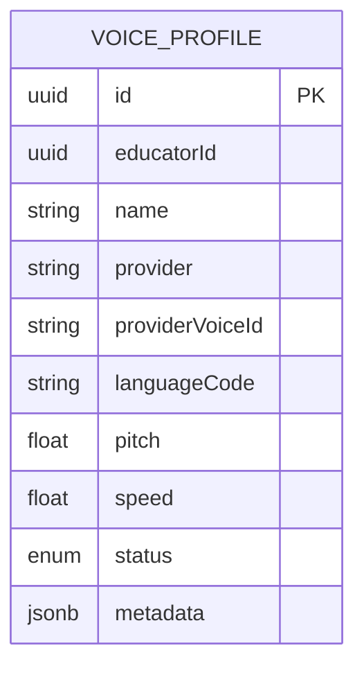

**Diagram sources**
- [VoiceProfile.js:4-46](file://backend/models/VoiceProfile.js#L4-L46)

**Section sources**
- [VoiceProfile.js:1-50](file://backend/models/VoiceProfile.js#L1-L50)

### Voice Cloning Workflow (Frontend)
The voice cloning UI enables users to record or upload audio samples, preview them, and submit them for training. The UI coordinates with the TTS service to upload samples and updates the UI with status and progress.

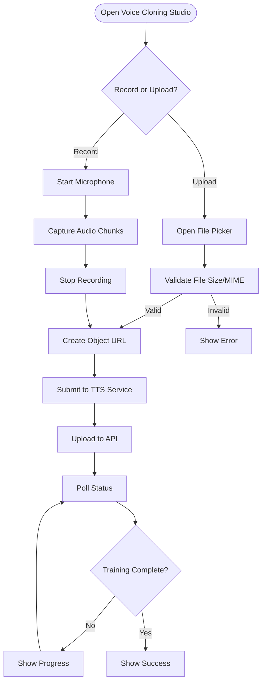

**Diagram sources**
- [VoiceCloning.tsx:33-153](file://frontend/src/components/VoiceCloning.tsx#L33-L153)
- [ttsService.ts:248-284](file://frontend/src/services/ttsService.ts#L248-L284)
- [voiceCloningService.ts:22-39](file://frontend/src/services/voiceCloningService.ts#L22-L39)

**Section sources**
- [VoiceCloning.tsx:1-381](file://frontend/src/components/VoiceCloning.tsx#L1-L381)
- [ttsService.ts:248-284](file://frontend/src/services/ttsService.ts#L248-L284)
- [voiceCloningService.ts:1-260](file://frontend/src/services/voiceCloningService.ts#L1-L260)

### Voice Profile Discovery and Selection
The voice profile selector allows users to search, filter, and compare available voice profiles. It supports free and premium profiles, gender/style filters, and sample playback.

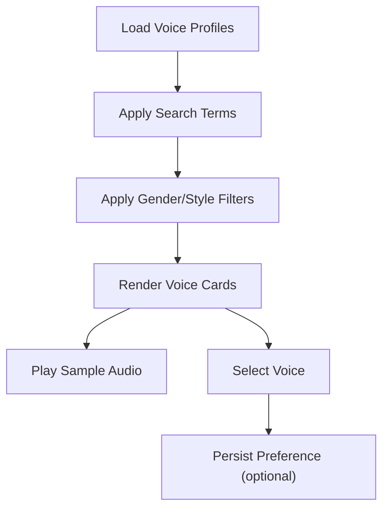

**Diagram sources**
- [VoiceProfileSelector.tsx:24-78](file://frontend/src/components/VoiceProfileSelector.tsx#L24-L78)
- [voiceProfileService.ts:7-100](file://frontend/src/services/voiceProfileService.ts#L7-L100)

**Section sources**
- [VoiceProfileSelector.tsx:1-265](file://frontend/src/components/VoiceProfileSelector.tsx#L1-L265)
- [voiceProfileService.ts:1-261](file://frontend/src/services/voiceProfileService.ts#L1-L261)

### ElevenLabs API Integration
The voice profile service exposes an abstraction for integrating with external providers. The storage module demonstrates how to upload samples to local storage and outlines where provider-specific integrations would be wired.

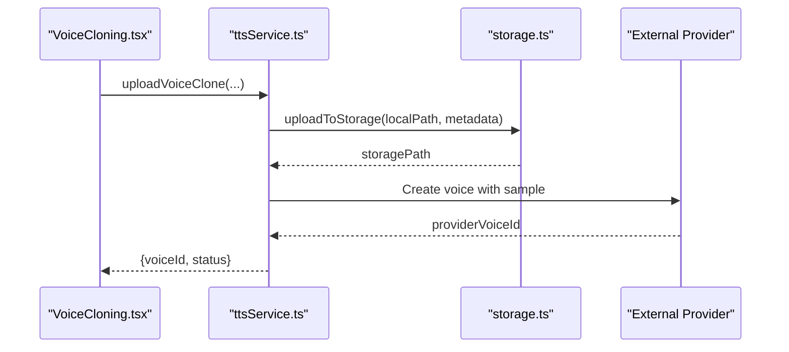

**Diagram sources**
- [ttsService.ts:248-284](file://frontend/src/services/ttsService.ts#L248-L284)
- [storage.ts:7-28](file://services/voice/profile/src/storage.ts#L7-L28)
- [index.ts:1-4](file://services/voice/profile/src/index.ts#L1-L4)

**Section sources**
- [storage.ts:1-61](file://services/voice/profile/src/storage.ts#L1-L61)
- [index.ts:1-4](file://services/voice/profile/src/index.ts#L1-L4)

### Voice Quality Assessment and Optimization
Quality assessment and optimization are handled by the external provider after training. The UI surfaces training progress and allows users to generate test audio to evaluate quality. Pitch and speed adjustments are part of the profile model and can be tuned per user preference.

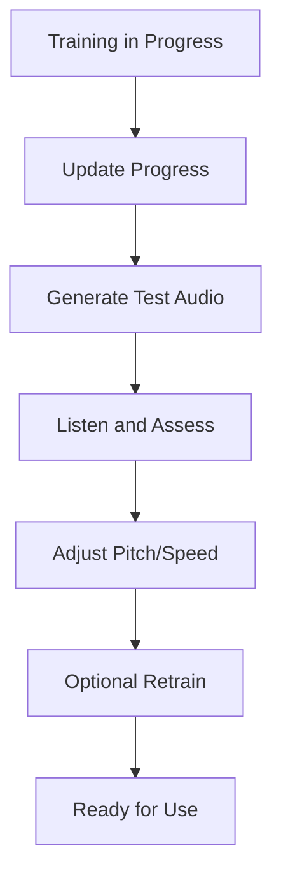

**Diagram sources**
- [voiceCloningService.ts:113-126](file://frontend/src/services/voiceCloningService.ts#L113-L126)
- [VoiceProfile.js:30-37](file://backend/models/VoiceProfile.js#L30-L37)

**Section sources**
- [voiceCloningService.ts:112-154](file://frontend/src/services/voiceCloningService.ts#L112-L154)
- [VoiceProfile.js:30-37](file://backend/models/VoiceProfile.js#L30-L37)

### Profile Storage Mechanisms
The storage service manages persistence of voice samples and synthesized audio. It supports local storage and can be extended to cloud providers.

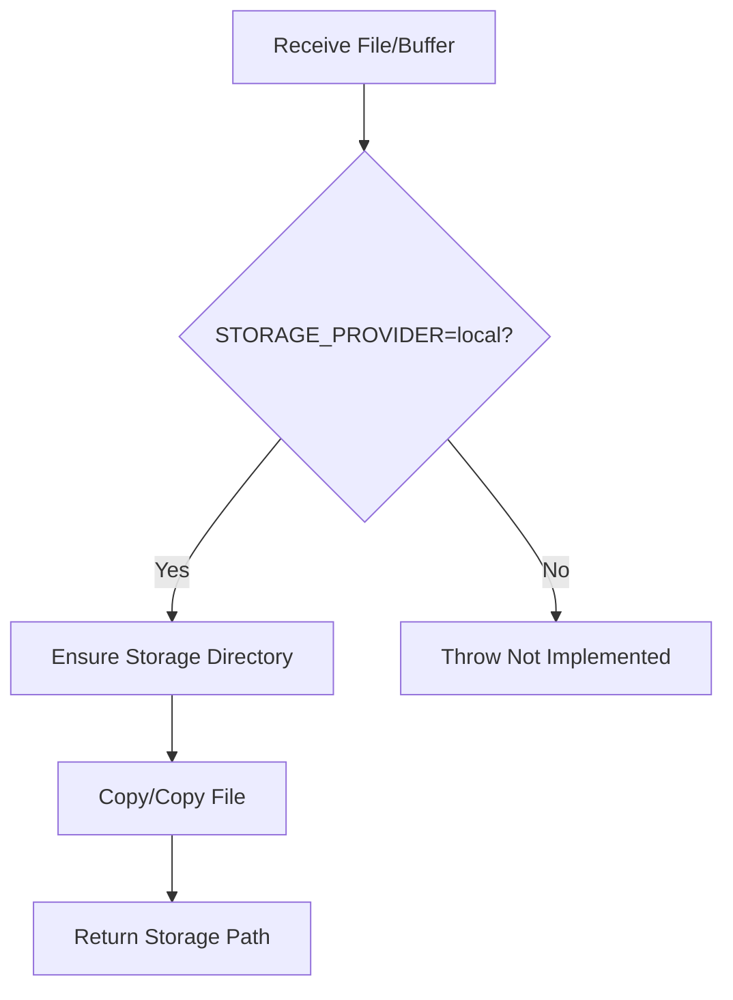

**Diagram sources**
- [storage.ts:7-60](file://services/voice/profile/src/storage.ts#L7-L60)

**Section sources**
- [storage.ts:1-61](file://services/voice/profile/src/storage.ts#L1-L61)

### Voice Switching and Personalized Narrator Settings
Users can select a default voice for narration, rate profiles, and manage preferences. The TTS service centralizes synthesis options, including voice, speed, and pitch.

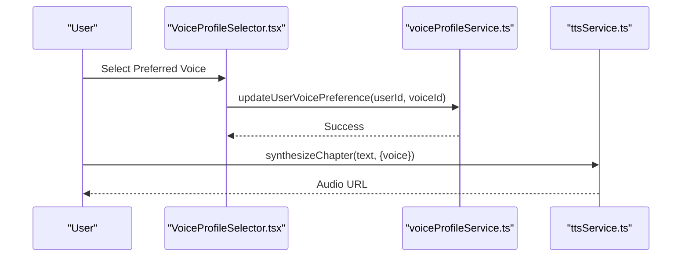

**Diagram sources**
- [VoiceProfileSelector.tsx:1-265](file://frontend/src/components/VoiceProfileSelector.tsx#L1-L265)
- [voiceProfileService.ts:121-138](file://frontend/src/services/voiceProfileService.ts#L121-L138)
- [ttsService.ts:46-80](file://frontend/src/services/ttsService.ts#L46-L80)

**Section sources**
- [voiceProfileService.ts:102-138](file://frontend/src/services/voiceProfileService.ts#L102-L138)
- [ttsService.ts:33-80](file://frontend/src/services/ttsService.ts#L33-L80)

### Voice Comparison Tools
The voice profile selector supports filtering by gender and style and provides sample playback to compare voices before selection.

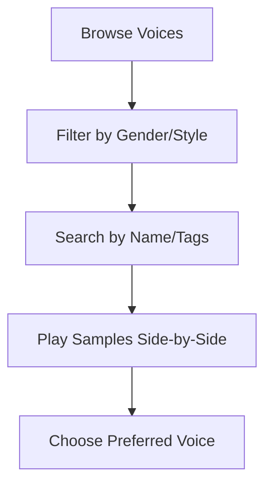

**Diagram sources**
- [VoiceProfileSelector.tsx:24-78](file://frontend/src/components/VoiceProfileSelector.tsx#L24-L78)

**Section sources**
- [VoiceProfileSelector.tsx:1-265](file://frontend/src/components/VoiceProfileSelector.tsx#L1-L265)

## Dependency Analysis
The system exhibits clear separation of concerns:
- Frontend UI components depend on services for data and operations
- Services depend on backend routes and models
- Storage service encapsulates persistence logic
- The voice profile service acts as a bridge to external providers

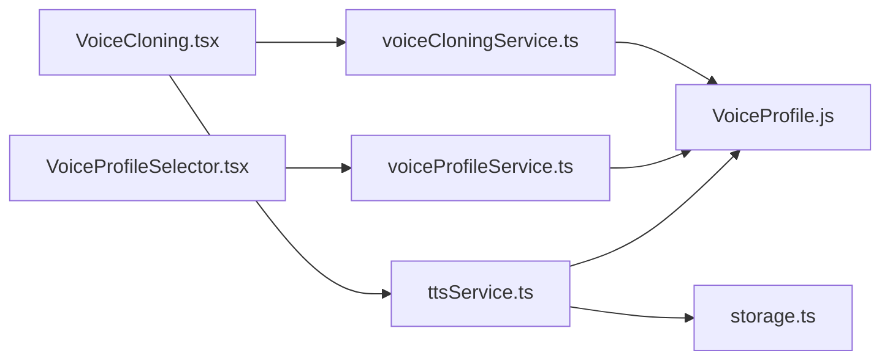

**Diagram sources**
- [VoiceCloning.tsx:1-381](file://frontend/src/components/VoiceCloning.tsx#L1-L381)
- [VoiceProfileSelector.tsx:1-265](file://frontend/src/components/VoiceProfileSelector.tsx#L1-L265)
- [voiceCloningService.ts:1-260](file://frontend/src/services/voiceCloningService.ts#L1-L260)
- [voiceProfileService.ts:1-261](file://frontend/src/services/voiceProfileService.ts#L1-L261)
- [ttsService.ts:1-381](file://frontend/src/services/ttsService.ts#L1-L381)
- [VoiceProfile.js:1-50](file://backend/models/VoiceProfile.js#L1-L50)
- [storage.ts:1-61](file://services/voice/profile/src/storage.ts#L1-L61)

**Section sources**
- [VoiceCloning.tsx:1-381](file://frontend/src/components/VoiceCloning.tsx#L1-L381)
- [VoiceProfileSelector.tsx:1-265](file://frontend/src/components/VoiceProfileSelector.tsx#L1-L265)
- [voiceCloningService.ts:1-260](file://frontend/src/services/voiceCloningService.ts#L1-L260)
- [voiceProfileService.ts:1-261](file://frontend/src/services/voiceProfileService.ts#L1-L261)
- [ttsService.ts:1-381](file://frontend/src/services/ttsService.ts#L1-L381)
- [VoiceProfile.js:1-50](file://backend/models/VoiceProfile.js#L1-L50)
- [storage.ts:1-61](file://services/voice/profile/src/storage.ts#L1-L61)

## Performance Considerations
- Concurrency and batching: The TTS service supports batch synthesis with concurrency control to improve throughput for multi-chapter content.
- Text chunking: Long texts are chunked to respect provider limits and improve reliability.
- Browser fallback: When network conditions fail, the service falls back to browser speech synthesis to maintain continuity.
- Storage efficiency: Local storage ensures minimal latency for sample retrieval during training and testing.

[No sources needed since this section provides general guidance]

## Troubleshooting Guide
Common issues and resolutions:
- Microphone permission denied: Ensure browser permissions are granted and the device is accessible.
- File validation failures: Verify file size and MIME type constraints before upload.
- Training status timeouts: Poll the status endpoint periodically until completion.
- Storage provider not implemented: Configure STORAGE_PROVIDER and LOCAL_STORAGE_DIR appropriately; cloud providers are placeholders for future integration.
- Network errors during synthesis: The service attempts a browser fallback; retry after connectivity improves.

**Section sources**
- [VoiceCloning.tsx:68-71](file://frontend/src/components/VoiceCloning.tsx#L68-L71)
- [VoiceCloning.tsx:84-92](file://frontend/src/components/VoiceCloning.tsx#L84-L92)
- [voiceCloningService.ts:113-126](file://frontend/src/services/voiceCloningService.ts#L113-L126)
- [storage.ts:12-28](file://services/voice/profile/src/storage.ts#L12-L28)
- [ttsService.ts:212-245](file://frontend/src/services/ttsService.ts#L212-L245)

## Conclusion
The voice cloning and management system provides a robust foundation for collecting voice samples, orchestrating training, and enabling personalized narration. The frontend offers intuitive voice selection and comparison tools, while the backend and storage services ensure reliable persistence and provider integration. Extending support for ElevenLabs and other providers, along with refining quality assessment and optimization workflows, will further strengthen the platform.