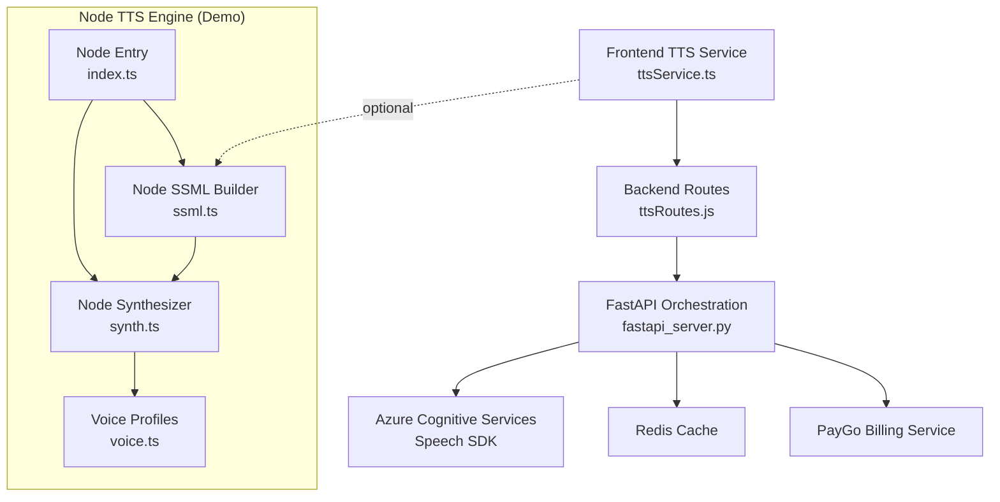
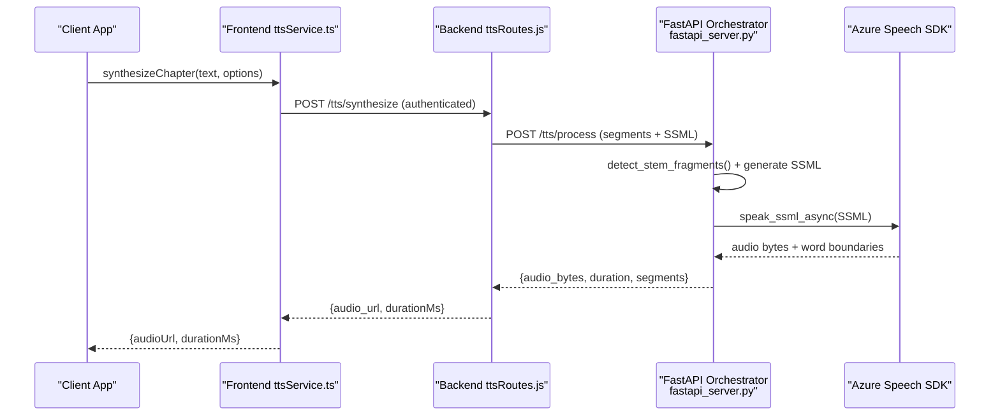
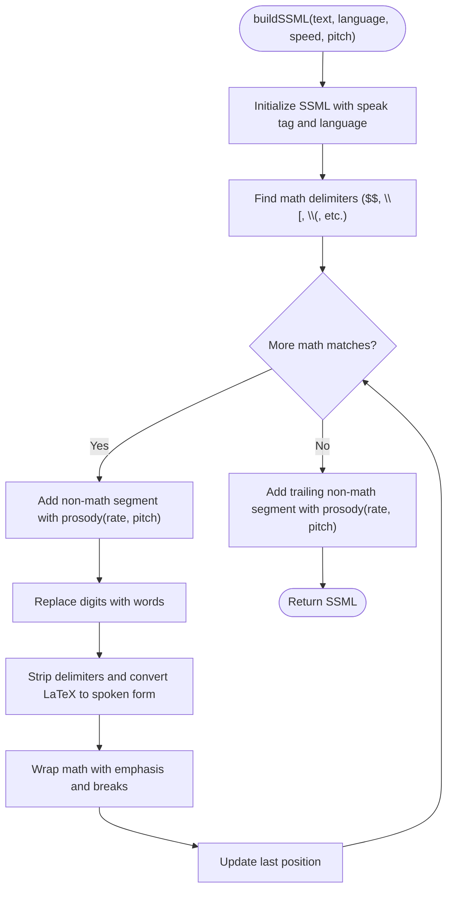
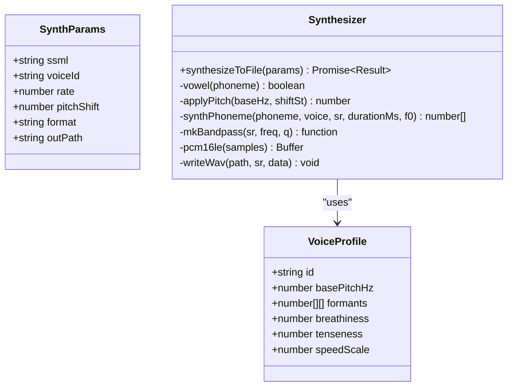
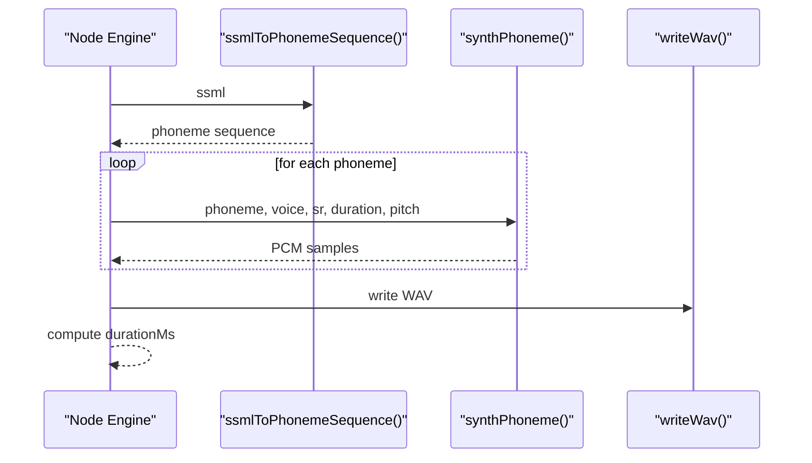
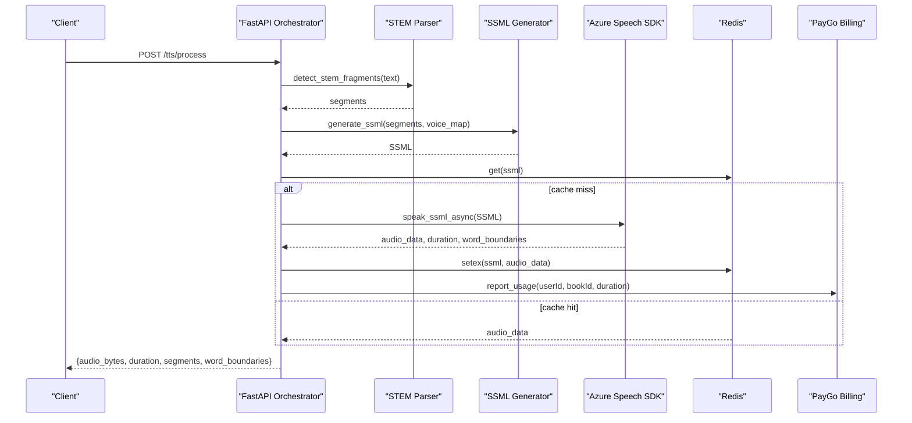
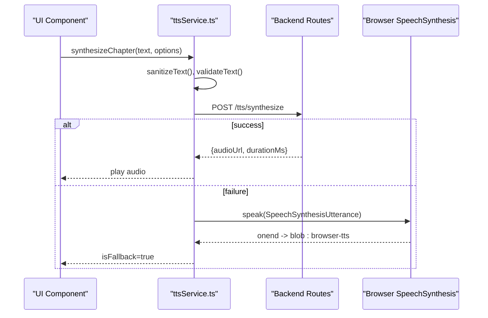
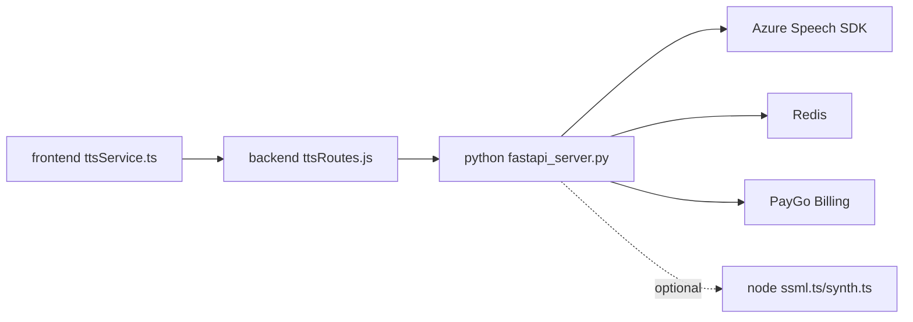

# Voice Synthesis and SSML Generation

<cite>
**Referenced Files in This Document**
- [ssml.ts](file://services/tts/node/src/ssml.ts)
- [synth.ts](file://services/tts/node/src/synth.ts)
- [voice.ts](file://services/tts/node/src/voice.ts)
- [index.ts](file://services/tts/node/src/index.ts)
- [ssml_gen.py](file://services/tts/python/ssml_gen.py)
- [fastapi_server.py](file://services/tts/python/fastapi_server.py)
- [server.py](file://services/tts/python/server.py)
- [ttsRoutes.js](file://backend/routes/ttsRoutes.js)
- [ttsService.ts](file://frontend/src/services/ttsService.ts)
- [voiceService.ts](file://frontend/src/services/voiceService.ts)
</cite>

## Table of Contents
1. [Introduction](#introduction)
2. [Project Structure](#project-structure)
3. [Core Components](#core-components)
4. [Architecture Overview](#architecture-overview)
5. [Detailed Component Analysis](#detailed-component-analysis)
6. [Dependency Analysis](#dependency-analysis)
7. [Performance Considerations](#performance-considerations)
8. [Troubleshooting Guide](#troubleshooting-guide)
9. [Conclusion](#conclusion)
10. [Appendices](#appendices)

## Introduction
This document explains the voice synthesis and SSML generation system used to transform text into speech with scientific content awareness. It covers SSML construction, voice parameter configuration, audio output formatting, synthesis engine integration, voice quality optimization, and speech rate control. It also documents SSML attribute mapping, prosody control, and audio enhancement features, and provides examples of SSML generation, voice customization options, and integration with external TTS providers such as Azure Cognitive Services.

## Project Structure
The voice synthesis pipeline spans three layers:
- Frontend service: orchestrates synthesis requests, manages voice selection, and handles browser fallback.
- Backend proxy: authenticates users, forwards requests to the internal TTS orchestration service, and streams audio.
- Orchestration service: segments STEM text, generates SSML, integrates with Azure TTS, caches results, and reports usage.

**Diagram sources**
- [ttsService.ts:1-381](file://frontend/src/services/ttsService.ts#L1-L381)
- [ttsRoutes.js:1-177](file://backend/routes/ttsRoutes.js#L1-L177)
- [fastapi_server.py:1-354](file://services/tts/python/fastapi_server.py#L1-L354)
- [ssml.ts:1-149](file://services/tts/node/src/ssml.ts#L1-L149)
- [synth.ts:1-108](file://services/tts/node/src/synth.ts#L1-L108)
- [voice.ts:1-40](file://services/tts/node/src/voice.ts#L1-L40)
- [index.ts:1-98](file://services/tts/node/src/index.ts#L1-L98)

**Section sources**
- [ttsService.ts:1-381](file://frontend/src/services/ttsService.ts#L1-L381)
- [ttsRoutes.js:1-177](file://backend/routes/ttsRoutes.js#L1-L177)
- [fastapi_server.py:1-354](file://services/tts/python/fastapi_server.py#L1-L354)

## Core Components
- SSML builder (Node): Builds SSML with math-aware segmentation, digit-to-word conversion, and prosody control.
- Synthesizer (Node): Converts SSML to phonemes and renders synthetic audio frames with configurable pitch and speed.
- Voice profiles (Node): Defines voice characteristics (formants, breathiness, tenseness) and registration.
- Orchestration (Python FastAPI): Segments STEM text, generates SSML with multi-voice support, streams audio from Azure, and caches results.
- Frontend service: Provides synthesis APIs, batching, chunking, browser fallback, and voice management.
- Backend routes: Proxies synthesis, multi-voice orchestration, streaming, and voice discovery to the orchestration service.

**Section sources**
- [ssml.ts:1-149](file://services/tts/node/src/ssml.ts#L1-L149)
- [synth.ts:1-108](file://services/tts/node/src/synth.ts#L1-L108)
- [voice.ts:1-40](file://services/tts/node/src/voice.ts#L1-L40)
- [ssml_gen.py:1-72](file://services/tts/python/ssml_gen.py#L1-L72)
- [fastapi_server.py:1-354](file://services/tts/python/fastapi_server.py#L1-L354)
- [ttsService.ts:1-381](file://frontend/src/services/ttsService.ts#L1-L381)
- [ttsRoutes.js:1-177](file://backend/routes/ttsRoutes.js#L1-L177)

## Architecture Overview
The system integrates a frontend service with a backend proxy and an orchestration service that uses Azure Cognitive Services for high-quality speech synthesis. The frontend supports browser fallback and advanced features like multi-chunk synthesis and timestamps.

**Diagram sources**
- [ttsService.ts:46-80](file://frontend/src/services/ttsService.ts#L46-L80)
- [ttsRoutes.js:14-51](file://backend/routes/ttsRoutes.js#L14-L51)
- [fastapi_server.py:253-326](file://services/tts/python/fastapi_server.py#L253-L326)

## Detailed Component Analysis

### SSML Construction and Prosody Control
- Math-aware segmentation: Detects LaTeX delimiters and converts math content into speech-friendly forms with explicit pauses and emphasis.
- Digit normalization: Converts numeric sequences to words to improve clarity.
- Prosody control: Applies rate and pitch attributes to both math and non-math segments; math segments receive slower rates and stronger emphasis.
- Attribute mapping:
  - xml:lang sets language context.
  - prosody rate controls speech rate percentage.
  - prosody pitch controls pitch in semi-tone steps.
  - emphasis and break tags manage prominence and pacing.
- Escaping: XML-escapes text to avoid SSML parsing errors.

**Diagram sources**
- [ssml.ts:5-35](file://services/tts/node/src/ssml.ts#L5-L35)

**Section sources**
- [ssml.ts:1-149](file://services/tts/node/src/ssml.ts#L1-L149)

### Voice Parameter Configuration and Quality Optimization
- Voice profiles define base pitch, formant frequencies, breathiness, and tenseness for realistic synthetic speech.
- Global speed scaling and per-frame duration adjustments balance quality and performance.
- Pitch shifting applies semitone-based frequency scaling to achieve desired vocal characteristics.
- Formant filtering uses bandpass filters to shape spectral envelope per phoneme.

**Diagram sources**
- [voice.ts:1-40](file://services/tts/node/src/voice.ts#L1-L40)
- [synth.ts:8-108](file://services/tts/node/src/synth.ts#L8-L108)

**Section sources**
- [voice.ts:1-40](file://services/tts/node/src/voice.ts#L1-L40)
- [synth.ts:1-108](file://services/tts/node/src/synth.ts#L1-L108)

### Audio Output Formatting and Node Engine
- SSML is converted to phoneme sequences and rendered into PCM frames at 22050 Hz.
- Output is written as WAV; MP3 placeholder indicates future integration.
- Duration estimation is computed from sample count and sample rate.

**Diagram sources**
- [synth.ts:17-37](file://services/tts/node/src/synth.ts#L17-L37)
- [synth.ts:47-67](file://services/tts/node/src/synth.ts#L47-L67)
- [synth.ts:97-107](file://services/tts/node/src/synth.ts#L97-L107)

**Section sources**
- [index.ts:45-85](file://services/tts/node/src/index.ts#L45-L85)
- [synth.ts:1-108](file://services/tts/node/src/synth.ts#L1-L108)

### Orchestration and External TTS Integration (Azure)
- STEM segmentation detects math, chemistry, and step content; narrative fallback wraps gaps.
- SSML generation assigns voices per segment type and applies prosody for clarity and pacing.
- Streaming synthesis returns audio streams for long-form content.
- Redis caching stores synthesized audio keyed by text, voice, and speed.
- Usage reporting integrates with PayGo billing service.

**Diagram sources**
- [fastapi_server.py:253-326](file://services/tts/python/fastapi_server.py#L253-L326)
- [ssml_gen.py:26-72](file://services/tts/python/ssml_gen.py#L26-L72)

**Section sources**
- [fastapi_server.py:1-354](file://services/tts/python/fastapi_server.py#L1-L354)
- [ssml_gen.py:1-72](file://services/tts/python/ssml_gen.py#L1-L72)

### Frontend Integration and Browser Fallback
- The frontend service validates input, sanitizes text, batches synthesis, and supports chunking for long texts.
- It falls back to browser speech synthesis when network or server failures occur, mapping speed and pitch appropriately.
- Voice cloning uploads are supported with FormData handling and local storage persistence for custom voices.

**Diagram sources**
- [ttsService.ts:46-80](file://frontend/src/services/ttsService.ts#L46-L80)
- [ttsService.ts:212-245](file://frontend/src/services/ttsService.ts#L212-L245)

**Section sources**
- [ttsService.ts:1-381](file://frontend/src/services/ttsService.ts#L1-L381)
- [voiceService.ts:1-53](file://frontend/src/services/voiceService.ts#L1-L53)

## Dependency Analysis
- Frontend depends on backend routes for synthesis and voice discovery.
- Backend routes depend on the orchestration service for processing and streaming.
- Orchestration service depends on Azure Speech SDK, Redis cache, and PayGo billing.
- Node engine (demo) is decoupled from production and demonstrates SSML building and synthesis.

**Diagram sources**
- [ttsService.ts:1-381](file://frontend/src/services/ttsService.ts#L1-L381)
- [ttsRoutes.js:1-177](file://backend/routes/ttsRoutes.js#L1-L177)
- [fastapi_server.py:1-354](file://services/tts/python/fastapi_server.py#L1-L354)

**Section sources**
- [ttsRoutes.js:1-177](file://backend/routes/ttsRoutes.js#L1-L177)
- [fastapi_server.py:1-354](file://services/tts/python/fastapi_server.py#L1-L354)

## Performance Considerations
- Caching: Use Redis to cache SSML-derived audio to reduce repeated synthesis costs.
- Streaming: Prefer streaming endpoints for long-form content to minimize initial latency.
- Complexity scoring: Heuristics estimate synthesis complexity to inform billing and resource allocation.
- Concurrency: Frontend batching limits concurrent requests to balance throughput and latency.
- Rate limits: Both frontend and backend enforce rate limits to protect resources.

[No sources needed since this section provides general guidance]

## Troubleshooting Guide
- Authentication and routing: Ensure backend routes are reachable and JWT is present for protected endpoints.
- Provider configuration: Verify Azure Speech credentials and region are set; missing keys cause synthesis failures.
- Cache connectivity: If Redis is unavailable, the system operates without caching; confirm connectivity and credentials.
- Input validation: Respect text length limits and supported languages; invalid parameters return 400 errors.
- Browser fallback: When network errors occur, the frontend attempts browser speech synthesis; verify browser support and permissions.

**Section sources**
- [ttsRoutes.js:14-51](file://backend/routes/ttsRoutes.js#L14-L51)
- [fastapi_server.py:99-125](file://services/tts/python/fastapi_server.py#L99-L125)
- [fastapi_server.py:127-170](file://services/tts/python/fastapi_server.py#L127-L170)
- [ttsService.ts:212-245](file://frontend/src/services/ttsService.ts#L212-L245)

## Conclusion
The voice synthesis system combines robust SSML generation, multi-voice orchestration, and external TTS provider integration to deliver high-quality, customizable speech. It supports scientific content with math-aware narration, fine-grained prosody control, and scalable streaming and caching. The frontend provides resilient synthesis with browser fallback and voice management, while the backend ensures secure, authenticated access and efficient resource utilization.

[No sources needed since this section summarizes without analyzing specific files]

## Appendices

### SSML Attribute Mapping and Prosody Control
- xml:lang: Sets language context for synthesis engines.
- prosody rate: Controls speech rate percentage; math segments use slower rates.
- prosody pitch: Controls pitch in semi-tone steps; applied globally and per segment.
- emphasis: Highlights important content (e.g., “Equation:”).
- break: Adds pauses for readability and pacing.

**Section sources**
- [ssml.ts:5-35](file://services/tts/node/src/ssml.ts#L5-L35)
- [ssml_gen.py:50-63](file://services/tts/python/ssml_gen.py#L50-L63)

### Voice Customization Options
- Premade voices: Provided by the frontend service with default IDs and names.
- Custom voices: Simulated cloning and persisted in local storage; production would integrate with external providers.
- Personal voice ID: Supports Azure Personal Voice configuration for advanced customization.

**Section sources**
- [ttsService.ts:24-31](file://frontend/src/services/ttsService.ts#L24-L31)
- [voiceService.ts:19-39](file://frontend/src/services/voiceService.ts#L19-L39)
- [fastapi_server.py:134-141](file://services/tts/python/fastapi_server.py#L134-L141)

### Integration with External TTS Providers
- Azure Cognitive Services: Used for high-quality synthesis, streaming, and word boundary events.
- ElevenLabs: Not integrated in the current codebase; the voice cloning UI simulates processing.

**Section sources**
- [fastapi_server.py:99-125](file://services/tts/python/fastapi_server.py#L99-L125)
- [fastapi_server.py:127-170](file://services/tts/python/fastapi_server.py#L127-L170)
- [voiceService.ts:19-39](file://frontend/src/services/voiceService.ts#L19-L39)