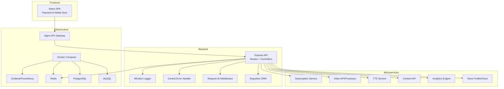
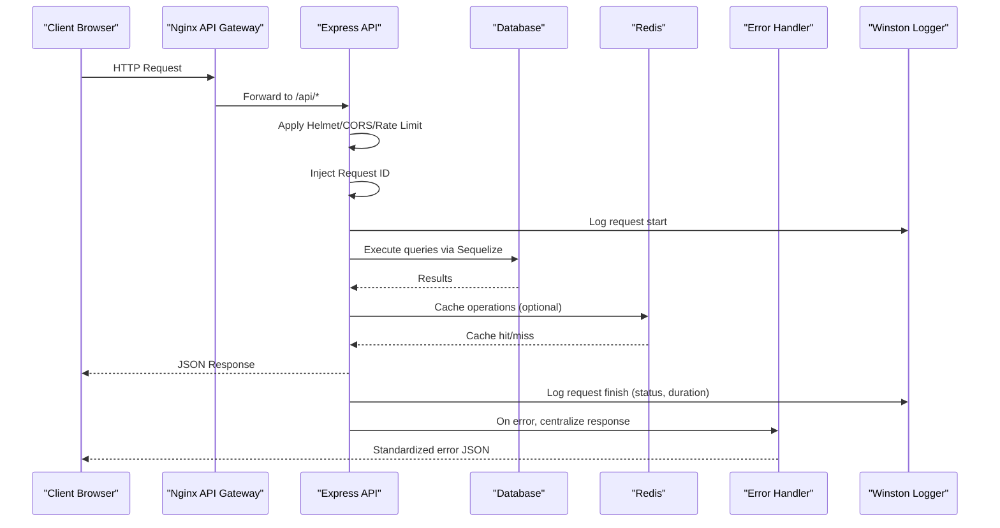
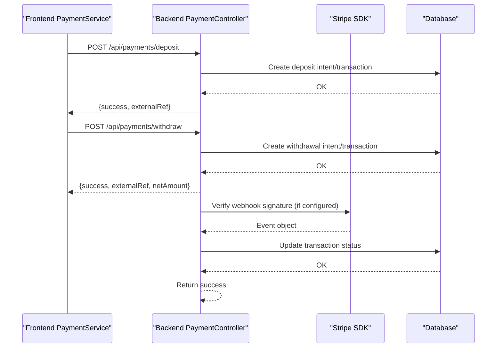
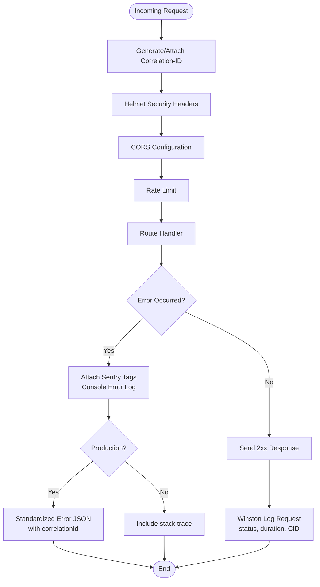
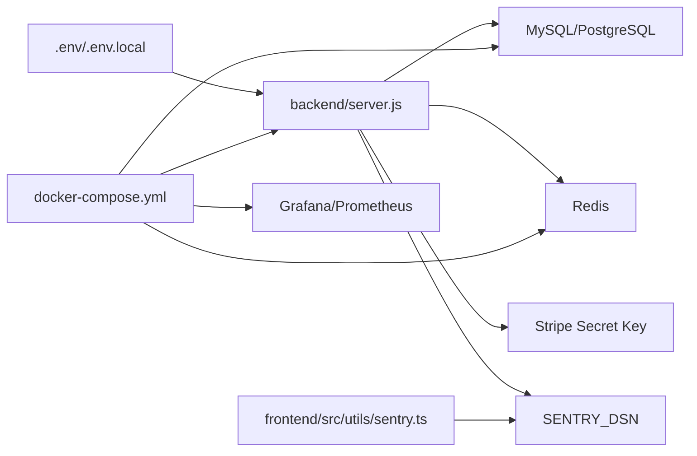

# Troubleshooting and FAQ

<cite>
**Referenced Files in This Document**
- [backend/server.js](file://backend/server.js)
- [backend/middleware/errorHandler.js](file://backend/middleware/errorHandler.js)
- [backend/middleware/requestId.js](file://backend/middleware/requestId.js)
- [backend/utils/logger.js](file://backend/utils/logger.js)
- [backend/utils/sentry.js](file://backend/utils/sentry.js)
- [frontend/src/utils/sentry.ts](file://frontend/src/utils/sentry.ts)
- [frontend/src/services/paymentService.ts](file://frontend/src/services/paymentService.ts)
- [backend/controllers/paymentController.js](file://backend/controllers/paymentController.js)
- [infrastructure/docker-compose.yml](file://infrastructure/docker-compose.yml)
- [docs/DEPLOYMENT.md](file://docs/DEPLOYMENT.md)
- [docs/SETUP_GUIDE.md](file://docs/SETUP_GUIDE.md)
- [backend/schema.sql](file://backend/schema.sql)
- [services/shared/http/errorHandler.js](file://services/shared/http/errorHandler.js)
- [services/shared/config.js](file://services/shared/config.js)
- [services/subscription/src/database.ts](file://services/subscription/src/database.ts)
- [mail-server/src/web/public/js/utils/errors.js](file://mail-server/src/web/public/js/utils/errors.js)
- [mail-server/src/web/WebInterface.js](file://mail-server/src/web/WebInterface.js)
- [mail-server/scripts/setup.sh](file://mail-server/scripts/setup.sh)
- [database/legacy/setup-video-platform.bat](file://database/legacy/setup-video-platform.bat)
</cite>

## Table of Contents
1. [Introduction](#introduction)
2. [Project Structure](#project-structure)
3. [Core Components](#core-components)
4. [Architecture Overview](#architecture-overview)
5. [Detailed Component Analysis](#detailed-component-analysis)
6. [Dependency Analysis](#dependency-analysis)
7. [Performance Considerations](#performance-considerations)
8. [Troubleshooting Guide](#troubleshooting-guide)
9. [Conclusion](#conclusion)
10. [Appendices](#appendices)

## Introduction
This document provides comprehensive troubleshooting guidance and frequently asked questions for the QuantumMint Bookstore platform. It focuses on diagnosing and resolving issues across development, deployment, and operational phases. It covers debugging tools and techniques, log analysis procedures, performance troubleshooting, integration pitfalls, configuration problems, and user-reported issues. It also includes diagnostic checklists, error code references, escalation procedures, and FAQ sections addressing platform features, account management, and technical support resources.

## Project Structure
The platform comprises:
- A monolithic backend API with Express, Sequelize, and modular routes
- A React frontend with payment and media synchronization features
- Microservices for video, content, TTS, analytics, subscription, and voice
- A mail server and domain controller supporting email workflows and DNS
- Docker-based orchestration and monitoring stacks

**Diagram sources**
- [infrastructure/docker-compose.yml:1-373](file://infrastructure/docker-compose.yml#L1-L373)
- [backend/server.js:1-155](file://backend/server.js#L1-L155)

**Section sources**
- [infrastructure/docker-compose.yml:1-373](file://infrastructure/docker-compose.yml#L1-L373)
- [backend/server.js:1-155](file://backend/server.js#L1-L155)

## Core Components
Key components involved in troubleshooting:
- Request correlation and logging: request ID middleware, Winston logger, centralized error handler
- Error tracking: Sentry initialization and tagging on both backend and frontend
- Payment flows: frontend payment service and backend payment controller/webhooks
- Database connectivity: Sequelize configuration and health checks
- Service orchestration: Docker Compose with health checks and environment variables

**Section sources**
- [backend/middleware/requestId.js:1-15](file://backend/middleware/requestId.js#L1-L15)
- [backend/utils/logger.js:1-58](file://backend/utils/logger.js#L1-L58)
- [backend/middleware/errorHandler.js:1-44](file://backend/middleware/errorHandler.js#L1-L44)
- [backend/utils/sentry.js:1-22](file://backend/utils/sentry.js#L1-L22)
- [frontend/src/utils/sentry.ts:1-35](file://frontend/src/utils/sentry.ts#L1-L35)
- [frontend/src/services/paymentService.ts:1-153](file://frontend/src/services/paymentService.ts#L1-L153)
- [backend/controllers/paymentController.js:1-99](file://backend/controllers/paymentController.js#L1-L99)
- [backend/server.js:57-84](file://backend/server.js#L57-L84)

## Architecture Overview
The system uses a reverse proxy (Nginx) routing to the monolithic backend and microservices. The backend initializes database connections, registers routes, and applies middleware for security, rate limiting, logging, and error handling. Sentry integrates for error tracking, and Winston logs structured events with correlation IDs.

**Diagram sources**
- [backend/server.js:18-47](file://backend/server.js#L18-L47)
- [backend/middleware/requestId.js:7-12](file://backend/middleware/requestId.js#L7-L12)
- [backend/middleware/errorHandler.js:5-41](file://backend/middleware/errorHandler.js#L5-L41)
- [backend/utils/logger.js:33-44](file://backend/utils/logger.js#L33-L44)

## Detailed Component Analysis

### Payment Integration Troubleshooting
Common issues involve mobile money webhooks, Stripe Connect, and withdrawal flows. The frontend payment service communicates with backend endpoints, while the backend validates signatures and coordinates with external services.

**Diagram sources**
- [frontend/src/services/paymentService.ts:57-101](file://frontend/src/services/paymentService.ts#L57-L101)
- [backend/controllers/paymentController.js:19-98](file://backend/controllers/paymentController.js#L19-L98)
- [backend/server.js:97-108](file://backend/server.js#L97-L108)

**Section sources**
- [frontend/src/services/paymentService.ts:1-153](file://frontend/src/services/paymentService.ts#L1-L153)
- [backend/controllers/paymentController.js:1-99](file://backend/controllers/paymentController.js#L1-L99)

### Error Handling and Logging
Centralized error handling attaches correlation IDs and Sentry tags, logs to console and files, and returns standardized JSON responses. Winston logs HTTP requests with timing and correlation IDs.

**Diagram sources**
- [backend/middleware/requestId.js:7-12](file://backend/middleware/requestId.js#L7-L12)
- [backend/middleware/errorHandler.js:5-41](file://backend/middleware/errorHandler.js#L5-L41)
- [backend/utils/logger.js:33-44](file://backend/utils/logger.js#L33-L44)
- [backend/utils/sentry.js:3-16](file://backend/utils/sentry.js#L3-L16)
- [frontend/src/utils/sentry.ts:26-34](file://frontend/src/utils/sentry.ts#L26-L34)

**Section sources**
- [backend/middleware/errorHandler.js:1-44](file://backend/middleware/errorHandler.js#L1-L44)
- [backend/utils/logger.js:1-58](file://backend/utils/logger.js#L1-L58)
- [backend/utils/sentry.js:1-22](file://backend/utils/sentry.js#L1-L22)
- [frontend/src/utils/sentry.ts:1-35](file://frontend/src/utils/sentry.ts#L1-L35)

### Database Connectivity and Health
The backend attempts to connect to MySQL/PostgreSQL using Sequelize, falls back to SQLite locally, and logs connection status. Subscription service exposes health checks for database and Redis.

**Section sources**
- [backend/server.js:57-84](file://backend/server.js#L57-L84)
- [services/subscription/src/database.ts:95-114](file://services/subscription/src/database.ts#L95-L114)

### Mail Server and Webhook Troubleshooting
The mail server includes a robust error handler for frontend components, with global error and promise rejection handlers, and a MailAPIError class. Webhook authentication verifies JWT secrets and admin roles.

**Section sources**
- [mail-server/src/web/public/js/utils/errors.js:120-234](file://mail-server/src/web/public/js/utils/errors.js#L120-L234)
- [mail-server/src/web/WebInterface.js:699-723](file://mail-server/src/web/WebInterface.js#L699-L723)

## Dependency Analysis
The backend relies on environment variables for database, JWT, and payment configurations. Docker Compose orchestrates services with health checks and persistent volumes.

**Diagram sources**
- [backend/server.js:11-16](file://backend/server.js#L11-L16)
- [infrastructure/docker-compose.yml:34-43](file://infrastructure/docker-compose.yml#L34-L43)
- [frontend/src/utils/sentry.ts:3-23](file://frontend/src/utils/sentry.ts#L3-L23)

**Section sources**
- [backend/server.js:11-16](file://backend/server.js#L11-L16)
- [infrastructure/docker-compose.yml:34-43](file://infrastructure/docker-compose.yml#L34-L43)

## Performance Considerations
- Use correlation IDs to trace requests across services
- Monitor HTTP durations and error rates via Winston logs and Grafana dashboards
- Tune rate limits and database pooling parameters
- Enable Sentry tracing and replay for frontend performance insights

[No sources needed since this section provides general guidance]

## Troubleshooting Guide

### Diagnostic Checklists
- Pre-deployment checklist
  - [ ] All tests passing
  - [ ] No console errors/warnings
  - [ ] Environment variables configured
  - [ ] SSL certificates valid
  - [ ] Database backed up
  - [ ] Monitoring enabled
- Deployment checklist
  - [ ] Build successful
  - [ ] Assets uploaded to CDN
  - [ ] DNS updated (if needed)
  - [ ] Health checks passing
  - [ ] Smoke tests passed
- Post-deployment checklist
  - [ ] Monitor error rates
  - [ ] Check performance metrics
  - [ ] Verify payment processing
  - [ ] Test critical user flows
  - [ ] Update documentation
  - [ ] Notify stakeholders

**Section sources**
- [docs/DEPLOYMENT.md:619-646](file://docs/DEPLOYMENT.md#L619-L646)

### Common Development Issues
- Missing environment variables
  - Symptom: Warning logs about undefined variables
  - Action: Define required variables in .env and restart
- Database fallback to SQLite
  - Symptom: Local SQLite usage instead of MySQL/PostgreSQL
  - Action: Set DB_HOST, DB_NAME, DB_USER appropriately
- CORS errors
  - Symptom: Blocked requests from frontend
  - Action: Ensure FRONTEND_URL allows origin and credentials are enabled

**Section sources**
- [backend/server.js:11-16](file://backend/server.js#L11-L16)
- [backend/server.js:22-28](file://backend/server.js#L22-L28)
- [backend/server.js:77-84](file://backend/server.js#L77-L84)

### Database Troubleshooting
- Connection failures
  - Verify DATABASE_URL or DB_* variables
  - Confirm database service is healthy and reachable
  - Check credentials and network permissions
- Schema mismatches
  - Review schema.sql and ensure migrations applied
  - Validate table creation and foreign keys

**Section sources**
- [backend/schema.sql:1-132](file://backend/schema.sql#L1-L132)
- [docs/SETUP_GUIDE.md:314-328](file://docs/SETUP_GUIDE.md#L314-L328)

### Payment Integration Issues
- Mobile money webhooks rejected
  - Ensure MOBILE_MONEY_WEBHOOK_SECRET is set in production and header matches
- Stripe webhook verification fails
  - Verify STRIPE_WEBHOOK_SECRET is configured
  - Confirm Stripe SDK availability and signature validation
- Stripe Connect callback issues
  - Confirm FRONTEND_URL and redirect behavior
  - Validate OAuth code/state handling

**Section sources**
- [backend/controllers/paymentController.js:59-98](file://backend/controllers/paymentController.js#L59-L98)
- [frontend/src/services/paymentService.ts:105-117](file://frontend/src/services/paymentService.ts#L105-L117)

### Frontend Error Tracking
- Sentry not initialized
  - Ensure VITE_SENTRY_DSN is set and environment is configured
  - Verify Sentry.init is called during app bootstrap
- Correlation ID not attached
  - Confirm frontend sends X-Correlation-ID and backend attaches it

**Section sources**
- [frontend/src/utils/sentry.ts:3-23](file://frontend/src/utils/sentry.ts#L3-L23)
- [backend/middleware/requestId.js:7-12](file://backend/middleware/requestId.js#L7-L12)

### Microservices and Orchestration
- Service health checks failing
  - Review docker-compose healthcheck definitions
  - Inspect service logs for startup errors
- Port conflicts
  - Adjust ports in docker-compose or host configuration

**Section sources**
- [infrastructure/docker-compose.yml:107-111](file://infrastructure/docker-compose.yml#L107-L111)
- [docs/SETUP_GUIDE.md:336-342](file://docs/SETUP_GUIDE.md#L336-L342)

### Mail Server and Webhooks
- Emails not sending
  - Verify SMTP credentials and server availability
  - Check mail server logs and webhook endpoints
- Webhook errors
  - Validate request format and required fields
  - Confirm webhook logs and retry mechanisms
- JWT authentication for admin endpoints
  - Ensure JWT_SECRET is set and tokens are valid

**Section sources**
- [docs/SETUP_GUIDE.md:313-335](file://docs/SETUP_GUIDE.md#L313-L335)
- [mail-server/src/web/public/js/utils/errors.js:153-234](file://mail-server/src/web/public/js/utils/errors.js#L153-L234)
- [mail-server/src/web/WebInterface.js:699-723](file://mail-server/src/web/WebInterface.js#L699-L723)

### Video Platform Setup
- Upload and playback issues
  - Confirm video storage paths and permissions
  - Validate upload test and player endpoints

**Section sources**
- [database/legacy/setup-video-platform.bat:43-63](file://database/legacy/setup-video-platform.bat#L43-L63)

### Escalation Procedures
- Capture correlation IDs and timestamps
- Collect Winston logs and Sentry events
- Provide environment details (NODE_ENV, DB dialect, service versions)
- Include relevant request/response samples and error messages

**Section sources**
- [backend/middleware/requestId.js:7-12](file://backend/middleware/requestId.js#L7-L12)
- [backend/utils/logger.js:33-44](file://backend/utils/logger.js#L33-L44)
- [backend/utils/sentry.js:3-16](file://backend/utils/sentry.js#L3-L16)

## Conclusion
This guide consolidates practical troubleshooting steps, diagnostic checklists, and escalation procedures for the QuantumMint Bookstore platform. By leveraging correlation IDs, structured logging, and Sentry error tracking, teams can quickly isolate and resolve issues across development, deployment, and operations.

[No sources needed since this section summarizes without analyzing specific files]

## Appendices

### Error Code References
- HTTP 400: Bad Request (invalid webhook signature, missing headers)
- HTTP 401: Unauthorized (missing or invalid webhook secret)
- HTTP 403: Forbidden (admin-only endpoints)
- HTTP 429: Too Many Requests (rate limit exceeded)
- HTTP 500: Internal Server Error (server-side exceptions)
- HTTP 503: Service Unavailable (Stripe SDK or webhook secret missing)

**Section sources**
- [backend/controllers/paymentController.js:74-98](file://backend/controllers/paymentController.js#L74-L98)
- [backend/middleware/errorHandler.js:17-21](file://backend/middleware/errorHandler.js#L17-L21)
- [backend/server.js:49-55](file://backend/server.js#L49-L55)

### FAQ

#### Platform Features
- How do I enable/disable payment features?
  - Toggle feature flags in environment variables and rebuild the frontend.
- Can I switch databases?
  - Yes, configure DB_DIALECT, DB_HOST, DB_NAME, DB_USER, DB_PASS.

**Section sources**
- [docs/DEPLOYMENT.md:49-69](file://docs/DEPLOYMENT.md#L49-L69)
- [docs/SETUP_GUIDE.md:64-78](file://docs/SETUP_GUIDE.md#L64-L78)

#### Account Management
- How do I reset my password?
  - Use the authentication service’s password reset flow.
- How do I connect a Stripe account?
  - Use the Stripe Connect flow; the frontend initiates OAuth and redirects upon success.

**Section sources**
- [frontend/src/services/paymentService.ts:105-117](file://frontend/src/services/paymentService.ts#L105-L117)
- [backend/controllers/paymentController.js:36-55](file://backend/controllers/paymentController.js#L36-L55)

#### Technical Support Resources
- Where do I report bugs?
  - Use the platform’s support contact or internal issue tracker.
- How do I access logs?
  - Check Winston log files and Grafana dashboards.

**Section sources**
- [docs/SETUP_GUIDE.md:343-348](file://docs/SETUP_GUIDE.md#L343-L348)
- [docs/DEPLOYMENT.md:445-507](file://docs/DEPLOYMENT.md#L445-L507)