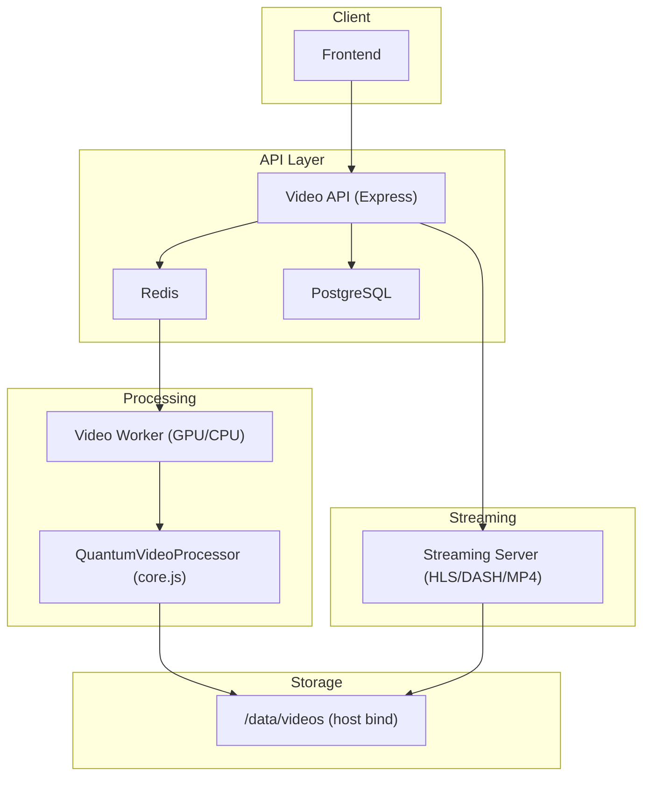
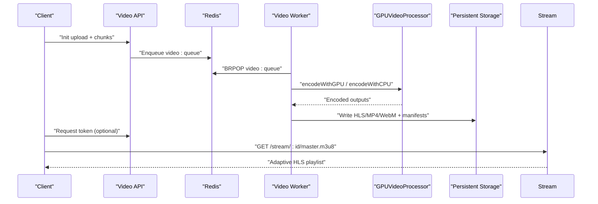
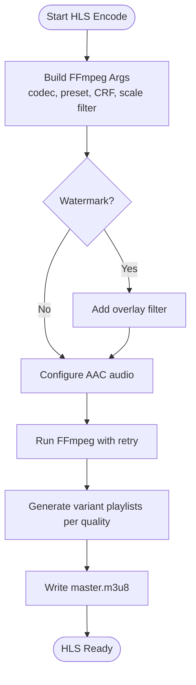
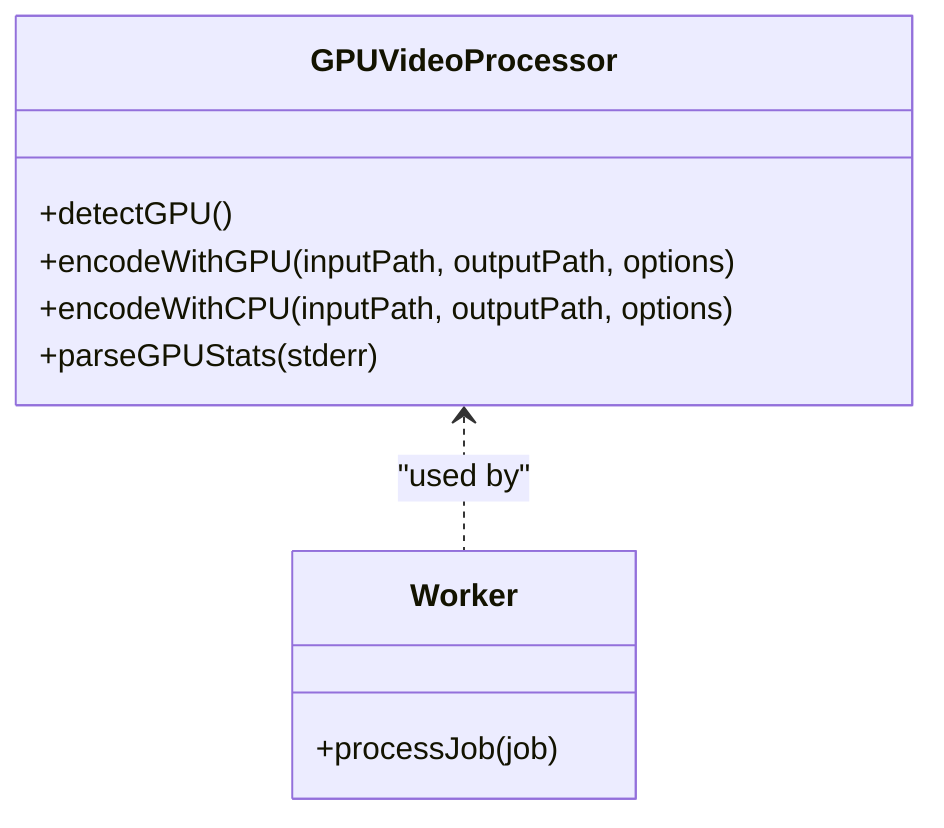
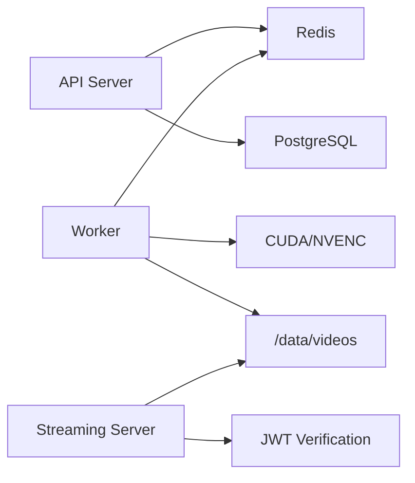

# Encoding and Transcoding

<cite>
**Referenced Files in This Document**
- [core.js](file://services/video/processor/core.js)
- [gpu-processor.js](file://services/video/worker/gpu-processor.js)
- [worker.js](file://services/video/worker/worker.js)
- [server.js](file://services/video/streaming/server.js)
- [docker-compose.video.yml](file://docker-compose.video.yml)
- [setup-gpu.sh](file://setup-gpu.sh)
- [upload-manager.js](file://services/video/processor/upload-manager.js)
- [streaming-server.js](file://services/video/processor/streaming-server.js)
- [server.js](file://services/video/api/server.js)
- [Dockerfile](file://services/video/api/Dockerfile)
- [Dockerfile.gpu](file://services/video/worker/Dockerfile.gpu)
- [Dockerfile](file://services/video/streaming/Dockerfile)
</cite>

## Table of Contents
1. [Introduction](#introduction)
2. [Project Structure](#project-structure)
3. [Core Components](#core-components)
4. [Architecture Overview](#architecture-overview)
5. [Detailed Component Analysis](#detailed-component-analysis)
6. [Dependency Analysis](#dependency-analysis)
7. [Performance Considerations](#performance-considerations)
8. [Troubleshooting Guide](#troubleshooting-guide)
9. [Conclusion](#conclusion)
10. [Appendices](#appendices)

## Introduction
This document explains the video encoding and transcoding capabilities implemented in the platform. It covers supported formats, quality profiles, codec configurations, HLS and MP4 generation, adaptive bitrate streaming, multi-quality output, GPU acceleration, and operational workflows. It also documents watermark integration, subtitle processing, and performance optimization strategies.

## Project Structure
The video system is composed of three primary services orchestrated by Docker Compose:
- Video API: Accepts uploads, validates metadata, enqueues encoding jobs, and exposes metrics.
- Video Worker: Consumes jobs from Redis, performs GPU-accelerated or CPU fallback encoding, and persists results.
- Streaming Server: Serves HLS/DASH/MP4 assets with optional JWT-based access control and range requests.

**Diagram sources**
- [docker-compose.video.yml:1-158](file://docker-compose.video.yml#L1-L158)
- [server.js:1-445](file://services/video/api/server.js#L1-L445)
- [worker.js:1-125](file://services/video/worker/worker.js#L1-L125)
- [core.js:1-572](file://services/video/processor/core.js#L1-L572)
- [server.js:1-128](file://services/video/streaming/server.js#L1-L128)

**Section sources**
- [docker-compose.video.yml:1-158](file://docker-compose.video.yml#L1-L158)
- [Dockerfile:1-41](file://services/video/api/Dockerfile#L1-L41)
- [Dockerfile.gpu:1-46](file://services/video/worker/Dockerfile.gpu#L1-L46)
- [Dockerfile:1-29](file://services/video/streaming/Dockerfile#L1-L29)

## Core Components
- QuantumVideoProcessor: Orchestrates video analysis, thumbnail generation, preview creation, multi-format encoding (HLS/MP4/WebM), manifest generation, and storage.
- GPUVideoProcessor: Detects GPU availability, selects hardware encoding (NVIDIA NVENC) when available, falls back to CPU (libx264) otherwise, and parses GPU statistics.
- UploadManager: Manages chunked uploads, validates MIME types and sizes, merges chunks, and emits completion events.
- Streaming Server: Serves HLS/DASH/MP4 segments with JWT verification, range requests, and analytics hooks.
- API Server: Validates JWT, enforces rate limits, stores upload metadata, and enqueues encoding jobs.

**Section sources**
- [core.js:1-572](file://services/video/processor/core.js#L1-L572)
- [gpu-processor.js:1-213](file://services/video/worker/gpu-processor.js#L1-L213)
- [upload-manager.js:1-235](file://services/video/processor/upload-manager.js#L1-L235)
- [server.js:1-128](file://services/video/streaming/server.js#L1-L128)
- [server.js:1-445](file://services/video/api/server.js#L1-L445)

## Architecture Overview
End-to-end flow:
- Clients upload videos via the API with chunked uploads.
- The API validates and persists metadata, then pushes a job to Redis.
- The Worker consumes the job, detects GPU capability, encodes using NVENC or libx264, and writes outputs to persistent storage.
- The Streaming Server serves HLS/DASH/MP4 with optional JWT-based access control.

**Diagram sources**
- [server.js:268-318](file://services/video/api/server.js#L268-L318)
- [worker.js:39-122](file://services/video/worker/worker.js#L39-L122)
- [gpu-processor.js:43-135](file://services/video/worker/gpu-processor.js#L43-L135)
- [core.js:123-183](file://services/video/processor/core.js#L123-L183)
- [server.js:144-193](file://services/video/streaming/server.js#L144-L193)

## Detailed Component Analysis

### HLS Encoding Pipeline
- Master playlist generation aggregates variants for each selected quality.
- Segment durations are configurable; default is six seconds.
- Variant playlists are generated per quality with bandwidth hints derived from bitrate profiles.
- HLS manifests are written and optionally enhanced with custom headers for downstream players.

**Diagram sources**
- [core.js:268-318](file://services/video/processor/core.js#L268-L318)
- [core.js:341-390](file://services/video/processor/core.js#L341-L390)

**Section sources**
- [core.js:268-318](file://services/video/processor/core.js#L268-L318)
- [core.js:341-390](file://services/video/processor/core.js#L341-L390)

### MP4 Encoding Pipeline
- Generates single-file MP4 outputs for each requested quality.
- Uses libx264 or libvpx-vp9 depending on format selection.
- Applies scaling and faststart optimization for progressive download.

**Section sources**
- [core.js:320-339](file://services/video/processor/core.js#L320-L339)
- [core.js:341-390](file://services/video/processor/core.js#L341-L390)

### Adaptive Bitrate Streaming Setup
- HLS master playlist includes EXT-X-STREAM-INF entries with bandwidth and resolution.
- Variant playlists are served per quality; client adapts automatically.
- Optional adjustments can be made based on network conditions.

**Section sources**
- [core.js:302-304](file://services/video/processor/core.js#L302-L304)
- [streaming-server.js:212-216](file://services/video/processor/streaming-server.js#L212-L216)

### Multi-Quality Output Generation
- Supported profiles: 240p, 360p, 480p, 720p, 1080p, 1440p, 4K.
- Bitrate and audio bitrate increase progressively with resolution.
- Scaling filters maintain aspect ratio and pad to target dimensions.

**Section sources**
- [core.js:27-35](file://services/video/processor/core.js#L27-L35)
- [core.js:356-357](file://services/video/processor/core.js#L356-L357)

### Codec Configurations and Formats
- HLS: H.264 baseline/high/main depending on preset; AAC audio.
- MP4: H.264; AAC audio; faststart.
- WebM: VP9; placeholder for future implementation.
- GPU path: NVENC H.264 with CQ/VBR RC, lookahead, AQ, and B-frames.

**Section sources**
- [core.js:20-25](file://services/video/processor/core.js#L20-L25)
- [core.js:351-351](file://services/video/processor/core.js#L351-L351)
- [gpu-processor.js:97-114](file://services/video/worker/gpu-processor.js#L97-L114)

### GPU Acceleration and Hardware Encoding
- GPU detection via nvidia-smi; if available, NVENC is used for H.264 encoding.
- CPU fallback uses libx264 with tuned presets and CRF.
- GPU stats parsing includes utilization, memory usage, encoder utilization, and FPS.

**Diagram sources**
- [gpu-processor.js:43-213](file://services/video/worker/gpu-processor.js#L43-L213)
- [worker.js:60-122](file://services/video/worker/worker.js#L60-L122)

**Section sources**
- [gpu-processor.js:43-135](file://services/video/worker/gpu-processor.js#L43-L135)
- [gpu-processor.js:189-210](file://services/video/worker/gpu-processor.js#L189-L210)
- [worker.js:39-122](file://services/video/worker/worker.js#L39-L122)

### Watermark Integration
- Optional watermark overlay can be applied during encoding.
- Requires an overlay position; image is overlaid onto the video stream.

**Section sources**
- [core.js:360-363](file://services/video/processor/core.js#L360-L363)

### Subtitle Processing Workflows
- Subtitles are accepted as part of encoding options and integrated into the pipeline.
- Implementation placeholders exist for DASH and WebM; HLS/MP4 support is present.

**Section sources**
- [core.js:60-73](file://services/video/processor/core.js#L60-L73)
- [core.js:252-262](file://services/video/processor/core.js#L252-L262)

### Upload Management
- Chunked upload with validation of MIME type, size, and filename.
- Temporary chunk storage with periodic cleanup and expiration.
- Final merge into a single file and emission of completion events.

**Section sources**
- [upload-manager.js:37-95](file://services/video/processor/upload-manager.js#L37-L95)
- [upload-manager.js:97-140](file://services/video/processor/upload-manager.js#L97-L140)
- [upload-manager.js:142-193](file://services/video/processor/upload-manager.js#L142-L193)

### Streaming Server
- Serves HLS master and variant playlists, TS segments, MP4 files, thumbnails, and previews.
- Supports JWT verification and range requests for seeking.
- Tracks playback sessions and analytics.

**Section sources**
- [server.js:144-293](file://services/video/streaming/server.js#L144-L293)
- [server.js:295-391](file://services/video/streaming/server.js#L295-L391)
- [server.js:477-512](file://services/video/streaming/server.js#L477-L512)

## Dependency Analysis
- API depends on Redis for job queuing and PostgreSQL for persistence.
- Worker depends on Redis for job consumption and GPU availability for encoding.
- Streaming server depends on persistent storage and optional JWT verification.
- Docker Compose mounts host storage for videos and configures GPU access.

**Diagram sources**
- [docker-compose.video.yml:1-158](file://docker-compose.video.yml#L1-L158)
- [server.js:1-445](file://services/video/api/server.js#L1-L445)
- [worker.js:1-125](file://services/video/worker/worker.js#L1-L125)
- [server.js:1-128](file://services/video/streaming/server.js#L1-L128)

**Section sources**
- [docker-compose.video.yml:42-100](file://docker-compose.video.yml#L42-L100)
- [server.js:81-96](file://services/video/api/server.js#L81-L96)
- [worker.js:13-21](file://services/video/worker/worker.js#L13-L21)

## Performance Considerations
- GPU acceleration: NVENC reduces CPU load and improves throughput; stats are parsed for observability.
- Concurrency: API and Worker enforce queue depth and concurrent job limits.
- Retry logic: FFmpeg runs include retries with exponential backoff.
- Faststart: MP4 outputs are optimized for progressive download.
- CDN/Nginx: Production deployments should proxy static HLS/DASH segments for optimal performance.

[No sources needed since this section provides general guidance]

## Troubleshooting Guide
- GPU not detected: Ensure NVIDIA drivers and nvidia-container-toolkit are installed and Docker is configured for GPU access.
- FFmpeg failures: Check logs for stderr output; verify paths and permissions; confirm retry behavior.
- Authentication issues: Validate JWT secret and token issuance; verify access control logic.
- Queue backlog: Monitor Redis queue length and Worker concurrency; scale out Workers as needed.

**Section sources**
- [setup-gpu.sh:1-37](file://setup-gpu.sh#L1-L37)
- [gpu-processor.js:50-68](file://services/video/worker/gpu-processor.js#L50-L68)
- [server.js:320-351](file://services/video/api/server.js#L320-L351)
- [worker.js:23-33](file://services/video/worker/worker.js#L23-L33)

## Conclusion
The platform provides a robust, scalable video encoding and streaming pipeline supporting HLS and MP4 with adaptive bitrate, multi-quality outputs, and optional GPU acceleration. Upload management, JWT-based access control, and observability are built-in, enabling secure and efficient video workflows.

[No sources needed since this section summarizes without analyzing specific files]

## Appendices

### Supported Quality Profiles and Bitrates
- 240p: ~400k video, ~64k audio
- 360p: ~800k video, ~96k audio
- 480p: ~1200k video, ~128k audio
- 720p: ~2500k video, ~192k audio
- 1080p: ~5000k video, ~256k audio
- 1440p: ~8000k video, ~320k audio
- 4K: ~16000k video, ~384k audio

**Section sources**
- [core.js:27-35](file://services/video/processor/core.js#L27-L35)

### Example Custom Encoding Configurations
- HLS with custom segment duration and watermark overlay.
- MP4 with specific resolution, bitrate, and CRF.
- GPU NVENC with preset, CQ, and lookahead parameters.

**Section sources**
- [core.js:285-291](file://services/video/processor/core.js#L285-L291)
- [core.js:330-331](file://services/video/processor/core.js#L330-L331)
- [gpu-processor.js:92-114](file://services/video/worker/gpu-processor.js#L92-L114)