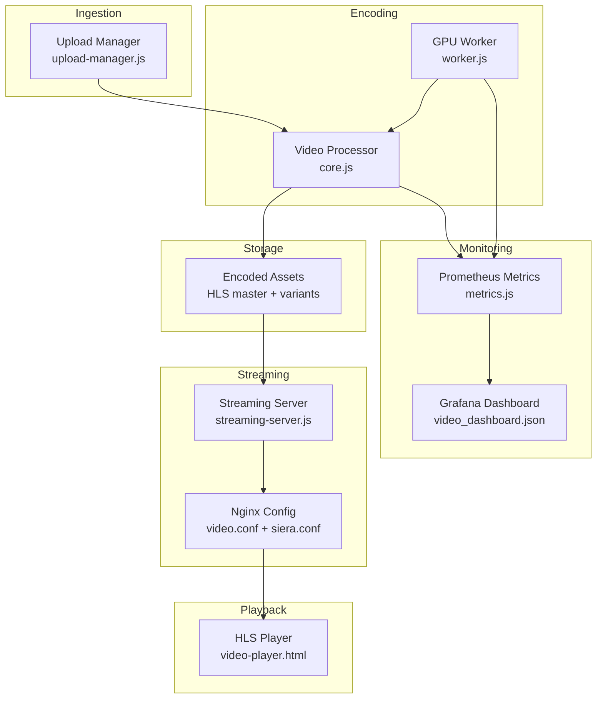
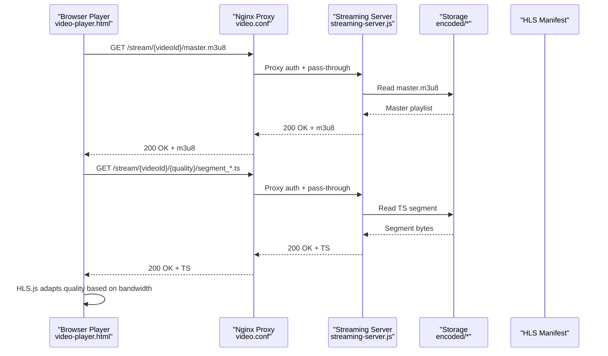
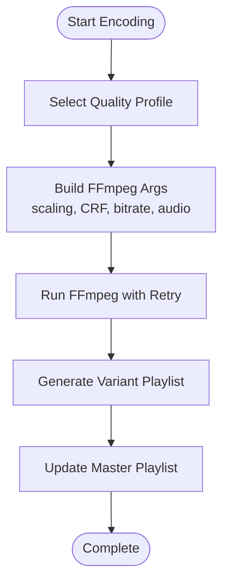
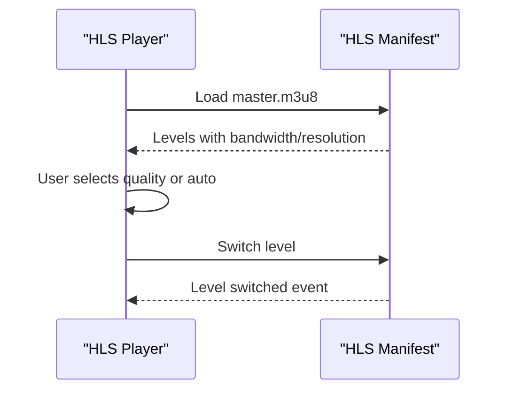
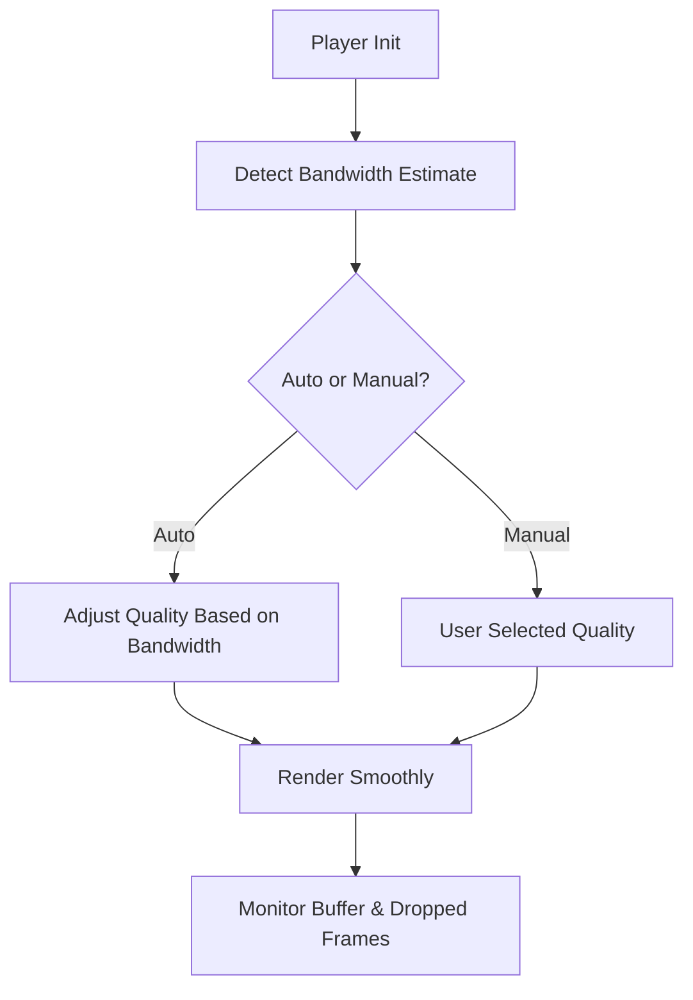
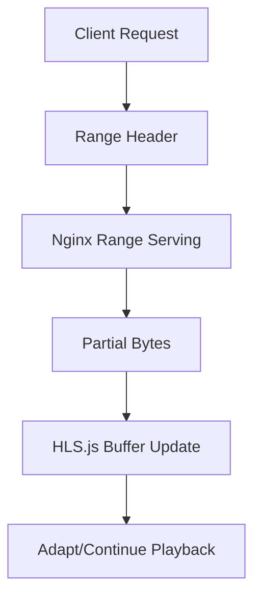
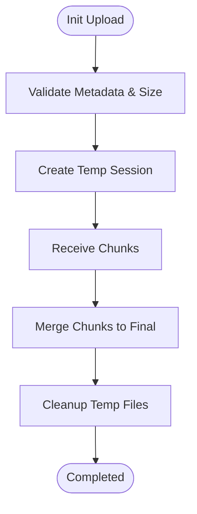
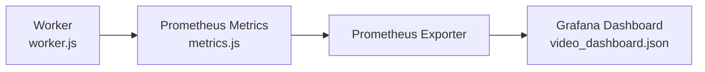
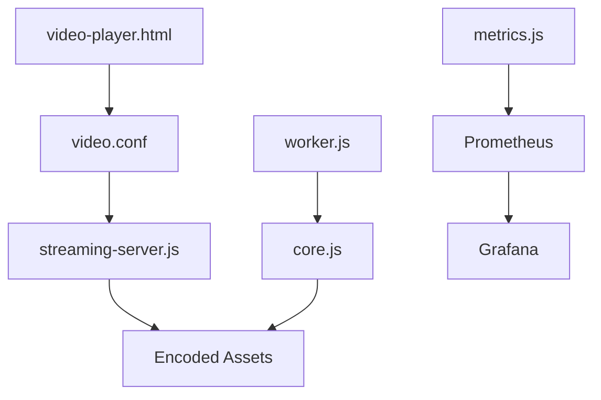

# Quality Adaptation and Optimization

<cite>
**Referenced Files in This Document**
- [video-player.html](file://public/video-player.html)
- [video-player.html](file://frontend/public/video-player.html)
- [core.js](file://services/video/processor/core.js)
- [upload-manager.js](file://services/video/processor/upload-manager.js)
- [streaming-server.js](file://services/video/processor/streaming-server.js)
- [server.js](file://services/video/streaming/server.js)
- [video.conf](file://infrastructure/nginx/conf.d/video.conf)
- [siera.conf](file://infrastructure/nginx/siera.conf)
- [metrics.js](file://services/video/worker/metrics.js)
- [worker.js](file://services/video/worker/worker.js)
- [subscription-manager.ts](file://services/subscription/src/subscription-manager.ts)
- [types.ts](file://services/subscription/src/types.ts)
- [video_dashboard.json](file://grafana/dashboards/video_dashboard.json)
- [prometheus.yml](file://prometheus/prometheus.yml)
</cite>

## Table of Contents
1. [Introduction](#introduction)
2. [Project Structure](#project-structure)
3. [Core Components](#core-components)
4. [Architecture Overview](#architecture-overview)
5. [Detailed Component Analysis](#detailed-component-analysis)
6. [Dependency Analysis](#dependency-analysis)
7. [Performance Considerations](#performance-considerations)
8. [Troubleshooting Guide](#troubleshooting-guide)
9. [Conclusion](#conclusion)
10. [Appendices](#appendices)

## Introduction
This document explains the video quality adaptation and optimization system across the platform. It covers adaptive bitrate streaming via HLS, dynamic quality switching, bandwidth-aware decisions, quality profile management, manifest generation, seamless transitions, buffer management, device/network optimizations, and monitoring. It also documents configuration examples for quality rules and performance monitoring.

## Project Structure
The video pipeline spans ingestion, encoding, storage, streaming, and client-side playback:
- Ingestion: Chunked upload manager validates and reassembles uploads.
- Encoding: FFmpeg-based encoder generates multiple quality profiles and HLS manifests.
- Storage: Encoded variants and manifests stored under a structured directory.
- Streaming: Node.js streaming server and Nginx proxy serve HLS/DASH with auth and caching.
- Playback: HLS.js-enabled player exposes quality selection and monitors stats.
- Monitoring: Prometheus metrics and Grafana dashboard for observability.

**Diagram sources**
- [upload-manager.js:1-235](file://services/video/processor/upload-manager.js#L1-L235)
- [core.js:1-572](file://services/video/processor/core.js#L1-L572)
- [worker.js:1-125](file://services/video/worker/worker.js#L1-L125)
- [streaming-server.js:1-549](file://services/video/processor/streaming-server.js#L1-L549)
- [video.conf:1-187](file://infrastructure/nginx/conf.d/video.conf#L1-L187)
- [siera.conf:1-228](file://infrastructure/nginx/siera.conf#L1-L228)
- [metrics.js:1-44](file://services/video/worker/metrics.js#L1-L44)
- [video-player.html:262-427](file://public/video-player.html#L262-L427)

**Section sources**
- [upload-manager.js:1-235](file://services/video/processor/upload-manager.js#L1-L235)
- [core.js:1-572](file://services/video/processor/core.js#L1-L572)
- [streaming-server.js:1-549](file://services/video/processor/streaming-server.js#L1-L549)
- [video.conf:1-187](file://infrastructure/nginx/conf.d/video.conf#L1-L187)
- [siera.conf:1-228](file://infrastructure/nginx/siera.conf#L1-L228)
- [metrics.js:1-44](file://services/video/worker/metrics.js#L1-L44)
- [worker.js:1-125](file://services/video/worker/worker.js#L1-L125)
- [video-player.html:262-427](file://public/video-player.html#L262-L427)

## Core Components
- Quality Profiles and Encoding: The encoder defines multiple presets and builds HLS variants with a master playlist and segment durations.
- Manifest Generation: HLS master playlist is generated with bandwidth and resolution metadata for client adaptation.
- Dynamic Quality Switching: The client selects quality levels exposed by the manifest; HLS.js emits level-switched events.
- Bandwidth Detection: Client-side bandwidth estimate is exposed by HLS.js; server-side network estimation is available for analytics.
- Buffer Management: HLS.js and Nginx range requests support smooth buffering; player displays buffered duration.
- Device/Network Optimizations: Nginx caching, keepalive, and open file cache reduce latency and CPU; HLS segment sizes tuned for low-latency mode.
- Monitoring: Prometheus metrics expose queue depth, processing duration, and errors; Grafana dashboard visualizes trends.

**Section sources**
- [core.js:27-35](file://services/video/processor/core.js#L27-L35)
- [core.js:268-318](file://services/video/processor/core.js#L268-L318)
- [core.js:461-477](file://services/video/processor/core.js#L461-L477)
- [video-player.html:289-301](file://public/video-player.html#L289-L301)
- [video-player.html:378-390](file://public/video-player.html#L378-L390)
- [streaming-server.js:514-521](file://services/video/processor/streaming-server.js#L514-L521)
- [video.conf:95-132](file://infrastructure/nginx/conf.d/video.conf#L95-L132)
- [metrics.js:10-31](file://services/video/worker/metrics.js#L10-L31)

## Architecture Overview
The system integrates ingestion, encoding, storage, streaming, and playback with robust caching and monitoring.

**Diagram sources**
- [video-player.html:278-301](file://public/video-player.html#L278-L301)
- [video.conf:74-158](file://infrastructure/nginx/conf.d/video.conf#L74-L158)
- [streaming-server.js:214-289](file://services/video/processor/streaming-server.js#L214-L289)
- [core.js:268-318](file://services/video/processor/core.js#L268-L318)

## Detailed Component Analysis

### Quality Profiles and Encoding
- Profiles define resolution, bitrate, and audio settings for multiple targets (e.g., 480p, 720p, 1080p).
- HLS encoding builds a master playlist and variant playlists with segment filenames and durations.
- FFmpeg arguments include scaling filters, CRF, maxrate/bufsize, and optional watermark overlays.

**Diagram sources**
- [core.js:27-35](file://services/video/processor/core.js#L27-L35)
- [core.js:268-318](file://services/video/processor/core.js#L268-L318)
- [core.js:341-390](file://services/video/processor/core.js#L341-L390)

**Section sources**
- [core.js:27-35](file://services/video/processor/core.js#L27-L35)
- [core.js:268-318](file://services/video/processor/core.js#L268-L318)
- [core.js:341-390](file://services/video/processor/core.js#L341-L390)

### Manifest Generation and Client Adaptation
- The HLS master playlist includes EXT-X-STREAM-INF entries with bandwidth and resolution for client adaptation.
- The client initializes HLS.js, parses the manifest, and exposes quality levels; switching triggers level change events.

**Diagram sources**
- [core.js:268-318](file://services/video/processor/core.js#L268-L318)
- [video-player.html:289-301](file://public/video-player.html#L289-L301)
- [video-player.html:360-371](file://public/video-player.html#L360-L371)

**Section sources**
- [core.js:268-318](file://services/video/processor/core.js#L268-L318)
- [video-player.html:289-301](file://public/video-player.html#L289-L301)
- [video-player.html:360-371](file://public/video-player.html#L360-L371)

### Dynamic Quality Switching and Bandwidth Detection
- Client detects bandwidth via HLS.js and switches quality automatically or manually.
- Server-side network conditions are estimable for analytics; client stats overlay displays buffer and dropped frames.

**Diagram sources**
- [video-player.html:289-301](file://public/video-player.html#L289-L301)
- [video-player.html:378-390](file://public/video-player.html#L378-L390)
- [streaming-server.js:514-521](file://services/video/processor/streaming-server.js#L514-L521)

**Section sources**
- [video-player.html:289-301](file://public/video-player.html#L289-L301)
- [video-player.html:378-390](file://public/video-player.html#L378-L390)
- [streaming-server.js:514-521](file://services/video/processor/streaming-server.js#L514-L521)

### Buffer Management Strategies
- HLS.js manages client-side buffer; the player displays buffered duration and allows seeking with range requests.
- Nginx enables Accept-Ranges and serves TS with sendfile and open file cache for efficient delivery.

**Diagram sources**
- [video-player.html:325-346](file://public/video-player.html#L325-L346)
- [video.conf:115-132](file://infrastructure/nginx/conf.d/video.conf#L115-L132)

**Section sources**
- [video-player.html:325-346](file://public/video-player.html#L325-L346)
- [video.conf:115-132](file://infrastructure/nginx/conf.d/video.conf#L115-L132)

### Client-Side Quality Adaptation
- The player exposes a quality menu derived from manifest levels; selecting “Auto” lets HLS.js choose.
- Stats overlay shows bandwidth, resolution, and buffer to inform user and developers.

**Section sources**
- [video-player.html:349-371](file://public/video-player.html#L349-L371)
- [video-player.html:378-390](file://public/video-player.html#L378-L390)

### Ingestion and Upload Management
- Upload manager validates metadata, enforces safe MIME types and extensions, and merges chunked uploads.
- Path sanitization prevents traversal; state persisted to disk for recovery.

**Diagram sources**
- [upload-manager.js:37-95](file://services/video/processor/upload-manager.js#L37-L95)
- [upload-manager.js:142-193](file://services/video/processor/upload-manager.js#L142-L193)

**Section sources**
- [upload-manager.js:37-95](file://services/video/processor/upload-manager.js#L37-L95)
- [upload-manager.js:142-193](file://services/video/processor/upload-manager.js#L142-L193)

### Streaming Server and Authentication
- Streaming server verifies tokens, serves HLS/DASH segments, and tracks playback sessions and segment delivery.
- Nginx proxies streaming requests, applies auth checks, and caches manifests and segments.

**Section sources**
- [streaming-server.js:19-29](file://services/video/processor/streaming-server.js#L19-L29)
- [streaming-server.js:214-289](file://services/video/processor/streaming-server.js#L214-L289)
- [video.conf:74-158](file://infrastructure/nginx/conf.d/video.conf#L74-L158)

### Device and Network Optimizations
- Nginx tuning: keepalive, sendfile, tcp_nopush/nodelay, open file cache, and immutable caching for TS.
- HLS low-latency mode enabled in player; short segment durations in encoder.
- GPU worker accelerates encoding; metrics track processing duration and failures.

**Section sources**
- [video.conf:115-132](file://infrastructure/nginx/conf.d/video.conf#L115-L132)
- [video.conf:96-106](file://infrastructure/nginx/conf.d/video.conf#L96-L106)
- [core.js:274-275](file://services/video/processor/core.js#L274-L275)
- [worker.js:79-83](file://services/video/worker/worker.js#L79-L83)
- [metrics.js:17-31](file://services/video/worker/metrics.js#L17-L31)

### Monitoring and Observability
- Prometheus metrics endpoint exposes queue depth, processing duration histogram, and error counters.
- Grafana dashboard consumes Prometheus metrics for visualization.

**Diagram sources**
- [worker.js:24-33](file://services/video/worker/worker.js#L24-L33)
- [metrics.js:10-44](file://services/video/worker/metrics.js#L10-L44)
- [video_dashboard.json](file://grafana/dashboards/video_dashboard.json)

**Section sources**
- [worker.js:24-33](file://services/video/worker/worker.js#L24-L33)
- [metrics.js:10-44](file://services/video/worker/metrics.js#L10-L44)
- [video_dashboard.json](file://grafana/dashboards/video_dashboard.json)

## Dependency Analysis
- Client depends on HLS.js and Nginx-managed streaming endpoints.
- Nginx depends on the streaming server for auth and passthrough.
- Streaming server depends on filesystem for HLS manifests and segments.
- Encoder depends on FFmpeg; GPU worker accelerates encoding.
- Monitoring depends on Prometheus and Grafana.

**Diagram sources**
- [video-player.html:278-301](file://public/video-player.html#L278-L301)
- [video.conf:74-158](file://infrastructure/nginx/conf.d/video.conf#L74-L158)
- [streaming-server.js:214-289](file://services/video/processor/streaming-server.js#L214-L289)
- [core.js:268-318](file://services/video/processor/core.js#L268-L318)
- [worker.js:79-83](file://services/video/worker/worker.js#L79-L83)
- [metrics.js:10-44](file://services/video/worker/metrics.js#L10-L44)

**Section sources**
- [video-player.html:278-301](file://public/video-player.html#L278-L301)
- [video.conf:74-158](file://infrastructure/nginx/conf.d/video.conf#L74-L158)
- [streaming-server.js:214-289](file://services/video/processor/streaming-server.js#L214-L289)
- [core.js:268-318](file://services/video/processor/core.js#L268-L318)
- [worker.js:79-83](file://services/video/worker/worker.js#L79-L83)
- [metrics.js:10-44](file://services/video/worker/metrics.js#L10-L44)

## Performance Considerations
- HLS segment duration: Short segments improve adaptation responsiveness; tune based on latency vs. overhead trade-offs.
- Buffering: Client-side buffering and Nginx open file cache reduce stalls; ensure adequate cache sizes for popular content.
- CDN and caching: Use CDN for global distribution; leverage immutable caching for TS and short cache for manifests.
- GPU acceleration: Offload encoding to GPU worker; monitor processing duration and errors via metrics.
- Network conditions: Use client bandwidth estimates for adaptive switching; server-side analytics can complement.

[No sources needed since this section provides general guidance]

## Troubleshooting Guide
- Authentication failures: Verify token verification and Nginx auth subrequest configuration.
- Missing segments: Confirm HLS manifest paths and filesystem permissions; check streaming server file reads.
- Slow adaptation: Reduce segment duration, enable low-latency mode, and monitor client bandwidth estimates.
- High latency: Tune Nginx keepalive, open file cache, and CPU scheduling; ensure GPU worker availability.
- Monitoring gaps: Validate Prometheus scraping and Grafana datasource configuration.

**Section sources**
- [streaming-server.js:19-29](file://services/video/processor/streaming-server.js#L19-L29)
- [video.conf:64-71](file://infrastructure/nginx/conf.d/video.conf#L64-L71)
- [video.conf:115-132](file://infrastructure/nginx/conf.d/video.conf#L115-L132)
- [metrics.js:10-44](file://services/video/worker/metrics.js#L10-L44)

## Conclusion
The platform implements a robust, scalable video quality adaptation system with HLS-based adaptive streaming, dynamic quality switching, and strong observability. By combining client-side bandwidth detection, optimized manifests, efficient caching, and GPU-accelerated encoding, it delivers smooth playback across diverse devices and network conditions while providing actionable insights through metrics and dashboards.

## Appendices

### Configuration Examples

- HLS Segment Duration and Manifest Generation
  - Encoder sets segment duration and writes master playlist with bandwidth/resolution entries.
  - Client uses HLS.js to adapt quality automatically.

  **Section sources**
  - [core.js:274-275](file://services/video/processor/core.js#L274-L275)
  - [core.js:268-318](file://services/video/processor/core.js#L268-L318)
  - [video-player.html:289-301](file://public/video-player.html#L289-L301)

- Client-Side Quality Menu
  - Populate quality options from manifest levels; “Auto” uses HLS.js selection.

  **Section sources**
  - [video-player.html:349-371](file://public/video-player.html#L349-L371)

- Nginx Streaming and Caching
  - Enable range requests, cache manifests and segments, and apply auth checks.

  **Section sources**
  - [video.conf:95-132](file://infrastructure/nginx/conf.d/video.conf#L95-L132)
  - [video.conf:74-158](file://infrastructure/nginx/conf.d/video.conf#L74-L158)

- Subscription-Based Quality Limits
  - Enforce plan-defined max quality and remaining time for access checks.

  **Section sources**
  - [subscription-manager.ts:197-231](file://services/subscription/src/subscription-manager.ts#L197-L231)
  - [types.ts:132-143](file://services/subscription/src/types.ts#L132-L143)

- Monitoring Setup
  - Expose Prometheus metrics endpoint and visualize with Grafana.

  **Section sources**
  - [worker.js:24-33](file://services/video/worker/worker.js#L24-L33)
  - [metrics.js:10-44](file://services/video/worker/metrics.js#L10-L44)
  - [video_dashboard.json](file://grafana/dashboards/video_dashboard.json)
  - [prometheus.yml](file://prometheus/prometheus.yml)