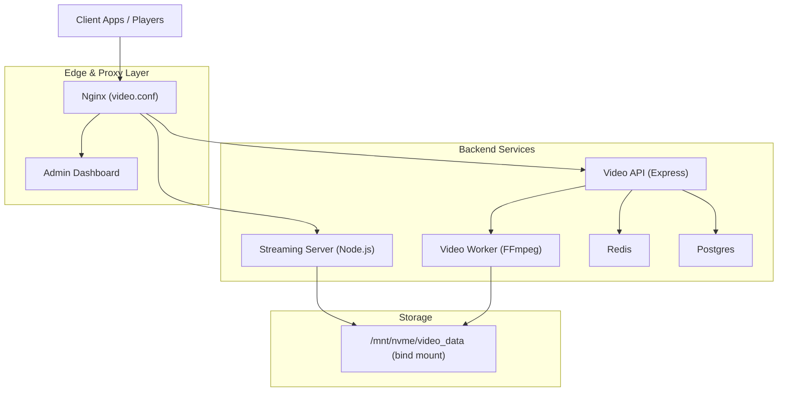
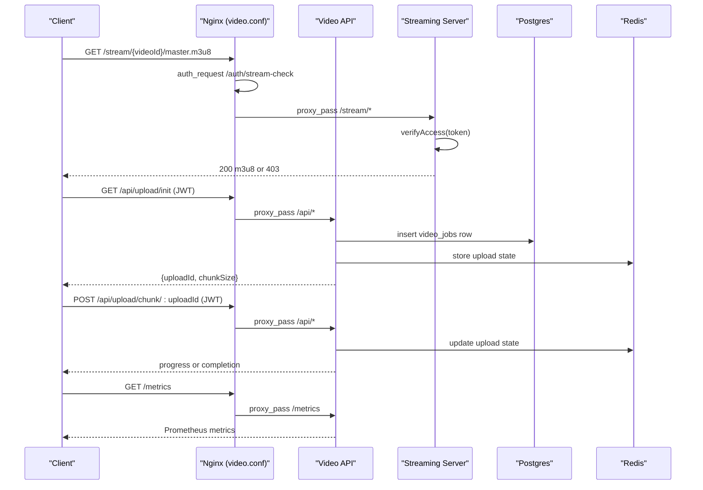
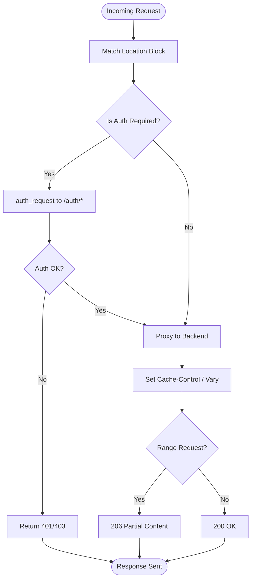
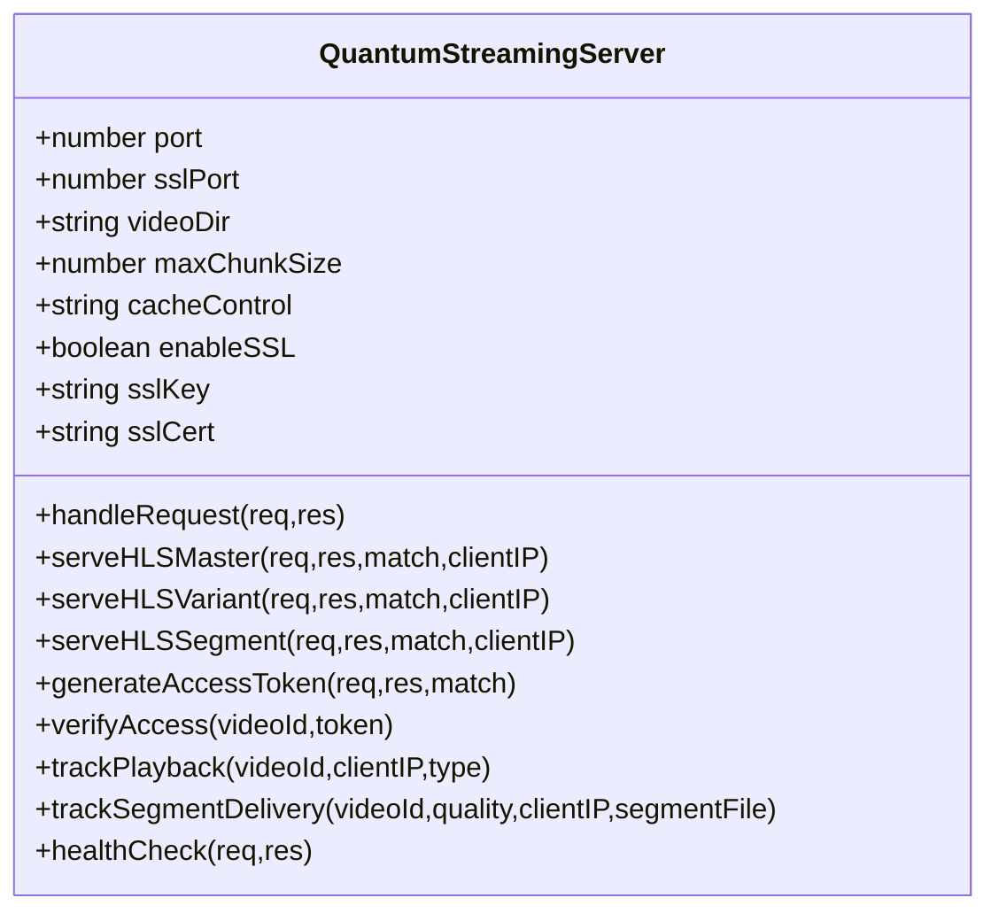
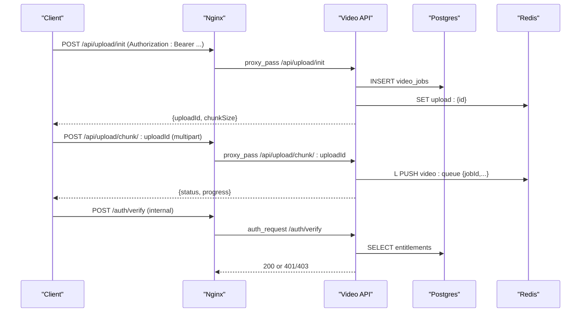
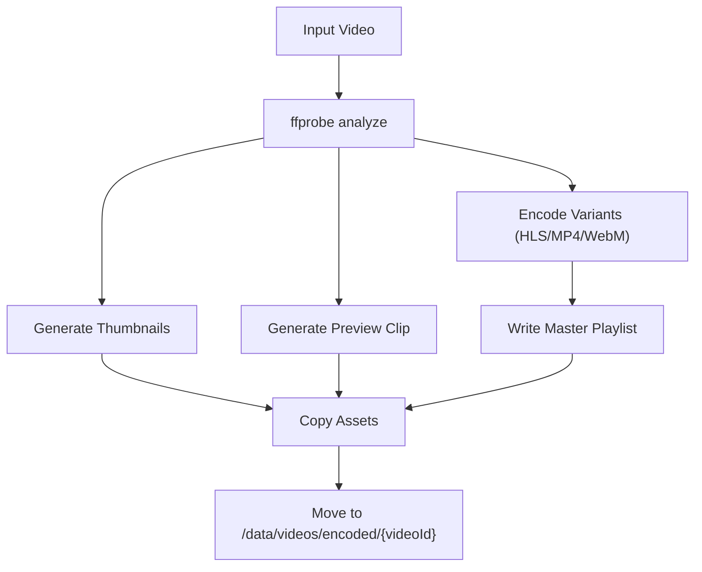
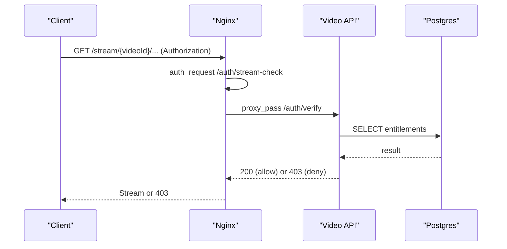
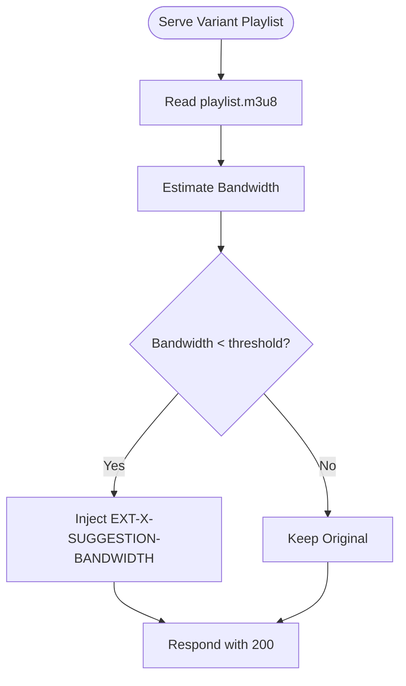
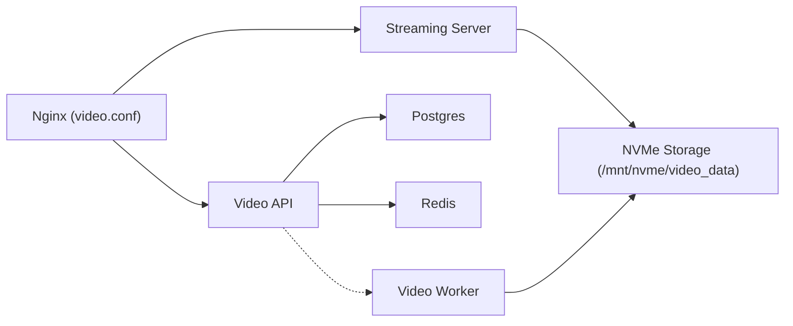

# Streaming Architecture

<cite>
**Referenced Files in This Document**
- [nginx.conf](file://infrastructure/nginx/nginx.conf)
- [video.conf](file://infrastructure/nginx/conf.d/video.conf)
- [siera.conf](file://infrastructure/nginx/siera.conf)
- [docker-compose.video.yml](file://docker-compose.video.yml)
- [server.js](file://services/video/api/server.js)
- [streaming-server.js](file://services/video/processor/streaming-server.js)
- [core.js](file://services/video/processor/core.js)
- [video_jobs.sql](file://database/video_jobs.sql)
- [server.js](file://backend/server.js)
</cite>

## Table of Contents
1. [Introduction](#introduction)
2. [Project Structure](#project-structure)
3. [Core Components](#core-components)
4. [Architecture Overview](#architecture-overview)
5. [Detailed Component Analysis](#detailed-component-analysis)
6. [Dependency Analysis](#dependency-analysis)
7. [Performance Considerations](#performance-considerations)
8. [Troubleshooting Guide](#troubleshooting-guide)
9. [Conclusion](#conclusion)
10. [Appendices](#appendices)

## Introduction
This document describes the video streaming architecture, focusing on HLS streaming implementation, adaptive bitrate streaming, and content delivery infrastructure. It explains the streaming server configuration, Nginx video streaming modules, and CDN integration patterns. It also documents manifest generation for HLS playlists, segment-based streaming, quality adaptation mechanisms, API endpoints for video streaming, authentication integration, and access control. Configuration examples for different streaming scenarios, bandwidth adaptation, and mobile optimization strategies are included.

## Project Structure
The streaming platform consists of:
- Nginx acting as a reverse proxy and caching layer for video APIs and streams
- A Node.js streaming server serving HLS/DASH manifests and segments
- An Express-based video API handling uploads, authentication verification, and metrics
- A video processing pipeline generating HLS variants and assets
- A shared Postgres database storing video job metadata and access control
- Docker Compose orchestrating services and mounting NVMe storage for fast I/O

**Diagram sources**
- [nginx.conf:1-49](file://infrastructure/nginx/nginx.conf#L1-L49)
- [video.conf:1-187](file://infrastructure/nginx/conf.d/video.conf#L1-L187)
- [docker-compose.video.yml:1-158](file://docker-compose.video.yml#L1-L158)
- [server.js:1-445](file://services/video/api/server.js#L1-L445)
- [streaming-server.js:1-550](file://services/video/processor/streaming-server.js#L1-L550)
- [core.js:1-572](file://services/video/processor/core.js#L1-L572)

**Section sources**
- [nginx.conf:1-49](file://infrastructure/nginx/nginx.conf#L1-L49)
- [video.conf:1-187](file://infrastructure/nginx/conf.d/video.conf#L1-L187)
- [docker-compose.video.yml:1-158](file://docker-compose.video.yml#L1-L158)

## Core Components
- Nginx video.conf: Proxies API and streaming endpoints, enforces auth via auth_request, applies rate limits, enables caching for manifests and segments, and sets security headers.
- Video API (Express): Handles upload initiation/chunking, JWT-based authentication, access verification for streaming URLs, Prometheus metrics, and health checks.
- Streaming Server (Node.js): Serves HLS/DASH manifests and segments, generates access tokens, tracks playback sessions, and adapts quality based on network conditions.
- Video Processor (FFmpeg): Encodes input into HLS variants, generates thumbnails and preview clips, writes master playlists, and moves outputs to persistent storage.
- Database: Stores video job metadata, access control checks, and storage usage for billing/reporting.
- Docker Compose: Orchestrates services, mounts NVMe-backed storage, and exposes streaming server and API internally.

**Section sources**
- [video.conf:1-187](file://infrastructure/nginx/conf.d/video.conf#L1-L187)
- [server.js:1-445](file://services/video/api/server.js#L1-L445)
- [streaming-server.js:1-550](file://services/video/processor/streaming-server.js#L1-L550)
- [core.js:1-572](file://services/video/processor/core.js#L1-L572)
- [video_jobs.sql:1-53](file://database/video_jobs.sql#L1-L53)
- [docker-compose.video.yml:1-158](file://docker-compose.video.yml#L1-L158)

## Architecture Overview
The system separates concerns across layers:
- Edge: Nginx handles TLS termination, auth subrequests, caching, and routing.
- API: Express service validates JWTs, verifies entitlements, and coordinates uploads and metrics.
- Streaming: Node.js server serves HLS/DASH with access tokens and optional bandwidth-adaptive suggestions.
- Processing: FFmpeg-based pipeline encodes variants and generates assets.
- Persistence: Postgres stores job state and access control; Redis supports upload state and queues.

**Diagram sources**
- [video.conf:63-71](file://infrastructure/nginx/conf.d/video.conf#L63-L71)
- [video.conf:160-168](file://infrastructure/nginx/conf.d/video.conf#L160-L168)
- [server.js:268-318](file://services/video/api/server.js#L268-L318)
- [server.js:320-351](file://services/video/api/server.js#L320-L351)
- [server.js:353-364](file://services/video/api/server.js#L353-L364)
- [streaming-server.js:144-193](file://services/video/processor/streaming-server.js#L144-L193)

## Detailed Component Analysis

### Nginx Video Streaming Module (video.conf)
Key responsibilities:
- Rate limiting for API and streaming endpoints
- Authentication via auth_request against internal endpoints
- Serving HLS/DASH manifests and segments with appropriate caching and headers
- Enabling range requests for seeking and zero-copy I/O for segments
- Internal auth endpoints for Nginx to verify JWTs and entitlements

**Diagram sources**
- [video.conf:10-11](file://infrastructure/nginx/conf.d/video.conf#L10-L11)
- [video.conf:63-71](file://infrastructure/nginx/conf.d/video.conf#L63-L71)
- [video.conf:160-168](file://infrastructure/nginx/conf.d/video.conf#L160-L168)
- [video.conf:95-132](file://infrastructure/nginx/conf.d/video.conf#L95-L132)

**Section sources**
- [video.conf:1-187](file://infrastructure/nginx/conf.d/video.conf#L1-L187)

### Streaming Server (Node.js)
Responsibilities:
- Route parsing for HLS/DASH manifests and segments
- Access token verification and session tracking
- Dynamic quality adaptation by injecting bandwidth hints in playlists
- Range request handling for seeking and efficient delivery
- Health checks and metrics exposure

**Diagram sources**
- [streaming-server.js:9-41](file://services/video/processor/streaming-server.js#L9-L41)
- [streaming-server.js:66-81](file://services/video/processor/streaming-server.js#L66-L81)
- [streaming-server.js:144-289](file://services/video/processor/streaming-server.js#L144-L289)
- [streaming-server.js:399-432](file://services/video/processor/streaming-server.js#L399-L432)
- [streaming-server.js:532-546](file://services/video/processor/streaming-server.js#L532-L546)

**Section sources**
- [streaming-server.js:1-550](file://services/video/processor/streaming-server.js#L1-L550)

### Video API (Express)
Responsibilities:
- JWT-based authentication middleware
- Upload initiation and chunk handling with validation and Redis state
- Access verification for streaming URLs by checking entitlements against Postgres
- Prometheus metrics aggregation and exposure
- Health checks and cleanup cron jobs

**Diagram sources**
- [server.js:268-318](file://services/video/api/server.js#L268-L318)
- [server.js:320-351](file://services/video/api/server.js#L320-L351)
- [server.js:353-364](file://services/video/api/server.js#L353-L364)

**Section sources**
- [server.js:1-445](file://services/video/api/server.js#L1-L445)
- [video_jobs.sql:1-53](file://database/video_jobs.sql#L1-L53)

### Video Processing Pipeline (FFmpeg)
Responsibilities:
- Analyze input video metadata
- Encode multiple quality variants for HLS
- Generate thumbnails and preview clips
- Write master playlists and move outputs to persistent storage
- Robust retry logic and progress reporting

**Diagram sources**
- [core.js:185-243](file://services/video/processor/core.js#L185-L243)
- [core.js:268-318](file://services/video/processor/core.js#L268-L318)
- [core.js:392-459](file://services/video/processor/core.js#L392-L459)
- [core.js:461-477](file://services/video/processor/core.js#L461-L477)

**Section sources**
- [core.js:1-572](file://services/video/processor/core.js#L1-L572)

### Access Control and Authentication
- Nginx auth_request verifies JWTs and entitlements for streaming URLs.
- The internal verification endpoint decodes JWTs and checks database for ownership/public access.
- Streaming server generates short-lived access tokens for clients when needed.

**Diagram sources**
- [video.conf:63-71](file://infrastructure/nginx/conf.d/video.conf#L63-L71)
- [video.conf:160-168](file://infrastructure/nginx/conf.d/video.conf#L160-L168)
- [server.js:320-351](file://services/video/api/server.js#L320-L351)

**Section sources**
- [video.conf:63-71](file://infrastructure/nginx/conf.d/video.conf#L63-L71)
- [server.js:320-351](file://services/video/api/server.js#L320-L351)

### Manifest Generation and Quality Adaptation
- HLS master playlist creation enumerates quality variants with bandwidth/resolution metadata.
- Variant playlists are served with short cache TTLs; segments are cached immutably.
- The streaming server can inject bandwidth hints into playlists for adaptive selection under constrained bandwidth.

**Diagram sources**
- [streaming-server.js:195-232](file://services/video/processor/streaming-server.js#L195-L232)
- [core.js:272-307](file://services/video/processor/core.js#L272-L307)

**Section sources**
- [core.js:268-318](file://services/video/processor/core.js#L268-L318)
- [streaming-server.js:195-232](file://services/video/processor/streaming-server.js#L195-L232)

### CDN Integration Patterns
- Nginx serves manifests and segments with long cache TTLs for immutable segments and short cache for playlists.
- Range requests enable efficient seeking and partial content delivery.
- CORS and security headers are applied for browser players.
- Consider placing Nginx behind a CDN for global distribution; ensure cache-control and vary headers are preserved.

**Section sources**
- [video.conf:95-132](file://infrastructure/nginx/conf.d/video.conf#L95-L132)

### API Endpoints for Video Streaming
- Upload
  - POST /api/upload/init (JWT required)
  - POST /api/upload/chunk/:uploadId (JWT required)
- Streaming
  - GET /stream/:videoId/master.m3u8 (JWT required)
  - GET /stream/:videoId/variant/:quality.m3u8 (JWT required)
  - GET /stream/:videoId/segment/:quality/segment_NNN.ts (JWT required)
  - GET /stream/:videoId/dash.mpd (placeholder)
  - GET /stream/:videoId/mp4/:quality.mp4 (JWT required)
  - GET /stream/:videoId/thumbnail/:index.jpg (public)
  - GET /stream/:videoId/preview.mp4 (public)
  - GET /stream/:videoId/info (placeholder)
  - GET /auth/token/:videoId (internal token generation)
- Internal Auth
  - POST /auth/verify (internal)
- Monitoring
  - GET /metrics (protected)
  - GET /health (public)

**Section sources**
- [server.js:268-318](file://services/video/api/server.js#L268-L318)
- [server.js:320-351](file://services/video/api/server.js#L320-L351)
- [streaming-server.js:66-81](file://services/video/processor/streaming-server.js#L66-L81)
- [video.conf:170-186](file://infrastructure/nginx/conf.d/video.conf#L170-L186)

## Dependency Analysis
- Nginx depends on internal auth endpoints in the Video API and Streaming Server.
- Video API depends on Postgres for entitlement checks and Redis for upload state.
- Streaming Server depends on filesystem-backed storage for encoded assets and optionally on Redis for session/state.
- Video Worker depends on FFmpeg and writes to the same storage used by the Streaming Server.

**Diagram sources**
- [video.conf:1-187](file://infrastructure/nginx/conf.d/video.conf#L1-L187)
- [docker-compose.video.yml:1-158](file://docker-compose.video.yml#L1-L158)
- [server.js:1-445](file://services/video/api/server.js#L1-L445)
- [streaming-server.js:1-550](file://services/video/processor/streaming-server.js#L1-L550)

**Section sources**
- [docker-compose.video.yml:1-158](file://docker-compose.video.yml#L1-L158)

## Performance Considerations
- Use NVMe-backed storage for fast I/O during streaming and processing.
- Enable sendfile and TCP tuning for zero-copy and reduced latency on segment delivery.
- Tune open_file_cache for frequently accessed segments to reduce filesystem overhead.
- Apply conservative cache-control policies: short cache for playlists, long immutable cache for segments.
- Limit concurrent encoding and enforce queue depth to prevent resource exhaustion.
- Monitor queue depth and upload durations via Prometheus metrics.

[No sources needed since this section provides general guidance]

## Troubleshooting Guide
Common issues and remedies:
- 401/403 on streaming: Verify JWT presence and validity; confirm entitlements in Postgres; check internal auth endpoint logs.
- Missing manifests or segments: Confirm FFmpeg encoding completed and outputs moved to storage; verify directory permissions.
- Slow playback: Inspect bandwidth estimation logic and playlist suggestion injection; review client-side buffering and network conditions.
- Upload failures: Check Redis connectivity and upload state TTLs; validate chunk sizes and indices; review cleanup cron jobs.
- Metrics endpoint access: Ensure only trusted IPs/networks can reach /metrics; verify Prometheus scraping configuration.

**Section sources**
- [server.js:320-351](file://services/video/api/server.js#L320-L351)
- [core.js:479-526](file://services/video/processor/core.js#L479-L526)
- [streaming-server.js:532-546](file://services/video/processor/streaming-server.js#L532-L546)

## Conclusion
The platform combines Nginx as a high-performance edge with a Node.js streaming server and an Express-based API to deliver secure, adaptive HLS/DASH streaming. FFmpeg-based encoding produces scalable quality variants, while robust caching and range requests optimize delivery. Access control is enforced at the edge and via internal auth endpoints, and metrics enable operational visibility.

[No sources needed since this section summarizes without analyzing specific files]

## Appendices

### Configuration Examples
- Nginx rate limits and caching for HLS/DASH:
  - Use limit_req zones for API and streaming endpoints.
  - Apply Cache-Control headers for m3u8 and .ts/.m4s files.
  - Enable range requests and sendfile for efficient segment delivery.
- Streaming server configuration:
  - Configure videoDir to point to mounted NVMe storage.
  - Adjust cacheControl and chunk sizes for your workload.
- Docker Compose:
  - Mount /mnt/nvme/video_data to the streaming and worker services.
  - Set GPU-enabled devices if using hardware acceleration.

**Section sources**
- [video.conf:9-132](file://infrastructure/nginx/conf.d/video.conf#L9-L132)
- [streaming-server.js:9-21](file://services/video/processor/streaming-server.js#L9-L21)
- [docker-compose.video.yml:145-151](file://docker-compose.video.yml#L145-L151)