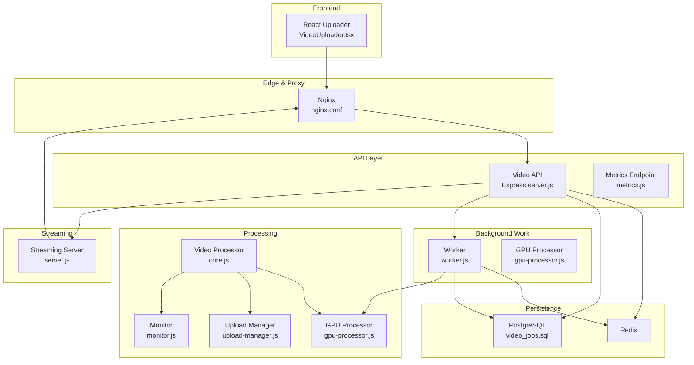
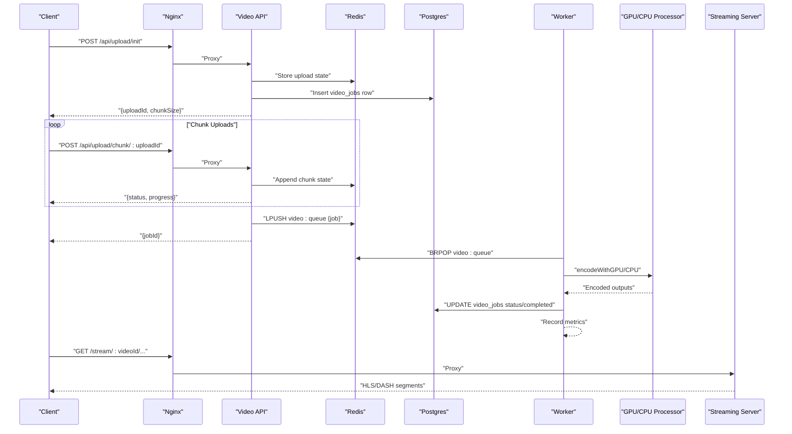
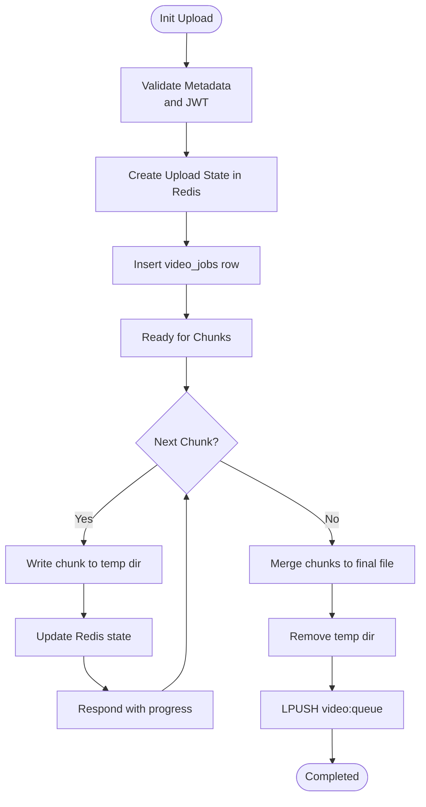
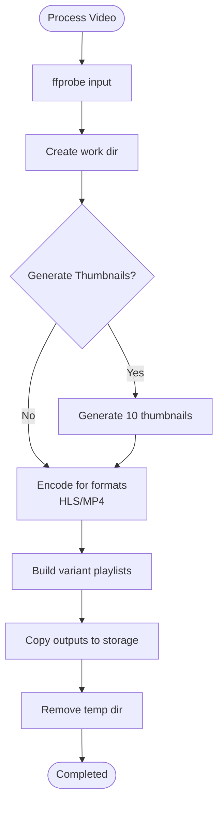
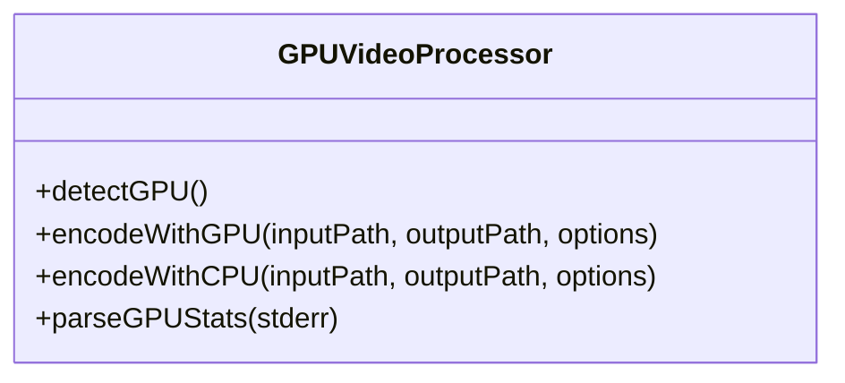
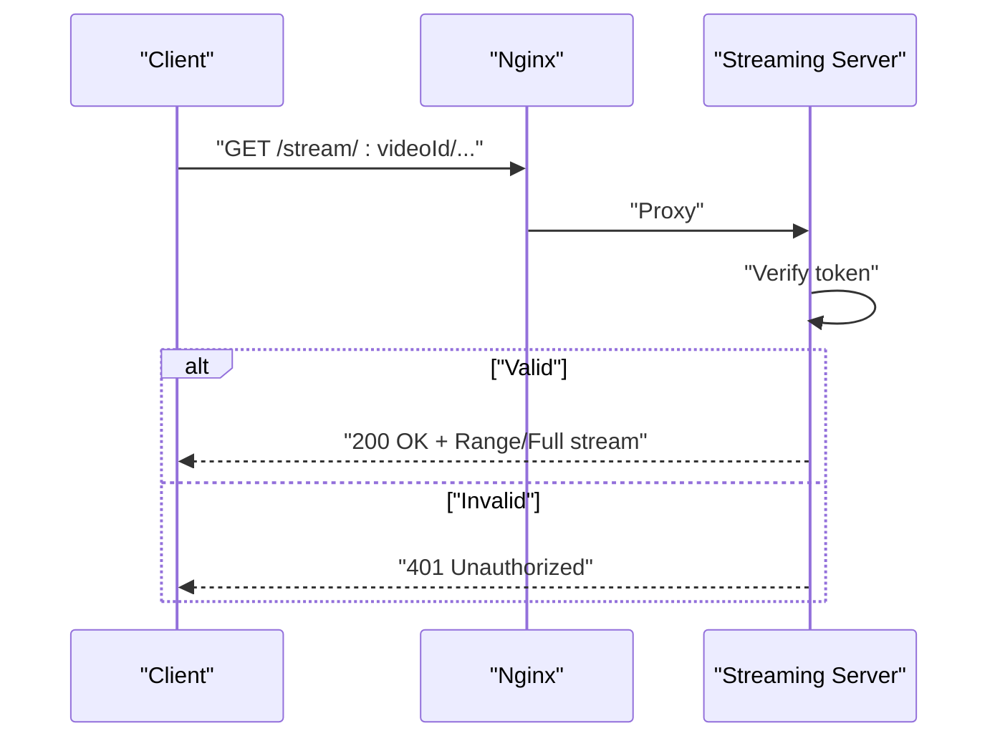
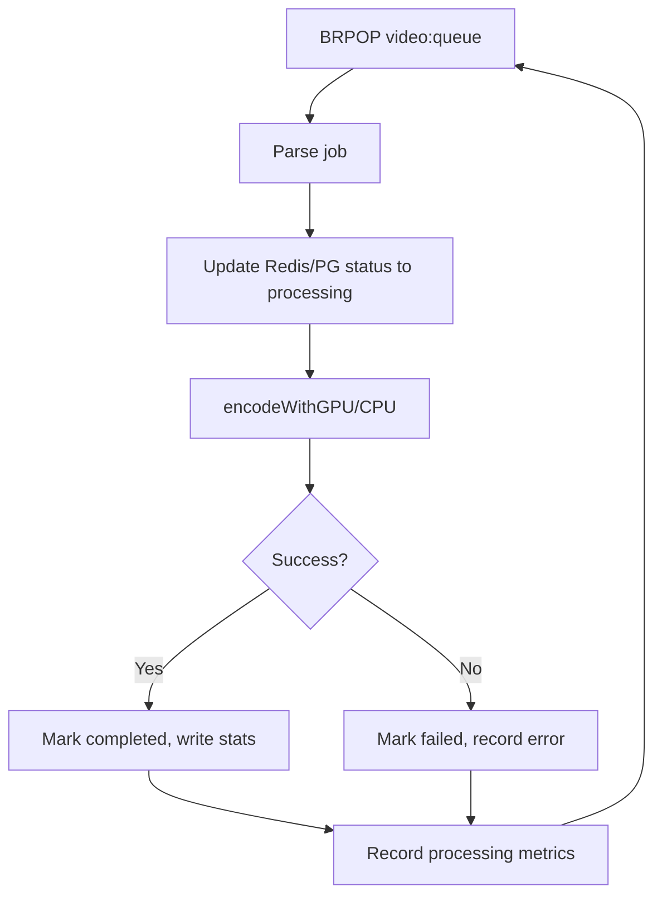
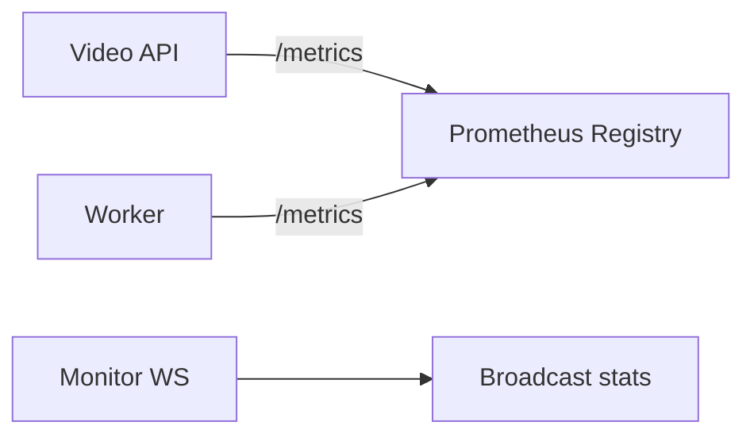
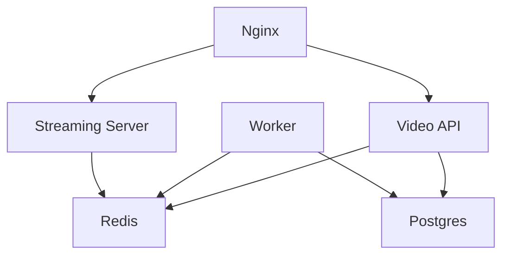

# Video Platform

<cite>
**Referenced Files in This Document**
- [server.js](file://services/video/api/server.js)
- [metrics.js](file://services/video/api/metrics.js)
- [server.js](file://services/video/processor/server.js)
- [core.js](file://services/video/processor/core.js)
- [gpu-processor.js](file://services/video/processor/gpu-processor.js)
- [upload-manager.js](file://services/video/processor/upload-manager.js)
- [monitor.js](file://services/video/processor/monitor.js)
- [server.js](file://services/video/streaming/server.js)
- [worker.js](file://services/video/worker/worker.js)
- [gpu-processor.js](file://services/video/worker/gpu-processor.js)
- [metrics.js](file://services/video/worker/metrics.js)
- [nginx.conf](file://infrastructure/nginx/nginx.conf)
- [docker-compose.video.yml](file://docker-compose.video.yml)
- [video_jobs.sql](file://database/video_jobs.sql)
- [VideoUploader.tsx](file://frontend/src/components/VideoUploader.tsx)
- [Player.tsx](file://frontend/src/pages/Player.tsx)
</cite>

## Table of Contents
1. [Introduction](#introduction)
2. [Project Structure](#project-structure)
3. [Core Components](#core-components)
4. [Architecture Overview](#architecture-overview)
5. [Detailed Component Analysis](#detailed-component-analysis)
6. [Dependency Analysis](#dependency-analysis)
7. [Performance Considerations](#performance-considerations)
8. [Troubleshooting Guide](#troubleshooting-guide)
9. [Conclusion](#conclusion)
10. [Appendices](#appendices)

## Introduction
This document describes the video platform’s processing pipeline, encoding/transcoding, streaming architecture, and quality adaptation. It covers the GPU-accelerated video processing workflow, multi-format encoding (HLS, MP4), adaptive bitrate streaming, the upload system, thumbnail generation, CDN integration, streaming server implementation, real-time features, quality optimization strategies, the video worker system for background processing, monitoring and metrics collection, and scaling considerations for video workloads.

## Project Structure
The video platform is composed of:
- API gateway and upload orchestration
- Video processing pipeline (Node.js + ffmpeg)
- GPU-accelerated encoder (CUDA/NVENC)
- Streaming server for HLS/DASH
- Background worker for batch processing
- Monitoring and metrics
- Infrastructure (Nginx proxy, Docker Compose)
- Frontend uploader and player

**Diagram sources**
- [server.js:1-445](file://services/video/api/server.js#L1-L445)
- [metrics.js:1-79](file://services/video/api/metrics.js#L1-L79)
- [server.js:1-137](file://services/video/processor/server.js#L1-L137)
- [core.js:1-572](file://services/video/processor/core.js#L1-L572)
- [gpu-processor.js:1-213](file://services/video/processor/gpu-processor.js#L1-L213)
- [upload-manager.js:1-235](file://services/video/processor/upload-manager.js#L1-L235)
- [monitor.js:1-104](file://services/video/processor/monitor.js#L1-L104)
- [worker.js:1-125](file://services/video/worker/worker.js#L1-L125)
- [gpu-processor.js:1-213](file://services/video/worker/gpu-processor.js#L1-L213)
- [server.js:1-128](file://services/video/streaming/server.js#L1-L128)
- [nginx.conf:1-49](file://infrastructure/nginx/nginx.conf#L1-L49)
- [docker-compose.video.yml:1-158](file://docker-compose.video.yml#L1-L158)
- [video_jobs.sql:1-53](file://database/video_jobs.sql#L1-L53)

**Section sources**
- [server.js:1-445](file://services/video/api/server.js#L1-L445)
- [server.js:1-137](file://services/video/processor/server.js#L1-L137)
- [core.js:1-572](file://services/video/processor/core.js#L1-L572)
- [gpu-processor.js:1-213](file://services/video/processor/gpu-processor.js#L1-L213)
- [upload-manager.js:1-235](file://services/video/processor/upload-manager.js#L1-L235)
- [monitor.js:1-104](file://services/video/processor/monitor.js#L1-L104)
- [worker.js:1-125](file://services/video/worker/worker.js#L1-L125)
- [gpu-processor.js:1-213](file://services/video/worker/gpu-processor.js#L1-L213)
- [server.js:1-128](file://services/video/streaming/server.js#L1-L128)
- [nginx.conf:1-49](file://infrastructure/nginx/nginx.conf#L1-L49)
- [docker-compose.video.yml:1-158](file://docker-compose.video.yml#L1-L158)
- [video_jobs.sql:1-53](file://database/video_jobs.sql#L1-L53)

## Core Components
- Video API: Handles JWT-authenticated upload initiation and chunked uploads, triggers processing, and exposes metrics.
- Video Processor: Orchestrates video analysis, thumbnail generation, preview creation, multi-format encoding, and manifest generation.
- GPU Processor: Detects GPU availability and performs CUDA/NVENC accelerated encoding with fallback to CPU.
- Upload Manager: Manages chunked uploads with safety checks, persistence, and recovery.
- Monitor: Provides WebSocket-based live monitoring of system stats and processing queues.
- Streaming Server: Serves HLS/DASH segments with token verification and range requests.
- Worker: Pulls jobs from Redis queue, processes with GPU/CPU, updates Postgres, and emits metrics.
- Metrics: Prometheus metrics for upload durations, queue depth, processing time, errors, and streaming counters.
- Infrastructure: Nginx proxies API and streams; Docker Compose defines services, GPU deployment, and persistent volumes.

**Section sources**
- [server.js:1-445](file://services/video/api/server.js#L1-L445)
- [core.js:1-572](file://services/video/processor/core.js#L1-L572)
- [gpu-processor.js:1-213](file://services/video/processor/gpu-processor.js#L1-L213)
- [upload-manager.js:1-235](file://services/video/processor/upload-manager.js#L1-L235)
- [monitor.js:1-104](file://services/video/processor/monitor.js#L1-L104)
- [server.js:1-128](file://services/video/streaming/server.js#L1-L128)
- [worker.js:1-125](file://services/video/worker/worker.js#L1-L125)
- [metrics.js:1-79](file://services/video/api/metrics.js#L1-L79)
- [metrics.js:1-44](file://services/video/worker/metrics.js#L1-L44)

## Architecture Overview
The platform implements a distributed, queue-driven architecture:
- Clients upload videos via chunked multipart requests to the Video API.
- Upload state is stored in Redis; merged file is written to persistent storage.
- On completion, the API pushes a processing job onto Redis and persists metadata in Postgres.
- The Worker consumes jobs, optionally using GPU acceleration, and writes encoded outputs.
- The Streaming Server serves HLS/DASH segments to clients behind Nginx.

**Diagram sources**
- [server.js:268-318](file://services/video/api/server.js#L268-L318)
- [worker.js:39-122](file://services/video/worker/worker.js#L39-L122)
- [server.js:31-113](file://services/video/streaming/server.js#L31-L113)
- [nginx.conf:25-41](file://infrastructure/nginx/nginx.conf#L25-L41)

**Section sources**
- [server.js:268-318](file://services/video/api/server.js#L268-L318)
- [worker.js:39-122](file://services/video/worker/worker.js#L39-L122)
- [server.js:31-113](file://services/video/streaming/server.js#L31-L113)
- [nginx.conf:25-41](file://infrastructure/nginx/nginx.conf#L25-L41)

## Detailed Component Analysis

### Video Upload System
- Authentication: All upload endpoints require a Bearer token verified by JWT.
- Validation: Zod schemas validate upload metadata and chunk payloads.
- Safety: Path sanitization prevents directory traversal; file type filtering restricts to known video MIME types.
- Chunked Upload: Clients split files into 5 MB chunks; the API stores each chunk and merges upon completion.
- Persistence: Upload state is persisted in Redis; a Postgres row tracks job lifecycle.
- Completion: On final chunk, the API merges chunks, cleans temporary files, and enqueues a processing job.

**Diagram sources**
- [server.js:132-263](file://services/video/api/server.js#L132-L263)
- [server.js:268-318](file://services/video/api/server.js#L268-L318)

**Section sources**
- [server.js:49-65](file://services/video/api/server.js#L49-L65)
- [server.js:67-79](file://services/video/api/server.js#L67-L79)
- [server.js:98-130](file://services/video/api/server.js#L98-L130)
- [server.js:132-263](file://services/video/api/server.js#L132-L263)
- [server.js:268-318](file://services/video/api/server.js#L268-L318)

### Video Processing Pipeline
- Concurrency: The processor maintains a bounded concurrency pool and a queued job list.
- Analysis: Uses ffprobe to extract duration, resolution, codec, and stream details.
- Thumbnails: Generates thumbnails at 10% intervals with scaling and JPEG quality tuning.
- Preview: Creates a short preview clip starting near the 25th percentile.
- Encoding: Supports HLS and MP4; scales to target resolutions and applies CRF/vbr bitrate control.
- Manifests: Generates HLS master playlist and optional DASH manifests.
- Storage: Copies outputs to final storage and cleans temporary directories.

**Diagram sources**
- [core.js:60-183](file://services/video/processor/core.js#L60-L183)
- [core.js:245-390](file://services/video/processor/core.js#L245-L390)
- [core.js:392-459](file://services/video/processor/core.js#L392-L459)
- [core.js:461-477](file://services/video/processor/core.js#L461-L477)

**Section sources**
- [core.js:7-38](file://services/video/processor/core.js#L7-L38)
- [core.js:60-183](file://services/video/processor/core.js#L60-L183)
- [core.js:245-390](file://services/video/processor/core.js#L245-L390)
- [core.js:392-459](file://services/video/processor/core.js#L392-L459)
- [core.js:461-477](file://services/video/processor/core.js#L461-L477)

### GPU-Accelerated Encoding
- Detection: Queries GPU via nvidia-smi; falls back to CPU if unavailable.
- CUDA/NVENC: Uses hardware acceleration with tuned presets, lookahead, AQ, and bitrate controls.
- Stats Parsing: Parses FFmpeg logs to extract GPU utilization, memory usage, and FPS.
- Timeout Handling: Enforces a 1-hour timeout to avoid hanging encodes.

**Diagram sources**
- [gpu-processor.js:43-210](file://services/video/processor/gpu-processor.js#L43-L210)
- [gpu-processor.js:43-210](file://services/video/worker/gpu-processor.js#L43-L210)

**Section sources**
- [gpu-processor.js:50-135](file://services/video/processor/gpu-processor.js#L50-L135)
- [gpu-processor.js:137-187](file://services/video/processor/gpu-processor.js#L137-L187)
- [gpu-processor.js:189-210](file://services/video/processor/gpu-processor.js#L189-L210)
- [gpu-processor.js:50-135](file://services/video/worker/gpu-processor.js#L50-L135)
- [gpu-processor.js:137-187](file://services/video/worker/gpu-processor.js#L137-L187)
- [gpu-processor.js:189-210](file://services/video/worker/gpu-processor.js#L189-L210)

### Streaming Server Implementation
- Token Verification: Accepts Authorization header or token query param; verifies JWT against configured secret.
- Static Serving: Serves HLS/DASH segments and playlists; supports HTTP range requests for seeking.
- CORS: Allows GET/OPTIONS with wildcard origin for development.
- Health: Exposes a simple health endpoint.

**Diagram sources**
- [server.js:31-113](file://services/video/streaming/server.js#L31-L113)

**Section sources**
- [server.js:19-29](file://services/video/streaming/server.js#L19-L29)
- [server.js:58-113](file://services/video/streaming/server.js#L58-L113)

### Worker System and Background Processing
- Queue Consumption: Uses blocking BRPOP to pull jobs from Redis; processes serially with exponential backoff on transient errors.
- Status Updates: Writes job status to Redis hash and Postgres concurrently.
- Output Handling: Encodes to a single output path; records GPU stats in Postgres metadata.
- Metrics: Tracks queue depth, processing duration, and error counts.

**Diagram sources**
- [worker.js:39-122](file://services/video/worker/worker.js#L39-L122)

**Section sources**
- [worker.js:39-122](file://services/video/worker/worker.js#L39-L122)
- [metrics.js:1-44](file://services/video/worker/metrics.js#L1-L44)

### Monitoring and Metrics
- Video API Metrics: Upload duration histogram, upload size counter, queue depth gauge, processing time histogram, error counters, and streaming counters.
- Worker Metrics: Queue depth gauge, processing time histogram, error counters.
- Live Monitoring: WebSocket endpoint broadcasts system stats, queue sizes, and active job progress.

**Diagram sources**
- [metrics.js:1-79](file://services/video/api/metrics.js#L1-L79)
- [metrics.js:1-44](file://services/video/worker/metrics.js#L1-L44)
- [monitor.js:15-32](file://services/video/processor/monitor.js#L15-L32)

**Section sources**
- [metrics.js:10-77](file://services/video/api/metrics.js#L10-L77)
- [metrics.js:10-42](file://services/video/worker/metrics.js#L10-L42)
- [monitor.js:34-100](file://services/video/processor/monitor.js#L34-L100)

### Frontend Integration
- Uploader: Initializes upload sessions, slices files into 5 MB chunks, uploads with concurrency control, polls job status, and notifies completion.
- Player: Demonstrates audio-video synchronization and cue-driven content rendering; integrates with wallet billing logic.

**Section sources**
- [VideoUploader.tsx:78-258](file://frontend/src/components/VideoUploader.tsx#L78-L258)
- [Player.tsx:173-290](file://frontend/src/pages/Player.tsx#L173-L290)

## Dependency Analysis
- Inter-service dependencies:
  - API depends on Redis for upload state and queueing, and Postgres for job metadata.
  - Worker depends on Redis for queue consumption and Postgres for status updates.
  - Streaming server depends on Redis for session tracking and JWT verification.
  - Nginx proxies API and streaming traffic to respective services.
- External tools:
  - ffmpeg/ffprobe for media analysis and encoding.
  - nvidia-smi for GPU detection in GPU-enabled environments.

**Diagram sources**
- [server.js:81-95](file://services/video/api/server.js#L81-L95)
- [worker.js:13-19](file://services/video/worker/worker.js#L13-L19)
- [server.js:13-17](file://services/video/streaming/server.js#L13-L17)
- [nginx.conf:9-15](file://infrastructure/nginx/nginx.conf#L9-L15)

**Section sources**
- [server.js:81-95](file://services/video/api/server.js#L81-L95)
- [worker.js:13-19](file://services/video/worker/worker.js#L13-L19)
- [server.js:13-17](file://services/video/streaming/server.js#L13-L17)
- [nginx.conf:9-15](file://infrastructure/nginx/nginx.conf#L9-L15)

## Performance Considerations
- GPU Acceleration: Prefer NVENC on NVIDIA GPUs; fallback to CPU libx264 with tuned presets and CRF for compatibility.
- Concurrency: Limit concurrent processing to match CPU/GPU capacity; adjust queue depth and worker count accordingly.
- I/O: Use SSD-backed persistent volumes for uploads and encoded outputs; separate temp and storage directories.
- Network: Chunk size of 5 MB balances throughput and resilience; enforce rate limits at the API boundary.
- Streaming: Use HLS/DASH with appropriate segment durations; enable range requests for seeking and buffering.
- Metrics: Track queue depth, processing latency, and error rates to auto-scale workers and optimize resource allocation.

[No sources needed since this section provides general guidance]

## Troubleshooting Guide
- Authentication failures:
  - Ensure JWT_SECRET is set in production and tokens are included in Authorization headers.
- Upload failures:
  - Verify allowed MIME types and file size limits; check Redis connectivity and disk permissions.
- Processing errors:
  - Inspect ffprobe output parsing and ffmpeg logs; confirm GPU drivers and nvidia-smi availability.
- Streaming access denied:
  - Confirm JWT verification and user entitlement checks; ensure Nginx proxies /stream/ to the streaming server.
- Metrics not updating:
  - Verify Prometheus scraping endpoints and registry content type.

**Section sources**
- [server.js:25-27](file://services/video/api/server.js#L25-L27)
- [server.js:106-114](file://services/video/api/server.js#L106-L114)
- [gpu-processor.js:50-68](file://services/video/processor/gpu-processor.js#L50-L68)
- [server.js:19-29](file://services/video/streaming/server.js#L19-L29)
- [metrics.js:65-66](file://services/video/api/metrics.js#L65-L66)

## Conclusion
The platform provides a robust, scalable video pipeline with chunked uploads, multi-format encoding, adaptive streaming, and comprehensive monitoring. GPU acceleration is integrated with graceful fallback, while Redis and Postgres coordinate state and queues. Nginx proxies API and streaming traffic, enabling CDN-friendly HLS/DASH delivery. Metrics and monitoring support operational visibility and optimization.

[No sources needed since this section summarizes without analyzing specific files]

## Appendices

### Database Schema Highlights
- video_jobs: Tracks job lifecycle, progress, status, and metadata for encoding options and outputs.
- video_storage_usage: Optional table for storage usage tracking by user and file type.

**Section sources**
- [video_jobs.sql:4-53](file://database/video_jobs.sql#L4-L53)

### Infrastructure Scaling Notes
- GPU scheduling: Use NVIDIA runtime and visible devices in Docker Compose; scale workers horizontally.
- Persistent storage: Bind host NVMe for high-throughput reads/writes.
- Horizontal scaling: Run multiple workers behind a single Redis queue; ensure Postgres and Redis are HA-ready.

**Section sources**
- [docker-compose.video.yml:61-67](file://docker-compose.video.yml#L61-L67)
- [docker-compose.video.yml:145-151](file://docker-compose.video.yml#L145-L151)