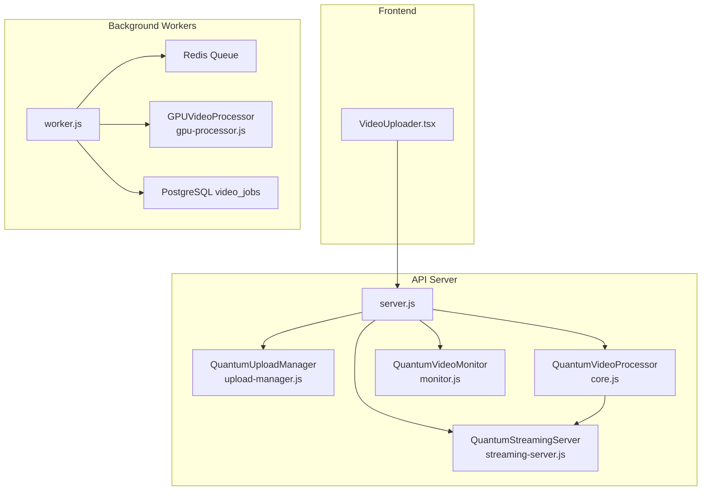
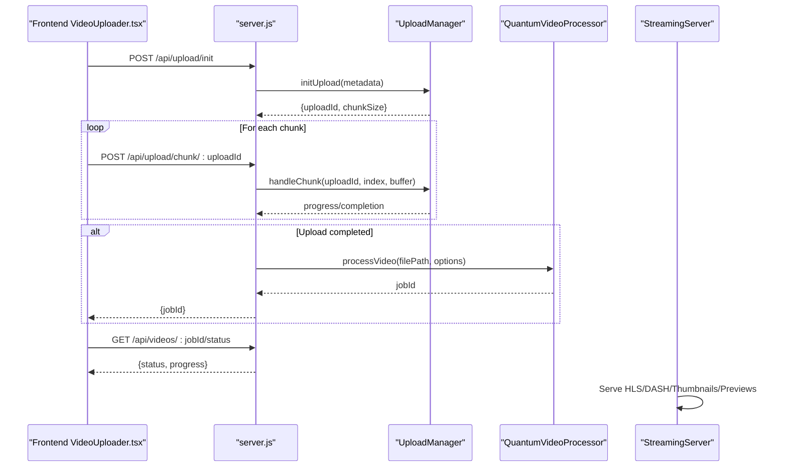
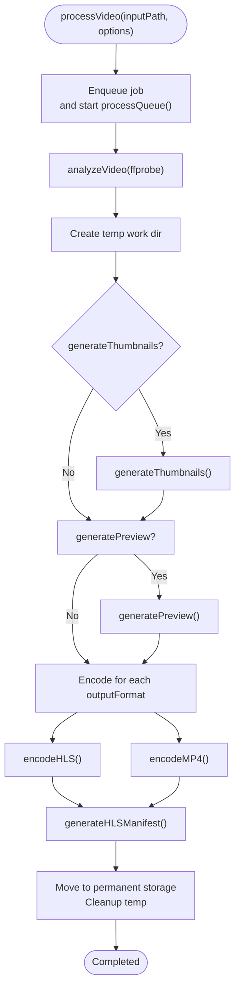
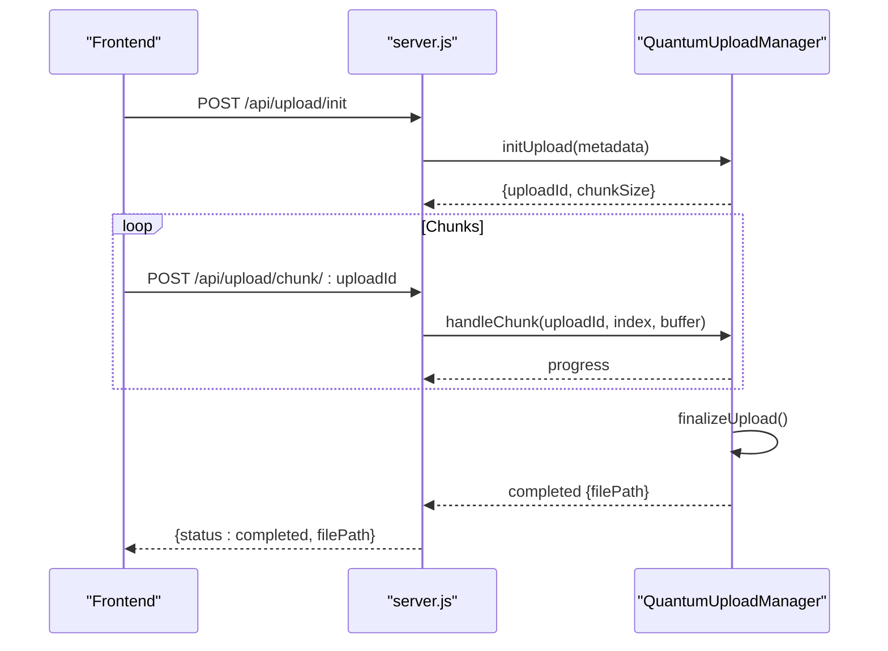
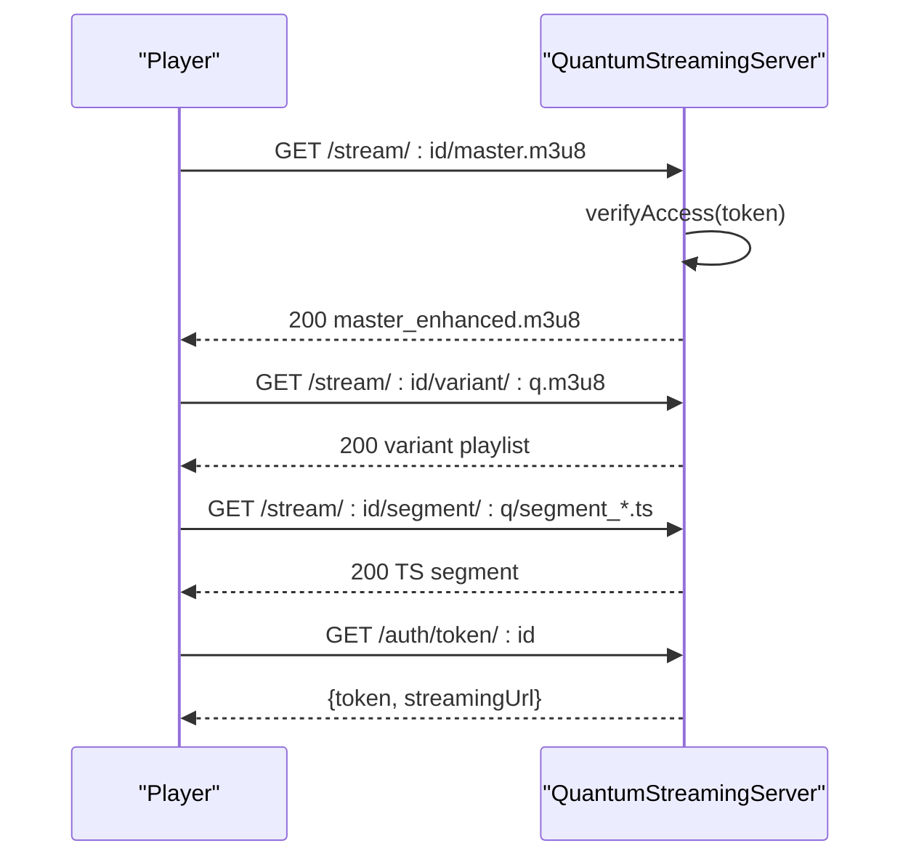
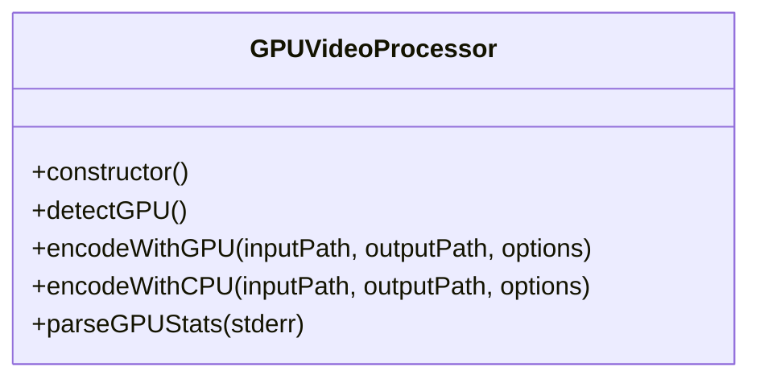
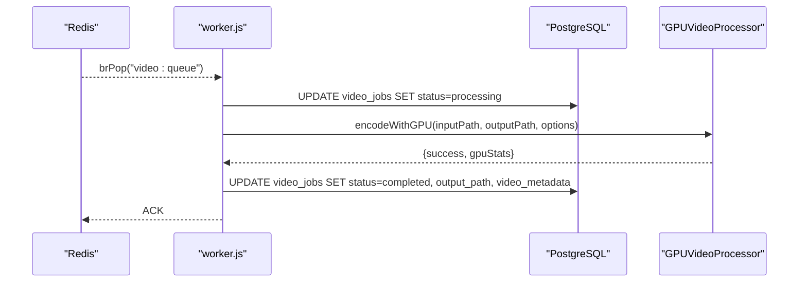
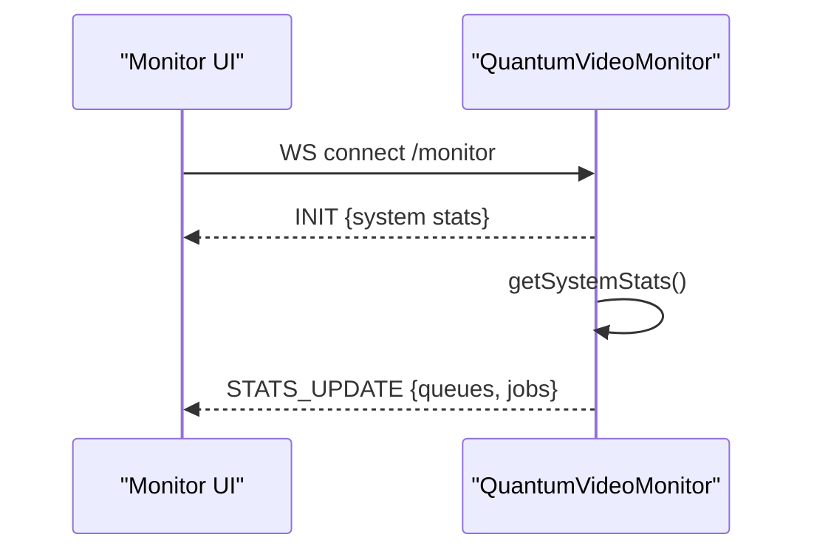
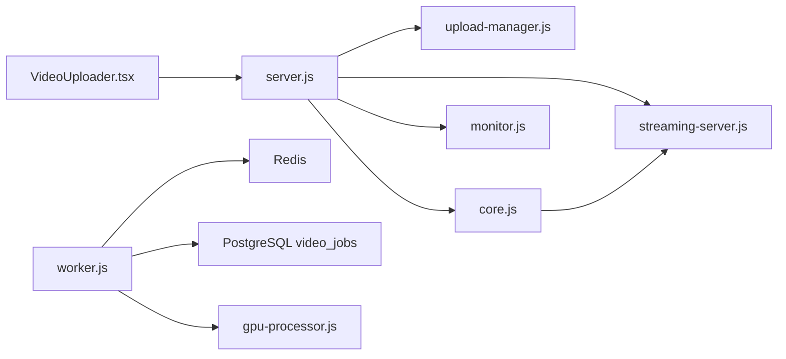

# Video Processing Pipeline

<cite>
**Referenced Files in This Document**
- [core.js](file://services/video/processor/core.js)
- [upload-manager.js](file://services/video/processor/upload-manager.js)
- [server.js](file://services/video/processor/server.js)
- [streaming-server.js](file://services/video/processor/streaming-server.js)
- [gpu-processor.js](file://services/video/processor/gpu-processor.js)
- [worker.js](file://services/video/worker/worker.js)
- [metrics.js](file://services/video/worker/metrics.js)
- [monitor.js](file://services/video/processor/monitor.js)
- [video_jobs.sql](file://database/video_jobs.sql)
- [VideoUploader.tsx](file://frontend/src/components/VideoUploader.tsx)
</cite>

## Table of Contents
1. [Introduction](#introduction)
2. [Project Structure](#project-structure)
3. [Core Components](#core-components)
4. [Architecture Overview](#architecture-overview)
5. [Detailed Component Analysis](#detailed-component-analysis)
6. [Dependency Analysis](#dependency-analysis)
7. [Performance Considerations](#performance-considerations)
8. [Troubleshooting Guide](#troubleshooting-guide)
9. [Conclusion](#conclusion)
10. [Appendices](#appendices)

## Introduction
This document describes the video processing pipeline that powers upload, analysis, encoding, and streaming of educational video content. It covers the QuantumVideoProcessor class architecture, job queue management, multi-format encoding workflow, and the end-to-end lifecycle from upload to storage and playback. It also explains concurrent job processing, progress tracking, error handling with retries, directory structure for temporary and permanent storage, and the ffmpeg command construction process.

## Project Structure
The video subsystem is composed of:
- An upload manager for chunked uploads with safety checks and recovery
- A processing core that orchestrates video analysis, thumbnail generation, preview creation, and format conversion
- A streaming server that serves HLS/DASH variants and static assets
- A worker that consumes jobs from Redis and performs GPU-accelerated encoding
- A monitoring component that exposes system and queue statistics via WebSocket
- A frontend uploader that drives the upload and polling UX

**Diagram sources**
- [server.js:11-57](file://services/video/processor/server.js#L11-L57)
- [upload-manager.js:17-30](file://services/video/processor/upload-manager.js#L17-L30)
- [core.js:7-38](file://services/video/processor/core.js#L7-L38)
- [monitor.js:5-13](file://services/video/processor/monitor.js#L5-L13)
- [streaming-server.js:9-41](file://services/video/processor/streaming-server.js#L9-L41)
- [worker.js:13-21](file://services/video/worker/worker.js#L13-L21)
- [gpu-processor.js:43-48](file://services/video/processor/gpu-processor.js#L43-L48)

**Section sources**
- [server.js:11-57](file://services/video/processor/server.js#L11-L57)
- [upload-manager.js:17-30](file://services/video/processor/upload-manager.js#L17-L30)
- [core.js:7-38](file://services/video/processor/core.js#L7-L38)
- [monitor.js:5-13](file://services/video/processor/monitor.js#L5-L13)
- [streaming-server.js:9-41](file://services/video/processor/streaming-server.js#L9-L41)
- [worker.js:13-21](file://services/video/worker/worker.js#L13-L21)
- [gpu-processor.js:43-48](file://services/video/processor/gpu-processor.js#L43-L48)

## Core Components
- QuantumVideoProcessor: Orchestrates video analysis, thumbnail generation, preview creation, multi-format encoding, manifest generation, and final storage movement. Implements a queue with concurrency control and progress tracking.
- QuantumUploadManager: Manages chunked uploads with validation, recovery, and completion triggers.
- QuantumStreamingServer: Serves HLS/DASH manifests and segments, thumbnails, previews, and handles access tokens and rate limits.
- GPUVideoProcessor: Performs hardware-accelerated encoding with fallback to CPU and parses GPU runtime stats.
- Worker: Consumes jobs from Redis, updates statuses in PostgreSQL, and invokes GPUVideoProcessor.
- Monitor: Provides WebSocket stats for system, queues, and active jobs.

**Section sources**
- [core.js:7-183](file://services/video/processor/core.js#L7-L183)
- [upload-manager.js:17-193](file://services/video/processor/upload-manager.js#L17-L193)
- [streaming-server.js:9-550](file://services/video/processor/streaming-server.js#L9-L550)
- [gpu-processor.js:43-213](file://services/video/processor/gpu-processor.js#L43-L213)
- [worker.js:39-122](file://services/video/worker/worker.js#L39-L122)
- [monitor.js:5-101](file://services/video/processor/monitor.js#L5-L101)

## Architecture Overview
The pipeline integrates frontend upload, API orchestration, background processing, and streaming delivery:
- Frontend uploads files via chunked multipart requests
- API validates and merges chunks, then enqueues processing
- Background worker pulls jobs, encodes with GPU/CPU, writes outputs, and updates DB
- Streaming server serves HLS/DASH and static assets with access control and analytics

**Diagram sources**
- [VideoUploader.tsx:84-177](file://frontend/src/components/VideoUploader.tsx#L84-L177)
- [server.js:62-98](file://services/video/processor/server.js#L62-L98)
- [upload-manager.js:37-193](file://services/video/processor/upload-manager.js#L37-L193)
- [core.js:60-183](file://services/video/processor/core.js#L60-L183)
- [streaming-server.js:144-391](file://services/video/processor/streaming-server.js#L144-L391)

## Detailed Component Analysis

### QuantumVideoProcessor
Responsibilities:
- Queue management with concurrency control
- Video analysis using ffprobe
- Thumbnail generation at 10% intervals
- Preview clip generation
- Multi-format encoding (HLS, MP4) with configurable qualities
- Manifest generation for HLS
- Final storage movement and cleanup
- Progress reporting and error handling with retries

Key behaviors:
- Initializes directories for temp and storage
- Processes jobs sequentially respecting maxConcurrent
- Emits progress updates and status transitions
- Uses ffmpeg with retry logic and robust argument building

**Diagram sources**
- [core.js:60-183](file://services/video/processor/core.js#L60-L183)
- [core.js:185-243](file://services/video/processor/core.js#L185-L243)
- [core.js:268-339](file://services/video/processor/core.js#L268-L339)
- [core.js:461-477](file://services/video/processor/core.js#L461-L477)

**Section sources**
- [core.js:7-38](file://services/video/processor/core.js#L7-L38)
- [core.js:60-183](file://services/video/processor/core.js#L60-L183)
- [core.js:185-243](file://services/video/processor/core.js#L185-L243)
- [core.js:245-339](file://services/video/processor/core.js#L245-L339)
- [core.js:341-390](file://services/video/processor/core.js#L341-L390)
- [core.js:392-459](file://services/video/processor/core.js#L392-L459)
- [core.js:461-477](file://services/video/processor/core.js#L461-L477)
- [core.js:479-526](file://services/video/processor/core.js#L479-L526)
- [core.js:545-568](file://services/video/processor/core.js#L545-L568)

### Upload Manager
Responsibilities:
- Validates upload metadata and MIME types
- Creates upload sessions with uploadId
- Writes chunk files and tracks progress
- Merges chunks into final file
- Verifies size and cleans up temp state
- Emits progress and completion events

**Diagram sources**
- [VideoUploader.tsx:84-177](file://frontend/src/components/VideoUploader.tsx#L84-L177)
- [server.js:62-98](file://services/video/processor/server.js#L62-L98)
- [upload-manager.js:37-193](file://services/video/processor/upload-manager.js#L37-L193)

**Section sources**
- [upload-manager.js:17-30](file://services/video/processor/upload-manager.js#L17-L30)
- [upload-manager.js:37-193](file://services/video/processor/upload-manager.js#L37-L193)
- [upload-manager.js:195-231](file://services/video/processor/upload-manager.js#L195-L231)

### Streaming Server
Responsibilities:
- Serves HLS master and variant playlists
- Serves DASH manifests (placeholder)
- Serves thumbnails and preview clips
- Generates access tokens and verifies entitlement
- Applies rate limiting and caching headers
- Tracks playback sessions and analytics

**Diagram sources**
- [streaming-server.js:144-391](file://services/video/processor/streaming-server.js#L144-L391)
- [streaming-server.js:399-432](file://services/video/processor/streaming-server.js#L399-L432)

**Section sources**
- [streaming-server.js:9-550](file://services/video/processor/streaming-server.js#L9-L550)

### GPU Video Processor
Responsibilities:
- Detects GPU availability and computes capabilities
- Encodes with NVENC when available, falls back to CPU x264
- Parses GPU runtime stats from ffmpeg stderr
- Enforces timeouts and validates arguments

**Diagram sources**
- [gpu-processor.js:43-213](file://services/video/processor/gpu-processor.js#L43-L213)

**Section sources**
- [gpu-processor.js:43-213](file://services/video/processor/gpu-processor.js#L43-L213)

### Worker and Metrics
Responsibilities:
- Connects to Redis and PostgreSQL
- Blocks on video:queue and processes jobs
- Updates job status and output metadata
- Exposes Prometheus metrics for queue depth and processing duration

**Diagram sources**
- [worker.js:39-122](file://services/video/worker/worker.js#L39-L122)
- [gpu-processor.js:70-135](file://services/video/processor/gpu-processor.js#L70-L135)

**Section sources**
- [worker.js:39-122](file://services/video/worker/worker.js#L39-L122)
- [metrics.js:10-43](file://services/video/worker/metrics.js#L10-L43)

### Monitoring
Responsibilities:
- WebSocket server at /monitor
- Broadcasts system stats, queue sizes, and active jobs
- Periodic updates every 2 seconds

**Diagram sources**
- [monitor.js:15-101](file://services/video/processor/monitor.js#L15-L101)

**Section sources**
- [monitor.js:5-101](file://services/video/processor/monitor.js#L5-L101)

## Dependency Analysis
- API server composes UploadManager, QuantumVideoProcessor, StreamingServer, and Monitor
- Worker depends on Redis queue and PostgreSQL for persistence
- GPUVideoProcessor encapsulates ffmpeg invocation and GPU detection
- Frontend depends on API endpoints for upload and status polling

**Diagram sources**
- [server.js:11-57](file://services/video/processor/server.js#L11-L57)
- [worker.js:13-21](file://services/video/worker/worker.js#L13-L21)
- [gpu-processor.js:43-48](file://services/video/processor/gpu-processor.js#L43-L48)

**Section sources**
- [server.js:11-57](file://services/video/processor/server.js#L11-L57)
- [worker.js:13-21](file://services/video/worker/worker.js#L13-L21)

## Performance Considerations
- Concurrency control: QuantumVideoProcessor limits active jobs to avoid resource contention
- Retry with exponential backoff: ffmpeg runs are retried up to a configured maximum
- GPU acceleration: NVENC is preferred when available; otherwise falls back to CPU x264
- Chunked uploads: Reduces memory pressure and enables resumable transfers
- HLS segmentation: Fixed segment durations optimize buffering and startup latency
- Metrics: Prometheus metrics track queue depth and processing duration for capacity planning

[No sources needed since this section provides general guidance]

## Troubleshooting Guide
Common issues and remedies:
- Upload failures: Validate MIME type and file size constraints; check chunk indices and totals; ensure temp directories are writable
- Processing errors: Inspect ffprobe output parsing; verify ffmpeg availability and arguments; review retry logs
- GPU encoding failures: Confirm GPU detection and driver; fallback to CPU encoding is automatic
- Streaming access denied: Ensure valid access token and correct videoId; check expiration and verification logic
- Queue backlog: Monitor Redis queue depth and worker throughput; scale workers or reduce concurrency

**Section sources**
- [upload-manager.js:37-193](file://services/video/processor/upload-manager.js#L37-L193)
- [core.js:479-526](file://services/video/processor/core.js#L479-L526)
- [gpu-processor.js:118-135](file://services/video/processor/gpu-processor.js#L118-L135)
- [streaming-server.js:434-451](file://services/video/processor/streaming-server.js#L434-L451)
- [worker.js:39-122](file://services/video/worker/worker.js#L39-L122)

## Conclusion
The video processing pipeline combines robust upload handling, flexible encoding with GPU acceleration, and efficient streaming delivery. Its modular design supports scalability via Redis queues and PostgreSQL persistence, while the frontend provides a responsive upload experience with progress tracking and status polling.

[No sources needed since this section summarizes without analyzing specific files]

## Appendices

### Directory Structure
Temporary and permanent storage locations:
- Temp: Used for staging work directories and chunked uploads
- Storage: Organized into originals, encoded, HLS, thumbnails, and previews
- Uploads: Separate temp area for chunked uploads before merge

**Section sources**
- [core.js:40-58](file://services/video/processor/core.js#L40-L58)
- [upload-manager.js:32-35](file://services/video/processor/upload-manager.js#L32-L35)

### Processing Configurations and Quality Profiles
- Output formats: HLS and MP4 (DASH/WebM placeholders)
- Quality profiles: 240p through 4K with bitrate and audio settings
- Encoding options: CRF, scaling filters, watermark overlay, and format-specific flags

**Section sources**
- [core.js:20-35](file://services/video/processor/core.js#L20-L35)
- [core.js:245-339](file://services/video/processor/core.js#L245-L339)
- [core.js:341-390](file://services/video/processor/core.js#L341-L390)

### ffmpeg Command Construction
- Video codec selection: h264 for MP4, vp9 for WebM when implemented
- Scaling filter maintains aspect ratio with letterboxing
- Watermark overlay supported via overlay filter
- HLS/DASH specific flags and segment filenames
- MP4 faststart optimization

**Section sources**
- [core.js:341-390](file://services/video/processor/core.js#L341-L390)

### Database Schema for Jobs and Storage Tracking
- video_jobs table stores job lifecycle, progress, and metadata
- video_storage_usage tracks storage consumption by type and user

**Section sources**
- [video_jobs.sql:4-53](file://database/video_jobs.sql#L4-L53)