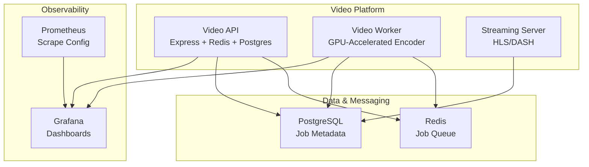
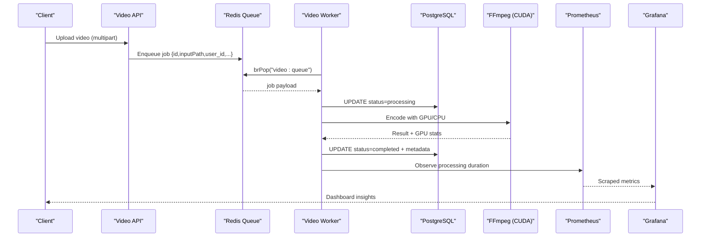
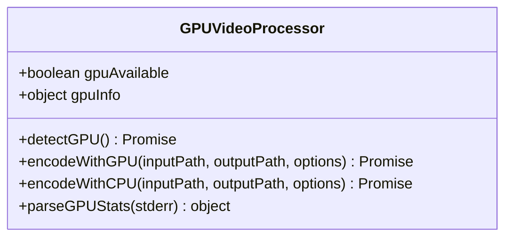
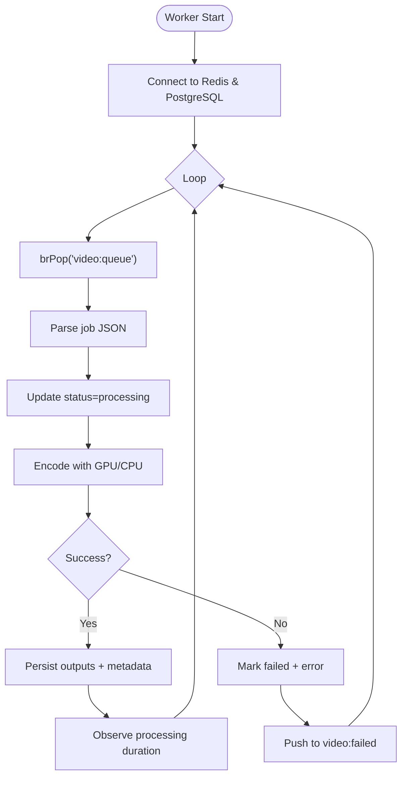
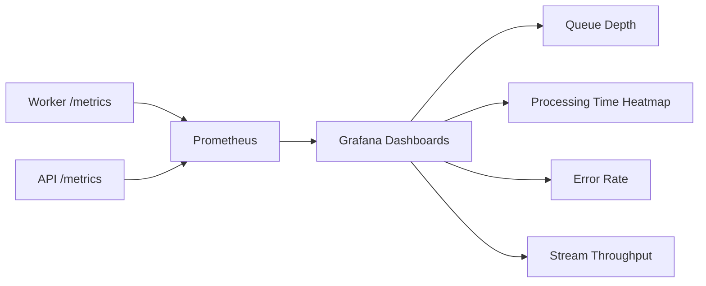
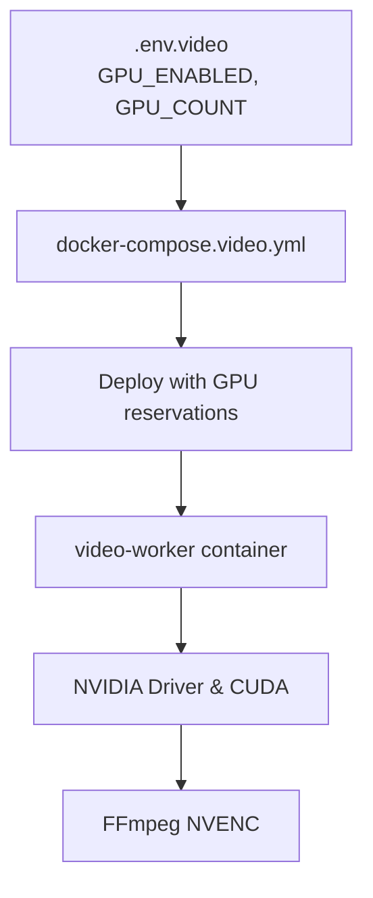
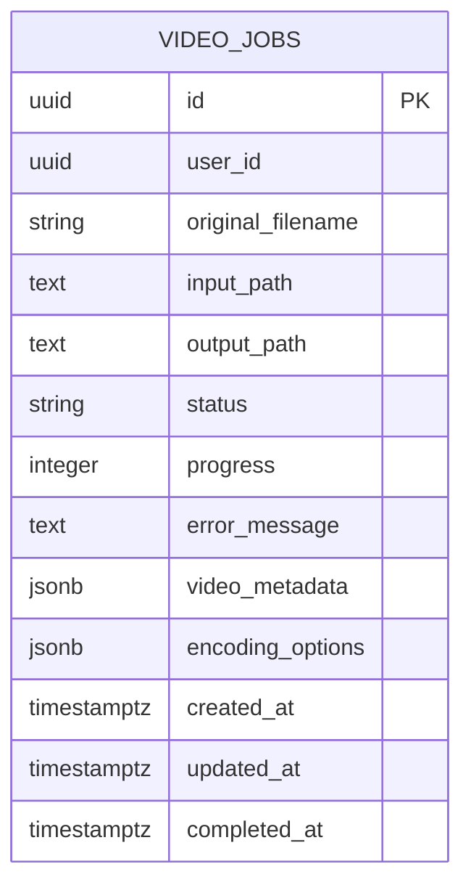
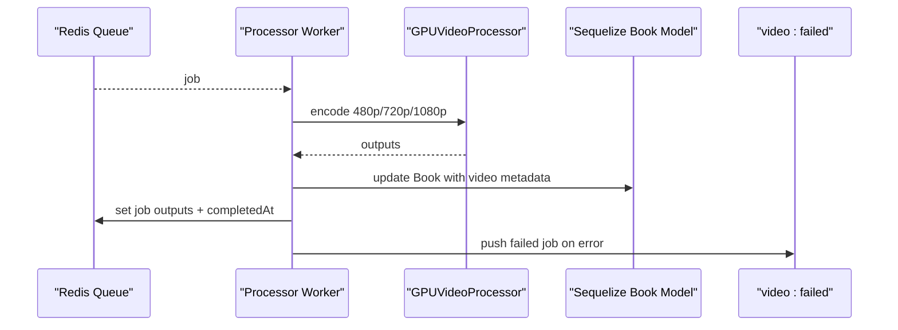
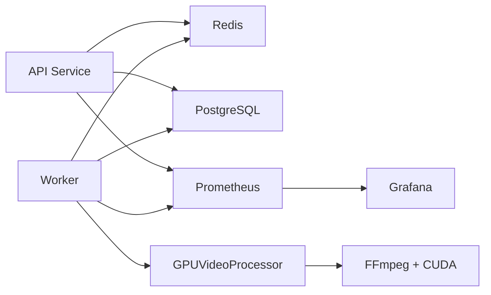

# Video Worker System

<cite>
**Referenced Files in This Document**
- [docker-compose.video.yml](file://docker-compose.video.yml)
- [setup-gpu.sh](file://setup-gpu.sh)
- [gpu-processor.js](file://services/video/worker/gpu-processor.js)
- [worker.js](file://services/video/worker/worker.js)
- [metrics.js](file://services/video/worker/metrics.js)
- [video_jobs.sql](file://database/video_jobs.sql)
- [video_dashboard.json](file://grafana/dashboards/video_dashboard.json)
- [prometheus.yml](file://infrastructure/monitoring/prometheus.yml)
- [Dockerfile.gpu](file://services/video/worker/Dockerfile.gpu)
- [metrics.js](file://services/video/api/metrics.js)
- [monitor.js](file://services/video/processor/monitor.js)
- [worker.js](file://services/video/processor/worker.js)
- [package.json](file://services/video/processor/package.json)
- [package.json](file://services/video/worker/package.json)
</cite>

## Table of Contents
1. [Introduction](#introduction)
2. [Project Structure](#project-structure)
3. [Core Components](#core-components)
4. [Architecture Overview](#architecture-overview)
5. [Detailed Component Analysis](#detailed-component-analysis)
6. [Dependency Analysis](#dependency-analysis)
7. [Performance Considerations](#performance-considerations)
8. [Troubleshooting Guide](#troubleshooting-guide)
9. [Conclusion](#conclusion)
10. [Appendices](#appendices)

## Introduction
This document describes the video worker system architecture for background job processing, monitoring and metrics collection, and GPU resource management. It explains worker pool configuration, job prioritization, failure recovery mechanisms, and metrics collection for video processing performance, GPU utilization tracking, and queue management. It also documents GPU processor integration for accelerated video encoding, resource allocation strategies, and scaling considerations, including examples of worker configuration, monitoring dashboards, and performance tuning guidelines.

## Project Structure
The video worker system spans three primary areas:
- API and upload pipeline: Express-based service exposing upload endpoints and metrics, backed by Redis and PostgreSQL.
- Worker processes: Dedicated background workers that consume jobs from Redis, process videos using GPU acceleration when available, and persist results to PostgreSQL.
- Monitoring and observability: Prometheus metrics exposed by workers and API, collected by Prometheus, and visualized in Grafana dashboards.

**Diagram sources**
- [docker-compose.video.yml:6-100](file://docker-compose.video.yml#L6-L100)
- [metrics.js:1-79](file://services/video/api/metrics.js#L1-L79)
- [metrics.js:1-44](file://services/video/worker/metrics.js#L1-L44)
- [prometheus.yml:1-12](file://infrastructure/monitoring/prometheus.yml#L1-L12)
- [video_dashboard.json:1-51](file://grafana/dashboards/video_dashboard.json#L1-L51)

**Section sources**
- [docker-compose.video.yml:1-158](file://docker-compose.video.yml#L1-L158)

## Core Components
- GPU Video Processor: Detects GPU availability, selects hardware-accelerated or CPU fallback encoding, parses GPU utilization metrics from FFmpeg logs, and executes FFmpeg with CUDA hardware acceleration.
- Worker: Connects to Redis and PostgreSQL, processes jobs from the queue, updates statuses, persists outputs and metadata, and records Prometheus metrics.
- Metrics: Exposes queue depth, processing duration histograms, and error counters for both API and worker.
- Job Schema: Defines video_jobs table with status tracking, progress, error messages, and JSON metadata for encoding options and outputs.
- Monitoring: WebSocket-based live monitoring for system stats and queue states; Grafana dashboard consumes Prometheus metrics.

**Section sources**
- [gpu-processor.js:43-210](file://services/video/worker/gpu-processor.js#L43-L210)
- [worker.js:39-122](file://services/video/worker/worker.js#L39-L122)
- [metrics.js:1-44](file://services/video/worker/metrics.js#L1-L44)
- [video_jobs.sql:4-19](file://database/video_jobs.sql#L4-L19)
- [monitor.js:5-101](file://services/video/processor/monitor.js#L5-L101)

## Architecture Overview
The system uses Redis as a distributed job queue and PostgreSQL for durable job metadata. Workers pull jobs in a loop, process them with GPU acceleration when available, and update both Redis hash maps and Postgres rows. Prometheus scrapes metrics from the API and worker endpoints, and Grafana renders dashboards for queue depth, processing latency, and error rates.

**Diagram sources**
- [worker.js:39-122](file://services/video/worker/worker.js#L39-L122)
- [gpu-processor.js:70-135](file://services/video/worker/gpu-processor.js#L70-L135)
- [metrics.js:17-23](file://services/video/worker/metrics.js#L17-L23)
- [prometheus.yml:4-11](file://infrastructure/monitoring/prometheus.yml#L4-L11)
- [video_dashboard.json:6-39](file://grafana/dashboards/video_dashboard.json#L6-L39)

## Detailed Component Analysis

### GPU Video Processor
The GPU processor encapsulates detection of NVIDIA GPUs, hardware-accelerated encoding with CUDA, CPU fallback, and parsing of GPU utilization metrics from FFmpeg stderr. It validates inputs and constructs safe FFmpeg argument arrays to mitigate injection risks.

**Diagram sources**
- [gpu-processor.js:43-210](file://services/video/worker/gpu-processor.js#L43-L210)

Key behaviors:
- GPU detection via system command and fallback to CPU when unavailable.
- Hardware acceleration using CUDA with NVENC for H.264 encoding and CUDA scale filter.
- Robust argument construction and timeout handling for FFmpeg subprocess.
- Parsing of GPU utilization, memory usage, encoder utilization, and FPS from FFmpeg output.

**Section sources**
- [gpu-processor.js:50-135](file://services/video/worker/gpu-processor.js#L50-L135)
- [gpu-processor.js:189-209](file://services/video/worker/gpu-processor.js#L189-L209)

### Worker: Background Job Processing
The worker connects to Redis and PostgreSQL, processes jobs in a continuous loop, updates statuses, writes outputs, and records metrics. It supports graceful error handling and basic failure recovery by pushing failed jobs to a dead-letter queue.

**Diagram sources**
- [worker.js:39-122](file://services/video/worker/worker.js#L39-L122)

Operational details:
- Uses blocking right-pop to continuously consume jobs without polling.
- Updates both Redis hash and Postgres row atomically per stage.
- Records queue depth via a metrics endpoint and processing duration histogram.
- On failure, increments error counters and moves job to a dead-letter queue.

**Section sources**
- [worker.js:39-122](file://services/video/worker/worker.js#L39-L122)

### Metrics Collection and Monitoring
Two complementary metric systems exist:
- API metrics: Track upload durations, sizes, queue depth, processing durations, error counts, and streaming metrics.
- Worker metrics: Track queue depth, processing durations, and error totals.

Prometheus scrapes both endpoints, and Grafana dashboards visualize queue depth, processing latency heatmaps, error rates, and streaming throughput.

**Diagram sources**
- [metrics.js:1-79](file://services/video/api/metrics.js#L1-L79)
- [metrics.js:1-44](file://services/video/worker/metrics.js#L1-L44)
- [prometheus.yml:4-11](file://infrastructure/monitoring/prometheus.yml#L4-L11)
- [video_dashboard.json:1-51](file://grafana/dashboards/video_dashboard.json#L1-L51)

**Section sources**
- [metrics.js:10-62](file://services/video/api/metrics.js#L10-L62)
- [metrics.js:10-31](file://services/video/worker/metrics.js#L10-L31)
- [prometheus.yml:1-12](file://infrastructure/monitoring/prometheus.yml#L1-L12)
- [video_dashboard.json:1-51](file://grafana/dashboards/video_dashboard.json#L1-L51)

### GPU Resource Management and Scaling
GPU availability and allocation are controlled via Docker Compose deployment and environment variables:
- NVIDIA runtime and device reservations enable container access to GPUs.
- Environment variables control visibility and count of visible GPUs.
- The worker’s GPU processor detects hardware and falls back to CPU when unavailable.

**Diagram sources**
- [docker-compose.video.yml:49-72](file://docker-compose.video.yml#L49-L72)
- [setup-gpu.sh:1-37](file://setup-gpu.sh#L1-L37)
- [Dockerfile.gpu:1-46](file://services/video/worker/Dockerfile.gpu#L1-L46)

**Section sources**
- [docker-compose.video.yml:49-72](file://docker-compose.video.yml#L49-L72)
- [setup-gpu.sh:23-36](file://setup-gpu.sh#L23-L36)
- [Dockerfile.gpu:1-46](file://services/video/worker/Dockerfile.gpu#L1-L46)

### Job Schema and Persistence
The video_jobs table stores job lifecycle, progress, error messages, and JSON metadata for encoding options and outputs. Indexes optimize common queries by user and status.

**Diagram sources**
- [video_jobs.sql:4-19](file://database/video_jobs.sql#L4-L19)

**Section sources**
- [video_jobs.sql:4-19](file://database/video_jobs.sql#L4-L19)

### Additional Worker Implementation (Alternative)
There is another worker implementation under the processor module that generates adaptive bitrate (ABR) outputs across multiple resolutions and persists structured metadata. It includes a dead-letter queue mechanism and WebSocket-based monitoring integration.

**Diagram sources**
- [worker.js:34-138](file://services/video/processor/worker.js#L34-L138)
- [gpu-processor.js:70-135](file://services/video/worker/gpu-processor.js#L70-L135)

**Section sources**
- [worker.js:28-138](file://services/video/processor/worker.js#L28-L138)
- [monitor.js:5-101](file://services/video/processor/monitor.js#L5-L101)

## Dependency Analysis
The system exhibits clear separation of concerns:
- API service depends on Redis for queuing and PostgreSQL for persistence.
- Worker depends on Redis for jobs and PostgreSQL for status updates.
- GPU processor depends on FFmpeg and CUDA runtime.
- Observability stack depends on Prometheus and Grafana.

**Diagram sources**
- [package.json:10-17](file://services/video/worker/package.json#L10-L17)
- [package.json:11-21](file://services/video/processor/package.json#L11-L21)
- [docker-compose.video.yml:6-100](file://docker-compose.video.yml#L6-L100)

**Section sources**
- [package.json:10-17](file://services/video/worker/package.json#L10-L17)
- [package.json:11-21](file://services/video/processor/package.json#L11-L21)
- [docker-compose.video.yml:6-100](file://docker-compose.video.yml#L6-L100)

## Performance Considerations
- GPU acceleration: Prefer NVENC with CUDA hardware acceleration when GPUs are available; otherwise fall back to CPU x264 encoding.
- Queue depth: Monitor video_queue_depth to prevent backlog growth; scale workers horizontally or vertically based on capacity.
- Encoding options: Tune bitrate, preset, and CRF to balance quality and throughput; use ABR generation for varied network conditions.
- Resource limits: Configure Redis maxmemory and eviction policy; ensure sufficient disk space for encoded outputs.
- Concurrency: Increase worker replicas to handle higher load; ensure GPU resources are proportionally allocated.

[No sources needed since this section provides general guidance]

## Troubleshooting Guide
Common issues and remedies:
- GPU not detected: Verify NVIDIA drivers and toolkit installation; confirm Docker GPU reservations and environment variables.
- FFmpeg failures: Check FFmpeg arguments and paths; review parsed GPU stats and stderr logs for encoder errors.
- Queue backlog: Inspect video_queue_depth; add workers or reduce encoding complexity.
- Job failures: Review error messages stored in Redis hashes and PostgreSQL rows; inspect dead-letter queue entries.

**Section sources**
- [gpu-processor.js:50-68](file://services/video/worker/gpu-processor.js#L50-L68)
- [worker.js:105-121](file://services/video/worker/worker.js#L105-L121)
- [docker-compose.video.yml:61-67](file://docker-compose.video.yml#L61-L67)

## Conclusion
The video worker system integrates Redis-backed job queues, GPU-accelerated encoding, robust metrics, and scalable deployment. By monitoring queue depth, processing latency, and error rates, operators can tune performance and reliability. Horizontal scaling of workers and proper GPU allocation further enhance throughput and responsiveness.

[No sources needed since this section summarizes without analyzing specific files]

## Appendices

### Worker Configuration Examples
- Environment variables for GPU-enabled workers:
  - REDIS_URL, DATABASE_URL, VIDEO_STORAGE, FFMPEG_THREADS, NVIDIA_VISIBLE_DEVICES
- GPU provisioning:
  - docker-compose deploy.resources.reservations.devices with count and capabilities
  - Setup script for NVIDIA drivers and toolkit

**Section sources**
- [docker-compose.video.yml:49-72](file://docker-compose.video.yml#L49-L72)
- [setup-gpu.sh:14-36](file://setup-gpu.sh#L14-L36)

### Monitoring Dashboard Panels
- Queue depth stat panel
- Processing time heatmap by quality
- Error rate timeseries
- Stream throughput timeseries

**Section sources**
- [video_dashboard.json:1-51](file://grafana/dashboards/video_dashboard.json#L1-L51)

### Performance Tuning Guidelines
- Optimize FFmpeg presets and CRF for target quality/throughput.
- Adjust Redis maxmemory and eviction policy to sustain peak loads.
- Scale workers based on observed queue depth and GPU utilization.
- Use ABR encoding to improve client playback performance.

[No sources needed since this section provides general guidance]